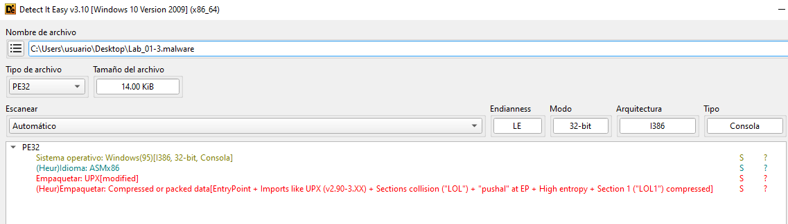
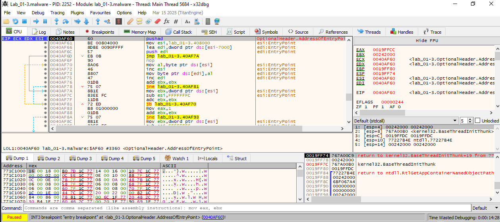
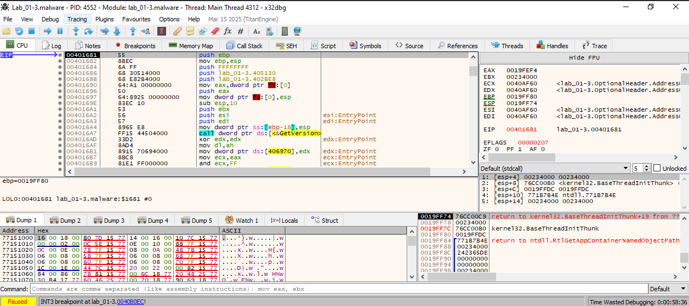

Firma:
```
file > sha256,212B29A8E36CCC8F65205122E33D84940A156A9A91329F747A713F988A157948
dos-stub > sha256,E9F12CE2F18E518C7373D057CA498BDD33A36F98C8C65554D99EF60C01AC4D4C
dos-header > sha256,3F4CA3CC0A0C57FAB2EAAE2F865502DCE5ABE084DC862052645EE362B87FEEDF
section > LOL1 > sha256,D9C0B93135D1A4A6E6DBCBF5DFE9501D6A5A75687BC89790BDB8B051E39DA3E3
section > .rsrc > sha256,64FCC1096B8875AF6608286AC8A3674B11CC272F3FB6C938E9E739B45D835EDF
```

------------------------------
```
file > name,c:\users\usuario\desktop\lab_01-3.malware
file > signature,Microsoft Linker 6.0 | UPX v0.8X
file > sha256,212B29A8E36CCC8F65205122E33D84940A156A9A91329F747A713F988A157948
file > info,size: 14336 bytes, entropy: 7.508
file > type,executable, 32-bit, console
stamp > compiler,Tue Nov 08 23:03:23 2011
resource > file,signature: unknown, offset: 0xFFFFF660, size: 32 bytes
languages > names,English-US
resources > info,count: 1, size: 32 bytes, file-ratio: 0.22%
file > version,n/a
section > virtualized,name: LOL0
entry-point > location,0x0000AF60 (section: LOL1)
section > writable,name: LOL0
sections > self-modifying,name: LOL0 | LOL1
certificate,n/a
libraries > flag,WININET.dll (Internet Extensions for Win32 Library)
libraries > flag,WS2_32.dll (Windows Socket Library)
imports > ordinal > count,1
imports > flag,InternetOpenA | VirtualAlloc | VirtualProtect
imphash > md5,50D7F396EA527DD2ED138CD2F1DFD49D
exports,n/a
overlay,n/a
```

------------------------------
VirusTotal:
https://www.virustotal.com/gui/file/212b29a8e36ccc8f65205122e33d84940a156a9a91329f747a713f988a157948

-------------------------------
```
PACKERS:
└─$ pepack Lab_01-3.malware -d db_packer.txt 
packer:                          UPX -> www.upx.sourceforge.net

1. Intentar desempaquetar con UPX
└─$ upx -d Lab_01-3.malware -o Lab_01-3_unpacked.exe
                       Ultimate Packer for eXecutables
                          Copyright (C) 1996 - 2024
UPX 4.2.4       Markus Oberhumer, Laszlo Molnar & John Reiser    May 9th 2024

        File size         Ratio      Format      Name
   --------------------   ------   -----------   -----------
upx: Lab_01-3.malware: CantUnpackException: file is modified/hacked/protected; take care!!!

Unpacked 0 files.
```

Significa que la muestra fue empacada originalmente con UPX, pero fue modificada después, probablemente para dificultar el análisis. Esto es común en malware: usan una versión de UPX modificada o alteran manualmente el encabezado después del empaquetado.


_______________________________________________

## 🔎 ¿Qué podemos hacer ahora?
✅ 1. Verificar con Detect It Easy (DIE)

DIE puede confirmar si el ejecutable sigue teniendo una firma reconocible de UPX y en qué secciones.


✅ 2. Forzar el desempaquetado manualmente

Ya que UPX no puede desempaquetar automáticamente, podemos:

🛠️ Opción A: Usar un desempaquetado manual en x64dbg

    Cárgalo en x64dbg (en una VM).

    Pon un breakpoint en OEP (Original Entry Point):

        Busca una instrucción tipo JMP EAX, PUSHAD, CALL, etc., que salte al código desempaquetado.

    Cuando llegue al código desenpaquetado:

        Ejecuta hasta que veas llamadas a funciones API típicas (GetProcAddress, LoadLibrary, etc.).

    Haz un dump de la memoria en ese punto con:

        x64dbg → menú contextual → Dump memory → Save .exe.

    Repara el dump con Scylla o ImpRec para reconstruir la Import Table.

🛠️ Opción B: Usar herramientas automáticas de dump

    Exeinfo PE (en Windows): te puede decir si es UPX modificado y sugerir herramientas para desempacar.

    unupx.py: script de Python para intentar recuperar binarios alterados.

    Qiling + LIEF: para análisis dinámico y reconstrucción de binarios.

💡 Pista: UPX alterado = trampa para analistas

El malware probablemente:

    Modificó el encabezado UPX.

    Inyectó basura o cifrado adicional.

    Protegió contra análisis (anti-debug, anti-VM, etc.).

  
    
---------------------------------
## Análisis con DIE
```
Empaquetador: UPX [modified]
(Heur)Empaquetar: Compressed or packed data
EntryPoint + Imports like UPX (v2.90-3.XX)
Sections collision ("LOL1") + "pushal" at EP + High entropy + Section 1 ("LOL1") compressed
```


UPX [modified]: El ejecutable fue empaquetado con UPX, pero el header o la estructura fue modificada posteriormente para evitar su desempaquetado con herramientas como upx -d. Este es un truco común en malware.

EntryPoint + Imports like UPX: El punto de entrada y los patrones de importación se parecen mucho a los de un binario UPX clásico, lo que confirma el origen.

Sections collision ("LOL1"): Esto sugiere que hay secciones que se solapan o están manipuladas, lo que no es normal en un binario legítimo. La sección llamada "LOL1" probablemente es inventada para confundir o romper herramientas de análisis.

"pushal" at EP: Instrucción PUSHAD en ensamblador x86, típica en binarios empaquetados para guardar el estado antes de desempaquetar el código en tiempo de ejecución. Aparece justo al inicio del código real que se ejecuta.

High entropy + compressed section: Altísima entropía = datos comprimidos o cifrados, muy posiblemente código empaquetado en la sección LOL1.


------------------------------------------
## 🪛 Desempaquetar en x64dbg

### 1. Copiamos el binario a una VM Windows aislada.

### 2. Abrimos x64dbg y cargamos Lab_01-3.malware.

### 3.Ejecutamos hasta pasar el stub de UPX.
Pulsamos F9 --> Como está activado el break point en el EntryPoint, x64dbg se detendrá directamente en el codigo empaquetado del ejecutable, el STUB UPX modificado, justo en el punto de entrada del binario empaquetado, como lo muestra esta línea:

```
0040AF60 | 60 | pushad
```
🧠 Esto es típico del código de desempaquetado: guarda los registros antes de modificar la memoria.




### 4. Avanzar hasta el OEP (Original Entry Point):
Vamos a seguir el flujo del stub hasta encontrar el código desempaquetado. Esto se hace paso a paso con F8 o avanzando hasta ver que el código tiene sentido.
- Seguimos con F8 y F9 hasta llegar al código "real" (desempaquetado en memoria).
- Señales de que estamos en el OEP: ves llamadas a GetProcAddress, LoadLibraryA, etc.

XXXX Captura foto

El OEP real del ejecutable ya desempaquetado (0x00401681). 🎯

```
00401681 55             push ebp
00401682 8BEC           mov ebp, esp
...
004016A8 FF15 [...]     call dword ptr [<&GetVersion>]
```

Estas son instrucciones claras y limpias de un ejecutable normal, no de un stub de desempaquetado. Has llegado al código real del malware. ✅

Además:
- Llamadas API (GetVersion)

- Estructura típica de prólogo de función (push ebp, mov ebp, esp)


Esto confirma 100% que estamos en el OEP.


### 5. El flujo de ejecución probablemente terminará en una instrucción POPAD:
```
POPAD
....
....
JMP LAB_00401681
```
👉 Ese JMP es el salto al código real desempaquetado.


**En la direccion 00401681 están las instrucciones desempaquetadas.**




### 6. Hacer un dump de memoria (para capturar el binario desempaquetado). Dump del binario desde memoria:
- Pestaña memory map.
- Nos situamos en el punto 00401681.
- Boton derecho: Dump to file.
- Guardamos esas instrucciones desempaquetadas como un nuevo fichero. Guardamos como Lab_01-3_dump.exe.

✅ Nuestro módulo desempaquetado está aquí:

En la línea:
```
00400000    lab_01-3.malware    "LOLO" "LOL1" ".rsrc"
```
Dirección base: 00400000 ✅

Nombre del módulo: lab_01-3.malware ✅

Este es el ejecutable cargado, ya desempaquetado en memoria.


Haz clic derecho sobre esa línea (00400000 lab_01-3.malware):  
    - Selecciona: ✅ Dump memory to file
    - Guarda el archivo como: Lab_01-3_dump.exe
    - Ya tenemos el volcado de memoria completo del binario desempaquetado.

    
    
En x64dbg:
- Ve al menú: File → Dump memory
- En la ventana que aparece:
    - Base address: asegúrate que sea 00400000 (normalmente lo es).
    - Size: puede ser entre 0x10000 y 0x200000 según el tamaño del binario. Si no sabes, puedes dejar el valor por defecto.
    - Marca las casillas:
        - ✅ Rebuild PE header
        - ✅ Fix raw size
    - Guarda el archivo como Lab_01-3_dump.exe.


### 7. Reconstruir Imports con Scylla

    Abre Scylla.

    Selecciona el proceso Lab_01-3.malware (si sigue abierto).

    En Scylla:

        Pulsa "IAT Autosearch"

        Luego: "Get Imports"

        Si todo está bien: pulsa "Fix Dump" y selecciona el archivo .dump.exe que acabas de guardar.

        Guarda como Lab_01-3_clean.exe.


### 8. Ahora tenemos un binario:

    Desempaquetado ✔️

    Con imports reconstruidos ✔️

    Listo para análisis con:

        🧠 Ghidra

        🔍 PE-bear

        🔬 strings, die, pestudio

        🐛 Sandbox, procmon, wireshark si quieres análisis dinámico


