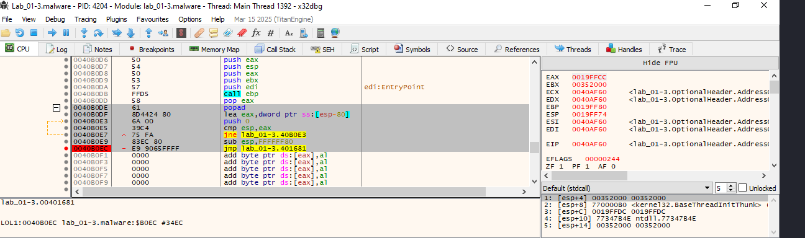

## Firma
```
file > sha256,212B29A8E36CCC8F65205122E33D84940A156A9A91329F747A713F988A157948
dos-stub > sha256,E9F12CE2F18E518C7373D057CA498BDD33A36F98C8C65554D99EF60C01AC4D4C
dos-header > sha256,3F4CA3CC0A0C57FAB2EAAE2F865502DCE5ABE084DC862052645EE362B87FEEDF
section > LOL1 > sha256,D9C0B93135D1A4A6E6DBCBF5DFE9501D6A5A75687BC89790BDB8B051E39DA3E3
section > .rsrc > sha256,64FCC1096B8875AF6608286AC8A3674B11CC272F3FB6C938E9E739B45D835EDF
```

------------------------------
## Info general

```
file > name,c:\users\usuario\desktop\lab_01-3.malware
file > signature,Microsoft Linker 6.0 | UPX v0.8X
file > sha256,212B29A8E36CCC8F65205122E33D84940A156A9A91329F747A713F988A157948
file > info,size: 14336 bytes, entropy: 7.508
file > type,executable, 32-bit, console
stamp > compiler,Tue Nov 08 23:03:23 2011
resource > file,signature: unknown, offset: 0xFFFFF660, size: 32 bytes
languages > names,English-US
resources > info,count: 1, size: 32 bytes, file-ratio: 0.22%
file > version,n/a
section > virtualized,name: LOL0
entry-point > location,0x0000AF60 (section: LOL1)
section > writable,name: LOL0
sections > self-modifying,name: LOL0 | LOL1
certificate,n/a
libraries > flag,WININET.dll (Internet Extensions for Win32 Library)
libraries > flag,WS2_32.dll (Windows Socket Library)
imports > ordinal > count,1
imports > flag,InternetOpenA | VirtualAlloc | VirtualProtect
imphash > md5,50D7F396EA527DD2ED138CD2F1DFD49D
exports,n/a
overlay,n/a
```

------------------------------
## VirusTotal
https://www.virustotal.com/gui/file/212b29a8e36ccc8f65205122e33d84940a156a9a91329f747a713f988a157948

-------------------------------
## ¿Está el malware empaquetado?
```
PACKERS:
└─$ pepack Lab_01-3.malware -d db_packer.txt 
packer:                          UPX -> www.upx.sourceforge.net

Intentamos desempaquetar con UPX
└─$ upx -d Lab_01-3.malware -o Lab_01-3_unpacked.exe
                       Ultimate Packer for eXecutables
                          Copyright (C) 1996 - 2024
UPX 4.2.4       Markus Oberhumer, Laszlo Molnar & John Reiser    May 9th 2024

        File size         Ratio      Format      Name
   --------------------   ------   -----------   -----------
upx: Lab_01-3.malware: CantUnpackException: file is modified/hacked/protected; take care!!!

Unpacked 0 files.
```

La muestra fue empaquetada originalmente con UPX, pero fue modificada después, probablemente para dificultar el análisis. Esto es común en malware: usan una versión de UPX modificada o alteran manualmente el encabezado después del empaquetado.


_______________________________________________

## 🔎 ¿Qué podemos hacer ahora?
✅ 1. Verificar con Detect It Easy (DIE)

DIE puede confirmar si el ejecutable sigue teniendo una firma reconocible de UPX y en qué secciones.


✅ 2. Forzar el desempaquetado manualmente

Ya que UPX no puede desempaquetar automáticamente, podemos:

**🛠️ Opción A: Usar un desempaquetado manual en x64dbg**
- Cárgalo en x64dbg (en una VM).
  - Poner un breakpoint en OEP (Original Entry Point): Buscamos una instrucción tipo JMP EAX, PUSHAD, CALL, etc., que salte al código desempaquetado.
- Cuando llegue al código desenpaquetado:
  - Ejecutamos hasta que veamos llamadas a funciones API típicas (GetProcAddress, LoadLibrary, etc.).
  - Hacemos un dump de la memoria en ese punto con: x64dbg → menú contextual → Dump memory → Save .exe.
- Reparamos el dump con Scylla o ImpRec para reconstruir la Import Table.

**🛠️ Opción B: Usar herramientas automáticas de dump**
- Exeinfo PE (en Windows): nos puede decir si es UPX modificado y sugerir herramientas para desempacar.
- unupx.py: script de Python para intentar recuperar binarios alterados.
- Qiling + LIEF: para análisis dinámico y reconstrucción de binarios.

**UPX alterado = trampa para analistas.**

El malware probablemente:
- Modificó el encabezado UPX.
- Inyectó basura o cifrado adicional.
- Protegió contra análisis (anti-debug, anti-VM, etc.).
  
---------------------------------
## Análisis con DIE
```
Empaquetador: UPX [modified]
(Heur)Empaquetar: Compressed or packed data
EntryPoint + Imports like UPX (v2.90-3.XX)
Sections collision ("LOL1") + "pushal" at EP + High entropy + Section 1 ("LOL1") compressed
```


**UPX [modified]:** El ejecutable fue empaquetado con UPX, pero el header o la estructura fue modificada posteriormente para evitar su desempaquetado con herramientas como upx -d. Este es un truco común en malware.

**EntryPoint + Imports like UPX:** El punto de entrada y los patrones de importación se parecen mucho a los de un binario UPX clásico, lo que confirma el origen.

**Sections collision ("LOL1"):** Esto sugiere que hay secciones que se solapan o están manipuladas, lo que no es normal en un binario legítimo. La sección llamada "LOL1" probablemente es inventada para confundir o romper herramientas de análisis.

**"pushal" at EP:** Instrucción PUSHAD en ensamblador x86, típica en binarios empaquetados para guardar el estado antes de desempaquetar el código en tiempo de ejecución. Aparece justo al inicio del código real que se ejecuta.

**High entropy + compressed section:** Altísima entropía = datos comprimidos o cifrados, muy posiblemente código empaquetado en la sección LOL1.


------------------------------------------
## 🪛 Desempaquetar en x64dbg

### 1. Copiamos el binario a una VM Windows aislada.

### 2. Abrimos x64dbg y cargamos Lab_01-3.malware.

### 3.Ejecutamos hasta pasar el stub de UPX.
Pulsamos F9 --> Como está activado el break point en el EntryPoint, x64dbg se detendrá directamente en el codigo empaquetado del ejecutable, el STUB UPX modificado, justo en el punto de entrada del binario empaquetado, como lo muestra esta línea:

```
0040AF60 | 60 | pushad
```
🧠 Esto es típico del código de desempaquetado: guarda los registros antes de modificar la memoria.


### 🔍 4.FUNCIÓN entry() — Análisis estructurado

[Función entry()](../decompilado/Funcion_entry.md)

#### 🟦 4.1. Desempaquetado en memoria (decrypted copy)
```
0040af60  PUSHAD
0040af61  MOV ESI, DAT_00408000       ; puntero al bloque de datos comprimido
0040af66  LEA EDI, [ESI - 0x7000]     ; destino donde se va a copiar/expandir

0040af70–0040b02a                     ; bucle complejo de descompresión
```
- Esta parte descomprime o copia el código malicioso real desde ESI a EDI, usando un algoritmo tipo LZ o RLE (con muchos ADC, MOV, JNZ, etc.).
- El código se desempaqueta dinámicamente y se coloca en una zona de memoria RWX.

#### 🟨 4.2. Decodificación de punteros y reubicaciones
```
0040b02a  POP ESI
0040b02b  MOV EDI, ESI
0040b037–0040b05c ; bucle que manipula punteros en el área desempaquetada
```
- Se corrigen direcciones relativas, posiblemente para funciones API importadas manualmente.
- Usa cálculos complejos sobre punteros y direcciones relativas → indica unloader manual o loader que prepara llamadas a funciones externas.

#### 🟩 4.3. Resolución de APIs (carga de DLLs + funciones)
```
0040b064–0040b0a9
```
- Lee nombres como "KERNEL32.DLL", "LoadLibraryA", "GetProcAddress".
- Usa llamadas a funciones ya resueltas (por dirección indirecta).
- Este bloque implementa un "resolver manual": carga dinámicamente DLLs (como KERNEL32.DLL, WININET.DLL) y obtiene punteros a funciones clave.
- Evita usar la IAT tradicional → técnica anti-análisis muy común.

#### 🟥 4.4. Limpieza de memoria, restauración del entorno y salto al payload
```
0040b0af–0040b0ec
```
- Cambia protecciones con `VirtualProtect`
- Limpia la stack
- POPAD (restaura registros)
- JMP 00401681 ; salto al payload real
- Restaura permisos de memoria (probablemente para quitar RWX).
- Limpia la pila para evitar rastros.
- Usa JMP para transferir ejecución al código real del malware: FUN_00401681.


#### 🎯 4.5 CONCLUSIÓN: ¿Qué hace la función entry()?
| Etapa	 | Función |
| -- | -- |
| Desempaquetado	| Copia y/o descomprime el cuerpo real del malware |
| Reubicación interna	| Corrige direcciones y punteros en tiempo de ejecución |
| Resolución API	| Carga dinámicamente DLLs y obtiene funciones con LoadLibrary y GetProcAddress |
| Salto al payload	| Transfiere el control al binario real desempaquetado (00401681) |

Es un stub loader clásico con capacidades anti-análisis.


### 5. El flujo de ejecución probablemente terminará en una instrucción POPAD:
```
0040B0DE  POPAD
....
....
0040B0DF  ..... JMP LAB_00401681
```
👉 Ese JMP es el salto al código real desempaquetado.




**En la direccion 00401681 están las instrucciones desempaquetadas.**


### 6. Avanzar hasta el OEP (Original Entry Point):
Vamos a seguir el flujo del stub hasta encontrar el código desempaquetado. Esto se hace paso a paso con F8 o avanzando hasta ver que el código tiene sentido.
- Seguimos con F8 y F9 hasta llegar al código "real" (desempaquetado en memoria).
- Señales de que estamos en el OEP: ves llamadas a GetProcAddress, LoadLibraryA, etc.


El OEP real del ejecutable ya desempaquetado (0x00401681). 🎯

```
00401681 55             push ebp
00401682 8BEC           mov ebp, esp
...
004016A8 FF15 [...]     call dword ptr [<&GetVersion>]
```

Estas son instrucciones claras y limpias de un ejecutable normal, no de un stub de desempaquetado. Hemos llegado al código real del malware.  Además vemos llamadas API (GetVersion) y vemos una estructura típica de prólogo de función (push ebp, mov ebp, esp). Esto confirma 100% que estamos en el OEP.


### 7. Hacer un dump de memoria (para capturar el binario desempaquetado). Dump del binario desde memoria:
- Pestaña memory map.
- Nos situamos en el punto 00401000.
- Boton derecho: Dump to file.
- Guardamos esas instrucciones desempaquetadas como un nuevo fichero. Guardamos como Lab_01-3_dump.exe.


✅ Nuestro módulo desempaquetado está aquí:

En la línea:
```
00400000    lab_01-3.malware    "LOLO" "LOL1" ".rsrc"
```
Dirección base: 00400000 ✅

Nombre del módulo: lab_01-3.malware ✅

Este es el ejecutable cargado, ya desempaquetado en memoria.


Haz clic derecho sobre esa línea (00400000 lab_01-3.malware):  
    - Selecciona: ✅ Dump memory to file
    - Guardamos el archivo como: Lab_01-3_dump.exe
    - Ya tenemos el volcado de memoria completo del binario desempaquetado.

    
    
En x64dbg:
- Vamos al menú: File → Dump memory
- En la ventana que aparece:
    - Base address: asegúrate que sea 00400000.
    - Size: puede ser entre 0x10000 y 0x200000 según el tamaño del binario. Si no sabes, puedes dejar el valor por defecto.
    - Marca las casillas:
        - ✅ Rebuild PE header
        - ✅ Fix raw size
    - Guardamos el archivo como Lab_01-3_dump-sin-imports-table.exe.


------------------------------
## Reconstruir Imports con Scylla

    Abre Scylla.

    Selecciona el proceso Lab_01-3.malware (si sigue abierto).

    En Scylla:

        Pulsa "IAT Autosearch"

        Luego: "Get Imports"

        Si todo está bien: pulsa "Fix Dump" y selecciona el archivo .dump.exe que acabas de guardar.

        Guardamos como Lab_01-3_dump-con-imports-table.exe.


------------------------------
## Ahora tenemos un binario:

    Desempaquetado ✔️

    Con imports reconstruidos ✔️

    Listo para análisis con:

        🧠 Ghidra

        🔍 PE-bear

        🔬 strings, die, pestudio

        🐛 Sandbox, procmon, wireshark si quieres análisis dinámico


------------------------------
## Obtenemos los strings del fichero con las instrucciones desempaquetadas

[Strings del malware desempaquetado](strings/Lab_01-3-copia_dump-desempaquetado-ascii.txt)


1. Indicadores de que el malware fue creado en Visual C++
```
Microsoft Visual C++ Runtime Library
Runtime Error!
R6025 - pure virtual function call
R6016 - not enough space for thread data
...
```

Esto indica que el binario se compiló probablemente con Microsoft Visual C++, y tiene vínculos con las librerías estándar de C++.

🌐 2. Capacidades de red detectadas
```
http://%s/%s/
Mozilla/4.0
InternetOpenA
InternetOpenUrlA
InternetCloseHandle
InternetReadFile
WININET.dll
WS2_32.dll
```
Este bloque indica que el malware:
- Puede realizar conexiones HTTP (probablemente a un C2).
- Simula un agente de usuario Mozilla/4.0.
- Usa WinINet, una API común de Windows para tráfico web.
- Usa funciones de bajo nivel (WS2_32.dll) para manejo de sockets.

🔺 Conclusión: tiene capacidades de beaconing y comunicación remota.

📦 3. Carga dinámica de funciones
```
LoadLibraryA
GetProcAddress
VirtualProtect
VirtualAlloc
VirtualFree
```
Estas funciones permiten:
- Cargar DLLs en tiempo de ejecución.
- Obtener punteros a funciones en ellas.
- Reservar, modificar y liberar memoria virtual.

🔺 Indica posible shellcode, desofuscación dinámica o self-injection.


🗃️ 4. Manejo de recursos y posibles strings personalizados
```
FindResourceA
LoadResource
LockResource
GlobalAlloc
SizeofResource
```
Esto sugiere que:
- El malware probablemente extrae recursos embebidos (como ejecutables, DLLs, payloads secundarios o configuraciones).
- Podría estar autocontenida con payloads ocultos en la sección .rsrc.

📌 5. Strings sospechosos / C2 / herramientas
```
http://%s/%s/
www.practicalmalwareanalysis.com
C:\Users\usuario\Desktop\Lab_01-3 - copia.exe
```
- Se detecta una plantilla para URLs → probablemente reemplazada en tiempo de ejecución.
- Referencia al entorno de análisis (usuario\Desktop...) → probablemente el entorno donde fue capturado el dump.

⚠️ 6. Otras funciones clave
```
ExitProcess
TerminateProcess
UnhandledExceptionFilter
GetCurrentProcess
SetHandleCount
GetStartupInfoA
HeapAlloc / HeapFree / HeapCreate
```
- Control de flujo, manejo de errores y heap manual → típico de malware más avanzado o ofuscado.

🧩 Resumen del comportamiento detectado
| Componente	 | Evidencia |
| -- | -- |
| Comunicación remota (C2)	 | InternetOpenUrlA, http://%s/%s/, Mozilla/4.0 |
| Carga dinámica de código	 | LoadLibraryA, GetProcAddress, VirtualProtect, VirtualAlloc |
| Desempaquetado / Shellcode	 | VirtualProtect, uso de .rsrc, SizeofResource, FlushFileBuffers |
| Autocontenidos / recursos	 | FindResourceA, LockResource, LoadResource, .rsrc |
| Persistencia o ejecución	 |ExitProcess, TerminateProcess, GetStartupInfoA |

**🚨 Conclusión:**  
La muestra desempaquetada tiene características típicas de malware con payload embebido, cifrado en recursos o secciones, y capacidades de conexión remota para posiblemente contactar con un servidor C2.

Además, se apoya en técnicas de evasión como carga dinámica de funciones y uso de memoria protegida, lo que sugiere que pudo haber sido ofuscado o construido como dropper/injector.

------------------------------
## Comparativa muestra sin desempaquetar VS muestra empaquetada

**Muestra empaquetada:**


**Muestra desempaquetada:**


------------------------------
## FUN_00401000
[FUN_0040100](../decompilado/FUN_00401000.md)


## FUN_004010b1
La función FUN_004010b1 implementa una rutina completa de codificación Base64 para una cadena de entrada.
🧠 ¿Qué hace?

Codifica una cadena en Base64, usando bloques de 3 bytes para producir bloques de 4 caracteres ASCII (según la tabla Base64).

🔒 ¿Por qué esto es relevante en malware?

Muchos malwares codifican datos en Base64 para:

    Evitar detección estática (strings codificadas).

    Encapsular datos binarios (payloads, shellcode).

    Transmisión por red sin problemas de formato.
    

------------------------------
## FUN_00401190

[FUN_00401190](../decompilado/FUN_00401190.md)

La función FUN_00401190 realiza una operación simple de ofuscación XOR por byte sobre una secuencia de datos.
🧠 ¿Qué hace exactamente?

Hace un bucle desde 0 hasta param_2 (cantidad de bytes) y:

    Lee un byte del buffer en param_1.

    Lo XORea con 0x3B.

    Escribe el resultado en el mismo lugar (operación in-place).
    

Esta técnica:

    Es extremadamente rápida y ligera.

    Evita que strings como "http://...", "cmd.exe" o payloads binarios sean visibles en texto plano.

    Puede ser usada antes/después de almacenar o enviar datos.

------------------------------
## FUN_004011c9

Parece ser la función principal de decodificación o preparación del payload en el malware. 

🧠 Función FUN_004011c9: ¿Qué hace?

Esta función parece:

    Inicializar múltiples buffers locales grandes en la pila.

    Realizar decodificación o desofuscación de datos almacenados probablemente como texto ofuscado (XOR, Base64, etc.).

    Llamar a funciones auxiliares que ya hemoss analizado:

        FUN_004010b1: codificación Base64.

        FUN_00401190: XOR con 0x3B.

        FUN_00401000: codificador Base64 para bloques de 3 bytes → 4 caracteres.

    Mover, copiar o transformar datos entre múltiples buffers.

    Preparar algo que será ejecutado o usado posteriormente (como una carga útil o un comando).

    
🧩 Pistas desde los nombres de variables

    local_154, local_158, local_35c, local_55c: Son buffers relativamente grandes, por lo que probablemente contienen datos codificados.

    local_34, local_54, local_10, etc.: Variables auxiliares, usadas como flags o iteradores.    

------------------------------
## FUN_00401300
La función FUN_00401300 es clave dentro del malware. Se encarga de cargar un recurso incrustado, descodificarlo (con una función XOR) y devolver un puntero al buffer listo para su uso.
Vamos a desglosarla por partes:
🧠 ¿Qué hace a alto nivel?

    Carga un recurso embebido (posiblemente un ejecutable, DLL, shellcode o string codificada).
    
    ❌ Si no se encuentra el recurso, muestra un mensaje: "Could not load exe." y termina.

    Obtiene un puntero a dicho recurso y su tamaño.

    Reserva memoria.

    Copia el recurso en memoria.

    Aplica una operación de descifrado XOR con la función FUN_00401190.

    Devuelve el puntero al buffer descifrado.
    
🎯 Conclusión: Propósito de FUN_00401300

Esta función se usa para:

    Cargar un recurso embebido (como un binario adicional o shellcode).

    Descifrarlo (XOR 0x3B).

    Reservar memoria ejecutable para su uso posterior.
    
------------------------------
## FUN_004013ed

La función FUN_004013ed parece ser el punto central de ejecución del payload. Organiza la ejecución del recurso desencriptado cargado previamente y actúa como un bucle de ejecución persistente. Vamos paso a paso para comprender su comportamiento.
🧠 ¿Qué hace FUN_004013ed?

    Llama a FUN_00401300 para obtener un puntero a datos (probablemente shellcode) desencriptados.

    Prepara una estructura en la pila y llama a FUN_00401476, que probablemente inicializa algo (puede ser un socket, pipe o evento).

    Si esa inicialización falla, entra en un bucle infinito tipo watchdog que:

        Llama a FUN_004011c9 (ejecuta el payload).

        Espera 30 segundos (Sleep(0x7530)).

        Vuelve a intentarlo si el resultado fue falso (0).

    Si no falla, llama a FUN_00401470 (que posiblemente termina o libera recursos).
    

💡 Este bucle se comporta como un watchdog thread que intenta ejecutar el payload continuamente hasta que tenga éxito. Vuelve a intentar ejecutar el payload (FUN_004011c9) cada 30 segundos.

🔍 Conclusión

Esta función es el "dispatcher" o lanzador principal del malware. Controla:

    La carga del payload.

    Su ejecución repetida hasta tener éxito.

    Un bucle persistente (watchdog).

    Y la liberación o continuación si todo sale bien.


    


    
------------------------------
## FUN_00401681
[FUN_00401681](../decompilado/FUN_00401681.md)

Es el código desempaquetador justo antes de saltar al código real del binario (el OEP 0401681).

La función FUN_00401681 es el punto de entrada real del malware, indica el comienzo de la ejecución del malware tras el desempaquetado.

La función FUN_00401681 es el punto de entrada principal del malware: se trata del main payload initializer o función principal que realiza la inicialización del entorno, ejecución del código malicioso y comunicación con el C2.
🧠 RESUMEN FUNCIONAL

La función:

    Establece un manejador de excepciones estructurado (SEH).

    Inicializa variables internas y obtiene valores del sistema.

    Llama a varias funciones con funcionalidades de:

        Carga y decodificación de ejecutable (FUN_00401300).

        Carga de estructuras (FUN_0040258a, FUN_004024d1).

        Configuración o decodificación de datos (FUN_004013ed).

    Ejecuta el payload real llamando a FUN_0040234d con punteros obtenidos dinámicamente.

    Evita crash silenciosamente y gestiona errores.
    
    
🔐 FINALIDAD

El malware:

    Inicializa su entorno (registro de excepciones, buffers, config).

    Recoge info del sistema (versión, módulo base).

    Descifra un payload en memoria (FUN_004013ed).

    Llama a una función obtenida dinámicamente desde ese payload (FUN_0040234d).

Este es el punto donde comienza la verdadera ejecución maliciosa del binario.
✅ CONCLUSIÓN

FUN_00401681 es el orquestador principal del malware. Si estás analizando cómo actúa esta muestra:

    Este punto marca la carga y ejecución del código cifrado en memoria.

    FUN_004013ed y FUN_0040234d son tus siguientes candidatos para análisis de comportamiento detallado.

    Todo antes de eso es infraestructura (preparación del entorno, evasión, carga de configuración).
    
--------------------------------------

| Función	| Rol |
| -- | -- |
| FUN_00401785	| Cierra el programa de forma controlada si falla la carga inicial. |
| FUN_004017a9	| Función personalizada para leer un byte desde una estructura tipo stream. |
FUN_00401681	Entrypoint principal del malware
FUN_004013ed	Bucle de persistencia/control principal
FUN_0040224b	Rutina de limpieza antes de salir
FUN_00402333	Ejecuta listas de funciones (atexit-like)
FUN_00402278 → FUN_0040229a	Maneja la terminación segura del proceso
__exit	Mapeo al ExitProcess del sistema

-------------------------------------
## FUN_0040258a

Esta función lee una ruta del entorno (C:\Users\usuario\Desktop\Lab_01-) y procesa alguna información relacionada con ese directorio o archivo. La ruta se copia, se utiliza como argumento en una función llamada FUN_00402623, y luego se reserva memoria basada en los valores devueltos.

Con alta probabilidad, esta función carga una tabla de excepciones, símbolos, o estructuras internas desde un archivo binario o estructura predefinida.

FUN_0040258a probablemente:

    Obtiene una ruta del sistema

    Llama a una función FUN_00402623 que calcula tamaño de datos y los carga

    Reserva memoria dinámica

    Almacena punteros globales para que otras funciones accedan a esta tabla cargada

Esto encaja con una lógica de loader o preparador de entorno. Podría estar cargando una tabla de símbolos, excepciones personalizadas o estructuras internas para el resto del ejecutable (posiblemente desempaquetado previamente).


--------------------------------------------

## FUN_0040234D
Esta función tokeniza (parsea) una cadena tipo línea de comandos, separando argumentos como lo haría un parser de argv de main(int argc, char **argv), respetando comillas, espacios, secuencias \\ y reglas de escape. También almacena resultados intermedios (conteo y punteros) en arrays dinámicos proporcionados por punteros externos.

🧠 Relación con el malware

Esta función es clave para:

    Interpretar la línea de comandos que el malware se autoinyecta

    Leer argumentos de configuración interna

    Preparar el entorno tras desempaquetarse (es habitual tras CreateProcess en packers)

    
    
--------------------------------------------
## FUN_00402ab4(int param_1)

La función FUN_00402ab4(int param_1) que has mostrado es una función sencilla pero crítica, porque reserva una región de memoria y llama a una función de inicialización adicional. Aquí tienes un análisis paso a paso:
🧠 Propósito general

Esta función intenta reservar memoria con VirtualAlloc (o una API similar) y, si tiene éxito, inicializa esa región llamando a FUN_00403ce5.

🛡️ Comportamiento sospechoso en malware

Esta función:

    Reserva memoria ejecutable o de datos para uso futuro (probablemente para shellcode o payload desencriptado).

    Llama a una función de inicialización que puede hacer:

        Desempaquetar código

        Decodificar datos cifrados

        Parchar funciones

        Instalar hooks

Es típico en stubs de carga de malware o fases de stage 1 unpackers.

--------------------------------------------
## FUN_00402cf9

Esta es la función clave que genera el mensaje "Runtime Error!" que se muestra al usuario.
🔍 Flujo simplificado

    Busca el mensaje de error asociado a code en una tabla DAT_00406408.

    Si no lo encuentra o está mal configurado, termina.

    Si lo encuentra:

        Intenta obtener el nombre del programa.

        Si no puede, usa "<program name unknown>".

        Construye un mensaje completo como:

        Runtime Error!
        Program: C:\Path\malware.exe
        R6008
        - not enough space for arguments

    Llama a MessageBoxA() o equivalente para mostrarlo en ventana emergente.

🎯 ¿Qué indica esto sobre el malware?

Estas funciones:

    Son parte de la infraestructura del runtime, probablemente copiada de un binario legítimo compilado con Visual Studio.

    Están activas cuando algo sale mal (como una corrupción de heap o mal manejo de argumentos).

    Dan soporte a un sistema de control de errores personalizado — muchas veces usado para ocultar la causa real de fallos al analista.

📌 Conclusión

Estas funciones no forman parte del payload malicioso directo, pero:

    Refuerzan que el ejecutable tiene un entorno SEH muy elaborado, probablemente por ser un packer, dropper o loader que necesita mantener el control incluso ante errores.

    Algunas llamadas como a FUN_00402cf9 sirven para mostrar un mensaje falso al usuario en caso de fallos, como distracción.

--------------------------------------------
## FUN_0040234D
[FUN_0040234D](../decompilado/FUN_0040234D.md)


Esta función actúa como un intérprete de tareas: procesa estructuras, valida estados, y llama a funciones que probablemente fueron resueltas dinámicamente.

Podría estar vinculada a:
- Un loader de payloads.
- Un sistema de plugin malicioso.
- Un intérprete de comandos enviado desde un servidor C2.

--------------------------------------------
## FUN_004024D1
[FUN_004024D1](../decompilado/FUN_004024D1.md)

FUN_004024D1 prepara una tabla dinámica con claves de entorno válidas, limpiando las originales y dejando todo en una estructura interna para su uso posterior. Es muy probable que el malware use esa tabla para configurar sus conexiones, comportamiento o autenticación.

------------------------------------------------

## FUN_004027D7

[FUN_004027D7](../decompilado/FUN_004027D7.md)

Extrae datos de recursos, memoria o strings ocultos.

Recorre memoria para calcular tamaño dinámicamente.

Reserva memoria y copia el contenido para uso posterior.


--------------------------------------------------
## FUN_FUN_00404ff0

🧩 Conclusión
Aspecto	Valor
📛 Nombre	FUN_00404ff0
📌 Función	Trampolín hacia una dirección externa contenida en DAT_00405090
📦 Uso	Parte del mecanismo de excepciones (__global_unwind2)
🎭 Posible propósito en malware	Redirección dinámica, hooking, evasión, control indirecto del flujo
🛠️ Técnicas relacionadas	IAT hooking, forwarders CRT, ofuscación


🧩 Conclusión

Este bloque representa cadenas constantes usadas para mostrar errores de ejecución críticos al usuario, tanto por:

    fallos matemáticos (TLOSS, SING, DOMAIN),

    errores del runtime (R6025, R6002...),

    o problemas de inicialización de heap, consola, entorno, etc.

No indican por sí mismos que sea malware, pero la presencia completa de estos errores puede ser aprovechada por código malicioso para mostrarse como un binario legítimo ante herramientas de análisis estático, o para esconder su funcionalidad real detrás de errores aparentes.

-----------------------------------------------

🚩 Posibles Indicadores de Comportamiento Malicioso
Técnica	Evidencia en funciones
Desempaquetado de payload en memoria	FUN_004039b0 (memcpy optimizado)
Anti-debug / evasión	Uso de funciones propias en lugar de memcpy
Singleton de inicialización	FUN_00403994
Uso directo de VirtualAlloc	FUN_00403ce5
Copia controlada con STD/CLD	Evita detection vía uso de APIs estándar

