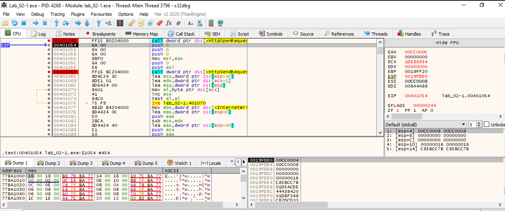
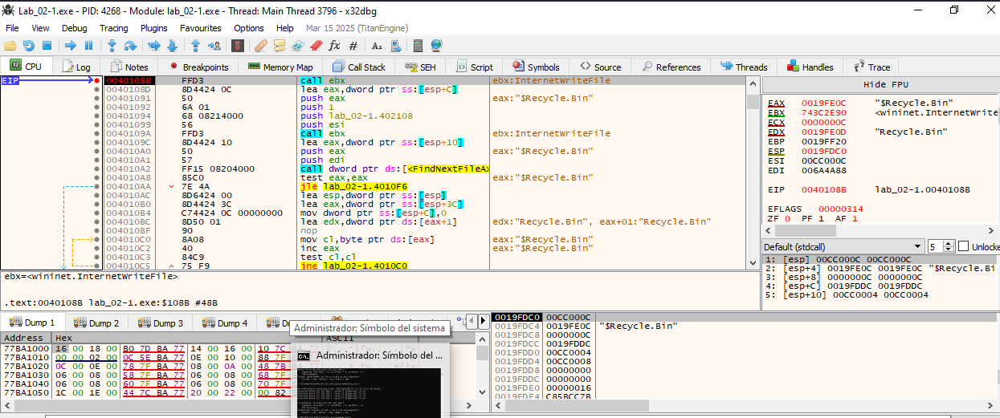
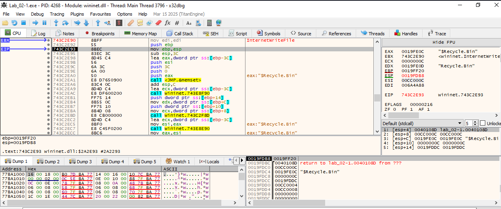
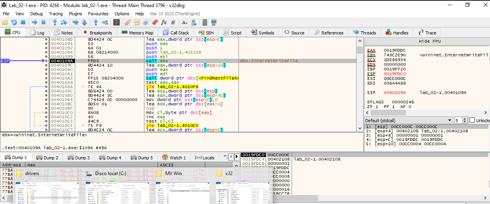
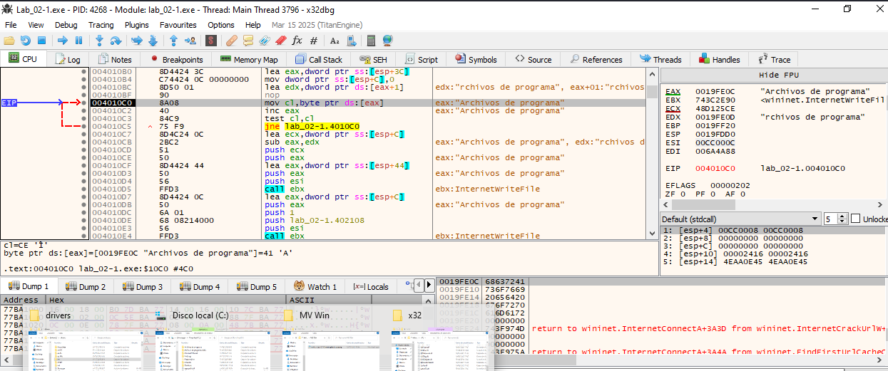
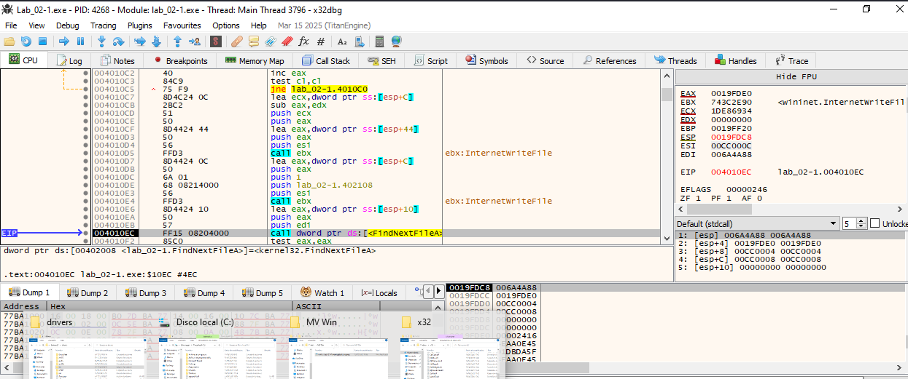
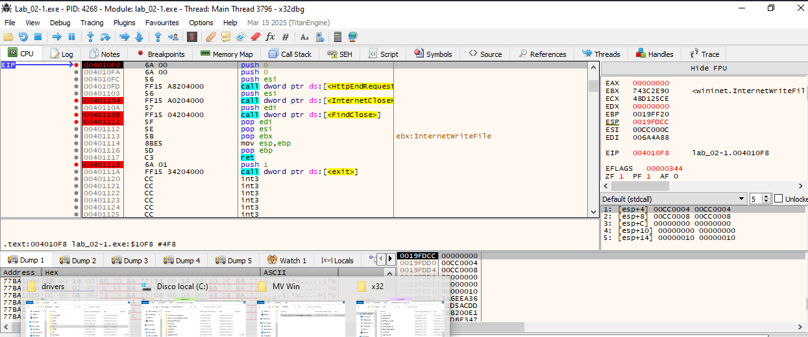
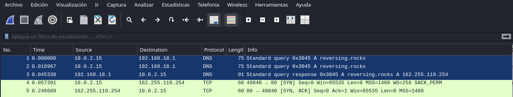

Se configura un MV Linux con Fakenet para que responda a la llamada del malware : resersingrocks:1234

Si hay respuesta en reversing.rocks entonces el malware --> FUN_00401000 --> lista los ficheros de c: --> cierra conexiones y termina.


```
MV linux:
192.168.100.1
255.255.255.0
0.0.0.0
Configuracion de /etc/hosts --> 192.168.100.1 resersing.rocks
Configuración de Fakenet --> fichero default.init
Hay que arrancar FakeNet
--------------------------------------


MV Win
192.168.100.5
255.255.255.0
192.168.100.1
En c:\Windows\System32\drivers\etc\hosts --> 192.168.100.1 reversing.rocks


Comprobar en Windws que se comunica con la MV Linux:
ping 192.168.100.1
nslookup reversing.rocks
Mostrar capturas de pantala de la activación.
```

---------------------
Capturar el tráfico desde la MV Linux:
sudo tcpdump -i enp0s3 -w trafico-MV-Linux.pcap


-------------------------------------
## Añadiendo breakpoints en x32dbg para ver el funcionamiento del malware 

🔹 1. FUN_00401000 – Exfiltración HTTP
🔸 Dirección: 00401000
Acción: Ctrl+G → escribe 00401000

Puntos importantes para F2 (breakpoint):

0040101b → llamada a FindFirstFileA

0040104e → llamada a HttpOpenRequestA

0040105f → llamada a HttpSendRequestExA

0040108b → llamada a InternetWriteFile (envío de datos)

004010f8 → HttpEndRequestA

00401104 → InternetCloseHandle

0040110b → FindClose

🔍 Objetivo: Ver cómo itera archivos y los exfiltra por HTTP.

🔹 2. FUN_00401130 – Función puente
🔸 Dirección: 00401130
Acción: Ctrl+G → escribe 00401130

Pon breakpoint en 00401185 → es donde se llama a FUN_00401000.

🔍 Objetivo: Ver cuándo se lanza el envío de archivos.

🔹 3. FUN_004011a0 – Inicialización / Setup
🔸 Dirección: 004011a0
Acción: Ctrl+G → escribe 004011a0

Marca F2 en la primera instrucción

Observa si hay llamadas como CreateThread, LoadLibrary, GetProcAddress, Sleep, etc.

🔍 Objetivo: Analizar si esta función configura el entorno antes de lanzar la lógica maliciosa.


🔸 Dirección: 00401080  - Donde carga un nuevo fichero de la carpeta c:

------------------------------






















