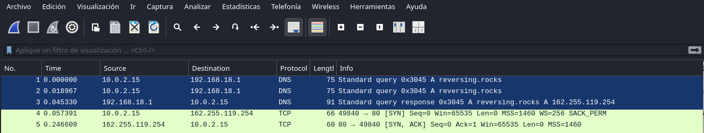

## Analisis trafico de red 

### Petición para resolver la IP de reversing.rocks:



Este fragmento de tráfico de red muestra una resolución DNS del dominio reversing.rocks, probablemente realizada por el malware al inicio de su ejecución. Analicemos cada línea:
```
📊 Análisis de los paquetes
No.	Tiempo	Origen	Destino	Protocolo	Info
1	0.000	10.0.2.15	192.168.18.1	DNS	Consulta A para reversing.rocks
2	0.018	10.0.2.15	192.168.18.1	DNS	Reintento de consulta A (ID igual: 0x3045)
3	0.045	192.168.18.1	10.0.2.15	DNS	Respuesta A: reversing.rocks → 162.255.119.254
```
- El sistema (posiblemente el malware) envía una consulta DNS para obtener la IP de reversing.rocks.
- Hay un pequeño reintento, que puede deberse a una pérdida momentánea de paquete o una espera corta sin respuesta inmediata.
- Finalmente, recibe como respuesta la IP 162.255.119.254, que ya sabemos que el malware intenta contactar después en el puerto 1234.


Este tráfico:
- Confirma que reversing.rocks es el dominio C2 (Command & Control) del malware.
- La IP 162.255.119.254 obtenida es usada en los intentos de conexión posteriores.


### Conexión inicial a puerto 80 (HTTP):
```
49840 → 80 [SYN]
80 → 49840 [SYN, ACK]
49840 → 80 [ACK]
49840 → 80 [FIN, ACK]
80 → 49840 [ACK]
```
✅ Esto indica una conexión TCP completada y cerrada inmediatamente sin transferencia de datos HTTP. Podría ser una prueba de conectividad o un mecanismo para comprobar disponibilidad del servidor.

### Intento de conexión al puerto 1234:
```
49841 → 1234 [SYN]
Retransmisiones sucesivas...
49842 → 1234 [SYN]
....Más retransmisiones...
```

⚠️ Aquí el malware está intentando abrir una conexión hacia el puerto 1234 del servidor remoto 162.255.119.254, pero no obtiene respuesta alguna, lo que da lugar a múltiples retransmisiones durante 30+ segundos.

### Interpretación
- Puerto 1234 es un puerto comúnmente usado por malware y shells reversas (Netcat, backdoors personalizados, C2).
- Este comportamiento sugiere que la muestra de malware está programada para conectarse a un servidor de comando y control (C2) en el puerto 1234.
- El hecho de que no haya respuesta indica:
    - El C2 ya no está activo.
    - Está detrás de un firewall.
    - O el dominio/IP fue sustituido y el malware quedó obsoleto.


### Conclusión. El tráfico capturado evidencia:
- Intento de conexión válido al puerto 80, pero sin datos (probablemente prueba de vida).
- Persistentes intentos fallidos al puerto 1234, lo cual confirma funcionalidad de comunicación con C2.
