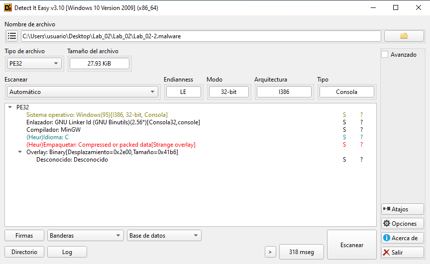
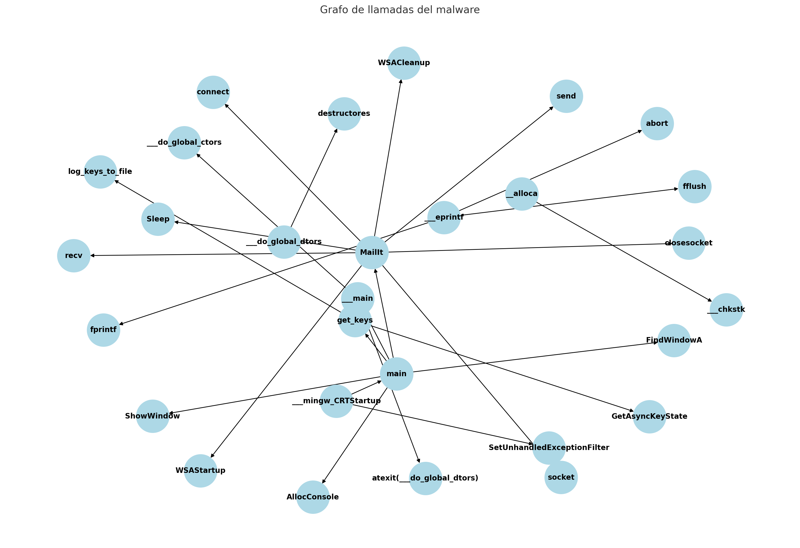

```
└─$ pepack Lab_02-2.malware -d db_packer.txt                 
packer:                          Dev-C++ 4.9.9.2 -> Bloodshed Software
```   
  
- El binario fue compilado usando Dev-C++ 4.9.9.2, lo cual es un IDE que utiliza el compilador mingw32 de GCC para Windows.
- No está empaquetado con una herramienta tradicional de protección de binarios.
- Puede tener ofuscación a nivel de código fuente o cifrado manual, pero no a nivel de empaquetado PE.
- El malware puede desencriptar datos o strings en tiempo de ejecución, o tener sus funciones cifradas, pero no está comprimido/oculto con un packer PE.


### Análisis DIE



🟡 Información general:
```
Tipo: PE32 (ejecutable de 32 bits)
Modo: Consola
Compilador: MinGW (GCC)
Linker: GNU Bintutils (ld) v2.56
Lenguaje: C
```

🟥 Indicadores sospechosos / heurísticos:
- Heur/Empaquetar: Compressed or packed data (Strange overlay): El motor heurístico de DIE detecta datos empaquetados o comprimidos, especialmente por la presencia de un overlay inusual.
- Overlay: Binary(Desplazamiento=0x2e00, Tamaño=0x41b6):
  - Hay un overlay PE (datos que están después del final de la última sección PE).
  - Desplazamiento 0x2e00 (11.264 bytes)
  - Tamaño 0x41b6 (16.694 bytes)

**Esto puede indicar datos cifrados o un payload embebido manualmente.**

🚩 ¿Qué es un overlay en un binario PE?: Un overlay es una región que no pertenece a ninguna sección PE legítima. Puede usarse para:
- Esconder payloads que serán leídos o desencriptados en tiempo de ejecución.
- Evitar análisis estático directo, ya que no está cargado por el loader PE.
- Implementar un dropper o loader que desempaqueta código a memoria.

**Extraer el overlay para analizarlo:**
```
dd if=Lab_02-2.malware of=overlay.bin bs=1 skip=11776 count=16790
(11776 = 0x2e00, 16790 = 0x41b6)
```

**Analizar el overlay extraído:** Extraemos strings del fichero overlay.bin
- Buscamos encabezados (¿es un archivo PE, ZIP, CAB, etc.?)

**Revisaremos el binario principal en Ghidra o IDA:**
- Buscamos llamadas a fopen, CreateFile, fread, ReadFile, memcpy, etc.
- Fíjate si el binario lee el final de sí mismo (overlay) → eso confirmaría que desencripta su contenido.

**Fichero overlay:**    
[overlay.cim](../muestra/overlay.txt)

El contenido parece una mezcla de:
- Símbolos de depuración
- Nombres de funciones y secciones PE
- Símbolos de la CRT (C Runtime)
- Nombres de archivos fuente: main11.cpp, crtstuff.c, CRTfmode.c, etc.
- Funciones de interés como:
  - __Z6MailItPcS_S_S_S_
  - __Z8get_keysv
  - gethostbyname@4
  - WSAStartup@8, socket@12, connect@12, send@16, recv@16, closesocket@4
  - GetAsyncKeyState@4
  - fopen, fread, fwrite, memcpy, malloc, free, etc.

**Conclusiones del overlay:**  
✅ 1. No está comprimido ni cifrado: Aunque Detect It Easy marcaba "Compressed or packed data", esto era un falso positivo heurístico. El contenido está en texto plano y es legible.  
✅ 2. Contiene símbolos de depuración: Estos símbolos normalmente se eliminan en malware real. Su presencia sugiere que es un binario de laboratorio educativo, como el que propone RPISEC en sus ejercicios.  
✅ 3. Funciones personalizadas: Esto indica que hay alguna rutina criptográfica personalizada que será importante analizar.  
    - __Z6MailItPcS_S_S_S_: probable función ofuscada o en C++ con nombre mangled.  
    - __Z8get_keysv: parece una función que devuelve claves (probablemente de cifrado).  
✅ 4. Actividad de red: Con las funciones como:  
    - WSAStartup, socket, connect, send, recv, closesocket  
    - …es muy probable que el malware establezca una conexión con un servidor remoto (C2).  
✅ 5. Keylogger potencial: La función GetAsyncKeyState@4 sugiere registro de pulsaciones de teclado.  

---------------------------------------

### Conclusión del análisis de red
| Función	| Propósito |
| -- | -- |
| WSAStartup	| Inicializa stack Winsock |
| gethostbyname	| Resuelve dominio my.inbox.com |
| socket	| Crea socket TCP/IP |
| connect	| Conecta al puerto 25 del servidor SMTP |
| send	| Envía comandos SMTP y el mensaje con información |
| recv	| Lee respuestas del servidor |
| closesocket	| Cierra el canal TCP tras el envío |


-----------------------------------------

### Análisis de la muestra (overlay.txt)

| Categoría	| Descripción |
|  -- | -- |
| Keylogger	| Usa GetAsyncKeyState para capturar teclas presionadas |
| Conexión a red	| Usa socket y connect (de WS2_32.dll) para comunicarse con C2 |
| Manipulación de ventanas	| Usa FindWindowA y ShowWindow para ocultarse |
| Persistencia oculta	| Posible uso de átomos de sistema (AddAtomA, FindAtomA, GetAtomNameA) |
| Carga dinámica	| Funciones jmp a IAT (Import Address Table) en USER32.dll, KERNEL32.dll, MSVCRT.dll |
| Encubrimiento	| Uso de Sleep para retrasar ejecución, SetUnhandledExceptionFilter para trampas |


### Indicadores de comportamiento:
| Comportamiento |	Evidencia técnica |
|  -- | -- |
| Keylogging básico |	Llamada a GetAsyncKeyState dentro de get_keys |
| Comunicación remota (C2) |	Llamadas a socket, connect |
| Registro persistente |	Uso de funciones relacionadas con átomos (AddAtomA, FindAtomA) |
| Antianálisis básico |	Sleep, SetUnhandledExceptionFilter |
| Ocultamiento de consola |	ShowWindow(..., SW_HIDE) tras AllocConsole o FindWindowA |


### API Importadas de forma crítica

WS2_32.dll:

    socket, connect

KERNEL32.dll:

    AddAtomA, FindAtomA, GetAtomNameA

    Sleep, ExitProcess

    AllocConsole, SetUnhandledExceptionFilter

USER32.dll:

    FindWindowA, ShowWindow, GetAsyncKeyState

MSVCRT.dll:

    Funciones estándar: fopen, fputs, fread, strcat, strlen, exit, abort, fprintf, malloc, free

💣 Conclusión

Esta muestra es un malware tipo keylogger con capacidades de persistencia y comunicación remota. Es altamente probable que tenga funcionalidad para:

    Registrar pulsaciones de teclas de forma continua.

    Guardarlas y enviarlas a un servidor remoto.

    Ocultarse de la vista del usuario.

    Usar Sleep y UnhandledExceptionFilter para evadir entornos de análisis automáticos.

    Emplear átomos para mantener estados o identificadores únicos persistentes en el sistema (método poco común, pero eficaz para persistencia no convencional).
    
--------------------------------------------------------------------

🧠 Funciones críticas a analizar en detalle
🟠 Inicio y preparación

    _main (004012b5)

        Punto de entrada principal. Ejecuta toda la lógica maliciosa.

        Llama a:

            ___main (setup)

            AllocConsole, FindWindowA, ShowWindow

            Funciones propias como get_keys, MailIt.

    ___main (00402330)

        Se asegura de que los constructores globales se ejecuten una sola vez.

        Registra ___do_global_dtors con atexit.

    ___mingw_CRTStartup

        Configura entorno de ejecución de MinGW, llama a mainCRTStartup, establece SetUnhandledExceptionFilter.

🟣 Keylogger

    get_keys

        Usa GetAsyncKeyState para capturar pulsaciones.

        Filtra y formatea teclas especiales (ENTER, SHIFT, CTRL, etc.).

        Guarda logs y probablemente llama a funciones para enviarlos.

🔵 Exfiltración / Comunicación con el atacante

    MailIt

        Llama repetidamente a Sleep, connect, send, recv.

        Posible envío de datos por red (C2, correo falso o conexión TCP directa).

        Usa strings como unknown-g@hotmail.co.uk, my.inbox.com.

    Funciones relacionadas a sockets:

        WSAStartup, socket, connect, send, recv, closesocket, WSACleanup

        Estas se usan en MailIt u otra función C2.

🟡 Gestión de errores y mensajes

    ___eprintf

        Redirige errores a MSVCRT::_iob + 0x40 (stderr).

        Llama a fprintf, fflush, y termina con abort.

        No suele ser clave, pero puede usarse como anti-debug si el malware quiere autodestruirse ante errores.

🟢 Carga, persistencia o técnicas de evasión

    __alloca y ___chkstk

        Usados para manipulación manual de la pila.

        Puede ser parte de técnicas anti-análisis o para evadir detección.

    _SetUnhandledExceptionFilter@4

        Evita que el malware se caiga en caso de errores — típico en malware para ocultar fallos.

⚙️ Inicialización automática del binario

    ___do_global_ctors / ___do_global_dtors

        Ejecutan funciones en arrays tipo .ctors y .dtors.

        Suelen usarse para que el código malicioso se ejecute antes/después del main.

✅ Recomendación de análisis

Para entender el malware en profundidad, sigue este orden:

    main → qué hace y a quién llama.

    get_keys → qué captura, cómo lo guarda o envía.

    MailIt → si envía los logs por red, a qué IP o dominio.

    ___main / ___do_global_ctors → inicializaciones ocultas.

    Todas las llamadas a API de red (Winsock).

    Uso de __alloca, Sleep, SetUnhandledExceptionFilter → posibles evasiones.

    Strings relacionadas con logs, rutas de archivos, correo, etc.
    
----------------------------------


🧠 Funciones a analizar en detalle:
1. main

    Punto de entrada del malware.

    Llama a ___main, AllocConsole, FindWindowA, ShowWindow, get_keys, y MailIt.

2. get_keys

    Usa GetAsyncKeyState para capturar teclas.

    Guarda la información en archivo usando funciones como fopen, fputs o fprintf.

    Clave para identificar funcionalidad de keylogger.

3. MailIt

    Encargada de enviar datos capturados:

        Usa WSAStartup, socket, connect, send, recv, closesocket, WSACleanup, Sleep.

        Implementa comunicación de red con el atacante (probable C2).

    Muy relevante para detectar exfiltración de datos.

4. ___main

    Ejecuta constructores y registra destructores (atexit).

    Necesaria para entender el setup del runtime y ejecución de código estático.

5. ___eprintf

    Envía errores a stderr y luego ejecuta abort.

    Puede actuar como mecanismo de protección o señal de fallo deliberado.

6. __alloca / ___chkstk

    Gestionan el stack manualmente.

    Pueden ser usadas para evasión o protección, aunque aquí parecen parte de runtime estándar MinGW.

🕵️‍♀️ Sugerencia de orden de análisis:

    main

    get_keys

    MailIt

    ___main

    ___eprintf

    __alloca
    
------------------
