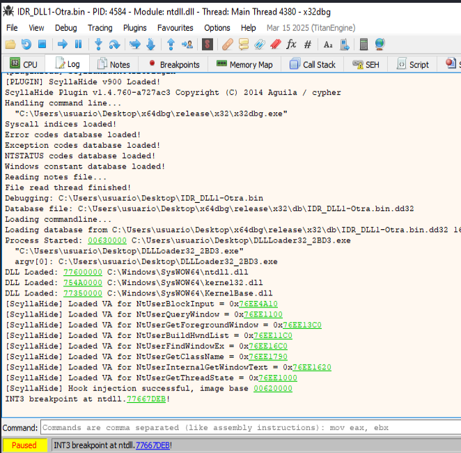

## Análisis empaquetado
```
└─$ pepack Lab_03-1.malware -d db_packer.txt 
packer:                          Microsoft Visual C++ 8
```          

## VirusTotal
https://www.virustotal.com/gui/file/dce7c942883810c535fab689ece1e366287336c79ed15c808038bb5863eddf66


## Firma
```
file,
file > sha256,DCE7C942883810C535FAB689ECE1E366287336C79ED15C808038BB5863EDDF66
file > first 32 bytes (hex),4D 5A 90 00 03 00 00 00 04 00 00 00 FF FF 00 00 B8 00 00 00 00 00 00 00 40 00 00 00 00 00 00 00 
file > first 32 bytes (text),MZ............................................@..............
file > info,size: 30208 bytes, entropy: 5.540
file > type,executable, 32-bit, console
file > version,n/a
file > description,n/a
entry-point > first 32 bytes (hex),E8 93 03 00 00 E9 7A FE FF FF 55 8B EC 6A 00 FF 15 44 20 40 00 FF 75 08 FF 15 48 20 40 00 68 09 
entry-point > location,0x0000130D (section[.rdata])
file > signature,Microsoft Linker 14.0 | Visual Studio 2008
,
stamps,
stamp > compiler,Fri Sep 18 06:57:04 2015 (UTC)
stamp > debug,Fri Sep 18 06:57:04 2015 (UTC)
stamp > resource,n/a
stamp > import,n/a
stamp > export,n/a
,
names,
file > name,c:\users\usuario\desktop\lab_03-1.malware
debug > file,C:\Users\IEUser\Downloads\BHOinCPP_src\BHOinCPP\Release\launch.pdb
export,n/a
version,n/a
manifest,n/a
.NET > module > name,n/a
certificate > program-name,n/a
```


----------------------------------
### Info general
```
file > name,c:\users\usuario\desktop\lab_03-1.malware
file > signature,Microsoft Linker 14.0 | Visual Studio 2008
file > sha256,DCE7C942883810C535FAB689ECE1E366287336C79ED15C808038BB5863EDDF66
file > info,size: 30208 bytes, entropy: 5.540
file > type,executable, 32-bit, console
virustotal > score,No se pudo resolver el nombre de servidor o su dirección
stamp > compiler,Fri Sep 18 06:57:04 2015
resource > file,signature: executable, offset: 0x000020D0, size: 20480 bytes
languages > names,English-US
resources > info,count: 2, size: 20861 bytes, file-ratio: 69.06%
manifest > general,name: n/a, description: n/a, severity: asInvoker
file > version,n/a
entry-point > location,0x0000130D (section: .text)
string > url-pattern,http://rpis.ec/
string > url-pattern,http://rpis.ec/binexp
string > url-pattern,https://twitter.com/RPISEC
string > url-pattern,https://www.facebook.com/RPI-Computer-Security-Club-RPISEC-121207327959689/timeline/
string > url-pattern,http://blog.rpis.ec/
string > url-pattern,http://security.cs.rpi.edu/courses/binexp-spring2015/
certificate,n/a
imports > flag,GetCurrentProcess | GetCurrentProcessId | GetCurrentThreadId | WriteFile
imphash > md5,1441F76B3ED03715E5648E74DBC58C19
exports,n/a
overlay,n/a
```
-------------------------------------------------------------
### Footprinting
```
file > sha256,DCE7C942883810C535FAB689ECE1E366287336C79ED15C808038BB5863EDDF66
dos-stub > sha256,990552C80CA4FC9D9D5790DBD258569564B9C12A2C6A5BF8DFE6A8264CE03286
dos-header > sha256,ACD17D187F9C0BF0DF5C5DB8A94CCE4C34CE80757A2FFCED65286BCFE0A0E91B
rich-header > sha256,6C778B546873E5B8819ECAF1358A1C0212A52937D0F5B9C0B6D5975E49CB7AB2
section > .text > sha256,09B08612A7F13D45966DBC6AECE9586A1A7229990ED1964343E9A6ABC62EB773
section > .rdata > sha256,370C35AD66488E14EE4C76085B8FC60046284446B9DF0DFE44CB0A9A07507A16
section > .data > sha256,001CC148D185D7D29246EFF5375F33B25CB070B959413A1F8DCF1EC3A4475BBD
section > .rsrc > sha256,6DE3425063A83E93E50C4F6F891610F96C08184817CB4A2DD3B2631C8E06B4AB
section > .reloc > sha256,B0785D0FCDF9959871174AF0FAB4500CBAD8A0158707BC75F4E135CF52DB5563
executable > sha256,00ECF17B51E5B8264E77483B0F60F4BF45043AA39F9E5A03369A3DC43357987C
manifest > sha256,4BB79DCEA0A901F7D9EAC5AA05728AE92ACB42E0CB22E5DD14134F4421A3D8DF
debug > RSDS > sha256,58AA35A551B154B8D9D3323A94C0414AB9CA051BA6D0D97A013415C951CE3A8C
debug > vcFeature > sha256,90A5B46EE96203AA8F35B38065376C4C236AD164F021ECE50D8C1A5F4C610EAC
debug > PGO > sha256,825A7E4023E1681B9771F3D7B84D2C7A61C7013CD704FEAE114E7A3DAD823F3B
,
special,
imphash > md5,1441F76B3ED03715E5648E74DBC58C19
```

--------------------------------------------------

### Sections
```
section,section[0],section[1],section[2],section[3],section[4]
name,.text,.rdata,.data,.rsrc,.reloc
section > sha256,09B08612A7F13D45966DBC6AECE9586A1A7229990ED1964343E9A6ABC62EB773,370C35AD66488E14EE4C76085B8FC60046284446B9DF0DFE44CB0A9A07507A16,001CC148D185D7D29246EFF5375F33B25CB070B959413A1F8DCF1EC3A4475BBD,6DE3425063A83E93E50C4F6F891610F96C08184817CB4A2DD3B2631C8E06B4AB,B0785D0FCDF9959871174AF0FAB4500CBAD8A0158707BC75F4E135CF52DB5563
entropy,5.933,4.680,0.280,5.605,4.805
file > ratio (96.61%),11.86 %,10.17 %,1.69 %,71.19 %,1.69 %
raw-address (begin),0x00000400,0x00001200,0x00001E00,0x00002000,0x00007400
raw-address (end),0x00001200,0x00001E00,0x00002000,0x00007400,0x00007600
raw-size (29184 bytes),0x00000E00 (3584 bytes),0x00000C00 (3072 bytes),0x00000200 (512 bytes),0x00005400 (21504 bytes),0x00000200 (512 bytes)
virtual-address (begin),0x00001000,0x00002000,0x00003000,0x00004000,0x0000A000
virtual-address (end),0x00001CAD,0x00002B6E,0x00003384,0x00009250,0x0000A158
virtual-size (28487 bytes),0x00000CAD (3245 bytes),0x00000B6E (2926 bytes),0x00000384 (900 bytes),0x00005250 (21072 bytes),0x00000158 (344 bytes)
,,,,,
characteristics,0x60000020,0x40000040,0xC0000040,0x40000040,0x42000040
write,-,-,x,-,-
execute,x,-,-,-,-
share,-,-,-,-,-
self-modifying,-,-,-,-,-
virtual,-,-,-,-,-
,,,,,
items,,,,,
directory > import,-,0x00002574,-,-,-
directory > resource,-,-,-,0x00004000,-
directory > relocation,-,-,-,-,0x0000A000
directory > debug,-,0x00002190,-,-,-
directory > load-configuration,-,0x00002200,-,-,-
directory > import-address,-,0x00002000,-,-,-
manifest,-,-,-,0x000070D0,-
base-of-code,0x00001000,-,-,-,-
base-of-data,-,0x00002000,-,-,-
entry-point > location,0x0000130D,-,-,-,-
debug > RSDS,-,0x00001464,-,-,-
debug > vcFeature,-,0x000014C0,-,-,-
debug > PGO,-,0x000014D4,-,-,-
file (signature: executable, size: 20480 bytes),-,-,-,0x000020D0,-
```

----------------------------------------


## x32dbg Log



🔎 CONTEXTO GENERAL DE LA CAPTURA

    El binario IDR_DLL1-Otra.bin está siendo depurado.

    El proceso padre que ejecuta el binario es DLLLoader32_2BD3.exe, una técnica común para cargar DLLs maliciosas (sideloading).

    Se han cargado varias librerías importantes, incluyendo:

        ntdll.dll en 0x77600000

        kernelbase.dll en 0x754A0000

    El plugin ScyllaHide está activo: indica que se han hookeado múltiples funciones relacionadas con detección de depuración como NtUserFindWindowEx, NtUserGetForegroundWindow, etc.

🔐 SOBRE IsDebuggerPresent

    Aunque en este punto no aparece explícitamente IsDebuggerPresent, estás buscando evitar que el malware detecte el depurador.

    El INT3 breakpoint que has puesto en:

    ntdll.77667DEB

    indica que probablemente estás intentando interceptar una llamada que se utiliza para detectar depuradores o realizar trampas anti-debug.

🧠 ¿Por qué no ves aún IsDebuggerPresent?

    Esa API está en KERNEL32.dll, pero puede que aún no se haya cargado o utilizado.

    También es posible que el malware use NtQueryInformationProcess o incluso funciones personalizadas en lugar de IsDebuggerPresent.

✅ CONCLUSIONES Y SUGERENCIAS

    🔍 Revisa la pestaña "Imports" cuando estés en el módulo de tu DLL (IDR_DLL1-Otra.bin) o el Loader32.exe. Busca:

        IsDebuggerPresent

        NtQueryInformationProcess

        CheckRemoteDebuggerPresent

        GetTickCount, QueryPerformanceCounter, GetLastError, CloseHandle (técnicas indirectas)

    ⛔ Si el malware evade o crashea al ejecutarse en x32dbg:

        ScyllaHide puede ayudarte, pero asegúrate de activar los perfiles correctos y comprobar si el malware sigue detectando algo.

    ⛏️ Usa Ctrl + R → escribe IsDebuggerPresent para encontrar la dirección rápidamente.

    🧩 Puedes establecer un breakpoint en KERNEL32.IsDebuggerPresent manualmente:

bp KERNEL32.IsDebuggerPresent

O también:

bp kernel32!IsDebuggerPresent
