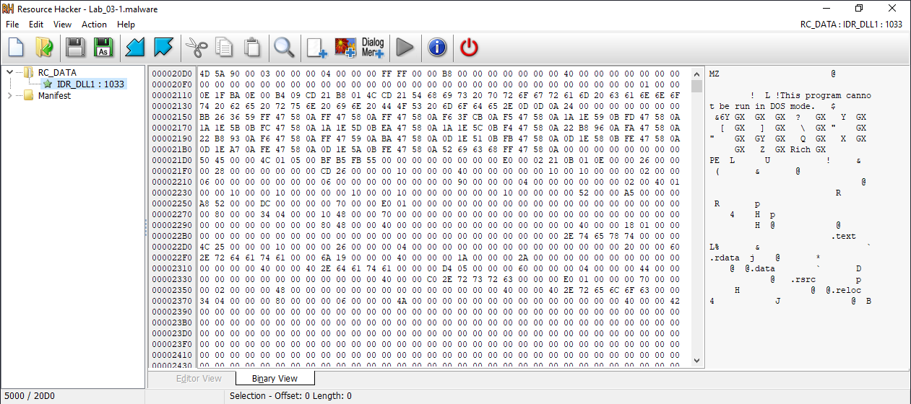
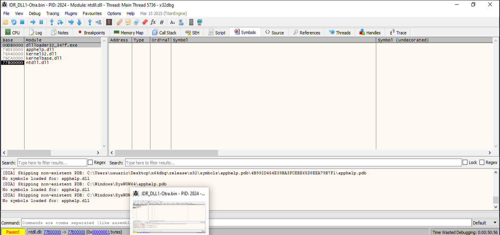
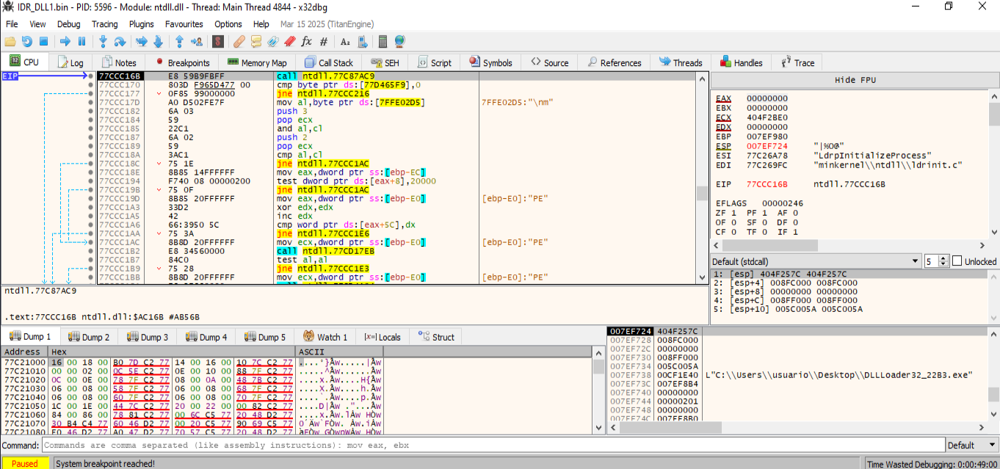
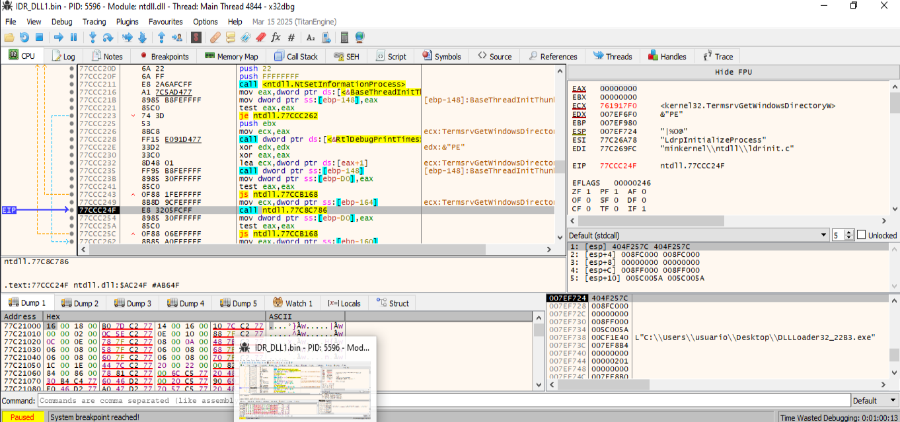
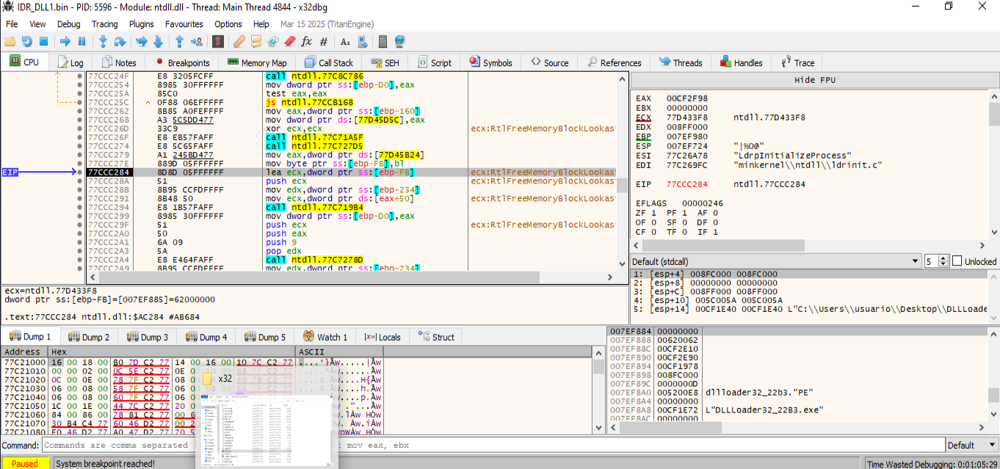
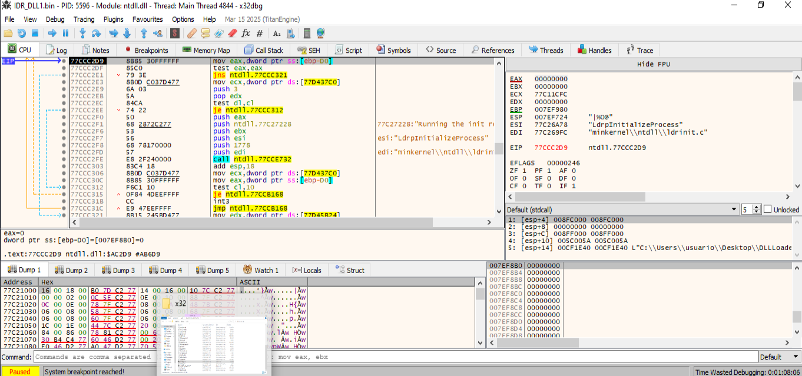

# RC_DATA / IDR_DLL1 en una DLL incrustada como recurso:

```
📍 Sección .rsrc (recursos del binario)

// .rsrc 
// ram:00404000-ram:004093ff

📍 Entrada RC_DATA / IDR_DLL1

**************************************************************
* Rsrc_RC_DATA_IDR_DLL1_409 Size of resource: 0x5000 bytes   *
**************************************************************
Rsrc_RC_DATA_IDR_DLL1_409
004040d0 4d 5a 90 00 ...

    RC_DATA es el tipo de recurso para datos arbitrarios binarios.

    IDR_DLL1 es el identificador simbólico del recurso.

    0x004040D0 contiene datos que empiezan con la firma:

    4D 5A 90 00   →  "MZ"  (cabecera DOS de un ejecutable PE/DLL)
```

- Comienza con MZ, por lo que se trata de un ejecutable PE (Portable Executable), en este caso probablemente una DLL.
- Tamaño del recurso: Size of resource: 0x5000 bytes → 20 KB. Este tamaño es razonable para una DLL maliciosa compacta que contenga payloads (por ejemplo: backdoors, downloaders o módulos cifrados).

## Resumiendo
- El dropper contiene embebida una DLL en formato PE dentro de los recursos del ejecutable.
- Está empaquetada bajo el tipo RC_DATA con el nombre IDR_DLL1.
- El ejecutable principal probablemente extrae este recurso a disco o lo carga directamente en memoria para ejecutarlo.
    

## Usamos Resource Hacker para extraer la dll
Abrimos la muestra de malware con Resorce Hacker


Al abrir Resource Hacker vemos el recurso RC_DATA → IDR_DLL1 : 1033, que es exactamente donde está la DLL incrustada. 👉 El número 1033 es el identificador del idioma (en este caso, inglés - EE.UU.), que Resource Hacker muestra como parte de la ruta al recurso:
RC_DATA → IDR_DLL1 : 1033 = RC_DATA/IDR_DLL1/409 (porque 1033 decimal = 0x409 hexadecimal).



Hacemos clic derecho sobre IDR_DLL1 : 1033 y guardamos con extensión *.bin o *.dll.
     
        
## Verificamos que la extracción se realizó correctamente
```
└─$ file IDR_DLL1.bin 
IDR_DLL1.bin: PE32 executable for MS Windows 6.00 (DLL), Intel i386, 5 sections
```

## Analizamos la dll extraida con x32dbg

### Abrimos la dll extraida con x32dbg
Observamos que nos nuestra el **Punto 77BB1C13**:


Esta **dirección 77BB1C13** no es el OEP de la DLL, sino una dirección de ejecución del sistema operativo. En concreto pertenece a ntdll.dll que es un componente fundamental de Windows. El código que vemos en la captura pertenece a funciones como RtInitializeProcess, LdrInitalizeThunk, LdrInitialize, etc, que son funciones de inicialización del sistema para procesos/DLLs, pero no del malware en sí.

**Cuando cargamos una DLL con x32dbg:**
- x32dbg no ejecuta automáticamente el código de la DLL como si fuera un EXE.
- En vez de eso, carga el proceso en pausa en el punto de inicialización del sistema (como LdrInitializeProcess).
- La ejecución aún no ha llegado al verdadero Entry Point de la DLL.
- Estamos viendo código del loader de Windows (ntdll), no el código malicioso aún.

El código que vemos pertenece a **ntdll.dll**, concretamente a la función **LdrInitializeProcess**. Esto indica que estamos en una fase muy temprana de la carga del proceso (dentro de las rutinas del sistema para inicializar una DLL o EXE). 

Hemos cargado correctamente la DLL, pero el código en ejecución ahora aún no es el nuestro, **es de ntdll.dll, el cual Windows llama automáticamente al cargar cualquier módulo PE**. Es una señal de que la DLL está esperando llegar a su propio **DllMain o punto de entrada.**


```

77BB1C13 | EB 07                    | jmp ntdll.77BB1C1C                      |
77BB1C15 | 33C0                     | xor eax,eax                             |
77BB1C17 | 40                       | inc eax                                 |
77BB1C18 | C3                       | ret                                     |
77BB1C19 | 8B65 E8                  | mov esp,dword ptr ss:[ebp-18]           |
77BB1C1C | C745 FC FEFFFFFF         | mov dword ptr ss:[ebp-4],FFFFFFFE       |
77BB1C23 | 8B4D F0                  | mov ecx,dword ptr ss:[ebp-10]           |
77BB1C26 | 64:890D 00000000         | mov dword ptr fs:[0],ecx                |
77BB1C2D | 59                       | pop ecx                                 |
77BB1C2E | 5F                       | pop edi                                 | edi:"minkernel\\ntdll\\ldrinit.c"
77BB1C2F | 5E                       | pop esi                                 | esi:"LdrpInitializeProcess"
77BB1C30 | 5B                       | pop ebx                                 |
77BB1C31 | C9                       | leave                                   |
77BB1C32 | C3                       | ret                                     |
```

Esto es el final de una función de inicialización de sistema, típicamente:
```
LdrpInitializeProcess

LdrInitializeThunk
```
Este bloque:
- Restaura el estado anterior del programa.
- Limpia la pila.
- Sale limpiamente tras inicializar un módulo (como una DLL).
- Puede devolver eax = 1 si se ejecuta desde 77BB1C15.


## Ir al punto de entrada real (OEP) de la DLL
Hemos visto en el punto anterior que estábamos en la IDR_DLL1 cargada como ntdll1.dll, pero no estábamos en la entrada real de esa DLL oculta en el malware (OEP). Para ir al punto de entrada real (OEP) de la DLL -->


### Analizamos los módulos cargados
Para ver los módulos: ALt + E  


Vemos la dirección que tiene el modulo ntdll.dll: 77B00000

Vamos a la pestaña "Memory Map" y buscamos el módulo ntdll.dll:


**Nota:** Hacemos click derecho sobre el módulo en la pestaña de Memory Map --> Dump Memory to File --> dump-memory-file-dllloader32_347f_77B00000.bin. Para después analiazarlo con Ghidra.

Cargamos el módulo ntdll.dll - 77B00000 en la vista CPU haciendo doble click sobre el.


### Cargamos la dll extraida con DIE:


Con la información de Detect It Easy (DiE) ya podemos **calcular la dirección absoluta del OEP (Original Entry Point)** y saltar directamente desde x32dbg:
- Dirección base (Image Base): 0x10000000
- Punto de entrada (Entry Point RVA): 0x00026CD


#### 🎯🎯🎯🎯 ¿Por qué esta dirección 77B00000 y no la original 0x10000000 del binario?
Esto significa que el sistema ha cargado el módulo ntdll1.dll en la dirección virtual 0x77B00000:
- El campo ImageBase del PE es una sugerencia.
- Windows puede reubicar la DLL en otro sitio (relocation) si la dirección sugerida ya está ocupada.
- Así, aunque el binario fue compilado para 0x10000000, Windows lo cargó en 0x77B00000 en la sesión.


#### 🎯🎯🎯🎯  ¿Por qué nos importa tanto esta base?
Porque si vemos, por ejemplo, que el EntryPoint RVA es 0x26CD, entonces el OEP real en memoria es:
```
OEP = Base real en memoria + RVA = 0x77B00000 + 0x000026CD = 0x77B026CD
```
Y no 0x100026CD, que solo es válido si el binario sí se cargó en 0x10000000, lo cual no suele ser el caso al hacer DLL injection o analizar dumps en memoria.


**OEP RELATIVO A LA BASE ORIGINAL** = 0x10000000 + 0x26CD = 0x100026CD

Para obtener la dirección absoluta del punto de entrada (OEP), usamos:
```
OEP = ImageBase + EntryPoint RVA
OEP = 0x10000000 + 0x00026CD = 0x100026CD
```

**No hay que confundir:**
```
RVA (Relative Virtual Address): 0x00026CD

VA (Virtual Address): 0x10000000 + 0x00026CD = 0x100026CD
```

**✅ Fórmula para convertir el Entry Point RVA a la dirección real en x32dbg:**
```
Real_OEP = Carga_real + OEP_RVA
Real_OEP = 0x77B00000 + 0x00026CD
         = 0x77B026CD
```


### Punto 69F626CD - Entry Point


-----------------------------
### Análisis Entry Point
```

00FE1000 | 55                       | push ebp                                |
00FE1001 | 8BEC                     | mov ebp,esp                             |
00FE1003 | 8D45 10                  | lea eax,dword ptr ss:[ebp+10]           |
00FE1006 | 50                       | push eax                                |
00FE1007 | FF75 0C                  | push dword ptr ss:[ebp+C]               |
00FE100A | 68 00010000              | push 100                                |
00FE100F | FF75 08                  | push dword ptr ss:[ebp+8]               |
00FE1012 | E8 E8040000              | call dllloader32_ce68.FE14FF            |
00FE1017 | 83C4 10                  | add esp,10                              |
00FE101A | 5D                       | pop ebp                                 |
00FE101B | C3                       | ret                                     |
00FE101C | CC                       | int3                                    |
00FE101D | CC                       | int3                                    |
00FE101E | CC                       | int3                                    |
00FE101F | CC                       | int3                                    |
00FE1020 | 55                       | push ebp                                |
00FE1021 | 8BEC                     | mov ebp,esp                             |
00FE1023 | 81EC 04020000            | sub esp,204                             |
00FE1029 | A1 0020FF00              | mov eax,dword ptr ds:[FF2000]           |
00FE102E | 33C5                     | xor eax,ebp                             |
00FE1030 | 8945 FC                  | mov dword ptr ss:[ebp-4],eax            |
00FE1033 | 56                       | push esi                                | esi:"LdrpInitializeProcess"
00FE1034 | 57                       | push edi                                | edi:"minkernel\\ntdll\\ldrinit.c"
00FE1035 | FF15 08D0FE00            | call dword ptr ds:[<GetCurrentProcessId |
00FE103B | 50                       | push eax                                |
00FE103C | 8D85 FCFDFFFF            | lea eax,dword ptr ss:[ebp-204]          |
00FE1042 | 68 98D1FE00              | push dllloader32_ce68.FED198            | FED198:L"Local\\szLibraryName%X"
00FE1047 | 50                       | push eax                                |
00FE1048 | E8 B3FFFFFF              | call dllloader32_ce68.FE1000            |
00FE104D | 83C4 0C                  | add esp,C                               |
00FE1050 | 8D85 FCFDFFFF            | lea eax,dword ptr ss:[ebp-204]          |
00FE1056 | 50                       | push eax                                |
00FE1057 | 6A 00                    | push 0                                  |
00FE1059 | 6A 04                    | push 4                                  |
00FE105B | FF15 20D0FE00            | call dword ptr ds:[<OpenFileMappingW>]  |
00FE1061 | 8BF8                     | mov edi,eax                             | edi:"minkernel\\ntdll\\ldrinit.c"
00FE1063 | 85FF                     | test edi,edi                            | edi:"minkernel\\ntdll\\ldrinit.c"
00FE1065 | 74 32                    | je dllloader32_ce68.FE1099              |
00FE1067 | 68 00040000              | push 400                                |
00FE106C | 6A 00                    | push 0                                  |
00FE106E | 6A 00                    | push 0                                  |
00FE1070 | 6A 04                    | push 4                                  |
00FE1072 | 57                       | push edi                                | edi:"minkernel\\ntdll\\ldrinit.c"
00FE1073 | FF15 14D0FE00            | call dword ptr ds:[<MapViewOfFile>]     |
00FE1079 | 8BF0                     | mov esi,eax                             | esi:"LdrpInitializeProcess"
00FE107B | 85F6                     | test esi,esi                            | esi:"LdrpInitializeProcess"
00FE107D | 74 13                    | je dllloader32_ce68.FE1092              |
00FE107F | 56                       | push esi                                | esi:"LdrpInitializeProcess"
00FE1080 | 68 E030FF00              | push dllloader32_ce68.FF30E0            |
00FE1085 | FF15 1CD0FE00            | call dword ptr ds:[<lstrcpyW>]          |
00FE108B | 56                       | push esi                                | esi:"LdrpInitializeProcess"
00FE108C | FF15 18D0FE00            | call dword ptr ds:[<UnmapViewOfFile>]   |
00FE1092 | 57                       | push edi                                | edi:"minkernel\\ntdll\\ldrinit.c"
00FE1093 | FF15 10D0FE00            | call dword ptr ds:[<CloseHandle>]       |
00FE1099 | 66:833D E030FF00 00      | cmp word ptr ds:[FF30E0],0              |
00FE10A1 | 75 17                    | jne dllloader32_ce68.FE10BA             |
00FE10A3 | E8 B2000000              | call <JMP.&RtlGetLastNtStatus>          |
00FE10A8 | 5F                       | pop edi                                 | edi:"minkernel\\ntdll\\ldrinit.c"
00FE10A9 | 5E                       | pop esi                                 | esi:"LdrpInitializeProcess"
00FE10AA | 8B4D FC                  | mov ecx,dword ptr ss:[ebp-4]            |
00FE10AD | 33CD                     | xor ecx,ebp                             |
00FE10AF | E8 66040000              | call dllloader32_ce68.FE151A            |
00FE10B4 | 8BE5                     | mov esp,ebp                             |
00FE10B6 | 5D                       | pop ebp                                 |
00FE10B7 | C2 1000                  | ret 10                                  |
00FE10BA | 68 E030FF00              | push dllloader32_ce68.FF30E0            |
00FE10BF | FF15 24D0FE00            | call dword ptr ds:[<LoadLibraryW>]      |
00FE10C5 | 85C0                     | test eax,eax                            |
00FE10C7 | 75 4F                    | jne dllloader32_ce68.FE1118             |
00FE10C9 | E8 8C000000              | call <JMP.&RtlGetLastNtStatus>          |
00FE10CE | 8BF0                     | mov esi,eax                             | esi:"LdrpInitializeProcess"
00FE10D0 | FF15 0CD0FE00            | call dword ptr ds:[<GetLastError>]      |
00FE10D6 | 50                       | push eax                                |
00FE10D7 | 8D85 FCFDFFFF            | lea eax,dword ptr ss:[ebp-204]          |
00FE10DD | 68 C8D1FE00              | push dllloader32_ce68.FED1C8            | FED1C8:L"Failed to load DLL (LastError: %u)"
00FE10E2 | 50                       | push eax                                |
00FE10E3 | E8 18FFFFFF              | call dllloader32_ce68.FE1000            |
00FE10E8 | 83C4 0C                  | add esp,C                               |
00FE10EB | 8D85 FCFDFFFF            | lea eax,dword ptr ss:[ebp-204]          |
00FE10F1 | 68 10100000              | push 1010                               |
00FE10F6 | 50                       | push eax                                |
00FE10F7 | 68 E030FF00              | push dllloader32_ce68.FF30E0            |
00FE10FC | 6A 00                    | push 0                                  |
00FE10FE | FF15 BC30FF00            | call dword ptr ds:[FF30BC]              |
00FE1104 | 5F                       | pop edi                                 | edi:"minkernel\\ntdll\\ldrinit.c"
00FE1105 | 8BC6                     | mov eax,esi                             | esi:"LdrpInitializeProcess"
00FE1107 | 5E                       | pop esi                                 | esi:"LdrpInitializeProcess"
00FE1108 | 8B4D FC                  | mov ecx,dword ptr ss:[ebp-4]            |
00FE110B | 33CD                     | xor ecx,ebp                             |
00FE110D | E8 08040000              | call dllloader32_ce68.FE151A            |
00FE1112 | 8BE5                     | mov esp,ebp                             |
00FE1114 | 5D                       | pop ebp                
```

Esta función se encuentra en un contexto de loader, y actúa como una función que localiza, abre, mapea, y finalmente carga una DLL desde una memoria compartida u otra ubicación no estándar.
🧠 Resumen de lo que hace esta función

Esta rutina tiene dos bloques principales:

    Creación del nombre Local\\szLibraryName%X con el PID actual

    Acceso y lectura de memoria compartida para recuperar una DLL que será cargada

    Carga manual (condicional) de la DLL con LoadLibraryW si no está mapeada

Esta rutina:

    Construye un nombre de recurso a partir del ProcessId

    Intenta abrir una memoria compartida (como si alguien hubiese inyectado ahí una DLL)

    Si lo consigue, mapea esa memoria y copia el nombre/contenido de una DLL

    Si no lo consigue o si está vacío, intenta cargarla con LoadLibraryW desde esa dirección

    Imprime errores si falla

🔍 En contexto de análisis de malware

Este código tiene características de un loader muy sofisticado:

    Usa memoria compartida → canal encubierto entre procesos.

    Evita CreateFile o acceso al disco → evita antivirus y sandboxing.

    Carga DLL a mano y condiciona su ejecución al contenido de una dirección conocida → potencialmente para reflective loading o ejecución de payloads sin tocar disco.

    Tiene control de errores y limpieza → está bien estructurado.
    
----------------------------------------
### Direccion 77B026CD


Abrimos con Gidra:


```
                             **************************************************************
                             *                          FUNCTION                          *
                             **************************************************************
                             undefined __stdcall entry(HINSTANCE__ * param_1, ulong p
                               assume FS_OFFSET = 0xffdff000
             undefined         <UNASSIGNED>   <RETURN>
             HINSTANCE__ *     Stack[0x4]:4   param_1                                 XREF[1]:     100026e1(R)  
             ulong             Stack[0x8]:4   param_2                                 XREF[2]:     100026d0(R), 
                                                                                                   100026de(R)  
             void *            Stack[0xc]:4   param_3                                 XREF[1]:     100026db(R)  
                             entry                                           XREF[2]:     Entry Point(*), 10000128(*)  
        100026cd 55              PUSH       EBP
        100026ce 8b ec           MOV        EBP,ESP
        100026d0 83 7d 0c 01     CMP        dword ptr [EBP + param_2],0x1
        100026d4 75 05           JNZ        LAB_100026db
        100026d6 e8 80 05        CALL       ___security_init_cookie                          void ___security_init_cookie(void)
                 00 00
                             LAB_100026db                                    XREF[1]:     100026d4(j)  
        100026db ff 75 10        PUSH       dword ptr [EBP + param_3]
        100026de ff 75 0c        PUSH       dword ptr [EBP + param_2]
        100026e1 ff 75 08        PUSH       dword ptr [EBP + param_1]
        100026e4 e8 b1 fe        CALL       FUN_1000259a                                     int FUN_1000259a(HINSTANCE__ * p
                 ff ff
        100026e9 83 c4 0c        ADD        ESP,0xc
        100026ec 5d              POP        EBP
        100026ed c2 0c 00        RET        0xc

```
Esta función entry es un stub de arranque para DllMain. Hace lo siguiente:
- Comprueba si fue llamado con DLL_PROCESS_ATTACH.
- Si lo fue, inicializa seguridad (__security_init_cookie).
- Llama a una función auxiliar FUN_1000259a con los mismos parámetros de DllMain.
- Limpia la pila y devuelve control.`

### función FUN_10002b39
```
                             **************************************************************
                             *                          FUNCTION                          *
                             **************************************************************
                             undefined4 __cdecl FUN_10002b39(int param_1)
                               assume FS_OFFSET = 0xffdff000
             undefined4        EAX:4          <RETURN>
             int               Stack[0x4]:4   param_1                                 XREF[1]:     10002b76(R)  
             undefined4        Stack[-0x8]:4  local_8                                 XREF[3]:     10002b45(RW), 
                                                                                                   10002b96(W), 
                                                                                                   10002bb7(W)  
                             FUN_10002b39                                    XREF[1]:     dllmain_crt_process_attach:10002
        10002b39 6a 08           PUSH       0x8
        10002b3b 68 88 51        PUSH       DAT_10005188                                     = FEh
                 00 10
        10002b40 e8 7b 03        CALL       __SEH_prolog4                                    undefined __SEH_prolog4(undefine
                 00 00
        10002b45 83 65 fc 00     AND        dword ptr [EBP + local_8],0x0
        10002b49 b8 4d 5a        MOV        EAX,0x5a4d
                 00 00
        10002b4e 66 39 05        CMP        word ptr [IMAGE_DOS_HEADER_10000000],AX
                 00 00 00 10
        10002b55 75 60           JNZ        LAB_10002bb7
        10002b57 a1 3c 00        MOV        EAX,[IMAGE_DOS_HEADER_10000000.e_lfanew]
                 00 10
        10002b5c 81 b8 00        CMP        dword ptr [EAX + 0x10000000]=>IMAGE_NT_HEADERS
                 00 00 10 
                 50 45 00 00
        10002b66 75 4f           JNZ        LAB_10002bb7
        10002b68 b9 0b 01        MOV        ECX,0x10b
                 00 00
        10002b6d 66 39 88        CMP        word ptr [EAX + 0x10000018]=>IMAGE_NT_HEADERS3
                 18 00 00 10
        10002b74 75 41           JNZ        LAB_10002bb7
        10002b76 8b 45 08        MOV        EAX,dword ptr [EBP + param_1]
        10002b79 b9 00 00        MOV        ECX,IMAGE_DOS_HEADER_10000000
                 00 10
        10002b7e 2b c1           SUB        EAX,ECX
        10002b80 50              PUSH       EAX
        10002b81 51              PUSH       ECX=>IMAGE_DOS_HEADER_10000000
        10002b82 e8 b4 fd        CALL       find_pe_section                                  _IMAGE_SECTION_HEADER * find_pe_
                 ff ff
        10002b87 59              POP        ECX
        10002b88 59              POP        ECX
        10002b89 85 c0           TEST       EAX,EAX
        10002b8b 74 2a           JZ         LAB_10002bb7
        10002b8d f7 40 24        TEST       dword ptr [EAX + 0x24],0x80000000
                 00 00 00 80
        10002b94 75 21           JNZ        LAB_10002bb7
        10002b96 c7 45 fc        MOV        dword ptr [EBP + local_8],0xfffffffe
                 fe ff ff ff
        10002b9d b0 01           MOV        AL,0x1
        10002b9f eb 1f           JMP        LAB_10002bc0
                             LAB_10002ba1                                    XREF[1]:     1000519c(*)  
        10002ba1 8b 45 ec        MOV        EAX,dword ptr [EBP + -0x14]
        10002ba4 8b 00           MOV        EAX,dword ptr [EAX]
        10002ba6 33 c9           XOR        ECX,ECX
        10002ba8 81 38 05        CMP        dword ptr [EAX],0xc0000005
                 00 00 c0
        10002bae 0f 94 c1        SETZ       CL
        10002bb1 8b c1           MOV        EAX,ECX
        10002bb3 c3              RET
                             LAB_10002bb4                                    XREF[1]:     100051a0(*)  
        10002bb4 8b 65 e8        MOV        ESP,dword ptr [EBP + -0x18]
                             LAB_10002bb7                                    XREF[5]:     10002b55(j), 10002b66(j), 
                                                                                          10002b74(j), 10002b8b(j), 
                                                                                          10002b94(j)  
        10002bb7 c7 45 fc        MOV        dword ptr [EBP + local_8],0xfffffffe
                 fe ff ff ff
        10002bbe 32 c0           XOR        AL,AL
                             LAB_10002bc0                                    XREF[1]:     10002b9f(j)  
        10002bc0 e8 41 03        CALL       __SEH_epilog4                                    undefined __SEH_epilog4(void)
                 00 00
        10002bc5 c3              RET

```

Aunque esta función no contiene directamente lógica maliciosa, su función find_pe_section() puede ser una etapa clave de preparación para ejecución posterior, como:
- Comprobar que se ha cargado correctamente.
- Determinar desde qué sección se ha ejecutado (útil si se inyectó en otro proceso).
- Preparar shellcode o payloads embebidos en secciones no estándar.


✅ Resumen
Etapa	Función
Validación PE	Comprueba cabecera MZ, PE, y formato PE32.
Búsqueda de sección	Usa find_pe_section para localizar en qué sección del binario cae la DLL cargada.
Verificación sección	Asegura que la sección no sea DISCARDABLE (útil para evitar secciones que se descartan tras inicialización).
Devuelve resultado	Si pasa todos los checks, retorna AL = 1, indicando éxito.

### Función FUN_10001c20
```
                             **************************************************************
                             *                          FUNCTION                          *
                             **************************************************************
                             undefined __stdcall FUN_10001c20(HMODULE param_1, int pa
                               assume FS_OFFSET = 0xffdff000
             undefined         <UNASSIGNED>   <RETURN>
             HMODULE           Stack[0x4]:4   param_1                                 XREF[1]:     10001c39(R)  
             int               Stack[0x8]:4   param_2                                 XREF[1]:     10001c33(R)  
             undefined4        Stack[-0x8]:4  local_8                                 XREF[2]:     10001c30(W), 
                                                                                                   10001caf(R)  
             undefined1        Stack[-0x808   local_808                               XREF[2]:     10001c53(*), 
                                                                                                   10001c67(*)  
             undefined4        Stack[-0x80c   local_80c                               XREF[3]:     10001c77(W), 
                                                                                                   10001c7d(R), 
                                                                                                   10001c8b(R)  
                             FUN_10001c20                                    XREF[2]:     FUN_1000259a:100025fe(c), 
                                                                                          FUN_1000259a:10002616(c)  
        10001c20 55              PUSH       EBP
        10001c21 8b ec           MOV        EBP,ESP
        10001c23 81 ec 08        SUB        ESP,0x808
                 08 00 00
        10001c29 a1 04 60        MOV        EAX,[DAT_10006004]                               = BB40E64Eh
                 00 10
        10001c2e 33 c5           XOR        EAX,EBP
        10001c30 89 45 fc        MOV        dword ptr [EBP + local_8],EAX
        10001c33 83 7d 0c 01     CMP        dword ptr [EBP + param_2],0x1
        10001c37 75 71           JNZ        LAB_10001caa
        10001c39 8b 45 08        MOV        EAX,dword ptr [EBP + param_1]
        10001c3c a3 88 65        MOV        [DAT_10006588],EAX
                 00 10
        10001c41 8b 0d 88        MOV        ECX,dword ptr [DAT_10006588]
                 65 00 10
        10001c47 51              PUSH       ECX
        10001c48 ff 15 14        CALL       dword ptr [->KERNEL32.DLL::DisableThreadLibrar   = 000054c2
                 40 00 10
        10001c4e 68 00 04        PUSH       0x400
                 00 00
        10001c53 8d 95 fc        LEA        EDX=>local_808,[EBP + 0xfffff7fc]
                 f7 ff ff
        10001c59 52              PUSH       EDX
        10001c5a 6a 00           PUSH       0x0
        10001c5c ff 15 18        CALL       dword ptr [->KERNEL32.DLL::GetModuleFileNameW]   = 000054ac
                 40 00 10
        10001c62 68 00 04        PUSH       0x400
                 00 00
        10001c67 8d 85 fc        LEA        EAX=>local_808,[EBP + 0xfffff7fc]
                 f7 ff ff
        10001c6d 50              PUSH       EAX
        10001c6e ff 15 ec        CALL       dword ptr [->API-MS-WIN-CRT-STRING-L1-1-0.DLL:   = 00005696
                 40 00 10
        10001c74 83 c4 08        ADD        ESP,0x8
        10001c77 89 85 f8        MOV        dword ptr [EBP + local_80c],EAX
                 f7 ff ff
        10001c7d 83 bd f8        CMP        dword ptr [EBP + local_80c],0xc
                 f7 ff ff 0c
        10001c84 7e 24           JLE        LAB_10001caa
        10001c86 68 80 43        PUSH       u_explorer.exe_10004380                          = u"explorer.exe"
                 00 10
        10001c8b 8b 8d f8        MOV        ECX,dword ptr [EBP + local_80c]
                 f7 ff ff
        10001c91 8d 94 4d        LEA        EDX,[EBP + ECX*0x2 + 0xfffff7e4]
                 e4 f7 ff ff
        10001c98 52              PUSH       EDX
        10001c99 ff 15 f0        CALL       dword ptr [->API-MS-WIN-CRT-STRING-L1-1-0.DLL:   = 000056a0
                 40 00 10
        10001c9f 83 c4 08        ADD        ESP,0x8
        10001ca2 85 c0           TEST       EAX,EAX
        10001ca4 75 04           JNZ        LAB_10001caa
        10001ca6 33 c0           XOR        EAX,EAX
        10001ca8 eb 05           JMP        LAB_10001caf
                             LAB_10001caa                                    XREF[3]:     10001c37(j), 10001c84(j), 
                                                                                          10001ca4(j)  
        10001caa b8 01 00        MOV        EAX,0x1
                 00 00
                             LAB_10001caf                                    XREF[1]:     10001ca8(j)  
        10001caf 8b 4d fc        MOV        ECX,dword ptr [EBP + local_8]
        10001cb2 33 cd           XOR        ECX,EBP
        10001cb4 e8 85 06        CALL       __security_check_cookie                          undefined __security_check_cooki
                 00 00
        10001cb9 8b e5           MOV        ESP,EBP
        10001cbb 5d              POP        EBP
        10001cbc c2 0c 00        RET        0xc
        10001cbf cc              ??         CCh

```
7. PUNTO CLAVE 🔥: compara con "explorer.exe"

LEA     EDX, [EBP + ECX*2 + offset]
PUSH    EDX
PUSH    u"explorer.exe"
CALL    _wcsicmp

💣 Si el propio nombre es "explorer.exe"...

    Compara con "explorer.exe" el final de la ruta.

    Si ES explorer.exe, devuelve 0 → no ejecuta carga útil.

📌 Esto es un anti-debug / anti-análisis clásico:

    El malware detecta si está inyectado como DLL en explorer.exe y decide no hacer nada.

    Este comportamiento es usado en malware modular o fileless, que se inyecta en procesos benignos para ejecutar payloads sólo en algunos contextos.

8. Si no está en explorer.exe → continúa

return 1

Retorna 1 para indicar éxito de inicialización, lo cual permitirá que el resto de la DLL continúe ejecutando.
🧪 Conclusión del análisis
Elemento	Comportamiento
📥 Entrada	hinstDLL, fdwReason desde DllMain
🧠 Propósito principal	Evita ejecución si está en explorer.exe
🔐 Técnicas de evasión	Stack cookie, ocultamiento, DisableThreadLibraryCalls, ruta propia
💣 Posible carga	Si NO está en explorer.exe, puede seguir ejecutando el payload
🔎 Detalle interesante	Usa wcslen + wcsicmp → lenguaje C estándar + CRT API


### Función XXX

```
                             **************************************************************
                             *                          FUNCTION                          *
                             **************************************************************
                             undefined __stdcall FUN_10001ad0(void)
                               assume FS_OFFSET = 0xffdff000
             undefined         <UNASSIGNED>   <RETURN>
             undefined4        Stack[-0x8]:4  local_8                                 XREF[2]:     10001baf(W), 
                                                                                                   10001be8(W)  
             undefined4        Stack[-0x10]:4 local_10                                XREF[2]:     10001aef(*), 
                                                                                                   10001bf9(R)  
             undefined4        Stack[-0x14]:4 local_14                                XREF[2]:     10001aeb(W), 
                                                                                                   10001c04(R)  
             undefined4        Stack[-0x18]:4 local_18                                XREF[1]:     10001b1e(W)  
             undefined4        Stack[-0x1c]:4 local_1c                                XREF[1]:     10001b17(W)  
             undefined4        Stack[-0x20]:4 local_20                                XREF[1]:     10001b10(W)  
             undefined4        Stack[-0x24]:4 local_24                                XREF[1]:     10001b09(W)  
             undefined4        Stack[-0x28]:4 local_28                                XREF[1]:     10001b02(W)  
             undefined4        Stack[-0x2c]:4 local_2c                                XREF[1]:     10001afb(W)  
             undefined4        Stack[-0x30]:4 local_30                                XREF[6]:     10001b25(W), 
                                                                                                   10001b73(*), 
                                                                                                   10001bb8(R), 
                                                                                                   10001bbd(R), 
                                                                                                   10001bda(R), 
                                                                                                   10001bdf(R)  
             undefined4        Stack[-0x34]:4 local_34                                XREF[4]:     10001b62(W), 
                                                                                                   10001b65(R), 
                                                                                                   10001b8b(W), 
                                                                                                   10001b8e(R)  
             undefined1        Stack[-0x38]:1 local_38                                XREF[3]:     10001ba7(*), 
                                                                                                   10001bd1(*), 
                                                                                                   10001bef(*)  
             undefined4        Stack[-0x3c]:4 local_3c                                XREF[1]:     10001af8(W)  
                             FUN_10001ad0                                    XREF[1]:     FUN_10001810:10001a0c(c)  
        10001ad0 55              PUSH       EBP
        10001ad1 8b ec           MOV        EBP,ESP
        10001ad3 6a ff           PUSH       -0x1
        10001ad5 68 f8 34        PUSH       LAB_100034f8
                 00 10
        10001ada 64 a1 00        MOV        EAX,FS:[0x0]=>ExceptionList                      = 00000000
                 00 00 00
        10001ae0 50              PUSH       EAX
        10001ae1 83 ec 2c        SUB        ESP,0x2c
        10001ae4 a1 04 60        MOV        EAX,[DAT_10006004]                               = BB40E64Eh
                 00 10
        10001ae9 33 c5           XOR        EAX,EBP
        10001aeb 89 45 f0        MOV        dword ptr [EBP + local_14],EAX
        10001aee 50              PUSH       EAX
        10001aef 8d 45 f4        LEA        EAX=>local_10,[EBP + -0xc]
        10001af2 64 a3 00        MOV        FS:[0x0]=>ExceptionList,EAX                      = 00000000
                 00 00 00
        10001af8 89 4d c8        MOV        dword ptr [EBP + local_3c],ECX
        10001afb c7 45 d8        MOV        dword ptr [EBP + local_2c],s_http://rpis.ec/_1   = "http://rpis.ec/"
                 90 42 00 10
        10001b02 c7 45 dc        MOV        dword ptr [EBP + local_28],s_http://rpis.ec/bi   = "http://rpis.ec/binexp"
                 a0 42 00 10
        10001b09 c7 45 e0        MOV        dword ptr [EBP + local_24],s_https://twitter.c   = "https://twitter.com/RPISEC"
                 b8 42 00 10
        10001b10 c7 45 e4        MOV        dword ptr [EBP + local_20],s_https://www.faceb   = "https://www.facebook.com/RPI-
                 d8 42 00 10
        10001b17 c7 45 e8        MOV        dword ptr [EBP + local_1c],s_http://blog.rpis.   = "http://blog.rpis.ec/"
                 30 43 00 10
        10001b1e c7 45 ec        MOV        dword ptr [EBP + local_18],s_http://security.c   = "http://security.cs.rpi.edu/co
                 48 43 00 10
        10001b25 c7 45 d4        MOV        dword ptr [EBP + local_30],0x0
                 00 00 00 00
        10001b2c 6a 00           PUSH       0x0
        10001b2e e8 7d ff        CALL       FUN_10001ab0                                     __time64_t FUN_10001ab0(__time64
                 ff ff
        10001b33 83 c4 04        ADD        ESP,0x4
        10001b36 50              PUSH       EAX
        10001b37 ff 15 04        CALL       dword ptr [->API-MS-WIN-CRT-UTILITY-L1-1-0.DLL   = 0000567c
                 41 00 10
        10001b3d 83 c4 04        ADD        ESP,0x4
        10001b40 ff 15 00        CALL       dword ptr [->API-MS-WIN-CRT-UTILITY-L1-1-0.DLL   = 00005684
                 41 00 10
        10001b46 99              CDQ
        10001b47 b9 03 00        MOV        ECX,0x3
                 00 00
        10001b4c f7 f9           IDIV       ECX
        10001b4e 85 d2           TEST       EDX,EDX
        10001b50 74 08           JZ         LAB_10001b5a
        10001b52 8a 45 20        MOV        AL,byte ptr [EBP + Stack[0x1c]]
        10001b55 e9 9f 00        JMP        LAB_10001bf9
                 00 00
                             LAB_10001b5a                                    XREF[1]:     10001b50(j)  
        10001b5a 6a 00           PUSH       0x0
        10001b5c ff 15 0c        CALL       dword ptr [->OLE32.DLL::CoInitialize]            = 0000553c
                 41 00 10
        10001b62 89 45 d0        MOV        dword ptr [EBP + local_34],EAX
        10001b65 83 7d d0 00     CMP        dword ptr [EBP + local_34],0x0
        10001b69 7d 08           JGE        LAB_10001b73
        10001b6b 8a 45 20        MOV        AL,byte ptr [EBP + Stack[0x1c]]
        10001b6e e9 86 00        JMP        LAB_10001bf9
                 00 00
                             LAB_10001b73                                    XREF[1]:     10001b69(j)  
        10001b73 8d 55 d4        LEA        EDX=>local_30,[EBP + -0x2c]
        10001b76 52              PUSH       EDX
        10001b77 68 80 41        PUSH       DAT_10004180                                     = 61h    a
                 00 10
        10001b7c 6a 04           PUSH       0x4
        10001b7e 6a 00           PUSH       0x0
        10001b80 68 a0 41        PUSH       DAT_100041a0                                     = 01h
                 00 10
        10001b85 ff 15 10        CALL       dword ptr [->OLE32.DLL::CoCreateInstance]        = 0000554c
                 41 00 10
        10001b8b 89 45 d0        MOV        dword ptr [EBP + local_34],EAX
        10001b8e 83 7d d0 00     CMP        dword ptr [EBP + local_34],0x0
        10001b92 75 63           JNZ        LAB_10001bf7
        10001b94 ff 15 00        CALL       dword ptr [->API-MS-WIN-CRT-UTILITY-L1-1-0.DLL   = 00005684
                 41 00 10
        10001b9a 99              CDQ
        10001b9b b9 06 00        MOV        ECX,0x6
                 00 00
        10001ba0 f7 f9           IDIV       ECX
        10001ba2 8b 54 95 d8     MOV        EDX,dword ptr [EBP + EDX*0x4 + -0x28]
        10001ba6 52              PUSH       EDX
        10001ba7 8d 4d cc        LEA        ECX=>local_38,[EBP + -0x34]
        10001baa e8 e1 f8        CALL       FUN_10001490                                     int * FUN_10001490(void * this, 
                 ff ff
        10001baf c7 45 fc        MOV        dword ptr [EBP + local_8],0x0
                 00 00 00 00
        10001bb6 6a 01           PUSH       0x1
        10001bb8 8b 45 d4        MOV        EAX,dword ptr [EBP + local_30]
        10001bbb 8b 08           MOV        ECX,dword ptr [EAX]
        10001bbd 8b 55 d4        MOV        EDX,dword ptr [EBP + local_30]
        10001bc0 52              PUSH       EDX
        10001bc1 8b 81 a4        MOV        EAX,dword ptr [ECX + 0xa4]
                 00 00 00
        10001bc7 ff d0           CALL       EAX
        10001bc9 6a 00           PUSH       0x0
        10001bcb 6a 00           PUSH       0x0
        10001bcd 6a 00           PUSH       0x0
        10001bcf 6a 00           PUSH       0x0
        10001bd1 8d 4d cc        LEA        ECX=>local_38,[EBP + -0x34]
        10001bd4 e8 77 f9        CALL       FUN_10001550                                     undefined4 FUN_10001550(int * pa
                 ff ff
        10001bd9 50              PUSH       EAX
        10001bda 8b 4d d4        MOV        ECX,dword ptr [EBP + local_30]
        10001bdd 8b 11           MOV        EDX,dword ptr [ECX]
        10001bdf 8b 45 d4        MOV        EAX,dword ptr [EBP + local_30]
        10001be2 50              PUSH       EAX
        10001be3 8b 4a 2c        MOV        ECX,dword ptr [EDX + 0x2c]
        10001be6 ff d1           CALL       ECX
        10001be8 c7 45 fc        MOV        dword ptr [EBP + local_8],0xffffffff
                 ff ff ff ff
        10001bef 8d 4d cc        LEA        ECX=>local_38,[EBP + -0x34]
        10001bf2 e8 39 f9        CALL       FUN_10001530                                     undefined FUN_10001530(int * par
                 ff ff
                             LAB_10001bf7                                    XREF[1]:     10001b92(j)  
        10001bf7 32 c0           XOR        AL,AL
                             LAB_10001bf9                                    XREF[2]:     10001b55(j), 10001b6e(j)  
        10001bf9 8b 4d f4        MOV        ECX,dword ptr [EBP + local_10]
        10001bfc 64 89 0d        MOV        dword ptr FS:[0x0]=>ExceptionList,ECX            = 00000000
                 00 00 00 00
        10001c03 59              POP        ECX
        10001c04 8b 4d f0        MOV        ECX,dword ptr [EBP + local_14]
        10001c07 33 cd           XOR        ECX,EBP
        10001c09 e8 30 07        CALL       __security_check_cookie                          undefined __security_check_cooki
                 00 00
        10001c0e 8b e5           MOV        ESP,EBP
        10001c10 5d              POP        EBP
        10001c11 c2 1c 00        RET        0x1c
        10001c14 cc              ??         CCh
        10001c15 cc              ??         CCh
        10001c16 cc              ??         CCh
        10001c17 cc              ??         CCh
        10001c18 cc              ??         CCh
        10001c19 cc              ??         CCh
        10001c1a cc              ??         CCh
        10001c1b cc              ??         CCh
        10001c1c cc              ??         CCh
        10001c1d cc              ??         CCh
        10001c1e cc              ??         CCh
        10001c1f cc              ??         CCh
```

💡 Conclusión

FUN_10001ad0 parece ser una función de inicialización condicional, que:

    Usa el tiempo como pseudoaleatoriedad.

    Inicializa COM y crea un objeto COM (posiblemente para ofuscar ejecución o evadir detección).

    Llama a varios métodos virtuales del objeto, posiblemente para cargar o ejecutar payloads.

    Utiliza varias cadenas de URLs relacionadas con RPISEC, probablemente como contenido señuelo del entorno académico.

### Direccion 77D036CD


## Step Over:


## Carga de otra dll en 77CD1C32


## De 77CD1C32 Salta a 77CCC16B




## De 77CCC218


## De 77CCC249


## De 77CCC24F




## De 77CCC284




## De 77CCC2D9




## De 77CCC3B1


## De 77CCC3E5


## De 77B522C7


## De 77D1C16B


## FIN


