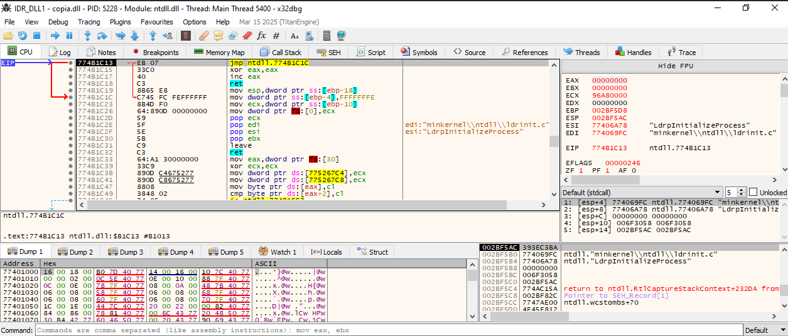
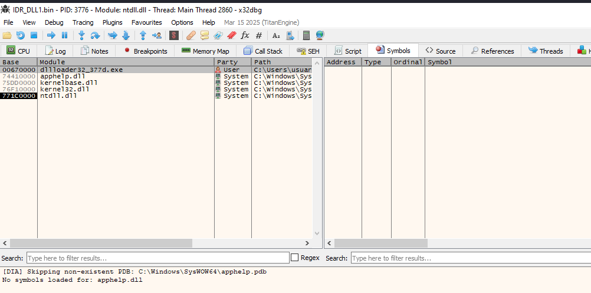
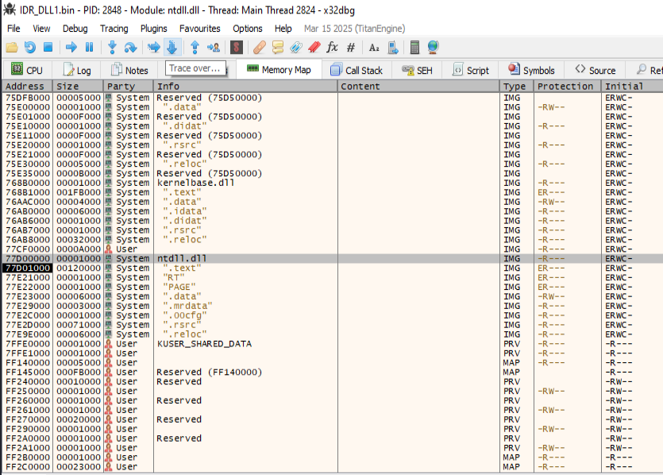
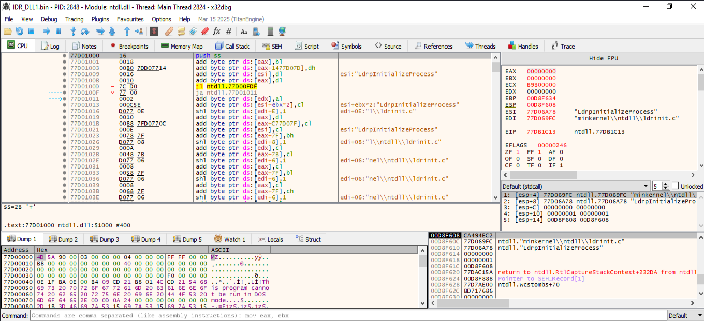

### RC_DATA / IDR_DLL1 en una DLL incrustada como recurso:

```
📍 Sección .rsrc (recursos del binario)

// .rsrc 
// ram:00404000-ram:004093ff

📍 Entrada RC_DATA / IDR_DLL1

**************************************************************
* Rsrc_RC_DATA_IDR_DLL1_409 Size of resource: 0x5000 bytes   *
**************************************************************
Rsrc_RC_DATA_IDR_DLL1_409
004040d0 4d 5a 90 00 ...

    RC_DATA es el tipo de recurso para datos arbitrarios binarios.

    IDR_DLL1 es el identificador simbólico del recurso.

    0x004040D0 contiene datos que empiezan con la firma:

    4D 5A 90 00   →  "MZ"  (cabecera DOS de un ejecutable PE/DLL)
```

- Comienza con MZ, por lo que se trata de un ejecutable PE (Portable Executable), en este caso probablemente una DLL.
- Tamaño del recurso: Size of resource: 0x5000 bytes → 20 KB. Este tamaño es razonable para una DLL maliciosa compacta que contenga payloads (por ejemplo: backdoors, downloaders o módulos cifrados).

### Resumiendo
- El dropper contiene embebida una DLL en formato PE dentro de los recursos del ejecutable.
- Está empaquetada bajo el tipo RC_DATA con el nombre IDR_DLL1.
- El ejecutable principal probablemente extrae este recurso a disco o lo carga directamente en memoria para ejecutarlo.
    

### Usamos Resource Hacker para extraer la dll
Abrimos la muestra de malware con Resorce Hacker


Al abrir Resource Hacker vemos el recurso RC_DATA → IDR_DLL1 : 1033, que es exactamente donde está la DLL incrustada. 👉 El número 1033 es el identificador del idioma (en este caso, inglés - EE.UU.), que Resource Hacker muestra como parte de la ruta al recurso:
RC_DATA → IDR_DLL1 : 1033 = RC_DATA/IDR_DLL1/409 (porque 1033 decimal = 0x409 hexadecimal).


Hacemos clic derecho sobre IDR_DLL1 : 1033 y guardamos con extensión *.bin o *.dll.
     
        
### Verificamos que la extracción se realizó correctamente
```
└─$ file IDR_DLL1.bin 
IDR_DLL1.bin: PE32 executable for MS Windows 6.00 (DLL), Intel i386, 5 sections
```

## Analizamos la dll extraida con x32dbg



El código que vemos pertenece a **ntdll.dll**, concretamente a la función **LdrInitializeProcess**. Esto indica que estamos en una fase muy temprana de la carga del proceso (dentro de las rutinas del sistema para inicializar una DLL o EXE). Lo que significa que hemos cargado correctamente la DLL, pero el código en ejecución ahora aún no es nuestro, es de ntdll.dll, el cual Windows llama automáticamente al cargar cualquier módulo PE. Es una señal de que la DLL está esperando llegar a su propio **DllMain o punto de entrada.**


### Analizamos los módulos
Para ver los módulos: ALt + E



### Vamos a encontrar el OEP ( Original Entry Point) de esta DLL --> IDR_DLL1 cargada como ntdll1.dll

- Vamos a la pestaña "Memory Map".
- Buscamos el módulo ntdll1.dll.
    Hacer captura
- Dirección Base: 77D01000
- Hacemos click derecho sobre él --> Dump Memory to File. Para despues analiazarlo con Ghidra.
- Cargamos el módulo en la vista CPU haciendo doble click sobre el.
  


- Cargamos la dll extraida con DIE:
  


xxxxxxxxxxxxxxxx copiar de chat gpt

### Direccion 77D036CD


## Step Over:


## Carga de otra dll en 77CD1C32


## De 77CD1C32 Salta a 77CCC16B


## De 77CCC218


