# RC_DATA / IDR_DLL1 en una DLL incrustada como recurso:

```
📍 Sección .rsrc (recursos del binario)

// .rsrc 
// ram:00404000-ram:004093ff

📍 Entrada RC_DATA / IDR_DLL1

**************************************************************
* Rsrc_RC_DATA_IDR_DLL1_409 Size of resource: 0x5000 bytes   *
**************************************************************
Rsrc_RC_DATA_IDR_DLL1_409
004040d0 4d 5a 90 00 ...

    RC_DATA es el tipo de recurso para datos arbitrarios binarios.

    IDR_DLL1 es el identificador simbólico del recurso.

    0x004040D0 contiene datos que empiezan con la firma:

    4D 5A 90 00   →  "MZ"  (cabecera DOS de un ejecutable PE/DLL)
```

- Comienza con MZ, por lo que se trata de un ejecutable PE (Portable Executable), en este caso probablemente una DLL.
- Tamaño del recurso: Size of resource: 0x5000 bytes → 20 KB. Este tamaño es razonable para una DLL maliciosa compacta que contenga payloads (por ejemplo: backdoors, downloaders o módulos cifrados).

## Resumiendo
- El dropper contiene embebida una DLL en formato PE dentro de los recursos del ejecutable.
- Está empaquetada bajo el tipo RC_DATA con el nombre IDR_DLL1.
- El ejecutable principal probablemente extrae este recurso a disco o lo carga directamente en memoria para ejecutarlo.
    

## Usamos Resource Hacker para extraer la dll
Abrimos la muestra de malware con Resorce Hacker
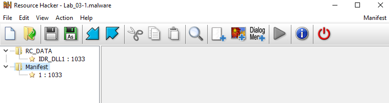


Al abrir Resource Hacker vemos el recurso RC_DATA → IDR_DLL1 : 1033, que es exactamente donde está la DLL incrustada. 👉 El número 1033 es el identificador del idioma (en este caso, inglés - EE.UU.), que Resource Hacker muestra como parte de la ruta al recurso:
RC_DATA → IDR_DLL1 : 1033 = RC_DATA/IDR_DLL1/409 (porque 1033 decimal = 0x409 hexadecimal).

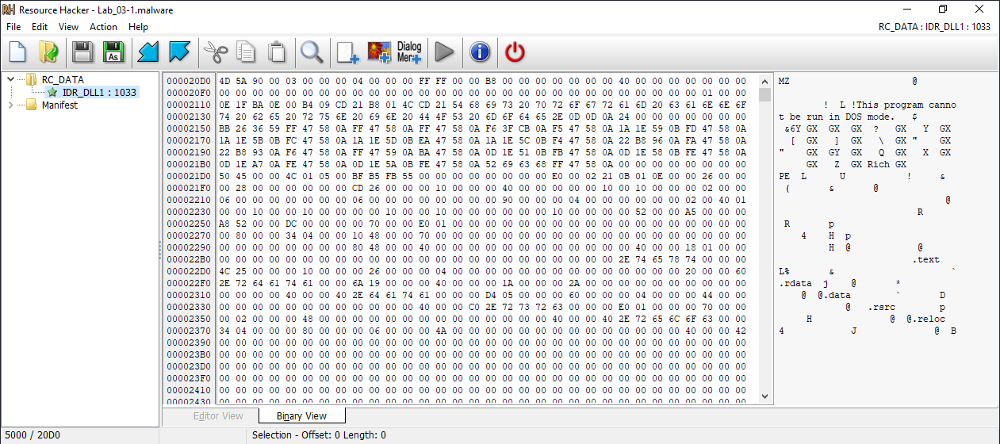

Hacemos clic derecho sobre IDR_DLL1 : 1033 y guardamos con extensión *.bin o *.dll.
     
        
## Verificamos que la extracción se realizó correctamente
```
└─$ file IDR_DLL1.bin 
IDR_DLL1.bin: PE32 executable for MS Windows 6.00 (DLL), Intel i386, 5 sections
```

## Analizamos la dll extraida con x32dbg

### Abrimos la dll extraida con x32dbg
Observamos que nos nuestra el **Punto 77BB1C13**:

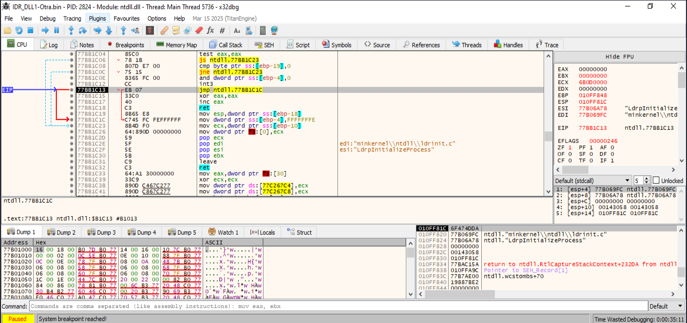

Esta **dirección 77BB1C13** no es el OEP de la DLL, sino una dirección de ejecución del sistema operativo. En concreto pertenece a ntdll.dll que es un componente fundamental de Windows. El código que vemos en la captura pertenece a funciones como RtInitializeProcess, LdrInitalizeThunk, LdrInitialize, etc, que son funciones de inicialización del sistema para procesos/DLLs, pero no del malware en sí.

**Cuando cargamos una DLL con x32dbg:**
- x32dbg no ejecuta automáticamente el código de la DLL como si fuera un EXE.
- En vez de eso, carga el proceso en pausa en el punto de inicialización del sistema (como LdrInitializeProcess).
- La ejecución aún no ha llegado al verdadero Entry Point de tu DLL.
- Estamos viendo código del loader de Windows (ntdll), no el código malicioso aún.

El código que vemos pertenece a **ntdll.dll**, concretamente a la función **LdrInitializeProcess**. Esto indica que estamos en una fase muy temprana de la carga del proceso (dentro de las rutinas del sistema para inicializar una DLL o EXE). 

Hemos cargado correctamente la DLL, pero el código en ejecución ahora aún no es el nuestro, **es de ntdll.dll, el cual Windows llama automáticamente al cargar cualquier módulo PE**. Es una señal de que la DLL está esperando llegar a su propio **DllMain o punto de entrada.**


### Punto 69F626CD
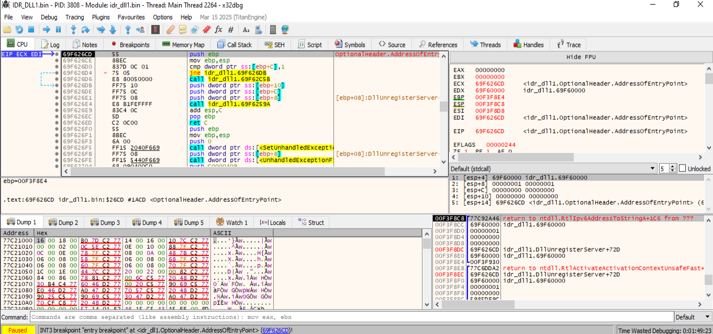


## Ir al punto de entrada real (OEP) de la DLL
Hemos visto en el punto anterior que estábamos en la IDR_DLL1 cargada como ntdll1.dll, pero no estábamos en la entrada real de esa DLL oculta en el malware (OEP). Para ir al punto de entrada real (OEP) de la DLL -->


### Analizamos los módulos cargados
Para ver los módulos: ALt + E  


Vemos la dirección que tiene el modulo ntdll.dll: 77B00000

Vamos a la pestaña "Memory Map" y buscamos el módulo ntdll.dll:
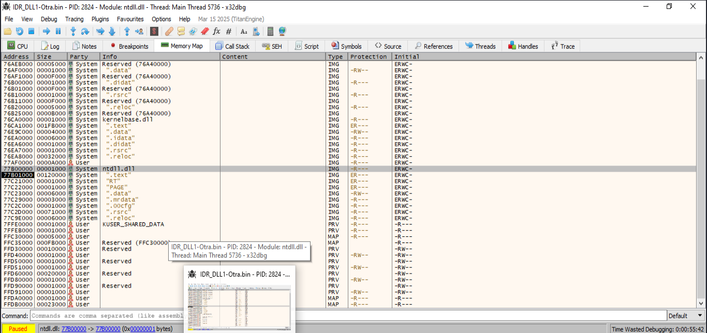


**Nota:** Hacemos click derecho sobre el módulo en la pestaña de Memory Map --> Dump Memory to File. Para después analiazarlo con Ghidra.

Cargamos el módulo ntdll.dll - 77B00000 en la vista CPU haciendo doble click sobre el.
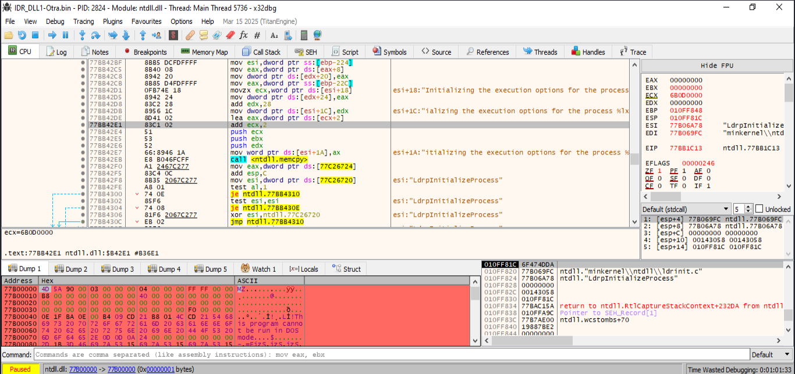


### Cargamos la dll extraida con DIE:
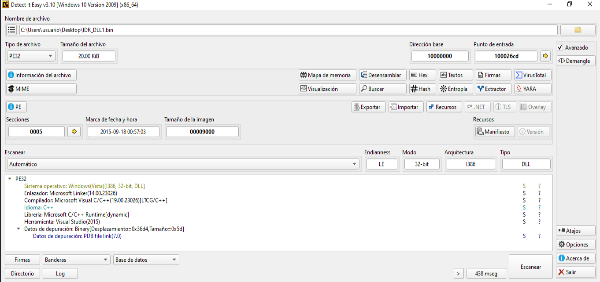

Con la información de Detect It Easy (DiE) ya podemos **calcular la dirección absoluta del OEP (Original Entry Point)** y saltar directamente desde x32dbg:
- Dirección base (Image Base): 0x10000000
- Punto de entrada (Entry Point RVA): 0x00026CD


#### 🎯🎯🎯🎯 ¿Por qué esta dirección 77B00000 y no la original 0x10000000 del binario?
Esto significa que el sistema ha cargado el módulo ntdll1.dll en la dirección virtual 0x77B00000:
- El campo ImageBase del PE es una sugerencia.
- Windows puede reubicar la DLL en otro sitio (relocation) si la dirección sugerida ya está ocupada.
- Así, aunque el binario fue compilado para 0x10000000, Windows lo cargó en 0x77B00000 en la sesión.


#### 🎯🎯🎯🎯  ¿Por qué nos importa tanto esta base?
Porque si vemos, por ejemplo, que el EntryPoint RVA es 0x26CD, entonces el OEP real en memoria es:
```
OEP = Base real en memoria + RVA = 0x77B00000 + 0x000026CD = 0x77B026CD
```
Y no 0x100026CD, que solo es válido si el binario sí se cargó en 0x10000000, lo cual no suele ser el caso al hacer DLL injection o analizar dumps en memoria.


**OEP RELATIVO A LA BASE ORIGINAL** = 0x10000000 + 0x26CD = 0x100026CD

Para obtener la dirección absoluta del punto de entrada (OEP), usamos:
```
OEP = ImageBase + EntryPoint RVA
OEP = 0x10000000 + 0x00026CD = 0x100026CD
```

**No hay que confundir:**
```
RVA (Relative Virtual Address): 0x00026CD

VA (Virtual Address): 0x10000000 + 0x00026CD = 0x100026CD
```

**✅ Fórmula para convertir el Entry Point RVA a la dirección real en x32dbg:**
```
Real_OEP = Carga_real + OEP_RVA
Real_OEP = 0x77B00000 + 0x00026CD
         = 0x77B026CD
```

### Direccion 77B026CD

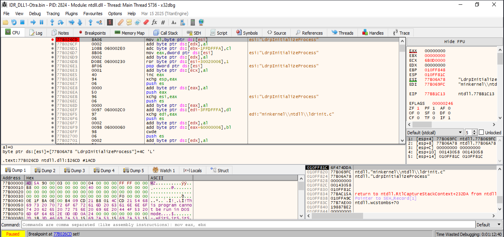


### Direccion 77D036CD

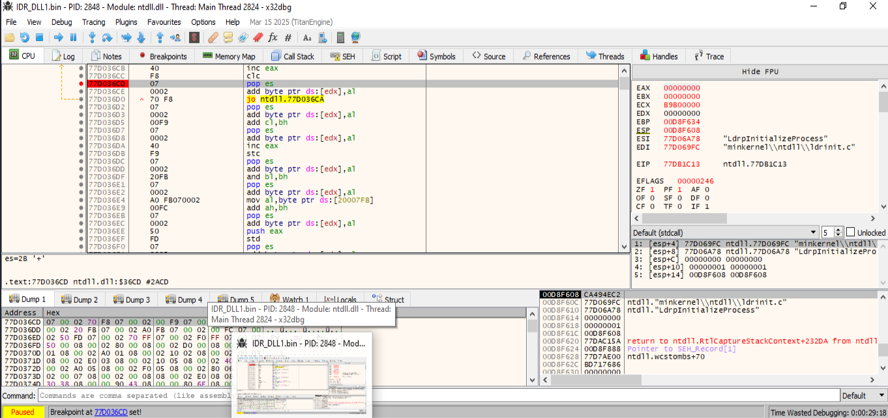


## Step Over:

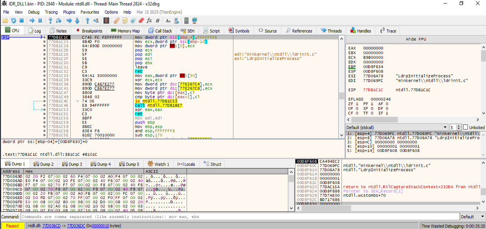


## Carga de otra dll en 77CD1C32
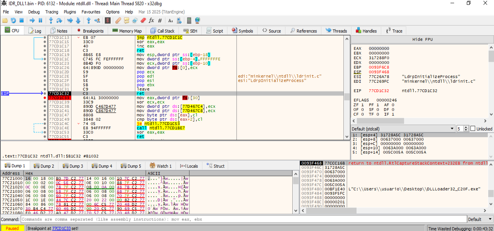


## De 77CD1C32 Salta a 77CCC16B

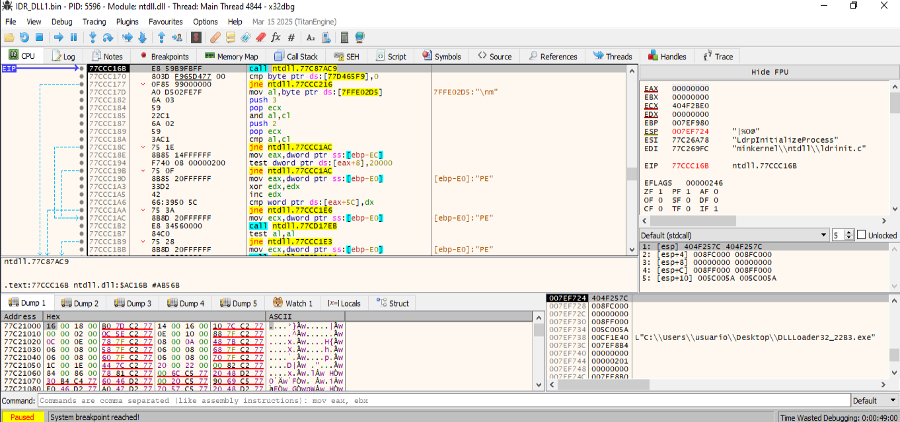


## De 77CCC218

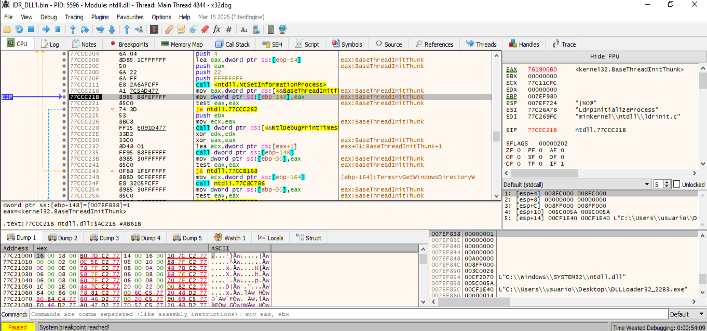


## De 77CCC249

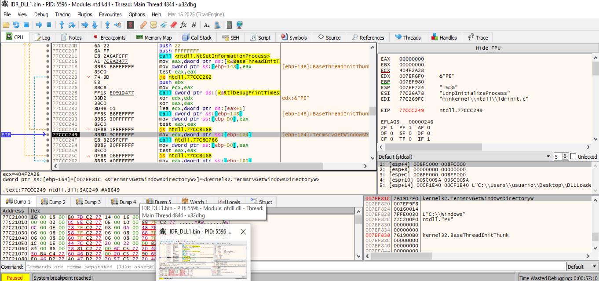


## De 77CCC24F

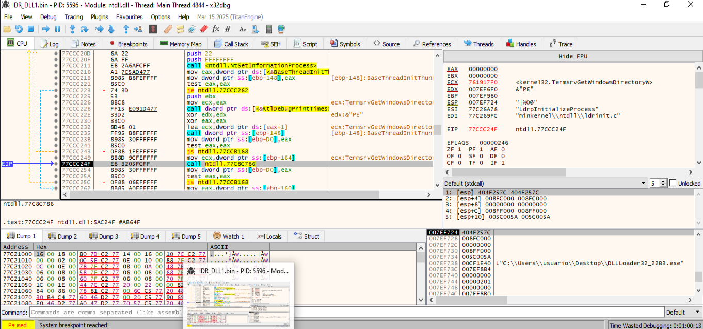


## De 77CCC284

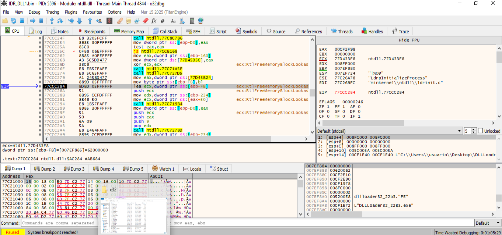


## De 77CCC2D9

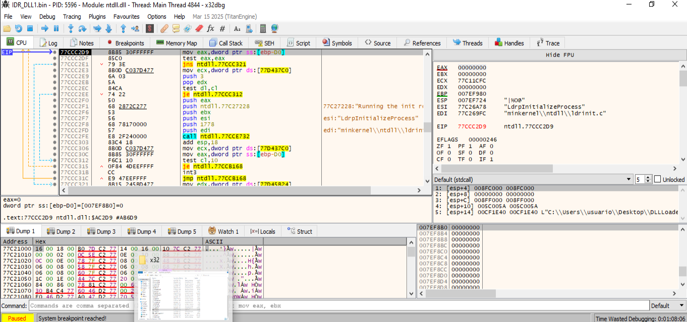


## De 77CCC3B1

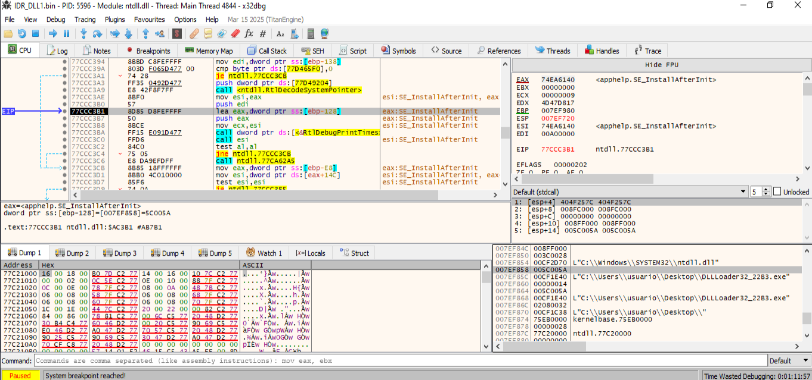


## De 77CCC3E5

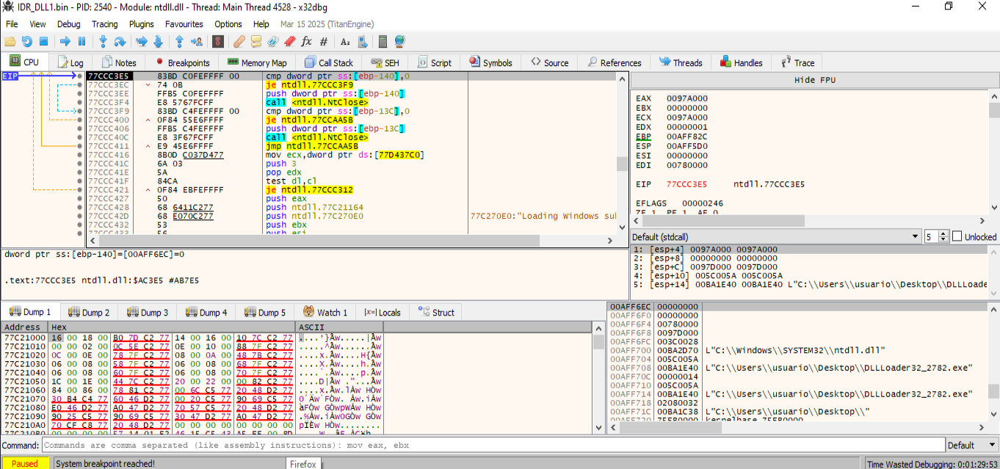
