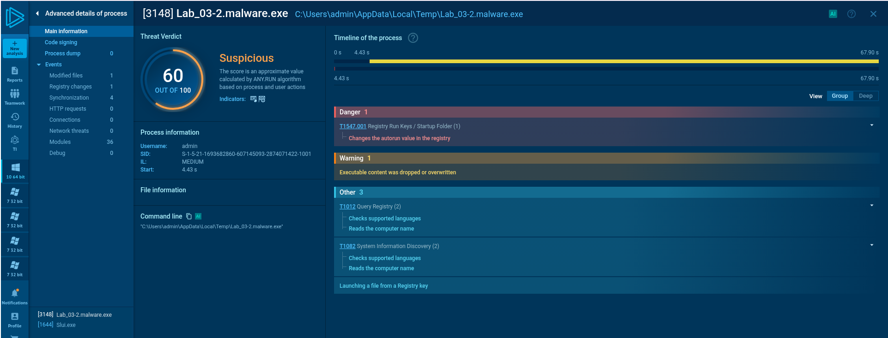

DNS Request: us.t28.net


https://any.run/report/d1bfc02db9922f89da0cef14b514b63af3703f1ab7bd88d558431151bfac92e2/65317167-d24d-47f2-bac3-2d244dc4f23b?_gl=1*qw2a6k*_ga*MjA1MDA1OTI3NC4xNzU0MjM5MTE2*_ga_53KB74YDZR*czE3NTQyMzkxMTUkbzEkZzEkdDE3NTQyMzk1MTAkajkkbDAkaDE1MTcyNTkyNzI.*_gcl_au*Nzg3OTI4OTgxLjE3NTQyMzkxMjM.*FPAU*Nzg3OTI4OTgxLjE3NTQyMzkxMjM.




___________________--
```
Download Windows Terminal:
Download the VCLibs package. In a PowerShell window, run: wget https://aka.ms/Microsoft.VCLibs.x64.14.00.Desktop.appx -usebasicparsing -o VCLibs.appx
Download the Windows Terminal MSIX bundle from the provided link: wget https://github.com/microsoft/terminal/releases/download/v1.15.3465.0/Microsoft.WindowsTerminal_Win10_1.15.3465.0_8wekyb3d8bbwe.msixbundle -UseBasicParsing -o winterminal.msixbundle
In a PowerShell admin window, add the VCLibs package: Add-AppxPackage [C:\path\to\downloaded\VCLibs.appx]
In a PowerShell admin window, run: Add-AppxPackage [C:\path\to\downloaded\winterminal.msixbundle]
(Optional) Pin Windows Terminal to the task bar
Disable proxy auto detect setting:
In the Windows search bar, search “proxy settings”,
Switch "Automatically detect settings" button off
Disable Tamper Protection
Search "Defender", open Defender settings and set all Defender Settings to off
Disable AV/Defender in GPO
In Windows search bar, search "group policy"
In GPO, navigate to → Administrative Templates → Windows Components → Microsoft Defender Antivirus → Enable “Turn off Microsoft Defender Antivirus”
Disable Windows Firewall
GPO → Administrative Templates → Network → Network Connections → Windows Defender Firewall → Domain Profile → Disable “Protect All Network Connections”
Do the same but for the Standard profile
TAKE A SNAPSHOT!
Download and install FLARE-VM:
In PowerShell Admin prompt, run: (New-Object net.webclient).DownloadFile('https://raw.githubusercontent.com/mandiant/flare-vm/main/install.ps1',"$([Environment]::GetFolderPath("Desktop"))\install.ps1")
Change directories to the Desktop
Run: Unblock-File .\install.ps1
Run: Set-ExecutionPolicy Unrestricted
Accept the prompt to set the ExecPol to unrestricted if one appears
Run: .\install.ps1 -customConfig https://raw.githubusercontent.com/HuskyHacks/PMAT-labs/main/config.xml
Follow the rest of the prompts and continue with the installation.
When the installation is done, TAKE ANOTHER SNAPSHOT!
```
