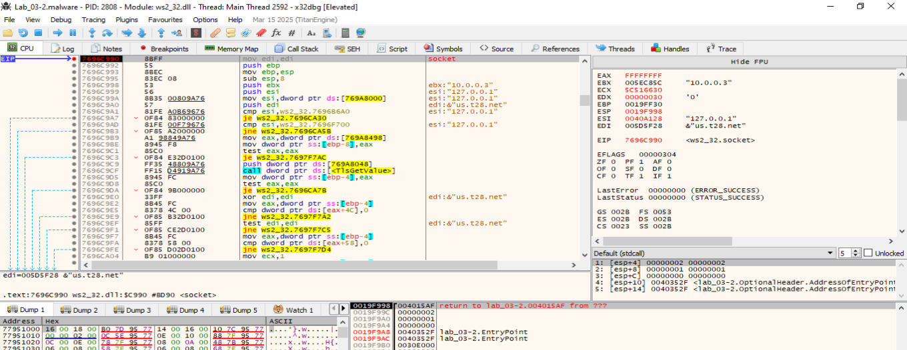
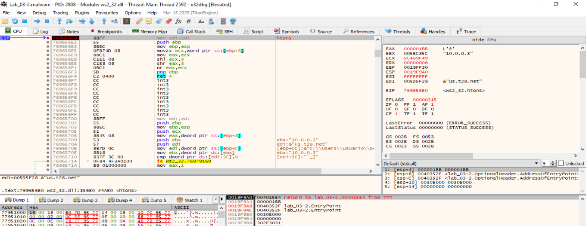
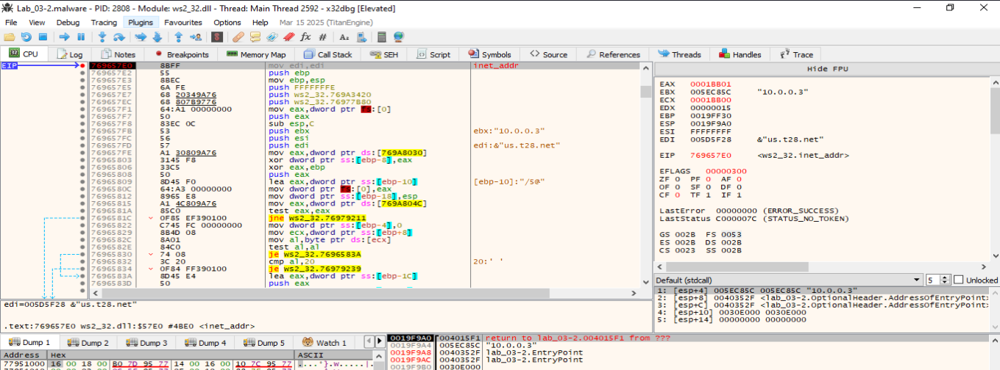
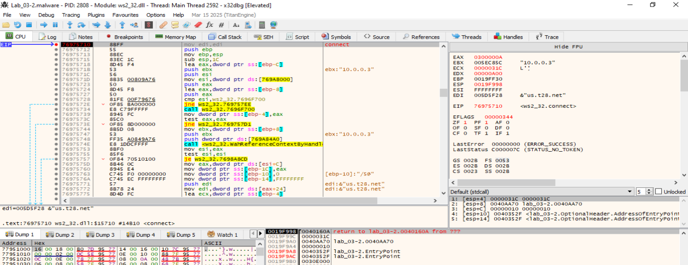
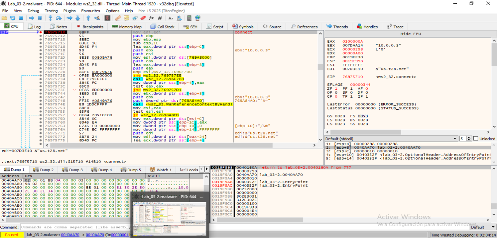
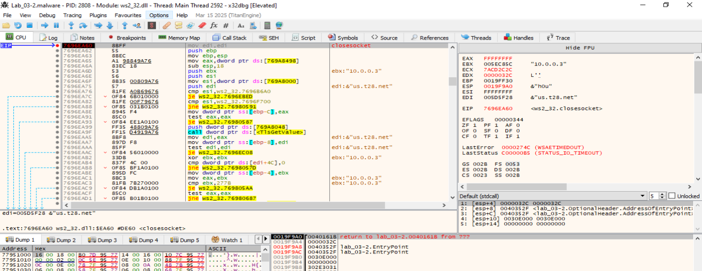
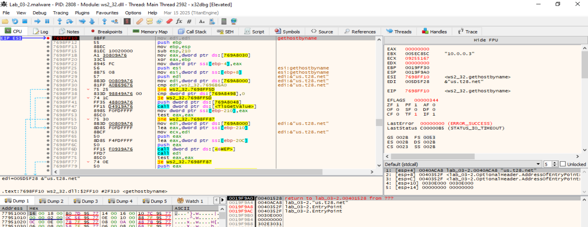
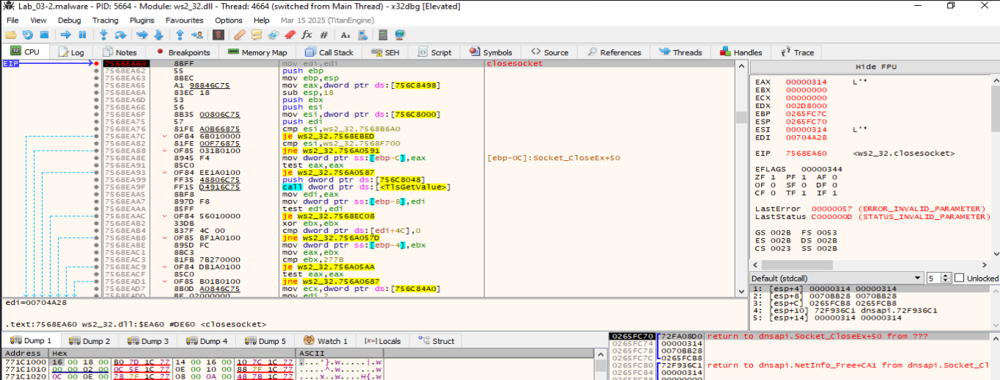

## El malware resuelve la dirección del servidor
**Flujo_**
- El host C2 es claramente us.t28.net.
- El puerto lo ves en la sockaddr_in de la llamada a connect: En la captura de ws2_32.connect, [ESP+8] apunta a la estructura sockaddr_in, y en [+2] (sin_port) tienes 0x0A03 → en orden de red esto es 0x030A en host order → 778 decimal.
  En hex:
  ```
  ntohs(0x0A03) = 0x030A = 778
  ```
  Así que el malware intenta conectar a us.t28.net:778.
  
- En el send justo antes de esa conexión, se ve que envía la cadena ASCII "fxftest".


___________________________________________________________________
## Bucle de conexión de red FALLIDA - Sin Remnux Activado
Será necesario activar una MV Remnux que se haga pasar por el host C2 para que el malware interactúe y realice las operaciones para las que está programado. En las siguientes capturas vamos investigando su comunicación y lo que espera como respuesta.

Es preciso que la MV windows donde se ejecuta el malware, resuelva el dominio us.t28.net, a la ip del servidor C2: 10.0.0.3. Para ello hay que especificar en c:\Windows\System32\drivers\etc\host:
```
10.0.0.3  us.t28.net
```


### Gethostbyname

Llama a gethostbyname con el host us.t28.net.


### WSAGetLastError: No obtiene el servicio que espera


### Inet_ntoa


inet_ntoa es otra función de la API de sockets (también en ws2_32.dll en Windows) y su nombre viene de:
```
inet = internet
n = network (orden de red)
to = a
a = ASCII
```
Inet_nto convierte una dirección IPv4 que está en binario (estructura in_addr, 4 bytes en orden de red) a una cadena ASCII con el formato habitual de “punto decimal”.

El malware usa inet_ntoa para imprimir/guardar/usar en texto la IP que había obtenido de gethostbyname. De esa forma puede loguear o mostrar la IP “humana” (10.0.0.3) que va a usar para conectarse.


### Socktet



### Htons


Htons significa host to network short. Convierte un entero de 16 bits (short / uint16_t) del orden de bytes del host (little-endian en PC Intel) al orden de bytes de red (big-endian, estándar en TCP/IP). Cuando el malware quiere enviar un número de puerto por la red, la CPU lo tiene en su orden de bytes interno. Pero el protocolo TCP/IP exige que todos los números vayan en big-endian. htons hace esa conversión antes de ponerlo en estructuras como sockaddr_in.

En esa screenshot estamos parados en ws2_32.htons y a la derecha se ve:
- edi: "&us.t28.net"
- ebx: "10.0.0.3"
- EAX = 0x000001BB → eso es 443 (estás viendo una llamada a htons con puerto 443 en ese momento concreto).

Así que el malware intenta conectar a us.t28.net:443.


### Inet_addr


Inet_addr Convierte una dirección IPv4 en formato de cadena de texto (ASCII) al formato binario de 32 bits (in_addr) en orden de red (big-endian).

En esta muestra de malware, inet_addr se usa para:
- Convertir un texto de IP que tenga embebido (p. ej. "10.0.0.3") a binario antes de guardarlo en la estructura sockaddr_in para un connect.
- Es el paso inverso a inet_ntoa (que convierte de binario a cadena legible).

### Connect


[ESP+8] → puntero a una sockaddr_in (IPv4).

Seguimos ese puntero: clic derecho sobre [ESP+8] → Follow in Dump.



```
0040AA70:  02 00  01 BB  0A 00 00 03  ...
            ^^^^  ^^^^^  ^^^^^^^^^^^
          AF_INET  puerto    IP (10.0.0.3)
```

- +0 → 02 00 = AF_INET
- +2 → 01 BB = puerto en orden de red (big‑endian)
- 0x01BB ⇒ 443 (HTTPS)
- +4 → 0A 00 00 03 = 10.0.0.3

Así que en esa llamada a connect el malware intenta ir a us.t28.net:443 (resuelto a 10.0.0.3).

Si queremos atraparlo en REMnux, escucha en 443 (necesita sudo y que no haya otro servicio usando 443):
```
sudo ncat -l 0.0.0.0 443 --keep-open --verbose
```
Cuando conecte, veremos que envía fxftest; le responderemos con algo, por ejemplo OK, para que avance.


### Closesocket
Sin embargo, vemos que la conexión se corta. Hay que investigar qué pasa para que se produzca este corte.



### Gethostbyname



### WSAGetLastError: No obtiene el servicio que espera


.... Continúa en bucle.

___________________________________________________________________


### WSAStartup: Inicia la conexión


### WSAGetLastError: No obtiene el servicio que espera


WSAGetLastError devolviendo WSASERVICE_NOT_FOUND (0x277C) → o no resuelve o no obtiene el servicio que espera.

### Gethostbyname

Llama a gethostbyname con el host us.t28.net.


### WSAGetLastError: No obtiene el servicio que espera


### Inet_ntoa


### Gethostbyname


#### WSAGetLastError: No obtiene el servicio que espera


### WSAStartup: Inicia la conexión


### Htons


### Closesocket



## Espera respuesta; si no la recibe, cierra el socket y termina la fase de red.

___________________________________________________________
## Bucle de conexión de red FALLIDA - CON Remnux Activado
### Arrancamos MV Remnux para que de respuesta.
Hacer que la MV INetSim responda
En nuestro REMnux:
```
# Redirige us.t28.net a REMnux en el Windows (hosts o DNS)
echo "<IP_REMNUX> us.t28.net" | sudo tee -a /etc/hosts

# Levanta listener TCP en el puerto 778
```
nc -lnvp 778
```
Cuando conecte, veremos "fxftest". Responderemos con lo algo que valida, como por ejemplo "OK" o repetir "fxftest".
```

### Hacemos que la MV Windows resuelva el DNS
Hacemos que el malware hable con nuestra MV REMnux: Hacemos que la MV Windows resuelva us.t28.net hacia la MV REMnux:
- En la VM Windows, editamos C:\Windows\System32\drivers\etc\hosts y añadimos:
  ```
  <IP_MV_REMnux>   us.t28.net
  ```


#### WSAStartup: Inicia la conexión

La función WSAStartup es una función de la API de Windows Sockets (Winsock) que debe ser llamada por una aplicación o DLL antes de utilizar cualquier otra función de Winsock. Su propósito principal es iniciar el uso del archivo DLL de Winsock por parte de un proceso y especificar la versión de Winsock que se utilizará. 
En términos más sencillos, WSAStartup es como el primer paso que una aplicación da para poder conectarse a internet o comunicarse con otros dispositivos a través de una red. 

¿Qué hace exactamente WSAStartup?  
Carga la DLL de Winsock: WSAStartup se encarga de cargar la DLL (Dynamic Link Library) de Winsock en la memoria, lo que permite que la aplicación pueda utilizar las funciones de red de Windows.


## El malware resuelve la dirección del servidor


- El hilo está dentro de la sección principal del binario (lab_03-2.malware), en la dirección 0x00401626.
- Justo antes hay un call Sleep (API de Windows para pausar el hilo).
- En los registros:
  - EDI apunta a la cadena "us.t28.net" → host C2.
  - EBX contiene "10.0.0.3" → la IP a la que ha resuelto el dominio.
  - En el stack [ESP+8] está 0x00030E00 que corresponde a un timeout en milisegundos (probablemente para operaciones de red).
  - EAX está a 0 → parece que la última operación de red no devolvió datos útiles.
- LastError es ERROR_SUCCESS y LastStatus es STATUS_TIMEOUT (0x00000005) → Esto indica que alguna llamada de red (probablemente recv o similar) ha esperado a que llegue algo y ha expirado.
- En memoria cerca de 0x0040A120 está la cadena "fxftest", que vimos que el malware envía al servidor tras conectar.


## Resuelto el dns intenta conectar al servidor


Llamada a WSAGetLastError dentro de ws2_32.dll, y el resultado (EAX = 0x277C) corresponde a:
```
WSASERVICE_NOT_FOUND (0x277C)
```
Eso ocurre cuando WSALookupServiceBeginW no encuentra el servicio/host que se solicitó. En el Call Stack se ve que venimos precisamente de WSALookupServiceBeginW.

El malware intenta localizar el servicio asociado al dominio/IP que resolvió (en este caso us.t28.net a 10.0.0.3), pero la consulta falla → devuelve “servicio no encontrado”.

Como no obtiene datos, el flujo tomará la rama de error de red y no pasará a la parte que queremos (recibir y procesar respuesta del C2).

Tenemos que activar la MV Remnux para que dé respuesta.


#### 2. Se conecta al puerto 443.


#### 3. Envía "fxftest".


#### 4. Espera respuesta; si no la recibe, cierra el socket y termina la fase de red.


**Interpretación del flujo:**
- El malware resolvió us.t28.net → 10.0.0.3 (REMnux).
- Se conectó al puerto 443-
- Envió "fxftest".
- Ahora está en un bucle de espera (Sleep + comprobar algo) esperando recibir respuesta del C2.
- Al no llegar datos, la operación de espera caduca (STATUS_TIMEOUT) y vuelve a intentarlo.


___________________________________

# Comunicacion exitosa con el servidor C2
```
remnux@remnux:~/Desktop$ sudo python3 listener.py 
[*] Escuchando en 0.0.0.0:443

[+] 2025-08-15 10:56:47 Conexión de 10.0.0.4:49685
    [*] Recibido hello (7): b'fxftest'
    [*] Enviado handshake/opcode: HEX:66 78 66 74 65 73 74 00 01 00 00 00
    [!] Error: timed out
    [*] Conexión cerrada.

[+] 2025-08-15 10:57:36 Conexión de 10.0.0.4:49686
    [*] Recibido hello (7): b'fxftest'
    [*] Enviado handshake/opcode: HEX:66 78 66 74 65 73 74 00 01 00 00 00
    [*] Sysinfo (512):
        HEX: 31 30 2e 30 2e 30 2e 34 00 01 00 00 d8 f9 19 00 e4 04 00 00 00 00 00 00 00 00 00 00 e4 04 00 00 48 02 20 02 20 02 20 02 20 02 20 02 20 02 20 02 20 02 68 02 28 02 28 02 28 02 28 02 20 02 20 02 20 02 20 02 20 02 20 02 20 02 20 02 20 02 20 02 20 02 20 02 20 02 20 02 20 02 20 02 20 02 20 02 48 02 10 02 10 02 10 02 10 02 10 02 10 02 10 02 10 02 10 02 10 02 10 02 10 02 10 02 10 02 10 02 84 02 84 02 84 02 84 02 84 02 84 02 84 02 84 02 84 02 84 02 10 02 10 02 10 02 10 02 10 02 10 02 10 02 81 03 81 03 81 03 81 03 81 03 81 03 01 03 01 03 01 03 01 03 01 03 01 03 01 03 01 03 01 03 24 fc 19 00 f2 71 ac 77 db 8c ac 77 d4 ba f8 6c 00 00 51 00 40 04 00 00 c0 fc 19 00 10 02 10 02 10 02 82 03 82 03 82 03 82 03 82 03 82 03 02 03 02 03 02 03 48 00 00 48 02 03 02 03 02 03 02 03 44 45 53 4b 54 4f 50 2d 43 54 51 51 48 47 54 00 02 03 02 03 ff 04 00 fb 10 02 10 02 10 02 20 02 00 02 20 02 10 02 02 03 10 02 10 02 10 02 10 02 00 02 10 02 01 03 10 02 01 03 20 02 01 03 20 02 20 02 10 02 2e 04 00 00 76 04 00 00 10 02 10 02 f0 87 52 00 02 03 10 02 87 00 00 00 8a fb ff ff 48 02 10 02 10 02 10 02 3a 93 51 00 10 02 10 02 10 02 10 02 12 03 10 02 10 02 30 02 10 02 10 02 10 02 10 02 14 02 14 02 76 04 00 00 10 02 10 02 00 00 51 00 12 03 10 02 10 02 10 02 ff 07 00 00 ff 04 00 00 c0 00 51 00 e8 a2 51 00 01 03 01 03 01 03 01 03 00 00 00 00 00 00 00 00 01 03 01 03 89 00 00 00 01 03 01 03 01 03 01 03 76 04 00 00 01 03 01 03 7f 04 00 00 00 00 00 00 01 03 02 03 98 6d 52 00 48 04 00 00 02 03 02 03 02 03 02 03 c0 00 51 00 00 00 51 00 02 00 2c 00 01 00 00 00
    [*] Enviado comando (260 bytes), opcode=1
    [*] Recibidos (256 bytes):
        ASCII: b'v\x16od\x11og\x0fofvUUUUUUUUUUUUUUUUUUUUUUUUUUUUUUUUUUUUUUUUUUUUUUUUUUUUUUUUUUUUUUUUUUUUUUUUUUUUUUUUUUUUUUUUUUUUUUUUUUUUUUUUUUUUUUUUUUUUUUUUUUUUUUUUUUUUUUUUUUUUUUUUUUUUUUUUUUUUUUUUUUUUUUUUUUUUUUUUUUUUUUUUUUUUUUUUUUUUUUUUUUUUUUUUUUUUUUUUUUUUUUUUUUUUUUUUUUUUUUUUUUUUU'
        HEX  : 76 16 6f 64 11 6f 67 0f 6f 66 76 55 55 55 55 55 55 55 55 55 55 55 55 55 55 55 55 55 55 55 55 55 55 55 55 55 55 55 55 55 55 55 55 55 55 55 55 55 55 55 55 55 55 55 55 55 55 55 55 55 55 55 55 55 55 55 55 55 55 55 55 55 55 55 55 55 55 55 55 55 55 55 55 55 55 55 55 55 55 55 55 55 55 55 55 55 55 55 55 55 55 55 55 55 55 55 55 55 55 55 55 55 55 55 55 55 55 55 55 55 55 55 55 55 55 55 55 55 55 55 55 55 55 55 55 55 55 55 55 55 55 55 55 55 55 55 55 55 55 55 55 55 55 55 55 55 55 55 55 55 55 55 55 55 55 55 55 55 55 55 55 55 55 55 55 55 55 55 55 55 55 55 55 55 55 55 55 55 55 55 55 55 55 55 55 55 55 55 55 55 55 55 55 55 55 55 55 55 55 55 55 55 55 55 55 55 55 55 55 55 55 55 55 55 55 55 55 55 55 55 55 55 55 55 55 55 55 55 55 55 55 55 55 55 55 55 55 55 55 55 55 55 55 55 55 55
    [*] Inactividad: fin de la sesión.
    [*] Conexión cerrada.

[+] 2025-08-15 10:57:55 Conexión de 10.0.0.4:49687
    [*] Recibido hello (7): b'fxftest'
    [*] Enviado handshake/opcode: HEX:66 78 66 74 65 73 74 00 01 00 00 00
    [*] Sysinfo (512):
        HEX: 31 30 2e 30 2e 30 2e 34 00 01 00 00 d8 f9 19 00 e4 04 00 00 00 00 00 00 00 00 00 00 e4 04 00 00 48 02 20 02 20 02 20 02 20 02 20 02 20 02 20 02 20 02 68 02 28 02 28 02 28 02 28 02 20 02 20 02 20 02 20 02 20 02 20 02 20 02 20 02 20 02 20 02 20 02 20 02 20 02 20 02 20 02 20 02 20 02 20 02 48 02 10 02 10 02 10 02 10 02 10 02 10 02 10 02 10 02 10 02 10 02 10 02 10 02 10 02 10 02 10 02 84 02 84 02 84 02 84 02 84 02 84 02 84 02 84 02 84 02 84 02 10 02 10 02 10 02 10 02 10 02 10 02 10 02 81 03 81 03 81 03 81 03 81 03 81 03 01 03 01 03 01 03 01 03 01 03 01 03 01 03 01 03 01 03 24 fc 19 00 f2 71 ac 77 db 8c ac 77 d4 ba f8 6c 00 00 51 00 40 04 00 00 c0 fc 19 00 10 02 10 02 10 02 82 03 82 03 82 03 82 03 82 03 82 03 02 03 02 03 02 03 48 00 00 48 02 03 02 03 02 03 02 03 44 45 53 4b 54 4f 50 2d 43 54 51 51 48 47 54 00 02 03 02 03 ff 04 00 fb 10 02 10 02 10 02 20 02 00 02 20 02 10 02 02 03 10 02 10 02 10 02 10 02 00 02 10 02 01 03 10 02 01 03 20 02 01 03 20 02 20 02 10 02 2e 04 00 00 76 04 00 00 10 02 10 02 f0 87 52 00 02 03 10 02 87 00 00 00 8a fb ff ff 48 02 10 02 10 02 10 02 3a 93 51 00 10 02 10 02 10 02 10 02 12 03 10 02 10 02 30 02 10 02 10 02 10 02 10 02 14 02 14 02 76 04 00 00 10 02 10 02 00 00 51 00 12 03 10 02 10 02 10 02 ff 07 00 00 ff 04 00 00 c0 00 51 00 e8 a2 51 00 01 03 01 03 01 03 01 03 00 00 00 00 00 00 00 00 01 03 01 03 89 00 00 00 01 03 01 03 01 03 01 03 76 04 00 00 01 03 01 03 7f 04 00 00 00 00 00 00 01 03 02 03 98 6d 52 00 48 04 00 00 02 03 02 03 02 03 02 03 c0 00 51 00 00 00 51 00 02 00 2c 00 01 00 00 00
    [*] Enviado comando (260 bytes), opcode=1
    [*] Recibidos (256 bytes):
        ASCII: b'v\x16od\x11og\x0fofvUUUUUUUUUUUUUUUUUUUUUUUUUUUUUUUUUUUUUUUUUUUUUUUUUUUUUUUUUUUUUUUUUUUUUUUUUUUUUUUUUUUUUUUUUUUUUUUUUUUUUUUUUUUUUUUUUUUUUUUUUUUUUUUUUUUUUUUUUUUUUUUUUUUUUUUUUUUUUUUUUUUUUUUUUUUUUUUUUUUUUUUUUUUUUUUUUUUUUUUUUUUUUUUUUUUUUUUUUUUUUUUUUUUUUUUUUUUUUUUUUUUUU'
        HEX  : 76 16 6f 64 11 6f 67 0f 6f 66 76 55 55 55 55 55 55 55 55 55 55 55 55 55 55 55 55 55 55 55 55 55 55 55 55 55 55 55 55 55 55 55 55 55 55 55 55 55 55 55 55 55 55 55 55 55 55 55 55 55 55 55 55 55 55 55 55 55 55 55 55 55 55 55 55 55 55 55 55 55 55 55 55 55 55 55 55 55 55 55 55 55 55 55 55 55 55 55 55 55 55 55 55 55 55 55 55 55 55 55 55 55 55 55 55 55 55 55 55 55 55 55 55 55 55 55 55 55 55 55 55 55 55 55 55 55 55 55 55 55 55 55 55 55 55 55 55 55 55 55 55 55 55 55 55 55 55 55 55 55 55 55 55 55 55 55 55 55 55 55 55 55 55 55 55 55 55 55 55 55 55 55 55 55 55 55 55 55 55 55 55 55 55 55 55 55 55 55 55 55 55 55 55 55 55 55 55 55 55 55 55 55 55 55 55 55 55 55 55 55 55 55 55 55 55 55 55 55 55 55 55 55 55 55 55 55 55 55 55 55 55 55 55 55 55 55 55 55 55 55 55 55 55 55 55 55
    [*] Inactividad: fin de la sesión.
    [*] Conexión cerrada

```
