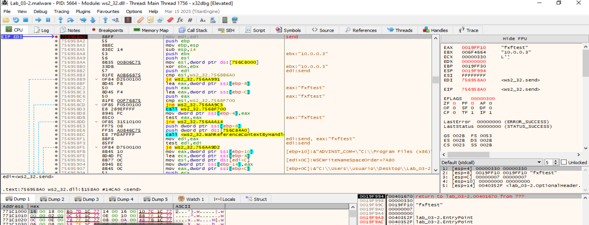

## El malware resuelve la dirección del servidor
**Flujo_**
- El host C2 es claramente us.tz8.net.
- El puerto lo ves en la sockaddr_in de la llamada a connect: En la captura de ws2_32.connect, [ESP+8] apunta a la estructura sockaddr_in, y en [+2] (sin_port) tienes 0x0A03 → en orden de red esto es 0x030A en host order → 778 decimal.
  En hex:
  ```
  ntohs(0x0A03) = 0x030A = 778
  ```
  Así que el malware intenta conectar a us.tz8.net:778.
  
- En el send justo antes de esa conexión, se ve que envía la cadena ASCII "fxftest".


### Bucle de conexión de red fallida

#### WSAStartup: Inicia la conexión


#### WSAGetLastError: No obtiene el servicio que espera


WSAGetLastError devolviendo WSASERVICE_NOT_FOUND (0x277C) → o no resuelve o no obtiene el servicio que espera.

#### X Gethostbyname

Llama a gethostbyname con el host us.tz8.net.


#### WSAGetLastError: No obtiene el servicio que espera


#### Inet_ntoa


#### Gethostbyname


#### WSAGetLastError: No obtiene el servicio que espera


#### WSAStartup: Inicia la conexión


#### Htons


#### Closesocket

Espera respuesta; si no la recibe, cierra el socket y termina la fase de red.

___________________________________________________________
#### WSAStartup: Inicia la conexión


#### 2. Se conecta al puerto 778.

#### 3. Envía "fxftest".


#### 4. Espera respuesta; si no la recibe, cierra el socket y termina la fase de red.


## Hacer que la MV INetSim responda
En nuestro REMnux:
```
# Redirige us.tz8.net a REMnux en el Windows (hosts o DNS)
echo "<IP_REMNUX> us.tz8.net" | sudo tee -a /etc/hosts

# Levanta listener TCP en el puerto 778
```
nc -lnvp 778
```
Cuando conecte, veremos "fxftest". Responderemos con lo algo que valida, como por ejemplo "OK" o repetir "fxftest".


## Resulto el dns intenta conectar al servidor


Llamada a WSAGetLastError dentro de ws2_32.dll, y el resultado (EAX = 0x277C) corresponde a:
```
WSASERVICE_NOT_FOUND (0x277C)
```
Eso ocurre cuando WSALookupServiceBeginW no encuentra el servicio/host que se solicitó. En el Call Stack se ve que venimos precisamente de WSALookupServiceBeginW.

El malware intenta localizar el servicio asociado al dominio/IP que resolvió (en este caso us.tz8.net a 10.0.0.3), pero la consulta falla → devuelve “servicio no encontrado”.

Como no obtiene datos, el flujo tomará la rama de error de red y no pasará a la parte que queremos (recibir y procesar respuesta del C2).

Tenemos que activar la MV Remnux para que dé respuesta.


## El malware resuelve la dirección del servidor


- El hilo está dentro de la sección principal del binario (lab_03-2.malware), en la dirección 0x00401626.
- Justo antes hay un call Sleep (API de Windows para pausar el hilo).
- En los registros:
  - EDI apunta a la cadena "us.tz8.net" → host C2.
  - EBX contiene "10.0.0.3" → la IP a la que ha resuelto el dominio.
  - En el stack [ESP+8] está 0x00030E00 que corresponde a un timeout en milisegundos (probablemente para operaciones de red).
  - EAX está a 0 → parece que la última operación de red no devolvió datos útiles.
- LastError es ERROR_SUCCESS y LastStatus es STATUS_TIMEOUT (0x00000005) → Esto indica que alguna llamada de red (probablemente recv o similar) ha esperado a que llegue algo y ha expirado.
- En memoria cerca de 0x0040A120 está la cadena "fxftest", que vimos que el malware envía al servidor tras conectar.


**Interpretación del flujo:**
- El malware resolvió us.tz8.net → 10.0.0.3 (REMnux).
- Se conectó al puerto que descubrimos antes (778).
- Envió "fxftest".
- Ahora está en un bucle de espera (Sleep + comprobar algo) esperando recibir respuesta del C2.
- Al no llegar datos, la operación de espera caduca (STATUS_TIMEOUT) y vuelve a intentarlo.
