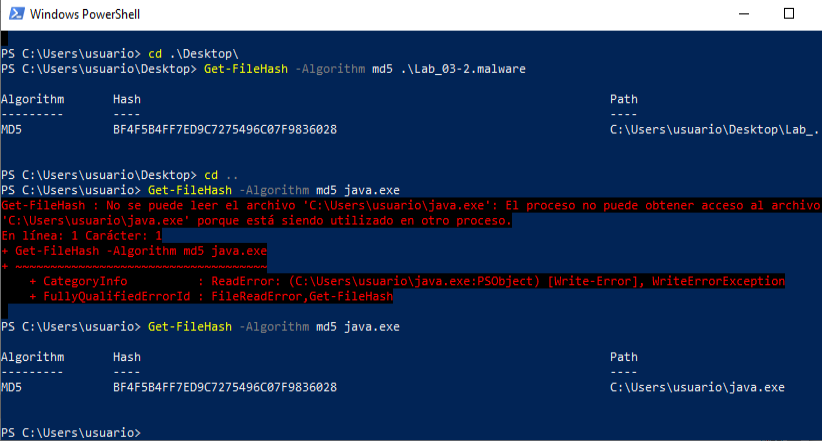

Cuando se ejecuta la muestra, el malware se está replicando a sí mismo como java.exe.

Ya que son idénticos, no hay diferencias binarias, pero puedes ver qué proceso lo ejecuta con:

Get-Process | Where-Object { $_.Path -eq "C:\Users\usuario\java.exe" }

