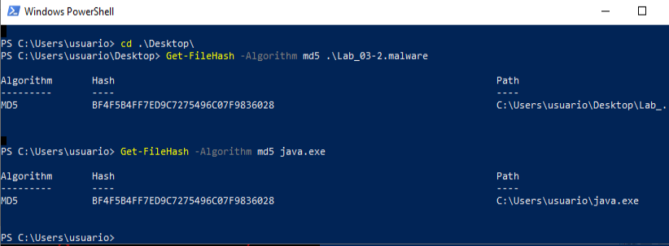

Cuando se ejecuta la muestra, el malware se está replicando a sí mismo como java.exe.

Hay que avanzar un poco con x32dbg para que termine de usar el fichero y permita calcular su md5.

Ya que son idénticos, no hay diferencias binarias.

