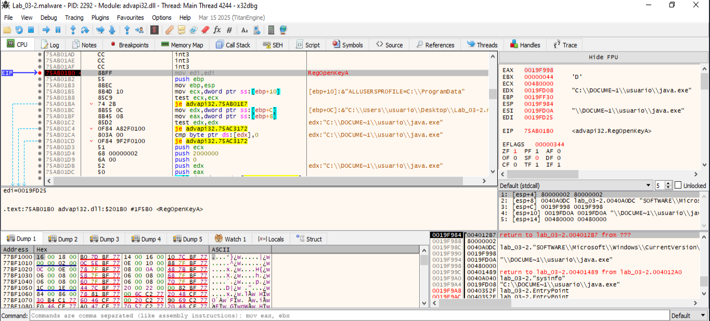
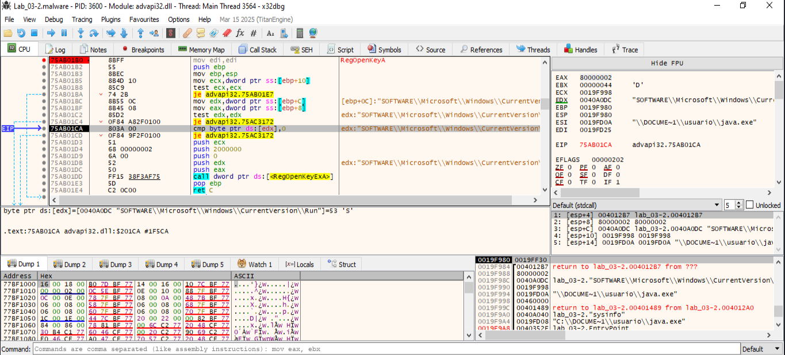
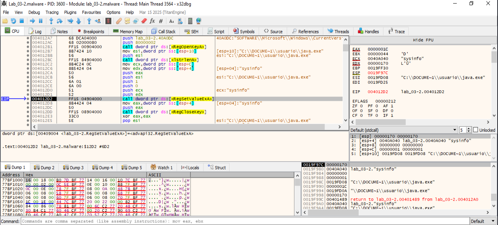
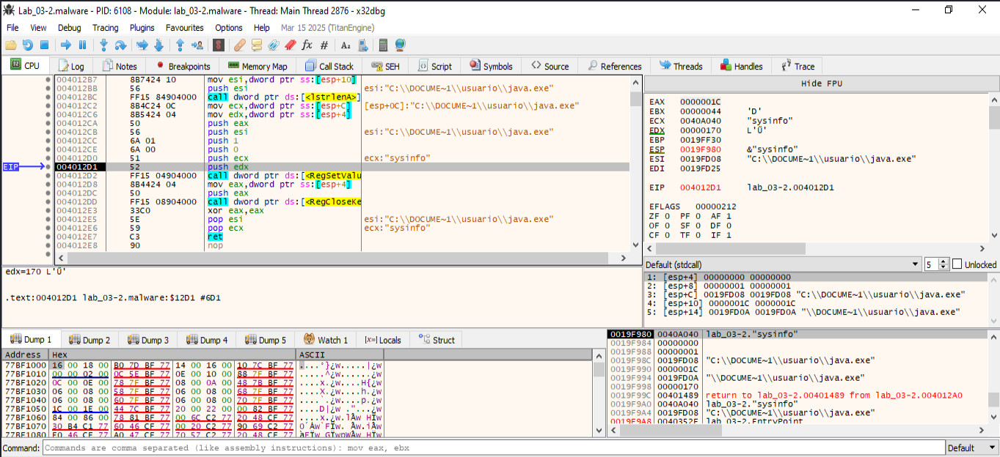
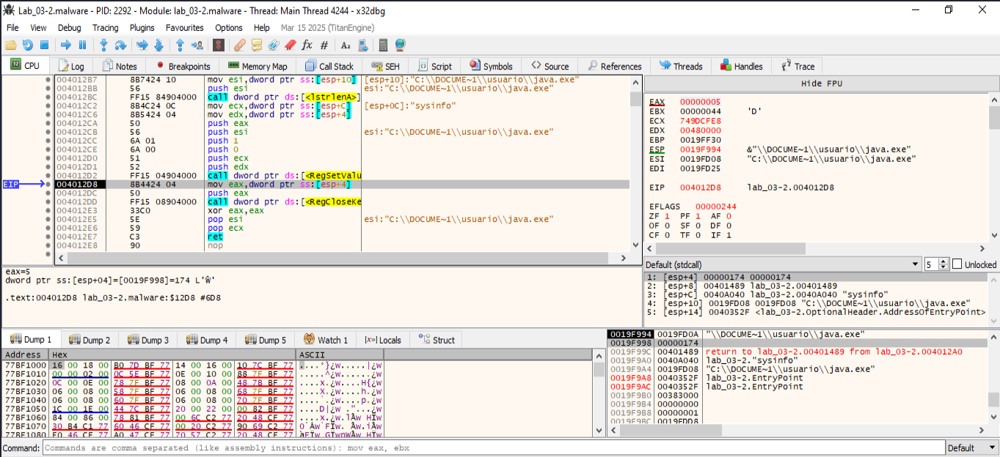
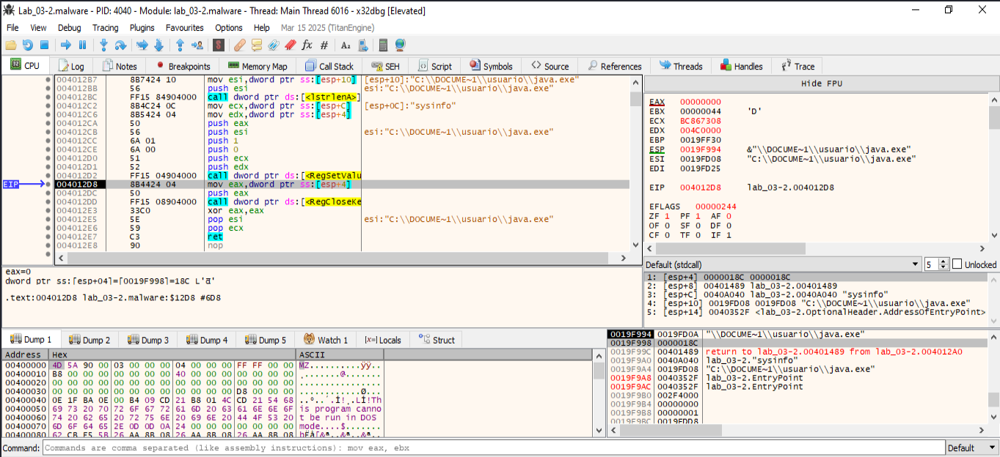
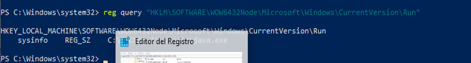
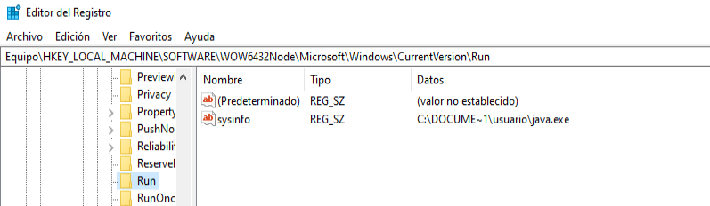

## Persistencia


```
                             DAT_0040a0d8                                    XREF[1]:     FUN_00401020:00401057(*)  
        0040a0d8 72              ??         72h    r
        0040a0d9 00              ??         00h
        0040a0da 00              ??         00h
        0040a0db 00              ??         00h
                             s_SOFTWARE\Microsoft\Windows\Curre_0040a0dc     XREF[1]:     FUN_004012a0:004012a7(*)  
        0040a0dc 53 4f 46        ds         "SOFTWARE\\Microsoft\\Windows\\CurrentVersion\
                 54 57 41 
                 52 45 5c 
        0040a10a 00              ??         00h
        0040a10b 00              ??         00h
        0040a10c 00              ??         00h
        0040a10d 00              ??         00h
        0040a10e 00              ??         00h
        0040a10f 00              ??         00h

```


Esta clave del Registro de Windows (SOFTWARE\\Microsoft\\Windows\\CurrentVersion\) es comúnmente usada por malware para establecer persistencia.

Estas claves se utilizan para que ciertos programas se ejecuten automáticamente al iniciar sesión.:
- HKEY_CURRENT_USER\SOFTWARE\Microsoft\Windows\CurrentVersion\Run
- HKEY_LOCAL_MACHINE\SOFTWARE\Microsoft\Windows\CurrentVersion\Run 


Basado en esto, es altamente probable que el malware esté intentando:
- Escribirse a sí mismo en esa clave (Run)
- Con un valor tipo: java.exe apuntando a C:\Users\usuario\java.exe
- Para que se ejecute en cada inicio de Windows

       
### ¿Quien llama a DAT_0040a0d8? --> FUN_004012a0:004012a7(*) 

```
                             **************************************************************
                             *                          FUNCTION                          *
                             **************************************************************
                             undefined __cdecl FUN_00401a20(undefined4 param_1, LPCST
                               assume FS_OFFSET = 0xffdff000
             undefined         <UNASSIGNED>   <RETURN>
             undefined4        Stack[0x4]:4   param_1
             LPCSTR            Stack[0x8]:4   param_2                                 XREF[1]:     00401a20(R)  
             undefined1        Stack[-0x624   local_624                               XREF[2]:     00401a46(*), 
                                                                                                   00401a4c(*)  
                             FUN_00401a20                                    XREF[1]:     FUN_004012f0:00401729(c)  
        00401a20 8b 54 24 08     MOV        EDX,dword ptr [ESP + param_2]
        00401a24 81 ec 44        SUB        ESP,0x644
                 06 00 00
        00401a2a 33 c0           XOR        EAX,EAX
        00401a2c 53              PUSH       EBX
        00401a2d 57              PUSH       EDI
                             LAB_00401a2e                                    XREF[1]:

......etc.....

```


### ¿Qué hace el valor DAT_0040a0d8?
```
DAT_0040a0d8 = 0x72 = ASCII 'r'
```

Este valor 'r' se usa como relleno en una instrucción REP STOSD, pero no se carga explícitamente en ningún registro ni se usa como parámetro de función. Parece más bien una referencia indirecta sin efecto real directo en el comportamiento del malware.


### La dirección 0x0040a0dc contiene esta string:
```
0040a0dc 53 4f 46        ds         "SOFTWARE\\Microsoft\\Windows\\CurrentVersion\
                 54 57 41 
                 52 45 5c 
```

Esto es una clave real del registro de Windows usada comúnmente para persistencia. Es decir, para que un programa se ejecute automáticamente al iniciar Windows. Esta clave suele tener entradas tipo:
```
[HKEY_CURRENT_USER\Software\Microsoft\Windows\CurrentVersion\Run]
"MyMalware"="C:\\Users\\usuario\\java.exe"
```

El binario java.exe —que el propio malware ha escrito en esa ruta— se ejecutará en cada arranque.

### ¿Cómo confirmar si el malware escribe en esta clave?

Debemos analizar la función FUN_004012a0, que en la traza aparece con la instrucción:
```
004012a7 PUSH s_SOFTWARE\Microsoft\Windows\Curre_0040a0dc
```
Eso indica que usa esta clave como argumento, muy probablemente de una API como RegCreateKeyExA o RegSetValueExA.

Pistas para confirmar:
- Buscar llamadas a RegCreateKeyExA, RegOpenKeyExA, RegSetValueExA.
- Revisar qué valor establece: probablemente "java.exe" o la ruta completa a C:\Users\usuario\java.exe.
- Podemos poner breakpoints en esas APIs en x32dbg (por ejemplo, bp RegSetValueExA) y ver los parámetros en la pila.


### Por los strings, sabemos que usa:
- RegCloseKey
- RegSetValueExA
- RegOpenKeyA

```
                             **************************************************************
                             * IMAGE_IMPORT_BY_NAME                                       *
                             **************************************************************
        00409a46 5b 01           dw         15Bh
        00409a48 52 65 67        ds         "RegCloseKey"
                 43 6c 6f 
                 73 65 4b 
                             **************************************************************
                             * IMAGE_IMPORT_BY_NAME                                       *
                             **************************************************************
        00409a54 86 01           dw         186h
        00409a56 52 65 67        ds         "RegSetValueExA"
                 53 65 74 
                 56 61 6c 
        00409a65 00              ??         00h
                             **************************************************************
                             * IMAGE_IMPORT_BY_NAME                                       *
                             **************************************************************
        00409a66 71 01           dw         171h
        00409a68 52 65 67        ds         "RegOpenKeyA"
                 4f 70 65 
                 6e 4b 65 
```

### ¿Qué hacen estas APIs en contexto?
**RegOpenKeyA:**
- Abre una subclave del registro.
- 👉 Aquí abre HKCU\Software\Microsoft\Windows\CurrentVersion\Run.

**RegSetValueExA**
- Escribe un valor en la clave.
- 👉 Aquí establece algo como: java.exe = C:\Users\usuario\java.exe.

**RegCloseKey**
- Cierra el handle de la clave.
- 👉 Limpia recursos tras haber escrito la clave.
    
    
    
### Poner breakpoints en las APIs:
```
bp RegOpenKeyA
bp RegSetValueExA
bp RegCloseKey
```

______
### BreakPoint: RegOpenKeyA --> 75AB01B0




En la ventana "Default (stdcall)", vemos esto:
```
[esp]    00000002
[esp+4]  0040A0DC "SOFTWARE\\Microsoft\\Windows\\CurrentVersion\\Run"
[esp+8]  80000002
```
Esto corresponde a los parámetros de RegOpenKeyA:
| Parámetro |	Valor |	Significado |
| -- | -- | -- |
| samDesired | 0x00000002	KEY_SET_VALUE |  ✔️ Escribir valores |
| lpSubKey | "SOFTWARE\...\Run" | 	Clave de ejecución automática |
| hKey | 0x80000002 | HKEY_LOCAL_MACHINE |

**✅ Conclusión:**
- El malware está solicitando permisos de escritura sobre la clave de registro: HKLM\SOFTWARE\Microsoft\Windows\CurrentVersion\Run

**✅ Compruebo las claves de registro, pero no se encuentra esta modificación.**
_____

### BreakPoint: RegOpenKeyA --> 75AB01CA



📌 Valores relevantes en la pila:
```
EDX = 0x0040A0DC → "SOFTWARE\\Microsoft\\Windows\\CurrentVersion\\Run" ← ✔ Clave objetivo
[ESP+14] = 0x0019FD0A → "C:\\DOCUME~1\\usuario\\java.exe" ← ✔ Valor a escribir
EAX = 0x80000002 → HKEY_LOCAL_MACHINE (verificado por constante)
```

✅ ¿Qué está intentando hacer?
- El malware llama a:
  - RegOpenKeyExA(HKEY_LOCAL_MACHINE, "SOFTWARE\\Microsoft\\Windows\\CurrentVersion\\Run", ...)
- Después, seguramente llamará a:
  - RegSetValueExA(hKey, "sysinfo", 0, REG_SZ, "C:\\DOCUME~1\\usuario\\java.exe", ...)
- Esto significa que intenta añadir una entrada en esta clave del registro:
  - [HKEY_LOCAL_MACHINE\SOFTWARE\Microsoft\Windows\CurrentVersion\Run]
  - "sysinfo" = "C:\DOCUME~1\usuario\java.exe"
- Con esto, el malware se asegura de ejecutarse cada vez que se inicie Windows.

_________________
### BreakPoint: RegSetValueExA



El malware modifica esta clave del registro:
```
[HKEY_LOCAL_MACHINE\SOFTWARE\Microsoft\Windows\CurrentVersion\Run]
"sysinfo" = "C:\DOCUME~1\usuario\java.exe"
```
Esto significa que el malware se asegura de ejecutarse automáticamente en cada inicio de Windows.


___________

### Cierro todo y empiezo de nuevo
No consigo ver la modificación de las claves de registro. 
_________________________

### BreakPoint: Antes de RegSetValueExA



La función RegSetValueExA está a punto de ser llamada con los siguientes parámetros:
| Parámetro |	Valor |
| -- | -- |
| hKey | 	Valor no visible aquí, pero ya fue abierto previamente ✅ |
| lpValueName | 	"sysinfo" (almacenado en [ESP+4])**** |
| lpData | 	"C:\\DOCUME~1\\usuario\\java.exe" (almacenado en [ESP+8]) |
| dwType | 	1 (REG_SZ) |


________________________________
### BreakPoint: Justo después de RegSetValueExA
### Se produce un ERROR al escribir la clave de registro


```
La instrucción call dword ptr ds:[RegSetValueA] se ejecuta en 0x004012D8
EAX = 0x5 tras la llamada → esto significa: ERROR_ACCESS_DENIED
⚠️ El malware intentó escribir, pero falló porque no tenía permisos suficientes.
```
    

**HAY UN FALLO Y NO ESCRIBE LA CLAVE DE REGISTRO**

El malware intenta establecer persistencia usando:
```
HKEY_LOCAL_MACHINE\SOFTWARE\Microsoft\Windows\CurrentVersion\Run
valor: "sysinfo"
datos: "C:\DOCUME~1\usuario\java.exe"
```
**Pero falla con código de error 5 (ACCESS_DENIED), así que no consigue establecerla.**

___________

## Abrimos X32DBG COMO ADMINISTRADOR

Volvemos a ejecutar x32dbg como administrador y volvemos a analizar la persistencia. Observamos que ya no falla en escribir la clave de registro:



Se escribe la clave de registro para persistencia:

❗Aclaración sobre por qué esta clave de registro **no aparece en regedit o reg query**: Nuestro sistema operativo es Windows 64 bits, y el malware es 32 bits, por lo que Windows redirige automáticamente las escrituras de claves 32-bit a esta ruta:
```
HKLM\SOFTWARE\WOW6432Node\Microsoft\Windows\CurrentVersion\Run
reg query "HKLM\SOFTWARE\WOW6432Node\Microsoft\Windows\CurrentVersion\Run"
```

```
HKEY_LOCAL_MACHINE
 └── SOFTWARE
     └── WOW6432Node
         └── Microsoft
             └── Windows
                 └── CurrentVersion
                     └── Run

```







