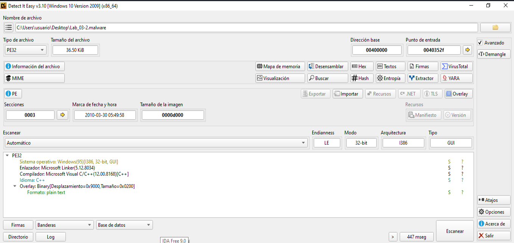

### Análisis Empaquetado
```
└─$ pepack Lab_03-2.malware -d db_packer.txt 
packer:                          Microsoft Visual C++
```

```
└─$ upx -d Lab_03-2.malware -o Lab_03-2-unpacked.malware
                       Ultimate Packer for eXecutables
                          Copyright (C) 1996 - 2024
UPX 4.2.4       Markus Oberhumer, Laszlo Molnar & John Reiser    May 9th 2024

        File size         Ratio      Format      Name
   --------------------   ------   -----------   -----------
upx: Lab_03-2.malware: NotPackedException: not packed by UPX

Unpacked 0 files.
```

### Virustotal
https://www.virustotal.com/gui/file/d1bfc02db9922f89da0cef14b514b63af3703f1ab7bd88d558431151bfac92e2


### Info
```
file,
file > sha256,D1BFC02DB9922F89DA0CEF14B514B63AF3703F1AB7BD88D558431151BFAC92E2
file > first 32 bytes (hex),4D 5A 90 00 03 00 00 00 04 00 00 00 FF FF 00 00 B8 00 00 00 00 00 00 00 40 00 00 00 00 00 00 00 
file > first 32 bytes (text),MZ............................................@..............
file > info,size: 37376 bytes, entropy: 6.314
file > type,executable, 32-bit, GUI
file > version,n/a
file > description,n/a
entry-point > first 32 bytes (hex),55 8B EC 6A FF 68 78 91 40 00 68 C4 5E 40 00 64 A1 00 00 00 00 50 64 89 25 00 00 00 00 83 EC 10 
entry-point > location,0x0000352F (section[.text])
file > signature,Microsoft Linker 6.0 | Visual Studio 6.0 MASM | Microsoft Visual C++ | Microsoft Visual C++ 6.0 - 8.0
,
stamps,
stamp > compiler,Tue Mar 30 11:49:58 2010 (UTC)
stamp > debug,n/a
stamp > resource,n/a
stamp > import,n/a
stamp > export,n/a
,
names,
file > name,c:\users\usuario\desktop\lab_03-2.malware
debug > file,n/a
export,n/a
version,n/a
manifest,n/a
.NET > module > name,n/a
certificate > program-name,n/a
```

-----------------------------------------------------------

### Indicators:
```
certificate,n/a
entry-point > location,0x0000352F (section: .text)
exports,n/a
file > info,size: 37376 bytes, entropy: 6.314
file > name,c:\users\usuario\desktop\lab_03-2.malware
file > sha256,D1BFC02DB9922F89DA0CEF14B514B63AF3703F1AB7BD88D558431151BFAC92E2
file > signature,Microsoft Linker 6.0 | Microsoft Visual C++ | Microsoft Visual C++ 6.0 - 8.0 | Visual Studio 6.0 MASM
file > type,executable, 32-bit, GUI
imphash > md5,F8474D31EC781CFACB7E8F62D7E1F468
imports > flag,CopyFileA | CreatePipe | CreateProcessA | CreateToolhelp32Snapshot | DeleteFileA | FindFirstFileA | ...
imports > ordinal > count,13
libraries > flag,WS2_32.dll (Windows Socket Library)
overlay > entropy,0.621
overlay > first 512 bytes (hex),63 6F 6E 66 69 67 73 65 72 76 65 72 29 2F 72 28 6E 64 72 32 39 28 78 68 68 6F 78 78 78 32 29 30 
overlay > first 512 bytes (text),configserver)/r(ndr29(xhhoxxx2)0
overlay > info,signature: unknown, offset: 0x00009000, size: 512 bytes, entropy: 0.621
resource,n/a
stamp > compiler,Tue Mar 30 11:49:58 2010
string > url-pattern,127.0.0.1
virustotal > score,No se pudo resolver el nombre de servidor o su dirección
```

--------------------------------------------------------------------------

### Footprints
```
file > sha256,D1BFC02DB9922F89DA0CEF14B514B63AF3703F1AB7BD88D558431151BFAC92E2
dos-stub > sha256,EF63BFA6967B9BC258DB866EDD37A00D4E6EAB5F638D5B986CBF07D3DD924C48
dos-header > sha256,6285E684E5DA172EA1BE7BFFC4A5602C859FB14105B716657464418E15474E19
rich-header > sha256,09354C1A6C70779E2B7AD4D63C0E407A9B23969D4E3018FFA8A48C740DB50364
section > .text > sha256,D53435E3FABF83A57E91ACB2628F0DF7FC1BA0A36A89A81E3883D5A67DB6AEBB
section > .rdata > sha256,CB7BA1884CC003DB6DE073091A64F88850BDA116AAB46D160C6CFEE1FC7606B3
section > .data > sha256,FA7ABEFA883B57C28A1BD58A663156E2B5B1C673E8FFC6F4B203D19D9336DBC5
overlay > sha256,55B65C5979CF6BC7955396553DBA64F5E565F33C43A2BD49B87B09225A75D8CE
,
special,
imphash > md5,F8474D31EC781CFACB7E8F62D7E1F468
```

--------------------------------------

### dos-header
```
dos-header > sha256,6285E684E5DA172EA1BE7BFFC4A5602C859FB14105B716657464418E15474E19
size,0x40 (64 bytes)
dos-header > location,0x00000000 - 0x00000040
entropy,4.255
file > ratio,0.00 %
exe-header > offset,0x000000D8 (e_lfanew)
```
_____________________________________________

### dos-stub
```
dos-stub > sha256,EF63BFA6967B9BC258DB866EDD37A00D4E6EAB5F638D5B986CBF07D3DD924C48
dos-stub > location,0x00000040 - 0x000000D8
size,0x98 (152 bytes)
entropy,4.884
file > ratio,0.41 %
first 32 bytes (hex),0E 1F BA 0E 00 B4 09 CD 21 B8 01 4C CD 21 54 68 69 73 20 70 72 6F 67 72 61 6D 20 63 61 6E 6E 6F 
first 32 bytes (hex),................!....L..!This program canno
message,!This program cannot be run in DOS mode.
```
_______________________________________________

### rich header
```
Masm613,Visual Studio 6.0 MASM - 6.13 SP1
Utc12_C,Visual Studio 6.0 - 6.0
Linker512,Visual Studio 5.0 - 5.12
Import,Visual Studio - 
Utc12_CPP,Visual Studio 6.0 - 6.0
,
property,value
rich-header > location,0x00000080 - 0x000000D8
size,0x00000058 (88 bytes)
checksum-builtin,0x088BAA26
checksum-real,0x088BAA26
rich-header > sha256,09354C1A6C70779E2B7AD4D63C0E407A9B23969D4E3018FFA8A48C740DB50364
```

-----------------------------------------------

### File-header
```
characteristics,0x010F,
dynamic-link-library,0x0000,false
32-bit words support,0x0100,true
file-can-be-executed,0x0002,true
system-image,0x0000,false
large-address-aware,0x0000,false
debug-stripped,0x0000,false
line-stripped-from-file,0x0004,true
local-symbols-stripped-from-file,0x0008,true
relocation-stripped,0x0001,true
uniprocessor,0x0000,false
bytes-of-machine-words-reversed-Low,0x0000,false
bytes-of-machine-words-reversed-Hi,0x0000,false
media-run-from-swap,0x0000,false
network-run-from-swap,0x0000,false
,,
general,,
stamp > compiler,0x4BB1E566,Tue Mar 30 11:49:58 2010 (UTC)
size,0x14,20 bytes
file-header > location,0x000000DC - 0x000000F0,0x000000DC - 0x000000F0
signature,0x00004550,PE00
machine,0x014C,Intel-386
sections > count,0x0003,3
pointer-symbol-table,0x00000000,0x00000000
number-of-symbols,0x00000000,0x00000000
```

----------------------------------------------------

### optional-header
```
general,,
subsystem,0x0002,GUI
magic,0x010B,PE
file-checksum,0x00000000,0x00012E63 (expected)
entry-point > location,0x0000352F,section[.text]
base-of-code > location,0x00001000,section[.text]
base-of-data,0x00009000,section[.rdata]
size-of-code,0x00007200,29184 bytes
size-of-initialized-data,0x00003200,12800 bytes
size-of-uninitialized-data,0x00000000,0 bytes
size-of-image,0x0000D000,53248 bytes
size-of-headers,0x00000400,1024 bytes
size-of-stack-reserve,0x00100000,1048576 bytes
size-of-stack-commit,0x00001000,4096 bytes
size-of-heap-reserve,0x00100000,1048576 bytes
size-of-heap-commit,0x00001000,4096 bytes
section-alignment,0x00001000,4096 bytes
file-alignment,0x00000200,512 bytes
directories > count,0x00000010,16
LoaderFlags,0x00000000,0x00000000
Win32VersionValue,0x00000000,0x00000000
image-base,0x00400000,0x00400000
linker > version,6.0,Microsoft Linker 6.0
os > version,4.0,Windows NT 4.0
image > version,0.0,0.0
subsystem,4.0,4.0
,,
characteristics,0x0000,items
Address-Space-Layout-Randomization (ASLR),0x0000,false
Control-flow Enforcement Technology (CETCOMPACT),0x0000,false
Data Execution Prevention (DEP),0x0000,false
Code-Integrity (CI),0x0000,false
Structured-Exception Handling (SEH),0x0000,true
Windows-Driver Model (WDM),0x0000,false
Terminal-Server aware (TSA),0x0000,false
Control-Flow Guard (CFG),0x0000,false
image-bound,0x0000,false
Image isolation,0x0000,false
High-Entropy,0x0000,false
AppContainer,0x0000,false
```
_________________________________


### sections

| Property | Value | Value | Value |
| -- | -- | -- | -- |
| section | section[0] | section[1] | section[2] |
| name | .text | .rdata | .data |
| section > sha256 | D53435E3FABF83... | CB7BA1884CC003DB6DE07309... | FA7ABEFA883B57C28A1BD.... |
| entropy | 6.604 | 5.221 | 2.201 |
| file > ratio (95.89%) | 78.08 % | 9.59 % | 8.22 % |
| raw-address (begin) | 0x00000400 | 0x00007600 | 0x00008400 |
| raw-address (end) | 0x00007600 | 0x00008400 | 0x00009000
| raw-size (35840 bytes) | 0x00007200 (29184 bytes) | 0x00000E00 (3584 bytes) | 0x00000C00 (3072 bytes) |
| virtual-address (begin) | 0x00001000 | 0x00009000 | 0x0000A000 |
| virtual-address (end) | 0x000081BA | 0x00009D76 | 0x0000C31C |
| virtual-size (41548 bytes) | 0x000071BA (29114 bytes) | 0x00000D76 (3446 bytes) | 0x0000231C (8988 bytes) |
|  |  |  |  |
| characteristics | 0x60000020 | 0x40000040 | 0xC0000040 |
| write | - | - | x |
| execute | x | - | - |
| share | - | - | - |
| self-modifying | - | - | - |
| virtual | - | - | - |
| |  |  |  | 
| items |  |  | 
| directory > import | - | 0x00009670 | - |
| directory > import-address | - | 0x00009000 | - |
| base-of-code | 0x00001000 | - | - |
| base-of-data | - | 0x00009000 | - |
| entry-point > location | 0x0000352F | - | - |

___________________________

### libraries

```
KERNEL32.dll,-,Implicit,70,Windows NT BASE API Client
ADVAPI32.dll,-,Implicit,4,Advanced Windows 32 Base API
SHELL32.dll,-,Implicit,1,Windows Shell Library
WS2_32.dll,x,Implicit,13,Windows Socket Library   <-----*!
```

__________________________________

### imports
```
WriteFile,x,implicit,-,0x00009930,0x00009930,KERNEL32.dll
WinExec,x,implicit,-,0x0000990A,0x0000990A,KERNEL32.dll
VirtualAlloc,x,implicit,-,0x00009C72,0x00009C72,KERNEL32.dll
UnmapViewOfFile,x,implicit,-,0x0000994A,0x0000994A,KERNEL32.dll
SHGetFileInfoA,x,implicit,-,0x00009A92,0x00009A92,SHELL32.dll
RegSetValueExA,x,implicit,-,0x00009A54,0x00009A54,ADVAPI32.dll
Process32Next,x,implicit,-,0x00009990,0x00009990,KERNEL32.dll
Process32First,x,implicit,-,0x000099A0,0x000099A0,KERNEL32.dll
OpenProcess,x,implicit,-,0x000099E2,0x000099E2,KERNEL32.dll
MapViewOfFile,x,implicit,-,0x0000996A,0x0000996A,KERNEL32.dll
GetEnvironmentStringsW,x,implicit,-,0x00009BB2,0x00009BB2,KERNEL32.dll
GetEnvironmentStrings,x,implicit,-,0x00009B9A,0x00009B9A,KERNEL32.dll
GetCurrentProcess,x,implicit,-,0x00009B02,0x00009B02,KERNEL32.dll
FindNextFileA,x,implicit,-,0x000098D0,0x000098D0,KERNEL32.dll
FindFirstFileA,x,implicit,-,0x000098F8,0x000098F8,KERNEL32.dll
DeleteFileA,x,implicit,-,0x00009914,0x00009914,KERNEL32.dll
CreateToolhelp32Snapshot,x,implicit,-,0x000099B2,0x000099B2,KERNEL32.dll
CreateProcessA,x,implicit,-,0x00009A0C,0x00009A0C,KERNEL32.dll
CreatePipe,x,implicit,-,0x00009A1E,0x00009A1E,KERNEL32.dll
CopyFileA,x,implicit,-,0x0000986E,0x0000986E,KERNEL32.dll
9 (htons),x,implicit,x,0x80000009,0x80000009,WS2_32.dll
57 (gethostvalue),x,implicit,x,0x80000039,0x80000039,WS2_32.dll
52 (gethostbyvalue),x,implicit,x,0x80000034,0x80000034,WS2_32.dll
4 (connect),x,implicit,x,0x80000004,0x80000004,WS2_32.dll
3 (closesocket),x,implicit,x,0x80000003,0x80000003,WS2_32.dll
23 (socket),x,implicit,x,0x80000017,0x80000017,WS2_32.dll
19 (send),x,implicit,x,0x80000013,0x80000013,WS2_32.dll
16 (recv),x,implicit,x,0x80000010,0x80000010,WS2_32.dll
12 (inet_ntoa),x,implicit,x,0x8000000C,0x8000000C,WS2_32.dll
111 (WSAGetLastError),x,implicit,x,0x8000006F,0x8000006F,WS2_32.dll
11 (inet_addr),x,implicit,x,0x8000000B,0x8000000B,WS2_32.dll


lstrlenA,-,implicit,-,0x0000985A,0x0000985A,KERNEL32.dll
WideCharToMultiByte,-,implicit,-,0x00009B84,0x00009B84,KERNEL32.dll
VirtualFree,-,implicit,-,0x00009C2A,0x00009C2A,KERNEL32.dll
UnhandledExceptionFilter,-,implicit,-,0x00009B34,0x00009B34,KERNEL32.dll
TerminateProcess,-,implicit,-,0x000099CE,0x000099CE,KERNEL32.dll
Sleep,-,implicit,-,0x00009866,0x00009866,KERNEL32.dll
SetUnhandledExceptionFilter,-,implicit,-,0x00009CC4,0x00009CC4,KERNEL32.dll
SetStdHandle,-,implicit,-,0x00009CA0,0x00009CA0,KERNEL32.dll
SetHandleCount,-,implicit,-,0x00009BCC,0x00009BCC,KERNEL32.dll
SetFilePointer,-,implicit,-,0x00009B16,0x00009B16,KERNEL32.dll
SetEndOfFile,-,implicit,-,0x00009D46,0x00009D46,KERNEL32.dll
RtlUnwind,-,implicit,-,0x00009ABC,0x00009ABC,KERNEL32.dll
RegOpenKeyA,-,implicit,-,0x00009A66,0x00009A66,ADVAPI32.dll
RegCloseKey,-,implicit,-,0x00009A46,0x00009A46,ADVAPI32.dll
ReadFile,-,implicit,-,0x000099F0,0x000099F0,KERNEL32.dll
PeekNamedPipe,-,implicit,-,0x000099FC,0x000099FC,KERNEL32.dll
MultiByteToWideChar,-,implicit,-,0x00009C38,0x00009C38,KERNEL32.dll
LoadLibraryA,-,implicit,-,0x00009D36,0x00009D36,KERNEL32.dll
LCMapStringW,-,implicit,-,0x00009D66,0x00009D66,KERNEL32.dll
LCMapStringA,-,implicit,-,0x00009D56,0x00009D56,KERNEL32.dll
IsBadWritePtr,-,implicit,-,0x00009C90,0x00009C90,KERNEL32.dll
IsBadReadPtr,-,implicit,-,0x00009CE2,0x00009CE2,KERNEL32.dll
IsBadCodePtr,-,implicit,-,0x00009CF2,0x00009CF2,KERNEL32.dll
HeapReAlloc,-,implicit,-,0x00009C82,0x00009C82,KERNEL32.dll
HeapFree,-,implicit,-,0x00009AF6,0x00009AF6,KERNEL32.dll
HeapDestroy,-,implicit,-,0x00009C0E,0x00009C0E,KERNEL32.dll
HeapCreate,-,implicit,-,0x00009C1C,0x00009C1C,KERNEL32.dll
HeapAlloc,-,implicit,-,0x00009B28,0x00009B28,KERNEL32.dll
GetVersion,-,implicit,-,0x00009ADA,0x00009ADA,KERNEL32.dll
GetUserNameA,-,implicit,-,0x00009A74,0x00009A74,ADVAPI32.dll
GetSystemDirectoryA,-,implicit,-,0x0000987A,0x0000987A,KERNEL32.dll
GetStringTypeW,-,implicit,-,0x00009C60,0x00009C60,KERNEL32.dll
GetStringTypeA,-,implicit,-,0x00009C4E,0x00009C4E,KERNEL32.dll
GetStdHandle,-,implicit,-,0x00009BDE,0x00009BDE,KERNEL32.dll
GetStartupInfoA,-,implicit,-,0x00009BFC,0x00009BFC,KERNEL32.dll
GetProcAddress,-,implicit,-,0x00009D24,0x00009D24,KERNEL32.dll
GetOEMCP,-,implicit,-,0x00009D18,0x00009D18,KERNEL32.dll
GetModuleFileNameA,-,implicit,-,0x00009844,0x00009844,KERNEL32.dll
GetLogicalDrives,-,implicit,-,0x000098A0,0x000098A0,KERNEL32.dll
GetLastError,-,implicit,-,0x000098C0,0x000098C0,KERNEL32.dll
GetFileType,-,implicit,-,0x00009BEE,0x00009BEE,KERNEL32.dll
GetFileSize,-,implicit,-,0x0000995C,0x0000995C,KERNEL32.dll
GetDriveTypeA,-,implicit,-,0x00009890,0x00009890,KERNEL32.dll
GetCommandLineA,-,implicit,-,0x00009AC8,0x00009AC8,KERNEL32.dll
GetCPInfo,-,implicit,-,0x00009D02,0x00009D02,KERNEL32.dll
GetACP,-,implicit,-,0x00009D0E,0x00009D0E,KERNEL32.dll
FreeEnvironmentStringsW,-,implicit,-,0x00009B6A,0x00009B6A,KERNEL32.dll
FreeEnvironmentStringsA,-,implicit,-,0x00009B50,0x00009B50,KERNEL32.dll
FlushFileBuffers,-,implicit,-,0x00009CB0,0x00009CB0,KERNEL32.dll
FindClose,-,implicit,-,0x000098B4,0x000098B4,KERNEL32.dll
FileTimeToSystemTime,-,implicit,-,0x000098E0,0x000098E0,KERNEL32.dll
ExitProcess,-,implicit,-,0x00009AE8,0x00009AE8,KERNEL32.dll
CreateFileMappingA,-,implicit,-,0x0000997A,0x0000997A,KERNEL32.dll
CreateFileA,-,implicit,-,0x0000993C,0x0000993C,KERNEL32.dll
CloseHandle,-,implicit,-,0x00009922,0x00009922,KERNEL32.dll


116 (WSACleanup),-,implicit,x,0x80000074,0x80000074,WS2_32.dll
115 (WSAStartup),-,implicit,x,0x80000073,0x80000073,WS2_32.dll
```

______________________________

### Análisis con DIE




### Strings Obtenidas

[Strings Unicode](Lab_03-2-unicode.txt)

[Strings Ascii](Lab_03-2-ascii.txt)


```
└─$ strings -a Lab_03-2.malware | grep -Ei "(http|\.dll|\.exe|cmd|powershell|/AppData|/Temp|Win32)" 

user32.dll
KERNEL32.dll
USER32.dll
ADVAPI32.dll
SHELL32.dll
WS2_32.dll
\java.exe
cmd.exe
```


