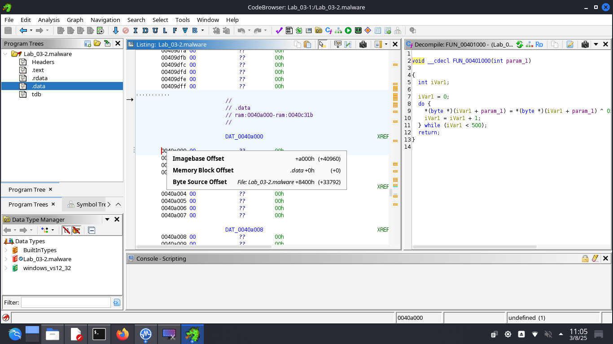

# github_RPISEC - Lab-3.2

## 1. Arquitectura de destino del malware

| Field                                 | Value                                                                                               |
|---------------------------------------|-----------------------------------------------------------------------------------------------------|
| file > sha256                         | D1BFC02DB9922F89DA0CEF14B514B63AF3703F1AB7BD88D558431151BFAC92E2                                     |
| file > first 32 bytes (hex)           | 4D 5A 90 00 03 00 00 00 04 00 00 00 FF FF 00 00 B8 00 00 00 00 00 00 00 40 00 00 00 00 00 00 00       |
| file > first 32 bytes (text)          | MZ............................................@..............                                        |
| file > info                           | size: 37376 bytes, entropy: 6.314                                                                    |
| file > type                           | executable, 32-bit, GUI                                                                              |
| file > version                        | n/a                                                                                                  |
| file > description                    | n/a                                                                                                  |
| entry-point > first 32 bytes (hex)    | 55 8B EC 6A FF 68 78 91 40 00 68 C4 5E 40 00 64 A1 00 00 00 00 50 64 89 25 00 00 00 00 83 EC 10       |
| entry-point > location                | 0x0000352F (section[.text])                                                                          |
| file > signature                      | Microsoft Linker 6.0 \| Visual Studio 6.0 MASM \| Microsoft Visual C++ \| Microsoft Visual C++ 6.0 - 8.0 |


**Arquitectura: executable, 32-bit, GUI.**

**Tipo de fichero:**
- Primeros 32 bytes del fichero:  4D 5A ....
- 4D = M
- 5A = Z
- "MZ" es la firma mágica de los archivos ejecutables en DOS/Windows (archivos .exe). Llamada así por Mark Zbikowski, ingeniero de Microsoft. Indica que el archivo es un ejecutable PE (Portable Executable) o que al menos comienza con una cabecera compatible con DOS.

___________________________________________________

## 2. Huellas dactilares del malware

### Footprints
| Component                       | SHA256                                                                 |
|--------------------------------|------------------------------------------------------------------------|
| file > sha256                  | D1BFC02DB9922F89DA0CEF14B514B63AF3703F1AB7BD88D558431151BFAC92E2       |
| dos-stub > sha256              | EF63BFA6967B9BC258DB866EDD37A00D4E6EAB5F638D5B986CBF07D3DD924C48       |
| dos-header > sha256            | 6285E684E5DA172EA1BE7BFFC4A5602C859FB14105B716657464418E15474E19       |
| rich-header > sha256           | 09354C1A6C70779E2B7AD4D63C0E407A9B23969D4E3018FFA8A48C740DB50364       |
| section > .text > sha256       | D53435E3FABF83A57E91ACB2628F0DF7FC1BA0A36A89A81E3883D5A67DB6AEBB       |
| section > .rdata > sha256      | CB7BA1884CC003DB6DE073091A64F88850BDA116AAB46D160C6CFEE1FC7606B3       |
| section > .data > sha256       | FA7ABEFA883B57C28A1BD58A663156E2B5B1C673E8FFC6F4B203D19D9336DBC5       |
| overlay > sha256               | 55B65C5979CF6BC7955396553DBA64F5E565F33C43A2BD49B87B09225A75D8CE       |


### Imphash
| Special         | Value                                 |
|----------------|---------------------------------------|
| imphash > md5  | F8474D31EC781CFACB7E8F62D7E1F468       |

**Imphash es una abreviatura de Import Hash.** Es un hash MD5 generado a partir de la lista de funciones importadas por un ejecutable PE (Portable Executable). Se usa comúnmente en análisis de malware para:
-  Detectar familias de malware similares.
- Encontrar binarios que comparten el mismo patrón de imports, incluso si han sido ofuscados o renombrados.

**¿Cómo se genera el Imphash?**  
- Se toma la lista de funciones importadas (como CreateFileA, VirtualAlloc, WinExec, etc.).
- Se ordenan alfabéticamente según la librería (DLL) y luego por función.
- Se concatena todo en una cadena de texto (KERNEL32.CreateFileAADVAPI32.RegOpenKeyA...).
- Se calcula el hash MD5 de esa cadena.


**🧪 ¿Qué significa F8474D31EC781CFACB7E8F62D7E1F468?**  
Es el resultado de aplicar el algoritmo MD5 a esa cadena de imports. Aunque el valor es hexadecimal y no interpretable directamente, se usa como firma o huella digital. Si otro ejecutable tiene el mismo imphash, probablemente:
- Usa el mismo conjunto de funciones importadas.
- Es de la misma familia de malware.
- Fue compilado con el mismo stub o plantilla.

___________________________________________________

## 3. Escanear el binario sospechoso con motores antivirus
https://www.virustotal.com/gui/file/d1bfc02db9922f89da0cef14b514b63af3703f1ab7bd88d558431151bfac92e2

___________________________________________________
## 4. Detección de empaquetado / protección
```
└─$ pepack Lab_03-2.malware -d db_packer.txt 
packer:                          Microsoft Visual C++
```

```
└─$ upx -d Lab_03-2.malware -o Lab_03-2-unpacked.malware
                       Ultimate Packer for eXecutables
                          Copyright (C) 1996 - 2024
UPX 4.2.4       Markus Oberhumer, Laszlo Molnar & John Reiser    May 9th 2024

        File size         Ratio      Format      Name
   --------------------   ------   -----------   -----------
upx: Lab_03-2.malware: NotPackedException: not packed by UPX

Unpacked 0 files.
```

Parece que el fichero no está empaquetado.

___________________________________________________
## 5. Identificación de ofuscación


___________________________________________________
## 6. Detección de técnicas anti-análisis


___________________________________________________
## 7. Extraer cadenas y metadatos
[Strings del fichero](Lab_03-2-ascii.txt)

**Algunas a destacar:**
```
LCMapStringW
sysinfo
configserver
SOFTWARE\Microsoft\Windows\CurrentVersion\Run
.PAD
fxftest
127.0.0.1
\java.exe
:\DOCUME~1\
%s%d
%4d-%02d-%02d %02d:%02d:%02d
upfileok
upfileer
cmd.exe
.?AVtype_info@@
configserver)/r(ndr29(xhhoxxx2)00xAAAAAAAAAAAAAAAAAAAAAAAAAAAAAAAAAAAAAAAAAAAAAAAAAAAA....
```

___________________________________________________
## 8. Tamaño y análisis de la estructura PE

### dos-header
Encabezado inicial del archivo PE, contiene campos fundamentales como el `e_lfanew` que apunta al verdadero encabezado PE. Su análisis es útil para detectar corrupción o manipulaciones del binario.

| Field                   | Value                                                                 |
|------------------------|-----------------------------------------------------------------------|
| dos-header > sha256    | 6285E684E5DA172EA1BE7BFFC4A5602C859FB14105B716657464418E15474E19       |
| size                   | 0x40 (64 bytes)                                                        |
| dos-header > location  | 0x00000000 - 0x00000040                                                |
| entropy                | 4.255                                                                  |
| file > ratio           | 0.00 %                                                                 |
| exe-header > offset    | 0x000000D8 (e_lfanew)                                                  |

_____________________________________________

### dos-stub
El DOS Stub es un fragmento de código heredado que se ejecuta si el archivo PE se intenta abrir en DOS. Aquí se muestra su hash, ubicación, mensaje embebido y entropía. También sirve para identificar herramientas de empaquetado o compilación.

| Field                        | Value                                                                 |
|-----------------------------|-----------------------------------------------------------------------|
| dos-stub > sha256           | EF63BFA6967B9BC258DB866EDD37A00D4E6EAB5F638D5B986CBF07D3DD924C48       |
| dos-stub > location         | 0x00000040 - 0x000000D8                                               |
| size                        | 0x98 (152 bytes)                                                      |
| entropy                     | 4.884                                                                 |
| file > ratio                | 0.41 %                                                                |
| first 32 bytes (hex)        | 0E 1F BA 0E 00 B4 09 CD 21 B8 01 4C CD 21 54 68 69 73 20 70 72 6F 67 72 61 6D 20 63 61 6E 6E 6F |
| first 32 bytes (ascii)      | ................!....L..!This program canno                           |
| message                     | !This program cannot be run in DOS mode.                              |

_______________________________________________

### rich header
| Tool        | Description                          |
|-------------|--------------------------------------|
| Masm613     | Visual Studio 6.0 MASM - 6.13 SP1    |
| Utc12_C     | Visual Studio 6.0 - 6.0              |
| Linker512   | Visual Studio 5.0 - 5.12             |
| Import      | Visual Studio -                      |
| Utc12_CPP   | Visual Studio 6.0 - 6.0              |

| Property                 | Value                                                                 |
|--------------------------|-----------------------------------------------------------------------|
| rich-header > location   | 0x00000080 - 0x000000D8                                               |
| size                     | 0x00000058 (88 bytes)                                                 |
| checksum-builtin         | 0x088BAA26                                                            |
| checksum-real            | 0x088BAA26                                                            |
| rich-header > sha256     | 09354C1A6C70779E2B7AD4D63C0E407A9B23969D4E3018FFA8A48C740DB50364       |


-----------------------------------------------

### File-header
| Field                                       | Value        | Description                          |
|--------------------------------------------|--------------|--------------------------------------|
| characteristics                            | 0x010F       |                                      |
| dynamic-link-library                       | 0x0000       | false                                |
| 32-bit words support                       | 0x0100       | true                                 |
| file-can-be-executed                       | 0x0002       | true                                 |
| system-image                               | 0x0000       | false                                |
| large-address-aware                        | 0x0000       | false                                |
| debug-stripped                             | 0x0000       | false                                |
| line-stripped-from-file                    | 0x0004       | true                                 |
| local-symbols-stripped-from-file           | 0x0008       | true                                 |
| relocation-stripped                        | 0x0001       | true                                 |
| uniprocessor                               | 0x0000       | false                                |
| bytes-of-machine-words-reversed-Low        | 0x0000       | false                                |
| bytes-of-machine-words-reversed-Hi         | 0x0000       | false                                |
| media-run-from-swap                        | 0x0000       | false                                |
| network-run-from-swap                      | 0x0000       | false                                |
|                                            |              |                                      |
| general                                     |              |                                      |
| stamp > compiler                           | 0x4BB1E566   | Tue Mar 30 11:49:58 2010 (UTC)      |
| size                                       | 0x14         | 20 bytes                             |
| file-header > location                     | 0x000000DC - 0x000000F0 | 0x000000DC - 0x000000F0       |
| signature                                  | 0x00004550   | PE00                                 |
| machine                                    | 0x014C       | Intel-386                            |
| sections > count                           | 0x0003       | 3                                    |
| pointer-symbol-table                       | 0x00000000   | 0x00000000                           |
| number-of-symbols                          | 0x00000000   | 0x00000000                           |


----------------------------------------------------

### optional-header
| Field                                           | Value        | Description                      |
|------------------------------------------------|--------------|----------------------------------|
| general                                        |              |                                  |
| subsystem                                      | 0x0002       | GUI                              |
| magic                                          | 0x010B       | PE                               |
| file-checksum                                  | 0x00000000   | 0x00012E63 (expected)            |
| entry-point > location                         | 0x0000352F   | section[.text]                   |
| base-of-code > location                        | 0x00001000   | section[.text]                   |
| base-of-data                                   | 0x00009000   | section[.rdata]                  |
| size-of-code                                   | 0x00007200   | 29184 bytes                      |
| size-of-initialized-data                       | 0x00003200   | 12800 bytes                      |
| size-of-uninitialized-data                     | 0x00000000   | 0 bytes                          |
| size-of-image                                  | 0x0000D000   | 53248 bytes                      |
| size-of-headers                                | 0x00000400   | 1024 bytes                       |
| size-of-stack-reserve                          | 0x00100000   | 1048576 bytes                    |
| size-of-stack-commit                           | 0x00001000   | 4096 bytes                       |
| size-of-heap-reserve                           | 0x00100000   | 1048576 bytes                    |
| size-of-heap-commit                            | 0x00001000   | 4096 bytes                       |
| section-alignment                              | 0x00001000   | 4096 bytes                       |
| file-alignment                                 | 0x00000200   | 512 bytes                        |
| directories > count                            | 0x00000010   | 16                               |
| LoaderFlags                                    | 0x00000000   | 0x00000000                       |
| Win32VersionValue                              | 0x00000000   | 0x00000000                       |
| image-base                                     | 0x00400000   | 0x00400000                       |
| linker > version                               | 6.0          | Microsoft Linker 6.0             |
| os > version                                   | 4.0          | Windows NT 4.0                   |
| image > version                                | 0.0          | 0.0                              |
| subsystem                                      | 4.0          | 4.0                              |
|                                                |              |                                  |
| characteristics                                | 0x0000       | items                            |
| Address-Space-Layout-Randomization (ASLR)      | 0x0000       | false                            |
| Control-flow Enforcement Technology (CETCOMPACT)| 0x0000      | false                            |
| Data Execution Prevention (DEP)                | 0x0000       | false                            |
| Code-Integrity (CI)                            | 0x0000       | false                            |
| Structured-Exception Handling (SEH)            | 0x0000       | true                             |
| Windows-Driver Model (WDM)                     | 0x0000       | false                            |
| Terminal-Server aware (TSA)                    | 0x0000       | false                            |
| Control-Flow Guard (CFG)                       | 0x0000       | false                            |
| image-bound                                    | 0x0000       | false                            |
| Image isolation                                | 0x0000       | false                            |
| High-Entropy                                   | 0x0000       | false                            |
| AppContainer                                   | 0x0000       | false                            |

_________________________________


### sections

| Property | Value | Value | Value |
| -- | -- | -- | -- |
| section | section[0] | section[1] | section[2] |
| name | .text | .rdata | .data |
| section > sha256 | D53435E3FABF83... | CB7BA1884CC003DB6DE07309... | FA7ABEFA883B57C28A1BD.... |
| entropy | 6.604 | 5.221 | 2.201 |
| file > ratio (95.89%) | 78.08 % | 9.59 % | 8.22 % |
| raw-address (begin) | 0x00000400 | 0x00007600 | 0x00008400 |
| raw-address (end) | 0x00007600 | 0x00008400 | 0x00009000
| raw-size (35840 bytes) | 0x00007200 (29184 bytes) | 0x00000E00 (3584 bytes) | 0x00000C00 (3072 bytes) |
| virtual-address (begin) | 0x00001000 | 0x00009000 | 0x0000A000 |
| virtual-address (end) | 0x000081BA | 0x00009D76 | 0x0000C31C |
| virtual-size (41548 bytes) | 0x000071BA (29114 bytes) | 0x00000D76 (3446 bytes) | 0x0000231C (8988 bytes) |
|  |  |  |  |
| characteristics | 0x60000020 | 0x40000040 | 0xC0000040 |
| write | - | - | x |
| execute | x | - | - |
| share | - | - | - |
| self-modifying | - | - | - |
| virtual | - | - | - |
| |  |  |  | 
| items |  |  | 
| directory > import | - | 0x00009670 | - |
| directory > import-address | - | 0x00009000 | - |
| base-of-code | 0x00001000 | - | - |
| base-of-data | - | 0x00009000 | - |
| entry-point > location | 0x0000352F | - | - |


___________________________________________________
## 9. Funciones/APIs utilizadas


___________________________________________________
## 10. Desensamblado y descompilado

### Libraries

| DLL           | flag | type     | count | description                   |
|---------------|------|----------|-------|-------------------------------|
| KERNEL32.dll  | -    | Implicit | 70    | Windows NT BASE API Client    |
| ADVAPI32.dll  | -    | Implicit | 4     | Advanced Windows 32 Base API  |
| SHELL32.dll   | -    | Implicit | 1     | Windows Shell Library         |
| **WS2_32.dll**    | **x**    | **Implicit** | **13**    | **Windows Socket Library**        |


__________________________________

### Imports

- **first-thunk (IAT)**: dirección donde se resolverá la función en tiempo de ejecución.
- **first-thunk-original (INT)**: dirección donde está definida originalmente.

**Imports ordenados por IAT:**
| Imports                      | flag      | type     | ordinal | first-thunk (IAT) | first-thunk-original (INT) | library       |
|--------|------|------|---------|-----|-----|---------|
| GetDriveTypeA | - | implicit | - | 0x00009890 | 0x00009890 | KERNEL32.dll |
| GetLogicalDrives | - | implicit | - | 0x000098A0 | 0x000098A0 | KERNEL32.dll |
| FindClose | - | implicit | - | 0x000098B4 | 0x000098B4 | KERNEL32.dll |
| GetLastError | - | implicit | - | 0x000098C0 | 0x000098C0 | KERNEL32.dll |
| **FindNextFileA** | **x** | **implicit** | - | **0x000098D0** | **0x000098D0** | **KERNEL32.dll** |
| FileTimeToSystemTime | - | implicit | - | 0x000098E0 | 0x000098E0 | KERNEL32.dll |
| **FindFirstFileA** | **x** | **implicit** | - | **0x000098F8** | **0x000098F8** | **KERNEL32.dll** |
| **WinExec** | **x** | **implicit** | - | **0x0000990A** | **0x0000990A**| **KERNEL32.dll** |
| **DeleteFileA** | **x** | **implicit** | - | **0x00009914** | **0x00009914** | **KERNEL32.dll** |
| CloseHandle | - | implicit | - | 0x00009922 | 0x00009922 | KERNEL32.dll |
| **WriteFile** | **x** | **implicit** | - | **0x00009930** | **0x00009930** | **KERNEL32.dll** |
| CreateFileA | - | implicit | - | 0x0000993C | 0x0000993C | KERNEL32.dll |
| **UnmapViewOfFile** | **x** | **implicit** | - | **0x0000994A** | **0x0000994A** | **KERNEL32.dll** |
| GetSystemDirectoryA | - | implicit | - | 0x0000987A | 0x0000987A | KERNEL32.dll |
| **MapViewOfFile** | **x** | **implicit** | - | **0x0000996A** | **0x0000996A** | **KERNEL32.dll** |
| CreateFileMappingA | - | implicit | - | 0x0000997A | 0x0000997A | KERNEL32.dll |
| **Process32Next** | **x** | **implicit** | - | **0x00009990** | **0x00009990** | **KERNEL32.dll** |
| **Process32First** | **x** | **implicit** | - | **0x000099A0** | **0x000099A0** | **KERNEL32.dll** |
| **CreateToolhelp32Snapsho**t | **x** | **mplicit** | - | **0x000099B2** | **0x000099B2** | **KERNEL32.dll** |
| TerminateProcess | - | implicit | - | 0x000099CE | 0x000099CE | KERNEL32.dll |
| **OpenProcess** | **x** | **implicit** | - | **0x000099E2** | **0x000099E2** | **KERNEL32.dll** |
| ReadFile | - | implicit | - | 0x000099F0 | 0x000099F0 | KERNEL32.dll |
| PeekNamedPipe | - | implicit | - | 0x000099FC | 0x000099FC | KERNEL32.dll |
| **CreateProcessA** | **x** | **implicit** | - | **0x00009A0C** | **0x00009A0C** | **KERNEL32.dll** |
| **CreatePipe** | **x** | **implicit** | - | **0x00009A1E** | **0x00009A1E** | **KERNEL32.dll**|
| LCMapStringA | - | implicit | - | 0x00009D56 | 0x00009D56 | KERNEL32.dll |
| **CopyFileA** | **x** | **implicit** | - | **0x0000986E** | **0x0000986E** | **KERNEL32.dll** |
| Sleep | - | implicit | - | 0x00009866 | 0x00009866 | KERNEL32.dll |
| lstrlenA | - | implicit | - | 0x0000985A | 0x0000985A | KERNEL32.dll |
| GetFileSize | - | implicit | - | 0x0000995C | 0x0000995C | KERNEL32.dll |
| GetModuleFileNameA | - | implicit | - | 0x00009844 | 0x00009844 | KERNEL32.dll |
| SetEndOfFile | - | implicit | - | 0x00009D46 | 0x00009D46 | KERNEL32.dll |
| LoadLibraryA | - | implicit | - | 0x00009D36 | 0x00009D36 | KERNEL32.dll |
| GetProcAddress | - | implicit | - | 0x00009D24 | 0x00009D24 | KERNEL32.dll |
| GetOEMCP | - | implicit | - | 0x00009D18 | 0x00009D18 | KERNEL32.dll |
| GetACP | - | implicit | - | 0x00009D0E | 0x00009D0E | KERNEL32.dll |
| GetCPInfo | - | implicit | - | 0x00009D02 | 0x00009D02 | KERNEL32.dll |
| IsBadCodePtr | - | implicit | - | 0x00009CF2 | 0x00009CF2 | KERNEL32.dll |
| IsBadReadPtr | - | implicit | - | 0x00009CE2 | 0x00009CE2 | KERNEL32.dll |
| SetUnhandledExceptionFilter | - | implicit | - | 0x00009CC4 | 0x00009CC4 | KERNEL32.dll |
| LCMapStringW | - | implicit | - | 0x00009D66 | 0x00009D66 | KERNEL32.dll |
| FlushFileBuffers | - | implicit | - | 0x00009CB0 | 0x00009CB0 | KERNEL32.dll |
| SetStdHandle | - | implicit | - | 0x00009CA0 | 0x00009CA0 | KERNEL32.dll |
| IsBadWritePtr | - | implicit | - | 0x00009C90 | 0x00009C90 | KERNEL32.dll |
| HeapReAlloc | - | implicit | - | 0x00009C82 | 0x00009C82 | KERNEL32.dll |
| **VirtualAlloc** | **x** | **implicit** | - | **0x00009C72** | **0x00009C72** | **KERNEL32.dll** |
| GetStringTypeW | - | implicit | - | 0x00009C60 | 0x00009C60 | KERNEL32.dll |
| RtlUnwind | - | implicit | - | 0x00009ABC | 0x00009ABC | KERNEL32.dll |
| GetCommandLineA | - | implicit | - | 0x00009AC8 | 0x00009AC8 | KERNEL32.dll |
| GetVersion | - | implicit | - | 0x00009ADA | 0x00009ADA | KERNEL32.dll |
| ExitProcess | - | implicit | - | 0x00009AE8 | 0x00009AE8 | KERNEL32.dll |
| HeapFree | - | implicit | - | 0x00009AF6 | 0x00009AF6 | KERNEL32.dll |
| **GetCurrentProcess** | **x** | **implicit** | - | **0x00009B02** | **0x00009B02** | **KERNEL32.dll** |
| SetFilePointer | - | implicit | - | 0x00009B16 | 0x00009B16 | KERNEL32.dll |
| HeapAlloc | - | implicit | - | 0x00009B28 | 0x00009B28 | KERNEL32.dll |
| UnhandledExceptionFilter | - | implicit | - | 0x00009B34 | 0x00009B34 | KERNEL32.dll |
| FreeEnvironmentStringsA | - | implicit | - | 0x00009B50 | 0x00009B50 | KERNEL32.dll |
| FreeEnvironmentStringsW | - | implicit | - | 0x00009B6A | 0x00009B6A | KERNEL32.dll |
| WideCharToMultiByte | - | implicit | - | 0x00009B84 | 0x00009B84 | KERNEL32.dll |
| **GetEnvironmentStrings** | **x** | **implicit** | - | **0x00009B9A** | **0x00009B9A** | **KERNEL32.dll** |
| **GetEnvironmentStringsW** | **x** | **implicit** | - | **0x00009BB2** | **0x00009BB2** | **KERNEL32.dll** |
| SetHandleCount | - | implicit | - | 0x00009BCC | 0x00009BCC | KERNEL32.dll |
| GetStdHandle | - | implicit | - | 0x00009BDE | 0x00009BDE | KERNEL32.dll |
| GetFileType | - | implicit | - | 0x00009BEE | 0x00009BEE | KERNEL32.dll |
| GetStartupInfoA | - | implicit | - | 0x00009BFC | 0x00009BFC | KERNEL32.dll |
| HeapDestroy | - | implicit | - | 0x00009C0E | 0x00009C0E | KERNEL32.dll |
| HeapCreate | - | implicit | - | 0x00009C1C | 0x00009C1C | KERNEL32.dll |
| VirtualFree | - | implicit | - | 0x00009C2A | 0x00009C2A | KERNEL32.dll |
| MultiByteToWideChar | - | implicit | - | 0x00009C38 | 0x00009C38 | KERNEL32.dll |
| GetStringTypeA | - | implicit | - | 0x00009C4E | 0x00009C4E | KERNEL32.dll |
| RegOpenKeyA | - | implicit | - | 0x00009A66 | 0x00009A66 | ADVAPI32.dll |
| **RegSetValueExA** | **x** | **implicit** | - | **0x00009A54** | **0x00009A54** | **ADVAPI32.dll** |
| RegCloseKey | - | implicit | - | 0x00009A46 | 0x00009A46 | ADVAPI32.dll |
| GetUserNameA | - | implicit | - | 0x00009A74 | 0x00009A74 | ADVAPI32.dll |
| **SHGetFileInfoA** | **x** | **implicit** | - | **0x00009A92** | **0x00009A92** | **SHELL32.dll** |
| **4 (connect)** | **x** | **implicit** | **x** | **0x80000004** | **0x80000004** | **WS2_32.dll** |
| **3 (closesocket)** | **x** | **implicit** | **x** | **0x80000003** | **0x80000003** | **WS2_32.dll** |
| **16 (recv)** | **x** | **implicit** | **x** | **0x80000010** | **0x80000010** | **WS2_32.dll** |
| **116 (WSACleanup)** | - | **implicit** | **x** | **0x80000074** | **0x80000074** | **WS2_32.dll** |
| **11 (inet_addr)** | **x** | **implicit** | **x** | **0x8000000B** | **0x8000000B** | **WS2_32.dll** |
| **111 (WSAGetLastError)** | **x** | **implicit** | **x** | **0x8000006F** | **0x8000006F** | **WS2_32.dll** |
| **12 (inet_ntoa)** | **x** | **implicit** | **x** | **0x8000000C** | **0x8000000C** | **WS2_32.dll** |
| **57 (gethostvalue)** | **x** | **implicit** | **x** | **0x80000039** | **0x80000039** | **WS2_32.dll** |
| **115 (WSAStartup)** | - | **implicit** | **x** | **0x80000073** | **0x80000073** | **WS2_32.dll** |
| **9 (htons)** | **x** | **implicit** | **x** | **0x80000009** | **0x80000009** | **WS2_32.dll** |
| **23 (socket)** | **x** | **implicit** | **x** | **0x80000017** | **0x80000017** | **WS2_32.dll** |
| **52 (gethostbyvalue)** | **x** | **implicit** | **x** | **0x80000034** | **0x80000034** | **WS2_32.dll** |
| **19 (send)** | **x** | **implicit** | **x** | **0x80000013** | **0x80000013** | **WS2_32.dll** |


**Imports ordenados por Flags:**
| Imports                      | flag      | type     | ordinal | first-thunk (IAT) | first-thunk-original (INT) | library       |
|-----------------------------|-----------|----------|---------|-------------------|-----------------------------|---------------|
| WriteFile                   | x         | implicit | -       | 0x00009930        | 0x00009930                  | KERNEL32.dll  |
| WinExec                     | x         | implicit | -       | 0x0000990A        | 0x0000990A                  | KERNEL32.dll  |
| VirtualAlloc                | x         | implicit | -       | 0x00009C72        | 0x00009C72                  | KERNEL32.dll  |
| UnmapViewOfFile             | x         | implicit | -       | 0x0000994A        | 0x0000994A                  | KERNEL32.dll  |
| SHGetFileInfoA              | x         | implicit | -       | 0x00009A92        | 0x00009A92                  | SHELL32.dll   |
| RegSetValueExA              | x         | implicit | -       | 0x00009A54        | 0x00009A54                  | ADVAPI32.dll  |
| Process32Nex                | x         | implicit | -       | 0x00009990        | 0x00009990                  | KERNEL32.dll  |
| Process32First              | x         | implicit | -       | 0x000099A0        | 0x000099A0                  | KERNEL32.dll  |
| OpenProcess                 | x         | implicit | -       | 0x000099E2        | 0x000099E2                  | KERNEL32.dll  |
| MapViewOfFile               | x         | implicit | -       | 0x0000996A        | 0x0000996A                  | KERNEL32.dll  |
| GetEnvironmentStringsW      | x         | implicit | -       | 0x00009BB2        | 0x00009BB2                  | KERNEL32.dll  |
| GetEnvironmentStrings       | x         | implicit | -       | 0x00009B9A        | 0x00009B9A                  | KERNEL32.dll  |
| GetCurrentProcess           | x         | implicit | -       | 0x00009B02        | 0x00009B02                  | KERNEL32.dll  |
| FindNextFileA               | x         | implicit | -       | 0x000098D0        | 0x000098D0                  | KERNEL32.dll  |
| FindFirstFileA              | x         | implicit | -       | 0x000098F8        | 0x000098F8                  | KERNEL32.dll  |
| DeleteFileA                 | x         | implicit | -       | 0x00009914        | 0x00009914                  | KERNEL32.dll  |
| CreateToolhelp32Snapshot    | x         | implicit | -       | 0x000099B2        | 0x000099B2                  | KERNEL32.dll  |
| CreateProcessA              | x         | implicit | -       | 0x00009A0C        | 0x00009A0C                  | KERNEL32.dll  |
| CreatePipe                  | x         | implicit | -       | 0x00009A1E        | 0x00009A1E                  | KERNEL32.dll  |
| CopyFileA                   | x         | implicit | -       | 0x0000986E        | 0x0000986E                  | KERNEL32.dll  |
| 9 (htons)                   | x         | implicit | x       | 0x80000009        | 0x80000009                  | WS2_32.dll    |
| 57 (gethostvalue)           | x         | implicit | x       | 0x80000039        | 0x80000039                  | WS2_32.dll    |
| 52 (gethostbyvalue)         | x         | implicit | x       | 0x80000034        | 0x80000034                  | WS2_32.dll    |
| 4 (connect)                 | x         | implicit | x       | 0x80000004        | 0x80000004                  | WS2_32.dll    |
| 3 (closesocket)             | x         | implicit | x       | 0x80000003        | 0x80000003                  | WS2_32.dll    |
| 23 (socket)                 | x         | implicit | x       | 0x80000017        | 0x80000017                  | WS2_32.dll    |
| 19 (send)                   | x         | implicit | x       | 0x80000013        | 0x80000013                  | WS2_32.dll    |
| 16 (recv)                   | x         | implicit | x       | 0x80000010        | 0x80000010                  | WS2_32.dll    |
| 12 (inet_ntoa)              | x         | implicit | x       | 0x8000000C        | 0x8000000C                  | WS2_32.dll    |
| 111 (WSAGetLastError)       | x         | implicit | x       | 0x8000006F        | 0x8000006F                  | WS2_32.dll    |
| 11 (inet_addr)              | x         | implicit | x       | 0x8000000B        | 0x8000000B                  | WS2_32.dll    |
| 116 (WSACleanup)            | -         | implicit | x       | 0x80000074        | 0x80000074                  | WS2_32.dll    |
| 115 (WSAStartup)            | -         | implicit | x       | 0x80000073        | 0x80000073                  | WS2_32.dll    |

---------------------
### Overlay

Un overlay es cualquier dato que se encuentra al final del archivo PE, después de la última sección definida en su encabezado. No forma parte de la estructura oficial del archivo ejecutable, y por tanto, el sistema operativo no lo carga ni lo interpreta directamente cuando ejecuta el programa.

El overlay puede tener usos legítimos o maliciosos:
- Usos legítimos:
  - nformación adicional del instalador (como en archivos creados por InstallShield).
  - Firmas digitales (aunque estas suelen estar en una estructura reconocida por Windows).
  - Datos de configuración embebidos por el desarrollador.
- Usos maliciosos:
  - Configuración de malware: rutas C2 (Command and Control), claves, listas de objetivos.
  - Payloads secundarios: código que el malware extrae en tiempo de ejecución.
  - Evitar detección: el overlay se puede usar para almacenar contenido que los antivirus tradicionales no escanean tan a fondo.

¿Por qué es importante en análisis de malware? Porque el overlay no está vinculado a ninguna sección del PE y, por tanto, es menos controlado por herramientas convencionales de seguridad. Analizar el overlay puede revelar datos clave como:
- Configuración del bot.
- IPs o dominios de control.
- Datos robados empaquetados.
- Shellcodes o scripts ofuscados.

| Property                    | Value                                                                 |
|--------------------------|-----------------------------------------------------------------------|
| overlay > sha256         | 55B65C5979CF6BC7955396553DBA64F5E565F33C43A2BD49B87B09225A75D8CE      |
| entropy                  | 0.621                                                                 |
| overlay > location       | 0x00009000 - 0x00009200                                               |
| size                     | 0x0200 (512 bytes)                                                    |
| signature                | unknown                                                               |
| first 32 bytes (hex)     | 63 6F 6E 66 69 67 73 65 72 76 65 72 29 2F 72 28 6E 64 72 32 39 28 78... |
| first 32 bytes (text)    | configserver)/r(ndr29(xhhoxxx2)0                                      |
| file > ratio             | 1.37 %                                                                |

**overlay > sha256:** Es la huella digital SHA-256 del overlay del archivo, útil para comprobar su integridad o detectar variantes conocidas.

**entropy:** La entropía mide el grado de aleatoriedad o compresión del contenido. Un valor de 0.621 indica que no está cifrado ni comprimido, pero tiene cierta estructura.

**overlay > location:** Rango de direcciones donde se encuentra el overlay en el archivo PE, fuera del área oficial de las secciones PE.

**size:** Tamaño del overlay en hexadecimal y en bytes reales (512 bytes). Coincide con la unidad mínima de alineamiento de disco.

**signature:** No se ha reconocido ninguna firma (por ejemplo, no es una firma digital estándar ni una estructura PE).

**first 32 bytes (hex) y (text):** Muestra el inicio del contenido del overlay. El texto sugiere nombres de configuración o rutas de servidor, como "configserver)/r(ndr29(xhhoxxx2)0", lo cual puede estar relacionado con comandos de configuración o C2 (Command and Control).

**file > ratio:** El overlay representa el 1.37 % del tamaño total del archivo. Aunque es una porción pequeña, puede contener configuraciones o datos maliciosos.


1. Identificar el final del contenido legítimo:

![capturas/memory-map.png]

En la imagen de Memory Map de Ghidra, la última sección real es:

.data     Start: 0x0040A000   End: 0x0040C31B

Por tanto, el final real del contenido válido del binario está en:

0x0040C31B + 1 = 0x0040C31C

⚠️ Importante: Este es el final de la última sección en memoria virtual, pero necesitamos saber el offset físico (en el archivo) del final de la última sección.


2. Ver el offset físico en disco  
Localiza la última sección con datos reales del binario (en tu caso: .data).

Apunta:
- Start Address: 0040a000
- Length: 0x231c
- Esto indica que ocupa 0x231c bytes en memoria.


Pulsa G o ve a Navigation > Go To.

Introduce: 0x0040a000 (inicio de .data).



Inicio de .data: 0040a000

Byte Source Offset (archivo): 0x8400

En el mapa de memoria, .data termina en: 0040c31b

→ Tiene una longitud de: 0x231c


Calcula el final de los datos reales en el archivo:
```
0x8400 (offset de inicio) + 0x231c (longitud de .data) = 0xa71c
```

```
└─$ hexdump -C Lab_03-2.malware | tail
00008e50  00 00 00 00 00 00 00 00  81 d3 d8 de e0 f9 00 00  |................|
00008e60  31 7e 81 fe 00 00 00 00  00 00 00 00 00 00 00 00  |1~..............|
00008e70  00 00 00 00 00 00 00 00  00 00 00 00 00 00 00 00  |................|
*
00009000  63 6f 6e 66 69 67 73 65  72 76 65 72 29 2f 72 28  |configserver)/r(|
00009010  6e 64 72 32 39 28 78 68  68 6f 78 78 78 32 29 30  |ndr29(xhhoxxx2)0|
00009020  30 78 41 41 41 41 41 41  41 41 41 41 41 41 41 41  |0xAAAAAAAAAAAAAA|
00009030  41 41 41 41 41 41 41 41  41 41 41 41 41 41 41 41  |AAAAAAAAAAAAAAAA|
*
00009200
```

Para extraer el overlay:
```
from pefile import PE

pe = PE("Lab_03-2.malware")

# Obtener fin de la última sección en el archivo
last_section = pe.sections[-1]
raw_offset = last_section.PointerToRawData
raw_size = last_section.SizeOfRawData
end_of_sections = raw_offset + raw_size

# Obtener tamaño total del archivo
import os
file_size = os.path.getsize("Lab_03-2.malware")

if file_size > end_of_sections:
    overlay_offset = end_of_sections
    overlay_size = file_size - overlay_offset
    with open("Lab_03-2.malware", "rb") as f:
        f.seek(overlay_offset)
        overlay = f.read()
    with open("overlay.bin", "wb") as out:
        out.write(overlay)
    print(f"✅ Extraído overlay de {overlay_size} bytes en 'overlay.bin'")
else:
    print("❌ No se detectó overlay.")

```

ste script usa la librería pefile:
```
pip install pefile
```

Este overlay probablemente contiene configuración embebida o cifrada para el malware, posiblemente incluyendo:
- Nombre del servidor C2
- Comandos codificados
- Placeholders para inyección
- Datos para una fase 2 (payload)


Analiza-overlay.py:
```
└─$ python3 analiza-overlay.py 
[+] Tamaño del overlay: 513 bytes
[+] Entropía: 0.6398 (BAJA - puede haber texto plano)
[+] Cadenas legibles encontradas: 1
    - configserver)/r(ndr29(xhhoxxx2)00xAAAAAAAAAAAAAAAAAAAAAAAAAAAAAAAAAAAAAAAAAAAAAAAAAAAAAAAAAAAAAAAAAAAAAAAAAAAAAAAAAAAAAAAAAAAAAAAAAAAAAAAAAAAAAAAAAAAAAAAAAAAAAAAAAAAAAAAAAAAAAAAAAAAAAAAAAAAAAAAAAAAAAAAAAAAAAAAAAAAAAAAAAAAAAAAAAAAAAAAAAAAAAAAAAAAAAAAAAAAAAAAAAAAAAAAAAAAAAAAAAAAAAAAAAAAAAAAAAAAAAAAAAAAAAAAAAAAAAAAAAAAAAAAAAAAAAAAAAAAAAAAAAAAAAAAAAAAAAAAAAAAAAAAAAAAAAAAAAAAAAAAAAAAAAAAAAAAAAAAAAAAAAAAAAAAAAAAAAAAAAAAAAAAAAAAAAAAAAAAAAAAAAAAAAAAAAAAAAAAAAAAAAAAAAAAAAAAAAAAAAAAAAAAAAAAAAAAAAAAAAAAAAAAAAAAAAAAAAA
        
```

Entropía: 0.63 (BAJA) --> Esto indica que no está comprimido ni cifrado, sino que contiene probablemente texto plano o datos codificados simples (como lo que ves: configserver...).

configserver) → podría ser un delimitador de inicio de datos o marcador de configuración.

ndr29(xhhoxxx2) → parece un ID de campaña o grupo.

00xAAAAAAAA... → relleno con 0xAA, usado muchas veces para marcar zonas vacías o sin inicializar (padding), o bien un buffer reservado que se llenará en tiempo de ejecución.
_____________________________


###  Buscamos qué funciones del malware llaman a estas APIs usando Ghidra
- Desplegamos Imports.
- Vemos las DLLs importadas: KERNEL32.dll, ADVAPI32.dll, WS2_32.dll, etc.
- Dentro de cada DLL, buscamos las funciones de interés. Por ejemplo: WriteFile, WinExec, connect, etc.
- Hacemos clic derecho sobre cada API → "Show References To".
- Esto mostrará todas las funciones del malware que llaman a esa API.


| API                      | Localización      | Función que llama a la API      | library       |
|-----------------------------|-----------|----------|---------|
| WriteFile                   | 004021bb         | FUN_004020f0 | KERNEL32.dll  |
| WriteFile                   | 004026ad         | FUN_00402660 | KERNEL32.dll  |
| WriteFile                   | 0040611f         | FUN_00405fd5 | KERNEL32.dll  |
| WriteFile                   | 00406e13         | FUN_00406d3b | KERNEL32.dll  |
| WriteFile                   | 00406e78         | FUN_00406d3b | KERNEL32.dll  |
| WriteFile                   | 0040903c         |  POINTER to EXTERNAL FUNCTION | KERNEL32.dll  |
| WinExec                     | 0040206a         | FUN_00402050 |KERNEL32.dll  |
| WinExec                     | 00409030         | POINTER to EXTERNAL FUNCTION |KERNEL32.dll  |
| VirtualAlloc                | 00406984         | FUN_0040690e |KERNEL32.dll  |
| VirtualAlloc                | 00406a10         | FUN_004069bf |KERNEL32.dll  |
| VirtualAlloc                | 004090c8         | POINTER to EXTERNAL FUNCTION |KERNEL32.dll  |
| UnmapViewOfFile             | 004022eb         | FUN_00402210 |KERNEL32.dll  |
| UnmapViewOfFile             | 00409044         | POINTER to EXTERNAL FUNCTION  |
| SHGetFileInfoA              | x         | implicit |SHELL32.dll   |
| RegSetValueExA              | x         | implicit |ADVAPI32.dll  |
| Process32Nex                | 004028d0         |  THUNK FUNCTION  |KERNEL32.dll  |
| Process32Nex                | 004028d0         |  THUNK FUNCTION  |KERNEL32.dll  |
| Process32Nex                | 00409054         | POINTER to EXTERNAL FUNCTION |KERNEL32.dll  |
| Process32First              | 004028d6         | THUNK FUNCTION  |KERNEL32.dll  |
| Process32First              | 004028d6         | THUNK FUNCTION  |KERNEL32.dll  |
| Process32First              | 00409058         | POINTER to EXTERNAL FUNCTION |KERNEL32.dll  |
| OpenProcess                 | 00402452         | FUN_00402440 |KERNEL32.dll  |
| MapViewOfFile               | 00402288         | FUN_00402210 |KERNEL32.dll  |
| GetEnvironmentStringsW      | 00405bbc         | FUN_00405ba1 |KERNEL32.dll  |
| GetEnvironmentStringsW      | 00405bbc         | FUN_00405ba1 |KERNEL32.dll  |
| GetEnvironmentStrings       | 00405bd0         | FUN_00405ba1 |KERNEL32.dll  |
| GetEnvironmentStrings       | 00405c82         | FUN_00405ba1 |KERNEL32.dll  |
| GetCurrentProcess           | 00403f84         | FUN_00403f74 |KERNEL32.dll  |
| FindNextFileA               | 00401d57         | FUN_00401a20 |KERNEL32.dll  |
| FindFirstFileA              | 00401a52         | FUN_00401a20 |KERNEL32.dll  |
| FindFirstFileA              | 0040902c         | POINTER to EXTERNAL FUNCTION |KERNEL32.dll  |
| DeleteFileA                 | 004020b8         | FUN_004020a0 |KERNEL32.dll  |
| CreateToolhelp32Snapshot    | 004020b8         | THUNK FUNCTION |KERNEL32.dll  |
| CreateToolhelp32Snapshot    | 004020b8         | THUNK FUNCTION |KERNEL32.dll  |
| CreateProcessA              | 00402539         | FUN_00402490 |KERNEL32.dll  |
| CreatePipe                  | 004024cb         | FUN_00402490 |KERNEL32.dll  |
| CreatePipe                  | 004024dd         | FUN_00402490 |KERNEL32.dll  |
| CopyFileA                   | 00401472         | FUN_004012f0 |KERNEL32.dll  |
| 9 (htons)                   | 004015de         | FUN_004012f0 |WS2_32.dll    |
| 57 (gethostvalue)           | 004011f2         | FUN_004011e0 |WS2_32.dll    |
| 52 (gethostbyvalue)         | 00401235         | FUN_00401230 |WS2_32.dll    |
| 52 (gethostbyvalue)         | 00401526         | FUN_004012f0 |WS2_32.dll    |
| 52 (gethostbyvalue)         | 0040153c         | FUN_004012f0 |WS2_32.dll    |
| 4 (connect)                 | 00401604         | FUN_004012f0 |WS2_32.dll    |
| 3 (closesocket)             | 00401615         | FUN_004012f0 |WS2_32.dll    |
| 3 (closesocket)             | 0040183a         | Catch@00401833 |WS2_32.dll    |
| 3 (closesocket)             | 00401852         | FUN_004012f0 |WS2_32.dll    |
| 23 (socket)                 | 004015a9         | FUN_004012f0 |WS2_32.dll    |
| 19 (send)                   |          | implicit |WS2_32.dll    |
| 16 (recv)                   | x         | implicit |WS2_32.dll    |
| 12 (inet_ntoa)              | 00401265         | FUN_00401230 |WS2_32.dll    |
| 12 (inet_ntoa)              | 0040154c         | FUN_004012f0 |WS2_32.dll    |
| 111 (WSAGetLastError)       | 0040123f         | FUN_00401230 |WS2_32.dll    |
| 11 (inet_addr)              | 004015eb         | FUN_004012f0 |WS2_32.dll    |
| 116 (WSACleanup)            | 0040186b         | FUN_004012f0 |WS2_32.dll    |
| 115 (WSAStartup)            | 00409158         | FUN_004012f0 |WS2_32.dll    |


```
send
0040166e - FUN_004012f0
004016b9 - FUN_004012f0
00401a05 - FUN_004018c0
00401a74 - FUN_00401a20
00401a9c - FUN_00401a20
00401d00 - FUN_00401a20
00401fac - FUN_00401a20
0040202f - FUN_00401a20
00402083 - FUN_00402050
00402094 - FUN_00402050
004020d0 - FUN_004020a0
004020e1 - FUN_004020a0
00402156 - FUN_004020f0
004021da - FUN_004020f0
004021fc - FUN_004020f0
004022ce - FUN_00402210
004022e0 - FUN_00402210
004023b8 - FUN_00402310
00402425 - FUN_00402310
00402473 - FUN_00402440
00402484 - FUN_00402440
004025d5 - FUN_00402490
00402607 - FUN_00402490
00402657 - FUN_00402620
004027a6 - FUN_00402660
00402869 - FUN_00402660
004028b5 - FUN_00402880
```

```
recv
00401684 - FUN_004012f0
004016eb - FUN_004012f0
00401d12 - FUN_00401a20
00401fc2 - FUN_00401a20
0040210e - FUN_004020f0
0040219d - FUN_004020f0
004023c8 - FUN_00402310
004027bd - FUN_00402660
004028a5 - FUN_00402880
```


Listado de las funciones que llaman a las APIS:

- [FUN_004012f0](../decompilado/FUN_004012F0.md)
- [FUN_004011e0](../decompilado/FUN_004011E0.md)
- [FUN_00401230](../decompilado/FUN_00401230.md)
- [FUN_004018c0](../decompilado/FUN_004018C0.md)
- [FUN_00401a20](../decompilado/FUN_00401A20.md)
- [FUN_00402050](../decompilado/FUN_00402050.md)
- [FUN_004020a0](../decomplidado/FUN_004020A0.md)
- [FUN_004020f0](../decompilado/FUN_004020F0.md)
- [FUN_00402210](../decompilado/FUN_00402210.md)
- [FUN_00402310](../decompilado/FUN_00402310.md)
- [FUN_00402440](../decompilado/FUN_00402440.md)
- [FUN_00402490](../decompilado/FUN_00402490.md)
- [FUN_00402620](../decompilado/FUN_00402620.md)
- [FUN_00402660](../decompilado/FUN_00402660.md)
- [FUN_00402880](../decompilado/FUN_00402880.md)
- [FUN_00403f74](../decompilado/FUN_00403F74.md)
- [FUN_00405ba1](../decompilado/FUN_00405BA1.md)
- [FUN_00405fd5](../decompilado/FUN_00405Fd5.md)
- [FUN_0040690e](../decompilado/FUN_0040690E.md)
- [FUN_004069bf](../decompilado/FUN_004069BF.md)
- [FUN_00406d3b](../decompilado/FUN_00406D3B.md)


- [FUN_004039F7](../decompilado/FUN_004039F7.md)
- [FUN_00404027](../decompilado/FUN_00404027.md)
- [persistencia - DAT_0040a0d8](../decompilado/persistencia.md)


### Lista de Breakpoints para x32dbg según los imports detectados con pestudio
```
log "Script Breakpoints"

// --- KERNEL32.dll ---
bp KERNEL32.WriteFile
bp KERNEL32.WinExec
bp KERNEL32.VirtualAlloc
bp KERNEL32.UnmapViewOfFile
bp KERNEL32.Process32Next
bp KERNEL32.Process32First
bp KERNEL32.OpenProcess
bp KERNEL32.MapViewOfFile
bp KERNEL32.GetEnvironmentStringsW
bp KERNEL32.GetEnvironmentStrings
bp KERNEL32.GetCurrentProcess
bp KERNEL32.FindNextFileA
bp KERNEL32.FindFirstFileA
bp KERNEL32.DeleteFileA
bp KERNEL32.CreateToolhelp32Snapshot
bp KERNEL32.CreateProcessA
bp KERNEL32.CreatePipe
bp KERNEL32.CopyFileA

// --- ADVAPI32.dll ---
bp RegSetValueExA
bp RegCloseKey
bp RegOpenKeyA

// --- SHELL32.dll ---
bp SHGetFileInfoA

// --- WS2_32.dll ---
bp htons
bp gethostbyname
bp gethostbyaddr
bp connect
bp closesocket
bp socket
bp send
bp recv
bp inet_ntoa
bp WSAGetLastError
bp inet_addr
bp WSACleanup
bp WSAStartup
run
```

- Abrimos x32dbg.
- Vamos a la pestaña Script.
- Boton derecho --- Load Script -- Paste.
- Pulsamos tecla "Espacio" para ejecutar el script.
- Verificamos en la pestaña Breakpoints que se añadieron los bp.


___________________________________________________
## 11. Análisis de recursos embebidos


___________________________________________________
## 14. Identificación de capacidades del malware & Introducción a MITRE ATT&CK

```
┌─────────────┬────────────────────────────────────────────────────────────────────────────────────┐
│ md5         │ bf4f5b4ff7ed9c7275496c07f9836028                                                   │
│ sha1        │ dd3fb2750da3e8fc889cd1611117b02d49cf17f7                                           │
│ sha256      │ d1bfc02db9922f89da0cef14b514b63af3703f1ab7bd88d558431151bfac92e2                   │
│ analysis    │ static                                                                             │
│ os          │ windows                                                                            │
│ format      │ pe                                                                                 │
│ arch        │ i386                                                                               │
│ path        │ C:/Users/usuario/Desktop/Lab_03-2.malware                                          │
└─────────────┴────────────────────────────────────────────────────────────────────────────────────┘
┌──────────────────────┬───────────────────────────────────────────────────────────────────────────────────┐
│ ATT&CK Tactic        │ ATT&CK Technique                                                                  │
├──────────────────────┼───────────────────────────────────────────────────────────────────────────────────┤
│ DEFENSE EVASION      │ Obfuscated Files or Information [T1027]                                           │
│ DISCOVERY            │ Account Discovery [T1087]                                                         │
│                      │ File and Directory Discovery [T1083]                                              │
│                      │ Process Discovery [T1057]                                                         │
│                      │ Software Discovery [T1518]                                                        │
│                      │ System Information Discovery [T1082]                                              │
│                      │ System Owner/User Discovery [T1033]                                               │
│ PERSISTENCE          │ Boot or Logon Autostart Execution::Registry Run Keys / Startup Folder [T1547.001] │
└──────────────────────┴───────────────────────────────────────────────────────────────────────────────────┘
┌───────────────────────────────────────────────────────────────┬──────────────────────────────────┐
│ MAEC Category                                                 │ MAEC Value                       │
├───────────────────────────────────────────────────────────────┼──────────────────────────────────┤
│ malware-category                                              │ downloader                       │
└───────────────────────────────────────────────────────────────┴──────────────────────────────────┘
┌───────────────────────┬──────────────────────────────────────────────────────────────────────────┐
│ MBC Objective         │ MBC Behavior                                                             │
├───────────────────────┼──────────────────────────────────────────────────────────────────────────┤
│ COMMAND AND CONTROL   │ C2 Communication::Receive Data [B0030.002]                               │
│                       │ C2 Communication::Send Data [B0030.001]                                  │
│ COMMUNICATION         │ DNS Communication::Resolve [C0011.001]                                   │
│                       │ Interprocess Communication::Create Pipe [C0003.001]                      │
│                       │ Interprocess Communication::Read Pipe [C0003.003]                        │
│                       │ Socket Communication::Connect Socket [C0001.004]                         │
│                       │ Socket Communication::Create TCP Socket [C0001.011]                      │
│                       │ Socket Communication::Create UDP Socket [C0001.010]                      │
│                       │ Socket Communication::Initialize Winsock Library [C0001.009]             │
│                       │ Socket Communication::Receive Data [C0001.006]                           │
│                       │ Socket Communication::Send Data [C0001.007]                              │
│                       │ Socket Communication::TCP Client [C0001.008]                             │
│                       │ Socket Communication::UDP Client [C0001.013]                             │
│ DATA                  │ Encode Data::XOR [C0026.002]                                             │
│ DEFENSE EVASION       │ Obfuscated Files or Information::Encoding-Standard Algorithm [E1027.m02] │
│ DISCOVERY             │ File and Directory Discovery [E1083]                                     │
│                       │ System Information Discovery [E1082]                                     │
│ FILE SYSTEM           │ Copy File [C0045]                                                        │
│                       │ Delete File [C0047]                                                      │
│                       │ Read File [C0051]                                                        │
│                       │ Writes File [C0052]                                                      │
│ OPERATING SYSTEM      │ Registry::Set Registry Key [C0036.001]                                   │
│ PERSISTENCE           │ Registry Run Keys / Startup Folder [F0012]                               │
│ PROCESS               │ Create Process [C0017]                                                   │
│                       │ Terminate Process [C0018]                                                │
└───────────────────────┴──────────────────────────────────────────────────────────────────────────┘
┌──────────────────────────────────────────────────────────┬─────────────────────────────────────────┐
│ Capability                                               │ Namespace                               │
├──────────────────────────────────────────────────────────┼─────────────────────────────────────────┤
│ read and send data from client to server (3 matches)     │ communication/c2/file-transfer          │
│ receive and write data from server to client (2 matches) │ communication/c2/file-transfer          │
│ resolve DNS (2 matches)                                  │ communication/dns                       │
│ create pipe                                              │ communication/named-pipe/create         │
│ create two anonymous pipes                               │ communication/named-pipe/create         │
│ read pipe (2 matches)                                    │ communication/named-pipe/read           │
│ initialize Winsock library                               │ communication/socket                    │
│ connect UDP socket                                       │ communication/socket/udp                │
│ act as TCP client                                        │ communication/tcp/client                │
│ encode data using XOR (18 matches)                       │ data-manipulation/encoding/xor          │
│ get common file path                                     │ host-interaction/file-system            │
│ get file system object information (2 matches)           │ host-interaction/file-system            │
│ copy file                                                │ host-interaction/file-system/copy       │
│ delete file                                              │ host-interaction/file-system/delete     │
│ enumerate files on Windows                               │ host-interaction/file-system/files/list │
│ read file on Windows (2 matches)                         │ host-interaction/file-system/read       │
│ read file via mapping                                    │ host-interaction/file-system/read       │
│ write file on Windows (3 matches)                        │ host-interaction/file-system/write      │
│ get disk information                                     │ host-interaction/hardware/storage       │
│ get hostname                                             │ host-interaction/os/hostname            │
│ create process on Windows (2 matches)                    │ host-interaction/process/create         │
│ enumerate processes                                      │ host-interaction/process/list           │
│ terminate process                                        │ host-interaction/process/terminate      │
│ get session user name                                    │ host-interaction/session                │
│ persist via Run registry key (2 matches)                 │ persistence/registry/run                │
└──────────────────────────────────────────────────────────┴─────────────────────────────────────────┘


```

_____________________________________________________________
XXXXXXXXXXXXXXXXXXXXXXXXXXXXXXXXXXXXXXXXXXXXXXXXXXXXXXXX
_____________________________________________________________

### Análisis Empaquetado
```
└─$ pepack Lab_03-2.malware -d db_packer.txt 
packer:                          Microsoft Visual C++
```

```
└─$ upx -d Lab_03-2.malware -o Lab_03-2-unpacked.malware
                       Ultimate Packer for eXecutables
                          Copyright (C) 1996 - 2024
UPX 4.2.4       Markus Oberhumer, Laszlo Molnar & John Reiser    May 9th 2024

        File size         Ratio      Format      Name
   --------------------   ------   -----------   -----------
upx: Lab_03-2.malware: NotPackedException: not packed by UPX

Unpacked 0 files.
```

### Virustotal
https://www.virustotal.com/gui/file/d1bfc02db9922f89da0cef14b514b63af3703f1ab7bd88d558431151bfac92e2


### Info

| Field                                 | Value                                                                                               |
|---------------------------------------|-----------------------------------------------------------------------------------------------------|
| file > sha256                         | D1BFC02DB9922F89DA0CEF14B514B63AF3703F1AB7BD88D558431151BFAC92E2                                     |
| file > first 32 bytes (hex)           | 4D 5A 90 00 03 00 00 00 04 00 00 00 FF FF 00 00 B8 00 00 00 00 00 00 00 40 00 00 00 00 00 00 00       |
| file > first 32 bytes (text)          | MZ............................................@..............                                        |
| file > info                           | size: 37376 bytes, entropy: 6.314                                                                    |
| file > type                           | executable, 32-bit, GUI                                                                              |
| file > version                        | n/a                                                                                                  |
| file > description                    | n/a                                                                                                  |
| entry-point > first 32 bytes (hex)    | 55 8B EC 6A FF 68 78 91 40 00 68 C4 5E 40 00 64 A1 00 00 00 00 50 64 89 25 00 00 00 00 83 EC 10       |
| entry-point > location                | 0x0000352F (section[.text])                                                                          |
| file > signature                      | Microsoft Linker 6.0 \| Visual Studio 6.0 MASM \| Microsoft Visual C++ \| Microsoft Visual C++ 6.0 - 8.0 |

### 🕓 Timestamps

| Stamp Type        | Value                                |
|-------------------|--------------------------------------|
| stamp > compiler  | Tue Mar 30 11:49:58 2010 (UTC)       |
| stamp > debug     | n/a                                  |
| stamp > resource  | n/a                                  |
| stamp > import    | n/a                                  |
| stamp > export    | n/a                                  |

### 🏷️ Names

| Name Field                  | Value                                           |
|----------------------------|-------------------------------------------------|
| file > name                | c:\users\usuario\desktop\lab_03-2.malware       |
| debug > file               | n/a                                             |
| export                     | n/a                                             |
| version                    | n/a                                             |
| manifest                   | n/a                                             |
| .NET > module > name       | n/a                                             |
| certificate > program-name | n/a                                             |


-----------------------------------------------------------

### Indicators:
| Field                            | Value                                                                                                 |
|----------------------------------|-------------------------------------------------------------------------------------------------------|
| certificate                      | n/a                                                                                                   |
| entry-point > location           | 0x0000352F (section: .text)                                                                           |
| exports                          | n/a                                                                                                   |
| file > info                      | size: 37376 bytes, entropy: 6.314                                                                     |
| file > name                      | c:\users\usuario\desktop\lab_03-2.malware                                                             |
| file > sha256                    | D1BFC02DB9922F89DA0CEF14B514B63AF3703F1AB7BD88D558431151BFAC92E2                                     |
| file > signature                 | Microsoft Linker 6.0 \| Microsoft Visual C++ \| Microsoft Visual C++ 6.0 - 8.0 \| Visual Studio 6.0 MASM |
| file > type                      | executable, 32-bit, GUI                                                                               |
| imphash > md5                    | F8474D31EC781CFACB7E8F62D7E1F468                                                                      |
| imports > flag                   | CopyFileA \| CreatePipe \| CreateProcessA \| CreateToolhelp32Snapshot \| DeleteFileA \| FindFirstFileA \| ... |
| imports > ordinal > count        | 13                                                                                                    |
| libraries > flag                 | WS2_32.dll (Windows Socket Library)                                                                   |
| overlay > entropy                | 0.621                                                                                                 |
| overlay > first 512 bytes (hex) | 63 6F 6E 66 69 67 73 65 72 76 65 72 29 2F 72 28 6E 64 72 32 39 28 78 68 68 6F 78 78 78 32 29 30         |
| overlay > first 512 bytes (text)| configserver)/r(ndr29(xhhoxxx2)0                                                                      |
| overlay > info                   | signature: unknown, offset: 0x00009000, size: 512 bytes, entropy: 0.621                              |
| resource                         | n/a                                                                                                   |
| stamp > compiler                 | Tue Mar 30 11:49:58 2010                                                                              |
| string > url-pattern             | 127.0.0.1                                                                                             |
| virustotal > score               | No se pudo resolver el nombre de servidor o su dirección                                              |


--------------------------------------------------------------------------

### Footprints
| Component                       | SHA256                                                                 |
|--------------------------------|------------------------------------------------------------------------|
| file > sha256                  | D1BFC02DB9922F89DA0CEF14B514B63AF3703F1AB7BD88D558431151BFAC92E2       |
| dos-stub > sha256              | EF63BFA6967B9BC258DB866EDD37A00D4E6EAB5F638D5B986CBF07D3DD924C48       |
| dos-header > sha256            | 6285E684E5DA172EA1BE7BFFC4A5602C859FB14105B716657464418E15474E19       |
| rich-header > sha256           | 09354C1A6C70779E2B7AD4D63C0E407A9B23969D4E3018FFA8A48C740DB50364       |
| section > .text > sha256       | D53435E3FABF83A57E91ACB2628F0DF7FC1BA0A36A89A81E3883D5A67DB6AEBB       |
| section > .rdata > sha256      | CB7BA1884CC003DB6DE073091A64F88850BDA116AAB46D160C6CFEE1FC7606B3       |
| section > .data > sha256       | FA7ABEFA883B57C28A1BD58A663156E2B5B1C673E8FFC6F4B203D19D9336DBC5       |
| overlay > sha256               | 55B65C5979CF6BC7955396553DBA64F5E565F33C43A2BD49B87B09225A75D8CE       |

| Special         | Value                                 |
|----------------|---------------------------------------|
| imphash > md5  | F8474D31EC781CFACB7E8F62D7E1F468       |

**Imphash es una abreviatura de Import Hash.** Es un hash MD5 generado a partir de la lista de funciones importadas por un ejecutable PE (Portable Executable). Se usa comúnmente en análisis de malware para:
-  Detectar familias de malware similares.
- Encontrar binarios que comparten el mismo patrón de imports, incluso si han sido ofuscados o renombrados.

**¿Cómo se genera el Imphash?**  
- Se toma la lista de funciones importadas (como CreateFileA, VirtualAlloc, WinExec, etc.).
- Se ordenan alfabéticamente según la librería (DLL) y luego por función.
- Se concatena todo en una cadena de texto (KERNEL32.CreateFileAADVAPI32.RegOpenKeyA...).
- Se calcula el hash MD5 de esa cadena.


**🧪 ¿Qué significa F8474D31EC781CFACB7E8F62D7E1F468?**  
Es el resultado de aplicar el algoritmo MD5 a esa cadena de imports. Aunque el valor es hexadecimal y no interpretable directamente, se usa como firma o huella digital. Si otro ejecutable tiene el mismo imphash, probablemente:
- Usa el mismo conjunto de funciones importadas.
- Es de la misma familia de malware.
- Fue compilado con el mismo stub o plantilla.

--------------------------------------

### dos-header
Encabezado inicial del archivo PE, contiene campos fundamentales como el `e_lfanew` que apunta al verdadero encabezado PE. Su análisis es útil para detectar corrupción o manipulaciones del binario.

| Field                   | Value                                                                 |
|------------------------|-----------------------------------------------------------------------|
| dos-header > sha256    | 6285E684E5DA172EA1BE7BFFC4A5602C859FB14105B716657464418E15474E19       |
| size                   | 0x40 (64 bytes)                                                        |
| dos-header > location  | 0x00000000 - 0x00000040                                                |
| entropy                | 4.255                                                                  |
| file > ratio           | 0.00 %                                                                 |
| exe-header > offset    | 0x000000D8 (e_lfanew)                                                  |

_____________________________________________

### dos-stub
El DOS Stub es un fragmento de código heredado que se ejecuta si el archivo PE se intenta abrir en DOS. Aquí se muestra su hash, ubicación, mensaje embebido y entropía. También sirve para identificar herramientas de empaquetado o compilación.

| Field                        | Value                                                                 |
|-----------------------------|-----------------------------------------------------------------------|
| dos-stub > sha256           | EF63BFA6967B9BC258DB866EDD37A00D4E6EAB5F638D5B986CBF07D3DD924C48       |
| dos-stub > location         | 0x00000040 - 0x000000D8                                               |
| size                        | 0x98 (152 bytes)                                                      |
| entropy                     | 4.884                                                                 |
| file > ratio                | 0.41 %                                                                |
| first 32 bytes (hex)        | 0E 1F BA 0E 00 B4 09 CD 21 B8 01 4C CD 21 54 68 69 73 20 70 72 6F 67 72 61 6D 20 63 61 6E 6E 6F |
| first 32 bytes (ascii)      | ................!....L..!This program canno                           |
| message                     | !This program cannot be run in DOS mode.                              |

_______________________________________________

### rich header
| Tool        | Description                          |
|-------------|--------------------------------------|
| Masm613     | Visual Studio 6.0 MASM - 6.13 SP1    |
| Utc12_C     | Visual Studio 6.0 - 6.0              |
| Linker512   | Visual Studio 5.0 - 5.12             |
| Import      | Visual Studio -                      |
| Utc12_CPP   | Visual Studio 6.0 - 6.0              |

| Property                 | Value                                                                 |
|--------------------------|-----------------------------------------------------------------------|
| rich-header > location   | 0x00000080 - 0x000000D8                                               |
| size                     | 0x00000058 (88 bytes)                                                 |
| checksum-builtin         | 0x088BAA26                                                            |
| checksum-real            | 0x088BAA26                                                            |
| rich-header > sha256     | 09354C1A6C70779E2B7AD4D63C0E407A9B23969D4E3018FFA8A48C740DB50364       |


-----------------------------------------------

### File-header
| Field                                       | Value        | Description                          |
|--------------------------------------------|--------------|--------------------------------------|
| characteristics                            | 0x010F       |                                      |
| dynamic-link-library                       | 0x0000       | false                                |
| 32-bit words support                       | 0x0100       | true                                 |
| file-can-be-executed                       | 0x0002       | true                                 |
| system-image                               | 0x0000       | false                                |
| large-address-aware                        | 0x0000       | false                                |
| debug-stripped                             | 0x0000       | false                                |
| line-stripped-from-file                    | 0x0004       | true                                 |
| local-symbols-stripped-from-file           | 0x0008       | true                                 |
| relocation-stripped                        | 0x0001       | true                                 |
| uniprocessor                               | 0x0000       | false                                |
| bytes-of-machine-words-reversed-Low        | 0x0000       | false                                |
| bytes-of-machine-words-reversed-Hi         | 0x0000       | false                                |
| media-run-from-swap                        | 0x0000       | false                                |
| network-run-from-swap                      | 0x0000       | false                                |
|                                            |              |                                      |
| general                                     |              |                                      |
| stamp > compiler                           | 0x4BB1E566   | Tue Mar 30 11:49:58 2010 (UTC)      |
| size                                       | 0x14         | 20 bytes                             |
| file-header > location                     | 0x000000DC - 0x000000F0 | 0x000000DC - 0x000000F0       |
| signature                                  | 0x00004550   | PE00                                 |
| machine                                    | 0x014C       | Intel-386                            |
| sections > count                           | 0x0003       | 3                                    |
| pointer-symbol-table                       | 0x00000000   | 0x00000000                           |
| number-of-symbols                          | 0x00000000   | 0x00000000                           |


----------------------------------------------------

### optional-header
| Field                                           | Value        | Description                      |
|------------------------------------------------|--------------|----------------------------------|
| general                                        |              |                                  |
| subsystem                                      | 0x0002       | GUI                              |
| magic                                          | 0x010B       | PE                               |
| file-checksum                                  | 0x00000000   | 0x00012E63 (expected)            |
| entry-point > location                         | 0x0000352F   | section[.text]                   |
| base-of-code > location                        | 0x00001000   | section[.text]                   |
| base-of-data                                   | 0x00009000   | section[.rdata]                  |
| size-of-code                                   | 0x00007200   | 29184 bytes                      |
| size-of-initialized-data                       | 0x00003200   | 12800 bytes                      |
| size-of-uninitialized-data                     | 0x00000000   | 0 bytes                          |
| size-of-image                                  | 0x0000D000   | 53248 bytes                      |
| size-of-headers                                | 0x00000400   | 1024 bytes                       |
| size-of-stack-reserve                          | 0x00100000   | 1048576 bytes                    |
| size-of-stack-commit                           | 0x00001000   | 4096 bytes                       |
| size-of-heap-reserve                           | 0x00100000   | 1048576 bytes                    |
| size-of-heap-commit                            | 0x00001000   | 4096 bytes                       |
| section-alignment                              | 0x00001000   | 4096 bytes                       |
| file-alignment                                 | 0x00000200   | 512 bytes                        |
| directories > count                            | 0x00000010   | 16                               |
| LoaderFlags                                    | 0x00000000   | 0x00000000                       |
| Win32VersionValue                              | 0x00000000   | 0x00000000                       |
| image-base                                     | 0x00400000   | 0x00400000                       |
| linker > version                               | 6.0          | Microsoft Linker 6.0             |
| os > version                                   | 4.0          | Windows NT 4.0                   |
| image > version                                | 0.0          | 0.0                              |
| subsystem                                      | 4.0          | 4.0                              |
|                                                |              |                                  |
| characteristics                                | 0x0000       | items                            |
| Address-Space-Layout-Randomization (ASLR)      | 0x0000       | false                            |
| Control-flow Enforcement Technology (CETCOMPACT)| 0x0000      | false                            |
| Data Execution Prevention (DEP)                | 0x0000       | false                            |
| Code-Integrity (CI)                            | 0x0000       | false                            |
| Structured-Exception Handling (SEH)            | 0x0000       | true                             |
| Windows-Driver Model (WDM)                     | 0x0000       | false                            |
| Terminal-Server aware (TSA)                    | 0x0000       | false                            |
| Control-Flow Guard (CFG)                       | 0x0000       | false                            |
| image-bound                                    | 0x0000       | false                            |
| Image isolation                                | 0x0000       | false                            |
| High-Entropy                                   | 0x0000       | false                            |
| AppContainer                                   | 0x0000       | false                            |

_________________________________


### sections

| Property | Value | Value | Value |
| -- | -- | -- | -- |
| section | section[0] | section[1] | section[2] |
| name | .text | .rdata | .data |
| section > sha256 | D53435E3FABF83... | CB7BA1884CC003DB6DE07309... | FA7ABEFA883B57C28A1BD.... |
| entropy | 6.604 | 5.221 | 2.201 |
| file > ratio (95.89%) | 78.08 % | 9.59 % | 8.22 % |
| raw-address (begin) | 0x00000400 | 0x00007600 | 0x00008400 |
| raw-address (end) | 0x00007600 | 0x00008400 | 0x00009000
| raw-size (35840 bytes) | 0x00007200 (29184 bytes) | 0x00000E00 (3584 bytes) | 0x00000C00 (3072 bytes) |
| virtual-address (begin) | 0x00001000 | 0x00009000 | 0x0000A000 |
| virtual-address (end) | 0x000081BA | 0x00009D76 | 0x0000C31C |
| virtual-size (41548 bytes) | 0x000071BA (29114 bytes) | 0x00000D76 (3446 bytes) | 0x0000231C (8988 bytes) |
|  |  |  |  |
| characteristics | 0x60000020 | 0x40000040 | 0xC0000040 |
| write | - | - | x |
| execute | x | - | - |
| share | - | - | - |
| self-modifying | - | - | - |
| virtual | - | - | - |
| |  |  |  | 
| items |  |  | 
| directory > import | - | 0x00009670 | - |
| directory > import-address | - | 0x00009000 | - |
| base-of-code | 0x00001000 | - | - |
| base-of-data | - | 0x00009000 | - |
| entry-point > location | 0x0000352F | - | - |

___________________________

### libraries

| DLL           | flag | type     | count | description                   |
|---------------|------|----------|-------|-------------------------------|
| KERNEL32.dll  | -    | Implicit | 70    | Windows NT BASE API Client    |
| ADVAPI32.dll  | -    | Implicit | 4     | Advanced Windows 32 Base API  |
| SHELL32.dll   | -    | Implicit | 1     | Windows Shell Library         |
| **WS2_32.dll**    | **x**    | **Implicit** | **13**    | **Windows Socket Library**        |


__________________________________

### imports

- **first-thunk (IAT)**: dirección donde se resolverá la función en tiempo de ejecución.
- **first-thunk-original (INT)**: dirección donde está definida originalmente.

**Imports ordenados por IAT:**
| Imports                      | flag      | type     | ordinal | first-thunk (IAT) | first-thunk-original (INT) | library       |
|--------|------|------|---------|-----|-----|---------|
| GetDriveTypeA | - | implicit | - | 0x00009890 | 0x00009890 | KERNEL32.dll |
| GetLogicalDrives | - | implicit | - | 0x000098A0 | 0x000098A0 | KERNEL32.dll |
| FindClose | - | implicit | - | 0x000098B4 | 0x000098B4 | KERNEL32.dll |
| GetLastError | - | implicit | - | 0x000098C0 | 0x000098C0 | KERNEL32.dll |
| **FindNextFileA** | **x** | **implicit** | - | **0x000098D0** | **0x000098D0** | **KERNEL32.dll** |
| FileTimeToSystemTime | - | implicit | - | 0x000098E0 | 0x000098E0 | KERNEL32.dll |
| **FindFirstFileA** | **x** | **implicit** | - | **0x000098F8** | **0x000098F8** | **KERNEL32.dll** |
| **WinExec** | **x** | **implicit** | - | **0x0000990A** | **0x0000990A**| **KERNEL32.dll** |
| **DeleteFileA** | **x** | **implicit** | - | **0x00009914** | **0x00009914** | **KERNEL32.dll** |
| CloseHandle | - | implicit | - | 0x00009922 | 0x00009922 | KERNEL32.dll |
| **WriteFile** | **x** | **implicit** | - | **0x00009930** | **0x00009930** | **KERNEL32.dll** |
| CreateFileA | - | implicit | - | 0x0000993C | 0x0000993C | KERNEL32.dll |
| **UnmapViewOfFile** | **x** | **implicit** | - | **0x0000994A** | **0x0000994A** | **KERNEL32.dll** |
| GetSystemDirectoryA | - | implicit | - | 0x0000987A | 0x0000987A | KERNEL32.dll |
| **MapViewOfFile** | **x** | **implicit** | - | **0x0000996A** | **0x0000996A** | **KERNEL32.dll** |
| CreateFileMappingA | - | implicit | - | 0x0000997A | 0x0000997A | KERNEL32.dll |
| **Process32Next** | **x** | **implicit** | - | **0x00009990** | **0x00009990** | **KERNEL32.dll** |
| **Process32First** | **x** | **implicit** | - | **0x000099A0** | **0x000099A0** | **KERNEL32.dll** |
| **CreateToolhelp32Snapsho**t | **x** | **mplicit** | - | **0x000099B2** | **0x000099B2** | **KERNEL32.dll** |
| TerminateProcess | - | implicit | - | 0x000099CE | 0x000099CE | KERNEL32.dll |
| **OpenProcess** | **x** | **implicit** | - | **0x000099E2** | **0x000099E2** | **KERNEL32.dll** |
| ReadFile | - | implicit | - | 0x000099F0 | 0x000099F0 | KERNEL32.dll |
| PeekNamedPipe | - | implicit | - | 0x000099FC | 0x000099FC | KERNEL32.dll |
| **CreateProcessA** | **x** | **implicit** | - | **0x00009A0C** | **0x00009A0C** | **KERNEL32.dll** |
| **CreatePipe** | **x** | **implicit** | - | **0x00009A1E** | **0x00009A1E** | **KERNEL32.dll**|
| LCMapStringA | - | implicit | - | 0x00009D56 | 0x00009D56 | KERNEL32.dll |
| **CopyFileA** | **x** | **implicit** | - | **0x0000986E** | **0x0000986E** | **KERNEL32.dll** |
| Sleep | - | implicit | - | 0x00009866 | 0x00009866 | KERNEL32.dll |
| lstrlenA | - | implicit | - | 0x0000985A | 0x0000985A | KERNEL32.dll |
| GetFileSize | - | implicit | - | 0x0000995C | 0x0000995C | KERNEL32.dll |
| GetModuleFileNameA | - | implicit | - | 0x00009844 | 0x00009844 | KERNEL32.dll |
| SetEndOfFile | - | implicit | - | 0x00009D46 | 0x00009D46 | KERNEL32.dll |
| LoadLibraryA | - | implicit | - | 0x00009D36 | 0x00009D36 | KERNEL32.dll |
| GetProcAddress | - | implicit | - | 0x00009D24 | 0x00009D24 | KERNEL32.dll |
| GetOEMCP | - | implicit | - | 0x00009D18 | 0x00009D18 | KERNEL32.dll |
| GetACP | - | implicit | - | 0x00009D0E | 0x00009D0E | KERNEL32.dll |
| GetCPInfo | - | implicit | - | 0x00009D02 | 0x00009D02 | KERNEL32.dll |
| IsBadCodePtr | - | implicit | - | 0x00009CF2 | 0x00009CF2 | KERNEL32.dll |
| IsBadReadPtr | - | implicit | - | 0x00009CE2 | 0x00009CE2 | KERNEL32.dll |
| SetUnhandledExceptionFilter | - | implicit | - | 0x00009CC4 | 0x00009CC4 | KERNEL32.dll |
| LCMapStringW | - | implicit | - | 0x00009D66 | 0x00009D66 | KERNEL32.dll |
| FlushFileBuffers | - | implicit | - | 0x00009CB0 | 0x00009CB0 | KERNEL32.dll |
| SetStdHandle | - | implicit | - | 0x00009CA0 | 0x00009CA0 | KERNEL32.dll |
| IsBadWritePtr | - | implicit | - | 0x00009C90 | 0x00009C90 | KERNEL32.dll |
| HeapReAlloc | - | implicit | - | 0x00009C82 | 0x00009C82 | KERNEL32.dll |
| **VirtualAlloc** | **x** | **implicit** | - | **0x00009C72** | **0x00009C72** | **KERNEL32.dll** |
| GetStringTypeW | - | implicit | - | 0x00009C60 | 0x00009C60 | KERNEL32.dll |
| RtlUnwind | - | implicit | - | 0x00009ABC | 0x00009ABC | KERNEL32.dll |
| GetCommandLineA | - | implicit | - | 0x00009AC8 | 0x00009AC8 | KERNEL32.dll |
| GetVersion | - | implicit | - | 0x00009ADA | 0x00009ADA | KERNEL32.dll |
| ExitProcess | - | implicit | - | 0x00009AE8 | 0x00009AE8 | KERNEL32.dll |
| HeapFree | - | implicit | - | 0x00009AF6 | 0x00009AF6 | KERNEL32.dll |
| **GetCurrentProcess** | **x** | **implicit** | - | **0x00009B02** | **0x00009B02** | **KERNEL32.dll** |
| SetFilePointer | - | implicit | - | 0x00009B16 | 0x00009B16 | KERNEL32.dll |
| HeapAlloc | - | implicit | - | 0x00009B28 | 0x00009B28 | KERNEL32.dll |
| UnhandledExceptionFilter | - | implicit | - | 0x00009B34 | 0x00009B34 | KERNEL32.dll |
| FreeEnvironmentStringsA | - | implicit | - | 0x00009B50 | 0x00009B50 | KERNEL32.dll |
| FreeEnvironmentStringsW | - | implicit | - | 0x00009B6A | 0x00009B6A | KERNEL32.dll |
| WideCharToMultiByte | - | implicit | - | 0x00009B84 | 0x00009B84 | KERNEL32.dll |
| **GetEnvironmentStrings** | **x** | **implicit** | - | **0x00009B9A** | **0x00009B9A** | **KERNEL32.dll** |
| **GetEnvironmentStringsW** | **x** | **implicit** | - | **0x00009BB2** | **0x00009BB2** | **KERNEL32.dll** |
| SetHandleCount | - | implicit | - | 0x00009BCC | 0x00009BCC | KERNEL32.dll |
| GetStdHandle | - | implicit | - | 0x00009BDE | 0x00009BDE | KERNEL32.dll |
| GetFileType | - | implicit | - | 0x00009BEE | 0x00009BEE | KERNEL32.dll |
| GetStartupInfoA | - | implicit | - | 0x00009BFC | 0x00009BFC | KERNEL32.dll |
| HeapDestroy | - | implicit | - | 0x00009C0E | 0x00009C0E | KERNEL32.dll |
| HeapCreate | - | implicit | - | 0x00009C1C | 0x00009C1C | KERNEL32.dll |
| VirtualFree | - | implicit | - | 0x00009C2A | 0x00009C2A | KERNEL32.dll |
| MultiByteToWideChar | - | implicit | - | 0x00009C38 | 0x00009C38 | KERNEL32.dll |
| GetStringTypeA | - | implicit | - | 0x00009C4E | 0x00009C4E | KERNEL32.dll |
| RegOpenKeyA | - | implicit | - | 0x00009A66 | 0x00009A66 | ADVAPI32.dll |
| **RegSetValueExA** | **x** | **implicit** | - | **0x00009A54** | **0x00009A54** | **ADVAPI32.dll** |
| RegCloseKey | - | implicit | - | 0x00009A46 | 0x00009A46 | ADVAPI32.dll |
| GetUserNameA | - | implicit | - | 0x00009A74 | 0x00009A74 | ADVAPI32.dll |
| **SHGetFileInfoA** | **x** | **implicit** | - | **0x00009A92** | **0x00009A92** | **SHELL32.dll** |
| **4 (connect)** | **x** | **implicit** | **x** | **0x80000004** | **0x80000004** | **WS2_32.dll** |
| **3 (closesocket)** | **x** | **implicit** | **x** | **0x80000003** | **0x80000003** | **WS2_32.dll** |
| **16 (recv)** | **x** | **implicit** | **x** | **0x80000010** | **0x80000010** | **WS2_32.dll** |
| **116 (WSACleanup)** | - | **implicit** | **x** | **0x80000074** | **0x80000074** | **WS2_32.dll** |
| **11 (inet_addr)** | **x** | **implicit** | **x** | **0x8000000B** | **0x8000000B** | **WS2_32.dll** |
| **111 (WSAGetLastError)** | **x** | **implicit** | **x** | **0x8000006F** | **0x8000006F** | **WS2_32.dll** |
| **12 (inet_ntoa)** | **x** | **implicit** | **x** | **0x8000000C** | **0x8000000C** | **WS2_32.dll** |
| **57 (gethostvalue)** | **x** | **implicit** | **x** | **0x80000039** | **0x80000039** | **WS2_32.dll** |
| **115 (WSAStartup)** | - | **implicit** | **x** | **0x80000073** | **0x80000073** | **WS2_32.dll** |
| **9 (htons)** | **x** | **implicit** | **x** | **0x80000009** | **0x80000009** | **WS2_32.dll** |
| **23 (socket)** | **x** | **implicit** | **x** | **0x80000017** | **0x80000017** | **WS2_32.dll** |
| **52 (gethostbyvalue)** | **x** | **implicit** | **x** | **0x80000034** | **0x80000034** | **WS2_32.dll** |
| **19 (send)** | **x** | **implicit** | **x** | **0x80000013** | **0x80000013** | **WS2_32.dll** |


**Imports ordenados por Flags:**
| Imports                      | flag      | type     | ordinal | first-thunk (IAT) | first-thunk-original (INT) | library       |
|-----------------------------|-----------|----------|---------|-------------------|-----------------------------|---------------|
| WriteFile                   | x         | implicit | -       | 0x00009930        | 0x00009930                  | KERNEL32.dll  |
| WinExec                     | x         | implicit | -       | 0x0000990A        | 0x0000990A                  | KERNEL32.dll  |
| VirtualAlloc                | x         | implicit | -       | 0x00009C72        | 0x00009C72                  | KERNEL32.dll  |
| UnmapViewOfFile             | x         | implicit | -       | 0x0000994A        | 0x0000994A                  | KERNEL32.dll  |
| SHGetFileInfoA              | x         | implicit | -       | 0x00009A92        | 0x00009A92                  | SHELL32.dll   |
| RegSetValueExA              | x         | implicit | -       | 0x00009A54        | 0x00009A54                  | ADVAPI32.dll  |
| Process32Nex                | x         | implicit | -       | 0x00009990        | 0x00009990                  | KERNEL32.dll  |
| Process32First              | x         | implicit | -       | 0x000099A0        | 0x000099A0                  | KERNEL32.dll  |
| OpenProcess                 | x         | implicit | -       | 0x000099E2        | 0x000099E2                  | KERNEL32.dll  |
| MapViewOfFile               | x         | implicit | -       | 0x0000996A        | 0x0000996A                  | KERNEL32.dll  |
| GetEnvironmentStringsW      | x         | implicit | -       | 0x00009BB2        | 0x00009BB2                  | KERNEL32.dll  |
| GetEnvironmentStrings       | x         | implicit | -       | 0x00009B9A        | 0x00009B9A                  | KERNEL32.dll  |
| GetCurrentProcess           | x         | implicit | -       | 0x00009B02        | 0x00009B02                  | KERNEL32.dll  |
| FindNextFileA               | x         | implicit | -       | 0x000098D0        | 0x000098D0                  | KERNEL32.dll  |
| FindFirstFileA              | x         | implicit | -       | 0x000098F8        | 0x000098F8                  | KERNEL32.dll  |
| DeleteFileA                 | x         | implicit | -       | 0x00009914        | 0x00009914                  | KERNEL32.dll  |
| CreateToolhelp32Snapshot    | x         | implicit | -       | 0x000099B2        | 0x000099B2                  | KERNEL32.dll  |
| CreateProcessA              | x         | implicit | -       | 0x00009A0C        | 0x00009A0C                  | KERNEL32.dll  |
| CreatePipe                  | x         | implicit | -       | 0x00009A1E        | 0x00009A1E                  | KERNEL32.dll  |
| CopyFileA                   | x         | implicit | -       | 0x0000986E        | 0x0000986E                  | KERNEL32.dll  |
| 9 (htons)                   | x         | implicit | x       | 0x80000009        | 0x80000009                  | WS2_32.dll    |
| 57 (gethostvalue)           | x         | implicit | x       | 0x80000039        | 0x80000039                  | WS2_32.dll    |
| 52 (gethostbyvalue)         | x         | implicit | x       | 0x80000034        | 0x80000034                  | WS2_32.dll    |
| 4 (connect)                 | x         | implicit | x       | 0x80000004        | 0x80000004                  | WS2_32.dll    |
| 3 (closesocket)             | x         | implicit | x       | 0x80000003        | 0x80000003                  | WS2_32.dll    |
| 23 (socket)                 | x         | implicit | x       | 0x80000017        | 0x80000017                  | WS2_32.dll    |
| 19 (send)                   | x         | implicit | x       | 0x80000013        | 0x80000013                  | WS2_32.dll    |
| 16 (recv)                   | x         | implicit | x       | 0x80000010        | 0x80000010                  | WS2_32.dll    |
| 12 (inet_ntoa)              | x         | implicit | x       | 0x8000000C        | 0x8000000C                  | WS2_32.dll    |
| 111 (WSAGetLastError)       | x         | implicit | x       | 0x8000006F        | 0x8000006F                  | WS2_32.dll    |
| 11 (inet_addr)              | x         | implicit | x       | 0x8000000B        | 0x8000000B                  | WS2_32.dll    |
| 116 (WSACleanup)            | -         | implicit | x       | 0x80000074        | 0x80000074                  | WS2_32.dll    |
| 115 (WSAStartup)            | -         | implicit | x       | 0x80000073        | 0x80000073                  | WS2_32.dll    |

---------------------
### Overlay

Un overlay es cualquier dato que se encuentra al final del archivo PE, después de la última sección definida en su encabezado. No forma parte de la estructura oficial del archivo ejecutable, y por tanto, el sistema operativo no lo carga ni lo interpreta directamente cuando ejecuta el programa.

El overlay puede tener usos legítimos o maliciosos:
- Usos legítimos:
  - nformación adicional del instalador (como en archivos creados por InstallShield).
  - Firmas digitales (aunque estas suelen estar en una estructura reconocida por Windows).
  - Datos de configuración embebidos por el desarrollador.
- Usos maliciosos:
  - Configuración de malware: rutas C2 (Command and Control), claves, listas de objetivos.
  - Payloads secundarios: código que el malware extrae en tiempo de ejecución.
  - Evitar detección: el overlay se puede usar para almacenar contenido que los antivirus tradicionales no escanean tan a fondo.

¿Por qué es importante en análisis de malware? Porque el overlay no está vinculado a ninguna sección del PE y, por tanto, es menos controlado por herramientas convencionales de seguridad. Analizar el overlay puede revelar datos clave como:
- Configuración del bot.
- IPs o dominios de control.
- Datos robados empaquetados.
- Shellcodes o scripts ofuscados.

| Property                    | Value                                                                 |
|--------------------------|-----------------------------------------------------------------------|
| overlay > sha256         | 55B65C5979CF6BC7955396553DBA64F5E565F33C43A2BD49B87B09225A75D8CE      |
| entropy                  | 0.621                                                                 |
| overlay > location       | 0x00009000 - 0x00009200                                               |
| size                     | 0x0200 (512 bytes)                                                    |
| signature                | unknown                                                               |
| first 32 bytes (hex)     | 63 6F 6E 66 69 67 73 65 72 76 65 72 29 2F 72 28 6E 64 72 32 39 28 78... |
| first 32 bytes (text)    | configserver)/r(ndr29(xhhoxxx2)0                                      |
| file > ratio             | 1.37 %                                                                |

**overlay > sha256:** Es la huella digital SHA-256 del overlay del archivo, útil para comprobar su integridad o detectar variantes conocidas.

**entropy:** La entropía mide el grado de aleatoriedad o compresión del contenido. Un valor de 0.621 indica que no está cifrado ni comprimido, pero tiene cierta estructura.

**overlay > location:** Rango de direcciones donde se encuentra el overlay en el archivo PE, fuera del área oficial de las secciones PE.

**size:** Tamaño del overlay en hexadecimal y en bytes reales (512 bytes). Coincide con la unidad mínima de alineamiento de disco.

**signature:** No se ha reconocido ninguna firma (por ejemplo, no es una firma digital estándar ni una estructura PE).

**first 32 bytes (hex) y (text):** Muestra el inicio del contenido del overlay. El texto sugiere nombres de configuración o rutas de servidor, como "configserver)/r(ndr29(xhhoxxx2)0", lo cual puede estar relacionado con comandos de configuración o C2 (Command and Control).

**file > ratio:** El overlay representa el 1.37 % del tamaño total del archivo. Aunque es una porción pequeña, puede contener configuraciones o datos maliciosos.


1. Identificar el final del contenido legítimo:

![capturas/memory-map.png]

En la imagen de Memory Map de Ghidra, la última sección real es:

.data     Start: 0x0040A000   End: 0x0040C31B

Por tanto, el final real del contenido válido del binario está en:

0x0040C31B + 1 = 0x0040C31C

⚠️ Importante: Este es el final de la última sección en memoria virtual, pero necesitamos saber el offset físico (en el archivo) del final de la última sección.


2. Ver el offset físico en disco  
Localiza la última sección con datos reales del binario (en tu caso: .data).

Apunta:
- Start Address: 0040a000
- Length: 0x231c
- Esto indica que ocupa 0x231c bytes en memoria.


Pulsa G o ve a Navigation > Go To.

Introduce: 0x0040a000 (inicio de .data).


Inicio de .data: 0040a000

Byte Source Offset (archivo): 0x8400

En el mapa de memoria, .data termina en: 0040c31b

→ Tiene una longitud de: 0x231c


Calcula el final de los datos reales en el archivo:
```
0x8400 (offset de inicio) + 0x231c (longitud de .data) = 0xa71c
```

```
└─$ hexdump -C Lab_03-2.malware | tail
00008e50  00 00 00 00 00 00 00 00  81 d3 d8 de e0 f9 00 00  |................|
00008e60  31 7e 81 fe 00 00 00 00  00 00 00 00 00 00 00 00  |1~..............|
00008e70  00 00 00 00 00 00 00 00  00 00 00 00 00 00 00 00  |................|
*
00009000  63 6f 6e 66 69 67 73 65  72 76 65 72 29 2f 72 28  |configserver)/r(|
00009010  6e 64 72 32 39 28 78 68  68 6f 78 78 78 32 29 30  |ndr29(xhhoxxx2)0|
00009020  30 78 41 41 41 41 41 41  41 41 41 41 41 41 41 41  |0xAAAAAAAAAAAAAA|
00009030  41 41 41 41 41 41 41 41  41 41 41 41 41 41 41 41  |AAAAAAAAAAAAAAAA|
*
00009200
```

Para extraer el overlay:
```
from pefile import PE

pe = PE("Lab_03-2.malware")

# Obtener fin de la última sección en el archivo
last_section = pe.sections[-1]
raw_offset = last_section.PointerToRawData
raw_size = last_section.SizeOfRawData
end_of_sections = raw_offset + raw_size

# Obtener tamaño total del archivo
import os
file_size = os.path.getsize("Lab_03-2.malware")

if file_size > end_of_sections:
    overlay_offset = end_of_sections
    overlay_size = file_size - overlay_offset
    with open("Lab_03-2.malware", "rb") as f:
        f.seek(overlay_offset)
        overlay = f.read()
    with open("overlay.bin", "wb") as out:
        out.write(overlay)
    print(f"✅ Extraído overlay de {overlay_size} bytes en 'overlay.bin'")
else:
    print("❌ No se detectó overlay.")

```

ste script usa la librería pefile:
```
pip install pefile
```

Este overlay probablemente contiene configuración embebida o cifrada para el malware, posiblemente incluyendo:
- Nombre del servidor C2
- Comandos codificados
- Placeholders para inyección
- Datos para una fase 2 (payload)


Analiza-overlay.py:
```
└─$ python3 analiza-overlay.py 
[+] Tamaño del overlay: 513 bytes
[+] Entropía: 0.6398 (BAJA - puede haber texto plano)
[+] Cadenas legibles encontradas: 1
    - configserver)/r(ndr29(xhhoxxx2)00xAAAAAAAAAAAAAAAAAAAAAAAAAAAAAAAAAAAAAAAAAAAAAAAAAAAAAAAAAAAAAAAAAAAAAAAAAAAAAAAAAAAAAAAAAAAAAAAAAAAAAAAAAAAAAAAAAAAAAAAAAAAAAAAAAAAAAAAAAAAAAAAAAAAAAAAAAAAAAAAAAAAAAAAAAAAAAAAAAAAAAAAAAAAAAAAAAAAAAAAAAAAAAAAAAAAAAAAAAAAAAAAAAAAAAAAAAAAAAAAAAAAAAAAAAAAAAAAAAAAAAAAAAAAAAAAAAAAAAAAAAAAAAAAAAAAAAAAAAAAAAAAAAAAAAAAAAAAAAAAAAAAAAAAAAAAAAAAAAAAAAAAAAAAAAAAAAAAAAAAAAAAAAAAAAAAAAAAAAAAAAAAAAAAAAAAAAAAAAAAAAAAAAAAAAAAAAAAAAAAAAAAAAAAAAAAAAAAAAAAAAAAAAAAAAAAAAAAAAAAAAAAAAAAAAAAAAAAAAA
        
```

Entropía: 0.63 (BAJA) --> Esto indica que no está comprimido ni cifrado, sino que contiene probablemente texto plano o datos codificados simples (como lo que ves: configserver...).

configserver) → podría ser un delimitador de inicio de datos o marcador de configuración.

ndr29(xhhoxxx2) → parece un ID de campaña o grupo.

00xAAAAAAAA... → relleno con 0xAA, usado muchas veces para marcar zonas vacías o sin inicializar (padding), o bien un buffer reservado que se llenará en tiempo de ejecución.
_____________________________


###  Buscamos qué funciones del malware llaman a estas APIs usando Ghidra
- Desplegamos Imports.
- Vemos las DLLs importadas: KERNEL32.dll, ADVAPI32.dll, WS2_32.dll, etc.
- Dentro de cada DLL, buscamos las funciones de interés. Por ejemplo: WriteFile, WinExec, connect, etc.
- Hacemos clic derecho sobre cada API → "Show References To".
- Esto mostrará todas las funciones del malware que llaman a esa API.


| API                      | Localización      | Función que llama a la API      | library       |
|-----------------------------|-----------|----------|---------|
| WriteFile                   | 004021bb         | FUN_004020f0 | KERNEL32.dll  |
| WriteFile                   | 004026ad         | FUN_00402660 | KERNEL32.dll  |
| WriteFile                   | 0040611f         | FUN_00405fd5 | KERNEL32.dll  |
| WriteFile                   | 00406e13         | FUN_00406d3b | KERNEL32.dll  |
| WriteFile                   | 00406e78         | FUN_00406d3b | KERNEL32.dll  |
| WriteFile                   | 0040903c         |  POINTER to EXTERNAL FUNCTION | KERNEL32.dll  |
| WinExec                     | 0040206a         | FUN_00402050 |KERNEL32.dll  |
| WinExec                     | 00409030         | POINTER to EXTERNAL FUNCTION |KERNEL32.dll  |
| VirtualAlloc                | 00406984         | FUN_0040690e |KERNEL32.dll  |
| VirtualAlloc                | 00406a10         | FUN_004069bf |KERNEL32.dll  |
| VirtualAlloc                | 004090c8         | POINTER to EXTERNAL FUNCTION |KERNEL32.dll  |
| UnmapViewOfFile             | 004022eb         | FUN_00402210 |KERNEL32.dll  |
| UnmapViewOfFile             | 00409044         | POINTER to EXTERNAL FUNCTION  |
| SHGetFileInfoA              | x         | implicit |SHELL32.dll   |
| RegSetValueExA              | x         | implicit |ADVAPI32.dll  |
| Process32Nex                | 004028d0         |  THUNK FUNCTION  |KERNEL32.dll  |
| Process32Nex                | 004028d0         |  THUNK FUNCTION  |KERNEL32.dll  |
| Process32Nex                | 00409054         | POINTER to EXTERNAL FUNCTION |KERNEL32.dll  |
| Process32First              | 004028d6         | THUNK FUNCTION  |KERNEL32.dll  |
| Process32First              | 004028d6         | THUNK FUNCTION  |KERNEL32.dll  |
| Process32First              | 00409058         | POINTER to EXTERNAL FUNCTION |KERNEL32.dll  |
| OpenProcess                 | 00402452         | FUN_00402440 |KERNEL32.dll  |
| MapViewOfFile               | 00402288         | FUN_00402210 |KERNEL32.dll  |
| GetEnvironmentStringsW      | 00405bbc         | FUN_00405ba1 |KERNEL32.dll  |
| GetEnvironmentStringsW      | 00405bbc         | FUN_00405ba1 |KERNEL32.dll  |
| GetEnvironmentStrings       | 00405bd0         | FUN_00405ba1 |KERNEL32.dll  |
| GetEnvironmentStrings       | 00405c82         | FUN_00405ba1 |KERNEL32.dll  |
| GetCurrentProcess           | 00403f84         | FUN_00403f74 |KERNEL32.dll  |
| FindNextFileA               | 00401d57         | FUN_00401a20 |KERNEL32.dll  |
| FindFirstFileA              | 00401a52         | FUN_00401a20 |KERNEL32.dll  |
| FindFirstFileA              | 0040902c         | POINTER to EXTERNAL FUNCTION |KERNEL32.dll  |
| DeleteFileA                 | 004020b8         | FUN_004020a0 |KERNEL32.dll  |
| CreateToolhelp32Snapshot    | 004020b8         | THUNK FUNCTION |KERNEL32.dll  |
| CreateToolhelp32Snapshot    | 004020b8         | THUNK FUNCTION |KERNEL32.dll  |
| CreateProcessA              | 00402539         | FUN_00402490 |KERNEL32.dll  |
| CreatePipe                  | 004024cb         | FUN_00402490 |KERNEL32.dll  |
| CreatePipe                  | 004024dd         | FUN_00402490 |KERNEL32.dll  |
| CopyFileA                   | 00401472         | FUN_004012f0 |KERNEL32.dll  |
| 9 (htons)                   | 004015de         | FUN_004012f0 |WS2_32.dll    |
| 57 (gethostvalue)           | 004011f2         | FUN_004011e0 |WS2_32.dll    |
| 52 (gethostbyvalue)         | 00401235         | FUN_00401230 |WS2_32.dll    |
| 52 (gethostbyvalue)         | 00401526         | FUN_004012f0 |WS2_32.dll    |
| 52 (gethostbyvalue)         | 0040153c         | FUN_004012f0 |WS2_32.dll    |
| 4 (connect)                 | 00401604         | FUN_004012f0 |WS2_32.dll    |
| 3 (closesocket)             | 00401615         | FUN_004012f0 |WS2_32.dll    |
| 3 (closesocket)             | 0040183a         | Catch@00401833 |WS2_32.dll    |
| 3 (closesocket)             | 00401852         | FUN_004012f0 |WS2_32.dll    |
| 23 (socket)                 | 004015a9         | FUN_004012f0 |WS2_32.dll    |
| 19 (send)                   |          | implicit |WS2_32.dll    |
| 16 (recv)                   | x         | implicit |WS2_32.dll    |
| 12 (inet_ntoa)              | 00401265         | FUN_00401230 |WS2_32.dll    |
| 12 (inet_ntoa)              | 0040154c         | FUN_004012f0 |WS2_32.dll    |
| 111 (WSAGetLastError)       | 0040123f         | FUN_00401230 |WS2_32.dll    |
| 11 (inet_addr)              | 004015eb         | FUN_004012f0 |WS2_32.dll    |
| 116 (WSACleanup)            | 0040186b         | FUN_004012f0 |WS2_32.dll    |
| 115 (WSAStartup)            | 00409158         | FUN_004012f0 |WS2_32.dll    |


```
send
0040166e - FUN_004012f0
004016b9 - FUN_004012f0
00401a05 - FUN_004018c0
00401a74 - FUN_00401a20
00401a9c - FUN_00401a20
00401d00 - FUN_00401a20
00401fac - FUN_00401a20
0040202f - FUN_00401a20
00402083 - FUN_00402050
00402094 - FUN_00402050
004020d0 - FUN_004020a0
004020e1 - FUN_004020a0
00402156 - FUN_004020f0
004021da - FUN_004020f0
004021fc - FUN_004020f0
004022ce - FUN_00402210
004022e0 - FUN_00402210
004023b8 - FUN_00402310
00402425 - FUN_00402310
00402473 - FUN_00402440
00402484 - FUN_00402440
004025d5 - FUN_00402490
00402607 - FUN_00402490
00402657 - FUN_00402620
004027a6 - FUN_00402660
00402869 - FUN_00402660
004028b5 - FUN_00402880
```

```
recv
00401684 - FUN_004012f0
004016eb - FUN_004012f0
00401d12 - FUN_00401a20
00401fc2 - FUN_00401a20
0040210e - FUN_004020f0
0040219d - FUN_004020f0
004023c8 - FUN_00402310
004027bd - FUN_00402660
004028a5 - FUN_00402880
```


Listado de las funciones que llaman a las APIS:

- [FUN_004012f0](../decompilado/FUN_004012F0.md)
- [FUN_004011e0](../decompilado/FUN_004011E0.md)
- [FUN_00401230](../decompilado/FUN_00401230.md)
- [FUN_004018c0](../decompilado/FUN_004018C0.md)
- [FUN_00401a20](../decompilado/FUN_00401A20.md)
- [FUN_00402050](../decompilado/FUN_00402050.md)
- [FUN_004020a0](../decomplidado/FUN_004020A0.md)
- [FUN_004020f0](../decompilado/FUN_004020F0.md)
- [FUN_00402210](../decompilado/FUN_00402210.md)
- [FUN_00402310](../decompilado/FUN_00402310.md)
- [FUN_00402440](../decompilado/FUN_00402440.md)
- [FUN_00402490](../decompilado/FUN_00402490.md)
- [FUN_00402620](../decompilado/FUN_00402620.md)
- [FUN_00402660](../decompilado/FUN_00402660.md)
- [FUN_00402880](../decompilado/FUN_00402880.md)
- [FUN_00403f74](../decompilado/FUN_00403F74.md)
- [FUN_00405ba1](../decompilado/FUN_00405BA1.md)
- [FUN_00405fd5](../decompilado/FUN_00405Fd5.md)
- [FUN_0040690e](../decompilado/FUN_0040690E.md)
- [FUN_004069bf](../decompilado/FUN_004069BF.md)
- [FUN_00406d3b](../decompilado/FUN_00406D3B.md)


- [FUN_004039F7](../decompilado/FUN_004039F7.md)
- [FUN_00404027](../decompilado/FUN_00404027.md)
- [persistencia - DAT_0040a0d8](../decompilado/persistencia.md)


### Lista de Breakpoints para x32dbg según los imports detectados con pestudio
```
log "Script Breakpoints"

// --- KERNEL32.dll ---
bp KERNEL32.WriteFile
bp KERNEL32.WinExec
bp KERNEL32.VirtualAlloc
bp KERNEL32.UnmapViewOfFile
bp KERNEL32.Process32Next
bp KERNEL32.Process32First
bp KERNEL32.OpenProcess
bp KERNEL32.MapViewOfFile
bp KERNEL32.GetEnvironmentStringsW
bp KERNEL32.GetEnvironmentStrings
bp KERNEL32.GetCurrentProcess
bp KERNEL32.FindNextFileA
bp KERNEL32.FindFirstFileA
bp KERNEL32.DeleteFileA
bp KERNEL32.CreateToolhelp32Snapshot
bp KERNEL32.CreateProcessA
bp KERNEL32.CreatePipe
bp KERNEL32.CopyFileA

// --- ADVAPI32.dll ---
bp RegSetValueExA
bp RegCloseKey
bp RegOpenKeyA

// --- SHELL32.dll ---
bp SHGetFileInfoA

// --- WS2_32.dll ---
bp htons
bp gethostbyname
bp gethostbyaddr
bp connect
bp closesocket
bp socket
bp send
bp recv
bp inet_ntoa
bp WSAGetLastError
bp inet_addr
bp WSACleanup
bp WSAStartup
run
```

- Abrimos x32dbg.
- Vamos a la pestaña Script.
- Boton derecho --- Load Script -- Paste.
- Pulsamos tecla "Espacio" para ejecutar el script.
- Verificamos en la pestaña Breakpoints que se añadieron los bp.
______________________________

### Análisis con DIE


### Strings Obtenidas

[Strings Unicode](Lab_03-2-unicode.txt)

[Strings Ascii](Lab_03-2-ascii.txt)


```
└─$ strings -a Lab_03-2.malware | grep -Ei "(http|\.dll|\.exe|cmd|powershell|/AppData|/Temp|Win32)" 

user32.dll
KERNEL32.dll
USER32.dll
ADVAPI32.dll
SHELL32.dll
WS2_32.dll
\java.exe
cmd.exe
```


