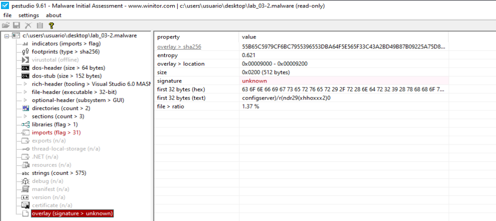
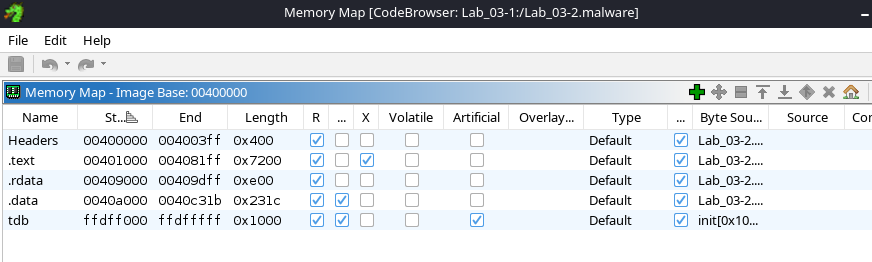

# github_RPISEC - Lab-3.2


## 1. Arquitectura de destino del malware

| Field                                 | Value                                                                                               |
|---------------------------------------|-----------------------------------------------------------------------------------------------------|
| file > sha256                         | D1BFC02DB9922F89DA0CEF14B514B63AF3703F1AB7BD88D558431151BFAC92E2                                     |
| file > first 32 bytes (hex)           | 4D 5A 90 00 03 00 00 00 04 00 00 00 FF FF 00 00 B8 00 00 00 00 00 00 00 40 00 00 00 00 00 00 00       |
| file > first 32 bytes (text)          | MZ............................................@..............                                        |
| file > info                           | size: 37376 bytes, entropy: 6.314                                                                    |
| file > type                           | executable, 32-bit, GUI                                                                              |
| file > version                        | n/a                                                                                                  |
| file > description                    | n/a                                                                                                  |
| entry-point > first 32 bytes (hex)    | 55 8B EC 6A FF 68 78 91 40 00 68 C4 5E 40 00 64 A1 00 00 00 00 50 64 89 25 00 00 00 00 83 EC 10       |
| entry-point > location                | 0x0000352F (section[.text])                                                                          |
| file > signature                      | Microsoft Linker 6.0 \| Visual Studio 6.0 MASM \| Microsoft Visual C++ \| Microsoft Visual C++ 6.0 - 8.0 |


**Arquitectura: executable, 32-bit, GUI.**

**Tipo de fichero:**
- Primeros 32 bytes del fichero:  4D 5A ....
- 4D = M
- 5A = Z
- "MZ" es la firma mágica de los archivos ejecutables en DOS/Windows (archivos .exe). Llamada así por Mark Zbikowski, ingeniero de Microsoft. Indica que el archivo es un ejecutable PE (Portable Executable) o que al menos comienza con una cabecera compatible con DOS.

___________________________________________________

## 2. Huellas dactilares del malware

### Footprints
| Component                       | SHA256                                                                 |
|--------------------------------|------------------------------------------------------------------------|
| file > sha256                  | D1BFC02DB9922F89DA0CEF14B514B63AF3703F1AB7BD88D558431151BFAC92E2       |
| dos-stub > sha256              | EF63BFA6967B9BC258DB866EDD37A00D4E6EAB5F638D5B986CBF07D3DD924C48       |
| dos-header > sha256            | 6285E684E5DA172EA1BE7BFFC4A5602C859FB14105B716657464418E15474E19       |
| rich-header > sha256           | 09354C1A6C70779E2B7AD4D63C0E407A9B23969D4E3018FFA8A48C740DB50364       |
| section > .text > sha256       | D53435E3FABF83A57E91ACB2628F0DF7FC1BA0A36A89A81E3883D5A67DB6AEBB       |
| section > .rdata > sha256      | CB7BA1884CC003DB6DE073091A64F88850BDA116AAB46D160C6CFEE1FC7606B3       |
| section > .data > sha256       | FA7ABEFA883B57C28A1BD58A663156E2B5B1C673E8FFC6F4B203D19D9336DBC5       |
| overlay > sha256               | 55B65C5979CF6BC7955396553DBA64F5E565F33C43A2BD49B87B09225A75D8CE       |


### Imphash
| Special         | Value                                 |
|----------------|---------------------------------------|
| imphash > md5  | F8474D31EC781CFACB7E8F62D7E1F468       |

**Imphash es una abreviatura de Import Hash.** Es un hash MD5 generado a partir de la lista de funciones importadas por un ejecutable PE (Portable Executable). Se usa comúnmente en análisis de malware para:
-  Detectar familias de malware similares.
- Encontrar binarios que comparten el mismo patrón de imports, incluso si han sido ofuscados o renombrados.

**¿Cómo se genera el Imphash?**  
- Se toma la lista de funciones importadas (como CreateFileA, VirtualAlloc, WinExec, etc.).
- Se ordenan alfabéticamente según la librería (DLL) y luego por función.
- Se concatena todo en una cadena de texto (KERNEL32.CreateFileAADVAPI32.RegOpenKeyA...).
- Se calcula el hash MD5 de esa cadena.


**🧪 ¿Qué significa F8474D31EC781CFACB7E8F62D7E1F468?**  
Es el resultado de aplicar el algoritmo MD5 a esa cadena de imports. Aunque el valor es hexadecimal y no interpretable directamente, se usa como firma o huella digital. Si otro ejecutable tiene el mismo imphash, probablemente:
- Usa el mismo conjunto de funciones importadas.
- Es de la misma familia de malware.
- Fue compilado con el mismo stub o plantilla.

___________________________________________________

## 3. Escanear el binario sospechoso con motores antivirus
https://www.virustotal.com/gui/file/d1bfc02db9922f89da0cef14b514b63af3703f1ab7bd88d558431151bfac92e2

___________________________________________________
## 4. Detección de empaquetado / protección
```
└─$ pepack Lab_03-2.malware -d db_packer.txt 
packer:                          Microsoft Visual C++
```

```
└─$ upx -d Lab_03-2.malware -o Lab_03-2-unpacked.malware
                       Ultimate Packer for eXecutables
                          Copyright (C) 1996 - 2024
UPX 4.2.4       Markus Oberhumer, Laszlo Molnar & John Reiser    May 9th 2024

        File size         Ratio      Format      Name
   --------------------   ------   -----------   -----------
upx: Lab_03-2.malware: NotPackedException: not packed by UPX

Unpacked 0 files.
```

**Parece que el fichero no está empaquetado.**

___________________________________________________
## 5. Identificación de ofuscación
APIs que pueden estar asociadas con técnicas de ofuscación, ejecución dinámica, cifrado o empaquetado, aunque su simple presencia no lo garantiza. 

| API |	Categoría |	Motivo por el que puede estar relacionada con ofuscación |
| -- | -- | -- |
| VirtualAlloc |	Allocación dinámica	|	Para reservar memoria para payloads cifrados o shellcode antes de desencriptar y ejecutar. |
| WriteFile |	Dump o payload |	Puede usarse para escribir temporalmente partes desencriptadas en disco. |
| MapViewOfFile |	File Mapping |	Técnica común para ocultar datos cifrados en secciones de memoria mapeada. |
| UnmapViewOfFile |	File Mapping |	Técnica común para ocultar datos cifrados en secciones de memoria mapeada. |
| CreateFileMappingA |	File Mapping |	Igual que arriba, útil para desencriptar o reconstruir ejecutables en memoria. |
| CreateProcessA |	Execution |		Ejecuta payloads desencriptados o archivos temporales de forma secundaria. |
| LoadLibraryA  |		Dynamic API Resolution |	Clásica técnica de ofuscación para cargar funciones en tiempo de ejecución sin que aparezcan en el IAT. |
| GetProcAddress |		Dynamic API Resolution |	Clásica técnica de ofuscación para cargar funciones en tiempo de ejecución sin que aparezcan en el IAT. |
| Sleep |		Anti-debug / Timing evasion |	En malware ofuscado, a veces se usa para ralentizar análisis o temporizar cargas de payload. |
| GetProcAddress |	API Obfuscation |	Oculta llamadas reales hasta que se resuelven en tiempo de ejecución. |
| GetModuleFileNameA |	Self-reference |	Se usa en técnicas de self-injection o autocopia para saber su propia ruta. |
| DeleteFileA / CopyFileA |	Auto-modificación |	Puede borrar copias previas o generar versiones modificadas del malware. |
| WinExec |	Exec oculto |	Puede ejecutar scripts externos, como .bat o herramientas auxiliares. |

___________________________________________________
## 6. Detección de técnicas anti-análisis

Se encuentran las siguientes APIs que pudieran estar relacionadas con técnicas anti-análisis:
|API | ¿Por qué puede indicar anti-análisis? |
| -- | -- |
| GetDriveTypeA | 	Puede identificar si está corriendo desde un CD-ROM, red, USB o unidad virtual, lo cual puede usarse para detectar entornos de análisis. |
| GetLogicalDrives | 	Suele usarse para detectar máquinas virtuales con unidades limitadas o configuraciones sospechosas. |
| Process32First | 	Usadas para enumerar procesos activos. Pueden buscar herramientas como Wireshark, x32dbg, IDA, VBoxService, vmtoolsd, etc. |
| Process32Next | 	Usadas para enumerar procesos activos. Pueden buscar herramientas como Wireshark, x32dbg, IDA, VBoxService, vmtoolsd, etc. |
| CreateToolhelp32Snapshot | 	Usadas para enumerar procesos activos. Pueden buscar herramientas como Wireshark, x32dbg, IDA, VBoxService, vmtoolsd, etc. |
| OpenProcess | 	Permite inspeccionar o manipular otros procesos. Puede ser usado para verificar si están corriendo herramientas de análisis. |
| GetEnvironmentStrings  | 	Puede obtener información de entorno que revele ejecución en sandbox (por ejemplo, variable COMSPEC, APPDATA, etc.). |
| GetEnvironmentStringsW | 	Puede obtener información de entorno que revele ejecución en sandbox (por ejemplo, variable COMSPEC, APPDATA, etc.). |
| SHGetFileInfoA | 	A veces se usa para examinar si los archivos del sistema tienen iconos o atributos sospechosos, otra forma indirecta de detectar si está en un entorno artificial. |
| GetUserNameA | 	Puede comprobar si el usuario actual es “sandbox”, “test”, “analyst”, etc. |
| GetVersion | 	Comúnmente usada para detectar si el sistema es una VM/sandbox basada en Windows XP/7 (entornos comunes de análisis). |
| Sleep | 	Aunque no es una API de detección, se usa para anti-debugging (evita el análisis por timeout o se combina con técnicas como "sleep skipping"). |

___________________________________________________
## 7. Extraer cadenas y metadatos
[Strings del fichero](Lab_03-2-ascii.txt)

**Algunas a destacar:**
```
LCMapStringW
sysinfo
configserver
SOFTWARE\Microsoft\Windows\CurrentVersion\Run
.PAD
fxftest
127.0.0.1
\java.exe
:\DOCUME~1\
%s%d
%4d-%02d-%02d %02d:%02d:%02d
upfileok
upfileer
cmd.exe
.?AVtype_info@@
configserver)/r(ndr29(xhhoxxx2)00xAAAAAAAAAAAAAAAAAAAAAAAAAAAAAAAAAAAAAAAAAAAAAAAAAAAA....
```

**Filtrado de cadenas buscando ejecutables:**
```
└─$ strings -a Lab_03-2.malware | grep -Ei "(http|\.dll|\.exe|cmd|powershell|/AppData|/Temp|Win32)" 

user32.dll
KERNEL32.dll
USER32.dll
ADVAPI32.dll
SHELL32.dll
WS2_32.dll
\java.exe
cmd.exe
```


**Indicadores de compromiso - Pestudio**
| Indicator | Detail |
| -- | -- |
| file > name | c:\users\usuario\desktop\lab_03-1.malware |
| file > signature | Microsoft Linker 14.0 | Visual Studio 2008 |
| file > sha256 | DCE7C942883810C535FAB689ECE1E366287336C79ED15C808038BB5863EDDF66 |
| file > info | size: 30208 bytes, entropy: 5.540 |
| file > type | executable, 32-bit, console |
| virustotal > score | No se pudo resolver el nombre de servidor o su dirección |
| stamp > compiler | Fri Sep 18 06:57:04 2015 |
| resource > file,signature: executable |  offset: 0x000020D0, size: 20480 bytes |
| languages > names | English-US |
| resources > info | count: 2, size: 20861 bytes, file-ratio: 69.06% |
| manifest > general | name: n/a, description: n/a, severity: asInvoker |
| file > version | n/a |
| entry-point > location | 0x0000130D (section: .text) |
| string > url-pattern | http://rpis.ec/ |
| string > url-pattern | http://rpis.ec/binexp |
| string > url-pattern | https://twitter.com/RPISEC |
| string > url-pattern | https://www.facebook.com/RPI-Computer-Security-Club-RPISEC-121207327959689/timeline/ |
| string > url-pattern | http://blog.rpis.ec/ |
| string > url-pattern | http://security.cs.rpi.edu/courses/binexp-spring2015/ |
| certificate | n/a |
| imports > flag | GetCurrentProcess | GetCurrentProcessId | GetCurrentThreadId | WriteFile |
| imphash > md5 | 1441F76B3ED03715E5648E74DBC58C19 |
| exports | n/a |
| overlay | n/a |


___________________________________________________
## 8. Tamaño y análisis de la estructura PE

### dos-header - Pestudio
Encabezado inicial del archivo PE, contiene campos fundamentales como el `e_lfanew` que apunta al verdadero encabezado PE. Su análisis es útil para detectar corrupción o manipulaciones del binario.

| Field                   | Value                                                                 |
|------------------------|-----------------------------------------------------------------------|
| dos-header > sha256    | 6285E684E5DA172EA1BE7BFFC4A5602C859FB14105B716657464418E15474E19       |
| size                   | 0x40 (64 bytes)                                                        |
| dos-header > location  | 0x00000000 - 0x00000040                                                |
| entropy                | 4.255                                                                  |
| file > ratio           | 0.00 %                                                                 |
| exe-header > offset    | 0x000000D8 (e_lfanew)                                                  |

_____________________________________________

### dos-stub - Pestudio
El DOS Stub es un fragmento de código heredado que se ejecuta si el archivo PE se intenta abrir en DOS. Aquí se muestra su hash, ubicación, mensaje embebido y entropía. También sirve para identificar herramientas de empaquetado o compilación.

| Field                        | Value                                                                 |
|-----------------------------|-----------------------------------------------------------------------|
| dos-stub > sha256           | EF63BFA6967B9BC258DB866EDD37A00D4E6EAB5F638D5B986CBF07D3DD924C48       |
| dos-stub > location         | 0x00000040 - 0x000000D8                                               |
| size                        | 0x98 (152 bytes)                                                      |
| entropy                     | 4.884                                                                 |
| file > ratio                | 0.41 %                                                                |
| first 32 bytes (hex)        | 0E 1F BA 0E 00 B4 09 CD 21 B8 01 4C CD 21 54 68 69 73 20 70 72 6F 67 72 61 6D 20 63 61 6E 6E 6F |
| first 32 bytes (ascii)      | ................!....L..!This program canno                           |
| message                     | !This program cannot be run in DOS mode.                              |

_______________________________________________

### rich header - Pestudio
| Tool        | Description                          |
|-------------|--------------------------------------|
| Masm613     | Visual Studio 6.0 MASM - 6.13 SP1    |
| Utc12_C     | Visual Studio 6.0 - 6.0              |
| Linker512   | Visual Studio 5.0 - 5.12             |
| Import      | Visual Studio -                      |
| Utc12_CPP   | Visual Studio 6.0 - 6.0              |

| Property                 | Value                                                                 |
|--------------------------|-----------------------------------------------------------------------|
| rich-header > location   | 0x00000080 - 0x000000D8                                               |
| size                     | 0x00000058 (88 bytes)                                                 |
| checksum-builtin         | 0x088BAA26                                                            |
| checksum-real            | 0x088BAA26                                                            |
| rich-header > sha256     | 09354C1A6C70779E2B7AD4D63C0E407A9B23969D4E3018FFA8A48C740DB50364       |


-----------------------------------------------

### File-header - Pestudio
| Field                                       | Value        | Description                          |
|--------------------------------------------|--------------|--------------------------------------|
| characteristics                            | 0x010F       |                                      |
| dynamic-link-library                       | 0x0000       | false                                |
| 32-bit words support                       | 0x0100       | true                                 |
| file-can-be-executed                       | 0x0002       | true                                 |
| system-image                               | 0x0000       | false                                |
| large-address-aware                        | 0x0000       | false                                |
| debug-stripped                             | 0x0000       | false                                |
| line-stripped-from-file                    | 0x0004       | true                                 |
| local-symbols-stripped-from-file           | 0x0008       | true                                 |
| relocation-stripped                        | 0x0001       | true                                 |
| uniprocessor                               | 0x0000       | false                                |
| bytes-of-machine-words-reversed-Low        | 0x0000       | false                                |
| bytes-of-machine-words-reversed-Hi         | 0x0000       | false                                |
| media-run-from-swap                        | 0x0000       | false                                |
| network-run-from-swap                      | 0x0000       | false                                |
|                                            |              |                                      |
| general                                     |              |                                      |
| stamp > compiler                           | 0x4BB1E566   | Tue Mar 30 11:49:58 2010 (UTC)      |
| size                                       | 0x14         | 20 bytes                             |
| file-header > location                     | 0x000000DC - 0x000000F0 | 0x000000DC - 0x000000F0       |
| signature                                  | 0x00004550   | PE00                                 |
| machine                                    | 0x014C       | Intel-386                            |
| sections > count                           | 0x0003       | 3                                    |
| pointer-symbol-table                       | 0x00000000   | 0x00000000                           |
| number-of-symbols                          | 0x00000000   | 0x00000000                           |


----------------------------------------------------

### optional-header - Pestudio
| Field                                           | Value        | Description                      |
|------------------------------------------------|--------------|----------------------------------|
| general                                        |              |                                  |
| subsystem                                      | 0x0002       | GUI                              |
| magic                                          | 0x010B       | PE                               |
| file-checksum                                  | 0x00000000   | 0x00012E63 (expected)            |
| entry-point > location                         | 0x0000352F   | section[.text]                   |
| base-of-code > location                        | 0x00001000   | section[.text]                   |
| base-of-data                                   | 0x00009000   | section[.rdata]                  |
| size-of-code                                   | 0x00007200   | 29184 bytes                      |
| size-of-initialized-data                       | 0x00003200   | 12800 bytes                      |
| size-of-uninitialized-data                     | 0x00000000   | 0 bytes                          |
| size-of-image                                  | 0x0000D000   | 53248 bytes                      |
| size-of-headers                                | 0x00000400   | 1024 bytes                       |
| size-of-stack-reserve                          | 0x00100000   | 1048576 bytes                    |
| size-of-stack-commit                           | 0x00001000   | 4096 bytes                       |
| size-of-heap-reserve                           | 0x00100000   | 1048576 bytes                    |
| size-of-heap-commit                            | 0x00001000   | 4096 bytes                       |
| section-alignment                              | 0x00001000   | 4096 bytes                       |
| file-alignment                                 | 0x00000200   | 512 bytes                        |
| directories > count                            | 0x00000010   | 16                               |
| LoaderFlags                                    | 0x00000000   | 0x00000000                       |
| Win32VersionValue                              | 0x00000000   | 0x00000000                       |
| image-base                                     | 0x00400000   | 0x00400000                       |
| linker > version                               | 6.0          | Microsoft Linker 6.0             |
| os > version                                   | 4.0          | Windows NT 4.0                   |
| image > version                                | 0.0          | 0.0                              |
| subsystem                                      | 4.0          | 4.0                              |
|                                                |              |                                  |
| characteristics                                | 0x0000       | items                            |
| Address-Space-Layout-Randomization (ASLR)      | 0x0000       | false                            |
| Control-flow Enforcement Technology (CETCOMPACT)| 0x0000      | false                            |
| Data Execution Prevention (DEP)                | 0x0000       | false                            |
| Code-Integrity (CI)                            | 0x0000       | false                            |
| Structured-Exception Handling (SEH)            | 0x0000       | true                             |
| Windows-Driver Model (WDM)                     | 0x0000       | false                            |
| Terminal-Server aware (TSA)                    | 0x0000       | false                            |
| Control-Flow Guard (CFG)                       | 0x0000       | false                            |
| image-bound                                    | 0x0000       | false                            |
| Image isolation                                | 0x0000       | false                            |
| High-Entropy                                   | 0x0000       | false                            |
| AppContainer                                   | 0x0000       | false                            |

_________________________________


### sections - Pestudio

| Property | Value | Value | Value |
| -- | -- | -- | -- |
| section | section[0] | section[1] | section[2] |
| name | .text | .rdata | .data |
| section > sha256 | D53435E3FABF83... | CB7BA1884CC003DB6DE07309... | FA7ABEFA883B57C28A1BD.... |
| entropy | 6.604 | 5.221 | 2.201 |
| file > ratio (95.89%) | 78.08 % | 9.59 % | 8.22 % |
| raw-address (begin) | 0x00000400 | 0x00007600 | 0x00008400 |
| raw-address (end) | 0x00007600 | 0x00008400 | 0x00009000
| raw-size (35840 bytes) | 0x00007200 (29184 bytes) | 0x00000E00 (3584 bytes) | 0x00000C00 (3072 bytes) |
| virtual-address (begin) | 0x00001000 | 0x00009000 | 0x0000A000 |
| virtual-address (end) | 0x000081BA | 0x00009D76 | 0x0000C31C |
| virtual-size (41548 bytes) | 0x000071BA (29114 bytes) | 0x00000D76 (3446 bytes) | 0x0000231C (8988 bytes) |
|  |  |  |  |
| characteristics | 0x60000020 | 0x40000040 | 0xC0000040 |
| write | - | - | x |
| execute | x | - | - |
| share | - | - | - |
| self-modifying | - | - | - |
| virtual | - | - | - |
| |  |  |  | 
| items |  |  | 
| directory > import | - | 0x00009670 | - |
| directory > import-address | - | 0x00009000 | - |
| base-of-code | 0x00001000 | - | - |
| base-of-data | - | 0x00009000 | - |
| entry-point > location | 0x0000352F | - | - |


**Examinando el Compilation Timestamp:**
### 🕓 Timestamps - Pestudio

| Stamp Type        | Value                                |
|-------------------|--------------------------------------|
| stamp > compiler  | Tue Mar 30 11:49:58 2010 (UTC)       |
| stamp > debug     | n/a                                  |
| stamp > resource  | n/a                                  |
| stamp > import    | n/a                                  |
| stamp > export    | n/a    


___________________________________________________
## 9. Funciones/APIs utilizadas

### Libraries - Pestudio

| DLL           | flag | type     | count | description                   |
|---------------|------|----------|-------|-------------------------------|
| KERNEL32.dll  | -    | Implicit | 70    | Windows NT BASE API Client    |
| ADVAPI32.dll  | -    | Implicit | 4     | Advanced Windows 32 Base API  |
| SHELL32.dll   | -    | Implicit | 1     | Windows Shell Library         |
| **WS2_32.dll**    | **x**    | **Implicit** | **13**    | **Windows Socket Library**        |


__________________________________

### Imports

- **first-thunk (IAT)**: dirección donde se resolverá la función en tiempo de ejecución.
- **first-thunk-original (INT)**: dirección donde está definida originalmente.

**Imports ordenados por IAT - Pestudio:**
| Imports                      | flag      | type     | ordinal | first-thunk (IAT) | first-thunk-original (INT) | library       |
|--------|------|------|---------|-----|-----|---------|
| GetDriveTypeA | - | implicit | - | 0x00009890 | 0x00009890 | KERNEL32.dll |
| GetLogicalDrives | - | implicit | - | 0x000098A0 | 0x000098A0 | KERNEL32.dll |
| FindClose | - | implicit | - | 0x000098B4 | 0x000098B4 | KERNEL32.dll |
| GetLastError | - | implicit | - | 0x000098C0 | 0x000098C0 | KERNEL32.dll |
| **FindNextFileA** | **x** | **implicit** | - | **0x000098D0** | **0x000098D0** | **KERNEL32.dll** |
| FileTimeToSystemTime | - | implicit | - | 0x000098E0 | 0x000098E0 | KERNEL32.dll |
| **FindFirstFileA** | **x** | **implicit** | - | **0x000098F8** | **0x000098F8** | **KERNEL32.dll** |
| **WinExec** | **x** | **implicit** | - | **0x0000990A** | **0x0000990A**| **KERNEL32.dll** |
| **DeleteFileA** | **x** | **implicit** | - | **0x00009914** | **0x00009914** | **KERNEL32.dll** |
| CloseHandle | - | implicit | - | 0x00009922 | 0x00009922 | KERNEL32.dll |
| **WriteFile** | **x** | **implicit** | - | **0x00009930** | **0x00009930** | **KERNEL32.dll** |
| CreateFileA | - | implicit | - | 0x0000993C | 0x0000993C | KERNEL32.dll |
| **UnmapViewOfFile** | **x** | **implicit** | - | **0x0000994A** | **0x0000994A** | **KERNEL32.dll** |
| GetSystemDirectoryA | - | implicit | - | 0x0000987A | 0x0000987A | KERNEL32.dll |
| **MapViewOfFile** | **x** | **implicit** | - | **0x0000996A** | **0x0000996A** | **KERNEL32.dll** |
| CreateFileMappingA | - | implicit | - | 0x0000997A | 0x0000997A | KERNEL32.dll |
| **Process32Next** | **x** | **implicit** | - | **0x00009990** | **0x00009990** | **KERNEL32.dll** |
| **Process32First** | **x** | **implicit** | - | **0x000099A0** | **0x000099A0** | **KERNEL32.dll** |
| **CreateToolhelp32Snapsho**t | **x** | **mplicit** | - | **0x000099B2** | **0x000099B2** | **KERNEL32.dll** |
| TerminateProcess | - | implicit | - | 0x000099CE | 0x000099CE | KERNEL32.dll |
| **OpenProcess** | **x** | **implicit** | - | **0x000099E2** | **0x000099E2** | **KERNEL32.dll** |
| ReadFile | - | implicit | - | 0x000099F0 | 0x000099F0 | KERNEL32.dll |
| PeekNamedPipe | - | implicit | - | 0x000099FC | 0x000099FC | KERNEL32.dll |
| **CreateProcessA** | **x** | **implicit** | - | **0x00009A0C** | **0x00009A0C** | **KERNEL32.dll** |
| **CreatePipe** | **x** | **implicit** | - | **0x00009A1E** | **0x00009A1E** | **KERNEL32.dll**|
| LCMapStringA | - | implicit | - | 0x00009D56 | 0x00009D56 | KERNEL32.dll |
| **CopyFileA** | **x** | **implicit** | - | **0x0000986E** | **0x0000986E** | **KERNEL32.dll** |
| Sleep | - | implicit | - | 0x00009866 | 0x00009866 | KERNEL32.dll |
| lstrlenA | - | implicit | - | 0x0000985A | 0x0000985A | KERNEL32.dll |
| GetFileSize | - | implicit | - | 0x0000995C | 0x0000995C | KERNEL32.dll |
| GetModuleFileNameA | - | implicit | - | 0x00009844 | 0x00009844 | KERNEL32.dll |
| SetEndOfFile | - | implicit | - | 0x00009D46 | 0x00009D46 | KERNEL32.dll |
| LoadLibraryA | - | implicit | - | 0x00009D36 | 0x00009D36 | KERNEL32.dll |
| GetProcAddress | - | implicit | - | 0x00009D24 | 0x00009D24 | KERNEL32.dll |
| GetOEMCP | - | implicit | - | 0x00009D18 | 0x00009D18 | KERNEL32.dll |
| GetACP | - | implicit | - | 0x00009D0E | 0x00009D0E | KERNEL32.dll |
| GetCPInfo | - | implicit | - | 0x00009D02 | 0x00009D02 | KERNEL32.dll |
| IsBadCodePtr | - | implicit | - | 0x00009CF2 | 0x00009CF2 | KERNEL32.dll |
| IsBadReadPtr | - | implicit | - | 0x00009CE2 | 0x00009CE2 | KERNEL32.dll |
| SetUnhandledExceptionFilter | - | implicit | - | 0x00009CC4 | 0x00009CC4 | KERNEL32.dll |
| LCMapStringW | - | implicit | - | 0x00009D66 | 0x00009D66 | KERNEL32.dll |
| FlushFileBuffers | - | implicit | - | 0x00009CB0 | 0x00009CB0 | KERNEL32.dll |
| SetStdHandle | - | implicit | - | 0x00009CA0 | 0x00009CA0 | KERNEL32.dll |
| IsBadWritePtr | - | implicit | - | 0x00009C90 | 0x00009C90 | KERNEL32.dll |
| HeapReAlloc | - | implicit | - | 0x00009C82 | 0x00009C82 | KERNEL32.dll |
| **VirtualAlloc** | **x** | **implicit** | - | **0x00009C72** | **0x00009C72** | **KERNEL32.dll** |
| GetStringTypeW | - | implicit | - | 0x00009C60 | 0x00009C60 | KERNEL32.dll |
| RtlUnwind | - | implicit | - | 0x00009ABC | 0x00009ABC | KERNEL32.dll |
| GetCommandLineA | - | implicit | - | 0x00009AC8 | 0x00009AC8 | KERNEL32.dll |
| GetVersion | - | implicit | - | 0x00009ADA | 0x00009ADA | KERNEL32.dll |
| ExitProcess | - | implicit | - | 0x00009AE8 | 0x00009AE8 | KERNEL32.dll |
| HeapFree | - | implicit | - | 0x00009AF6 | 0x00009AF6 | KERNEL32.dll |
| **GetCurrentProcess** | **x** | **implicit** | - | **0x00009B02** | **0x00009B02** | **KERNEL32.dll** |
| SetFilePointer | - | implicit | - | 0x00009B16 | 0x00009B16 | KERNEL32.dll |
| HeapAlloc | - | implicit | - | 0x00009B28 | 0x00009B28 | KERNEL32.dll |
| UnhandledExceptionFilter | - | implicit | - | 0x00009B34 | 0x00009B34 | KERNEL32.dll |
| FreeEnvironmentStringsA | - | implicit | - | 0x00009B50 | 0x00009B50 | KERNEL32.dll |
| FreeEnvironmentStringsW | - | implicit | - | 0x00009B6A | 0x00009B6A | KERNEL32.dll |
| WideCharToMultiByte | - | implicit | - | 0x00009B84 | 0x00009B84 | KERNEL32.dll |
| **GetEnvironmentStrings** | **x** | **implicit** | - | **0x00009B9A** | **0x00009B9A** | **KERNEL32.dll** |
| **GetEnvironmentStringsW** | **x** | **implicit** | - | **0x00009BB2** | **0x00009BB2** | **KERNEL32.dll** |
| SetHandleCount | - | implicit | - | 0x00009BCC | 0x00009BCC | KERNEL32.dll |
| GetStdHandle | - | implicit | - | 0x00009BDE | 0x00009BDE | KERNEL32.dll |
| GetFileType | - | implicit | - | 0x00009BEE | 0x00009BEE | KERNEL32.dll |
| GetStartupInfoA | - | implicit | - | 0x00009BFC | 0x00009BFC | KERNEL32.dll |
| HeapDestroy | - | implicit | - | 0x00009C0E | 0x00009C0E | KERNEL32.dll |
| HeapCreate | - | implicit | - | 0x00009C1C | 0x00009C1C | KERNEL32.dll |
| VirtualFree | - | implicit | - | 0x00009C2A | 0x00009C2A | KERNEL32.dll |
| MultiByteToWideChar | - | implicit | - | 0x00009C38 | 0x00009C38 | KERNEL32.dll |
| GetStringTypeA | - | implicit | - | 0x00009C4E | 0x00009C4E | KERNEL32.dll |
| RegOpenKeyA | - | implicit | - | 0x00009A66 | 0x00009A66 | ADVAPI32.dll |
| **RegSetValueExA** | **x** | **implicit** | - | **0x00009A54** | **0x00009A54** | **ADVAPI32.dll** |
| RegCloseKey | - | implicit | - | 0x00009A46 | 0x00009A46 | ADVAPI32.dll |
| GetUserNameA | - | implicit | - | 0x00009A74 | 0x00009A74 | ADVAPI32.dll |
| **SHGetFileInfoA** | **x** | **implicit** | - | **0x00009A92** | **0x00009A92** | **SHELL32.dll** |
| **4 (connect)** | **x** | **implicit** | **x** | **0x80000004** | **0x80000004** | **WS2_32.dll** |
| **3 (closesocket)** | **x** | **implicit** | **x** | **0x80000003** | **0x80000003** | **WS2_32.dll** |
| **16 (recv)** | **x** | **implicit** | **x** | **0x80000010** | **0x80000010** | **WS2_32.dll** |
| **116 (WSACleanup)** | - | **implicit** | **x** | **0x80000074** | **0x80000074** | **WS2_32.dll** |
| **11 (inet_addr)** | **x** | **implicit** | **x** | **0x8000000B** | **0x8000000B** | **WS2_32.dll** |
| **111 (WSAGetLastError)** | **x** | **implicit** | **x** | **0x8000006F** | **0x8000006F** | **WS2_32.dll** |
| **12 (inet_ntoa)** | **x** | **implicit** | **x** | **0x8000000C** | **0x8000000C** | **WS2_32.dll** |
| **57 (gethostvalue)** | **x** | **implicit** | **x** | **0x80000039** | **0x80000039** | **WS2_32.dll** |
| **115 (WSAStartup)** | - | **implicit** | **x** | **0x80000073** | **0x80000073** | **WS2_32.dll** |
| **9 (htons)** | **x** | **implicit** | **x** | **0x80000009** | **0x80000009** | **WS2_32.dll** |
| **23 (socket)** | **x** | **implicit** | **x** | **0x80000017** | **0x80000017** | **WS2_32.dll** |
| **52 (gethostbyvalue)** | **x** | **implicit** | **x** | **0x80000034** | **0x80000034** | **WS2_32.dll** |
| **19 (send)** | **x** | **implicit** | **x** | **0x80000013** | **0x80000013** | **WS2_32.dll** |


**Imports ordenados por Flags:**
| Imports                      | flag      | type     | ordinal | first-thunk (IAT) | first-thunk-original (INT) | library       |
|-----------------------------|-----------|----------|---------|-------------------|-----------------------------|---------------|
| WriteFile                   | x         | implicit | -       | 0x00009930        | 0x00009930                  | KERNEL32.dll  |
| WinExec                     | x         | implicit | -       | 0x0000990A        | 0x0000990A                  | KERNEL32.dll  |
| VirtualAlloc                | x         | implicit | -       | 0x00009C72        | 0x00009C72                  | KERNEL32.dll  |
| UnmapViewOfFile             | x         | implicit | -       | 0x0000994A        | 0x0000994A                  | KERNEL32.dll  |
| SHGetFileInfoA              | x         | implicit | -       | 0x00009A92        | 0x00009A92                  | SHELL32.dll   |
| RegSetValueExA              | x         | implicit | -       | 0x00009A54        | 0x00009A54                  | ADVAPI32.dll  |
| Process32Nex                | x         | implicit | -       | 0x00009990        | 0x00009990                  | KERNEL32.dll  |
| Process32First              | x         | implicit | -       | 0x000099A0        | 0x000099A0                  | KERNEL32.dll  |
| OpenProcess                 | x         | implicit | -       | 0x000099E2        | 0x000099E2                  | KERNEL32.dll  |
| MapViewOfFile               | x         | implicit | -       | 0x0000996A        | 0x0000996A                  | KERNEL32.dll  |
| GetEnvironmentStringsW      | x         | implicit | -       | 0x00009BB2        | 0x00009BB2                  | KERNEL32.dll  |
| GetEnvironmentStrings       | x         | implicit | -       | 0x00009B9A        | 0x00009B9A                  | KERNEL32.dll  |
| GetCurrentProcess           | x         | implicit | -       | 0x00009B02        | 0x00009B02                  | KERNEL32.dll  |
| FindNextFileA               | x         | implicit | -       | 0x000098D0        | 0x000098D0                  | KERNEL32.dll  |
| FindFirstFileA              | x         | implicit | -       | 0x000098F8        | 0x000098F8                  | KERNEL32.dll  |
| DeleteFileA                 | x         | implicit | -       | 0x00009914        | 0x00009914                  | KERNEL32.dll  |
| CreateToolhelp32Snapshot    | x         | implicit | -       | 0x000099B2        | 0x000099B2                  | KERNEL32.dll  |
| CreateProcessA              | x         | implicit | -       | 0x00009A0C        | 0x00009A0C                  | KERNEL32.dll  |
| CreatePipe                  | x         | implicit | -       | 0x00009A1E        | 0x00009A1E                  | KERNEL32.dll  |
| CopyFileA                   | x         | implicit | -       | 0x0000986E        | 0x0000986E                  | KERNEL32.dll  |
| 9 (htons)                   | x         | implicit | x       | 0x80000009        | 0x80000009                  | WS2_32.dll    |
| 57 (gethostvalue)           | x         | implicit | x       | 0x80000039        | 0x80000039                  | WS2_32.dll    |
| 52 (gethostbyvalue)         | x         | implicit | x       | 0x80000034        | 0x80000034                  | WS2_32.dll    |
| 4 (connect)                 | x         | implicit | x       | 0x80000004        | 0x80000004                  | WS2_32.dll    |
| 3 (closesocket)             | x         | implicit | x       | 0x80000003        | 0x80000003                  | WS2_32.dll    |
| 23 (socket)                 | x         | implicit | x       | 0x80000017        | 0x80000017                  | WS2_32.dll    |
| 19 (send)                   | x         | implicit | x       | 0x80000013        | 0x80000013                  | WS2_32.dll    |
| 16 (recv)                   | x         | implicit | x       | 0x80000010        | 0x80000010                  | WS2_32.dll    |
| 12 (inet_ntoa)              | x         | implicit | x       | 0x8000000C        | 0x8000000C                  | WS2_32.dll    |
| 111 (WSAGetLastError)       | x         | implicit | x       | 0x8000006F        | 0x8000006F                  | WS2_32.dll    |
| 11 (inet_addr)              | x         | implicit | x       | 0x8000000B        | 0x8000000B                  | WS2_32.dll    |
| 116 (WSACleanup)            | -         | implicit | x       | 0x80000074        | 0x80000074                  | WS2_32.dll    |
| 115 (WSAStartup)            | -         | implicit | x       | 0x80000073        | 0x80000073                  | WS2_32.dll    |

---------------------
### Overlay


Un overlay es cualquier dato que se encuentra al final del archivo PE, después de la última sección definida en su encabezado. No forma parte de la estructura oficial del archivo ejecutable, y por tanto, el sistema operativo no lo carga ni lo interpreta directamente cuando ejecuta el programa.

El overlay puede tener usos legítimos o maliciosos:
- Usos legítimos:
  - nformación adicional del instalador (como en archivos creados por InstallShield).
  - Firmas digitales (aunque estas suelen estar en una estructura reconocida por Windows).
  - Datos de configuración embebidos por el desarrollador.
- Usos maliciosos:
  - Configuración de malware: rutas C2 (Command and Control), claves, listas de objetivos.
  - Payloads secundarios: código que el malware extrae en tiempo de ejecución.
  - Evitar detección: el overlay se puede usar para almacenar contenido que los antivirus tradicionales no escanean tan a fondo.

¿Por qué es importante en análisis de malware? Porque el overlay no está vinculado a ninguna sección del PE y, por tanto, es menos controlado por herramientas convencionales de seguridad. Analizar el overlay puede revelar datos clave como:
- Configuración del bot.
- IPs o dominios de control.
- Datos robados empaquetados.
- Shellcodes o scripts ofuscados.

**Overlay - Pestudio:**
| Property                    | Value                                                                 |
|--------------------------|-----------------------------------------------------------------------|
| overlay > sha256         | 55B65C5979CF6BC7955396553DBA64F5E565F33C43A2BD49B87B09225A75D8CE      |
| entropy                  | 0.621                                                                 |
| overlay > location       | 0x00009000 - 0x00009200                                               |
| size                     | 0x0200 (512 bytes)                                                    |
| signature                | unknown                                                               |
| first 32 bytes (hex)     | 63 6F 6E 66 69 67 73 65 72 76 65 72 29 2F 72 28 6E 64 72 32 39 28 78... |
| first 32 bytes (text)    | configserver)/r(ndr29(xhhoxxx2)0                                      |
| file > ratio             | 1.37 %                                                                |

**overlay > sha256:** Es la huella digital SHA-256 del overlay del archivo, útil para comprobar su integridad o detectar variantes conocidas.

**entropy:** La entropía mide el grado de aleatoriedad o compresión del contenido. Un valor de 0.621 indica que no está cifrado ni comprimido, pero tiene cierta estructura.

**overlay > location:** Rango de direcciones donde se encuentra el overlay en el archivo PE, fuera del área oficial de las secciones PE.

**size:** Tamaño del overlay en hexadecimal y en bytes reales (512 bytes). Coincide con la unidad mínima de alineamiento de disco.

**signature:** No se ha reconocido ninguna firma (por ejemplo, no es una firma digital estándar ni una estructura PE).

**first 32 bytes (hex) y (text):** Muestra el inicio del contenido del overlay. El texto sugiere nombres de configuración o rutas de servidor, como "configserver)/r(ndr29(xhhoxxx2)0", lo cual puede estar relacionado con comandos de configuración o C2 (Command and Control).

**file > ratio:** El overlay representa el 1.37 % del tamaño total del archivo. Aunque es una porción pequeña, puede contener configuraciones o datos maliciosos.


**¿Dónde está el overlay?:**
1. Identificar el final del contenido legítimo.
2. Ver el offset físico en disco  



Para Identificar el final del contenido legítimo:
- En la imagen de Memory Map de Ghidra, la última sección real es:
```
.data     Start: 0x0040A000   End: 0x0040C31B
```
- Por tanto, el final real del contenido válido del binario está en:
```
0x0040C31B + 1 = 0x0040C31C
```
- ⚠️ Importante: Este es el final de la última sección en memoria virtual, pero necesitamos saber el offset físico (en el archivo) del final de la última sección.

Para ver el offset físico en disco:
- Localizamos la última sección con datos reales del binario (en nuestro caso: .data).
- Apuntamos:
  - Start Address: 0040a000
  - Length: 0x231c. Esto indica que ocupa 0x231c bytes en memoria.
- Pulsamos G o ve a Navigation > Go To. Introducimos: 0x0040a000 (inicio de .data).

- Byte Source Offset (archivo): 0x8400
- En el mapa de memoria, .data termina en: 0040c31b
- → Tiene una longitud de: 0x231c
- Calculamos el final de los datos reales en el archivo:
```
0x8400 (offset de inicio) + 0x231c (longitud de .data) = 0xa71c
```

**Vemos el overlay con el comando ```tail```:***
```
└─$ hexdump -C Lab_03-2.malware | tail
00008e50  00 00 00 00 00 00 00 00  81 d3 d8 de e0 f9 00 00  |................|
00008e60  31 7e 81 fe 00 00 00 00  00 00 00 00 00 00 00 00  |1~..............|
00008e70  00 00 00 00 00 00 00 00  00 00 00 00 00 00 00 00  |................|
*
00009000  63 6f 6e 66 69 67 73 65  72 76 65 72 29 2f 72 28  |configserver)/r(|
00009010  6e 64 72 32 39 28 78 68  68 6f 78 78 78 32 29 30  |ndr29(xhhoxxx2)0|
00009020  30 78 41 41 41 41 41 41  41 41 41 41 41 41 41 41  |0xAAAAAAAAAAAAAA|
00009030  41 41 41 41 41 41 41 41  41 41 41 41 41 41 41 41  |AAAAAAAAAAAAAAAA|
*
00009200
```

**Extraemos el overlay con el el siguiente script de python:***
```
from pefile import PE

pe = PE("Lab_03-2.malware")

# Obtener fin de la última sección en el archivo
last_section = pe.sections[-1]
raw_offset = last_section.PointerToRawData
raw_size = last_section.SizeOfRawData
end_of_sections = raw_offset + raw_size

# Obtener tamaño total del archivo
import os
file_size = os.path.getsize("Lab_03-2.malware")

if file_size > end_of_sections:
    overlay_offset = end_of_sections
    overlay_size = file_size - overlay_offset
    with open("Lab_03-2.malware", "rb") as f:
        f.seek(overlay_offset)
        overlay = f.read()
    with open("overlay.bin", "wb") as out:
        out.write(overlay)
    print(f"✅ Extraído overlay de {overlay_size} bytes en 'overlay.bin'")
else:
    print("❌ No se detectó overlay.")

```

Este script usa la librería pefile. Necesitamos tenerla instalada:
```
pip install pefile
```

**Analizamos el overlay con el script analiza-overlay.py:**
```
└─$ python3 analiza-overlay.py 
[+] Tamaño del overlay: 513 bytes
[+] Entropía: 0.6398 (BAJA - puede haber texto plano)
[+] Cadenas legibles encontradas: 1
    - configserver)/r(ndr29(xhhoxxx2)00xAAAAAAAAAAAAAAAAAAAAAAAAAAAAAAAAAAAAAAAAAAAAAAAAAAAAAAAAAAAAAAAAAAAAAAAAAAAAAAAAAAAAAAAAAAAAAAAAAAAAAAAAAAAAAAAAAAAAAAAAAAAAAAAAAAAAAAAAAAAAAAAAAAAAAAAAAAAAAAAAAAAAAAAAAAAAAAAAAAAAAAAAAAAAAAAAAAAAAAAAAAAAAAAAAAAAAAAAAAAAAAAAAAAAAAAAAAAAAAAAAAAAAAAAAAAAAAAAAAAAAAAAAAAAAAAAAAAAAAAAAAAAAAAAAAAAAAAAAAAAAAAAAAAAAAAAAAAAAAAAAAAAAAAAAAAAAAAAAAAAAAAAAAAAAAAAAAAAAAAAAAAAAAAAAAAAAAAAAAAAAAAAAAAAAAAAAAAAAAAAAAAAAAAAAAAAAAAAAAAAAAAAAAAAAAAAAAAAAAAAAAAAAAAAAAAAAAAAAAAAAAAAAAAAAAAAAAAAAA
        
```

Entropía: 0.63 (BAJA) --> Esto indica que no está comprimido ni cifrado, sino que contiene probablemente texto plano o datos codificados simples (como lo que ves: configserver...).

configserver) → podría ser un delimitador de inicio de datos o marcador de configuración.

ndr29(xhhoxxx2) → parece un ID de campaña o grupo.

00xAAAAAAAA... → relleno con 0xAA, usado muchas veces para marcar zonas vacías o sin inicializar (padding), o bien un buffer reservado que se llenará en tiempo de ejecución.
_____________________________


###  Buscamos qué funciones del malware llaman a estas APIs usando Ghidra
- Desplegamos Imports.
- Vemos las DLLs importadas: KERNEL32.dll, ADVAPI32.dll, WS2_32.dll, etc.
- Dentro de cada DLL, buscamos las funciones de interés. Por ejemplo: WriteFile, WinExec, connect, etc.
- Hacemos clic derecho sobre cada API → "Show References To".
- Esto mostrará todas las funciones del malware que llaman a esa API.


| API                      | Localización      | Función que llama a la API      | library       |
|-----------------------------|-----------|----------|---------|
| WriteFile                   | 004021bb         | FUN_004020f0 | KERNEL32.dll  |
| WriteFile                   | 004026ad         | FUN_00402660 | KERNEL32.dll  |
| WriteFile                   | 0040611f         | FUN_00405fd5 | KERNEL32.dll  |
| WriteFile                   | 00406e13         | FUN_00406d3b | KERNEL32.dll  |
| WriteFile                   | 00406e78         | FUN_00406d3b | KERNEL32.dll  |
| WriteFile                   | 0040903c         |  POINTER to EXTERNAL FUNCTION | KERNEL32.dll  |
| WinExec                     | 0040206a         | FUN_00402050 |KERNEL32.dll  |
| WinExec                     | 00409030         | POINTER to EXTERNAL FUNCTION |KERNEL32.dll  |
| VirtualAlloc                | 00406984         | FUN_0040690e |KERNEL32.dll  |
| VirtualAlloc                | 00406a10         | FUN_004069bf |KERNEL32.dll  |
| VirtualAlloc                | 004090c8         | POINTER to EXTERNAL FUNCTION |KERNEL32.dll  |
| UnmapViewOfFile             | 004022eb         | FUN_00402210 |KERNEL32.dll  |
| UnmapViewOfFile             | 00409044         | POINTER to EXTERNAL FUNCTION  |
| SHGetFileInfoA              | x         | implicit |SHELL32.dll   |
| RegSetValueExA              | x         | implicit |ADVAPI32.dll  |
| Process32Nex                | 004028d0         |  THUNK FUNCTION  |KERNEL32.dll  |
| Process32Nex                | 004028d0         |  THUNK FUNCTION  |KERNEL32.dll  |
| Process32Nex                | 00409054         | POINTER to EXTERNAL FUNCTION |KERNEL32.dll  |
| Process32First              | 004028d6         | THUNK FUNCTION  |KERNEL32.dll  |
| Process32First              | 004028d6         | THUNK FUNCTION  |KERNEL32.dll  |
| Process32First              | 00409058         | POINTER to EXTERNAL FUNCTION |KERNEL32.dll  |
| OpenProcess                 | 00402452         | FUN_00402440 |KERNEL32.dll  |
| MapViewOfFile               | 00402288         | FUN_00402210 |KERNEL32.dll  |
| GetEnvironmentStringsW      | 00405bbc         | FUN_00405ba1 |KERNEL32.dll  |
| GetEnvironmentStringsW      | 00405bbc         | FUN_00405ba1 |KERNEL32.dll  |
| GetEnvironmentStrings       | 00405bd0         | FUN_00405ba1 |KERNEL32.dll  |
| GetEnvironmentStrings       | 00405c82         | FUN_00405ba1 |KERNEL32.dll  |
| GetCurrentProcess           | 00403f84         | FUN_00403f74 |KERNEL32.dll  |
| FindNextFileA               | 00401d57         | FUN_00401a20 |KERNEL32.dll  |
| FindFirstFileA              | 00401a52         | FUN_00401a20 |KERNEL32.dll  |
| FindFirstFileA              | 0040902c         | POINTER to EXTERNAL FUNCTION |KERNEL32.dll  |
| DeleteFileA                 | 004020b8         | FUN_004020a0 |KERNEL32.dll  |
| CreateToolhelp32Snapshot    | 004020b8         | THUNK FUNCTION |KERNEL32.dll  |
| CreateToolhelp32Snapshot    | 004020b8         | THUNK FUNCTION |KERNEL32.dll  |
| CreateProcessA              | 00402539         | FUN_00402490 |KERNEL32.dll  |
| CreatePipe                  | 004024cb         | FUN_00402490 |KERNEL32.dll  |
| CreatePipe                  | 004024dd         | FUN_00402490 |KERNEL32.dll  |
| CopyFileA                   | 00401472         | FUN_004012f0 |KERNEL32.dll  |
| 9 (htons)                   | 004015de         | FUN_004012f0 |WS2_32.dll    |
| 57 (gethostvalue)           | 004011f2         | FUN_004011e0 |WS2_32.dll    |
| 52 (gethostbyvalue)         | 00401235         | FUN_00401230 |WS2_32.dll    |
| 52 (gethostbyvalue)         | 00401526         | FUN_004012f0 |WS2_32.dll    |
| 52 (gethostbyvalue)         | 0040153c         | FUN_004012f0 |WS2_32.dll    |
| 4 (connect)                 | 00401604         | FUN_004012f0 |WS2_32.dll    |
| 3 (closesocket)             | 00401615         | FUN_004012f0 |WS2_32.dll    |
| 3 (closesocket)             | 0040183a         | Catch@00401833 |WS2_32.dll    |
| 3 (closesocket)             | 00401852         | FUN_004012f0 |WS2_32.dll    |
| 23 (socket)                 | 004015a9         | FUN_004012f0 |WS2_32.dll    |
| 19 (send)                   |          | implicit |WS2_32.dll    |
| 16 (recv)                   | x         | implicit |WS2_32.dll    |
| 12 (inet_ntoa)              | 00401265         | FUN_00401230 |WS2_32.dll    |
| 12 (inet_ntoa)              | 0040154c         | FUN_004012f0 |WS2_32.dll    |
| 111 (WSAGetLastError)       | 0040123f         | FUN_00401230 |WS2_32.dll    |
| 11 (inet_addr)              | 004015eb         | FUN_004012f0 |WS2_32.dll    |
| 116 (WSACleanup)            | 0040186b         | FUN_004012f0 |WS2_32.dll    |
| 115 (WSAStartup)            | 00409158         | FUN_004012f0 |WS2_32.dll    |


```
send
0040166e - FUN_004012f0
004016b9 - FUN_004012f0
00401a05 - FUN_004018c0
00401a74 - FUN_00401a20
00401a9c - FUN_00401a20
00401d00 - FUN_00401a20
00401fac - FUN_00401a20
0040202f - FUN_00401a20
00402083 - FUN_00402050
00402094 - FUN_00402050
004020d0 - FUN_004020a0
004020e1 - FUN_004020a0
00402156 - FUN_004020f0
004021da - FUN_004020f0
004021fc - FUN_004020f0
004022ce - FUN_00402210
004022e0 - FUN_00402210
004023b8 - FUN_00402310
00402425 - FUN_00402310
00402473 - FUN_00402440
00402484 - FUN_00402440
004025d5 - FUN_00402490
00402607 - FUN_00402490
00402657 - FUN_00402620
004027a6 - FUN_00402660
00402869 - FUN_00402660
004028b5 - FUN_00402880
```

```
recv
00401684 - FUN_004012f0
004016eb - FUN_004012f0
00401d12 - FUN_00401a20
00401fc2 - FUN_00401a20
0040210e - FUN_004020f0
0040219d - FUN_004020f0
004023c8 - FUN_00402310
004027bd - FUN_00402660
004028a5 - FUN_00402880
```


Listado de las funciones que llaman a las APIS:

- [FUN_004012f0](../decompilado/FUN_004012F0.md): Inicialización del entorno y recopilación de información. Comunicación por red / conexión C2. Construcción de rutas. Autocopiado.

- [FUN_004012a0](../decompilado/FUN_004012a0.md): Persistencia.

- [FUN_004011e0](../decompilado/FUN_004011E0.md)
- [FUN_00401230](../decompilado/FUN_00401230.md)
  
- [FUN_004018c0](../decompilado/FUN_004018C0.md): Realiza una enumeración de unidades lógicas (discos) del sistema y recopila información sobre ellas.
  
- [FUN_00401a20](../decompilado/FUN_00401A20.md): Procesar una cadena, aplicar una decodificación XOR, y luego intentar acceder al sistema de archivos usando FindFirstFileA.
  
- [FUN_00402050](../decompilado/FUN_00402050.md): Ejecuta un binario XOR codificado, y reporta el resultado al servidor C2
  
- [FUN_004020a0](../decomplidado/FUN_004020A0.md)
- [FUN_004020f0](../decompilado/FUN_004020F0.md)
- [FUN_00402210](../decompilado/FUN_00402210.md)
- [FUN_00402310](../decompilado/FUN_00402310.md)
- [FUN_00402440](../decompilado/FUN_00402440.md)
- [FUN_00402490](../decompilado/FUN_00402490.md)
- [FUN_00402620](../decompilado/FUN_00402620.md)
- [FUN_00402660](../decompilado/FUN_00402660.md)
- [FUN_00402880](../decompilado/FUN_00402880.md)
- [FUN_00403f74](../decompilado/FUN_00403F74.md)
- [FUN_00405ba1](../decompilado/FUN_00405BA1.md)
- [FUN_00405fd5](../decompilado/FUN_00405Fd5.md)
- [FUN_0040690e](../decompilado/FUN_0040690E.md)
- [FUN_004069bf](../decompilado/FUN_004069BF.md)
- [FUN_00406d3b](../decompilado/FUN_00406D3B.md)


- [FUN_004039F7](../decompilado/FUN_004039F7.md)
- [FUN_00404027](../decompilado/FUN_00404027.md)
- [persistencia - DAT_0040a0d8](../decompilado/persistencia.md)


### Lista de Breakpoints para x32dbg según los imports detectados con pestudio
```
log "Script Breakpoints"

// --- KERNEL32.dll ---
bp KERNEL32.WriteFile
bp KERNEL32.WinExec
bp KERNEL32.VirtualAlloc
bp KERNEL32.UnmapViewOfFile
bp KERNEL32.Process32Next
bp KERNEL32.Process32First
bp KERNEL32.OpenProcess
bp KERNEL32.MapViewOfFile
bp KERNEL32.GetEnvironmentStringsW
bp KERNEL32.GetEnvironmentStrings
bp KERNEL32.GetCurrentProcess
bp KERNEL32.FindNextFileA
bp KERNEL32.FindFirstFileA
bp KERNEL32.DeleteFileA
bp KERNEL32.CreateToolhelp32Snapshot
bp KERNEL32.CreateProcessA
bp KERNEL32.CreatePipe
bp KERNEL32.CopyFileA

// --- ADVAPI32.dll ---
bp RegSetValueExA
bp RegCloseKey
bp RegOpenKeyA

// --- SHELL32.dll ---
bp SHGetFileInfoA

// --- WS2_32.dll ---
bp htons
bp gethostbyname
bp gethostbyaddr
bp connect
bp closesocket
bp socket
bp send
bp recv
bp inet_ntoa
bp WSAGetLastError
bp inet_addr
bp WSACleanup
bp WSAStartup
run
```

- Abrimos x32dbg.
- Vamos a la pestaña Script.
- Boton derecho --- Load Script -- Paste.
- Pulsamos tecla "Espacio" para ejecutar el script.
- Verificamos en la pestaña Breakpoints que se añadieron los bp.


___________________________________________________
## 10. Desensamblado y descompilado
Listado de las funciones que llaman a las APIS:

- [FUN_004012f0](../decompilado/FUN_004012F0.md)
- [FUN_004011e0](../decompilado/FUN_004011E0.md)
- [FUN_00401230](../decompilado/FUN_00401230.md)
- [FUN_004018c0](../decompilado/FUN_004018C0.md)
- [FUN_00401a20](../decompilado/FUN_00401A20.md)
- [FUN_00402050](../decompilado/FUN_00402050.md)
- [FUN_004020a0](../decomplidado/FUN_004020A0.md)
- [FUN_004020f0](../decompilado/FUN_004020F0.md)
- [FUN_00402210](../decompilado/FUN_00402210.md)
- [FUN_00402310](../decompilado/FUN_00402310.md)
- [FUN_00402440](../decompilado/FUN_00402440.md)
- [FUN_00402490](../decompilado/FUN_00402490.md)
- [FUN_00402620](../decompilado/FUN_00402620.md)
- [FUN_00402660](../decompilado/FUN_00402660.md)
- [FUN_00402880](../decompilado/FUN_00402880.md)
- [FUN_00403f74](../decompilado/FUN_00403F74.md)
- [FUN_00405ba1](../decompilado/FUN_00405BA1.md)
- [FUN_00405fd5](../decompilado/FUN_00405Fd5.md)
- [FUN_0040690e](../decompilado/FUN_0040690E.md)
- [FUN_004069bf](../decompilado/FUN_004069BF.md)
- [FUN_00406d3b](../decompilado/FUN_00406D3B.md)


- [FUN_004039F7](../decompilado/FUN_004039F7.md)
- [FUN_00404027](../decompilado/FUN_00404027.md)
- [persistencia - DAT_0040a0d8](../decompilado/persistencia.md)

___________________________________________________
## 11. Análisis de recursos embebidos


___________________________________________________
## 14. Identificación de capacidades del malware & Introducción a MITRE ATT&CK

capa Lab_03-2.malware
```
┌─────────────┬────────────────────────────────────────────────────────────────────────────────────┐
│ md5         │ bf4f5b4ff7ed9c7275496c07f9836028                                                   │
│ sha1        │ dd3fb2750da3e8fc889cd1611117b02d49cf17f7                                           │
│ sha256      │ d1bfc02db9922f89da0cef14b514b63af3703f1ab7bd88d558431151bfac92e2                   │
│ analysis    │ static                                                                             │
│ os          │ windows                                                                            │
│ format      │ pe                                                                                 │
│ arch        │ i386                                                                               │
│ path        │ C:/Users/usuario/Desktop/Lab_03-2.malware                                          │
└─────────────┴────────────────────────────────────────────────────────────────────────────────────┘
┌──────────────────────┬───────────────────────────────────────────────────────────────────────────────────┐
│ ATT&CK Tactic        │ ATT&CK Technique                                                                  │
├──────────────────────┼───────────────────────────────────────────────────────────────────────────────────┤
│ DEFENSE EVASION      │ Obfuscated Files or Information [T1027]                                           │
│ DISCOVERY            │ Account Discovery [T1087]                                                         │
│                      │ File and Directory Discovery [T1083]                                              │
│                      │ Process Discovery [T1057]                                                         │
│                      │ Software Discovery [T1518]                                                        │
│                      │ System Information Discovery [T1082]                                              │
│                      │ System Owner/User Discovery [T1033]                                               │
│ PERSISTENCE          │ Boot or Logon Autostart Execution::Registry Run Keys / Startup Folder [T1547.001] │
└──────────────────────┴───────────────────────────────────────────────────────────────────────────────────┘
┌───────────────────────────────────────────────────────────────┬──────────────────────────────────┐
│ MAEC Category                                                 │ MAEC Value                       │
├───────────────────────────────────────────────────────────────┼──────────────────────────────────┤
│ malware-category                                              │ downloader                       │
└───────────────────────────────────────────────────────────────┴──────────────────────────────────┘
┌───────────────────────┬──────────────────────────────────────────────────────────────────────────┐
│ MBC Objective         │ MBC Behavior                                                             │
├───────────────────────┼──────────────────────────────────────────────────────────────────────────┤
│ COMMAND AND CONTROL   │ C2 Communication::Receive Data [B0030.002]                               │
│                       │ C2 Communication::Send Data [B0030.001]                                  │
│ COMMUNICATION         │ DNS Communication::Resolve [C0011.001]                                   │
│                       │ Interprocess Communication::Create Pipe [C0003.001]                      │
│                       │ Interprocess Communication::Read Pipe [C0003.003]                        │
│                       │ Socket Communication::Connect Socket [C0001.004]                         │
│                       │ Socket Communication::Create TCP Socket [C0001.011]                      │
│                       │ Socket Communication::Create UDP Socket [C0001.010]                      │
│                       │ Socket Communication::Initialize Winsock Library [C0001.009]             │
│                       │ Socket Communication::Receive Data [C0001.006]                           │
│                       │ Socket Communication::Send Data [C0001.007]                              │
│                       │ Socket Communication::TCP Client [C0001.008]                             │
│                       │ Socket Communication::UDP Client [C0001.013]                             │
│ DATA                  │ Encode Data::XOR [C0026.002]                                             │
│ DEFENSE EVASION       │ Obfuscated Files or Information::Encoding-Standard Algorithm [E1027.m02] │
│ DISCOVERY             │ File and Directory Discovery [E1083]                                     │
│                       │ System Information Discovery [E1082]                                     │
│ FILE SYSTEM           │ Copy File [C0045]                                                        │
│                       │ Delete File [C0047]                                                      │
│                       │ Read File [C0051]                                                        │
│                       │ Writes File [C0052]                                                      │
│ OPERATING SYSTEM      │ Registry::Set Registry Key [C0036.001]                                   │
│ PERSISTENCE           │ Registry Run Keys / Startup Folder [F0012]                               │
│ PROCESS               │ Create Process [C0017]                                                   │
│                       │ Terminate Process [C0018]                                                │
└───────────────────────┴──────────────────────────────────────────────────────────────────────────┘
┌──────────────────────────────────────────────────────────┬─────────────────────────────────────────┐
│ Capability                                               │ Namespace                               │
├──────────────────────────────────────────────────────────┼─────────────────────────────────────────┤
│ read and send data from client to server (3 matches)     │ communication/c2/file-transfer          │
│ receive and write data from server to client (2 matches) │ communication/c2/file-transfer          │
│ resolve DNS (2 matches)                                  │ communication/dns                       │
│ create pipe                                              │ communication/named-pipe/create         │
│ create two anonymous pipes                               │ communication/named-pipe/create         │
│ read pipe (2 matches)                                    │ communication/named-pipe/read           │
│ initialize Winsock library                               │ communication/socket                    │
│ connect UDP socket                                       │ communication/socket/udp                │
│ act as TCP client                                        │ communication/tcp/client                │
│ encode data using XOR (18 matches)                       │ data-manipulation/encoding/xor          │
│ get common file path                                     │ host-interaction/file-system            │
│ get file system object information (2 matches)           │ host-interaction/file-system            │
│ copy file                                                │ host-interaction/file-system/copy       │
│ delete file                                              │ host-interaction/file-system/delete     │
│ enumerate files on Windows                               │ host-interaction/file-system/files/list │
│ read file on Windows (2 matches)                         │ host-interaction/file-system/read       │
│ read file via mapping                                    │ host-interaction/file-system/read       │
│ write file on Windows (3 matches)                        │ host-interaction/file-system/write      │
│ get disk information                                     │ host-interaction/hardware/storage       │
│ get hostname                                             │ host-interaction/os/hostname            │
│ create process on Windows (2 matches)                    │ host-interaction/process/create         │
│ enumerate processes                                      │ host-interaction/process/list           │
│ terminate process                                        │ host-interaction/process/terminate      │
│ get session user name                                    │ host-interaction/session                │
│ persist via Run registry key (2 matches)                 │ persistence/registry/run                │
└──────────────────────────────────────────────────────────┴─────────────────────────────────────────┘
```


capa Lab_03-2.malware --verbose
```
md5                     bf4f5b4ff7ed9c7275496c07f9836028                                
sha1                    dd3fb2750da3e8fc889cd1611117b02d49cf17f7                        
sha256                  d1bfc02db9922f89da0cef14b514b63af3703f1ab7bd88d558431151bfac92e2
path                    C:/Users/usuario/Desktop/Lab_03-2.malware                       
timestamp               2025-08-08 19:38:08.317642                                      
capa version            9.2.1                                                           
os                      windows                                                         
format                  pe                                                              
arch                    i386                                                            
analysis                static                                                          
extractor               VivisectFeatureExtractor                                        
base address            0x400000                                                        
rules                   C:/Users/usuario/AppData/Local/Temp/_MEI59002/rules             
function count          44                                                              
library function count  127                                                             
total feature count     3302                                                            

receive data (6 matches)
namespace    communication                                                     
description  all known techniques for receiving data from a potential C2 server
scope        function                                                          
matches      0x4012F0                                                          
             0x401A20                                                          
             0x4020F0                                                          
             0x402310                                                          
             0x402660                                                          
             0x402880                                                          

send data (13 matches)
namespace    communication                                                 
description  all known techniques for sending data to a potential C2 server
scope        function                                                      
matches      0x4012F0                                                      
             0x4018C0                                                      
             0x401A20                                                      
             0x402050                                                      
             0x4020A0                                                      
             0x4020F0                                                      
             0x402210                                                      
             0x402310                                                      
             0x402440                                                      
             0x402490                                                      
             0x402620                                                      
             0x402660                                                      
             0x402880                                                      

read and send data from client to server (3 matches)
namespace  communication/c2/file-transfer
scope      function                      
matches    0x402210                      
           0x402490                      
           0x402660                      

receive and write data from server to client (2 matches)
namespace  communication/c2/file-transfer
scope      function                      
matches    0x4020F0                      
           0x402660                      

resolve DNS (2 matches)
namespace  communication/dns
scope      function         
matches    0x401230         
           0x4012F0         

create pipe
namespace  communication/named-pipe/create
scope      function                       
matches    0x402490                       

create two anonymous pipes
namespace  communication/named-pipe/create
scope      function                       
matches    0x402490                       

read pipe (2 matches)
namespace    communication/named-pipe/read                                                                             
description  PeekNamedPipe isn't required to read from a pipe; however, pipes are often utilized to capture the output 
             of a cmd.exe process. In a multi-thread instance, a new thread is created that calls PeekNamedPipe and    
             ReadFile to obtain the command output.                                                                    
scope        function                                                                                                  
matches      0x402490                                                                                                  
             0x402660                                                                                                  

connect socket
namespace    communication/socket                                                    
description  Detects socket connection attempts using common APIs or ConnectEx setup.
scope        basic block                                                             
matches      0x4015CE                                                                

initialize Winsock library
namespace  communication/socket
scope      function            
matches    0x4011B0            

receive data on socket (6 matches)
namespace  communication/socket/receive
scope      function                    
matches    0x4012F0                    
           0x401A20                    
           0x4020F0                    
           0x402310                    
           0x402660                    
           0x402880                    

send data on socket (13 matches)
namespace  communication/socket/send
scope      function                 
matches    0x4012F0                 
           0x4018C0                 
           0x401A20                 
           0x402050                 
           0x4020A0                 
           0x4020F0                 
           0x402210                 
           0x402310                 
           0x402440                 
           0x402490                 
           0x402620                 
           0x402660                 
           0x402880                 

connect TCP socket
namespace  communication/socket/tcp
scope      function                
matches    0x4012F0                

create TCP socket
namespace  communication/socket/tcp
scope      basic block             
matches    0x4015A3                

connect UDP socket
namespace    communication/socket/udp                                                                 
description  Detects UDP socket connections by combining UDP socket creation with connection attempts.
scope        function                                                                                 
matches      0x4012F0                                                                                 

create UDP socket
namespace  communication/socket/udp/send
scope      basic block                  
matches    0x4015A3                     

act as TCP client
namespace  communication/tcp/client
scope      function                
matches    0x4012F0                

encode data using XOR (18 matches)
namespace  data-manipulation/encoding/xor
scope      basic block                   
matches    0x401006                      
           0x4019DE                      
           0x401A2E                      
           0x401CD1                      
           0x401F7D                      
           0x402000                      
           0x402056                      
           0x4020A6                      
           0x402116                      
           0x40221F                      
           0x4022A6                      
           0x402398                      
           0x402405                      
           0x4025B6                      
           0x4025E8                      
           0x40267C                      
           0x402787                      
           0x40284A                      

get common file path
namespace  host-interaction/file-system
scope      function                    
matches    0x4012F0                    

get file system object information (2 matches)
namespace  host-interaction/file-system
scope      basic block                 
matches    0x401A83                    
           0x401DDC                    

copy file
namespace  host-interaction/file-system/copy
scope      function                         
matches    0x4012F0                         

delete file
namespace  host-interaction/file-system/delete
scope      function                           
matches    0x4020A0                           

enumerate files on Windows
namespace  host-interaction/file-system/files/list
scope      function                               
matches    0x401A20                               

get file size
namespace  host-interaction/file-system/meta
scope      function                         
matches    0x402210                         

read file on Windows (2 matches)
namespace  host-interaction/file-system/read
scope      function                         
matches    0x402490                         
           0x402660                         

read file via mapping
namespace  host-interaction/file-system/read
scope      function                         
matches    0x402210                         

write file on Windows (3 matches)
namespace  host-interaction/file-system/write
scope      function                          
matches    0x4020F0                          
           0x402660                          
           0x405FD5                          

get disk information
namespace  host-interaction/hardware/storage
scope      function                         
matches    0x4018C0                         

get hostname
namespace  host-interaction/os/hostname
scope      function                    
matches    0x4011E0                    

create process on Windows (2 matches)
namespace  host-interaction/process/create
scope      basic block                    
matches    0x402067                       
           0x402490                       

enumerate processes
namespace  host-interaction/process/list
scope      function                     
matches    0x402310                     

terminate process
namespace  host-interaction/process/terminate
scope      function                          
matches    0x402440                          

set registry value
namespace  host-interaction/registry/create
scope      function                        
matches    0x4012A0                        

get session user name
namespace  host-interaction/session
scope      function                
matches    0x4012F0                

persist via Run registry key (2 matches)
namespace  persistence/registry/run
scope      function                
matches    0x4012A0                
           0x4012A0                


```


## Informe CAPA – Muestra Lab_03-2.malware

**Hashes:**

| Tipo   | Valor |
|--------|-------|
| MD5    | `bf4f5b4ff7ed9c7275496c07f9836028` |
| SHA1   | `dd3fb2750da3e8fc889cd1611117b02d49cf17f7` |
| SHA256| `d1bfc02db9922f89da0cef14b514b63af3703f1ab7bd88d558431151bfac92e2` |

**Metadatos del análisis:**

| Clave                     | Valor                                                 |
|--------------------------|-------------------------------------------------------|
| Ruta                     | `C:/Users/usuario/Desktop/Lab_03-2.malware`           |
| Timestamp                | `2025-08-11 14:42:08.887285`                          |
| Formato                  | PE                                                    |
| Arquitectura             | i386                                                  |
| Sistema operativo        | Windows                                               |
| Método de análisis       | Estático                                              |
| Versión de capa          | 9.2.1                                                 |
| Total funciones          | 44                                                    |
| Funciones de librería    | 127                                                   |
| Total de características | 3302                                                  |

---

## Principales Capacidades Detectadas

### Comunicación / C2

| Técnica                                            | Dirección(es) Detectada(s)             |
|----------------------------------------------------|----------------------------------------|
| Receive data                                       | `0x4012F0`, `0x401A20`, `0x4020F0`, `0x402310`, `0x402660`, `0x402880` |
| Send data                                          | `0x4012F0`, `0x4018C0`, `0x401A20`, `0x402050`, `0x4020A0`, `0x4020F0`, `0x402210`, `0x402310`, `0x402440`, `0x402490`, `0x402620`, `0x402660`, `0x402880` |
| Read and send data from client to server           | `0x402210`, `0x402490`, `0x402660`     |
| Receive and write data from server to client       | `0x4020F0`, `0x402660`                 |
| Resolve DNS                                        | `0x401230`, `0x4012F0`                 |
| Connect TCP socket                                 | `0x4012F0`                             |
| Create TCP socket                                  | `0x4015A3`                             |
| Connect UDP socket                                 | `0x4012F0`                             |
| Create UDP socket                                  | `0x4015A3`                             |
| Act as TCP client                                  | `0x4012F0`                             |
| Initialize Winsock library                         | `0x4011B0`                             |

---

### Comunicación / Named Pipes

| Técnica                        | Dirección(es) Detectada(s)  |
|--------------------------------|-----------------------------|
| Create pipe                    | `0x402490`                  |
| Create two anonymous pipes     | `0x402490`                  |
| Read pipe                      | `0x402490`, `0x402660`      |

---

### Manipulación de datos

| Técnica                  | Dirección(es) Detectada(s)                            |
|--------------------------|-------------------------------------------------------|
| XOR encoding             | `0x401006`, `0x4019DE`, `0x401A2E`, `0x401CD1`, `0x401F7D`, `0x402000`, `0x402056`, `0x4020A6`, `0x402116`, `0x40221F`, `0x4022A6`, `0x402398`, `0x402405`, `0x4025B6`, `0x4025E8`, `0x40267C`, `0x402787`, `0x40284A` |

---

### Interacción con el sistema de archivos

| Técnica                           | Dirección(es) Detectada(s)      |
|----------------------------------|---------------------------------|
| Copy file                        | `0x4012F0`                      |
| Delete file                      | `0x4020A0`                      |
| Enumerate files                  | `0x401A20`                      |
| Read file                        | `0x402490`, `0x402660`          |
| Read file via mapping            | `0x402210`                      |
| Write file                       | `0x4020F0`, `0x402660`, `0x405FD5` |
| Get file system object info      | `0x401A83`, `0x401DDC`          |
| Get disk info                    | `0x4018C0`                      |
| Get common file path             | `0x4012F0`                      |

---

### Interacción con procesos

| Técnica              | Dirección(es) Detectada(s) |
|----------------------|----------------------------|
| Create process       | `0x402067`, `0x402490`     |
| Terminate process    | `0x402440`                 |
| Enumerate processes  | `0x402310`                 |

---

### Persistencia y Registro

| Técnica                                  | Dirección(es) Detectada(s) |
|------------------------------------------|----------------------------|
| Set registry value                       | `0x4012A0`                 |
| Persist via Run registry key             | `0x4012A0` (2 coincidencias) |

---

### Otras Técnicas

| Técnica                  | Dirección Detectada |
|--------------------------|---------------------|
| Get hostname             | `0x4011E0`          |
| Get session username     | `0x4012F0`          |

---
