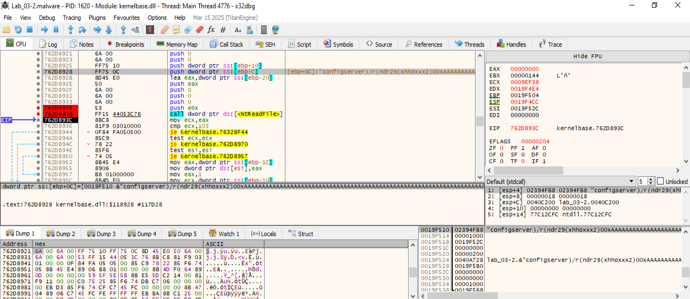

```
                             **************************************************************
                             *                          FUNCTION                          *
                             **************************************************************
                             int __cdecl FUN_004039f7(uint param_1, char * param_2, c
                               assume FS_OFFSET = 0xffdff000
             int               EAX:4          <RETURN>
             uint              Stack[0x4]:4   param_1                                 XREF[2]:     004039ff(R), 
                                                                                                   00403b96(R)  
             char *            Stack[0x8]:4   param_2                                 XREF[4]:     00403a3a(R), 
                                                                                                   00403ae8(R), 
                                                                                                   00403b82(R), 
                                                                                                   00403bc9(R)  
             char *            Stack[0xc]:4   param_3                                 XREF[12]:    00403a3d(R), 
                                                                                                   00403a56(RW), 
                                                                                                   00403a74(R), 
                                                                                                   00403aee(W), 
                                                                                                   00403afe(R), 
                                                                                                   00403b12(RW), 
                                                                                                   00403b1b(R), 
                                                                                                   00403b20(R), 
                                                                                                   00403b29(RW), 
                                                                                                   00403b33(W), 
                                                                                                   00403b3e(RW), 
                                                                                                   00403bae(R)  
             undefined1        Stack[-0x5]:1  local_5                                 XREF[4]:     00403b41(*), 
                                                                                                   00403b6f(R), 
                                                                                                   00403b87(R), 
                                                                                                   00403ba1(R)  
             undefined4        Stack[-0xc]:4  local_c                                 XREF[8]:     00403a36(RW), 
                                                                                                   00403a60(W), 
                                                                                                   00403ac4(RW), 
                                                                                                   00403aeb(R), 
                                                                                                   00403af5(W), 
                                                                                                   00403bab(R), 
                                                                                                   00403bcc(W), 
                                                                                                   00403bcf(R)  
             undefined4        Stack[-0x10]:4 local_10                                XREF[4]:     00403a6c(*), 
                                                                                                   00403ac1(R), 
                                                                                                   00403b38(*), 
                                                                                                   00403b60(R)  
                             FUN_004039f7                                    XREF[3]:     FUN_00402b74:00402c04(c), 
                                                                                          FUN_0040391e:00403966(c), 
                                                                                          FUN_00406fe5:00407240(c)  
        004039f7 55              PUSH       EBP
        004039f8 8b ec           MOV        EBP,ESP
        004039fa 83 ec 0c        SUB        ESP,0xc
        004039fd 53              PUSH       EBX
        004039fe 56              PUSH       ESI
        004039ff 8b 75 08        MOV        ESI,dword ptr [EBP + param_1]
        00403a02 57              PUSH       EDI
        00403a03 3b 35 00        CMP        ESI,dword ptr [DAT_0040c300]
                 c3 40 00
        00403a09 0f 83 c5        JNC        LAB_00403bd4
                 01 00 00
        00403a0f 8b c6           MOV        EAX,ESI
        00403a11 83 e6 1f        AND        ESI,0x1f
        00403a14 c1 f8 05        SAR        EAX,0x5
        00403a17 c1 e6 03        SHL        ESI,0x3
        00403a1a 8d 1c 85        LEA        EBX,[EAX*0x4 + DAT_0040c200]
                 00 c2 40 00
        00403a21 8b 04 85        MOV        EAX,dword ptr [EAX*0x4 + DAT_0040c200]
                 00 c2 40 00
        00403a28 03 c6           ADD        EAX,ESI
        00403a2a 8a 50 04        MOV        DL,byte ptr [EAX + 0x4]
        00403a2d f6 c2 01        TEST       DL,0x1
        00403a30 0f 84 9e        JZ         LAB_00403bd4
                 01 00 00
        00403a36 83 65 f8 00     AND        dword ptr [EBP + local_c],0x0
        00403a3a 8b 7d 0c        MOV        EDI,dword ptr [EBP + param_2]
        00403a3d 83 7d 10 00     CMP        dword ptr [EBP + param_3],0x0
        00403a41 8b cf           MOV        ECX,EDI
        00403a43 74 67           JZ         LAB_00403aac
        00403a45 f6 c2 02        TEST       DL,0x2
        00403a48 75 62           JNZ        LAB_00403aac
        00403a4a f6 c2 48        TEST       DL,0x48
        00403a4d 74 1d           JZ         LAB_00403a6c
        00403a4f 8a 40 05        MOV        AL,byte ptr [EAX + 0x5]
        00403a52 3c 0a           CMP        AL,0xa
        00403a54 74 16           JZ         LAB_00403a6c
        00403a56 ff 4d 10        DEC        dword ptr [EBP + param_3]
        00403a59 88 07           MOV        byte ptr [EDI],AL
        00403a5b 8b 03           MOV        EAX,dword ptr [EBX]=>DAT_0040c200
        00403a5d 8d 4f 01        LEA        ECX,[EDI + 0x1]
        00403a60 c7 45 f8        MOV        dword ptr [EBP + local_c],0x1
                 01 00 00 00
        00403a67 c6 44 30        MOV        byte ptr [EAX + ESI*0x1 + 0x5],0xa
                 05 0a
                             LAB_00403a6c                                    XREF[2]:     00403a4d(j), 00403a54(j)  
        00403a6c 8d 45 f4        LEA        EAX=>local_10,[EBP + -0xc]
        00403a6f 6a 00           PUSH       0x0
        00403a71 50              PUSH       EAX
        00403a72 8b 03           MOV        EAX,dword ptr [EBX]=>DAT_0040c200
        00403a74 ff 75 10        PUSH       dword ptr [EBP + param_3]
        00403a77 51              PUSH       ECX
        00403a78 ff 34 30        PUSH       dword ptr [EAX + ESI*0x1]
        00403a7b ff 15 68        CALL       dword ptr [->KERNEL32.DLL::ReadFile]             = 000099f0
                 90 40 00
        00403a81 85 c0           TEST       EAX,EAX
        00403a83 75 3a           JNZ        LAB_00403abf
        00403a85 ff 15 20        CALL       dword ptr [->KERNEL32.DLL::GetLastError]         = 000098c0
                 90 40 00
        00403a8b 6a 05           PUSH       0x5
        00403a8d 59              POP        ECX
        00403a8e 3b c1           CMP        EAX,ECX
        00403a90 75 15           JNZ        LAB_00403aa7
        00403a92 c7 05 c0        MOV        dword ptr [DAT_0040adc0],0x9
                 ad 40 00 
                 09 00 00 00
        00403a9c 89 0d c4        MOV        dword ptr [DAT_0040adc4],ECX
                 ad 40 00
        00403aa2 e9 3e 01        JMP        LAB_00403be5
                 00 00
                             LAB_00403aa7                                    XREF[1]:     00403a90(j)  
        00403aa7 83 f8 6d        CMP        EAX,0x6d
        00403aaa 75 07           JNZ        LAB_00403ab3
                             LAB_00403aac                                    XREF[2]:     00403a43(j), 00403a48(j)  
        00403aac 33 c0           XOR        EAX,EAX
        00403aae e9 35 01        JMP        LAB_00403be8
                 00 00
                             LAB_00403ab3                                    XREF[1]:     00403aaa(j)  
        00403ab3 50              PUSH       EAX
        00403ab4 e8 01 30        CALL       FUN_00406aba                                     undefined FUN_00406aba(uint para
                 00 00
        00403ab9 59              POP        ECX
        00403aba e9 26 01        JMP        LAB_00403be5
                 00 00
                             LAB_00403abf                                    XREF[1]:     00403a83(j)  
        00403abf 8b 03           MOV        EAX,dword ptr [EBX]=>DAT_0040c200
        00403ac1 8b 55 f4        MOV        EDX,dword ptr [EBP + local_10]
        00403ac4 01 55 f8        ADD        dword ptr [EBP + local_c],EDX
        00403ac7 8d 4c 30 04     LEA        ECX,[EAX + ESI*0x1 + 0x4]
        00403acb 8a 44 30 04     MOV        AL,byte ptr [EAX + ESI*0x1 + 0x4]
        00403acf a8 80           TEST       AL,0x80
        00403ad1 0f 84 f8        JZ         LAB_00403bcf
                 00 00 00
        00403ad7 85 d2           TEST       EDX,EDX
        00403ad9 74 09           JZ         LAB_00403ae4
        00403adb 80 3f 0a        CMP        byte ptr [EDI],0xa
        00403ade 75 04           JNZ        LAB_00403ae4
        00403ae0 0c 04           OR         AL,0x4
        00403ae2 eb 02           JMP        LAB_00403ae6
                             LAB_00403ae4                                    XREF[2]:     00403ad9(j), 00403ade(j)  
        00403ae4 24 fb           AND        AL,0xfb
                             LAB_00403ae6                                    XREF[1]:     00403ae2(j)  
        00403ae6 88 01           MOV        byte ptr [ECX],AL
        00403ae8 8b 45 0c        MOV        EAX,dword ptr [EBP + param_2]
        00403aeb 8b 4d f8        MOV        ECX,dword ptr [EBP + local_c]
        00403aee 89 45 10        MOV        dword ptr [EBP + param_3],EAX
        00403af1 03 c8           ADD        ECX,EAX
        00403af3 3b c1           CMP        EAX,ECX
        00403af5 89 4d f8        MOV        dword ptr [EBP + local_c],ECX
        00403af8 0f 83 cb        JNC        LAB_00403bc9
                 00 00 00
                             LAB_00403afe                                    XREF[1]:     00403bb1(j)  
        00403afe 8b 45 10        MOV        EAX,dword ptr [EBP + param_3]
        00403b01 8a 00           MOV        AL,byte ptr [EAX]
        00403b03 3c 1a           CMP        AL,0x1a
        00403b05 0f 84 ae        JZ         LAB_00403bb9
                 00 00 00
        00403b0b 3c 0d           CMP        AL,0xd
        00403b0d 74 0b           JZ         LAB_00403b1a
        00403b0f 88 07           MOV        byte ptr [EDI],AL
        00403b11 47              INC        EDI
        00403b12 ff 45 10        INC        dword ptr [EBP + param_3]
        00403b15 e9 91 00        JMP        LAB_00403bab
                 00 00
                             LAB_00403b1a                                    XREF[1]:     00403b0d(j)  
        00403b1a 49              DEC        ECX
        00403b1b 39 4d 10        CMP        dword ptr [EBP + param_3],ECX
        00403b1e 73 18           JNC        LAB_00403b38
        00403b20 8b 45 10        MOV        EAX,dword ptr [EBP + param_3]
        00403b23 40              INC        EAX
        00403b24 80 38 0a        CMP        byte ptr [EAX],0xa
        00403b27 75 06           JNZ        LAB_00403b2f
        00403b29 83 45 10 02     ADD        dword ptr [EBP + param_3],0x2
        00403b2d eb 5e           JMP        LAB_00403b8d
                             LAB_00403b2f                                    XREF[1]:     00403b27(j)  
        00403b2f c6 07 0d        MOV        byte ptr [EDI],0xd
        00403b32 47              INC        EDI
        00403b33 89 45 10        MOV        dword ptr [EBP + param_3],EAX
        00403b36 eb 73           JMP        LAB_00403bab
                             LAB_00403b38                                    XREF[1]:     00403b1e(j)  
        00403b38 8d 45 f4        LEA        EAX=>local_10,[EBP + -0xc]
        00403b3b 6a 00           PUSH       0x0
        00403b3d 50              PUSH       EAX
        00403b3e ff 45 10        INC        dword ptr [EBP + param_3]
        00403b41 8d 45 ff        LEA        EAX=>local_5,[EBP + -0x1]
        00403b44 6a 01           PUSH       0x1
        00403b46 50              PUSH       EAX
        00403b47 8b 03           MOV        EAX,dword ptr [EBX]=>DAT_0040c200
        00403b49 ff 34 30        PUSH       dword ptr [EAX + ESI*0x1]
        00403b4c ff 15 68        CALL       dword ptr [->KERNEL32.DLL::ReadFile]             = 000099f0
                 90 40 00
        00403b52 85 c0           TEST       EAX,EAX
        00403b54 75 0a           JNZ        LAB_00403b60
        00403b56 ff 15 20        CALL       dword ptr [->KERNEL32.DLL::GetLastError]         = 000098c0
                 90 40 00
        00403b5c 85 c0           TEST       EAX,EAX
        00403b5e 75 47           JNZ        LAB_00403ba7
                             LAB_00403b60                                    XREF[1]:     00403b54(j)  
        00403b60 83 7d f4 00     CMP        dword ptr [EBP + local_10],0x0
        00403b64 74 41           JZ         LAB_00403ba7
        00403b66 8b 03           MOV        EAX,dword ptr [EBX]=>DAT_0040c200
        00403b68 f6 44 30        TEST       byte ptr [EAX + ESI*0x1 + 0x4],0x48
                 04 48
        00403b6d 74 13           JZ         LAB_00403b82
        00403b6f 8a 45 ff        MOV        AL,byte ptr [EBP + local_5]
        00403b72 3c 0a           CMP        AL,0xa
        00403b74 74 17           JZ         LAB_00403b8d
        00403b76 c6 07 0d        MOV        byte ptr [EDI],0xd
        00403b79 8b 0b           MOV        ECX,dword ptr [EBX]=>DAT_0040c200
        00403b7b 47              INC        EDI
        00403b7c 88 44 31 05     MOV        byte ptr [ECX + ESI*0x1 + 0x5],AL
        00403b80 eb 29           JMP        LAB_00403bab
                             LAB_00403b82                                    XREF[1]:     00403b6d(j)  
        00403b82 3b 7d 0c        CMP        EDI,dword ptr [EBP + param_2]
        00403b85 75 0b           JNZ        LAB_00403b92
        00403b87 80 7d ff 0a     CMP        byte ptr [EBP + local_5],0xa
        00403b8b 75 05           JNZ        LAB_00403b92
                             LAB_00403b8d                                    XREF[2]:     00403b2d(j), 00403b74(j)  
        00403b8d c6 07 0a        MOV        byte ptr [EDI],0xa
        00403b90 eb 18           JMP        LAB_00403baa
                             LAB_00403b92                                    XREF[2]:     00403b85(j), 00403b8b(j)  
        00403b92 6a 01           PUSH       0x1
        00403b94 6a ff           PUSH       -0x1
        00403b96 ff 75 08        PUSH       dword ptr [EBP + param_1]
        00403b99 e8 89 04        CALL       FUN_00404027                                     DWORD FUN_00404027(uint param_1,
                 00 00
        00403b9e 83 c4 0c        ADD        ESP,0xc
        00403ba1 80 7d ff 0a     CMP        byte ptr [EBP + local_5],0xa
        00403ba5 74 04           JZ         LAB_00403bab
                             LAB_00403ba7                                    XREF[2]:     00403b5e(j), 00403b64(j)  
        00403ba7 c6 07 0d        MOV        byte ptr [EDI],0xd
                             LAB_00403baa                                    XREF[1]:     00403b90(j)  
        00403baa 47              INC        EDI
                             LAB_00403bab                                    XREF[4]:     00403b15(j), 00403b36(j), 
                                                                                          00403b80(j), 00403ba5(j)  
        00403bab 8b 4d f8        MOV        ECX,dword ptr [EBP + local_c]
        00403bae 39 4d 10        CMP        dword ptr [EBP + param_3],ECX
        00403bb1 0f 82 47        JC         LAB_00403afe
                 ff ff ff
        00403bb7 eb 10           JMP        LAB_00403bc9
                             LAB_00403bb9                                    XREF[1]:     00403b05(j)  
        00403bb9 8b 03           MOV        EAX,dword ptr [EBX]=>DAT_0040c200
        00403bbb 8d 74 30 04     LEA        ESI,[EAX + ESI*0x1 + 0x4]
        00403bbf 8a 06           MOV        AL,byte ptr [ESI]
        00403bc1 a8 40           TEST       AL,0x40
        00403bc3 75 04           JNZ        LAB_00403bc9
        00403bc5 0c 02           OR         AL,0x2
        00403bc7 88 06           MOV        byte ptr [ESI],AL
                             LAB_00403bc9                                    XREF[3]:     00403af8(j), 00403bb7(j), 
                                                                                          00403bc3(j)  
        00403bc9 2b 7d 0c        SUB        EDI,dword ptr [EBP + param_2]
        00403bcc 89 7d f8        MOV        dword ptr [EBP + local_c],EDI
                             LAB_00403bcf                                    XREF[1]:     00403ad1(j)  
        00403bcf 8b 45 f8        MOV        EAX,dword ptr [EBP + local_c]
        00403bd2 eb 14           JMP        LAB_00403be8
                             LAB_00403bd4                                    XREF[2]:     00403a09(j), 00403a30(j)  
        00403bd4 83 25 c4        AND        dword ptr [DAT_0040adc4],0x0
                 ad 40 00 00
        00403bdb c7 05 c0        MOV        dword ptr [DAT_0040adc0],0x9
                 ad 40 00 
                 09 00 00 00
                             LAB_00403be5                                    XREF[2]:     00403aa2(j), 00403aba(j)  
        00403be5 83 c8 ff        OR         EAX,0xffffffff
                             LAB_00403be8                                    XREF[2]:     00403aae(j), 00403bd2(j)  
        00403be8 5f              POP        EDI
        00403be9 5e              POP        ESI
        00403bea 5b              POP        EBX
        00403beb c9              LEAVE
        00403bec c3              RET
```


La función FUN_004039f7, que es claramente el núcleo de procesamiento del overlay. Esta función realiza lectura e interpretación de datos del overlay, probablemente en forma de línea por línea, y está directamente implicada en cómo el malware ejecuta su configuración o comportamiento basado en los datos incrustados al final del binario.


Esta función lee datos asociados a un descriptor (probablemente un archivo abierto sobre el overlay), y almacena contenido línea a línea en un búfer, realizando transformaciones específicas, como reemplazar saltos de línea y configurar flags. Parece estar procesando instrucciones desde el overlay que tienen un formato similar a una configuración o script.


🔍 Parámetros  
| Parámetro | Descripción |
| -- | -- |
| param_1 | Índice o handle que se usa como índice en DAT_0040c200 (tabla de estructuras) |
| param_2 | Búfer de salida donde se va escribiendo la línea (puntero tipo char*) |
| param_3 | Tamaño restante del búfer (int*) o contador |



- Lee bytes del overlay.
- Interpreta línea por línea, con parsing de final de línea.
- Modifica flags de control en la tabla DAT_0040c200.
- Probablemente cada línea representa una instrucción o comando de configuración.


Pon breakpoint en:

00403a78    CALL ReadFile


