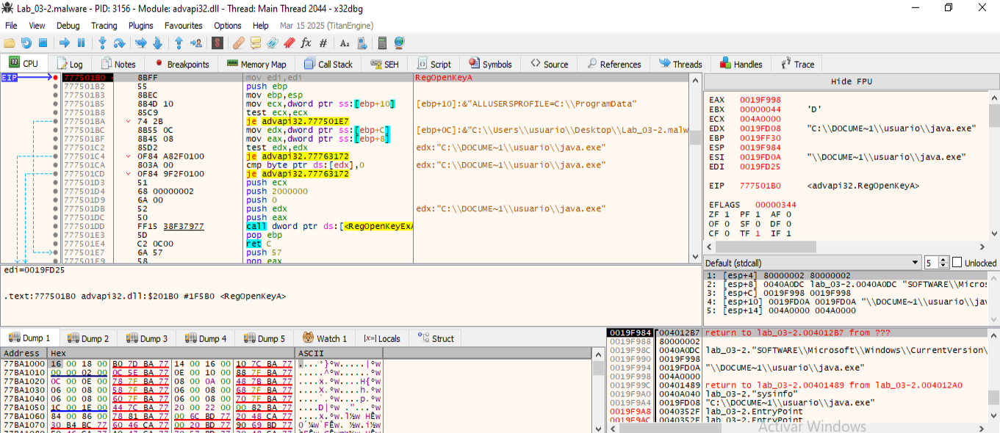

```
                             DAT_0040a0d8                                    XREF[1]:     FUN_00401020:00401057(*)  
        0040a0d8 72              ??         72h    r
        0040a0d9 00              ??         00h
        0040a0da 00              ??         00h
        0040a0db 00              ??         00h
                             s_SOFTWARE\Microsoft\Windows\Curre_0040a0dc     XREF[1]:     FUN_004012a0:004012a7(*)  
        0040a0dc 53 4f 46        ds         "SOFTWARE\\Microsoft\\Windows\\CurrentVersion\
                 54 57 41 
                 52 45 5c 
        0040a10a 00              ??         00h
        0040a10b 00              ??         00h
        0040a10c 00              ??         00h
        0040a10d 00              ??         00h
        0040a10e 00              ??         00h
        0040a10f 00              ??         00h

```


🟥 ¿Qué indica esto?

Esta clave del Registro de Windows es muy comúnmente usada por malware para establecer persistencia.

En concreto:

    La clave:

HKEY_CURRENT_USER\SOFTWARE\Microsoft\Windows\CurrentVersion\Run

o

    HKEY_LOCAL_MACHINE\SOFTWARE\Microsoft\Windows\CurrentVersion\Run

    se utiliza para que ciertos programas se ejecuten automáticamente al iniciar sesión.

🧩 Posible comportamiento del malware

Basado en esto, es altamente probable que el malware esté intentando:

    Escribirse a sí mismo en esa clave (Run)

    Con un valor tipo: java.exe apuntando a C:\Users\usuario\java.exe

    Para que se ejecute en cada inicio de Windows
    
    
¿Quien llama a DAT_0040a0d8? --> FUN_004012a0:004012a7(*) 

```
                             **************************************************************
                             *                          FUNCTION                          *
                             **************************************************************
                             undefined __cdecl FUN_00401a20(undefined4 param_1, LPCST
                               assume FS_OFFSET = 0xffdff000
             undefined         <UNASSIGNED>   <RETURN>
             undefined4        Stack[0x4]:4   param_1
             LPCSTR            Stack[0x8]:4   param_2                                 XREF[1]:     00401a20(R)  
             undefined1        Stack[-0x624   local_624                               XREF[2]:     00401a46(*), 
                                                                                                   00401a4c(*)  
                             FUN_00401a20                                    XREF[1]:     FUN_004012f0:00401729(c)  
        00401a20 8b 54 24 08     MOV        EDX,dword ptr [ESP + param_2]
        00401a24 81 ec 44        SUB        ESP,0x644
                 06 00 00
        00401a2a 33 c0           XOR        EAX,EAX
        00401a2c 53              PUSH       EBX
        00401a2d 57              PUSH       EDI
                             LAB_00401a2e                                    XREF[1]:     
......

```

Según la función que analizaste (FUN_00401020) y los datos que aparecen en la dirección 0x0040a0d8 y 0x0040a0dc -->

🧩 ¿Qué hace el valor DAT_0040a0d8?

DAT_0040a0d8 = 0x72 = ASCII 'r'

Este valor 'r' se usa como relleno en una instrucción REP STOSD, pero no se carga explícitamente en ningún registro ni se usa como parámetro de función. Parece más bien una referencia indirecta sin efecto real directo en el comportamiento del malware.
📁 ¿Qué es "SOFTWARE\\Microsoft\\Windows\\CurrentVersion\\Run"?

La dirección 0x0040a0dc contiene esta string:

"SOFTWARE\\Microsoft\\Windows\\CurrentVersion\\Run"

Esto es una clave real del registro de Windows usada comúnmente para persistencia. Es decir, para que un programa se ejecute automáticamente al iniciar Windows.
🔧 ¿Para qué sirve esta clave?

Esta clave suele tener entradas tipo:

[HKEY_CURRENT_USER\Software\Microsoft\Windows\CurrentVersion\Run]
"MyMalware"="C:\\Users\\usuario\\java.exe"

El binario java.exe —que el propio malware ha escrito en esa ruta— se ejecutará en cada arranque.
📌 ¿Cómo confirmar si el malware escribe en esta clave?

Debes analizar la función FUN_004012a0, que en la traza aparece con la instrucción:

004012a7 PUSH s_SOFTWARE\Microsoft\Windows\Curre_0040a0dc

Eso indica que usa esta clave como argumento, muy probablemente de una API como RegCreateKeyExA o RegSetValueExA.

Pistas para confirmar:

    Busca llamadas a RegCreateKeyExA, RegOpenKeyExA, RegSetValueExA.

    Revisa qué valor establece: probablemente "java.exe" o la ruta completa a C:\Users\usuario\java.exe.

    Puedes poner breakpoints en esas APIs en x32dbg (por ejemplo, bp RegSetValueExA) y ver los parámetros en la pila.

✅ Conclusión

    DAT_0040a0d8 (el 'r') no tiene un papel activo.

    La clave "SOFTWARE\\Microsoft\\Windows\\CurrentVersion\\Run" es utilizada por el malware para persistencia.

    Muy probablemente añade una entrada con el nombre java.exe apuntando a su copia.

    Puedes confirmarlo analizando FUN_004012a0 y poniéndole un breakpoint, o interceptando llamadas a RegSetValueExA.


Por los strings, sabemos que usa:
- RegCloseKey
- RegSetValueExA
- RegOpenKeyA

```
                             **************************************************************
                             * IMAGE_IMPORT_BY_NAME                                       *
                             **************************************************************
        00409a46 5b 01           dw         15Bh
        00409a48 52 65 67        ds         "RegCloseKey"
                 43 6c 6f 
                 73 65 4b 
                             **************************************************************
                             * IMAGE_IMPORT_BY_NAME                                       *
                             **************************************************************
        00409a54 86 01           dw         186h
        00409a56 52 65 67        ds         "RegSetValueExA"
                 53 65 74 
                 56 61 6c 
        00409a65 00              ??         00h
                             **************************************************************
                             * IMAGE_IMPORT_BY_NAME                                       *
                             **************************************************************
        00409a66 71 01           dw         171h
        00409a68 52 65 67        ds         "RegOpenKeyA"
                 4f 70 65 
                 6e 4b 65 
```
🧠 ¿Qué hacen estas APIs en contexto?

    RegOpenKeyA
    Abre una subclave del registro.
    👉 Aquí abre HKCU\Software\Microsoft\Windows\CurrentVersion\Run.

    RegSetValueExA
    Escribe un valor en la clave.
    👉 Aquí establece algo como: java.exe = C:\Users\usuario\java.exe.

    RegCloseKey
    Cierra el handle de la clave.
    👉 Limpia recursos tras haber escrito la clave.
    
    
    
🛑 Poner breakpoints en las APIs:

bp RegOpenKeyA
bp RegSetValueExA
bp RegCloseKey





✅ El malware está modificando el registro para persistencia
📌 Función en ejecución:

advapi32.RegOpenKeyA

📌 Argumentos observados:

En la ventana de argumentos (Default (stdcall)):
Offset	Valor
[esp+0]	80000002 → HKEY_LOCAL_MACHINE
[esp+4]	Apunta a: "SOFTWARE\Microsoft\Windows\CurrentVersion\Run"
[esp+8]	Apunta a: "C:\DOCUME~1\usuario\java.exe"
[esp+C]	Apunta a: "C:\Users\usuario\Desktop\Lab_03-2.malware"
🧠 ¿Qué significa esto?

Este malware está usando RegOpenKeyA con la clave:

HKEY_LOCAL_MACHINE\SOFTWARE\Microsoft\Windows\CurrentVersion\Run

Después usará RegSetValueExA para escribir un valor ahí. Este valor suele tener esta forma:

"java"="C:\DOCUME~1\usuario\java.exe"

🎯 ¿Para qué sirve eso?

Esa clave de registro es un mecanismo de persistencia clásico en Windows. Todo lo que esté ahí se ejecutará automáticamente al iniciar sesión el usuario.
🧪 ¿Cómo puedes comprobarlo en análisis dinámico?

    En la misma ejecución, pon breakpoint en RegSetValueExA.

    Mira los parámetros (dd esp L6) y asegúrate de que:

        [ESP+4] contiene "java" (nombre del valor)

        [ESP+C] contiene "REG_SZ"

        [ESP+10] contiene la ruta al binario malicioso

    Alternativamente, usa RegShot o Procmon para ver cambios en el registro durante la ejecución.

