# Lab 9.1 de RPISEC

# Indicators
```
file > name,c:\users\usuario\desktop\lab_09\lab_9.1\lab_09-1.malware
file > signature,Microsoft Linker 5.12 | UPX 2.00-3.0X -> Markus Oberhumer, Laszlo Molnar, John Reiser | Visual Studio 5.0
file > sha256,974105CF0E26C7317ECFE670BE47FE44A2A51B85A41FC68B2EEBE100ECF1323E
file > info,size: 3328 bytes, entropy: 4.894
file > type,executable, 32-bit, console
virustotal > score,No se pudo resolver el nombre de servidor o su dirección
stamp > compiler,Thu Sep 22 05:52:46 2005
resource,n/a
section > virtualized,name: UPX0
entry-point > location,0x00006200 (section: UPX2)
section > writable,name: UPX0
sections > self-modifying,name: UPX0 | UPX1 | UPX2
certificate,n/a
imports > flag,VirtualAlloc | VirtualProtect
imphash > md5,FE5CB79F084021CC80E080B612158174
exports,n/a
overlay,n/a
```


# Footprints
``` 
file > sha256,974105CF0E26C7317ECFE670BE47FE44A2A51B85A41FC68B2EEBE100ECF1323E
dos-stub > sha256,1FFEC0FE5F63C6BFF5812E7C85FBFF03DF4D3C2897D38926764BA4CD388C2919
dos-header > sha256,C32B952EFB805A8046AED4ED6115CBE5466CF432AD70027BE9245C8F980FD5FB
rich-header > sha256,802663A18564D02EDFD5DCDF8CA6C01DB285AF4D5CF15249FDADCB576C90D6B8
section > UPX1 > sha256,44E28CC25021712036720ECD499635C6073B0885381214BCA8F563A957528C97
section > UPX2 > sha256,A8CFD0A592856D80AFE6F206340F51FB957B0674B28A2DAE0EDC28A169E5D84E
,
special,
imphash > md5,FE5CB79F084021CC80E080B612158174
```


# Sections
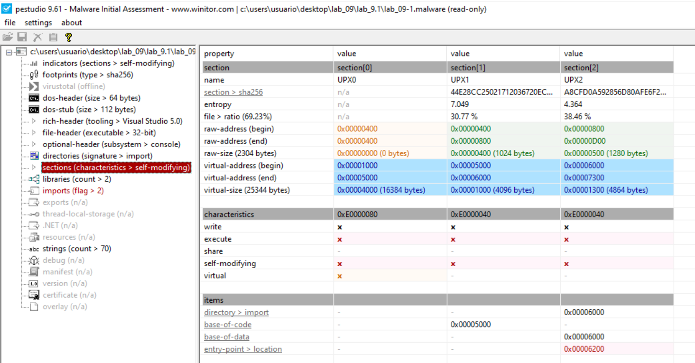

El binario de `lab_09_1.malware` está empaquetado con UPX. Las secciones están marcadas como potencialmente auto‑modificables, algo muy típico en malware y en ejecutables ofuscados para labs.

Tres secciones: UPX0, UPX1 y UPX2, que son las secciones estándar que crea el packer UPX cuando comprime un ejecutable PE de 32 bits.


## Anomalías en las Secciones

Hay varios "red flags" técnicos que pestudio ha resaltado en rojo o naranja:
- `Virtual Size vs. Raw Size`: Nota que la sección UPX0 tiene un raw-size de 0 bytes pero un virtual-size de 16,384 bytes. Esto es típico de los packers: reservan espacio en memoria (virtual) donde volcarán el código una vez descomprimido, pero ese código no existe físicamente en el archivo en disco.

- Entropía: La sección UPX1 tiene una entropía de 7.049. Una entropía cercana a 8 indica que los datos están comprimidos o cifrados, lo que confirma el empaquetado.

- Permisos (W+E): La sección UPX0 tiene marcados los bits de Write (Escritura) y Execute (Ejecución). En programas legítimos, esto es muy raro (por seguridad), pero es necesario para que el stub de UPX escriba el código descompandido en esa sección y luego lo ejecute.
  - En la columna de “characteristics” PEstudio marca las secciones como self‑modifying porque tienen simultáneamente permisos de escritura y ejecución, lo cual permite que el código en esa región se modifique a sí mismo en tiempo de ejecución.
  - Este patrón es típico de packers y malware: el stub de UPX escribe el código descomprimido en memoria y luego transfiere la ejecución allí; desde el punto de vista de análisis estático, eso hace que el binario parezca sospechoso aunque en el contexto del laboratorio se use como ejercicio controlado.


## Indicadores de Malware
- Self-modifying (Auto-modificación): Pestudio marca la sección como "self-modifying". Esto se debe a que el programa cambia su propio código en memoria durante el proceso de descompresión.
- Entry Point: El punto de entrada está en 0x00006200 dentro de la sección UPX1. Este no es el main() real del programa, sino el inicio del código de descompresión (el unpacking stub).


# Imports
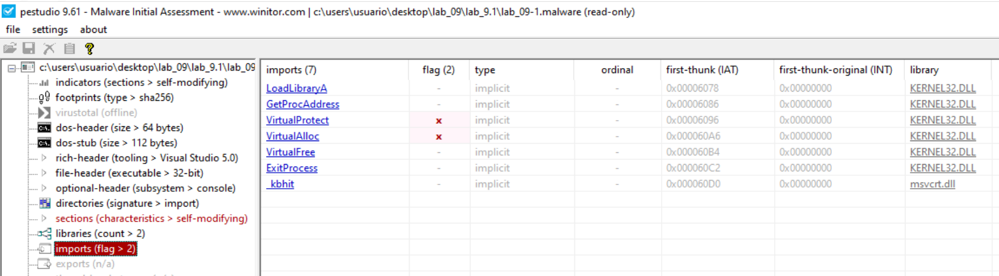


# Desempaquetar con upx

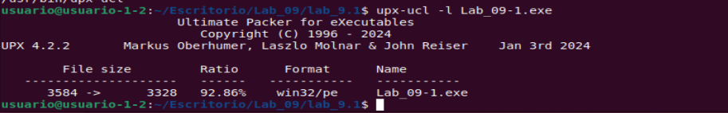
Se confirma que el binario está empaquetado con UPX 4.2.2 (formato win32/pe, ratio ~93%).

Intentamos descomprimirlo con upx:
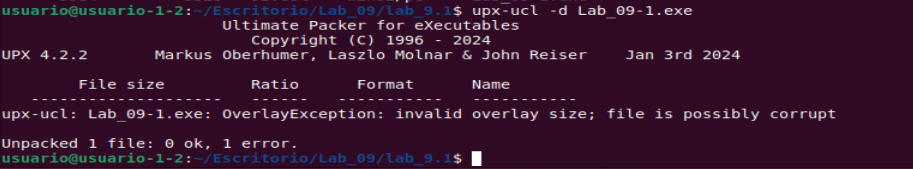
donde:
- OverlayException: invalid overlay size; file is possibly corrupt indica que la parte final del fichero (overlay) no cumple lo que UPX espera para un ejecutable empaquetado “limpio”.
- Aun así, el propio mensaje dice Unpacked 1 file: 0 ok, 1 error, es decir, ha intentado desempaquetarlo pero detecta incoherencias y no garantiza que el resultado sea fiable al 100%.

No ha conseguido descomprimir la muestra. Tendremos que descomprimirla con x32dbg

------------------------------------------------------------

# Una primera Ejecucion del malware

AL ejecutar con x32dbg se produce una excepcion: XXX
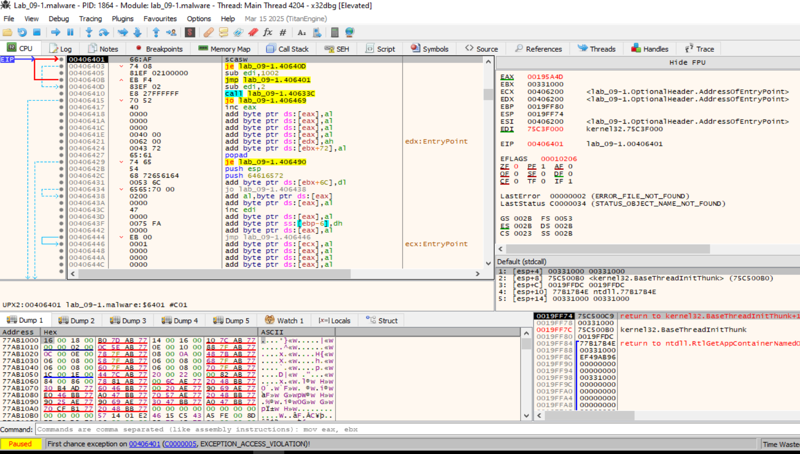

Esta función (FUN_004063f4) que has identificado es un componente clásico de shellcode o de malware empaquetado personalizado. Su objetivo es localizar la dirección base de kernel32.dll en la memoria de forma dinámica, en lugar de confiar en la tabla de importaciones (IAT), que en este punto del lab está vacía o empaquetada.


1. El algoritmo de búsqueda

El código utiliza un método de "búsqueda hacia atrás" (backward searching) para encontrar el encabezado del ejecutable de Windows en la memoria:
-  MOV EDI, dword ptr ss:[esp]: Toma el valor que está en el tope de la pila. En tu captura image_74da23.png, vemos que en [ESP] hay una dirección de retorno (77E2EF8C) que apunta dentro de kernel32.dll.
- AND EDI, FFFF0000: Redondea la dirección hacia abajo. Las DLLs en Windows se cargan en límites de memoria de 64KB. Esto alinea el puntero para empezar la búsqueda.
- MOV AX, 5A4D: Carga en AX los bytes 4D 5A (que en ASCII es "MZ"), la firma obligatoria de cualquier archivo ejecutable de Windows (cabecera DOS).
- SCASW: Compara el valor en AX ("MZ") con lo que hay en la memoria apuntada por EDI.
- JZ lab_09-1.40640D: Si encuentra el "MZ", ha encontrado el inicio de la DLL y salta para continuar.
- SUB EDI, 1002: Si no lo encuentra, resta una página de memoria (0x1000) y reintenta.

2. Por qué ocurre la Excepción (ACCESS_VIOLATION)

En tu captura Captura desde 2026-02-06 11-11-07.jpg, el programa se detiene con un error de acceso porque EDI ha llegado a una zona de memoria protegida o no asignada.

Esta excepcion ocurre porque Valor de ESP no esapto: Si el valor en la pila al entrar a la función no proviene de una llamada desde kernel32.dll, el bucle SCASW seguirá restando a EDI indefinidamente hasta chocar con el inicio del espacio de direcciones del usuario (direcciones muy bajas), provocando el crash.


**¿Cómo Avanzar?:** Salta el bucle manualmente:
- Sabemos dónde está kernel32.dll, podemos verlo en la pestaña "Symbols". Podemos cambiar el valor de EDI manualmente en x32dbg a esa dirección base y poner el EIP directamente en el CALL lab_09-1.40633C (00406410).
- En la pestaña de simbolos indica que kernel32 esta en 77DE0000.

**Lógica del fallo en la excepcion:**
El malware asume que si resta bloques de memoria desde una dirección de retorno de la pila, eventualmente golpeará el inicio (MZ) de kernel32.dll.
- El kernel32 está en 77DE0000.
- El puntero inicial es 77E2EF8C.
- Al hacer el AND EDI, FFFF0000, el valor de EDI pasa a ser 77E20000.

El bucle restará 0x1000 cada vez: 77E1F000, 77E1E000... así hasta llegar a 77DE0000. Si en ese camino toca una página de memoria que no le pertenece al proceso o no está mapeada, pum: ACCESS_VIOLATION.


**Cómo parchearlo en vivo con x32dbg:**
- Reinicia el lab (Ctrl + F2).
- Pon un breakpoint en el inicio de la función: 004063F4 y dale a F9.
- Presiona F8 (Step Over) un par de veces hasta que la instrucción AND EDI, FFFF0000 se haya ejecutado.
- Modificación Manual: En la ventana de Registros (derecha), haz doble clic sobre el valor de EDI y cámbialo manualmente por 77DE0000.
- Saltar el Bucle: Haz clic derecho sobre la línea del CALL lab_09-1.40633C (en 00406410) y selecciona "Set New Origin Here" (o presiona Ctrl + N sobre esa línea). Esto moverá el EIP directamente a la llamada, ignorando el bucle que causa el crash.
- Presiona F7 para entrar en esa función.
- Una vez que entremoss en 40633C con EDI = 77DE0000, verás que el malware empieza a leer la estructura del archivo PE de kernel32.dll.


**Breakpoints en VirtualAlloc y VirtualProtect:** Una vez superada la excepción ya podemos poner los BPs:
- VirtualAlloc: Reserva un bloque de memoria nuevo (donde el malware volcará el código real descompandido).
- VirtualProtect: Cambia los permisos de una sección (por ejemplo, para que una zona de datos se vuelva ejecutable).

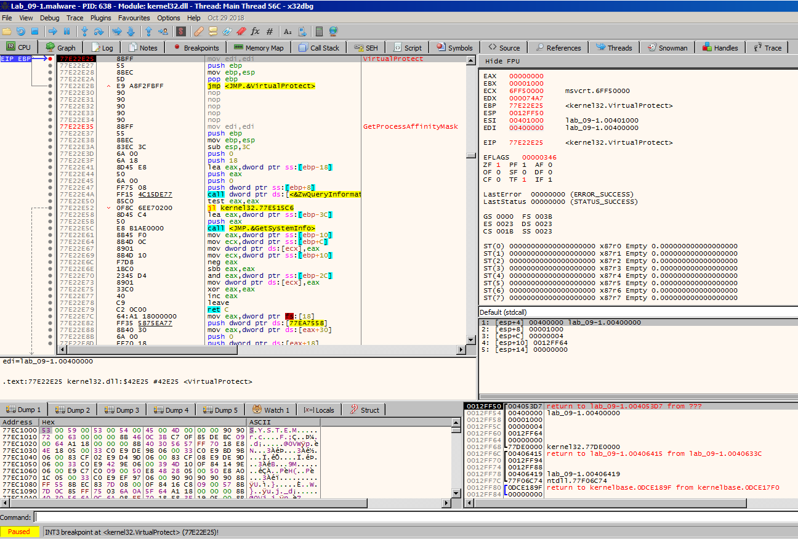

Estamos detenido en el breakpoint de VirtualProtect dentro de kernel32.dll. Significa que el malware está intentando cambiar los permisos de una sección de memoria para hacerla ejecutable (probablemente para saltar al código real que acaba de desempaquetar).


# Desempaquetar con x32dbg
Estamos detenido en el breakpoint de VirtualProtect 77E22E25.

1. Analizamos los parámetros en la Pila para el los parámetros de VirtualProtect:
- Address (lpAddress): 00400000 (Es la base de tu binario lab_09-1).
- Size (dwSize): 00001000 (4096 bytes, o una página de memoria).
- NewProtect: 00000040. El valor 0x40 es la constante para PAGE_EXECUTE_READWRITE.

Traducción: El malware está pidiendo permiso para que la base de su propio archivo sea ejecutable y escribible al mismo tiempo. Típico de un malware desempaquetándose sobre sí mismo.


2. Ejecuta hasta el retorno de la API: No nos interesa el código interno de Windows, solo queremos ver qué pasa después de que el permiso se otorgue.
- Presiona Ctrl + F9 (Execute until return). El debugger se detendrá en el RET 10 de la función.
- Presiona F8 (Step Over) una vez para salir de la DLL y volver al código del malware.

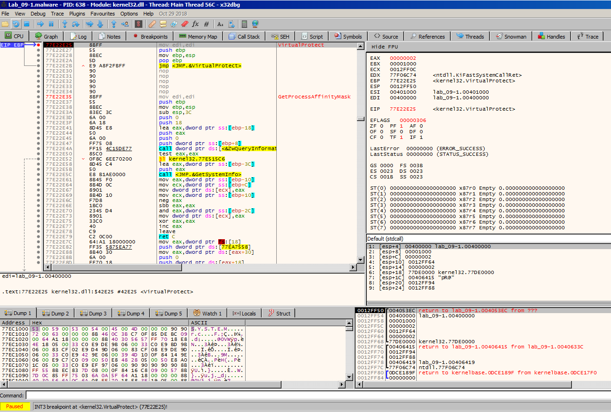
el malware llama a VirtualProtect varias veces. Los empaquetadores (packers) suelen procesar el archivo sección por sección: primero cambian los permisos de .text, luego de .data, y así sucesivamente.
- lpAddress: 00400000
- dwSize: 00001000
- NewProtect: 00000002 (Esto es PAGE_READONLY).

Traducción: El malware está "limpiando" los permisos después de haber escrito algo. Para salir de este bucle de APIs y llegar a la ejecución del malware real, sigue estos pasos:
- Salimos del bucle de Proteccion: Quitamos el BP VirtualProtect.
- Presionamos Alt+F9 (Execute till user code) --> Esto hará que el programa corra a máxima velocidad a través de las DLLs de Windows y se detenga justo cuando el control regrese al código de lab_09-1.malware --> LLega al punto 004053EC, que es el tramo final del unpacking stub.:
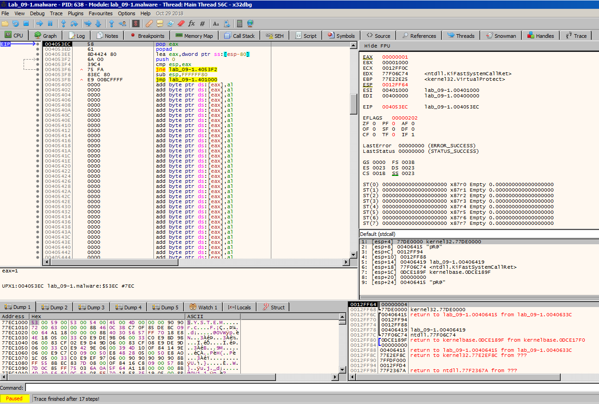


Una vez que estamos de vuelta en el código del usuario (sección UPX1 o similar), exactamente en el punto 004053EC, buscamos una instrucción que rompa la estructura del bucle actual. Suele estar cerca de un POPAD.
- Buscamos un JMP o CALL a una dirección que esté lejos de donde estás ahora (normalmente hacia una dirección menor, como 00401XXX).
- Si ves algo como PUSH 0040XXXX seguido de un RET, eso también es un salto camuflado al OEP.


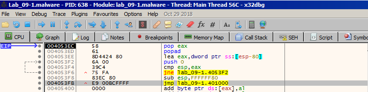
- en la instrucción en 004053FB: En los binarios empaquetados con UPX, esta es la instrucción más importante del cargador. Se llama Tail Jump. Después de descomprimir todo el código en la memoria (lo que acabas de ver con los VirtualProtect), el programa necesita saltar desde la sección de desempaquetado (UPX1) hacia el inicio del código original del malware.
- El destino de ese salto, 0x00401000, es muy probablemente tu OEP (Original Entry Point).
- Ponemos un BP en 004053FB.
- Estando parado en el JMP, presionamos F7 (Step Into).


Ahora entramos en 00401000.
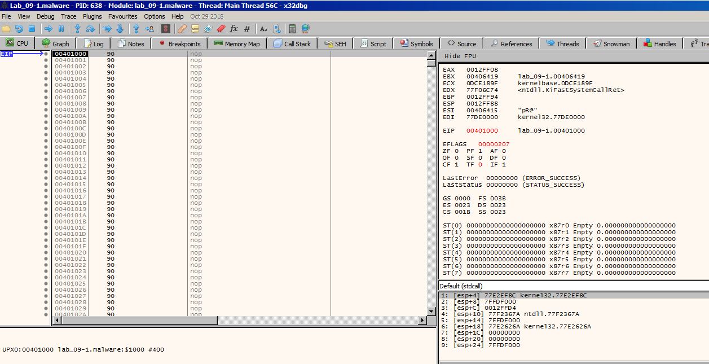
el registro EIP apunta a 00401000. Si comparamos esto con tu primera captura de pestudio, verás que 0x00401000 es el inicio de la sección virtual UPX0.
- Antes: Esta sección tenía un tamaño físico en disco de 0 bytes.
- Ahora: Gracias a la ejecución del packer, la memoria ha sido llenada con el código real del malware.


El salto que diste desde 004053FB (JMP 00401000) es el famoso Tail Jump de UPX. Has cruzado el puente desde el descompresor al código malicioso.


Baja con el scroll en x32dbg desde 00401000 hasta que veas las primeras instrucciones que no sean 90 (NOP). Normalmente verás algo como:


nteracción con el usuario: En 004013F5 se carga el string "Press any key to continue ..." y se llama a una función para imprimirlo.

Finalización: En 00401410 hay una llamada directa a ExitProcess, lo que indica que el programa está diseñado para terminar después de mostrar el mensaje.

Strings reveladores: En el desensamblado se ven cadenas como "Hello world" (en 0040141A) y carácteres de nueva línea \r\n.


Si observamos la parte inferior del código (a partir de 00401430), vemos la implementación de una función que utiliza APIs estándar de Windows:
- GetStdHandle: Se llama para obtener el manejador de la salida estándar (pantalla).
- WriteFile: Se utiliza para escribir los strings (Hello world, etc.) en la consola.


# Dump & Fix
- En el punto xxx
- Abre Scylla: Ve al menú de Plugins y lanza Scylla.
- Verifica el OEP: Asegúrate de que en el cuadro de texto ponga 00001000 (Scylla suele usar direcciones relativas, así que 00401000 - 00400000 = 1000).
- IAT Autosearch: Haz clic. Esto buscará las funciones de Windows que el malware necesita para funcionar.
- Get Imports: Haz clic. Deberías ver una lista de funciones en el cuadro de abajo. Si todas tienen un icono verde, ¡estás listo!
- Dump: Guarda el archivo (ej. lab_09-1_unpacked.exe).
- Fix Dump: Selecciona el archivo que acabas de guardar. Esto creará un segundo archivo (ej. lab_09-1_unpacked_SCY.exe) que es el que realmente funcionará fuera del debugger.

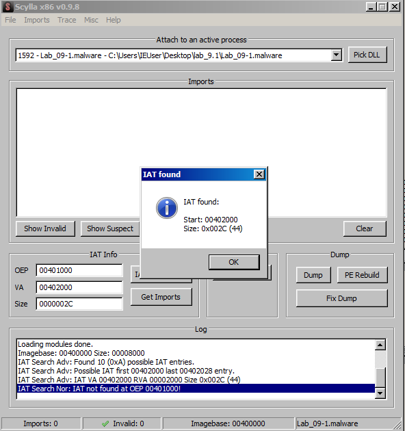


¡Casi lo tienes! El error que ves en Scylla (IAT not found at OEP 00401000!) es el obstáculo final clásico. Scylla está intentando buscar la Tabla de Direcciones de Importación (IAT) justo donde empieza el código, pero la IAT suele estar en una dirección diferente.

Sigue estos pasos para solucionar el error y obtener tu binario limpio:
1. Corregir la búsqueda en Scylla

En tu captura image_75cda5.png, Scylla ya te está dando pistas en el Log:

    El log dice: IAT VA 00402000 RVA 00002000 Size 0x002C.

    Solución:

        Asegúrate de que el OEP sigue siendo 00401000.

        En el campo VA (Virtual Address), escribe manualmente 00402000.

        En el campo Size, escribe 0000002C.

        Haz clic en Get Imports.

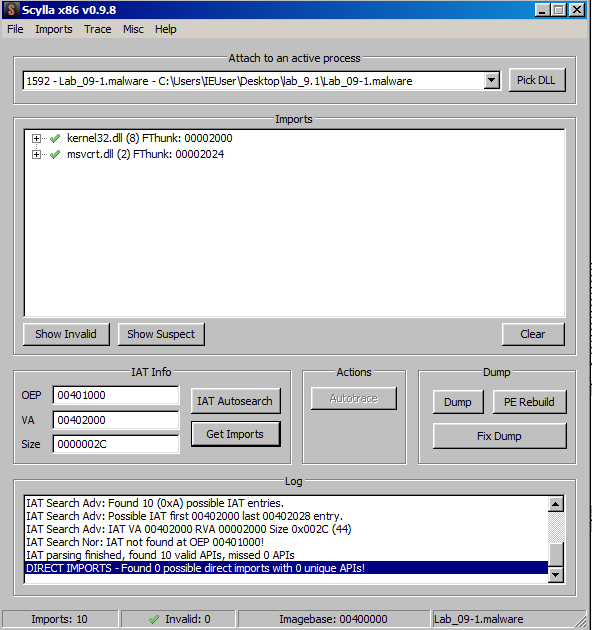


2. Generar el binario final

Una vez que las importaciones aparezcan correctamente en Scylla:

    Haz clic en Dump y guarda el archivo (ej. lab_09-1_unpacked.exe).

    Haz clic en Fix Dump y selecciona el archivo que acabas de guardar en el paso anterior.

    Esto creará un archivo llamado lab_09-1_unpacked_SCY.exe. Este es tu trofeo.


FIN:
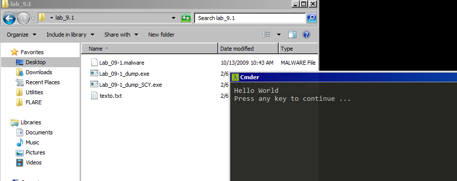

---------------------------------------------------


Is there a name for the packer used to protect this sample?

El nombre del packer es UPX (Ultimate Packer for eXecutables).
- Lo identificamos inicialmente en pestudio por los nombres de las secciones (UPX0, UPX1, UPX2).
- También lo confirmamos en x32dbg al ver el unpacking stub que utilizaba instrucciones como PUSHAD y el salto final (Tail Jump).

1. What is OEP?

El OEP (Original Entry Point) es 0x00401000.
- En este caso específico, como indica tu solución, el OEP comienza con un NOP slide (una serie de instrucciones 0x90 o "no operación") que precede al código ejecutable real del malware.


3. What method did you use to find OEP?

Aunque la solución menciona la opción automática de OllyDump, tú lo has hecho de forma manual y más precisa en x32dbg mediante el análisis del salto de sección (Section Hop):
- Rastreo del Tail Jump: Localizaste la instrucción JMP lab_09-1.401000 en la dirección 004053FB.
- Lógica del salto: Este salto es el que cruza desde la sección del descompresor (UPX1) hacia la sección donde se ha volcado el código original (UPX0), aterrizando directamente en el inicio de la memoria descompresa.


Resumen de Direcciones Clave en tu captura:
| Concepto | Dirección |
| -- | -- |
| Entry Point (Empaquetado) | 0x00406200 (Sección UPX1) |
| Tail Jump (El gran salto) | 0x004053FB |
| OEP (Código Original) | 0x00401000 (Sección UPX0) |