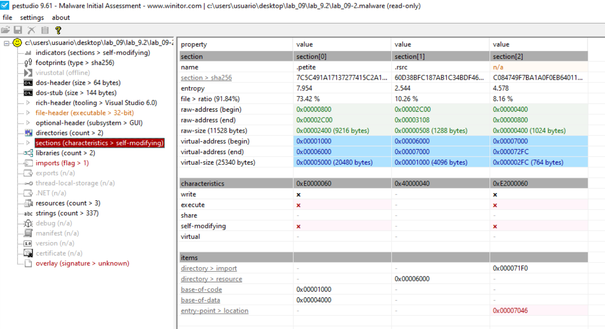
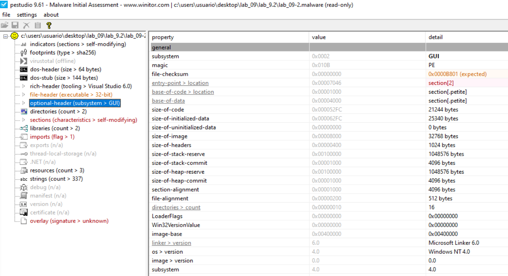
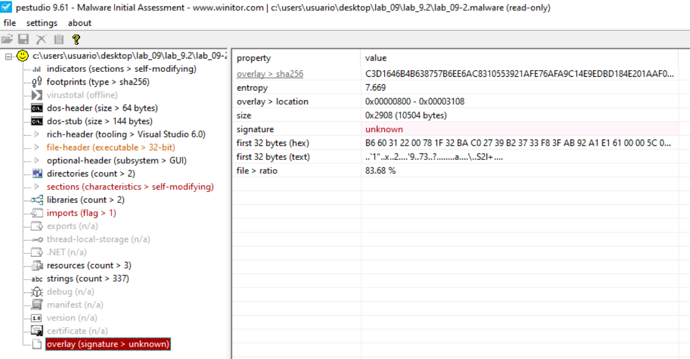
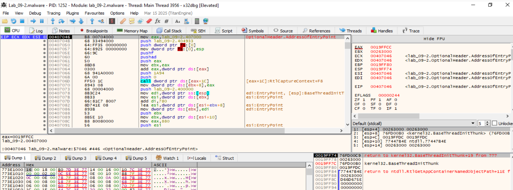
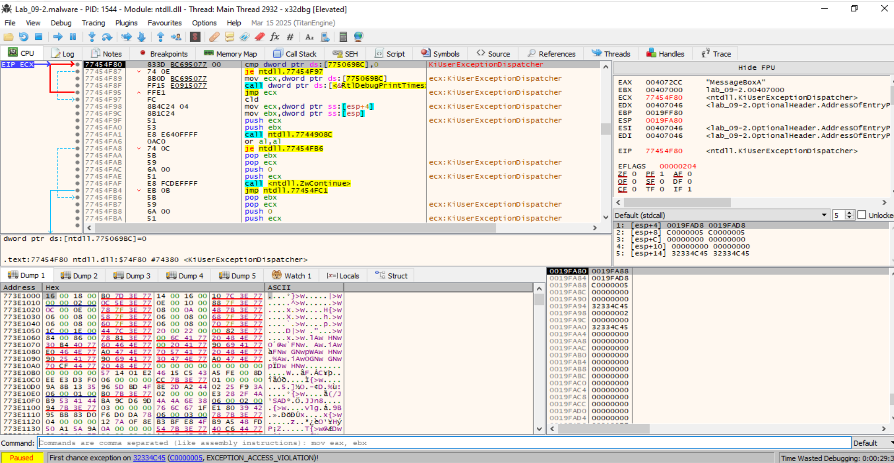
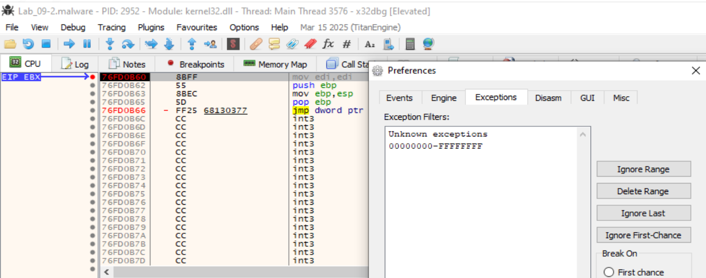
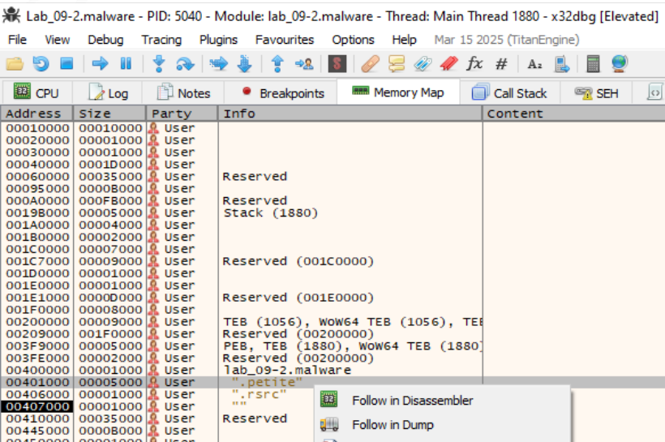
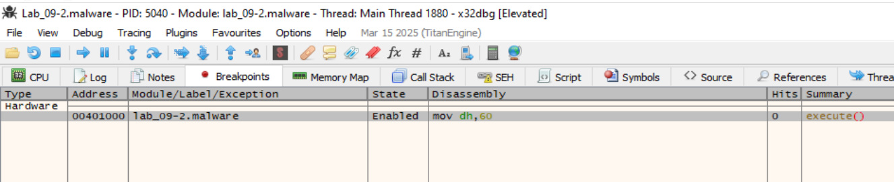
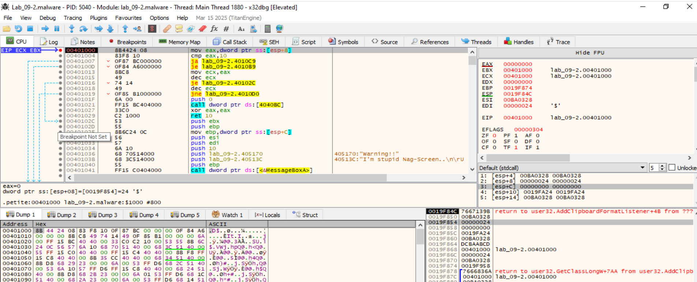

# Lab 9.2 RPISEC


# Indicators
```
file > name,c:\users\usuario\desktop\lab_09\lab_9.2\lab_09-2.malware
file > signature,Microsoft Linker 6.0 | Petite 1 - 2 | Visual Studio 6.0
file > sha256,FB331CE3A04032D2059413E54474BAADB84B5B3CF544F479B5D9FB2670A9D0FC
file > info,size: 12552 bytes, entropy: 7.224
file > type,executable, 32-bit, GUI
virustotal > score,No se pudo resolver el nombre de servidor o su dirección
stamp > compiler,Mon Jun 23 05:09:27 2003
languages > names,English-Canada
resources > info,count: 3, size: 1074 bytes, file-ratio: 8.56%
file > version,n/a
entry-point > location,0x00007046 (section: )
section > writable,name: .petite
sections > self-modifying,name: .petite | 
sections > flag,name: 
certificate,n/a
imports > flag,VirtualProtect
imphash > md5,D5E1BCC96A4DE3630A1D9D4AB92A1BFC
exports,n/a
overlay > info,signature: unknown, offset: 0x00000800, size: 10504 bytes, entropy: 7.669
overlay > first 10504 bytes (hex),B6 60 31 22 00 78 1F 32 BA C0 27 39 B2 37 33 F8 3F AB 92 A1 E1 61 00 00 5C 06 53 32 6C 2B A6 CF 
overlay > first 10504 bytes (text),..`1"..x..2....'9..73..?........a....\..S2l+....
overlay > entropy,7.669
``` 


# Footprinting
```
file > sha256,FB331CE3A04032D2059413E54474BAADB84B5B3CF544F479B5D9FB2670A9D0FC
dos-stub > sha256,5F7096AAB0EF1D35EE700E612DEE0A8C8C826723533F9FDF62EA7C92DEF48D54
dos-header > sha256,FB0863646ED387AF2CB553EBB9F5AB44608B01D407CC9D94C5B2532EB9F97BFE
rich-header > sha256,B605DF813D33B62289C5612B62F48C20D87DACA152A5048A94A59E905AE06D7B
section > .petite > sha256,7C5C491A17137277415C2A1473B15900239F9A3E23BA86ABC09295F6AB0B4F02
section > .rsrc > sha256,60D38BFC187AB1C34BDF46AA1D4C2182804F4F2269890AD21616D3CA4A427860
section > n/a > sha256,C084749F7BA1A0F0EB64011AB07563EB5B1EC2855E1F1585FC21070D7E149A3F
overlay > sha256,C3D1646B4B638757B6EE6AC8310553921AFE76AFA9C14E9EDBD184E201AAF0F9
,
special,
imphash > md5,D5E1BCC96A4DE3630A1D9D4AB92A1BFC
```


# Sections



Entropía Elevada (Sección .petite): La sección 0 tiene una entropía de 7.954. Dado que el máximo teórico es 8.0, esto indica casi con total certeza que los datos están comprimidos o cifrados. Un código normal suele rondar los 5.0 - 6.0.

Secciones Auto-modificables (Self-modifying): PeStudio marca las secciones en rojo porque tienen permisos simultáneos de Lectura, Escritura y Ejecución (RWX). Esto es necesario para que el unpacking stub escriba el código desempaquetado en la memoria y luego lo ejecute.

Punto de Entrada Sospechoso: El Entry Point está en 0x00007046, que se encuentra dentro de la última sección (Section[2]). Esto es típico: el programa empieza a ejecutarse al final del archivo para descomprimir los datos hacia las secciones superiores.


| section | section[0] | section[1] | section[2] |
|---|---|---|---|
| name | .petite | .rsrc | n/a |
| section > sha256 | 7C5C....  | 60D3... | C084.... |
| entropy | 7.954 | 2.544 | 4.578 |
| file > ratio (91.84%) | 73.42 % | 10.26 % | 8.16 % |
| raw-address (begin) | 0x00000800 | 0x00002C00 | 0x00000400 |
| raw-address (end) | 0x00002C00 | 0x00003108 | 0x00000800 |
| raw-size (11528 bytes) | 0x00002400 (9216 bytes) | 0x00000508 (1288 bytes) | 0x00000400 (1024 bytes) |
| virtual-address (begin) | 0x00001000 | 0x00006000 | 0x00007000 |
| virtual-address (end) | 0x00006000 | 0x00007000 | 0x000072FC |
| virtual-size (25340 bytes) | 0x00005000 (20480 bytes) | 0x00001000 (4096 bytes) | 0x000002FC (764 bytes) |
| characteristics | 0xE0000060 | 0x40000040 | 0xE2000060 |
| write | x | - | x |
| execute | x | - | x |
| share | - | - | - |
| self-modifying | x | - | x |
| virtual | - | - | - |
| items |  |  |  |
| directory > import | - | - | 0x000071F0 |
| directory > resource | - | 0x00006000 | - |
| base-of-code | 0x00001000 | - | - |
| base-of-data | 0x00004000 | - | - |
| entry-point > location | - | - | 0x00007046 |


# Optional Header


El encabezado opcional nos da los valores necesarios para configurar nuestro depurador:
- Image Base (0x00400000): Es la dirección base donde el malware espera ser cargado en memoria.
- Address of Entry Point (0x00007046): Sumado a la base, el programa comenzará a ejecutarse en 0x00407046. Al abrir x32dbg, aterrizamos exactamente ahí.
- Size of Image (0x00008000 / 32,768 bytes): Indica cuánto espacio total ocupará el malware en la RAM una vez desplegado.
- Subsystem: Identificado como GUI (0x0002), lo que significa que el malware podría intentar abrir ventanas o simplemente que no usa una consola de comandos.


# Rich Headers
```
Utc12_CPP,Visual Studio 6.0 - 6.0
Masm613,Visual Studio 6.0 MASM - 6.13 SP1
Linker512,Visual Studio 5.0 - 5.12
Import,Visual Studio - 
Utc12_C,Visual Studio 6.0 - 6.0
Cvtres500,Visual Studio 5.0 CvtRes.exe - 5.0
,
property,value
rich-header > location,0x00000080 - 0x000000D0
size,0x00000050 (80 bytes)
checksum-builtin,0x9B0E79B0
checksum-real,0x9B0E79B0
rich-header > sha256,B605DF813D33B62289C5612B62F48C20D87DACA152A5048A94A59E905AE06D7B
``` 

El Rich Header es una estructura de datos no documentada de Microsoft que se encuentra en los encabezados de los ejecutables (PE). Actúa como una "firma de compilación" que revela las herramientas exactas utilizadas para crear el binario antes de que fuera empaquetado.

Rich Header nos dice que este malware fue compilado utilizando herramientas de finales de los 90, específicamente del ecosistema de Visual Studio 6.0 y Visual Studio 5.0:
- Utc12_CPP / Utc12_C: Indica que se usó el compilador de C/C++ de Visual Studio 6.0.
- Masm613: Revela el uso de Microsoft Macro Assembler (MASM) versión 6.13 SP1, lo cual es común en malware para insertar fragmentos de ensamblador optimizados.
- Linker512: El enlazador (Linker) detectado es la versión 5.12, perteneciente a Visual Studio 5.0.
- Cvtres500: La herramienta utilizada para convertir archivos de recursos (.res a objetos COFF) es la versión 5.0.


**¿Qué significa esto para tu desempaquetado?** Al saber que el código original es C/C++ de Visual Studio 6.0, cuando logremos llegar al OEP (Original Entry Point), deberiamosesperar ver el prólogo estándar de una función de C:
```
PUSH EBP
MOV EBP, ESP
SUB ESP, X
```
Si al saltar al OEP no vemos este patrón, es posible que todavía estemos dentro de una capa intermedia del packer Petite.


# Overlays

```
overlay > sha256,C3D1646B4B638757B6EE6AC8310553921AFE76AFA9C14E9EDBD184E201AAF0F9
entropy,7.669
overlay > location,0x00000800 - 0x00003108
size,0x2908 (10504 bytes)
signature,unknown
first 32 bytes (hex),B6 60 31 22 00 78 1F 32 BA ..... 
first 32 bytes (text),..`1"..x..2....'9..73..?........a....\..S2l+....
file > ratio,83.68 %
```

Un "overlay" son datos añadidos al final del archivo PE que no pertenecen a ninguna sección oficial.

 - Entropía (7.669): Casi el 84% del archivo total es este overlay. Esta alta entropía confirma que aquí reside la mayor parte del "payload" malicioso comprimido o cifrado.

- Firma Desconocida: Al no tener una firma reconocida, indica que el packer (Petite) utiliza un método propio para almacenar y extraer estos datos durante la ejecución.


Secciones y Permisos (Self-Modifying): La captura de pantalla muestra señales de alerta roja que son fundamentales para el laboratorio:
- Secciones Auto-modificables: Tanto la sección .petite como la section[2] tienen permisos de Escritura (W) y Ejecución (X) simultáneos. Esto es la base del malware unpacking: el programa escribe código en una sección y luego salta a ella para ejecutarlo.

- Anomalía de Tamaño: La sección .petite tiene un tamaño virtual de 25,340 bytes pero solo ocupa 9,216 bytes en el disco. Esa "burbuja" de memoria vacía es donde el malware se expandirá.


# Analisis de empaquetamiento
```
└─$ upx -d Lab_09-2.malware
                       Ultimate Packer for eXecutables
                          Copyright (C) 1996 - 2024
UPX 4.2.4       Markus Oberhumer, Laszlo Molnar & John Reiser    May 9th 2024

        File size         Ratio      Format      Name
   --------------------   ------   -----------   -----------
upx: Lab_09-2.malware: NotPackedException: not packed by UPX

Unpacked 0 files.
```

Aunque el archivo está empaquetado, no utiliza el algoritmo de UPX. Ya vimos que el empaquetador identificado es Petite (2.2).


# Analizamos con DIE:  


**Identificación del Packer (DIE):** Detect It Easy confirma lo que sospechábamos por las secciones:
- Packer: Petite(2.2).
- Heurística: Indica "Strange sections" y "Compressed or packed data", señalando específicamente que el Punto de Entrada (EP) está en la última sección.
- Compilador Original: El código que está escondido dentro fue escrito en Microsoft Visual C/C++ (12.00.8168), lo cual es típico de binarios de finales de los 90 o principios de los 2000.


**Mapa de Memoria para el Desempaquetado (Optional Header):** Estos son tus puntos de referencia:
- Image Base: 0x00400000.
- Address of Entry Point: 0x00007046.
- Dirección Real de Inicio: 0x00407046. Aquí es donde el stub de Petite comenzará a descomprimir el malware.


**Análisis de Secciones y Entropía (PeStudio):** Las secciones nos dicen exactamente dónde se va a esconder el código real:
- Sección .petite (Section[0]): Tiene una entropía de 7.954, lo que significa que es puro ruido comprimido. Su virtual-size (25,340 bytes) es mucho mayor que su tamaño en disco, lo que indica que se expandirá significativamente en memoria durante la ejecución.

- Permisos RWX: Las secciones tienen permisos de Escritura (W) y Ejecución (X). El malware escribirá el código limpio en la sección .petite y luego saltará a ella para ejecutarse.

- Overlay: El archivo tiene un 83.68% de su peso total en un "overlay" al final del archivo con alta entropía (7.669). Petite guarda aquí los datos comprimidos que luego inyectará en las secciones de memoria.


# Guía Táctica para el Lab 9.2
Hoja de Ruta Actualizada
- Dado que upx -d no funcionará, debemos proceder con el método del depurador en Windows (x64dbg):
    - Localización del Stub: Ya sabemos que el código del descompresor de Petite empieza en 0x00407046.
    - Identificación del Salto Final: En lugar de buscar la firma de UPX, debemos buscar en el desensamblado el momento en que el registro EIP salta de la sección section[2] (donde estamos ahora) a la sección .petite (direcciones 0x00401000 en adelante).
    - Detección de la IAT: Los strings mostraron funciones como GetProcAddress y LoadLibraryA. El malware las usará para reconstruir su propia tabla de importaciones antes de saltar al OEP.


Para extraer el malware manualmente en este laboratorio, seguiremos estos pasos en la VM:
- Cargamos el binario en x64dbg. Nos detendremos en el Entry Point: 0x00407046.
- Buscamos el Salto al OEP: Petite suele terminar su rutina de desempaquetado con un salto hacia una dirección mucho más baja (cerca de 0x00401000). Buscamos instrucciones como JMP EAX o un PUSH seguido de un RET al final de una cadena de bucles.
- Técnica del Punto de Interrupción (Breakpoint): Como la sección .petite comienza en 0x00401000, podemos ir al "Memory Map" en el depurador, hacer clic derecho en esa sección y seleccionar "Set Breakpoint on Access".
- Ejecutamos (F9): El programa se detendrá justo cuando el stub termine de descomprimir e intente ejecutar la primera instrucción del código original. Ese es el OEP.
- Dump: Usamos el plugin Scylla para volcar el proceso y reparar la tabla de importaciones (IAT).


# Strings

[Strings](Lab_09-2-Strings.txt)

## Indicadores del Packer (Petite)

Los strings al inicio del archivo corroboran el análisis de las secciones:
- Nombres de Secciones: Aparecen .petite y .rsrc. La falta de secciones comunes como .text o .data es la primera señal de empaquetado.
- Mensajes de Error del Stub: Strings como ERROR! y Corrupt Data! son típicos de Petite. Estos mensajes se muestran si el proceso de descompresión falla (por ejemplo, si el archivo está truncado).


## Importaciones "Mínimas" (Capacidad de Carga)

Un malware funcional suele tener cientos de strings relacionados con su actividad (IPs, archivos, comandos). Aquí, solo vemos las funciones necesarias para que el packer funcione:

| String | Función en el Desempaquetado |
| -- | -- |
| LoadLibraryA / GetProcAddress | Se usan para cargar las librerías originales del malware una vez descifrado. |
| VirtualProtect | "Esencial para cambiar los permisos de las secciones de ""Solo Lectura"" a ""Escritura/Ejecución""." |
| GlobalAlloc / GlobalFree | Utilizadas para reservar memoria temporal durante la descompresión. |
| ExitProcess | Para terminar el hilo del packer si algo sale mal. |


## Strings de Interfaz (Placeholder)

Aparecen MessageBoxA y wsprintfA de USER32.dll. Esto coincide con el encabezado que indica que el binario es de tipo GUI (interfaz gráfica) y no de consola. Es probable que el malware original use estas funciones para mostrar mensajes o que el packer las use para alertas de error.


## El "Ruido" de Alta Entropía

A partir del offset 81a, el archivo se llena de cadenas sin sentido aparente como ovTj=, Ibs(*T, 7] 5v?, ~~zbf4M, etc..
- Esto es el resultado físico de la entropía de 7.954 que vimos en PeStudio.
- Son datos comprimidos que el comando strings intenta interpretar como texto, pero que en realidad son fragmentos del malware real cifrado.

## Conclusión de los Strings
Los strings actuales no nos sirven para entender qué hace el malware (su "payload"), solo nos sirven para entender cómo se desempaqueta.


# Análisis con x32dbg

## Entrypoint
El depurador se detiene en el Punto de Entrada del sistema que usualmente es en ntdll.dll. Presionamos F9 (Run) hasta que llegamos al Entry Point del binario, en el offset `0x00407046`:  

donde:
- Estamos en la Section[2], que contiene el unpacking stub.


## Exception Access Violation

Esta excepción de "Access Violation" (C0000005) es un truco clásico de los packers antiguos como Petite para detectar depuradores o para forzar el flujo del programa a través de un SEH (Structured Exception Handler).

El programa se ha detenido en `ntdll.KiUserExceptionDispatcher`, lo que significa que el malware ha lanzado una excepción y está esperando que el sistema (o un manejador de excepciones) la resuelva.


**El truco del SEH:** Muchos packers escriben intencionalmente en una zona de memoria inválida. Si un depurador está presente y "atrapa" la excepción antes que el programa, el proceso de desempaquetado se rompe.

**La solución en x64dbg - Configuración de Excepciones:** Ajustamos la configuración de x64dbg para que no se detenga ante estas excepciones específicas:
- Vamos a Options -> Preferences -> Exceptions.
- Añadimos el rango 00000000 a FFFFFFFF a la lista de "Ignored Exceptions" o simplemente marcamos la casilla de "Access Violation" para que el depurador la ignore y se la pase al malware.




## Establecer el Breakpoint en el OEP
Al ignorar la excepción, hemoss neutralizado la "trampa" del packer y ahora el Unpacking Stub puede trabajar sin interrupciones. 
- Nos aseguramos que estamos en el punto de entrada del binario (0x00407046) o al menos dentro del módulo lab_09-2.malware (ver título dela barra de x32dbg).
- Vamos a la pestaña Memory Map.
- Buscamos la sección `.petite` que comienza en la dirección 0x00401000.
- Hacemos clic derecho sobre ella y elegimos `Flow in dump`:
  
- Hacemos clic derecho sobre el primer byte de la línea y seleccionamos Breakpoint -- > Hardware --> on Execution.
  
- Presionamos F9 (Run).
- El programa se detendrá automáticamente. Miramos la barra de título de x64dbg o el registro EIP. Si la dirección está entre 0x00401000 y 0x00405000, estamos en el OEP (Original Entry Point).



donde:
- Hemos aterrizado exitosamente en el OEP (Original Entry Point).
- El malware está ahora completamente desempaquetado en la memoria y listo para ser analizado sin las protecciones de Petite.
- Gracias a que el código ya es legible, podemos ver qué estaba ocultando el malware:
    - Cadenas de Texto (Strings): En el panel de comentarios de x64dbg (derecha), aparecen mensajes que no estaban en los strings del archivo empaquetado:
        - "Warning!!"
        - "I'm stupid Nag-Screen... \n\r"
    - Llamadas a la API: El código realiza una llamada a MessageBoxA (CALL DWORD PTR DS:[<&MessageBoxA>]). Esto confirma que el propósito de esta sección del malware es mostrar un aviso al usuario, algo típico de los crackmes o malware de tipo nagware.
  
  
# Dump & Fix