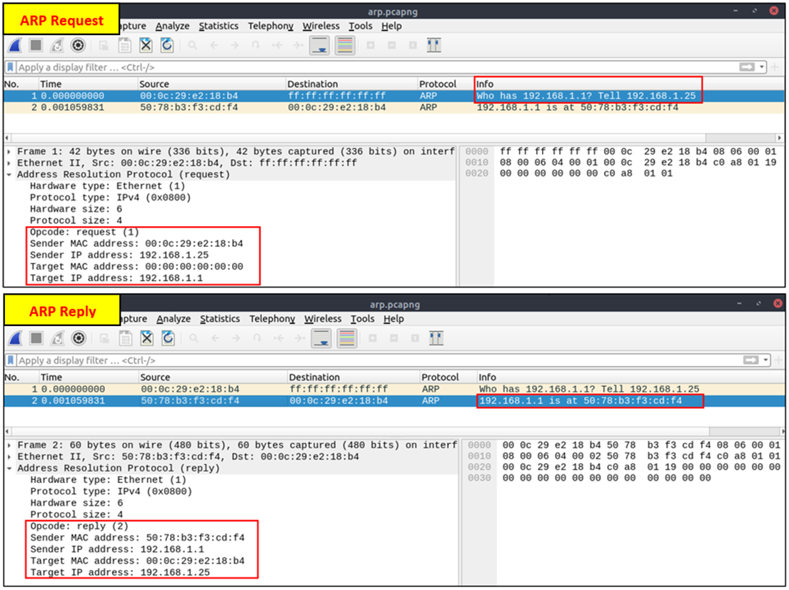
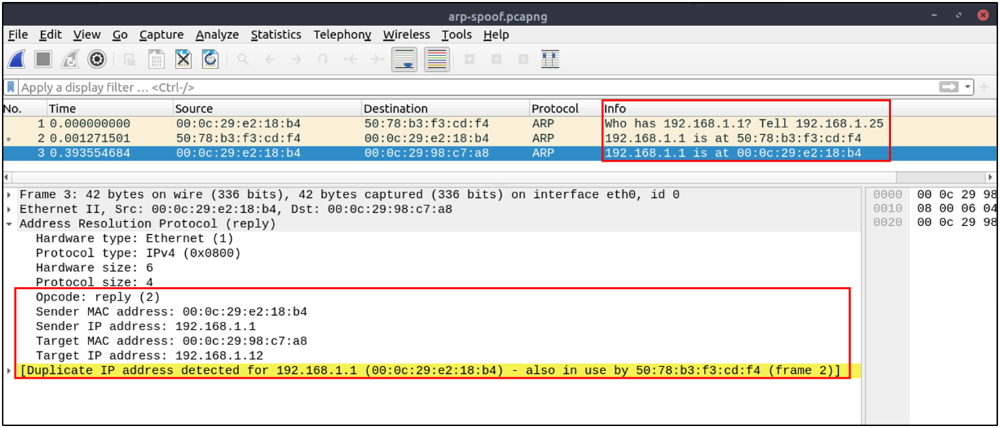
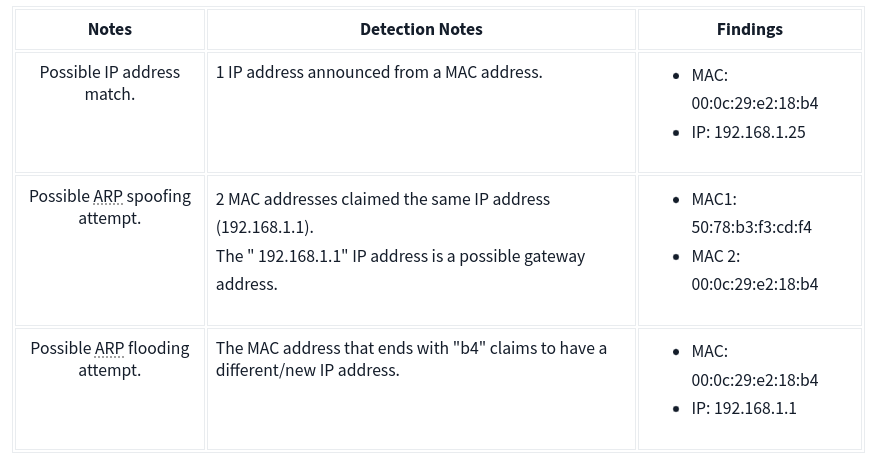
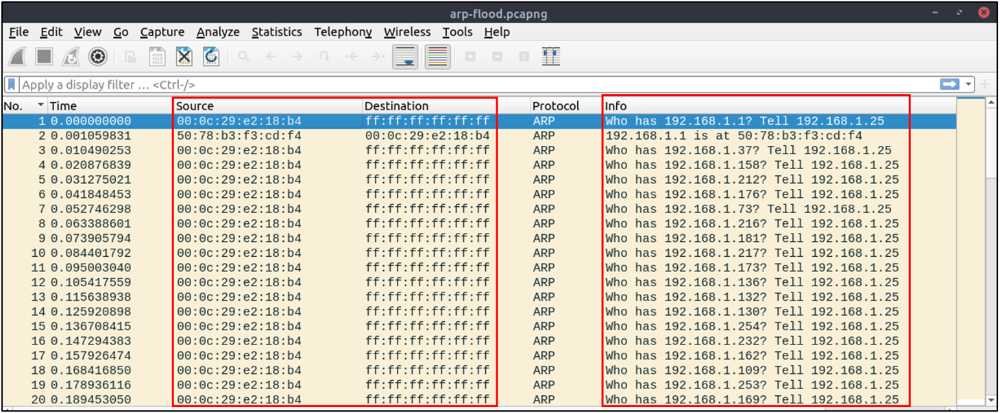
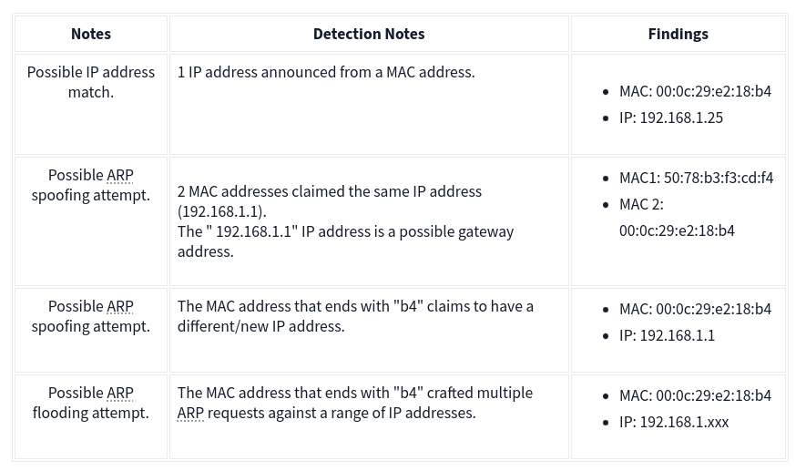
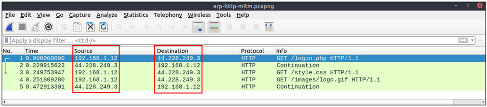
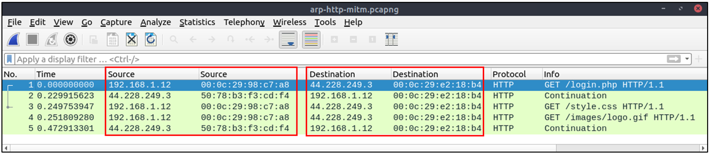

# Envenenamiento/Falseamiento de ARP (Conocido también como Ataque de Intermediario)

El protocolo ARP, o Protocolo de Resolución de Direcciones (ARP, por sus siglas en inglés), es la tecnología responsable de permitir que los dispositivos se identifiquen en una red. El Envenenamiento del Protocolo de Resolución de Direcciones (también conocido como Falseamiento de ARP o ataque de Hombre en el Medio (MITM, por sus siglas en inglés)) es un tipo de ataque que implica la interferencia/manipulación de la red enviando paquetes ARP maliciosos al gateway predeterminado. El objetivo final es manipular la "tabla de direcciones IP a direcciones MAC" y espiar el tráfico del host objetivo.

Hay una variedad de herramientas disponibles para realizar ataques ARP. Sin embargo, la mentalidad del ataque es estática, por lo que es fácil detectar tal ataque conociendo el flujo de trabajo del protocolo ARP y teniendo habilidades con Wireshark.

Análisis de ARP en resumen:
- Funciona en la red local.
- Permite la comunicación entre direcciones MAC.
- No es un protocolo seguro.
- No es un protocolo enrutado.
- No tiene una función de autenticación.
- Los patrones comunes son solicitudes y respuestas, anuncios y paquetes gratuitos.

Antes de investigar el tráfico, revisemos algunos paquetes ARP legítimos y sospechosos. Las solicitudes legítimas son similares a la imagen mostrada: una solicitud de difusión que pregunta si alguno de los hosts disponibles utiliza una dirección IP y una respuesta del host que utiliza la dirección IP específica.


## Filtros wireshark
- Búsqueda global de paquetes ARP:
  ```
  arp
  ```

- Solicitudes ARP 🠲 Opcode 1
  ```
  arp.opcode == 1
  ```

- Respuestas ARP 🠲 Opcode 2
  ```
  arp.opcode == 2
  ```

- Búsqueda: Escaneo ARP 🠲
  ```
  arp.dst.hw_mac==00:00:00:00:00:00
  ```

- Búsqueda: Detección posible de envenenamiento ARP 🠲
  ```
  arp.duplicate-address-detected or arp.duplicate-address-frame
  ```


- Búsqueda: Detección de posible inundación ARP 🠲
  ```
  ((arp) && (arp.opcode == 1)) && (arp.src.hw_mac == target-mac-address)
  ```




Una situación sospechosa significa tener dos respuestas ARP diferentes (conflicto) para una dirección IP en particular. En ese caso, la pestaña de información de experto de Wireshark advierte al analista. Sin embargo, solo muestra la segunda ocurrencia del valor duplicado para resaltar el conflicto. Por lo tanto, identificar el paquete malicioso del legítimo es el desafío del analista. Un posible caso de suplantación de IP se muestra en la imagen a continuación.




Aquí, conocer la arquitectura de la red e inspeccionar el tráfico durante un marco de tiempo específico puede ayudar a detectar la anomalía. Como analista, deberías tomar nota de tus hallazgos antes de proceder. Esto te ayudará a estar organizado y facilitará la correlación con los hallazgos posteriores. Mira la imagen proporcionada; hay un conflicto; la dirección MAC que termina en "b4" elaboró una solicitud ARP con la dirección IP "192.168.1.25", luego afirmó tener la dirección IP "192.168.1.1".




Sigamos inspeccionando el tráfico para detectar cualquier otra anomalía. Ten en cuenta que el caso se divide en varios archivos de captura para facilitar la investigación.




En este punto, es evidente que hay una anomalía. Un analista de seguridad no puede ignorar una inundación de solicitudes ARP. Esto podría ser una actividad maliciosa, un escaneo o problemas de red. Hay una nueva anomalía; la dirección MAC que termina en "b4" ha generado múltiples solicitudes ARP con la dirección IP "192.168.1.25". Centrémonos en el origen de esta anomalía y ampliemos las notas tomadas.




Hasta este punto, es evidente que la dirección MAC que termina en "b4" posee la dirección IP "192.168.1.25" y ha generado solicitudes ARP sospechosas contra un rango de direcciones IP. También afirmó tener la dirección de la posible puerta de enlace. Centrémonos en otros protocolos y observemos la manifestación de esta anomalía en las siguientes secciones del marco de tiempo.




¡Una anomalía más! La dirección MAC que termina en "b4" es el destino de todos los paquetes HTTP. Es evidente que hay un ataque de Hombre en el Medio (MITM), y el atacante es el host con la dirección MAC que termina en "b4". Todo el tráfico vinculado a direcciones IP "192.168.1.12" se redirige al host malicioso. Resumamos los hallazgos antes de concluir la investigación.



