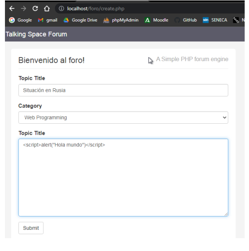
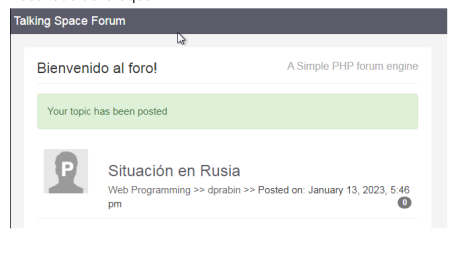
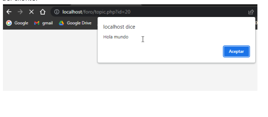

[Nota: para que funcione los ficheros del foro se necesita instalar una versión antigua de xampp: https://sourceforge.net/projects/xampp/files/XAMPP%20Linux/]

# Ataques XSS - Cross-Site Scripting
XSS ocurre cuando un atacante es capaz de inyectar un script, normalmente Javascript, en el output de una aplicación web de forma que se ejecuta en el navegador del cliente. Los ataques se producen principalmente por validar incorrectamente datos de usuario, y se suelen inyectar mediante un formulario web o mediante un enlace alterado.

Con XSS se puede ejecutar cualquier código Javascript en el navegador de un usuario. Algunos de los objetivos que se quieren conseguir con ataques XSS son:
- Robar cookies y sesiones de usuarios.
- Modificar el sitio web.
- Realizar HTTP requests con la sesión del usuario.
- Redireccionar a usuarios a sitios dañinos.
- Atacar al navegador.
- Instalar malware.
- Reescribir o manipular extensiones de navegador.
- etc.

## Tipos de ataques XSS
Los ataques Cross-Site Scripting pueden agruparse en dos grandes categorías, dependiendo de cómo envían el código malicioso:
- Non-persistent XSS o Reflected XSS: No almacenan el código malicioso en el servidor sino que lo pasan y presentan directamente a la víctima. Es el método más popular de ataque XSS. El ataque se lanza desde una fuente externa, mediante email o un sitio de terceros.

- Persistent XSS: El código malicioso ya ha superado la barrera del proceso de validación y está almacenado en un almacén de datos. Puede ser un comentario, un archivo log, un mensaje de notificación, o cualquier otro tipo de sección del sitio web que solicita algún input al usuario. Cuando esta información en particular se presenta en el sitio web, el código malicioso se ejecuta.

# Condiciones del LAB

Analizamos la descarga del xampp antiguo con virustotal.

Creamos una BD llamada forum.
Importamos la base forum el fichero: forum.sql

Accedemos a la web con los siguientes credenciales:
- Usuario: test1
- Password: test1 

# Creamos una entrada en el foro que muestre el mensaje “Hola”
Introducimos el código javascript para realizar el ataque XSS:
```
<script>alert("Hola mundo")</script>
```



Resultado del ataque:



Al entrar en la entrada que contiene el código XSS que está almacenado en la Base de
datos, se ejecuta el código javascript y aparece un mensaje de alerta con el navegador
del cliente:

