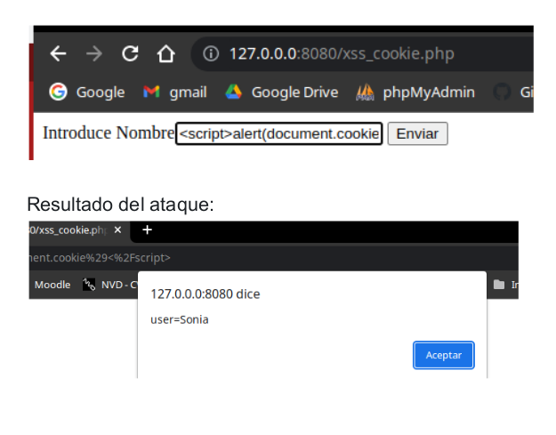

# Ataques XSS - Cross-Site Scripting
XSS ocurre cuando un atacante es capaz de inyectar un script, normalmente Javascript, en el output de una aplicación web de forma que se ejecuta en el navegador del cliente. Los ataques se producen principalmente por validar incorrectamente datos de usuario, y se suelen inyectar mediante un formulario web o mediante un enlace alterado.

Con XSS se puede ejecutar cualquier código Javascript en el navegador de un usuario. Algunos de los objetivos que se quieren conseguir con ataques XSS son:
- Robar cookies y sesiones de usuarios.
- Modificar el sitio web.
- Realizar HTTP requests con la sesión del usuario.
- Redireccionar a usuarios a sitios dañinos.
- Atacar al navegador.
- Instalar malware.
- Reescribir o manipular extensiones de navegador.
- etc.

## Tipos de ataques XSS
Los ataques Cross-Site Scripting pueden agruparse en dos grandes categorías, dependiendo de cómo envían el código malicioso:
- Non-persistent XSS o Reflected XSS: No almacenan el código malicioso en el servidor sino que lo pasan y presentan directamente a la víctima. Es el método más popular de ataque XSS. El ataque se lanza desde una fuente externa,
mediante email o un sitio de terceros.

- Persistent XSS: El código malicioso ya ha superado la barrera del proceso de validación y está almacenado en un almacén de datos. Puede ser un comentario, un archivo log, un mensaje de notificación, o cualquier otro tipo de sección del sitio web que solicita algún input al usuario. Cuando esta información en particular se presenta en el sitio web, el código malicioso se ejecuta.

# Ejemplo de injección xss para mostrar el mensaje Hola mundo
Usaremos un formulario sin sanear para injectar código javascript haciendo que muestre un mensaje:
```
<html>
<head></head>
<body>

<form action="" method="get">
Introduce Nombre
<input type="text" name="nombre">
<input type="submit">
</form>

<?php 
if (isset($_GET["nombre"]))
 echo "Hola ".$_GET["nombre"];
?>

</body>

</html>
```
Introducimos el código javascript para realizar el ataque XSS:
```
<script>alert("Hola mundo")</script>
```
Veremos que como resultado se muestra una ventana emergente con el mensaje Hola Mundo. Esto implica que este mini web puede ser afectada por un ataque XSS.


Si habilitamos las herramientas de desarrollador de Chrome, vemos que el código está insertado en la página web, **el código está reflejado en el servidor**, **es por ello que se llama XSS Reflejado**. Ocurre cuando **la entrada del usuario se muestra en la página después de ser procesada por el servidor (back-end), pero sin ser almacenada.**


# Ejemplo de injección xss para mostrar una cookie de un usuario
Usaremos un formulario sin sanear para injectar código javascript haciendo que se muestre una cookie de un usuario que hemos establecido con un valor para este sencillo ejemplo:
```
<html>
<head></head>
<body>

<form action="" method="get">
Introduce Nombre
<input type="text" name="nombre">
<input type="submit">
</form>

<?php 
if (isset($_GET["nombre"]))
 echo "Hola ".$_GET["nombre"];
?>

</body>

<script>
   document.cookie = "user=Sonia"
</script>
</html>
```
Introducimos el código javascript para realizar el ataque XSS:
```
<script>alert(document.cookie)</script>
```



# Prevenir ataques XSS
NUNCA debemos confiar en los datos que vienen de usuarios o de cualquier otra fuente externa. Cualquier dato debe ser validado o escapado para su output.

Algunas medidas a tomar para prevenir ataques XSS:
- Data validation.
- Data sanitization.
- Output escaping.

## Data Validation
La validación de datos es el proceso de asegurarse que la aplicación analiza el tipo de datos correctos. Cada dato debe ser validado cuando se recibe para asegurarse que es del tipo correcto, y rechazado si no pasa ese proceso de validación.

Por ejemplo, si nuestro script PHP espera un integer de un input, cualquier otro tipo de dato debe de rechazarse.

## Data Sanitization
La sanitización de datos se centra en manipular los datos para asegurarse que son seguros, eliminando cualquier parte indeseable y normalizándolos en la forma correcta.
Por ejemplo, si se espera un texto string de los usuarios, debemos evitar cualquier tipo de markup HTML:``
```
// Sanitizar comentario de usuario
$comentario = strip_tags($_POST["comentario"]);
```

## Output escaping
Para proteger la integridad de los datos que se devuelven, el output data, se debe escapar cualquier dato que se devuelve al usuario. Esto evita que el navegador malinterprete alguna secuencia especial de caracteres. Podemos usar htmlentities o htmlspecialchars.

Si usamos HTML ENTITIES → Una entidad HTML es un conjunto de caracteres ("string") que comienza con un ampersand ( & ) y termina con un punto y coma ( ; ). Las entidades son utilizadas frecuentemente para imprimir en pantalla caracteres reservados (aquellos que serían interpretados como HTML por el navegador) o invisibles (cómo tabulaciones). También pueden usarse para representar caracteres que no existan en algunos teclados, por ejemplo caracteres con tilde o diéresis.

Sanitizamos el código → Pasar el HTML a sus entidades
```
<html>
<head></head>
<body>

<form action="" method="get">
Introduce Nombre
<input type="text" name="nombre">
<input type="submit">
</form>

<?php 
 if (isset($_GET["nombre"])) {
   $nombre= htmlentities($_GET['nombre'],ENT_QUOTES);
   echo "Hola ".$_GET["nombre"];
 }
?>

</body>

</html>
```

Ahora si intentamos inyectar javascript para hacer una redirección, vemos que ya no se produce el ataque XSS:
