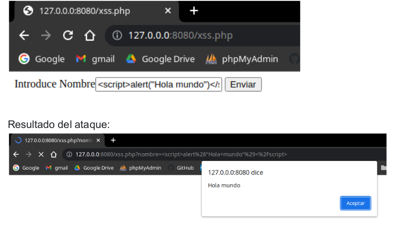
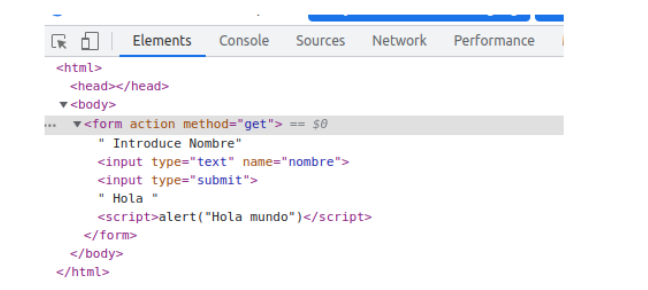

# Ataques XSS - Cross-Site Scripting
XSS ocurre cuando un atacante es capaz de inyectar un script, normalmente Javascript, en el output de una aplicación web de forma que se ejecuta en el navegador del cliente. Los ataques se producen principalmente por validar incorrectamente datos de usuario, y se suelen inyectar mediante un formulario web o mediante un enlace alterado.

Con XSS se puede ejecutar cualquier código Javascript en el navegador de un usuario. Algunos de los objetivos que se quieren conseguir con ataques XSS son:
- Robar cookies y sesiones de usuarios.
- Modificar el sitio web.
- Realizar HTTP requests con la sesión del usuario.
- Redireccionar a usuarios a sitios dañinos.
- Atacar al navegador.
- Instalar malware.
- Reescribir o manipular extensiones de navegador.
- etc.

## Tipos de ataques XSS
Los ataques Cross-Site Scripting pueden agruparse en dos grandes categorías, dependiendo de cómo envían el código malicioso:
- Non-persistent XSS o Reflected XSS: No almacenan el código malicioso en el servidor sino que lo pasan y presentan directamente a la víctima. Es el método más popular de ataque XSS. El ataque se lanza desde una fuente externa,
mediante email o un sitio de terceros.

- Persistent XSS: El código malicioso ya ha superado la barrera del proceso de validación y está almacenado en un almacén de datos. Puede ser un comentario, un archivo log, un mensaje de notificación, o cualquier otro tipo de sección del sitio web que solicita algún input al usuario. Cuando esta información en particular se presenta en el sitio web, el código malicioso se ejecuta.

# Código Javascript para mostrar el mensaje Hola
Tenemos un formulario sin sanea:
```
<html>
<head></head>
<body>

<form action="" method="get">
Introduce Nombre
<input type="text" name="nombre">
<input type="submit">

<?php 
if (isset($_GET["nombre"]))
 echo "Hola ".$_GET["nombre"];
?>

</form>
</body>

</html>
```
Introducimos el código javascript para realizar el ataque XSS:
```
<script>alert("Hola mundo")</script>
```
Veremos que como resultado se muestra una ventana emergente con el mensaje Hola Mundo. Esto implica que este mini web puede ser afectada por un ataque XSS.


Si habilitamos las herramientas de desarrollador de Chrome, vemos que el código está insertado en la página web, **el código está reflejado en el servidor**, **es por ello que se llama XSS Reflejado**. Ocurre cuando **la entrada del usuario se muestra en la página después de ser procesada por el servidor (back-end), pero sin ser almacenada.**



