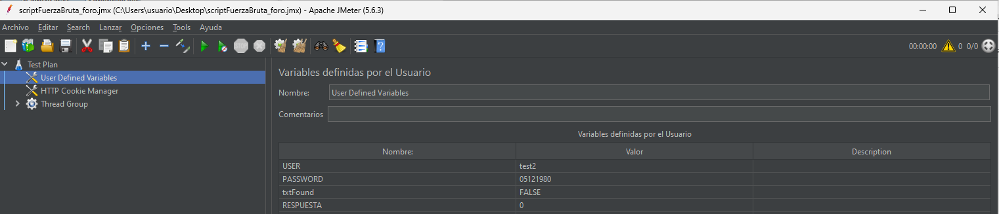
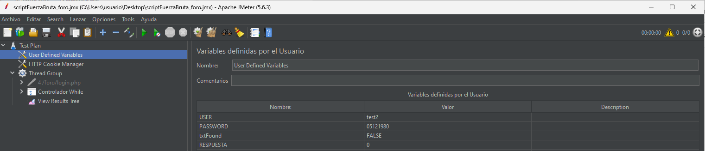
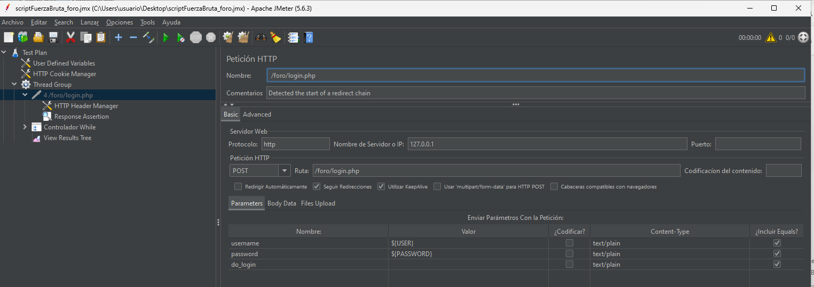
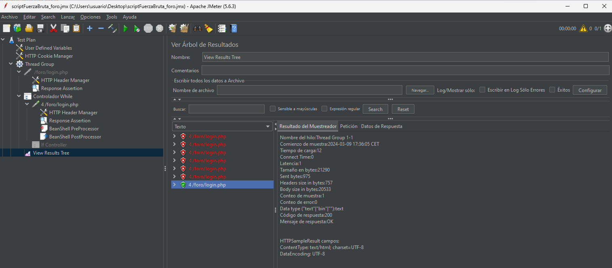

El ataque de fuerza bruta, en términos de la enumeración común de debilidades (CWE por sus siglas en inglés), se clasifica generalmente bajo CWE-307: Improper Restriction of Excessive Authentication Attempts (Restricción inadecuada de intentos excesivos de autenticación).

Partimos de la web insegura: foro

## Instalación de Java
Descargamos e instalamos Java: https://www.java.com/es/download/ie_manual.jsp

## Instalar Apache Jmeter
JMeter es un proyecto de Apache que puede ser utilizado como una herramienta de prueba de carga para analizar y medir el rendimiento de una variedad de servicios, con énfasis en aplicaciones web.

Descargamos Apache Jmeter: https://jmeter.apache.org/download_jmeter.cgi

## Abrimos el programa Apache Jmeter haciendo doble click en ApacheJMeter.jar:

## Ataque de Fuerza Bruta
Ejecutamos el script:  scriptFuerzabruta.jmx: Abrimos el  scriptFuerzabruta.jmx con Jmeter. Este es el algoritmo que buscará por fuerza bruta la password:

Ajustar los valores de los parámetros user y password:
- Ajustamos los valores: USER: test2
- PASSWORD: 05121980 (Fecha 05/12/1980)
  

- Ajustamos la IP: Comprobamos que la IP apunte a localhost que es donde está xampp funcionando:

## Lanzamos el script
Pulsamos el botón Lanzar (Arrancar) -->

Tras unos pocos intentos fallidos, vemos que obtiene un resultado que sí logra registrarse en el login. Accedemos a View Results Tree para ver los resultados de las pruebas de la contraseña:

