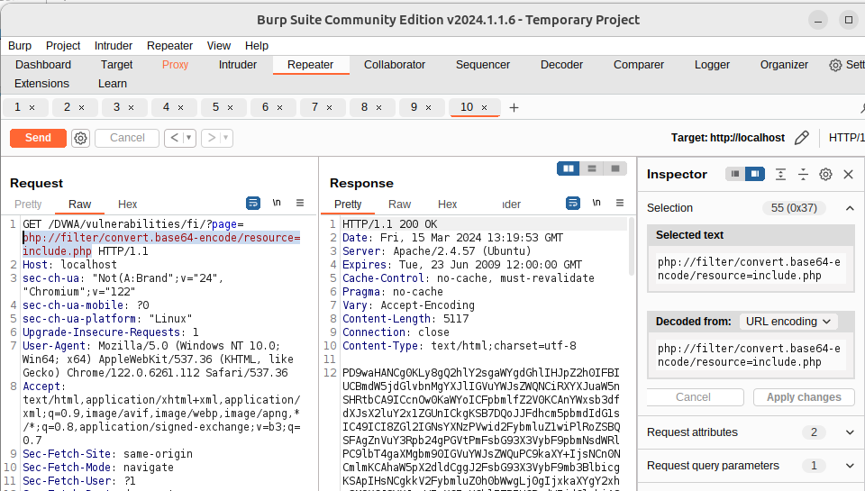
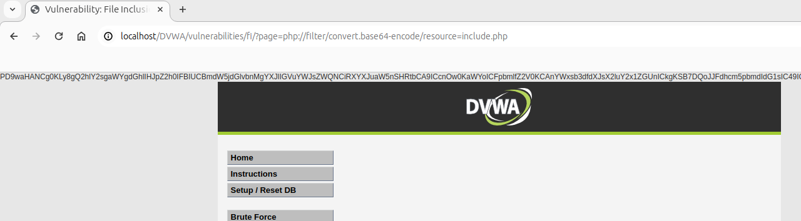
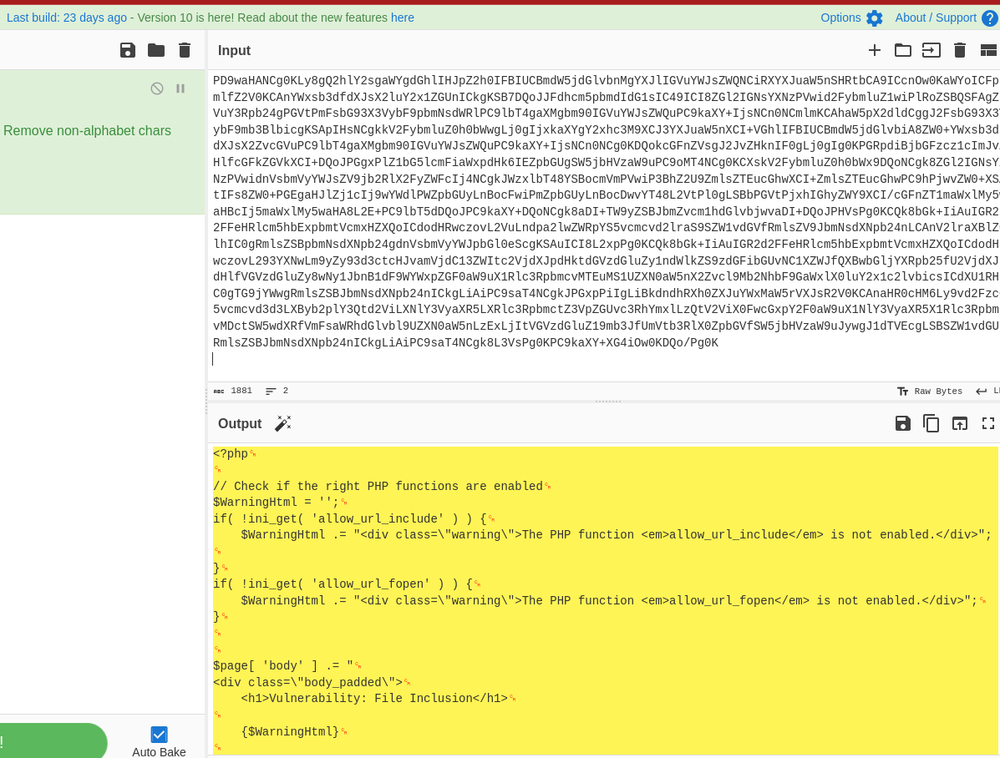
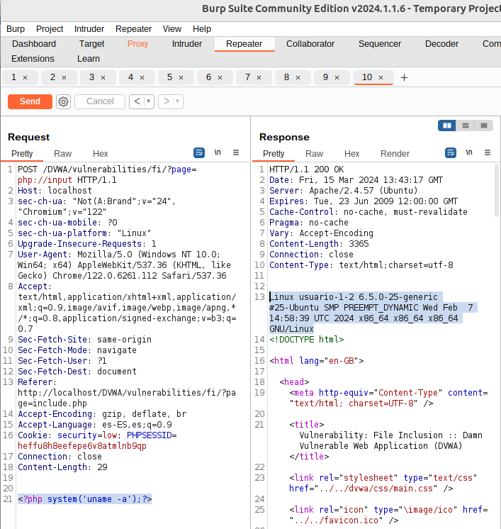
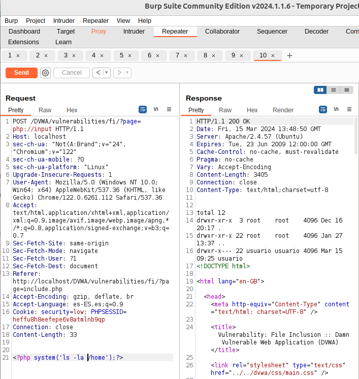

# Envolturas en PHP - Wrappers 
Los "wrappers" en PHP son herramientas que **permiten acceder a diferentes tipos de datos o protocolos utilizando los mismos mecanismos estándar que se aplicarían a archivos**. Por ejemplo, se pueden utilizar para leer de un archivo, de una URL, de un flujo de datos en memoria, entre otros, a través de funciones de manejo de archivos como fopen(), file_get_contents(), fwrite(), entre otras. PHP incluye varios wrappers integrados y también permite registrar wrappers personalizados.

## Wrappers Integrados:
Algunos de los wrappers integrados más comunes en PHP incluyen:
- file://: Accede a archivos locales a través del sistema de archivos.
- http:// y https://: Permite acceder a recursos a través de HTTP o HTTPS. Útil para leer contenido de la web.
- ftp:// y ftps://: Accede a archivos a través de los protocolos FTP o FTPS.
- php://: Ofrece acceso a varios flujos especiales, como php://input para leer datos crudos de la solicitud o php://stdout para escribir directamente a la salida estándar.
- zlib://: Permite la compresión y descompresión de streams en tiempo real.
- data://: Permite leer datos codificados en base64 o URL-encoded directamente como si fueran archivos.

## Wrappers y LFI
Si el servidor usa PHP, es posible utilizar wrappers para complementar la LFI detectada. Un wrapper (envoltorio) es un comando interpretado por php que realiza una determinada acción sobre el fujo de datos recuperados por LFI, por ejemplo, un fichero.

Los wrappers de PHP son parte de la funcionalidad de PHP que permite a los usuarios acceder a varios flujos de datos. Los wrappers también pueden acceder o ejecutar código a través de protocolos incorporados en PHP, lo que puede llevar a riesgos de seguridad significativos si no se manejan adecuadamente.

Por ejemplo, una aplicación vulnerable a LFI (Inclusión de Archivos Locales) podría incluir archivos basados en una entrada proporcionada por el usuario sin suficiente validación. En tales casos, los atacantes pueden usar el filtro php://filter. Este filtro permite a un usuario realizar operaciones de modificación básicas en los datos antes de que sean leídos o escritos. Por ejemplo, si un atacante quiere codificar en base64 el contenido de un archivo incluido como /etc/passwd. Esto se puede lograr utilizando el filtro de conversión convert.base64-encode del wrapper. El payload final será entonces php://filter/convert.base64-encode/resource=/etc/passwd

## Condiciones para poder usar una wrapper:**
- Debe existir una vulnerabilidad Locla File Inclusión.
- El Servidor web vulnerable debe ser capaz de ejecutar código PHP.
- El wrapper usado debe esetar instalado o activo (no todos lo están), y para algunos se necesitan el parámetro **allow_url_include** activado en php.ini, algo que no es muy habitual.

Los **wrappers permiten trabajar con diferentes protocolos y recursos como si fueran archivos locales**. En el contexto de una vulnerabilidad de Inclusión de Archivos Locales (LFI), los wrappers pueden ser **utilizados para cargar o interactuar con recursos** de maneras que no fueron originalmente previstas por los desarrolladores de la aplicación, lo que puede llevar a la revelación de información sensible o incluso a la ejecución remota de código (RCE) en ciertas circunstancias.

## Uso de wrapper:
Para emplear uno o más envoltorios (wrappers) en la secuencia de datos de un archivo que se está incluyendo a través de una vulnerabilidad de Inclusión de Archivos Locales (LFI), se hace de la siguiente forma:
```
DVWA/vulnerabilities/fi/?page=fichero_a_incluir
DVWA/vulnerabilities/fi/?page=php://wrapper1/wrapper2/....=fichero_a_incluir
```
Aquí, envoltorio1, envoltorio2, etc., representan diferentes capas de envoltorios que podemos aplicar en secuencia, y podemos encadenarlos simplemente colocando uno después del otro, separados por barras (/). El resultado de cada envoltorio se pasa al siguiente, funcionando de manera parecida a cómo los comandos en Linux pueden ser encadenados usando tuberías (pipes), donde la salida de un comando sirve como entrada para el siguiente. Esto permite manipular o transformar los datos del archivo incluido de formas específicas antes de que sean finalmente procesados o presentados.


## PHP Wrappers Comunes:
- **php://filter:** Permite leer archivos a través de filtros de conversión. Por ejemplo, es posible usar php://filter/convert.base64-encode/resource=index.php para obtener el contenido de un archivo PHP en base64. Esto puede ser especialmente útil en situaciones de LFI donde el código fuente directo no se puede leer debido a restricciones del servidor.

- php://input: Este wrapper permite leer datos crudos de la petición POST. En escenarios de LFI, podría ser utilizado para pasar datos dinámicos al script incluido, aunque su aplicabilidad dependerá de cómo el script maneje los datos de entrada.

- data://: Este wrapper permite la ejecución de datos binarios o de texto como si fueran archivos. En teoría, podría usarse para ejecutar código arbitrario si se puede incluir de manera efectiva mediante una vulnerabilidad LFI, pero en la práctica, esto suele ser bloqueado o limitado por la configuración de seguridad del servidor.
  ```
  data:text/plain,<?php phpinfo(); ?>
  ```
  - La descomposición del payload data:text/plain,<?php phpinfo(); ?> es la siguiente:
    - data: Es el esquema utilizado para indicar que lo que sigue es un conjunto de datos en línea. En contextos donde se esperan URLs, este esquema permite incluir datos pequeños directamente en la URL en lugar de referenciar externamente a los datos almacenados en otro lugar.

    - text/plain: Este es el tipo MIME del contenido. En este caso, text/plain indica que el contenido es texto plano. El tipo MIME especifica la naturaleza y el formato del contenido, lo que ayuda al receptor (por ejemplo, un navegador web) a entender cómo manejar los datos proporcionados.

    - El segmento de datos <?php phpinfo(); ?>: Aquí es donde se incluye el contenido real o los datos. En este caso, el segmento de datos contiene un pequeño script PHP que es <?php phpinfo(); ?>. Este script, cuando es ejecutado por un procesador PHP, genera una página web que muestra información detallada sobre la configuración actual de PHP en el servidor. Es una llamada a la función phpinfo(), la cual es una función incorporada en PHP utilizada frecuentemente para diagnosticar configuraciones o problemas del entorno de PHP.

    En resumen, este payload es una forma de encapsular datos (en este caso, un script PHP) directamente en una URL utilizando el esquema de datos data:, con un tipo MIME especificado como text/plain. Sin embargo, es importante notar que, aunque este método puede ser útil para incluir pequeños fragmentos de datos directamente en documentos o aplicaciones web, el ejemplo dado (<?php phpinfo(); ?>) solo sería ejecutable y relevante en un contexto donde se espera y se procesa el código PHP, lo cual no ocurriría simplemente visitando una URL formada de esta manera en un navegador, ya que el navegador trataría los datos como texto plano y no como código PHP a ejecutar.


## Ejemplo de uso del wrapper php://filter
Para utilizar el wrapper php://filter en un escenario de prueba de penetración (pentesting) con el objetivo de obtener el contenido PHP de include.php a través de una vulnerabilidad de Inclusión de Archivos Locales (LFI), debemos construir la URL de manera que el filtro de PHP se aplique correctamente para leer y, posiblemente, codificar el contenido del archivo objetivo. Esto permite acceder al código fuente PHP en un formato que pueda ser visualizado directamente en el navegador, a menudo utilizando codificación Base64 para evitar la ejecución del código PHP por el servidor.

```
DVWA/vulnerabilities/fi/?page=php://filter/convert.base64-encode/resource=include.php
```
Esta URL hace lo siguiente:
- php://filter: Especifica que se va a utilizar un filtro de PHP.
- convert.base64-encode: Aplica un filtro para convertir los datos leídos en Base64. Esto es útil porque el código PHP se puede codificar en Base64 para evitar su ejecución por el servidor web y permitir que se muestre como texto plano.
- resource=include.php: Especifica el archivo objetivo al que se desea aplicar el filtro, en este caso, include.php.

Cuando accedemos a esta URL, el servidor debería devolver la versión codificada en Base64 del contenido de include.php. Luego, podemos decodificar el contenido de Base64 para obtener el código fuente PHP original.




Wrappers y protocolos soportados en PHP: https://www.php.net/manual/en/wrappers.php


## php://input
El wrapper php://input en PHP es una forma de acceder a los datos crudos de una solicitud POST. Lo interesante de este envoltorio es que nos permite leer los datos enviados a través de una solicitud POST sin procesar, es decir, tal como se reciben antes de que cualquier manipulación o codificación específica de PHP se aplique a estos datos. Esto puede ser útil para varias cosas, incluido el manejo personalizado de los datos de entrada.

Este envoltorio permite mandar un payload vía POST. 

Para usar php://input se necesita:
- Requiere que la opción allow_url_include en php.ini esté activada.
- Que el método sea POST. Si es GET hay que cambiarlo.
- Cambiar el valor del parámetro de la URL donde se indica el documento a mostrar por php://input.
- Incluir en el payload a enviar el código deseado.

La página se carga mostrando el resultado de ejecutar el comando que se indicó en la request →



