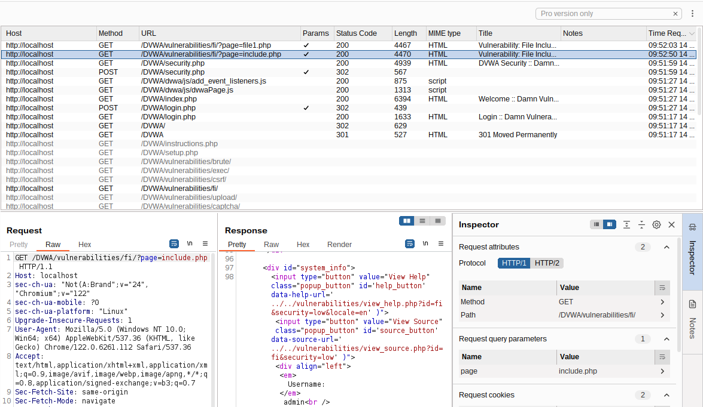
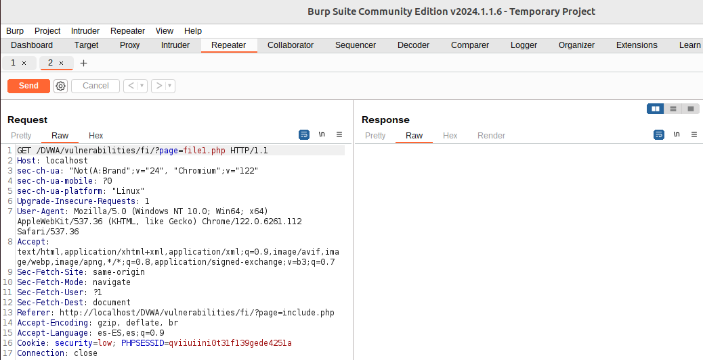
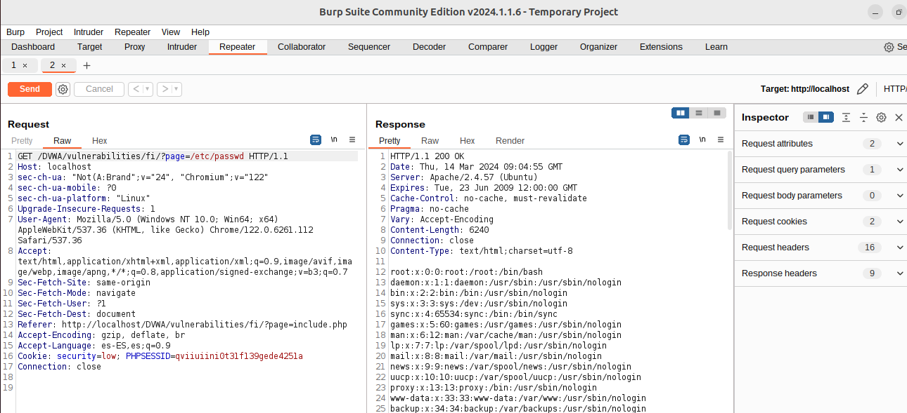
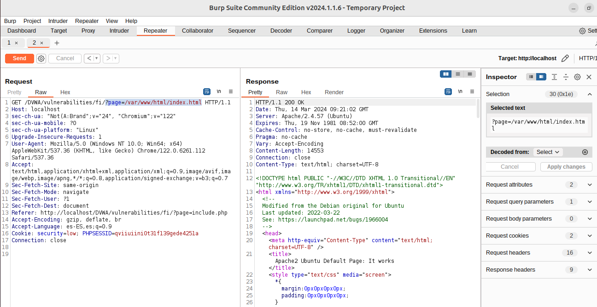
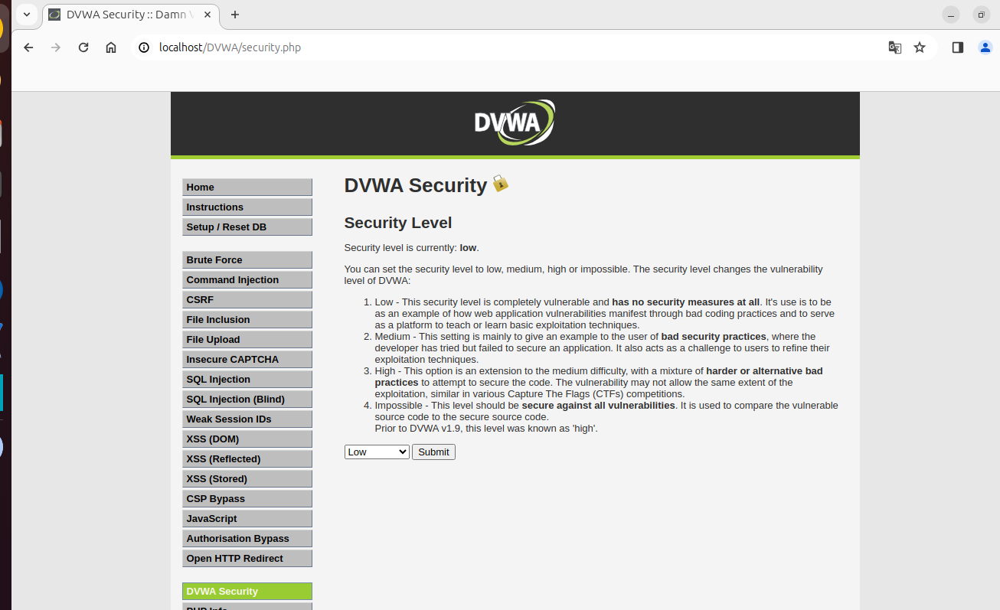

## Local File Inclusion
Las vulnerabilidades de Inclusión de Archivos Local (LFI) y de Inclusión de Archivos Remotos (RFI) son problemas de seguridad muy similares y están estrechamente vinculadas. Ambas hacen posible que un atacante acceda o manipule archivos en el sistema de la víctima. La LFI, específicamente, permite a los atacantes leer o ejecutar archivos que se encuentran en el servidor de la aplicación web.

**Estas vulnerabilidades surgen principalmente por dos razones:**
- Falta de validación o insuficiente control sobre los datos introducidos por los usuarios: Esto no se limita solo a la información que se envía a través de formularios web, sino que también incluye cualquier método que permita al usuario enviar información al servidor, como son los parámetros en métodos GET y POST, entre otros.
- La capacidad de los lenguajes de programación del lado del servidor, como PHP, ASP o JSP, de incluir e interpretar archivos de manera dinámica: Esto significa que si un atacante puede manipular las referencias a los archivos que estos lenguajes están procesando, podría forzar la aplicación a ejecutar o revelar el contenido de archivos no destinados a ser accesibles.

En esencia, estos problemas de seguridad ocurren cuando una **aplicación web no verifica adecuadamente los datos suministrados por el usuario**, permitiendo así que los atacantes inserten rutas de archivos maliciosos. Esto puede conducir a la lectura no autorizada de archivos del sistema o, en el caso de RFI, al ejecutar código malicioso desde un servidor remoto. La prevención efectiva de estos ataques implica asegurarse de que todas las entradas de los usuarios sean rigurosamente validadas y limpiadas, y restringir estrictamente los archivos que pueden ser incluidos o ejecutados por la aplicación web.

En las versiones más recientes del OWASP Top 10, **LFI pertenece a la categoría "A03:2021-Injection", donde se encuentra la vulnerabilidad CWE-98 (Improper Control of Filename for include/Require Statement in PHP Program (PHP Remote File Inclusion)**. La categoría de Inyección incluye una variedad de ataques donde los atacantes envían datos maliciosos a un intérprete como parte de un comando o consulta, con la intención de hacer ejecutar o interpretar estos datos de manera no intencionada. 

## Análisis de la web víctima
### 1. Reconocimiento y Mapeo
Antes de intentar cualquier prueba de LFI, debemos realizar una fase de reconocimiento para entender la estructura de la aplicación web, identificar los puntos de entrada (como parámetros de URL, campos de formulario, etc.) y comprender cómo procesa la entrada la aplicación. Esto puede incluir:
- Revisar el código fuente: Si tenemos acceso, revisar el código puede revelar directamente dónde se podrían incluir archivos basados en la entrada del usuario.
- Si no tenemos acceso 🠮 Mapear la aplicación: Utilizar herramientas como Burp Suite para automatizar la navegación y mapear todas las funcionalidades y parámetros de la aplicación.



### 2. Análisis
- Identificar patrones de inclusión de archivos: Busca patrones en la aplicación donde se cargan archivos o se incluyen basados en la entrada del usuario. Por ejemplo, parámetros que cambian el contenido de la página basándose en un valor específico pueden ser un indicio.
- Identificación de puntos de entrada: Primero, debemos identificar los puntos de la aplicación web donde se incluyen archivos basados en la entrada del usuario. Comúnmente, esto ocurre en funcionalidades como la carga de páginas, documentos, o scripts a través de parámetros GET o POST.


### 3. Pruebas Focalizadas
En lugar de probar a ciegas, podemos probar de manera focalizada:
- Pruebas dirigidas con listas de archivos sensibles: Basado en el tipo de servidor y la configuración conocida, crea o utiliza listas de rutas de archivos que son comúnmente accesibles y sensibles en esos entornos.
- Encodings y técnicas de evasión: Si sospechamos de la presencia de filtros o validaciones, aplicaremos técnicas de encoding de manera dirigida basándonos en cómo creemos que la aplicación está manejando la entrada.

### 4. Pruebas manuales:
Manipulación de parámetros: Una vez identificado un punto de entrada, intentaremos manipular el parámetro para incluir archivos locales del sistema. Esto se hace modificando la URL o los parámetros POST para apuntar a archivos del sistema.

Lista de rutas de archivos comunes: Utilizaremos listas de rutas de archivos comunes para probar la inclusión de archivos sensibles del sistema, como /etc/passwd, /var/www/html/config.php, entre otros. Ejemplos comunes de intento de inclusión serían:
- Acceder a archivos sensibles:
  ```
  ?page=../../../etc/passwd
  ?page=/etc/passwd
  ?page=/var/www/html/index.html
  ....
  ```
- Incluir archivos de configuración:
  ```
  ?config=../config/db.php
  ```



Uso de técnicas de encoding: Algunas aplicaciones usan técnicas para prevenir ataques LFI, como la validación de la ruta del archivo. En este caso, intentaremos evadir estas protecciones usando encoding URL o técnicas de codificación doble.

Explotación más allá de la lectura de archivos: En algunos entornos, una vulnerabilidad LFI puede llevar a la ejecución de código arbitrario. Esto se puede lograr a través de la inyección de PHP en archivos accesibles para la aplicación (como archivos de registro) y luego incluir esos archivos mediante LFI.

### Permisos del usuario
La posibilidad de acceder a ciertos archivos en un servidor web está limitada por los derechos otorgados al usuario bajo el cual opera el servidor, como el usuario www-data en servidores Apache. Según estos permisos y otros aspectos, **esta debilidad de seguridad podrían explotarse de varias maneras, incluyendo:**
- La ejecución de comandos o código directamente en el servidor, por ejemplo, a través de la manipulación de archivos de registro (log poisoning) 🠮 Ejecución remoto de código (RCE) mediante log poisoning. [RCE -lab](ejecucion-remota-de-codigo-RCE.md)
- La provocación de un colapso o interrupción del servicio, conocido como Denegación de Servicio (DoS).
- El descubrimiento y extracción de información confidencial, lo cual puede variar en severidad dependiendo de los archivos a los que se accede. Esto puede permitir a un atacante recopilar datos sobre el sistema atacado, incluyendo contraseñas de SSH, información de bases de datos, el código fuente de la aplicación, entre otros.

### 5. Scripts y herramientas automatizadas:
Existen herramientas específicas para automatizar la búsqueda de vulnerabilidades LFI, como LFISuite o dotdotpwn.


### Inclusión dinámica
La vulnerabilidad de Inclusión de Archivos Locales (LFI) no surge simplemente por permitir que una aplicación web incluya archivos de forma dinámica. El verdadero riesgo está en no verificar adecuadamente cuáles archivos están siendo cargados mediante esta función. Es decir, el peligro no viene de la capacidad de la aplicación de cargar archivos según las necesidades del momento, sino de hacerlo sin una supervisión rigurosa sobre esos archivos, lo cual podría permitir a un atacante cargar archivos maliciosos o acceder a archivos sensibles del sistema.

**Inclusión Dinámica:** La "inclusión dinámica" se refiere a la capacidad de una aplicación web de incluir archivos en tiempo de ejecución basándose en la entrada del usuario o en condiciones específicas. Este es un comportamiento común y necesario en muchas aplicaciones web, utilizado para cargar bibliotecas, módulos, plantillas, o incluso contenido específico basado en la navegación del usuario. Los mecanismos de inclusión dinámica, como include, require en PHP, permiten a los desarrolladores construir aplicaciones flexibles y modulares.

**Ejemplo de Falta de Control:**
Considera un script PHP que incluye un archivo basado en un parámetro de la URL:
```
include($_GET['file'] . '.php');
```
Si un atacante puede controlar el valor de $_GET['file'], podría intentar acceder a cualquier archivo en el sistema que el proceso del servidor web tenga permiso para leer, simplemente modificando la URL: 
```
?file=../../../../etc/passwd
```

## Buenas Prácticas para Mitigar el Riesgo de LFI
Para mitigar el riesgo de LFI y asegurar que la inclusión dinámica se use de manera segura, se deben adoptar varias buenas prácticas:
- Validación de la Entrada: Debemos asegurarnos validar y sanitizar todas las entradas del usuario utilizadas para incluir archivos. Solo permitir rutas o nombres de archivos específicos y rechazar cualquier cosa que no cumpla con el criterio.
- Lista Blanca: Utilizar listas blancas para controlar qué archivos pueden ser incluidos, asegurando que solo se puedan cargar archivos previamente aprobados.
- Limitar Acceso al Sistema de Archivos: Restringir los permisos de la aplicación al mínimo necesario, limitando los archivos y directorios a los que la aplicación puede acceder.
- Desactivar la Ejecución de Código en Directorios Subidos: Configura el servidor web para desactivar la ejecución de scripts en directorios donde los usuarios pueden subir archivos, reduciendo el riesgo de ejecución de código malicioso.


## Laboratorio LFI - Nivel Bajo
Usamos DVWA, sección File Inclusión:
Enlace para instalar DVWA: xxxxxxxxxxxxxx



