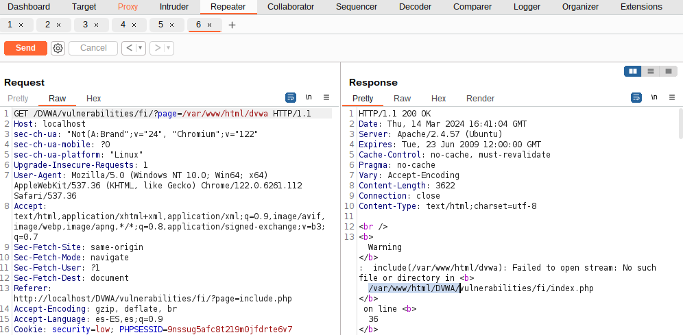
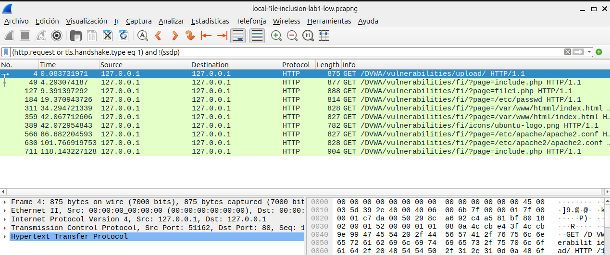
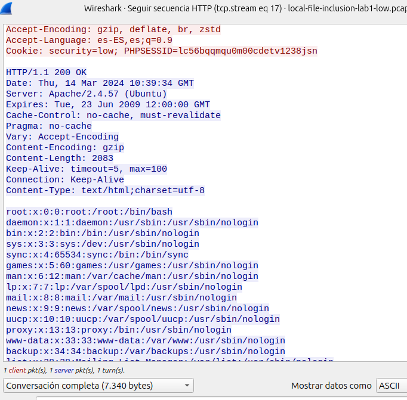
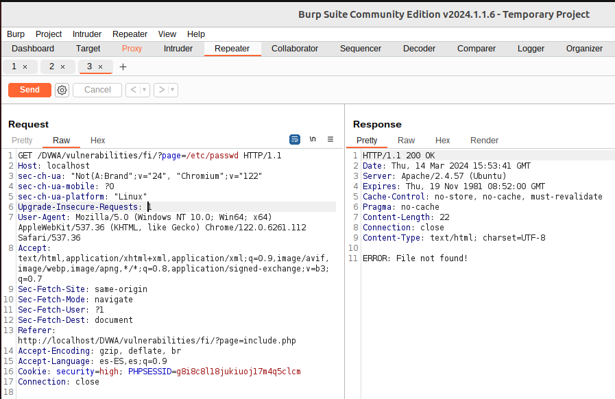

## Local File Inclusion
Las vulnerabilidades de Inclusión de Archivos Local (LFI) y de Inclusión de Archivos Remotos (RFI) son problemas de seguridad muy similares y están estrechamente vinculadas. Ambas hacen posible que un atacante acceda o manipule archivos en el sistema de la víctima. La LFI, específicamente, permite a los atacantes leer o ejecutar archivos que se encuentran en el servidor de la aplicación web.

**Estas vulnerabilidades surgen principalmente por dos razones:**
- Falta de validación o insuficiente control sobre los datos introducidos por los usuarios: Esto no se limita solo a la información que se envía a través de formularios web, sino que también incluye cualquier método que permita al usuario enviar información al servidor, como son los parámetros en métodos GET y POST, entre otros.
- La capacidad de los lenguajes de programación del lado del servidor, como PHP, ASP o JSP, de incluir e interpretar archivos de manera dinámica: Esto significa que si un atacante puede manipular las referencias a los archivos que estos lenguajes están procesando, podría forzar la aplicación a ejecutar o revelar el contenido de archivos no destinados a ser accesibles.

En esencia, estos problemas de seguridad ocurren cuando una **aplicación web no verifica adecuadamente los datos suministrados por el usuario**, permitiendo así que los atacantes inserten rutas de archivos maliciosos. Esto puede conducir a la lectura no autorizada de archivos del sistema o, en el caso de RFI, al ejecutar código malicioso desde un servidor remoto. La prevención efectiva de estos ataques implica asegurarse de que todas las entradas de los usuarios sean rigurosamente validadas y limpiadas, y restringir estrictamente los archivos que pueden ser incluidos o ejecutados por la aplicación web.

En las versiones más recientes del OWASP Top 10, **LFI pertenece a la categoría "A03:2021-Injection", donde se encuentra la vulnerabilidad CWE-98 (Improper Control of Filename for include/Require Statement in PHP Program (PHP Remote File Inclusion)**. La categoría de Inyección incluye una variedad de ataques donde los atacantes envían datos maliciosos a un intérprete como parte de un comando o consulta, con la intención de hacer ejecutar o interpretar estos datos de manera no intencionada. 

## Análisis de la web víctima
### 1. Reconocimiento y Mapeo
Antes de intentar cualquier prueba de LFI, debemos realizar una fase de reconocimiento para entender la estructura de la aplicación web, identificar los puntos de entrada (como parámetros de URL, campos de formulario, etc.) y comprender cómo procesa la entrada la aplicación. Esto puede incluir:
- Revisar el código fuente: Si tenemos acceso, revisar el código puede revelar directamente dónde se podrían incluir archivos basados en la entrada del usuario.
- Si no tenemos acceso 🠮 Mapear la aplicación: Utilizar herramientas como Burp Suite para automatizar la navegación y mapear todas las funcionalidades y parámetros de la aplicación.


### 2. Análisis
- Identificar patrones de inclusión de archivos: Busca patrones en la aplicación donde se cargan archivos o se incluyen basados en la entrada del usuario. Por ejemplo, parámetros que cambian el contenido de la página basándose en un valor específico pueden ser un indicio.
- Identificación de puntos de entrada: Primero, debemos identificar los puntos de la aplicación web donde se incluyen archivos basados en la entrada del usuario. Comúnmente, esto ocurre en funcionalidades como la carga de páginas, documentos, o scripts a través de parámetros GET o POST.


### 3. Pruebas Focalizadas
En lugar de probar a ciegas, podemos probar de manera focalizada:
- Pruebas dirigidas con listas de archivos sensibles: Basado en el tipo de servidor y la configuración conocida, crea o utiliza listas de rutas de archivos que son comúnmente accesibles y sensibles en esos entornos.
- Encodings y técnicas de evasión: Si sospechamos de la presencia de filtros o validaciones, aplicaremos técnicas de encoding de manera dirigida basándonos en cómo creemos que la aplicación está manejando la entrada.

### 4. Pruebas manuales:
Manipulación de parámetros: Una vez identificado un punto de entrada, intentaremos manipular el parámetro para incluir archivos locales del sistema. Esto se hace modificando la URL o los parámetros POST para apuntar a archivos del sistema.

Lista de rutas de archivos comunes: Utilizaremos listas de rutas de archivos comunes para probar la inclusión de archivos sensibles del sistema, como /etc/passwd, /var/www/html/config.php, entre otros. Ejemplos comunes de intento de inclusión serían:
- Acceder a archivos sensibles:
  ```
  ?page=../../../etc/passwd
  ?page=/etc/passwd
  ?page=/var/www/html/index.html
  ....
  ```
- Incluir archivos de configuración:
  ```
  ?config=../config/db.php
  ```


Uso de técnicas de encoding: Algunas aplicaciones usan técnicas para prevenir ataques LFI, como la validación de la ruta del archivo. En este caso, intentaremos evadir estas protecciones usando encoding URL o técnicas de codificación doble.

Explotación más allá de la lectura de archivos: En algunos entornos, una vulnerabilidad LFI puede llevar a la ejecución de código arbitrario. Esto se puede lograr a través de la inyección de PHP en archivos accesibles para la aplicación (como archivos de registro) y luego incluir esos archivos mediante LFI.

### Permisos del usuario
La posibilidad de acceder a ciertos archivos en un servidor web está limitada por los derechos otorgados al usuario bajo el cual opera el servidor, como el usuario www-data en servidores Apache. Según estos permisos y otros aspectos, **esta debilidad de seguridad podrían explotarse de varias maneras, incluyendo:**
- La ejecución de comandos o código directamente en el servidor, por ejemplo, a través de la manipulación de archivos de registro (log poisoning) 🠮 Ejecución remoto de código (RCE) mediante log poisoning. [RCE -lab](ejecucion-remota-de-codigo-RCE.md)
- La provocación de un colapso o interrupción del servicio, conocido como Denegación de Servicio (DoS).
- El descubrimiento y extracción de información confidencial, lo cual puede variar en severidad dependiendo de los archivos a los que se accede. Esto puede permitir a un atacante recopilar datos sobre el sistema atacado, incluyendo contraseñas de SSH, información de bases de datos, el código fuente de la aplicación, entre otros.

### 5. Scripts y herramientas automatizadas:
Existen herramientas específicas para automatizar la búsqueda de vulnerabilidades LFI, como LFISuite o dotdotpwn.


### Inclusión dinámica
La vulnerabilidad de Inclusión de Archivos Locales (LFI) no surge simplemente por permitir que una aplicación web incluya archivos de forma dinámica. El verdadero riesgo está en no verificar adecuadamente cuáles archivos están siendo cargados mediante esta función. Es decir, el peligro no viene de la capacidad de la aplicación de cargar archivos según las necesidades del momento, sino de hacerlo sin una supervisión rigurosa sobre esos archivos, lo cual podría permitir a un atacante cargar archivos maliciosos o acceder a archivos sensibles del sistema.

**Inclusión Dinámica:** La "inclusión dinámica" se refiere a la capacidad de una aplicación web de incluir archivos en tiempo de ejecución basándose en la entrada del usuario o en condiciones específicas. Este es un comportamiento común y necesario en muchas aplicaciones web, utilizado para cargar bibliotecas, módulos, plantillas, o incluso contenido específico basado en la navegación del usuario. Los mecanismos de inclusión dinámica, como include, require en PHP, permiten a los desarrolladores construir aplicaciones flexibles y modulares.

**Ejemplo de Falta de Control:**
Considera un script PHP que incluye un archivo basado en un parámetro de la URL:
```
include($_GET['file'] . '.php');
```
Si un atacante puede controlar el valor de $_GET['file'], podría intentar acceder a cualquier archivo en el sistema que el proceso del servidor web tenga permiso para leer, simplemente modificando la URL: 
```
?file=../../../../etc/passwd
```

## Buenas Prácticas para Mitigar el Riesgo de LFI
Para mitigar el riesgo de LFI y asegurar que la inclusión dinámica se use de manera segura, se deben adoptar varias buenas prácticas:
- Validación de la Entrada: Debemos asegurarnos validar y sanitizar todas las entradas del usuario utilizadas para incluir archivos. Solo permitir rutas o nombres de archivos específicos y rechazar cualquier cosa que no cumpla con el criterio.
- Lista Blanca: Utilizar listas blancas para controlar qué archivos pueden ser incluidos, asegurando que solo se puedan cargar archivos previamente aprobados.
- Limitar Acceso al Sistema de Archivos: Restringir los permisos de la aplicación al mínimo necesario, limitando los archivos y directorios a los que la aplicación puede acceder.
- Desactivar la Ejecución de Código en Directorios Subidos: Configura el servidor web para desactivar la ejecución de scripts en directorios donde los usuarios pueden subir archivos, reduciendo el riesgo de ejecución de código malicioso.


# Laboratorio LFI de DVWA
**Acerca del laboratorio:** Algunas aplicaciones web permiten al usuario especificar entradas que se utilizan directamente en flujos de archivos o permiten al usuario subir archivos al servidor. En un momento posterior, la aplicación web accede a la entrada proporcionada por el usuario en el contexto de la aplicación web. Al hacer esto, la aplicación web está permitiendo la posibilidad de ejecución de archivos maliciosos. Si el archivo elegido para incluirse es local en la máquina objetivo, se denomina "Inclusión de Archivos Locales (LFI)". Pero los archivos también pueden incluirse en otras máquinas, en cuyo caso el ataque es una "Inclusión de Archivos Remotos (RFI)".

Cuando RFI no es una opción, usar otra vulnerabilidad con LFI (como la subida de archivos y la transversalidad de directorios) a menudo puede lograr el mismo efecto.

Nota, el término "inclusión de archivos" no es lo mismo que "acceso arbitrario a archivos" o "divulgación de archivos".

**Objetivo del laboratorio Local File Inclusion de DVWA:**
Leer las cinco citas famosas de '../hackable/flags/fi.php' usando solo la inclusión de archivos.

**Usamos DVWA, sección File Inclusión:**
[Enlace para instalar DVWA](../../../dvwm-install-ubuntu.pdf)


## Laboratorio LFI de DVWA - Nivel Bajo
Usamo LFI para buscar el fichero que nos pide el reto:



### Análisis del tráfico durante el ataque LFI- LOW
- Filtro para mostrar solicitudes GET | POST:
  Un enfoque básico sería filtrar todo el tráfico HTTP para revisar manualmente las solicitudes que parezcan sospechosas. Aquí hay un ejemplo de filtro que puedes comenzar a usar, pero recuerda que la eficacia de este filtro depende de estar atento a patrones o cadenas específicas que podrían indicar un intento de LFI:
  ```
  http.request.method == "GET" || http.request.method == "POST"
  ```
  


- Filtering for Web Traffic:
  ```
  (http.request or tls.handshake.type eq 1) and !(ssdp)
  ```
  
  Wireshark debe mostrar los paquetes que sean solicitudes HTTP (http.request) o que sean de tipo handshake TLS/SSL donde el tipo de handshake es igual a 1 (tls.handshake.type eq 1). En el protocolo TLS (Transport Layer Security), el tipo de handshake igual a 1 corresponde a un mensaje de ClientHello, que es el primer paso en el proceso de establecimiento de una conexión TLS segura, donde el cliente indica al servidor los protocolos y las cifras que soporta.
  
  and !(ssdp): Esta parte del filtro excluye todos los paquetes que pertenecen al protocolo SSDP (Simple Service Discovery Protocol). El operador ! significa "no", por lo tanto, !(ssdp) se traduce como "no SSDP". SSDP es un protocolo utilizado para la descubierta de servicios UPnP (Universal Plug and Play) en una red local.
  
  Al combinar estos elementos, el filtro instruye a Wireshark para mostrar **todos los paquetes que son solicitudes HTTP o paquetes ClientHello de TLS, pero excluyendo aquellos que son parte del tráfico SSDP**. Este tipo de filtro puede ser útil para analizar y depurar el tráfico web y de establecimiento de conexiones seguras, mientras se ignora el tráfico relacionado con la detección de dispositivos y servicios UPnP en la red, el cual puede no ser relevante para el análisis en cuestión.


Si seguimos la secuencia HTML de uno de los paquetes en los que observamos el ataque (page=/etc/passwd), veremos que en la respuesta se exfiltran datos del servidor donde está alojada la página:


**Importante:** Los filtros anteriores son puntos de partida generales. Un ataque LFI puede no ser evidente sin un análisis detallado y conocimiento del comportamiento normal de la aplicación. Además, muchos ataques modernos se realizan a través de HTTPS, lo que cifra la URL y el cuerpo de la solicitud, haciendo que la detección a través de Wireshark sea más desafiante sin configurar la descifrado de TLS (lo que requiere tener acceso a las claves de cifrado).

## Encoding URL
El uso de técnicas de encoding para evadir protecciones contra ataques de Inclusión de Archivos Locales (LFI) se refiere a alterar la manera en que se envían las rutas de archivos o comandos maliciosos en una solicitud, con el objetivo de sortear los mecanismos de seguridad que una aplicación web pueda tener para validar las entradas. La idea es que, aunque la aplicación esté diseñada para detectar y bloquear ciertos patrones de entrada que sugieran un intento de ataque LFI, al modificar la forma en que se codifican estos datos, es posible que no sean reconocidos como maliciosos por los filtros de seguridad.

El encoding URL consiste en reemplazar caracteres no alfanuméricos con su representación en porcentaje seguido de dos dígitos hexadecimales, basado en su código ASCII. Por ejemplo, el carácter .. (dos puntos), que se usa en ataques LFI para navegar a directorios superiores, se codificaría como %2E%2E. Si una aplicación web solo bloquea la cadena ".." pero no su versión codificada, el ataque podría pasar inadvertido.

## Codificación Doble
La codificación doble lleva el concepto de encoding URL un paso más allá, aplicando el proceso de encoding dos veces. Esto puede ser útil si el sistema de seguridad decodifica la entrada una vez para la validación. Por ejemplo, el carácter /, que se utiliza para separar directorios en una ruta de archivo, se codifica como %2F en encoding URL. En codificación doble, %2F se convertiría en %252F (donde %25 representa el carácter % codificado). Si el sistema de seguridad solo decodifica una vez, vería %2F como la entrada, la cual podría no estar bloqueada, permitiendo que la solicitud maliciosa sea procesada por la aplicación.

**Ejemplo Práctico:**
Supongamos que queremos acceder al archivo /etc/passwd utilizando una vulnerabilidad LFI en una aplicación que valida la entrada para evitar la inclusión de rutas de archivo. Una solicitud normal podría ser:
```
http://example.com/index.php?page=../../etc/passwd
```
Si la aplicación bloquea esta solicitud debido a la presencia de ../, podrías intentar codificar la URL:
```
http://example.com/index.php?page=%2E%2E%2F%2E%2E%2Fetc%2Fpasswd
```
Y si esto está también bloqueado debido a los mecanismos de seguridad que decodifican una vez, podrías intentar la codificación doble:
```
http://example.com/index.php?page=%252E%252E%252F%252E%252E%252Fetc%252Fpasswd
```

## Laboratorio LFI - Nivel High
Si ahora intentamos el ataque vemos que ya no se puede realizar un LFI tan sencillo:

