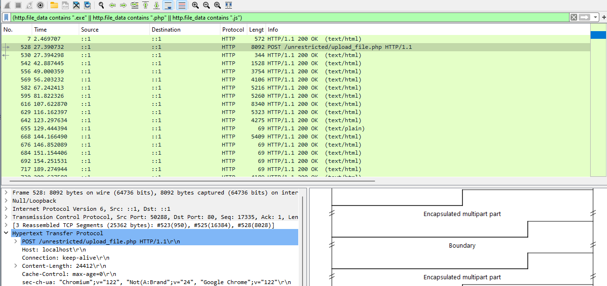

## A05:2021-Security Misconfiguration
A05:2021-Security Misconfiguration (Configuración Insegura de Seguridad): Esta categoría es más relevante para la carga de archivos sin restricciones. Sucede cuando la seguridad no está configurada adecuadamente o está incompleta. Una configuración insegura puede llevar a permitir la carga de archivos sin las restricciones adecuadas, lo que podría resultar en la ejecución de archivos maliciosos, la exposición de datos sensibles, o la afectación de la funcionalidad del sistema.

En resumen, "Unrestricted File Upload" se alinea más estrechamente con problemas de configuración insegura, donde las medidas de seguridad necesarias no están implementadas o están mal configuradas.

https://owasp.org/www-community/vulnerabilities/Unrestricted_File_Upload

## Preparación
Usamos XAMP antiguo y desplegamos los ficheros: upload.php y upload_file.php.

Creamos una carpeta llamada upload que contendrá los ficheros que se suban a través del formulario.


## Fichero upload.php
```
<html>
<body>
	<form action="upload_file.php" method="post" enctype="multipart/form-data">
		<label for="file">Filename:</label>
		<input type="file" name="file" id="file"><br>
		<input type="submit" name="submit" value="Submit">
	</form>
</body>
</html>
```


## Fichero upload_file.php
```
<?php

  if ($_FILES["file"]["error"] > 0)
    {
    echo "Return Code: " . $_FILES["file"]["error"] . "<br>";
    }
  else
    {

    if (file_exists("upload/" . $_FILES["file"]["name"]))
      {
      echo $_FILES["file"]["name"] . " already exists. ";
      }
    else
      {
      move_uploaded_file($_FILES["file"]["tmp_name"],
      "upload/" . $_FILES["file"]["name"]);
      echo "Stored in: " . "upload/" . $_FILES["file"]["name"];
      }
    }

?>
```

## Fichero shell.php
Para que funcione el laboratorio y no irnos a un phpmyadmin muy muy antiguo, (estoy usando phpmayadmin 7) debemos desactivar: magic quotes:
```
set_magic_quotes_runtime(0);
ini_set('magic_quotes_gpc', 0);
```
Estas líneas de código intentan desactivar las "magic quotes" en tiempo de ejecución.

set_magic_quotes_runtime(0);: Esta función está obsoleta y ha sido eliminada de PHP desde la versión 5.4.0. Su propósito era controlar la directiva magic_quotes_runtime en PHP, que automáticamente escapaba los datos provenientes de fuentes externas como archivos y bases de datos.


## Ataque Unrestricted File Upload
Aprovechamos la mala configuración de seguridad para subir una shell:


Como no está securizado apache, podemos ver el contenido de la carpeta de upload del
servidor:


Hacemos click en el fichero shell.php para realizar el ataque. Vamos escribiendo comandos para llegar a la carpeta que contiene el fichero httpd.conf. Cuando estamos en la carpeta apropiada, mostramos el fichero de configuración haciendo click sobre él. Entonces se abre y vemos su contenido en el navegador::


## Sanear el fichero upload_file.php
Vamos comprobando y mostrando avisos, en caso de que no se cumplan las condiciones. Usamos la preg_match que busca similitudes en la cadena. Si encuentra letras mayúsculas y minúsculas, números, el carácter “.”, “_” o el espacio en blanco, devuelve 1 y da por válida la cadena. Si encuentra caracteres que se salen de ese patrón, devuelve 0 y ejecuta las sentencias que muestran un mensaje de error.


Si redirigimos el formulario de subida a este fichero, ahora se puede comprobar que ya sólo permite subir ficheros .pdf y .jpg, no permite un tamaño superior a 2Mb y tampoco permite nombres de fichero con caracteres extraños.


## Análisis con Wireshark del tráfico en el ataque
Debemos enfocarnos en identificar patrones de tráfico que indiquen la transferencia de archivos a través de la red, especialmente hacia servidores web o aplicaciones. Estos ataques generalmente ocurren a través de peticiones HTTP POST, ya que son las que comúnmente se utilizan para cargar archivos en los servidores.

## Filtra por peticiones HTTP que usan el método POST:
Dado que el ataque involucra enviar información a través de un formulario web, lo más probable es que estos datos sean transmitidos mediante una petición HTTP POST con el contenido codificado en application/x-www-form-urlencoded.
```
http.request.method == "POST"
```


## Buscar tipos de contenido de carga de archivos:
Este filtro busca peticiones POST con un tipo de contenido multipart/form-data, que es el utilizado para la carga de archivos en formularios web.
```
http.content_type contains "multipart/form-data"
```


## Identificar extensiones de archivos sospechosas:
Este filtro busca ciertas extensiones de archivos que podrían ser maliciosas.
```
(http.file_data contains ".exe" || http.file_data contains ".php" || http.file_data contains ".js")
```



## Filtering for Web Traffic
The expression http.request reveals URLs for HTTP requests, and tls.handshake.type eq 1 shows domain names used in HTTPS or SSL/TLS traffic.

For web traffic generated by Windows hosts, results from this filter include HTTP requests over UDP port 1900. This HTTP traffic is Simple Service Discovery Protocol (SSDP). SSDP is used to discover plug-and-play devices and is not associated with normal web traffic. We can exclude SSDP traffic in our results by modifying our filter expression to:
```
(http.request or tls.handshake.type eq 1) and !(ssdp)
```


## Recuperar fichero subido del tráfico de red:
Primero debemos encontrar el paquete donde se sube el fichero:
```
http.file_data contains ".php" 
```

Hacemos clic derecho sobre el paquete y seleccionamos "Follow" --> "HTTP Stream". Esto  mostrará todo el flujo de la conversación HTTP en la que se encuentra el fichero subido.


Para guardar los Datos: En la ventana de "Follow HTTP Stream", buscamos el contenido binario de la imagen. Usualmente, encontraremos encabezados HTTP primero, seguidos de los datos binarios del fichero. Seleccionamos solamente la parte binaria y cópiamos.

Para guardar Como Archivo: Abrimos un editor de texto en bruto (como Notepad++ o un editor hexadecimal) y pegamos  los datos binarios. Guardamos este archivo con la extensión apropiada.


## Ver uno de los comandos que se pasaron en el ataque
Repetimos el proceso anterior para ver uno de los comandos que se pasaron en la shell.php. Seguimos la secuencia http del paquete --> "Follow" --> "HTTP Stream":


## Cómo evitar la subida de ficheros maliciosos:
- Usa una white list de extensiones de ficheros permitidas.
- Validar el tiempo de fichero. No confiar en la cabecera Content-Type. Validar mirando el magic number + realizar alguna operación (como redimensionar en caso de fotos).
- Cambiar el nombre del fichero a uno aleatorio, para impedir invocarlo por el atacante.
- Establecer un tamaño máximo para el nombre del fichero.
- Establecer un conjunto de caracteres permitido para el nombre del fichero.
- Tener cuidado con el null byte (%00).
- Tener cuidado con el dobles extensiones (.php.jpg).
- Establecer tamaño maximo para el fichero.
- Permitir la subida sólo a ciertos usuarios autorizados.
- Almacenar los fichero subidos en un servidor diferente. Si no es posible, al menos, almacenarlos fuera de la extructura de directorios de la aplicación web.
- Si los fichero pueden ser accedidos públicamente, mapear un identificador al fichero, para no dar pistas a atancantes.
- Analizar con ativirus o sandbox, los fichero subidos.
- Si el fichero es tratado con elguna librería o módulo externo, debemos asegurarnos que está actulizado y configurado de manera segura.


Sugerencias de OWASP: https://cheatsheetseries.owasp.org/cheatsheets/File_Upload_Cheat_Sheet.html
