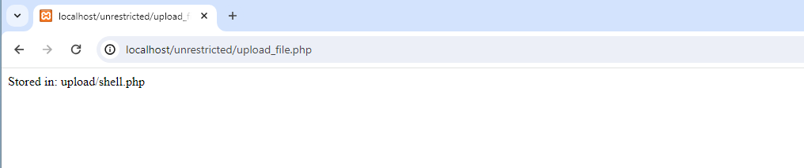
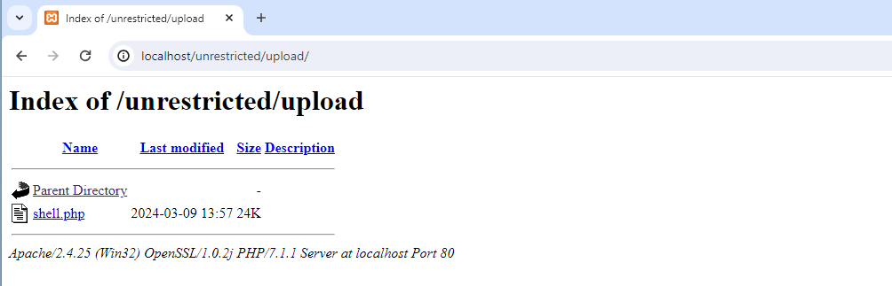
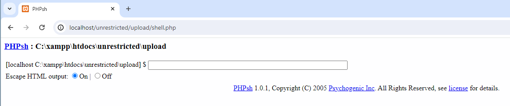
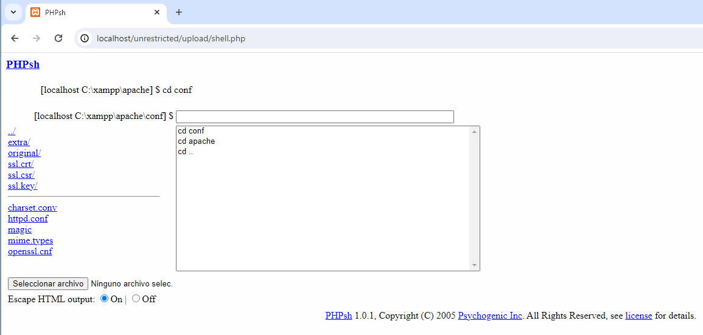
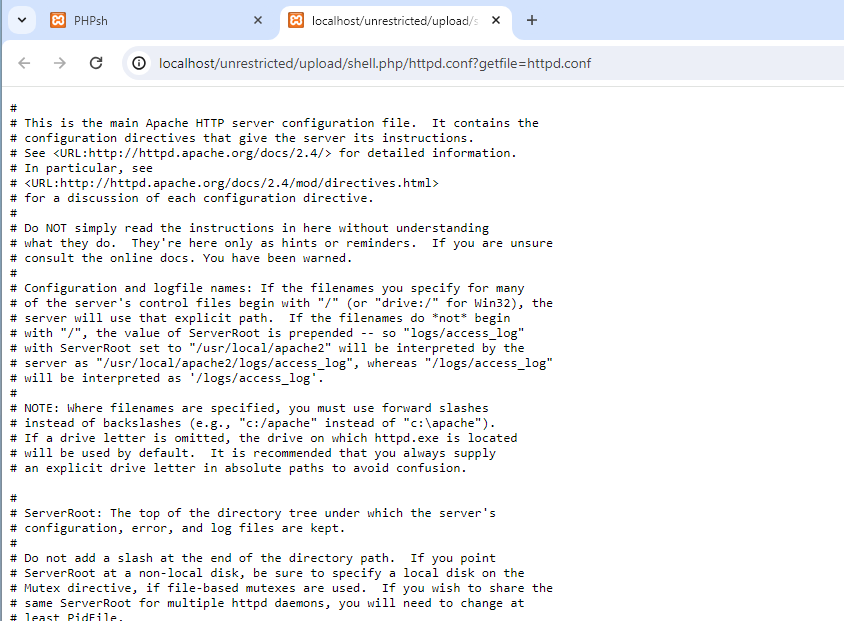
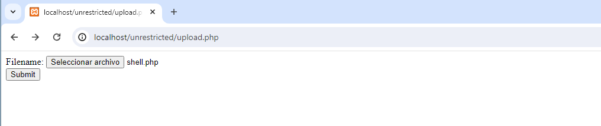

## A05:2021-Security Misconfiguration
A05:2021-Security Misconfiguration (Configuración Insegura de Seguridad): Esta categoría es más relevante para la carga de archivos sin restricciones. Sucede cuando la seguridad no está configurada adecuadamente o está incompleta. Una configuración insegura puede llevar a permitir la carga de archivos sin las restricciones adecuadas, lo que podría resultar en la ejecución de archivos maliciosos, la exposición de datos sensibles, o la afectación de la funcionalidad del sistema.

En resumen, "Unrestricted File Upload" se alinea más estrechamente con problemas de configuración insegura, donde las medidas de seguridad necesarias no están implementadas o están mal configuradas.


## Preparación
Usamos XAMP antiguo y desplegamos los ficheros: upload.php y upload_file.php.

Creamos una carpeta llamada upload que contendrá los ficheros que se suban a través del formulario.


## Fichero upload.php
```
<html>
<body>
	<form action="upload_file.php" method="post" enctype="multipart/form-data">
		<label for="file">Filename:</label>
		<input type="file" name="file" id="file"><br>
		<input type="submit" name="submit" value="Submit">
	</form>
</body>
</html>
```

## Fichero upload_file.php
```
<?php

  if ($_FILES["file"]["error"] > 0)
    {
    echo "Return Code: " . $_FILES["file"]["error"] . "<br>";
    }
  else
    {

    if (file_exists("upload/" . $_FILES["file"]["name"]))
      {
      echo $_FILES["file"]["name"] . " already exists. ";
      }
    else
      {
      move_uploaded_file($_FILES["file"]["tmp_name"],
      "upload/" . $_FILES["file"]["name"]);
      echo "Stored in: " . "upload/" . $_FILES["file"]["name"];
      }
    }

?>
```

## Fichero shell.php
Para que funcione el laboratorio y no irnos a un phpmyadmin muy muy antiguo, (estoy usando phpmayadmin 7) debemos desactivar: magic quotes:
```
set_magic_quotes_runtime(0);
ini_set('magic_quotes_gpc', 0);
```
Estas líneas de código intentan desactivar las "magic quotes" en tiempo de ejecución.

set_magic_quotes_runtime(0);: Esta función está obsoleta y ha sido eliminada de PHP desde la versión 5.4.0. Su propósito era controlar la directiva magic_quotes_runtime en PHP, que automáticamente escapaba los datos provenientes de fuentes externas como archivos y bases de datos.


## Ataque Unrestricted File Upload
Aprovechamos la mala configuración de seguridad para subir una shell:




Como no está securizado apache, podemos ver el contenido de la carpeta de upload del
servidor:




Hacemos click en el fichero shell.php para realizar el ataque:



Vamos escribiendo comandos para llegar a la carpeta que contiene el fichero httpd.conf:



Cuando estamos en la carpeta apropiada, mostramos el fichero de configuración
haciendo click sobre él. Entonces se abre y vemos su contenido en el navegador:




## Sanear el fichero upload_file.php
Vamos comprobando y mostrando avisos, en caso de que no se cumplan las condiciones. Usamos la preg_match que busca similitudes en la cadena. Si encuentra letras mayúsculas y minúsculas, números, el carácter “.”, “_” o el espacio en blanco, devuelve 1 y da por válida la cadena. Si encuentra caracteres que se salen de ese patrón, devuelve 0 y ejecuta las sentencias que muestran un mensaje de error.


Si redirigimos el formulario de subida a este fichero, ahora se puede comprobar que ya sólo permite subir ficheros .pdf y .jpg, no permite un tamaño superior a 2Mb y tampoco permite nombres de fichero con caracteres extraños.

