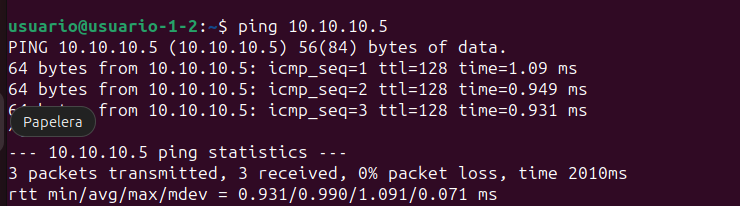
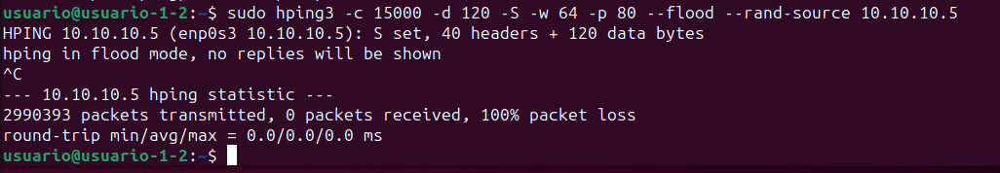
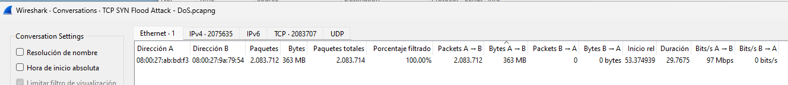
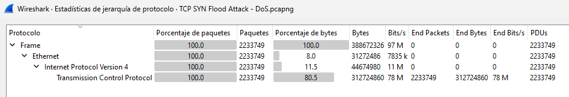

Flood: La palabra "flood" en inglés se traduce al español como "inundación". En el contexto de la tecnología y las redes informáticas, se utiliza para describir una sobreabundancia de datos o solicitudes enviadas a una red o sistema, con el objetivo de abrumarlo y causar una falla o denegación de servicio.

Este laboratorio cuenta con dos máquina virtuales:
- Windows 10 con configuración de la red: red interna. IP 10.10.10.5
- Ubuntu 23.10 con configuración de la red: red interna. IP: 10.10.10.3

Comprobamos que las máquina virtuales se vean haciendo un ping:



En la máquina Windows:
- No hace falta desactivar el antivirus de Windows. Funciona igualmente.
- Abrimor Wireshark  para snifar el tráfico.

En la máquina Linux instalamos hping3 y lanzamos el ataque unos segundos:
```
sudo apt-get install hping3
sudo hping3 -c 15000 -d 120 -S -w 64 -p 80 --flood --rand-source 10.10.10.5
```
Este comando está diseñado para enviar una gran cantidad de solicitudes SYN TCP al puerto 80 de la dirección IP 10.10.10.5, utilizando direcciones IP de origen aleatorias. Este tipo de ataque se conoce como un ataque de inundación SYN y puede utilizarse para sobrecargar un servidor objetivo, potencialmente causando una denegación de servicio para los usuarios legítimos.
-c 15000: Envía 15000 paquetes.
-d 120: Tamaño de cada paquete de 120 bytes.
-S: Establece el bit de SYN en los paquetes TCP, lo que es común en el establecimiento de una conexión TCP.
-w 64: Tamaño de ventana TCP de 64.
-p 80: Número de puerto de destino, 80 es el puerto HTTP estándar.
--flood: Envía paquetes lo más rápido posible sin esperar respuestas.
--rand-source: Utiliza direcciones IP de origen aleatorias.
10.10.10.5: La dirección IP del objetivo del ataque.



Comprobamos en Wireshark el ataque:


```
117	53.374939	113.237.38.92	10.10.10.5	TCP	174	1528 → 80 [SYN] Seq=0 Win=64 Len=120 [TCP segment of a reassembled PDU]
118	53.374939	72.210.92.205	10.10.10.5	TCP	174	1529 → 80 [SYN] Seq=0 Win=64 Len=120 [TCP segment of a reassembled PDU]
119	53.374939	44.242.130.118	10.10.10.5	TCP	174	1530 → 80 [SYN] Seq=0 Win=64 Len=120 [TCP segment of a reassembled PDU]
120	53.374939	33.240.239.31	10.10.10.5	TCP	174	1531 → 80 [SYN] Seq=0 Win=64 Len=120 [TCP segment of a reassembled PDU]
121	53.374939	203.148.209.97	10.10.10.5	TCP	174	1532 → 80 [SYN] Seq=0 Win=64 Len=120 [TCP segment of a reassembled PDU]
```

Dentro de Wireshark --> Estadísticas --> Conversaciones --> Vemos en escasos segundos la cantidad de información que ha recibido:



Dentro de Wireshark --> Estadísitcas --> Jerarqía de Protocolo --> Examinamos el valor estadístico de cada protocolo. La captura de pantalla a continuación muestra un volumen inusualmente alto de paquetes TCP, lo que indica fuertemente un ataque de inundación TCP SYN.


Filtro de wireshark para detectar este ataque:
```
cp.flags.syn == 1 and tcp.flags.ack == 0
```
Ataque SYN Flood: Durante un ataque de inundación SYN, un atacante envía una gran cantidad de paquetes SYN al servidor, pero no completa el proceso de conexión (es decir, no envía el paquete ACK final después de recibir el SYN-ACK del servidor). Esto puede sobrecargar los recursos del servidor, ya que intenta mantener abiertas estas "semi-conexiones", lo que puede llevar a una denegación de servicio para los usuarios legítimos.

Filtro tcp.flags.syn == 1 and tcp.flags.ack == 0: Este filtro está diseñado para capturar paquetes que tienen el flag SYN activado (indicando un intento de iniciar una conexión) pero el flag ACK desactivado (lo que significa que no es una respuesta en el proceso de handshake). En una situación normal, después del primer paquete SYN del cliente, todos los demás paquetes implicados en la apertura de una conexión tendrían el flag ACK activado. Por lo tanto, una gran cantidad de paquetes que cumplen con el criterio del filtro pueden indicar un ataque SYN Flood en curso.
