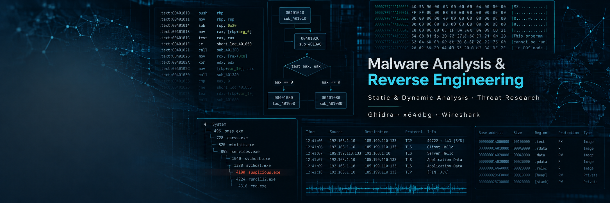

# Cybersecurity Labs & Research

Repositorio de laboratorios, documentación técnica y proyectos desarrollados
durante mi formación y especialización en ciberseguridad.

Mi principal área de interés es el análisis de malware y la ingeniería inversa,
aunque el repositorio también incluye prácticas relacionadas con análisis de
red, ataques a sistemas y seguridad web.

## Áreas

### Malware Analysis & Reverse Engineering
- Static Analysis
- Dynamic Analysis
- Reverse Engineering
- Process Injection
- Packing and Obfuscation
- Anti-Debugging / Anti-Analysis
- Windows API analysis

### Network Security
- Network traffic analysis
- Wireshark
- Investigation of network attacks

### System Security
- Windows security
- Attack investigation
- System exploitation labs

### Web Security
- Web attack analysis
- Security labs

## Tools

- Ghidra
- x64dbg / x32dbg
- Wireshark
- PE analysis tools
- Windows virtual machines
- Linux
- Python

## Repository structure

- `Documentation/` — documentación y apuntes técnicos
- `LABS/` — laboratorios prácticos de ciberseguridad
  - `Investigating Malware/`
  - `Investigating Network Attacks/`
  - `Investigating System Attacks/`
  - `Investigating Web Attacks/`

## Current focus

Actualmente estoy profundizando especialmente en:

- Malware Analysis
- Reverse Engineering
- Process Injection
- Anti-Debugging
- Evasion techniques
- Static and Dynamic Analysis

## Disclaimer

Todo el contenido de este repositorio tiene fines exclusivamente educativos,
de investigación y análisis en entornos controlados.
